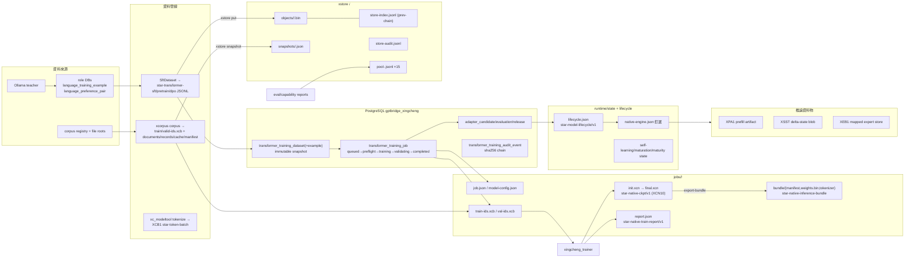

# 星澄 (Xingcheng) Atlas — 架構 / 能力 / 參數 / 資料 四圖

> 範圍：`Standalone tools/local-model/`（tool `local-model`，內含 governed identity `xingcheng`）。
> 事實來源：本 worktree 原始碼逐檔讀取；行號引用僅為定位，實作為準。
> 四語言 lane：**C#** = 治理/編排（`src/backend/csharp/GPTBridge.XingchengLearning`）、**C++** = 模型核心+訓練器+工具（`src/backend/cpp/`、`src/backend/services/xingcheng/infrastructure/native_transformer/`）、**Rust** = 資料/安全面（`src/backend/rust/xstore`、`xcorpus`）、**C** = ABI 面（`xingcheng_engine_c.h`、`xtok_abi.h`）。

---

## 1. 完整架構圖

```mermaid
flowchart TB
    subgraph HOST["主系統 / 啟動層"]
        BE["gptbridge-backend (Rust Tauri)<br/>tools::start_tool / dispatch_command"]
        AUTO["GPTBridge.Automation (C#)<br/>automation-flows.json 驅動"]
        CH["GPTBridge.ChannelHost (C#)<br/>authenticated WS + PG LISTEN/NOTIFY"]
    end

    subgraph TOOL["local-model 工具行程 (GPTBridge.ToolHost.App.exe)"]
        EXEC["LocalModelExecutor (C#)<br/>loopback HTTP /v1 + session token"]
        IPC["xingcheng/runtime/ipc/model-service.json<br/>star-model-service-descriptor/v1"]
    end

    subgraph NATIVE["C++ native 層"]
        MODELTOOL["xc_modeltool.exe<br/>89 modes + serve(JSONL stdio worker)"]
        ENGINE["xingcheng_engine.dll<br/>xc_engine_* C ABI / engine*.h"]
        TRAINER["xingcheng_trainer.exe<br/>star-native-train-job/v1"]
        CUDA["cuda_bridge.cpp / cuda_kernels.cpp<br/>cublas+自寫 kernel (opt-in)"]
    end

    subgraph RUST["Rust 資料面"]
        XSTORE["xstore.exe<br/>content-addressed store + XCN verify"]
        XCORPUS["xcorpus.exe / xcorpus.dll<br/>corpus pipeline + xtok tokenizer ABI"]
    end

    subgraph CSHARP["C# 治理層 (xc-learning.exe)"]
        SL["SelfLearning.cs<br/>cycle + gates"]
        JE["JobExecutor.cs + NativeTools.cs<br/>supervised subprocess lane"]
        EV["Evaluation.cs / Lifecycle.cs<br/>eval gates + star-model-lifecycle/v1"]
        MAT["Maturation300M.cs<br/>ordered capability sequence"]
        RET["Retention.cs"]
    end

    subgraph QUEUE["xct-executor.exe (C#)"]
        FQ["file-queue: req/claimed/done/failed"]
    end

    subgraph EXT["外部依賴"]
        PG["PostgreSQL<br/>gptbridge_xingcheng* schemas"]
        CONSUMERS["model-dialogue ToolHost / NativeModelClient<br/>(C# orchestrator-only consumers)"]
        OLLAMA["ollama-service.exe<br/>teacher distillation (loopback 11434)"]
    end

    BE -->|CreateProcess + injected env| TOOL
    EXEC -->|post-bind write| IPC
    EXEC -->|first /v1/infer → spawn| MODELTOOL
    MODELTOOL --- ENGINE
    MODELTOOL -->|LoadLibrary xtok| XCORPUS
    MODELTOOL -->|extern C xcuda_*| CUDA
    CONSUMERS -->|read descriptor + POST /v1/infer| EXEC
    CONSUMERS -->|NativeLibrary.Load engine_c.h| ENGINE

    SL --> PG
    SL --> JE
    JE -->|job.json + tokenize via| MODELTOOL
    JE -->|--job/--report| TRAINER
    JE --> FQ
    TRAINER -->|XCB1 input| XCORPUS
    SL -->|snapshot pin| XSTORE
    EV -->|eval/capability modes| MODELTOOL
    OLLAMA -->|teacher-collect| SL

    AUTO -.->|self-learning flow (enabled=false)| SL
    CH -.->|request_channel| TOOL
```

### 1a. 行程/二進位清單

| Binary | 語言 | 角色 | 啟動方式 |
|---|---|---|---|
| `GPTBridge.ToolHost.App.exe` | C# | 工具 runtime host（/health、/v1、authenticated WS） | `gptbridge-backend` `tools::start_tool` → CreateProcess |
| `xc_modeltool.exe` | C++ | 89-mode 模型工具 + `serve` JSONL stdio inference worker | ToolHost 首次 `/v1/infer` 惰性 spawn |
| `xingcheng_trainer.exe` | C++ | 唯一訓練執行器（PyTorch 已退役） | `JobExecutor` 受管子行程 / `xct-executor` |
| `xct-executor.exe` | C# | 獨立 file-queue 執行器（req/claimed/done/failed） | `serve` verb，可選路徑 |
| `xc-learning.exe` | C# | ~100+ verbs 治理 CLI（cycle/eval/lifecycle/maturation） | 手動 / AutomationCore flow |
| `xstore.exe` | Rust | 不受信任輸入邊界：XCN verify、content-addressed store、audit chain、failure pool | 子行程（JSON-on-stdout） |
| `xcorpus.exe` / `xcorpus.dll` | Rust | corpus pipeline + `xtok` tokenizer C ABI | 子行程 / LoadLibrary |
| `xingcheng_engine*.dll` | C++ | 行程內引擎（`xc_engine_*` ABI） | NativeModelClient 選用 transport |

### 1b. 關鍵邊界

- **治理邊界**：xingcheng deny `governance-rule, direct-database-write, main-program, other-tools`；manifest `direct_instruction: PERMISSION_DENIED`。
- **部署釘選**：`runtime/settings/native-engine.json::checkpoint` → `xc_modeltool serve --bundle`。未釘選 → `XC_BUNDLE_CHECKPOINT_UNPINNED`。
- **消費者政策**：`csharp-orchestrator-client-only` — 推論僅經 authenticated loopback `/v1/infer` 或 engine DLL。
- **失敗語義**：全 lane fail-closed；typed error codes（`EXECUTOR_*`、`KERNEL_POLICY_DENIED`、`MODE_NOT_REGISTERED`、`XC_*`）。

---

## 2. 完整能力說明圖

```mermaid
flowchart LR
    ROOT["星澄能力域"]

    ROOT --> TRAIN["訓練"]
    ROOT --> INFER["推論/服務"]
    ROOT --> EVAL["評估/閘門"]
    ROOT --> GOV["治理/生命週期"]
    ROOT --> DATA["資料面"]
    ROOT --> HW["硬體/規模"]
    ROOT --> KERNEL["Kernel Registry"]

    TRAIN --> T1["task: pretrain | sft | dpo | grpo"]
    TRAIN --> T2["17 自我探針 probe-all<br/>smoke/gradcheck/maskcheck/headcheck/<br/>rulecheck/depthcheck/poscheck/inputcheck/<br/>gemmacheck/mixcheck/routecheck/dsvcheck/<br/>yarncheck/csacheck/mtpcheck/canoncheck/freezecheck"]
    TRAIN --> T3["canonical-materialize<br/>star-canonical-effective/v1"]
    TRAIN --> T4["model families:<br/>DeltaNet hybrid / GQA / MLA / CSA2 /<br/>MoE(sigmoid+shared+auxfree) / MTP+stack /<br/>Gemma4 / vision early-fusion / YaRN"]

    INFER --> I1["serve line-protocol:<br/>status/load/unload/infer/think/memplan/<br/>depth/moe-analyze/fim/state-save|restore/<br/>prefix-scope|invalidate/prefill/decode-artifact"]
    INFER --> I2["sampling profiles:<br/>precise/balanced/creative/roleplay/story/brainstorm"]
    INFER --> I3["prefix cache / KV int8 / delta-state<br/>CUDA opt-in (bf16/fp8/kv/graph)"]
    INFER --> I4["bundle I/O: import/export-bundle,<br/>quant none|int8|int4|bf16"]

    EVAL --> E1["eval: perplexity+TPS+generation gate<br/>(baseline regression compare)"]
    EVAL --> E2["capability: 10 categories<br/>zh-TW/en/math/code/reading/multi_turn/<br/>context_tracking/instruction/tool_call_format/<br/>expert_routing"]
    EVAL --> E3["maturity ladder L0–L7<br/>structure→fwd/bwd→overfit→pretrain→<br/>generation→dialogue→reasoning→controlled_evolution"]
    EVAL --> E4["probes: parity/precision/bf16-cert/quant-cert/<br/>cache/kv-gather/state-drift/mtp-*/system1-bench"]
    EVAL --> E5["maturation 300M: 11 ordered capabilities +<br/>regression matrix + phase lock"]

    GOV --> G1["self-learning cycle<br/>collect→snapshot→queue→train→eval→<br/>stage/activate→pin→prune"]
    GOV --> G2["lifecycle star-model-lifecycle/v1<br/>+ governed rollback + succession"]
    GOV --> G3["failure pool 15 classes<br/>OPEN/TRAINED/RESOLVED/REGRESSED"]
    GOV --> G4["recovery lane<br/>single-capability staged SFT"]
    GOV --> G5["retention sweep<br/>(lifecycle-pinned fail-closed kept)"]
    GOV --> G6["audit chain (PG + JSONL)<br/>provenance/binary-provenance"]
    GOV --> G7["release-gate / converge-check<br/>~30 ordered steps"]

    DATA --> D1["xcorpus corpus:<br/>registry gate→scan→dedup(MinHash)→<br/>pack→manifest"]
    DATA --> D2["xstore: ckpt-*/put/get/verify-store/<br/>snapshot/audit-*/fail-*"]
    DATA --> D3["PG schemas + role DB collectors"]
    DATA --> D4["teacher-collect distillation"]

    HW --> H1["hw-caps / hw-baseline / probe-cuda"]
    HW --> H2["expert-residency / offload-bench /<br/>expert-store (XEB1)"]
    HW --> H3["scale/low-resource-sim / pd-pipeline /<br/>memory-plan / memplane"]
    HW --> H4["resource governor quota<br/>(8 classes, training shed-first)"]

    KERNEL --> K1["star-kernel-registry<br/>trainer 32 / engine 19 / xstore 11 / xcorpus 8"]
    KERNEL --> K2["star-kernel-policy<br/>deny_variants/deny_kernels/force_serial/<br/>max_threads — fail-closed"]
```



### 2a. xc-learning.exe 能力域（~100 verbs，按面分組）

| 面 | 代表 verbs |
|---|---|
| 循環/任務 | `--run-once [--force]`, `--run-jobs`, `--job`, `--queue-job`, `--status`, `--enable/--disable`, `--self-test`, `--retention` |
| 成熟序列 | `--maturation-status/-freeze/-reopen/-unsupported/-complete/-baseline`, `--thinking-compare`, `--gen-begin/-record/-certify/-promote/-purge/-status` |
| 發布/收斂 | `--release-gate`, `--converge-check`, `--axis-checks`, `--system1-checks`, `--community-checks`, `--capacity-checks`, `--maturity-checks`, `--cuda-plane-checks`, `--silicon-checks`, `--langcheck`, `--verify-audit`, `--db-status`, `--migrate` |
| 追蹤/目錄 | `--trace-record/-status`, `--catalog-emit/-validate`, `--caps-*`, `--provenance-*`, `--binary-provenance`, `--training-run-receipt`, `--mutation-lease-*` |
| 恢復迴圈 | `--self-training-*`, `--failure-*`, `--recovery-dataset-build/-eval/-run`, `--dataset-purity-check` |
| 長程任務 | `--task-create/-plan/-step/-checkpoint/-compact/-resume/-revalidate/-transition/-status` |
| RAG/個性 | `--graph-*`, `--grounded-*`, `--rag-*`, `--persona-*`, `--steer`, `--refusal-*`, `--roleplay-*`, `--memory-*` |
| 規模/效率 | `--scale-*`, `--eff-*`, `--depth-*`, `--capacity-*`, `--residency-plan`, `--trainable-budget`, `--thinking-levels`, `--quantization-validate`, `--expert-*` |
| 訓練加速 | `--training-*`, `--bottleneck-classify`, `--batch-plan`, `--sequence-buckets`, `--speed-gate`, `--distill-*` |
| 工具契約 | `--tool-validate/-gate/-metrics`, `--tool-call-validate`, `--structured-validate`, `--grounded-validate` |

---

## 3. 完整參數圖

### 3a. `job.model` → `ModelConfig`（`xct_util.h:71-574`）

| 分組 | JSON key → 欄位 (預設) |
|---|---|
| 核心 | `vocab_size`→vocab(32000) · `hidden_size`→hidden(512) · `intermediate_size`→inter(1376) · `num_hidden_layers`→layers(6) · `num_attention_heads`→heads(8) · `num_key_value_heads`→kv_heads(8, ≤0→heads) · `max_position_embeddings`→max_pos(4096) · `rope_theta`(1e4) · `rms_norm_eps`(1e-6) · `generation`(僅 `xc-fused-1` 合法) |
| MoE | `moe_num_experts`(0=dense) · `moe_top_k`(2) · `moe_layer_interval`(1) · `moe_aux_loss_weight`(0.01) · `moe_router_sigmoid`(F) · `moe_expert_intermediate_size`(0→inter) · `moe_num_shared_experts`(0) · `moe_shared_intermediate_size` · `shared_expert_gate`(F) · `moe_z_loss_weight`(0) · `moe_auxfree_balance`(F) · `moe_lb_bias_rate`(0) |
| DeltaNet hybrid | `full_attention_interval`(0=dense) · `attn_output_gate`(F) · `qk_norm`(F) · `partial_rotary_factor`(1.0) · `linear_num_key_heads` · `linear_key_head_dim` · `linear_num_value_heads` · `linear_value_head_dim` · `linear_conv_kernel_dim`(4) |
| Gemma4 | `model_type`(gemma4_text\|gemma4) · `layer_types[]` · `head_dim` · `global_head_dim` · `sliding_window_size` · `global_attention_interval` · `num_global_kv_heads` · `k_eq_v_global` · `local/global_rope_proportion` · `local/global_base_frequency` · `final_logit_softcapping` · `use_post_attn/ffw_norm` · `hidden_activation`(gelu_pytorch_tanh) · `num_kv_shared_layers` · `hidden_size_per_layer_input` · `vocab_size_per_layer_input` · `use_double_wide_mlp` · `tie_word_embeddings` · `query_pre_attn_scalar` |
| MLA | `kv_lora_rank`(0) · `q_lora_rank`(0) · `qk_nope_head_dim` · `qk_rope_head_dim` — 與 CSA 互斥 |
| CSA2 | `csa_compress_ratio`(<2 停用, =1 throw) · `csa_topk` · `csa_window_size` · `csa_compress_rope_theta` · `csa_share_group` · `csa_reindex` · `csa_indexer`(T) · `csa_indexer_loss_weight`(1.0) |
| MTP | `num_nextn_predict_layers`(0) · `mtp_loss_weight`(0) · `mtp_stack_depth`(0) · `mtp_stack_loss_weight`(0) |
| YaRN | `yarn_factor`(0) · `yarn_original_max_position_embeddings` · `yarn_beta_fast`(32) · `yarn_beta_slow`(1) · `yarn_attention_factor` |
| Vision | `use_vision`(F) · `vision_patch_dim` · `vision_max_patches` |

**`xc-fused-1` 釘選**（覆寫非合併，`xct_util.h:473-536`）：interval=4 DeltaNet + gated/qk-norm/partial-rotary attention + sigmoid MoE top-2 + shared expert gated + MTP stack ≥1 + vision + YaRN ≥2；排除 MLA/CSA/Gemma4/aux-free/k_eq_v/PLE。

### 3b. `job.train` → `TrainCfg`（`xct_job.h:186-434`）

| key | 預設 | key | 預設 |
|---|---|---|---|
| `lr` | 3e-4 | `weight_decay` | 0.01 |
| `grad_clip` | 1.0 | `beta` (DPO) | 0.1 |
| `warmup_steps` | 0 | `max_steps` | 100 |
| `log_every` | 10 | `checkpoint_every` | 0 |
| `seed` | 42 | `deadline_s` | 0 |
| `lr_decay` | cosine | `init_checkpoint` | — |
| `emit_checkpoint` | — | `overwrite` | F |
| `group_size` (GRPO) | 4 [2,8] | `max_new_tokens` | 8 [1,64] |
| `temperature` | 1.0 | `kl_coef` | 0.02 |
| `reward` | exact\|prefix | `threads` | 0=auto(≤16) |
| `simd` | T | `freeze[]` | glob patterns |

AdamW 內部常數：b1=0.9 b2=0.999 eps=1e-8（不可配）。

### 3c. `job.data`（`xct_job.h:78-184`）

`path`(必要, XCB1 magic-sniff else JSONL) · `format`(sft|pretrain|dpo|grpo|ids) · `max_rows`(10000) · `max_len`(→max_pos) · `pack`(0, 僅 sft/pretrain/ids) · `pack_sep`(-1)。

### 3d. 環境變數

| var | 效果 |
|---|---|
| `XCT_TPU_THREADS` / `XCT_TPU_SIMD=0` / `XCT_TPU_TILE4=0` | 覆寫 train.threads / simd / tile4 GEMM |
| `XCT_KERNEL_POLICY` / `--kernel-policy` | kernel 政策路徑（arg > env） |
| `XINGCHENG_TRAINER_CUDA_OPT` | CUDA AdamW lane opt-in |
| `XINGCHENG_CPP_CUDA` / `_BF16` / `_FP8`(與bf16互斥) / `_KV` / `_GRAPH` / `_KV_INT8` | engine CUDA/量化 opt-in |
| `GPTBRIDGE_POSTGRES_DSN` / `XINGCHENG_SHARED_PG_SCHEMA` | PG 連線/schema |

### 3e. 政策/設定檔

| 檔案 | format | 關鍵欄位 |
|---|---|---|
| `runtime/settings/self-learning.json` | `star-self-learning-policy/v1` | enabled, min_new_examples(24), auto_activate, suites[], max_steps(400), lr(5e-5), quiet_hours 22:00-07:00, min_interval_s, max_cycles_per_day, max_consecutive_failures, inference_exclusion(T), capability_training_frozen(**T**), capability_training_mode, dpo_*, self_training_mode(COLLECT_ONLY), degradation_probe_*, max_synthetic_ratio…（40+ keys） |
| `runtime/settings/retention.json` | `star-retention-policy/v1` | enabled, keep_job_dirs(3), keep_logs_days(30), keep_maturity_reports(10), keep_snapshots(5), keep_weight_versions(1) |
| `runtime/settings/native-engine.json` | — | enabled, checkpoint 釘選, cpu_threads, cpp_cuda, sampling defaults |
| `runtime/settings/kernel-policy.json` | `star-kernel-policy` | enabled, force_serial, max_threads, deny_variants[simd\|tile4\|cuda], deny_kernels[] |
| `runtime/settings/teacher-distillation.json` | `star-teacher-distillation-policy/v1` | enabled(F), teachers{}, prompts[], max_rows(24), quality_score(0.92), temperature(0.2) |
| `xingcheng/runtime/state/*.json` | maturity/maturation/self-learning state | 持久化狀態（state/* 下） |

### 3f. serve 推論參數（`xc_modeltool serve` ops）

`infer`: prompt|messages, sampling_profile(6 presets), temperature/top_k/top_p/repetition_penalty/seed, max_new_tokens(192, ≤2048), persona/narrative/factuality, prefix_scope, mark_claims。`think`: think_steps(≤32), branches(≤8)。engine limits: `set_kv_memory_limit`, `set_prefix_cache_limit`(8 entries/256MiB), CUDA memplane tiers。

### 3g. Governor 配額

8 工作類別（interactive/model/rag/network/batch/maintenance/training/verification）；shed 序 training-first；pressure none/pre/active；`total_quota ≤ logical_cores`；preflight 讀 `resource-governor.json` → `threads=clamp(quota,1,16)`。

---

## 4. 完整資料圖



### 4a. 二進位容器家族

| Magic | format tag | 生產者 | 內容 |
|---|---|---|---|
| `XCN1` | `star-native-ckpt/v1` | trainer `ckpt_save` | versioned config + tensor table (name/dims/f32)，v10 加 mtp 欄位 + gemma4 marker |
| `XCB1` | `star-token-batch/v1` | xcorpus / modeltool tokenize | meta JSON + records{kind(1-4),ids,labels,rej,vision} |
| `XPA1` | `star-prefill-artifact/v1` | engine `prefill_artifact` | token_ids + KV + XSST + logits + sha256 tail |
| `XSST` | （內嵌） | engine | delta-state 子 blob |
| `XEB1` | `star-mapped-expert-store/v1` | expert-store-build | 128B index entries + INT8 expert payloads + sha |

不存在（勿當成既有 contract）：`XDS`/`XCR`/`XST`/`XEV`、`.pt`（退役，fail-closed）。

### 4b. JSONL/JSON artifact 索引（producer → consumer）

| 檔案 | format | 生產者 → 消費者 |
|---|---|---|
| snapshot JSONL | `star-transformer-sft/pretrain/dpo` | SftDataset → trainer data.path |
| documents/records/cache | `star-corpus-file-cache/v1` 等 | xcorpus → capability overlap gate |
| manifest.json (corpus) | `star-pretrain-corpus/v1` | xcorpus → C#/評估 |
| store-index / audit / snapshot | `star-store-index`/`star-audit-log`/`star-dataset-snapshot` | xstore 自鏈 |
| report.json | `star-native-train-report/v1` | trainer → JobExecutor（+resource enrichment） |
| eval/capability report | `star-native-eval-suite`/`star-capability-eval` | modeltool → Evaluation → adapter_evaluation + failure pool |
| lifecycle.json | `star-model-lifecycle/v1` | Lifecycle.cs ↔ 全治理 lane |
| model-service.json | `star-model-service-descriptor/v1` | ToolHost → consumers |
| self-learning.json (state) | `star-self-learning-state/v1` | SelfLearning 自讀寫 |
| model-maturation-300m.json | `star-300m-maturation-state/v1` | Maturation300M |
| runtime-host owner.lock / artifact-registry.json | `star-runtime-host`/`star-artifact-registry` | SiliconRuntime |
| pool-*.jsonl | `star-capability-failure-pool/v1` | C# FailurePool ⇄ Rust xstore（互通） |

### 4c. PostgreSQL 表（`gptbridge_xingcheng`）

`transformer_schema_metadata` · `transformer_training_dataset`（UNIQUE content_sha+snapshot_sha, immutable trigger）· `transformer_training_dataset_example` · `transformer_training_job`（狀態機） · `transformer_adapter_candidate`（partial UNIQUE active）· `transformer_adapter_evaluation` · `transformer_adapter_release` · `transformer_runtime_model_state`（singleton）· `transformer_training_audit_event`（sha256 鏈 + immutable trigger）。

role DBs：`gptbridge_xingcheng_{main,investment,mathematical,coding}.language_training_example` / `language_preference_pair`（唯讀收集）。
identity：`xingcheng_identity.role_data/history/audit`（RLS，`gptbridge_xingcheng_internal` 唯一 role）。

---

## 附錄：format tag 總表（39 個已確認）

容器：`star-native-ckpt/v1` `star-token-batch/v1` `star-prefill-artifact/v1` `star-mapped-expert-store/v1` `star-native-inference-bundle/v1` `star-bundle-provenance/v1`
訓練：`star-native-train-job/v1` `star-native-train-report/v1` `star-native-train-queue-status/v1` `star-transformer-sft/pretrain/dpo/training-database v1` `star-trainer-probe-report/v1` `star-canonical-effective/v1`
評估：`star-native-eval-suite/v1` `star-capability-suite/v1` `star-capability-eval/v1` `star-eval-result/v1`
治理：`star-model-lifecycle/v1` `star-rollback-gate/v1` `star-self-learning-policy/state/v1` `star-retention-policy/v1` `star-model-maturity/v1` `star-300m-maturation-state/v1` `star-capability-baseline-300m/v1` `star-hardware-baseline-300m/v1` `star-model-service-descriptor/v1` `star-capability-failure-pool/v1` `star-teacher-distillation-policy/v1` `star-model-feature-catalog/v1` `star-runtime-host/v1` `star-artifact-registry/v1` `star-native-thinking/v1` `star-native-model-spec/v1` `gptbridge-xingcheng-access/v1`
資料：`star-corpus-file-cache/v1` `star-pretrain-corpus/v1` `star-corpus-run/v1` `star-store-index/v1` `star-audit-log/v1` `star-dataset-snapshot/v1` `star-parameter-freeze-map/v1` `star-parameter-efficiency/v1` `star-silicon-profile/v1` `star-delta-state/v1` `star-fim/v1` `star-inference-memory-report/v1` `star-memory-report/v1` `star-depth-telemetry/v1` `star-native-state/v2` `star-cuda-memory-telemetry/v1`
Registry（無版本後綴，依 rev 199）：`star-kernel-registry` `star-kernel-policy` `star-mode-registry/v1`（歷史） `star-hw-capability/v1`

> 版本政策：新建 contract 不釘版本（`star-kernel-*`）；既有 `/vN` tag 為註冊名稱本體，剝離需法典授權的遷移。
