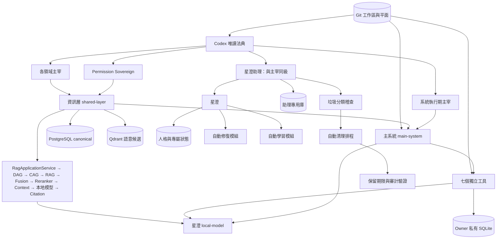
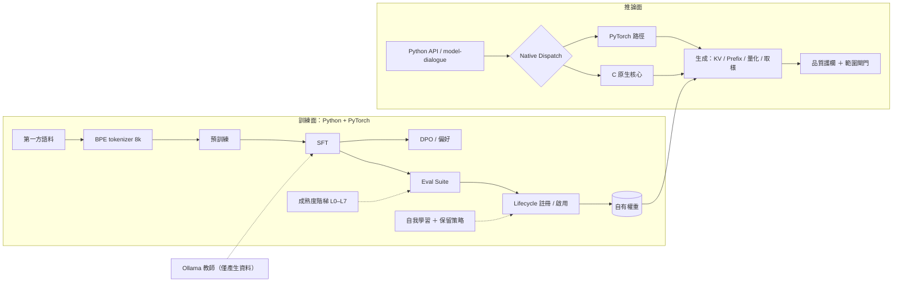
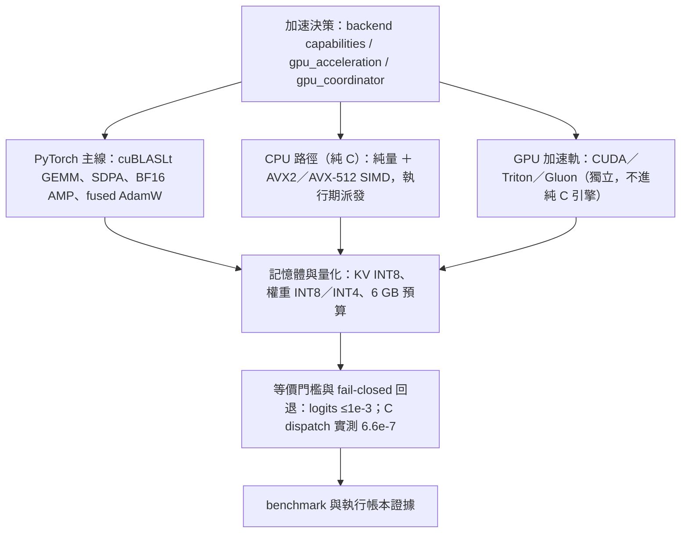

# GPTBridge 全專案暨星澄建置藍圖（整合版）

> 本文件由原《星澄模型四層建置藍圖》擴充整合而成：涵蓋**全專案架構**與**星澄模型**，一份為準。
> 領域權威／證據文件（法典鏡像、契約、定版規則、README）保留原位；**其他藍圖文件已刪除**（內容見 Git 歷史）。

- 日期：2026-09-20（整合版第一版）
- 性質：唯讀盤點報告 ＋ 分期建置藍圖。**本文件不變更任何程式碼、設定或資料。**
- 盤點範圍：`E:\GPTBridge` 全專案；星澄（`Standalone tools/local-model`）為其中的模型層焦點。
- 拓撲權威：元件歸屬一律以 `governance_rule/execution/audit/architecture_registry.json` 為準；
  架構圖以 `governance_rule/codex/architecture-*.md` 為準。
  **本文件為藍圖層整合視圖，不複寫、不取代拓撲權威。**
- **唯一共用藍圖（2026-09-20 定案）**：全工作者共用本檔；**禁止生成其他藍圖文件**；
  所有規劃內容（分期、驗收、缺口、依賴）一律併入本檔；領域文件只維護其領域事實。

---

## 0. 整合來源與閱讀方式

| 原文件 | 領域 | 本文件對應 |
| --- | --- | --- |
| 《星澄模型四層建置藍圖》（本檔前身） | 模型四層 | 第 2、3 章 |
| `governance_rule/codex/architecture-project.md` | 全專案權威圖 | 1.2（引用） |
| `governance_rule/codex/architecture-{git,sql,rag,languages,tool-*}.md` | 各領域權威圖 | 1.2、1.3（引用） |
| `docs/module-topology.md` | A534 工具拓撲 | 1.6 |
| `docs/worktree-architecture.md` | Git 工作區 | 1.5 |
| `docs/sql-inventory-analysis.md` | SQL 盤點 | 1.8、第 6 章 |
| `shared-layer/docs/DATA_OWNERSHIP_CONTRACT.md`、`shared-layer/SQL_ARCHITECTURE_RULES.md` | SQL 資料所有權與定版規則 | 第 6 章 |
| `docs/architecture-evaluation-python-cpp-mixed.md` | Python／C++ 效能評估 | 1.9、4.2 P3 |
| `shared-layer/README.md`、`main-system/README.md` | 層邊界 | 1.7、1.8 |
| `AGENTS.md` | 自動化與模型治理現行章節 | 1.5、2.6 |

---

## 1. 全專案架構藍圖

### 1.1 一句話結論（2026-09-20）

全專案八個面向（治理、啟動、決策、資訊、資料、執行、模型、開發維護）皆已有可運作的實體與登錄；
Git 自動化已由單一 in-process `GitAutomationService` 取代舊行程艦隊（變更尚未提交）；
星澄四層全通，自有權重已由原生引擎在 CUDA 實際服務（執行帳本可驗）；
**下一步的主軸是：落地未提交變更 → 星澄對話品質（L5）→ 工具與推理（L6）→ 受控進化（L7）→ 正式路由與規模化。**

### 1.2 全專案藍圖視圖（Mermaid；權威圖見 codex）



### 1.3 正式資訊路徑（不變）

`Caller → Information Channel → Permission / Scope → RagApplicationService → DAG Planner / Executor → CAG Gate → RAG Retrieval（Hybrid / Code / Memory / Agentic）→ Evidence Fusion → Reranker → Context Builder → Local LLM → Citation Validation → Result`

DAG 是查詢、索引與修復工作流的無環編排面，不取代 Application Service；
CAG 是安全、有版本、有範圍且非權威的快取增強面，不取代 RAG；
RAG 是 canonical knowledge retrieval 面。Qdrant 與 PostgreSQL canonical 邊界不變，SQLite 只准 degraded fallback。

### 1.4 資料平面（不變）

Git 管來源與歷史；PostgreSQL 管已宣告的中央正式狀態；Qdrant 僅保存語意候選；
SQLite 僅保存 owner 私有狀態與有界降級資料；模型只負責推論。

### 1.5 Git 平面與自動化

- 工作區：`main`、`.worktrees/git`、`.worktrees/local-model`、`.worktrees/rag`、`.worktrees/ui`（另有 `.kilo` worker 工作區）。
- **GitAutomationService**（`main-system/src-core/tasks/git_automation.py`，本次盤點時尚未提交）
  已在啟動執行器 normal-information 階段啟動（`app.git_automation`）：
  - 每 60 秒 commit sweep（指紋需先穩定 60 秒）；
  - 每 300 秒 sync cycle（commit → merge worker branches → audit → fast-forward）。
- 舊 `automation_supervisor` 行程艦隊退役；`scripts/git-supervisor.py` 仍可用但非預設。
- 鎖、merge/rebase 守衛、audit、no-push 規則留在 `governance_rule/execution/git_tiers/`；coordinator 才會 push `main`。
- 狀態：`main-system/runtime/state/git-automation.json`。

### 1.6 獨立工具（A534：七個）

| 工具 | 路徑 | 生命週期（Registry） | 備註 |
| --- | --- | --- | --- |
| local-model（星澄平台） | `Standalone tools/local-model/` | on-demand | 含 `xingcheng` 與嵌套 `model-dialogue` |
| model-dialogue（star-chat） | `local-model/model-dialogue/` | on-demand | 主系統內的獨立工具；host/runtime owner = `xingcheng` |
| ai-assistant | `Standalone tools/ai-assistant/` | on-demand | |
| investment-mobile | `Standalone tools/investment-mobile/` | on-demand | Registry 角色為 development-maintenance |
| ai-collaboration | `Standalone tools/ai-collaboration/` | on-demand | 受治理網路通道（星澄研究用） |
| file-sorter | `Standalone tools/file-sorter/` | on-demand | |
| vaultly | `Standalone tools/vaultly/` | on-demand | |

非獨立工具：

- `system-rescue`：主系統內部服務（集中修復、封裝器；以工具 ID 分隔修復資料庫）。
- `global-cleaner`：**retired**、非執行；身分與稽核紀錄保留為證據，自動清理由主系統內部服務承接。
- `business-logic-csharp`：本次新登錄（execution / standalone-service），依賴 `local-model`、`shared-layer`；工具隔離政策 512 MB。
- 星澄助理（xingcheng-assistant）：與主宰同級之獨立特權機構（UI 抽屜 ＋ 專用資料庫）。

### 1.7 主系統（`main-system/`）

- `src-ui`：Electron main/preload ＋ React renderer；星澄助理抽屜（`AppXingchengDrawer.tsx`）。
- `src-core`：
  - IPC `127.0.0.1:8765`；WebSocket 命令路由、治理請求轉接、工具生命週期 broker。
  - `core_system/`：53 個登錄模組、12 群組（module registry v1.02000）；每個模組 ≤3 公開入口、≤12 authored callables、≤500 effective lines（A430/E160）。
  - `core_system/rag/`：RAG 實作齊備（`service/`、`dag/`、`cag/`、`retrievers/`、`orchestration/`、`lifecycle/`、`pipeline*`、`a549_benchmark.py`）。
  - `tasks/`：含新 `git_automation.py`、`model_service_activation.py`（懶啟動星澄）。
  - 啟動執行器：`startup_executor_phases.py`（本次新增 `app.git_automation` 階段）。
- 工具隔離政策 `config/tool-isolation-policy.json`：新增 `business-logic-csharp` 512 MB、
  `native-compute-core` 1024 MB、`model-training` 4096 MB；`local-model` 2048 MB（既有）。
- 生命週期規則：工具視窗採前景生命週期，關閉即終止程序樹；治理核准的無介面常駐服務除外。

### 1.8 資訊層（`shared-layer/`）

- `database/`：PostgreSQL canonical、migration（058 優先佇列、087 安全、113 工作流…）；SQL 盤點見 `docs/sql-inventory-analysis.md`。
- `adaptive/`：有界控制面（admission、動態 pool/batch、retry、breakers、maintenance、cost gate、SQLite fallback、Qdrant budgets）；
  envelope pool 2–8、batch 50–500、reconcile 1–2；transport 優先佇列（critical / interactive / background / maintenance）。
  - **未提交**：`gpu_coordinator.py`（GPU 維度：`torch.cuda.mem_get_info` ＋ `nvidia-smi` 雙源、fail-closed、訓練/推論優先級）。
- `security/`：DSN 目的分離、session identity、credential metadata only、rotation with grace、generation fence、SQLite/Qdrant scopes、least-privilege 認證。
- `workflow/`：Saga（PostgreSQL 為權威）、冪等步驟與補償、leases、outbox/inbox、publish barrier、atomic writes、transaction guard。
- `performance/`：`native_dispatcher`（A219 契約）與各項基準（parser / vector / transformer / native_core / regression）。
- `contracts/`、`local/`、`observability/`。

### 1.9 原生核心（C）與推論引擎（C++）——語言分層

- 定案（2026-09-20）：語言責任依 §1.11 四語言定位。**C 核心引擎層維持純 C**
  （tensor 基礎運算、SIMD、記憶體管理、CPU kernel、穩定 C ABI）；**C++ 承接原生推論執行層**
  （Transformer 推論、模型載入、KV Cache、Sampling、資源管理）；先前「引擎元件全部純 C」的過渡決定已被取代。
- `native/core/`：`parser.c`、`vector.c`、`transformer.c`、`memory.h`（純 C，AVX2＋FMA）。
- `native/bridge/gptbridge_native.c`（sole C ABI thunk，A221/E186，純 C）、
  `native/include/gptbridge_native.h`（sole public C header）。
- Registry：`native-compute-core`（build-tooling / resident，依賴 `governance_rule`）。
- 推論派送以 A219 契約組合 C 原生 `matmul`／`softmax`；**訓練路徑永不派送**；parity 逐形狀驗證快取；ABI 例外回退純 Python。
- **引擎層現況**：權重加載、分詞、解碼、注意力、推理解析仍在 Python；目標為 C++ 推論執行層（§4.2 P3b–P3f）。
- **worktree 資產**：`parser.cpp`／`vector.cpp`／`transformer.cpp`／`memory.hpp`／`simd.hpp` 為 C++ 變體，
  可作為 C++ 推論層的參考；C 核心以主樹 `.c` 為準，不得與 C++ 核心混用。
- 綁定：C++ 引擎對 Python 的綁定可用 pybind11（C++ 層內合法）；**C ABI（`gptbridge_native.h`）仍為 C 的穩定邊界**。
- 附帶清理（G17）：無引用的舊 `_gptbridge_native…pyd` 需處置；`dispatch.py` 標籤 `c++-native-core` 改為引擎用語。

### 1.10 啟動、腳本與文件

- `launcher/`：啟動狀態儲存（`startup-journal.jsonl`、`orchestrator-report.json`）；啟動閘門依環境、runtime 探測與治理稽核。
- `scripts/`：`resource-governor.py`（CPU/記憶體調節）、git 工具（gate / worktree sync / self-commit）。
- `docs/`：module-topology、worktree-architecture、sql-inventory-analysis、architecture-evaluation-python-cpp-mixed。

### 1.11 跨語言定位與責任（2026-09-20 定案）

> 口訣：**Python 開發訓練、C++ 正式推論、C 核心引擎、C# 業務編排。**

| 語言 | 正式定位 | 主要責任 |
| --- | --- | --- |
| Python | 開發與訓練層 | PyTorch、Autograd、Pretraining、SFT、MoE 訓練、權重匯出 |
| C++ | 正式推論層 | Transformer 推論、模型載入、KV Cache、Sampling、資源管理 |
| C | 核心引擎層 | Tensor 基礎運算、SIMD、記憶體管理、CPU Kernel、穩定 C ABI |
| C# | 業務編排層 | 模型選擇、任務調度、生命週期、資源預算、狀態管理 |

- 說明：本定位取代先前的「引擎元件全部純 C」過渡決定（2026-09-20 同日）。
- 邊界：C ABI 是 C／C++ 的唯一穩定介面；**C++ 不得滲入 C 核心層**；Python 只負責訓練與匯出；
  C# 承接業務編排（現況多數仍在 Python／`business-logic-csharp`，需分階段導入，見 §4.2 P7）。
- 跨語言只經已登錄、已版本化契約（codex architecture-languages）；語言邊界不改變資料、權限與決策所有權。
- GPU 加速技術（CUDA／Triton／Gluon 等）為**獨立加速軌**，不屬四語言分層；
  不得因此讓 C 核心承載 GPU 核心或 C++（§5.5）。

---

## 2. 星澄盤點（四層模型）

**星澄定位與目標（2026-09-20 定案）**

- 目標：**聽懂命令**（繁中為主；保留原句，抽取意圖／動作／對象／參數／限制）＋**可與使用者聊天**
  （多輪對話、指令遵循、合理回答，而不是只複述訓練資料）。
- 主線：推論以原生模型服務對話與命令理解；**Ollama 僅教師與專家**，不取代星澄神經網路核心。
- 現階段門檻：成熟度 **L5**（多輪對話與指令遵循）；命令理解以 `star-semantic-plan/v1` 欄位
  與既有 `繁體中文命令理解流程.md` 對齊。
- 延伸：L6 推理與工具使用、L7 受控進化；破壞性操作維持安全閘門（歧義即 `SAFE_CONFIRMATION_REQUIRED`，不執行）。
- 路由：A541 對話自動路由預設星澄第一候選；本地模型預設關閉（A540），由使用者開關啟動。

### 2.1 Base Model

- 自有權重：lifecycle `xingcheng-native` 共 **12** 個權重版本；`active_weights_version = 12`
  （job `star-transformer-job-43862f2bc24945b3844d5e99`，81,808,128 參數，sha256 `45ded8e8…`）；狀態 `INSTRUCT_READY`。
- 原生引擎：`runtime/settings/native-engine.json` `enabled=true`、checkpoint 指向 v12、`quantization=none`、
  取樣與護欄已設；執行帳本 `xingcheng/runtime/logs/native-engine-executions.jsonl`（device=cuda、
  `third_party_foundation_weights=false`、`loopback_runtime_used=false`，2026-09-20）。
- 架構選項（`XingChengConfig`）：small ~5M、medium ~27M、base ~100M、xlarge ~500M、large ~1.2B；
  MoE 變體：small ~20M／act ~7M、medium ~146M／act ~44M、base ~497M／act ~157M、xlarge ~2.9B／act ~842M、large ~6.9B／act ~2B。
- **架構方向（2026-09-20 定案）：使用 MoE（稀疏專家）**。`XingChengMoE` 已具 token-choice top-k 路由、
  SwiGLU experts、aux loss＋z-loss、路由指標（expert load／entropy／utilization／collapse）；
  `transformer_block` 以 `use_moe`＋`moe_layer_interval` 掛載。推論目前為逐專家 Python 迴圈（稠密執行），
  稀疏執行與專家權重管理待建（R5／P3d／P3f）。
- 訓練面：Python ＋ PyTorch（§1.11）；C 核心引擎承接 tensor／SIMD；C++ 承接正式推論。
- tokenizer：自有 byte-level BPE 8,192（`xingcheng-bpe-8k`，`tokenizer.json` ＋ manifest）；
  chat 角色標記為文本層 `<|system|>`／`<|user|>`／`<|assistant|>`／`<|tool|>`／`<|eot|>`（硬 token-ID 綁定屬 tokenizer v2）。

### 2.2 Pretraining

- 語料：第一方來源 **866 篇／14.50M 字元**；`xingcheng/runtime/corpus/{train.jsonl,val.jsonl,manifest.json}`
  （manifest 含每檔 sha256；dataset_id 內容定址、license、language、token_count）。
- 已完成：v0（5,048,576 參數、4.10M tokens、val ppl 104.88）；v1-gpu（32.7M tokens、val ppl 20.04）。
- **MoE 主線（2026-09-20 定案）**：`medium_moe` 145,793,536 參數曾啟動（日誌至 step 250，loss 3.60、
  bf16、~620–760 tokens/s）；smoke 60 步（ppl 1,003.0）；`xingcheng-medium-moe-v1/` 目錄為空、
  日誌所列 smoke checkpoint 不存在。重啟條件：語料量、路由平衡（aux loss／entropy／無坍塌）、
  學習率與步數計畫（Phase 9）。
- 缺口：正式規模的語料治理與詞表擴充（32k／64k 配比）、可重現的預訓練報告。

**完整預訓練資料管線（2026-09-20 定案）**

> 訓練資料必須**可追蹤、可驗證、可重現**；未授權與機密資料不得自動進入訓練集。

| 元件 | 現況核對（`training/corpus.py`） | 設計要求 | 驗收 |
| --- | --- | --- | --- |
| Corpus Registry | 無（來源寫死於 `DEFAULT_SOURCES`） | 來源登錄檔：來源 id／路徑／擁有者／授權／語言／敏感級別／啟用狀態 | registry 可查；未登錄來源不得進入 |
| Dataset Version | manifest 無 `dataset_version` 欄（docstring 有、實作缺） | `dataset_id`（內容定址）＋`dataset_version`（版本序列） | 欄位齊備且可重現 |
| Language Classification | 僅全域 `language: zh-TW+en+code` | 逐文件語言分類（zh-TW 主、en、code、math、science、general、reading）＋統計 | 每文件標記；配比報告 |
| Source Tracking | 每文件 `source` 路徑＋sha256 | 來源模組／檔案／範圍／取得時間／授權 | 任一文件可反查來源與授權 |
| License Validation | 無（`license` 為常數） | 以 registry 驗證授權；未授權即拒收（fail-closed） | 拒收事件與審計 |
| Unicode Normalization | 僅 BOM／換行／空白整理（**無 NFC**） | NFC 等安全正規化；**保留原始 ↔ 正規化映射**；程式碼／路徑／專有名詞／語意不得破壞 | 映射可還原；等價測試 |
| Document Deduplication | 僅 sha256 精確去重 | 精確＋近似去重（指紋／相似度門檻），保留來源關係 | 去重率與碰撞檢查 |
| Sequence Packing | 於 `pretrain.py`（packed blocks） | 管線化：packing 設定與產物入 manifest（block size／EOS 策略） | 可重現的 packed 產物 |
| Training / Validation Split | 已有（sha256 前 8 碼 5‰） | 固定演算法＋版本記錄；防洩漏（同源文件不跨 split） | split 可重現、無洩漏 |
| Token Count | 可選（傳 tokenizer 時計算） | 一律計算並綁定 tokenizer 版本／雜湊 | `token_count`＋tokenizer sha256 |
| Dataset Integrity | 檔案 sha256（manifest） | 資料集根雜湊＋驗證 CLI＋完整性報告 | 篡改可偵測；驗證指令 |

**語言方向與配比（目標）**：繁體中文為主，其次英文、程式語言、數學、科學、一般知識、閱讀理解；
配比門檻於 DG-3（語言分類）產出統計後定案。

**排除規則（fail-closed）**：

- 不得自動加入：法典機密（zh-TW 鏡像五份 part 與 codex DB）、權限資料（permission directory／角色憑證）、
  星澄私有輔助通道、runtime 狀態與稽核日誌、未授權外部資料。
- **現況警示**：預設來源含 `governance_rule/codex`，且 `.txt` 在允許後綴內，會把機密 zh-TW 鏡像納入語料
  → 需立即以來源 allowlist／denylist 修正（DG-4／DG-5）。
- 原始 ↔ 正規化映射：以偏移或並存欄位保存；正規化不得改寫程式碼區塊、路徑、專有名詞與數值。

### 2.3 Post-training

- SFT：`training/sft.py`（prompt-masked loss、AMP、可續訓）；governed job 鏈 `queued → preflight → training → validating → completed`。
  - **chat-foundation-v1**：100 筆（90/10）、400 步 CPU、train loss 6.62 → 0.004、**val ppl 2.53**、349.5s。
  - **chat-foundation-v2**：211 筆（189/22）、400 步；撰寫本文件時進行至 step ~280（eval@200 ppl 3.02）。
- 教師蒸餾：419 筆合格對話樣本（377/42；snapshot sha256 `39463352…`），教師為 loopback Ollama（`glm4:9b`、`rnj-1:8b`）；
  教師權重永不進入推論路徑。
- 偏好訓練：`language_preference_pair` 已上線；`training/dpo.py`（beta-anchored logsigmoid、凍結 reference、completion-masked log-prob、可續訓）。
- 工具呼叫：`tool_call_format.py`（`star-tool-call/v1`，確定性標記、有界驗證、SFT 相容）。
- Adapter 治理：`candidate → validated → staged → active`；activate 只動 adapter 指標，`automatic_weight_replacement` 恆 0。
- 評估：`native_eval_suite.py`（`star-native-eval-suite/v1`）；lifecycle `evaluation_report` v1/v2
  （perplexity **310.05 / 296.29**，suite `star-native-eval-v1`）。
- MoE 後訓練：chat-foundation 系列目前為稠密 81.8M 骨幹；MoE 骨幹的 SFT／DPO 排入 Phase 9，
  需附路由穩定性檢查（entropy／負載均衡／無坍塌）。
- 缺口：L5 對話品質（回合邊界、逐字複誦、限定回答、多輪記憶）、L6 推理＋工具呼叫樣本、L7 受控進化實測；
  eval suite 與 SFT 驗證分佈落差大（~296–310 vs 2.53）需對齊。

**Next Token Prediction 正確性測試（2026-09-20 定案）**

> 訓練必須具備正確的自迴歸關係：Input `A B C D` → Target `B C D EOS`；
> 模型在預測位置 t 不得取得任何 >t 的資訊。

現況（已核對）：`modules/model.py:_causal_lm_loss` 為標準 shift by 1（`logits[..., :-1]` 對 `labels[..., 1:]`）、
`ignore_index=pad_id`、`F.cross_entropy`（reduction 預設 mean）；`training/data.py` padding 以 `pad_id` 填、
`attention_mask` 標有效位；`training/sft.py` 以 `pad_id` 遮蔽 prompt／padding。
既有測試已有因果性（有／無 mask）與 KV 因果一致性；**尚無 NTP 專項矩陣**。

測試矩陣（NT-1–NT-12，獨立測試檔 `tests/test_ntp_correctness.py`）：

| 編號 | 檢查 | 方法 | 通過條件 |
| --- | --- | --- | --- |
| NT-1 | Sequence Shift | 固定序列（A B C D）斷言位移對位 | target[t] = input[t+1]；末位 target = EOS |
| NT-2 | Input / Target IDs | 形狀與 dtype、位移關係 | (B,S) long；無 off-by-one |
| NT-3 | Attention Mask | padding 位 0、內容位 1 | 與長度一致；padding 不參與注意力 |
| NT-4 | Causal Mask | 改尾端 token，前段 logits 不變（有／無 mask） | 差異 = 0 或 <1e-6 |
| NT-5 | EOS Handling | EOS 入目標；packed blocks 邊界 | EOS 計入；跨文件不互相學習 |
| NT-6 | Vocabulary Range | 所有 id ∈ [0, vocab)；tokenizer vocab == model vocab | 越界即 fail |
| NT-7 | Ignore Index | `pad_id` 為 ignore_index；手算對照 | 遮蔽位不進 loss；數值一致 |
| NT-8 | Label Mask（SFT） | prompt／padding 遮蔽；僅 assistant 內容計 loss | 遮罩位不進 loss |
| NT-9 | Cross Entropy | 固定 logits／labels 手算 mean CE | 與 `F.cross_entropy` 一致 |
| NT-10 | Loss Reduction | mean 只除有效 token 數 | 與「排除 padding」手算一致 |
| NT-11 | Target 不可讀取 | 改 target 值檢查同位置 logits 不變 | 逐位相同（無洩漏） |
| NT-12 | Tokenizer 一致性 | checkpoint 內嵌 vs runtime：同 artefact／sha256；round-trip | 完全一致 |

驗收：NT-1–NT-12 全綠；**負向測試**（注入 padding 不得改變 loss；越界 id 必須 fail；target 改動不得影響 logits）
必須通過；測試獨立（不依賴服務路徑）、固定 seed、CPU 可跑。

**Small Model 訓練基線（2026-09-20 定案）**

> 第一個正式基線以現有 **small 5M Dense** 為對象；**先 overfit 再正式訓練**；
> 訓練品質不只看 Training Loss。

檢核（12 項）：從零初始化（固定 seed、記錄結構與參數量）／可接受訓練資料（corpus train-val、tokenizer 綁定）／
Backward 正常（全參數有梯度）／Optimizer 可更新權重（step 後權重變化、logits finite）／Loss 可下降／
Checkpoint 可儲存（含 sha256）／Checkpoint 可恢復（續訓：optimizer 與 step 還原、loss 連續）／
可獨立生成 Token（不依賴外部模型、greedy 確定性）／**Overfit Test 先行**（固定小資料集：loss ≤ 0.5 或 ≤20% 初始值，測後還原）／
正式訓練（固定 seed、資料版本、預算）／指標完整／**反背誦**。

指標（每項落報告）：Training Loss｜Validation Loss｜Perplexity｜Tokens Per Second｜
GPU Memory（峰值）｜Training Time｜Gradient Norm（裁切前）。

反背誦規則：

- 必須同時看 Validation Loss 與**未見提示**生成；train 下降但 val 停滯／上升超過容忍 → 標記 overfit，不得宣稱基線通過。
- 未見提示探針（非訓練語料問題）輸出須足量、多樣、非退化（對齊 L4 探針精神）。

驗收：12 檢核全過（含 overfit 先行）；7 指標齊備且可重現（seed／資料版本／tokenizer sha／checkpoint sha）；
反背誦成立；報告格式 `star-native-baseline/v1`（含環境、命令、結果）。

現況（已核對）：`pretrain.py` 已記錄 loss／val／perplexity／tokens/s／elapsed；**缺 GPU memory 與 gradient norm 數值**
（`grad_clip` 有、未記錄裁切前 norm）；checkpoint 續訓已具；overfit smoke 已有先例（Phase 0）。

### 2.4 Inference System

- 取樣：per-request `temperature` / `top_k` / `top_p` / `seed` / `repetition_penalty`；同 seed 逐字確定性。
- KV cache：prefill／decode／update／position／causal／GQA layout 六項測試鎖定；
  FP32／FP16／BF16／INT8（per-token、per-head 對稱量化）；實測 384 tokens：BF16 +0.007%、INT8 +0.025%，
  KV 記憶體 624 → 312 → 166 KB。
- Prefix cache：`inference/prefix_cache.py`（`PrefixKVStore`；僅 batch_size=1、完整前綴比對、LRU、fingerprint）
  已實作並具 `generate` 接點；**正式驗收與跨請求重用證據待補**。
- 量化推論：INT8／INT4（真 4-bit packing，兩值/byte）；engine `quantize=8/4` ＋ `XINGCHENG_NATIVE_QUANTIZATION`。
- 原生派送：`execution/dispatch.py`（純 C 原生 matmul＋softmax 組合因果注意力；CPU、無 mask、因果、
  不需梯度、形狀 parity；等價差異 6.6e-7；`-1e30` 有限遮罩避免 NaN）。
- Triton kernels：RMSNorm／SwiGLU／RoPE 預設關閉（無 autograd、品質未勝 PyTorch），需 `set_triton_kernels(True)` 顯式開啟。
- GPU／CPU 資源：GPU 優先；CPU 執行緒上限與 `cpu_max_new_tokens`；訓練 CLI `--cpu-threads`。
- 自動釋放（未提交）：`execution/auto_release.py`（閒置 300s 卸載、>80% 記憶體或 >95% VRAM 立即釋放、弱引用追蹤）；
  待接線引擎生命週期。
- 硬體加速引擎（本機 RTX 3050 6 GB／Ryzen 7 7800X3D AVX-512）：見第 5 章（ACC-1～ACC-4）。
- 引擎層現況：權重加載（`checkpoint.py`）、分詞（`tokenizer.py`／`bpe.py`）、解碼（`inference/generate.py`）、
  注意力（`modules/attention.py`）、推理解析（`chat_format.py` 與 tool-call 格式）皆為 Python；
  目標為 C++ 推論執行層（§4.2 P3b–P3f），核心運算續用 C 核心。

### 2.5 星澄治理模組

| 模組 | 格式／位置 | 現況 |
| --- | --- | --- |
| 自我學習 | `star-self-learning-policy/v1`（`runtime/settings/self-learning.json`） | enabled、min_new_examples 24、auto_activate true、suite `star-native-eval-dialogue-v1`、device cuda、max_steps 400；watcher 以 pid 常駐；**尚無完成循環紀錄**（state 檔未生成）；循環尾端接保留策略 |
| 成熟度 | `star-model-maturity/v1`（`maturity.py`） | 八級階梯 L0–L7，只以實測決定；目前 **L4 認證**（checkpoint `chat-foundation-v1/final.pt`；report `maturity-20260920-132413.json`） |
| 保留策略 | `star-retention-policy/v1`（`runtime/settings/retention.json`） | enabled；job dirs 3、logs 30d、reports 30d、maturity／self-learning reports 10、snapshots 5；永不刪 lifecycle 引用或 native-engine pin 路徑；刪除記於 `retention.jsonl` |
| 生命週期 | `star-model-lifecycle/v1`（`lifecycle.py`） | 11 狀態、非法轉移 fail-closed、權重永不覆蓋、rollback 指回、原子持久化；目前 `INSTRUCT_READY`、權重 v12 |
| 自動釋放 | `execution/auto_release.py`（未提交） | 設計已落地；未接線引擎生命週期 |
| GPU 協調 | `shared_layer.adaptive.gpu_coordinator`（未提交） | 雙源查詢、優先級、逾時 fail-closed；未接入訓練／推論呼叫點 |
| 人格／身分 | identity 儲存（受治理，版本與稽核） | 對話設定人格、伺服器端注入、對話視窗無人格編輯器 |
| 路由政策 | A540 / A541 | 本地模型預設關閉、使用者開關；對話自動路由預設星澄第一候選，不可用才依備援順序轉用 |

**統一模型成熟度（`star-model-maturity/v1`，2026-09-20 定案）**

| LEVEL | code | 定義 | 實測閘門（現行） |
| --- | --- | --- | --- |
| 0 | `structure_init` | 模型結構可初始化 | 結構初始化、參數全 finite |
| 1 | `forward_backward` | Forward／Backward 正常 | forward loss finite、全參數有梯度、optimizer step 後 logits finite |
| 2 | `overfit_small` | 小資料集成功過擬合 | 固定 8 樣本：loss ≤ 0.5 或 ≤ 20% 初始值（測後還原權重） |
| 3 | `effective_pretrain` | 完成有效語料預訓練 | held-out ppl ≤ 25% × vocab_size（對齊 random-uniform 基線） |
| 4 | `generation` | 具備獨立語言生成能力 | ≥75% 探針產生足量、多樣、非退化文本 |
| 5 | `dialogue_instruction` | 多輪對話與指令遵循 | ≥75% 對話探針（回合邊界、逐字複誦、限定回答、多輪記憶） |
| 6 | `reasoning_tools` | 可驗證推理與工具使用 | 算術／比較可驗證＋`<tool_call>` schema 合法，通過率 ≥50% |
| 7 | `controlled_evolution` | 受控持續學習與版本演進 | kill-switch fail-closed＋lifecycle register／activate／rollback＋受管升級證據 |

原則：

- **成熟度必須由實際測試決定**；等級須連續通過，首個 `fail`／`skipped` 即封頂。
- **參數量（及資料量、步數等規模指標）只作證據，不得自動提高成熟度**。
- 目前認證：**L4**（checkpoint `chat-foundation-v1/final.pt`；report `maturity-20260920-132413.json`）。

**模型訓練成熟度分級（2026-09-20 定案）**

> 分級以**模型配置**為軸，定義「訓練目標、資源預算、附加驗收」；
> 成熟度認證仍由 L0–L7 實測決定（不變式 #14），分級本身不構成成熟度。

| 訓練分級 | Dense 配置 | MoE 配置 | 目標成熟度 | 訓練內容 | 附加驗收 | 現況 |
| --- | --- | --- | --- | --- | --- | --- |
| T1 輕量 | small ~5M；medium ~27M | small_moe total ~20M／act ~7M | L0–L3 | 結構 → 過擬合 → 有效預訓練 | L3 閘門（ppl ≤ 25%×vocab）；MoE 加路由健康（entropy／負載均衡／無坍塌） | 5M 預訓練 v0 完成（val ppl 104.88）；27M／small_moe 未訓練 |
| T2 基礎 | base ~100M | base_moe total ~497M／act ~157M | L3–L4 | 預訓練 ＋ SFT | L4 生成探針 ≥75%；eval suite 紀錄 | 未訓練 |
| T3 主力 | xlarge ~500M | xlarge_moe total ~2.9B／act ~842M | L4–L5 | 預訓練 ＋ SFT ＋ DPO | L5 對話探針 ≥75%；6 GB 預算內（INT8／INT4、KV 量化、記憶體策略） | 未訓練；xlarge 官方標示 RTX 3050 可訓（BF16 1.0GB＋KV 0.2GB／INT8 0.5GB）；xlarge_moe 需 INT8／offload |
| T4 旗艦 | large ~1.2B | large_moe total ~6.9B／act ~2.0B（本次未列） | L5–L6 | 全鏈（預訓練 → SFT → DPO → 評測） | L5–L6；算力預算待定 | 未訓練；本機 6 GB 不足，需外部算力或長期 CPU |
| 現行在線 | 81.8M（job checkpoint；chat-foundation 骨幹） | medium_moe total ~146M／act ~44M（曾嘗試未收斂） | L4 已認證 | — | — | active weights v12；medium_moe／large_moe 為配置變體 |

規則：

- 分級只定義**訓練目標與資源預算**；不得因配置較大而自動提高成熟度或略過 L 級閘門。
- MoE 各級一律加註路由健康閘門；稀疏執行與專家權重管理見 R5／P3d／P3f。
- 升級順序：同一分級內先達成目標，再進下一分級（T1 → T4 依序）；例外需治理裁定。

**自主訓練與升級（2026-09-20 定案）：星澄可自主訓練與升級**——不設使用者開關。

- 鏈路：已驗證範例（`language_training_example`，品質閘門）→ `star-transformer-sft/v1` 快照 →
  受治理 SFT／DPO job（含 MoE 骨幹）→ eval suites（`star-native-eval-dialogue-v1` 等）→
  lifecycle `register／stage／activate`（`auto_activate=true`，全部閘門通過才啟用）→ 保留策略。
- 失敗 fail-closed：現行權重、runtime checkpoint 與 adapter registry 不動。
- 法典邊界：不得直接覆蓋現行程式或權重、不得自行核發發布權、第三方權重不得混入、
  候選須有獨立驗證與回復路徑；自主升級證據納入成熟度 **L7** 認可條件。

星澄助理與自動修復／自動學習（法典架構）：

- 星澄助理為與主宰同級之獨立特權機構，使用獨立身分組與專用資料庫。
- 自動修復與自動學習為星澄內部模組：對外只有一個 `xingcheng-system-repair` 能力（「自我學習與自動編碼」），
  正式修改經受治理執行器（權限、備份、回復、驗證）。
- 已登錄：`xingcheng-auto-repair-module`（`main-system/src-core/tasks/central_repair.py`）、
  `xingcheng-auto-learning-module`（`main-system/governance/sovereigns/xingcheng/learning_sub_sovereign.py`）；
  **端到端修復流程待驗收**。

### 2.6 四層資料流（Mermaid）



### 2.7 星澄現況數字（證據）

| 項目 | 值 | 來源 |
| --- | --- | --- |
| lifecycle | active v12、sha256 `45ded8e8…`、`INSTRUCT_READY` | `xingcheng/runtime/models/lifecycle/xingcheng-native/lifecycle.json` |
| 權重版本 | 12（v1–v12；2026-09-19T16:32Z → 2026-09-20T10:46Z） | 同上 |
| 評估報告 | v1 ppl 310.05；v2 ppl 296.29（suite `star-native-eval-v1`） | 同上 |
| 成熟度 | L4（`certified_at` 2026-09-20、checkpoint chat-foundation-v1） | `xingcheng/runtime/state/model-maturity.json` |
| SFT v1 | 400 步、val ppl 2.53、100 筆、349.5s | `chat-foundation-v1/sft_summary.json` |
| SFT v2 | 進行中（本檔撰寫時 step ~280/400） | `_tmp_sft_run2.log` |
| 語料 | 866 篇／14.50M 字元；train 15.78 MB、val 47 KB | `runtime/corpus/manifest.json`、檔案 |
| tokenizer | BPE 8k 凍結 | `runtime/tokenizers/xingcheng-bpe-8k/` |
| 原生引擎帳本 | CUDA、81,808,128 參數、無第三方權重、無 loopback | `xingcheng/runtime/logs/native-engine-executions.jsonl` |
| 自我學習 | enabled、auto_activate、watcher pid 常駐 | `runtime/settings/self-learning.json`、`self-learning-watch.pid` |
| 保留策略 | enabled、keep_job_dirs 3、logs/reports 30d | `runtime/settings/retention.json` |
| Registry | 42 組件（xingcheng-domain 13、system-runtime 18、synchronization 8、decision 3） | `architecture_registry.json` |

---

## 3. 缺陷與缺口（建置前必讀）

### 3.1 已修（歷史，保留紀錄）

| 編號 | 缺陷 | 狀態 |
| --- | --- | --- |
| D1 | 帶 `attention_mask` 時 `is_causal=False` → prefill／SFT 變雙向注意力 | 已修（合成因果＋padding 遮罩） |
| D2 | 解碼步未傳 `position_ids`，RoPE 永遠從位置 0 取表 | 已修（prefill `arange`、decode `prefix_len + step`） |
| D3 | `KVCache` 容器未使用，改用無上限 tensor 串接 | 已修（預配置上限、slice/update） |
| D4 | 無 checkpoint 存讀，訓練不落地 | 已修（`star-transformer-checkpoint/v1`、sha256 側檔、Trainer 落檔） |
| D5 | tokenizer 與 config 詞表預設不一致（8192 vs 32000） | 已修（`from_config()` 對齊） |
| F1 | `_repeat_kv` GQA 展開維度順序錯誤（注意力可看見未來 token） | 已修（`(B, kv_heads, n_rep, S, D)`） |

> `**/tests/` 受 `.gitignore` 排除（維護流程產物）；日後重生測試檔需保留上述斷言。

### 3.2 現存缺口（G 清單，2026-09-20）

| 編號 | 缺口 | 證據 | 影響 |
| --- | --- | --- | --- |
| G1 | 對話品質未達 L5 | maturity 僅 L4 | 正式對話與路由的前提 |
| G2 | eval suite 與訓練分佈落差大 | ppl 296–310 vs SFT val 2.53 | 評估不可作單一上線判準 |
| G3 | 工具整合（階段 9）空白 | `tool_call_format` 有格式、無端到端治理路由 | 工具能力無法上線 |
| G4 | prefix cache 未正式驗收 | 實作與 API 接點已具 | 對話延遲未最佳化 |
| G5 | GPU 資源競爭 | medium-moe 與推論同機（GPU 被佔用時 SFT 轉 CPU） | 訓練／推論互相排擠 |
| G6 | auto-release 未接線 | `auto_release.py` 未提交 | 閒置資源無法回收 |
| G7 | MoE 中模型未收斂 | medium_moe run 中止於 step 250；smoke ppl 1,003 | 規模化路徑未知 |
| G8 | 自我學習無完成循環 | state 檔未生成 | L7 證據不足 |
| G9 | 未落地變更未審計／提交 | 13 檔修改 ＋ 6 個未追蹤檔 | 治理與可追溯性 |
| G10 | 法典鏡像未同步新元件 | registry 已加 3 元件；codex DB 全庫掃描（208 表）無此三 id；**兩份 amendment request 已備（2026-09-20）** | 待五主宰稽核與 governor 發布 |
| G11 | RAG 正式路徑驗收 | 實作齊備（service/dag/cag/retrievers…）＋ a549 基準 | 資訊層驗收 |
| G12 | SLA 自動驗收 | 5s／10s／20s／30s 規則 | fail-closed 驗證 |
| G13 | C# auto-release 未驗證 | `AutoRelease.cs` 未提交 | 跨語言契約驗證 |
| G14 | 保留策略首次實證 | retention 已啟用、尚無週期紀錄 | 資料成長控制 |
| G15 | 星澄助理／自動修復端到端 | 模組已登錄、流程未驗收 | 法典要求 |
| G16 | 綁定與建置未分層 | `_binding.cpp`（pybind11）位於 C ABI 之上；`build_native.py` `language="c++"`；`dep_version_registry` 列 pybind11 | 依四語言定位合法，但需確認 C 核心零 C++、C ABI 穩定（P3a） |
| G17 | 綁定周邊不一致 | 無引用的舊 `_gptbridge_native…pyd`（2026-09-04）；`dispatch.py` 標籤 `c++-native-core` | 證據混亂、易誤導 |
| G18 | 無 CPU SIMD 純 C 核心 | `native/core` 為純量實作 | AVX-512 效能未釋放 |
| G19 | GPU 自研核心未啟用 | Triton kernels 預設關；flash kernel 未編譯（實際 `mem_efficient`） | GPU 加速僅靠 PyTorch 預設 |
| G20 | GPU 加速定位 | `gpu_acceleration.py` 的「CUDA C++」描述、`config.backend_preference` 的 `gluon`（CUTLASS 系） | 已結案（2026-09-20）：獨立 GPU 加速軌，不進純 C 引擎（§5.5） |
| G21 | 6 GB VRAM 預算未定 | 盤點時 GPU 100% 佔用、free 269 MiB | 訓練／推論排程風險 |
| G22 | 五面無單一整合分工規格 | 第 6 章為首版設計 | 自動化行為不一致風險 |
| G23 | Git 審計與 PG audit 未打通 | 各自帳本（`git_tier_audit.jsonl`／`audit.event`） | 跨面追溯斷點 |
| G24 | SQL 治理規格多數未落地 | 20 條規格之 Phase A–D（lineage／authority／provenance、workload class、recovery）多數未實作；規劃已併入本檔第 6 章 | lineage／authority／workload class |
| G25 | CAG／DAG 無正式使用率與端到端驗收 | 基準檔已具（`a549_benchmark.py`） | 快取效益未知 |
| G26 | 低負載機制未量化 | 輪詢未改事件、連線池使用率未觀測 | 高負載風險 |
| G27 | 審核管線重複掃描／讀取 | 路徑逐元件檢查、三段 glob、135 個 migration 檔重讀、`render_mirror_parts` 同參數重呼、文件比對 O(n×m) | 稽核負載與 30 秒 SLA 風險（詳 4.5） |
| G28 | 第二批效能缺口（S1–S8） | 原生核心無 AVX-512／執行期派發；打包體積未實測；啟動序列未並行；tuner 步幅大；file-sorter 模組分散（詳 4.6） | 效能與載入負載（S5／S7 原發現與主樹不符，需重測） |
| G29 | 推論引擎元件仍為 Python | 權重加載／分詞／解碼／注意力／推理解析在 `native_transformer/`（Python＋PyTorch） | C++ 推論執行層（P3b–P3f）尚未存在 |
| G30 | C# 業務編排層未落地 | `business-logic-csharp` 僅 `AutoRelease.cs`；模型選擇／任務調度／生命週期／資源預算／狀態管理仍在 Python | 四語言定位缺口（P7） |
| G31 | 資源／推論優化缺口（R1–R10） | 訓練與推論未分離、auto-release 未接線、KV 無分頁、prefix cache 限 batch=1、執行緒策略未統一（詳 4.7） | RAM／VRAM／CPU 與吞吐 |
| G32 | 主系統十大優化缺口（MS1–MS10） | 常駐 Python 未瘦身、生命週期未全面按需、GPU 協調未接線、熱更新未驗收、IPC 未降重、C#／C++ 未承接、啟動未並行、效能監控未成儀表（詳 4.8） | 主系統資源、延遲與韌性 |
| G33 | 預訓練資料管線未完備 | `corpus.py` 缺 Registry／Version／Language 分類／License 驗證／NFC＋映射／近似去重；預設來源含 `governance_rule/codex`（會納入機密 zh-TW `.txt` 鏡像） | 語料治理與合規風險（詳 2.2、4.1 Phase 2R） |
| G34 | 第三批效能缺口（W1–W11） | C++ attention／scores 緩衝、`vector_store` 每 gram 哈希、governor `oneshot`、numpy 複製、單鎖 LRU、pool 忙等、向量存 JSON＋無 ANN（詳 4.9） | 推論／嵌入／資源／稽核負載 |
| G35 | NTP 正確性測試未成矩陣 | 既有：因果性（有／無 mask）與 KV 一致性；缺 shift／ignore_index／padding-loss／target-leak／vocab／tokenizer 一致性專項 | 訓練正確性無獨立證明（詳 2.3、Phase 2T） |
| G36 | 外部協作未完善 | 送出／回覆鏈與 session 管理未端到端驗收；自動記憶僅實作；星澄研究路徑未驗證；A544 幾何法典同步待 staged request 落地（詳 4.2 P8） | 外部協作品質與治理對齊 |
| G37 | Small 訓練基線未成報告 | `pretrain.py` 缺 GPU memory／gradient norm；無 `star-native-baseline/v1` 報告；反背誦未強制 | 基線不可比與品質誤判（詳 2.2、Phase 2B） |

---

## 4. 建置藍圖（下一階段）

> 本章為**建設計畫**（本文件不實作）。每期結束必須：治理稽核 PASS、驗收項目全綠、
> 證據落地、未破壞第 7 章不變式。

### 4.0 順序原則

1. 先落地未提交變更（P1）——沒有落地就沒有可靠的後續。
2. 星澄依「品質 → 工具 → 進化 → 路由 → 規模」推進（Phase 5–9）。
3. 全專案與星澄可並行；共用資源（GPU）協調（P4）需提前。
4. 星澄計算核心／張量引擎維持純 C（不使用 C++）；G16 純 C 綁定優先於規模化。

### 4.1 星澄分期

#### Phase 2R — 預訓練資料管線補完（DG-1–DG-11，先行）

- 內容：依 §2.2 表逐項落地——DG-1 Corpus Registry、DG-2 Dataset Version、DG-3 Language Classification、
  DG-4 Source Tracking、DG-5 License Validation、DG-6 Unicode Normalization＋映射、DG-7 Document Deduplication、
  DG-8 Sequence Packing、DG-9 Split、DG-10 Token Count、DG-11 Dataset Integrity；
  同時擴充語料來源至「繁中為主」的合法多語文本。
- 驗收：11 項全數具備且可重現；任一文件可反查來源與授權；機密與未授權**零納入**（含拒收審計）；
  資料集完整性驗證 PASS。
- 依賴：無（可與 Phase 5–7 並行；為 T2–T4 訓練前置）。

#### Phase 2B — Small Model 訓練基線（先行）

- 內容：依 §2.2 建立基線 runbook 與 `star-native-baseline/v1` 報告；先 overfit（固定小集）再正式 small 5M 訓練；
  補 GPU memory（峰值）與 gradient norm（裁切前）記錄；未見提示反背誦探針。
- 驗收：12 檢核＋7 指標＋反背誦；報告可重現（seed／資料版本／tokenizer sha／checkpoint sha）。
- 依賴：Phase 2R（資料管線）建議先；可與 Phase 2T 並行。

#### Phase 2T — NTP 正確性測試（獨立套件）

- 內容：依 §2.3 NT-1–NT-12 建立 `tests/test_ntp_correctness.py`（含負向測試）；
  與 Phase 0 因果性測試互補、不取代。
- 驗收：12 項全綠；負向測試全過；納入回歸（每次訓練相關改動必跑）。
- 依賴：無（先行）。

#### Phase 5 — 對話品質與成熟度 L5

- 工作：chat-foundation 系列收斂（v2 評估、註冊、評估報告）；多輪 SFT（`chat_format` messages 已支援）；
  Verified Dataset 產線擴充；L5 探針集（回合邊界、逐字複誦、限定回答、多輪記憶）；品質分析報告。
- 驗收：maturity **L5** 對話探針 ≥75% 通過（回合邊界、逐字複誦、限定回答、多輪記憶）；
  **命令理解探針**（意圖／動作／對象／參數／限制抽取，對齊 `star-semantic-plan/v1`）與對話探針並列；
  lifecycle 註冊新權重；eval suite（dialogue v1）＋人工抽檢紀錄。
- 依賴：Phase 0–4（已完成）。

#### Phase 6 — 推理與工具呼叫 L6

- 工作：可驗證算術／比較資料；`<tool_call>`（`star-tool-call/v1`）SFT 樣本；schema 驗證器；
  受治理工具路由設計（與 G3 對接）。
- 驗收：maturity **L6**（算術／比較 ≥50% 且 tool call 有效）；工具呼叫在治理路由下端到端可審計。
- 依賴：Phase 5。

#### Phase 7 — 受控進化 L7

- 工作：自主訓練升級鏈實跑（已驗證範例 → 快照 → 受治理 SFT／DPO，含 MoE 骨幹）與完整循環
  （含 retention）；kill-switch fail-closed 實測；lifecycle register／activate／rollback 實測；
  ≥2 代權重 ＋ ≥1 評估報告。
- 驗收：maturity **L7** 全數通過；自動啟用僅在全部閘門通過時發生（否則 fail-closed）。
- 依賴：Phase 5–6、P1。

#### Phase 8 — 原生引擎正式路由（A540／A541）

- 工作：`model-dialogue → xingcheng →` 原生引擎正式接線；品質護欄與範圍閘門驗收；
  fallback 治理（星澄不可用 → 備援順序）；native-engine 執行帳本與審計對接；UI 開關與狀態呈現。
- 驗收：預設關閉不變；開啟後所有生成走自有權重且 fail-closed；同 seed 確定性；SLA 達標；審計事件齊備。
- 依賴：Phase 5（品質門檻）、P6（UI 開關）。

#### Phase 9 — MoE 規模化與效率

- 工作：**MoE 主線（2026-09-20 定案）**——medium_moe（146M／act 44M）重啟並收斂（路由指標：entropy／
  負載均衡／無坍塌；aux＋z-loss）；達標後評估 base_moe（497M／act 157M）；MoE 骨幹 SFT／DPO；
  prefix cache 正式驗收；KV INT8／量化推論基準；eval suite 對齊（G2）。
- 驗收：可重現 benchmark（latency／tok-s／ppl）；**路由健康**（均衡、無坍塌）；品質門檻不退；資源預算內。
- 依賴：P4（GPU 協調）、Phase 7（受控升級流程）、R5／P3d／P3f（稀疏執行與權重管理）；硬體加速見第 5 章（ACC-1～ACC-4）。

### 4.2 全專案分期

#### P1 — 落地、登錄與審計（最優先）

- 內容：`gpu_coordinator`、`auto_release.py`、`AutoRelease.cs`、`git_automation.py`、
  self-learning 保留整合、chat_session 回合標記顯示、sft／pretrain／precision 變更
  → 測試（新增＋回歸）、治理稽核、registry 對齊、提交。
- 驗收：`python -m governance_rule.execution.audit` PASS；相關測試綠燈；工作區乾淨；審計記錄。
- 備註：registry 已登錄 `business-logic-csharp`／`native-compute-core`／`model-training` 與隔離政策；
  codex 鏡像更新需治理權威核准。

#### P2 — RAG／DAG／CAG 正式路徑驗收

- 內容：A549 基準與 pipeline 端到端（Caller → … → Result）；citation validation；
  degraded fallback 邊界；CAG 版本／範圍／非權威性質驗證。
- 驗收：基準可重現、fail-closed 邊界、PG／Qdrant canonical 邊界不變。

#### P3 — 原生核心（C）與 C++ 推論執行層

- **P3a C 核心與 C ABI**：C 核心維持純 C（tensor／SIMD／memory／CPU kernel）；C ABI 版本化與錯誤回退；
  parity 形狀擴充；zero-C++ 檢查（C 層不得含 C++）；Python↔引擎綁定可用 pybind11（可選）；
  Windows build 自動化（MSVC／CMake 或等價流程）。
- **P3b 權重加載器（C++）**：以 C++ 實作模型載入（header JSON＋raw tensor blob：dtype／shape／offset／
  little-endian／mmap；sha256 驗證、fail-closed）；與 Python 權重匯出格式對接。
- **P3c 分詞器（C++）**：byte-level BPE 8,192（vocab／merges 資產；special 0–8；encode／decode）；
  chat 角色標記維持文本層；與 Python tokenizer 逐 token 等價。
- **P3d 解碼器與注意力（C++ 引擎，模型層）**：RMSNorm／SwiGLU／RoPE／GQA 因果注意力、KV cache／prefix cache、
  逐 token 解碼、取樣（temperature／top-k／top-p／seed／repetition penalty）；**張量運算呼叫 C 核心**。
- **P3e 推理解析（C++）**：請求與輸出解析（bounded JSON；`<tool_call>` 與 `<|eot|>` 形態）；
  解析邊界不得成為外部網路入口；失敗 fail-closed。
- **P3f 資源管理（C++）**：KV 記憶體上限、模型載入／卸載 hooks、與 `auto_release`／`gpu_coordinator` 對接。
- 驗收：C 層零 C++（zero-C++ 檢查）；C++ 引擎與 PyTorch 路徑等價（logits ≤1e-3、greedy 逐字一致）；
  greedy 確定性；C ABI 穩定；效能基準可重現。
- 依賴：S1（SIMD）、G16；P3d 另依賴 G20 邊界裁定。
- 備註：G17（舊 `.pyd`、標籤）一併清理；worktree 的 C++ 核心可作 P3b–P3f 參考，落地前需治理稽核。

#### P4 — 資源與安全接線

- 內容：`gpu_coordinator` 接入訓練／推論；`auto_release` 接入引擎生命週期；
  adaptive plane 訊號生產者接線（opt-in）；least privilege 認證與 generation fence 驗收。
- 驗收：無 OOM 搶佔、資源動作可稽核、認證報告零違規。

#### P5 — Git 自動化觀察與舊路徑退場

- 內容：in-process `GitAutomationService` 觀察期（sweep／sync 記錄）；
  legacy supervisor 路徑標記；hooks 與 no-push 規則複驗。
- 驗收：連續週期無競爭、無誤提交；衝突僅停止；文件一致（AGENTS.md 已更新）。

#### P6 — 工具、UI 與 SLA

- 內容：A540 開關與 A541 路由的 UI 呈現；7 工具 5 秒啟停、啟動 10 秒、測試 20 秒、審計 30 秒的
  自動化驗收；隔離政策覆蓋全工具；星澄助理／自動修復端到端（法典要求）。
- 驗收：逾時 fail-closed 實測；助理與清理流程證據；global-cleaner 退役契約維持。

#### P7 — C# 業務邏輯與編排層（分階段導入）

- 目標：依 §1.11 四語言定位，把「模型選擇、任務調度、生命週期、資源預算、狀態管理」逐步移到 C# 層
  （現有載體：`business-logic-csharp`＋主系統 Python 內的對應邏輯）。
- 階段：P7-1 範圍盤點與契約（哪些決策留在 Python／哪些進 C#）；P7-2 新功能與 sidecar 先行（不重寫既有流程）；
  P7-3 生命週期／預算／狀態管理主導權移轉；P7-4 Python 端退為訓練與匯出。
- 界線：C# 不得直接寫入 canonical 或繞過權限；所有動作經受治理通道與稽核；跨語言只經版本化契約。
- 驗收：等價行為測試、審計事件齊備、資源預算可稽核；回退路徑（Python 仍可運行）。
- 依賴：P1（落地）、§1.11 定位。

#### P8 — 外部協作完善（EC-1–EC-8）

- 前提：法典 A544／A545（左 1/4 整合控制＋結果、右 3/4 內建瀏覽器、無需求卡、自動記憶）與既有 staged request
  （`codex-amendment-request-ai-collaboration-left-control-integration-2026-09-18`，top-card 移除）對齊；
  **外部回應永不取得專案權威**。
- EC-1 通道接線驗收：composer 送出 → 各 AI 回覆狀態鏈 → 瀏覽器等待使用者完成 → 回送 → 狀態刷新
  （`ai_nexus_*` 指令鏈）端到端測試。
- EC-2 工作階段與登入：六家 provider session 持久化、驗證碼／Cloudflare 偵測（`VERIFICATION_MARKERS` 已具）、
  逾時與恢復；不得以卡片呈現。
- EC-3 自動記憶：每次協作完成自動記錄需求與回覆摘要（來源 AI、時間、correlation），可查詢重用；不得手動卡片。
- EC-4 星澄研究路徑：xingcheng → 受治理網路通道搜尋官方文件／問題追蹤／可信技術來源；
  結果一律**未驗證候選**，須驗來源／版本／適用條件／最小修改／回復／本機測試；
  通道不得直接執行、寫檔、安裝或寫正式資料。
- EC-5 UI 幾何與法典對齊：依 staged request 的 A544 幾何條款（無頂卡、左側整合控制卡）落地，
  並同步法典（A528／A538）。
- EC-6 治理／稽核／隔離：identity ＋ permission check、correlation／audit reference、獨立程序樹與 watchdog、
  isolated failure boundary（架構圖既有義務）。
- EC-7 測試：routing／workflows 既有；補瀏覽器 session／captcha／記憶自動化／離線（`queue_when_offline=false`）／
  故障隔離測試。
- EC-8 資源與隱私：shared browser context、無 fallback browser、tool-database-only、無 direct AI-assistant access；
  隔離政策與預算覆蓋。
- 驗收：EC-1–EC-8 各自測試綠燈；法典對齊稽核 PASS；**外部回應零權威**（負向測試）。
- 依賴：既有 staged request（法典同步）；與 P6（工具／UI SLA）並行。

### 4.3 依賴順序

```text
P1 ──► Phase 5 ──► Phase 6 ──► Phase 7 ──► Phase 9
 │                    │            ▲
 ├──► P2 ──► P3 ──────┼────────────┘
 ├──► P4 ─────────────┘
 ├──► P5
 └──► P6 ──► Phase 8（另依賴 Phase 5）

ACC-1／ACC-2／ACC-3（第 5 章）──► Phase 9（並行）
ACC-4 ──► P4
INT-1～INT-4（第 6 章）──► P2／P4／P5
O1～O7（4.5）──► 獨立（稽核管線自身優化；先建基準，輸出須等價）
S1 ──► ACC-1；S6 ──► O1–O7；S2–S5、S7、S8 獨立
P3 含 C 核心與 C++ 推論引擎（P3a–P3f；G29）──► 依賴 S1、G16
P7（C# 編排）──► 依賴 P1；與 P6 並行
R1～R10（4.7）──► R4／R10 併入 ACC-4；R2 依賴 P3
MS1～MS10（4.8）──► 併入 P4／P6／P7；MS4 依賴 MS8
W1～W11（4.9）──► W1 屬 C++ 推論層；W10 併入 S1／ACC-1；W7 併入 O1–O7
P8（外部協作）──► 依賴既有 staged request；與 P6 並行
Phase 2B（Small 基線）──► 依賴 Phase 2R；可與 Phase 2T 並行
```

### 4.4 里程碑對映（本藍圖建議）

> 原始「階段 11」里程碑 M2–M6 清單未在 repo 內；以下為本藍圖**建議對映**，待治理確認後為準。

| 里程碑 | 對映 | 完成定義 |
| --- | --- | --- |
| M1 | Phase 0–4（已完成） | 自有權重可訓練、存讀、推論；教師蒸餾×SFT 實跑 |
| M2 | Phase 5 ＋ P1 | 對話品質 L5；工作區落地審計 |
| M3 | Phase 6 | 推理＋工具呼叫 L6 與受治理工具路由 |
| M4 | Phase 7 | 受控自我進化 L7 |
| M5 | Phase 8 ＋ P6 | 原生引擎正式路由與 UI／SLA |
| M6 | Phase 9 ＋ P2／P3／P4 | 規模化、效率與資訊層／資源面驗收 |

### 4.5 治理審核管線效能優化（O1–O7，僅規劃）

> 2026-09-20 盤點發現（程式現況已核對）；原則：正確性優先於速度，
> 快取一律採保守失效（來源 mtime／指紋變更即失效），不得因快取漏報；
> `governance_rule/codex/*` 仍唯讀。

| 編號 | 位置 | 問題 | 優化 | 驗收 |
| --- | --- | --- | --- | --- |
| O1 | `architecture_registry.py:255-258` | 每個元件每輪檢查 `(root / physical_path).exists()` | 路徑存在性快取（mtime／清單）；目錄樹變更才重掃 | 輸出相同；稽核時間下降 |
| O2 | `architecture_registry.py:354-371` | `discover_manifest_ids()` 三段 glob 重複遍歷 | 合併單次 `os.walk()`＋mtime 快取 | manifest 集合不變；I/O 下降 |
| O3 | `audit_artifacts.py`（全檔） | 遷移檢查 `.is_file()`＋`read_text()`；`shared-layer/migrations` 共 135 檔逐輪重讀 | mtime 為鍵的快取；必要時批次讀取 | 讀取次數與耗時下降；結果不變 |
| O4 | `codex_update_pipeline.py:243-249` | `render_mirror_parts()` 同參數連續呼叫兩次 | 先確認意圖（`record_mirror_quality_evidence` 是否依賴第一次渲染）；若否合併或重用 | 鏡像輸出相同；呼叫減半 |
| O5 | `architecture_docs.py:106-108` | 每份文件對 `component_ids` 線性掃描（O(n×m)） | 集合運算（token 集合交集）或前綴索引 | 覆蓋判定不變；檢查加速 |
| O6 | `governance_rule/execution/audit/` 全體 | `json.loads()`／`read_text()` 對同檔重複呼叫 | 共用 mtime-keyed 檔案快取 helper（含解析結果） | 重複解析歸零；輸出相同 |
| O7 | 多檔 | 手動布林旗標、巢狀條件 | `any()/all()`、集合／字典推導、early return | 測試全綠；可讀性提升 |

備註：

- O6 是 O1–O5 的共用基礎，建議先做（範圍需受控）；快取僅在單次稽核程序內有效，
  或落地於受管 temp 並可清除，不得跨版本持久化。
- O1/O2 同檔一組；O5 獨立；O4 動手前必須先確認是否為刻意重演。
- 驗收共通要求：`python -m governance_rule.execution.audit` 輸出必須與優化前完全一致；
  稽核流程 SLA（30 秒）仍為上限。

### 4.6 效能優化第二批（S1–S8，依 CP 值排序，僅規劃）

> 2026-09-20 第二批盤點；**每項已核對主樹現況，與原發現不符處已更正**。
> 共通原則：先建基準、輸出／語意等價、不得引入 C++（純 C 規則）、改動需治理稽核 PASS。

| 優先 | 編號 | 位置 | 現況核對（2026-09-20） | 優化 | 驗收 |
| --- | --- | --- | --- | --- | --- |
| 1 | S1 | `native/core/transformer.c` | 主樹**已是純 C＋AVX2＋FMA**（matmul axpy、attention dot）；softmax 仍純量；無 AVX-512、無執行期 ISA 派發；`.kilo`／worktree 的 `simd.hpp`＋`transformer.cpp` 是 C++ 變體，**不得落地** | 以純 C 加 AVX-512F 路徑＋執行期 CPUID 派發（純量／AVX2 回退）、向量化 softmax；ISA 派發設計可自 C++ 變體移植為 C | 基準前後對比（等價門檻內）；支援硬體加速比記錄；預期低於原估 4–8×（主樹已 AVX2） |
| 2 | S5 | `main-system/package.json:66-118` | 所列套件（networkx／scipy／sympy／tokenizers／torch*／transformers*）**已全數排除**；體積需實測 | 量測實際 artifact、審計剩餘重量依賴、拆 runtime-venv（最小）＋ml-venv（選擇性） | 體積下降可量化；打包後可啟動 |
| 3 | S4 | `shared-layer/src/shared_layer/startup.py:105-174` | 依序檢查確認 | 獨立 gate 並行（`asyncio.gather`／`ThreadPoolExecutor`） | 保持 critical 早退與 READY／DEGRADED／FAILED 判定不變；啟動 10s 預算；計時改善 |
| 4 | S2 | `adaptive/tuner.py:69-84` | 倍率確認：成長 ×2／+step、縮減 ×0.5／×0.25、upsert ×1.5／×0.5 | 平滑（成長 ×1.25、縮減 ×0.75）＋遲滯；**急性訊號（latency／pool timeout）保留立即保護** | 振盪測試；參數序列穩定；護欄不變 |
| 5 | S3 | `file-sorter` infrastructure（25 模組） | facade `sorter_engine.py` 匯入 12+ 子模組；`minicpm_visual_service` **已是函式內 lazy import**（`cleanup_scanner._load_image_helpers`） | 合併緊耦合（`sorter_paths`／`sorter_locks`／`sorter_stability`）；常數整併單一 `sorter_constants`；重模組 lazy 全面化 | import 時間下降；file-sorter 測試全綠 |
| 6 | S6 | `governance_rule/execution/audit/__init__.py:22-31` | 每次 commit 全量審計；self-health 已由 env 控制 | 跨執行內容雜湊快取＋元件級重審；**與 O1–O7 合併處理** | 審計輸出等價；commit 時間下降 |
| 7 | S7 | `workflow/saga.py`／`integration/data_platform.py` | **已具備**：`SagaRuntimeIntegration` 以 `get_connection_manager().connection()` 注入；`build_saga_services` 明示 `pool.acquire` 契約 | 僅需驗證池上限、workload class 對映與 adaptive plane 接線 | 吞吐提升；池使用率可觀測 |
| 8 | S8 | `.kilo/worktrees/rustic-calcium/benchmark_detailed.py:2` | 僅存在 worker worktree（主樹無此檔）；路徑硬編碼 | 改相對路徑／PYTHONPATH，或移回主樹成為正式工具 | 可攜執行；不再硬編路徑 |

備註：

- S1 依賴 **G16 純 C 綁定**與 CPU 基準；主樹已 AVX2，AVX-512 增益需以本機（Ryzen 7800X3D）實測。
- S6 併入 §4.5（O6 mtime 快取為程序內；S6 為跨執行的內容雜湊快取，兩者互補）。
- S5／S7 的原發現與主樹不符：S5 排除清單已存在、S7 已走連線池；不得據此重做，先重測再定案。

### 4.7 資源與推論優化（R1–R10，僅規劃）

> 2026-09-20 第三批；每項已核對現況。原則：先量測基線、語意等價、資源動作可稽核；
> 語言分工依 §1.11（Python 訓練、C++ 正式推論、C 核心、C# 編排）。

| 編號 | 優化項目 | 現況核對 | 行動 | 主要改善 |
| --- | --- | --- | --- | --- |
| R1 | Python 常駐分離 | 推論服務與訓練同屬 Python 進程系（訓練走 governed job 子程序） | 分離「常駐推論服務（輕量）」與「訓練 Python（按需、可卸載）」 | RAM、CPU |
| R2 | C++ 推論用 native/core | C 核心（parser／vector／transformer＋SIMD）僅經 dispatch 部分路徑 | C++ 引擎（P3）統一呼叫 C 核心，禁止重複實作 | CPU、延遲 |
| R3 | GPU 計算驗證 | SDPA 實際 `mem_efficient`（flash kernel 未編譯）；`set_gemm_backend` 存在 | 驗證 cuBLASLt／FlashAttention 實際生效（profiler 證據） | GPU 效率 |
| R4 | 模型載入按需／卸載 | `auto_release.py` 設計已落地、未接線（G6） | 接線引擎生命週期（閒置、壓力、顯式釋放） | RAM、VRAM |
| R5 | MoE 稀疏與權重管理 | `XingChengMoE` 已具（top-k 路由＋aux／z-loss＋指標）；推論為逐專家 Python 迴圈（稠密執行） | 稀疏執行（僅計算 top-k 專家）、grouped GEMM（C 核心）、專家權重載入／管理（P3f） | 運算量 |
| R6 | KV Cache 分頁／上限／量化 | 已有容量上限與 INT8（per-token／per-head）；無分頁 | 分頁 KV（block table）＋上限策略 | VRAM |
| R7 | Python Import 延遲載入 | torch／訓練套件多為頂層匯入 | 推論路徑 lazy import（只載必要模組） | 啟動、待機資源 |
| R8 | 執行緒控制 | 僅 `native_engine.py`／`pretrain.py` 有執行緒控制 | 統一 OpenMP／BLAS／PyTorch 執行緒策略並動態調整 | CPU |
| R9 | Batch 最佳化 | prefill／decode 已分離；prefix cache 限 `batch=1`；無 continuous batching | prefill 批次化＋decode continuous batching | 推論吞吐量 |
| R10 | 生命週期切換 | lifecycle 11 狀態已具（READY↔LOADED↔UNLOADED、SFT／PRETRAINING） | 對映 Idle＝UNLOADED、Loaded＝LOADED、Training＝`*_TRAINING` 並接資源動作 | 全機資源 |

備註：

- R4／R10 與 ACC-4（資源協同）為同一組；R2 依賴 P3（C++ 引擎呼叫 C 核心）。
- R1 的跨程序分離必須走受治理通道與稽核，不得繞過權限或直接共享記憶體。
- R3 應與既有 `describe_sdpa_backends()` 合作，拒絕「API 成功等於 kernel 啟用」的假設。

### 4.8 主系統優化十大方向（MS1–MS10，僅規劃）

> 2026-09-20 第四批；每項已核對主樹現況。與既有批次對映：MS1↔R1、MS2↔R4／R10、MS3↔ACC-4、
> MS5↔G26、MS6↔P3／P7、MS7↔S4；避免重複施工。

| 優先 | 編號 | 優化項目 | 現況核對 | 行動 | 目標／驗收 |
| --- | --- | --- | --- | --- | --- |
| P0 | MS1 | Python 行程管理 | 主系統為單一 Python backend（IPC／tasks）＋本地模型 Python；訓練走 governed 子程序 | 常駐 Python 瘦身（延遲載入、程序拆分、子程序回收；R1） | 常駐 RAM／CPU 基準下降 |
| P0 | MS2 | 服務生命週期 | 工具 5s 啟停（`tool_lifecycle_budget`）、模型懶啟動（`model_service_activation`）、lifecycle 11 狀態；`auto_release` 未接線 | 按需啟動／卸載全面化（模型、工具、背景任務；R4／R10） | 閒置可卸載；啟停 SLA |
| P0 | MS3 | 資源管理 | `resource-governor`、adaptive plane、`gpu_coordinator`（未提交）、`tool-isolation-policy` | GPU 協調接線＋記憶體預算＋配額（ACC-4） | 無 OOM／搶佔；資源動作可稽核 |
| P0 | MS4 | 熱更新 | `HotReloadWatcher`（監看後端源碼，經 maintenance sovereign 請求模組級熱重載） | 後端更新不中斷前端：模組級 reload＋健康檢查＋失敗回退 | 前端不中斷；reload 可回退 |
| P1 | MS5 | 資訊層 IPC | IPC WebSocket `127.0.0.1:8765`（`ipc/server_*`）；shared-layer transport（優先佇列／outbox／inbox dedup） | 降低延遲與重複資料：批次、去重、事件取代輪詢（G26） | p95 延遲；重複率下降 |
| P1 | MS6 | C#／C++ 原生服務整合 | `business-logic-csharp`（新登錄）、`native-compute-core`（純 C）、C++ 推論層（P3）；§1.11 定位 | 減少 Python 中介：C++ 引擎與 C# 編排承接（P3／P7） | 熱路徑無 Python 中介；等價性 |
| P1 | MS7 | 啟動流程 | `launcher`／`startup_executor`／A67 readiness gate（四條件）；SLA 10s；S4 啟動並行化已規劃 | gate 並行＋延遲載入＋預熱策略 | 10s 內 READY；量測改善 |
| P1 | MS8 | 健康監控 | `connection_watchdog`（多層健康）、`crash_diagnosis`、`runtime_status_service`（TTL 快取）、`repair_coordinator` | 異常自動發現與受控恢復（接星澄修復鏈） | 偵測與恢復全程審計 |
| P2 | MS9 | 模組隔離 | `tool-isolation-policy`（每工具限制）、failure boundary、程序樹強制終止、adaptive breakers | 單一服務故障不拖垮主系統（熔斷＋隔離驗證） | 故障不擴散；熔斷證據 |
| P2 | MS10 | 效能監控 | shared-layer `observability`（metrics／tracing／OTel）、benchmark 系列、resource-governor 日誌 | 持續追蹤真實資源與延遲：SLO 儀表（p95／RAM／VRAM） | 趨勢可視與告警 |

備註：

- MS4 依賴 MS8（健康判準）與治理授權（A13/E6/E29）：未通過健康檢查不得宣告 reload 成功。
- MS6 與 P3／P7 同軌；在 C++ 引擎與 C# 層未就緒前，Python 中介維持不變（不得先拆後補）。
- MS8 的「受控恢復」與星澄自動修復模組（§2.5）共用流程與審計，不新增第二條修復路徑。

### 4.9 效能優化第三批（W1–W11＋速贏，僅規劃）

> 2026-09-20 第三批；每項已核對主樹現況，與原發現不符處已更正。原則：先量測、後優化；
> C++ 項目屬 §1.11 C++ 推論層（worktree 資產），**C 核心仍維持純 C**；不得以優化為名改語意。

| 優先 | 編號 | 位置 | 現況核對 | 行動 | 預期改善 |
| --- | --- | --- | --- | --- | --- |
| 高 | W1 | C++ attention（worktree `transformer.cpp`）＋`_binding.cpp:243` | 主樹 C 核心 attention dot 已 AVX2；C++ 變體在 worktree（rustic-calcium `e3d75d58`）；binding 每次呼叫配置 `scores_temp`（確認） | Q×K SIMD（C++ 層）、scores 緩衝預配置／重用、FlashAttention 式分塊評估 | 延遲、配置次數 |
| 高 | W2 | `local/vector_store.py:52-61` | 每個 3-gram 新建 `blake2b`（確認） | 單一 hasher ＋ `update()` 或 xxhash；token→index 預計算 | 嵌入生成 CPU |
| 高 | W3 | `scripts/resource-governor.py` | 已用 `process_iter(PROCESS_ATTRS)`（attrs 已傳，非全抓）；未用 `oneshot()` | 增量快取＋`oneshot()`＋僅追蹤變化 | 每輪 CPU 開銷 |
| 中 | W4 | `performance/native_dispatcher.py:176,195,289,302` | 每次 `np.asarray` 複製；numpy 於函式內匯入（確認） | `copy=False`／memoryview／緩衝重用；匯入移頂層 | 邊界轉換開銷 |
| 中 | W5 | `shared_layer/cache.py:34-54`（另有 `database/locator_cache.py`） | 單一鎖 LRU（確認） | 分片 LRU（多鎖）或讀多寫少用 `functools.lru_cache` | 併發爭用 |
| 中 | W6 | `shared_layer/store.py:76-122` | `time.sleep(0.01)` 忙等（110 行，確認）；無健檢／閒置回收 | `queue.Queue` ＋ timeout；`SELECT 1` 健檢；評估 `psycopg_pool` | 取得延遲、連線品質 |
| 中 | W7 | `audit/audit_checks.py:_audit_workers` | **已支援 `GPTBRIDGE_AUDIT_WORKERS`；上限 4 為實測（8 慢 25%），非寫死** | 區分 I/O／CPU 檢查；保留實測上限 | 稽核時間 |
| 中 | W8 | `local/vector_store.py:241-269` | Python 端打分、每列 JSON 反序列化（確認）、無 ANN | 向量存 BLOB＋`struct.unpack`；IVF 分區 | 查詢延遲 |
| 低 | W9 | `native_dispatcher`／`resource-governor` | 函式內 import numpy／winreg（確認，winreg 在 576／592） | 匯入移頂層 | 熱路徑開銷 |
| 低 | W10 | `native/core/transformer.c` matmul | **已 i-k-j＋AVX2**；曾嘗試融合／展開變體造成回歸（原始碼註記） | 快取分塊需先基準；回歸即回退 | 大矩陣吞吐 |
| 低 | W11 | `store_async.py` | 全部 `asyncio.to_thread` 包同步碼（確認）；無 async driver | 評估 asyncpg（真非同步） | 高併發 I/O |

速贏（1–2 小時）：W4 import／`copy=False`、W2 單一 hasher、W3 `oneshot()`、W5 適用處 `lru_cache`、
W7 保留實測上限（env 可調）。

備註：

- W1 語言歸屬：C++ 推論層可實作；若成效需下沉 C 核心，僅以純 C（AVX2／AVX-512）實作（§5.5）。
- W10 必須先跑既有 benchmark（`shared-layer/performance`）並記錄前後；出現回歸即回退（沿用原始碼既有決策）。
- W7 與 O1–O7（§4.5）同域：稽核負載優化以「輸出等價」為前提。

---

## 5. 硬體加速引擎（本機適配）

> 2026-09-20 需求：增加硬體加速引擎，使用符合本機的硬體。
> 語言邊界依 §1.11 四語言定位與第 7 章不變式 #6；
> **GPU 加速（CUDA／Triton／Gluon）為獨立技術軌，不塞進純 C 引擎。**

### 5.1 本機硬體實測（2026-09-20）

| 項目 | 實測值 | 備註 |
| --- | --- | --- |
| GPU | NVIDIA GeForce RTX 3050，6,144 MiB（5.99 GB） | compute capability 8.6（Ampere）、Tensor Core 可用 |
| GPU 現況 | 盤點時 utilization 100%、free 269 MiB | 有訓練佔用；排程需先處理（G5） |
| 驅動 | 616.56 | |
| CUDA 執行環境 | torch 2.13.0+cu130、cuDNN 92000 | SDPA flags：flash／mem_efficient／math／cudnn 全開 |
| SDPA 實際派發 | `expected_backend = mem_efficient`（`flash_active=false`、flash kernel 未編譯、cudnn attention 已編譯） | 不得以 API 成功視為 FlashAttention 啟用 |
| Tensor Core／精度 | SM 8.6、BF16 可用；TF32 matmul 目前關 | |
| Triton | 3.8.0（已安裝） | 既有 kernels：RMSNorm／SwiGLU／RoPE（預設關） |
| CUDA 工具鏈 | nvcc 12.0（可編 sm_86） | 與 torch cu130 為不同世代，裝置核心須以實測相容性為準 |
| torch 編譯目標 | sm_75／80／86／90／100／120 | |
| CPU | AMD Ryzen 7 7800X3D，8C／16T，4.2 GHz | AVX／AVX2／AVX-512F 實測皆 true |
| RAM | 64 GB | |

### 5.2 加速引擎分層架構



### 5.3 現況與缺口

- 已具備：PyTorch CUDA 路徑（BF16、SDPA、cuBLASLt、fused AdamW、torch.compile 可用）、
  Triton 3.8.0 與三個 kernel 骨架、C 純量核心＋Native Dispatch（CPU）、
  INT8／INT4 權重量化、KV INT8、benchmark 與執行帳本、`gpu_acceleration.py` 決策模組。
- 缺口：見第 3 章 G18–G21（無 CPU SIMD 核心、GPU 自研核心未啟用、6 GB 預算未定；
  GPU 加速定位已裁定為獨立技術軌，G20 結案）。

### 5.4 分期工作（ACC-1～ACC-4）

| 期 | 目標 | 工作 | 驗收 | 依賴 |
| --- | --- | --- | --- | --- |
| ACC-1 | CPU SIMD（純 C） | AVX2／AVX-512 intrinsics 核心（matmul／softmax／rmsnorm／rope／vector）；CPUID 執行期派發＋純量回退；基準擴充 | 與純量結果等價（門檻內）；加速可重現；無 AVX 機器自動回退 | 無（可與 Phase 5–9 並行） |
| ACC-2 | GPU 加速軌（獨立） | 既有 Triton kernels 逐層驗證達標才啟用；CUDA／Gluon 等技術另軌評估；**不塞進純 C 引擎**（C 核心僅 CPU kernel 與 C ABI） | 實編譯證據（非 API 假設）；logits ≤1e-3；與 PyTorch 路徑等價；C 核心零 GPU／C++ | P3a、§5.5 |
| ACC-3 | 記憶體與量化 | 6 GB 預算：KV INT8（已具）、權重 INT8／INT4（已具）、activation checkpoint、梯度累積、offload 策略、TF32 策略 | xlarge（~500M）可訓／可推；品質門檻不退；延遲／吞吐基準 | Phase 9 |
| ACC-4 | 排程與協同 | `gpu_coordinator` 接線（訓練／推論優先級）、`auto_release`、與 resource governor 互補 | 無 OOM；資源動作可稽核；閒置可回收 | P4 |

### 5.5 語言邊界（與第 7 章不變式 #6 一致）

- 允許：C11（C 核心：tensor／SIMD／memory／CPU kernel／C ABI）；C++（推論執行層：載入／分詞／解碼／
  注意力／解析／資源管理，見 §1.11）。
- 分層紅線：**C++ 不得進入 C 核心層**；C ABI 是唯一穩定介面；C++ 引擎不得繞過 A219／A221 契約。
- **GPU 加速軌（2026-09-20 裁定，G20 結案）**：CUDA／Triton／Gluon 等為獨立 GPU 加速技術，
  不塞進純 C 引擎、也不要求以 C 改寫；C 核心專注 CPU kernel 與穩定 C ABI；GPU 軌與 C 核心／
  PyTorch 之間以等價門檻（logits ≤1e-3）＋fail-closed 回退銜接。

### 5.6 本機適配結論

SM 8.6／6 GB → BF16＋Tensor Core＋INT8／INT4＋嚴格記憶體預算；
Ryzen 7 7800X3D AVX-512 → 純 C SIMD 是最高性價比的 CPU 加速；
GPU 加速由獨立技術軌承接（CUDA／Triton／Gluon）；純 C 引擎不承載 GPU 核心。

## 6. 主系統 Git／SQL／RAG／CAG／DAG 整合與自動化分工

> 2026-09-20 需求：主系統 Git、SQL、RAG、CAG、DAG 整合，設計成自動化分工；
> 程式語言要符合高效能低負載。本章為整合設計（本文件不實作）。

### 6.1 一句話

五個平面各自已有實作與法典（Git：A53/E39、A46；SQL：A8/A44/A49；RAG／CAG／DAG：A52/E38、A549），
本章把它們整合成一條**受治理的自動化分工鏈**：主宰決策與分工，模組執行器執行；
Git 只由協調者推送、SQL 為 canonical、CAG 非權威、DAG 無環有界、全程審計；
語言採四層定位（Python 訓練、C++ 推論執行、C 核心、C# 編排；見 §1.11）＋ SQL 集合運算，
以事件取代輪詢、以快取與批次降低負載。

### 6.2 五面角色與邊界

| 平面 | 角色 | 權威 | 不取代 | 實作證據 |
| --- | --- | --- | --- | --- |
| Git | 來源與歷史、工作區、合併佇列 | 程式與歷史的來源 | 不是資料權威 | `git_tiers/`、`GitAutomationService`、`merge_queue.py`、pre-push hook |
| SQL | 中央正式狀態、交易／RLS／鎖、transport 佇列、審計 | canonical（PG 為準） | SQLite 僅 owner／degraded | `shared_layer/database/`（連線池、workload class、generation fence、outbox）、migrations |
| RAG | canonical knowledge retrieval（Hybrid／Code／Memory／Agentic） | 檢索面（命中需回 PG 驗權） | 不取得治理或決策權威 | `rag/retrievers/`、`pipeline_*`、`query_service.py` |
| CAG | 安全、有版本、有範圍、非權威快取（L1–L3；L4 需核准） | 快取 | 不取代 RAG | `rag/cag/{gate,store,contracts}.py` |
| DAG | 無環、有界的編排（query／multi-RAG／index／rebuild／repair） | 編排 | 不取代 RagApplicationService | `rag/dag/{planner,executor,contracts}.py`（上限 64 步／600s／10k 成本／8 輪） |

### 6.3 整合鏈（穿線）

- 查詢鏈：Caller → Information Channel → Permission/Scope → RagApplicationService → DAG → CAG Gate → RAG →
  Fusion → Reranker → Context → Model → Citation → Result。
- 資料鏈：canonical write → outbox → transport（`priority_class` ＋ deadline）→ inbox dedup → effect；
  SQLite 僅 buffered fallback；跨引擎以 Saga（PostgreSQL 為權威）。
- Git 鏈：dirty 穩定去抖 → self-commit → sync coordinator（merge → audit → fast-forward）→ coordinator-only push；衝突停止。
- 交會點：索引（index／rebuild DAG）經 outbox 寫 PG metadata、向量寫 Qdrant；刪除兩階段（tombstone → retention → purge）；
  Git 事件（提交／合併／衝突）必須可追溯至稽核。

### 6.4 自動化分工

分工原則（法典）：自動化主宰只負責分工——把偵測、分類、更新判定、權限檢核、排程、執行、驗證、失敗回復與
結果稽核派給已登錄的專責子主宰與模組執行器；主宰不得直接執行模組工作。

| 工作 | 自動化載體 | 觸發 | 寫入權 | 稽核 |
| --- | --- | --- | --- | --- |
| 提交／同步 | `GitAutomationService`（60s／300s） | 時鐘＋指紋穩定 | Git（coordinator 才 push） | `git_tier_audit.jsonl` |
| 佇列／傳輸 | transport（priority_class／deadline） | 請求與事件 | 受治理 executor → PG | `audit.event` |
| 索引／檢索 | RAG pipeline ＋ DAG（index／rebuild／query） | 排程＋請求 | RagApplicationService（權限/範圍） | RAG audit |
| 快取 | CAG Gate（每次命中必檢） | 請求 | 不寫 canonical | gate 決策 |
| 跨引擎 | Saga（leases／補償／outbox） | 業務操作 | 步驟執行器 | operation／step 記錄 |
| 資源 | adaptive plane／`gpu_coordinator`／auto-release／resource governor | 負載訊號 | 無（僅調整） | 資源日誌 |
| 修復 | `repair_coordinator`／central repair（星澄流程） | 故障事件＋許可 | 受治理執行器 | 修復審計 |
| 背景 | connection watchdog／hot reload watcher／readiness gate／state outbox／queue | 時鐘／狀態變更 | 各自主管 | 任務狀態 |

自動化界線：不繞過權限與範圍；破壞性操作需許可或單項許可；worker 與 self-commit 永不 push；
衝突停止並待人處理；逾時 fail-closed；CAG 命中不是權威；DAG 不得有環或無界。

### 6.5 程式語言與高效能低負載政策

| 層 | 語言 | 理由與負載策略 |
| --- | --- | --- |
| 模型訓練 | Python（PyTorch／Autograd） | 訓練與權重匯出；不進推論熱路徑 |
| 推論執行 | C++ 引擎層 | Transformer 推論、模型載入、KV Cache、Sampling、資源管理 |
| 核心運算 | 純 C（C11）＋ SIMD | tensor／memory／CPU kernel／穩定 C ABI（見第 5 章） |
| GPU 加速 | CUDA／Triton／Gluon（獨立技術軌） | 不進純 C 引擎；與 C 核心／PyTorch 以等價門檻銜接 |
| 業務編排 | C#（目標；現況 Python） | 模型選擇、任務調度、生命週期、資源預算、狀態管理（P7） |
| 治理／資訊編排 | Python（main-system、shared-layer contracts、rag service／dag／cag） | I/O 與協調為主；非同步；演算法不下沉 Python 迴圈 |
| 中央資料 | PostgreSQL（SQL／PLpgSQL） | 集合運算、RLS、觸發器、索引；不在 Python 模擬交易 |
| 介面 | TypeScript／React（Electron） | 契約化 IPC；不做決策與執行 |
| Git | Git 原生＋受治理包裝 | 分層 gate 與審計 |
| 跨語言 | 版本化契約（codex architecture-languages） | 跨語言只經已登錄契約；ABI 不改變所有權 |

低負載手段：

- 現有：連線池（1–8）、workload class 分池與 timeout、優先佇列＋deadline、
  adaptive envelope（pool 2–8／batch 50–500／reconcile 1–2）、outbox 平滑尖峰、CAG 快取、
  KV／prefix cache、auto-release、GPU 協調（未接線）、DAG 有界。
- 待補：transport 由輪詢改 LISTEN／NOTIFY（現況未見實作）、CAG 命中率與背壓指標、
  批次 upsert 全面化、查詢計畫審查、SQL 層 SLO（p95／claim latency／reconcile backlog）。

高效能驗收指標：SLA（啟動 10s／測試 20s／審計 30s／工具啟停 5s）、DAG 上限、CAG 命中率、
DB round-trips、tok/s 與延遲、CPU／GPU／記憶體預算。

### 6.6 整合分期（INT-1～INT-4）

| 期 | 工作 | 驗收 | 依賴 |
| --- | --- | --- | --- |
| INT-1 | 五面整合契約：事件與審計欄位、優先類別對映、觸發器清單、分工表落地 | 契約測試＋治理稽核 PASS | — |
| INT-2 | Git×SQL 審計整合：提交／合併／衝突事件寫入 PG audit 並可反查 | 任一 commit → audit 可追溯 | P5 |
| INT-3 | RAG／CAG／DAG 自動化端到端：五類 DAG、gate 統計、citation、A549 基準 | pipeline 與基準證據 | P2 |
| INT-4 | 效能與負載：LISTEN／NOTIFY、CAG 命中率、批次、SLO 指標、資源協調 | SLA＋負載指標（round-trips／CPU／GPU／memory） | P4 |

### 6.7 本章新增缺口

G22 五面無單一整合分工規格（本章為首版）；G23 Git 審計與 PG audit 未打通；
G24 SQL 治理藍圖多數未落地；G25 CAG／DAG 無正式使用率與端到端驗收；G26 低負載機制未量化。
（詳細列於第 3 章 G22–G26。）

## 7. 不變式（建置期間不得破壞）

1. 模型核心與網路功能分離；所有對外存取走受治理工具路徑。
2. 第三方權重與原生權重的來源標記必須誠實（`third_party_weights_used` 等旗標不得錯標）。
3. `automatic_weight_replacement = 0`：任何權重替換必須經明確流程與審計，不得自動生效。
4. 法典（`governance_rule/codex/*`）為唯讀；新增元件與架構變更需經治理權威。
5. 訓練資料只收已授權、已審核來源；外部模型輸出不得直接進入自我訓練。
6. 語言定位依 §1.11：**C 核心引擎層（tensor／SIMD／memory／CPU kernel／C ABI）維持純 C，不得引入 C++**；
   C++ 僅限原生推論執行層（載入／分詞／解碼／注意力／解析／資源管理）；Python 限訓練與匯出；
   C# 承接業務編排（P7）；跨語言只經已登錄版本化契約；C ABI 是唯一穩定介面。
7. 資料平面：Git 管來源、PostgreSQL 管 canonical、Qdrant 僅候選、SQLite 僅 owner／degraded、模型只推論。
8. 時限 fail-closed：啟動 10s、強制測試 20s、獨立審計 30s、工具啟停 5s。
9. 本地模型預設關閉（A540）；對話自動路由星澄第一候選（A541）。
10. 星澄與星澄助理各自專用資料庫；禁止混用或互為權威來源。
11. 硬體加速引擎必須符合本機硬體與第 5 章語言邊界；GPU 加速技術（CUDA／Triton／Gluon）為獨立軌、
    不塞進純 C 引擎；加速不得改變語意（等價門檻）且必須 fail-closed 回退。
12. 自動化分工不得繞過權限與範圍：Git 不取代資料權威、SQL 為 canonical、CAG 非權威、DAG 不得有環或無界；
    所有自動動作可稽核、逾時 fail-closed、衝突停止；worker 與 self-commit 永不 push。
13. 星澄可自主訓練與升級（不設使用者開關）：候選須經受治理管線（已驗證資料 → 評估閘門 → lifecycle 啟用／回復），
    不得直接覆蓋現行權重、不得自核發布權、第三方權重不得混入；任何失敗 fail-closed。
14. 模型成熟度只由**實際測試**決定（L0–L7 須連續通過，首個 fail／skipped 封頂）；
    參數量等規模指標只作證據，不得自動提高成熟度。
15. 模型訓練分級（T1–T4）只定義訓練目標與資源預算；成熟度認證仍以 L0–L7 實測為唯一依據，
    配置規模不得略過或自動提升任一級。
16. 訓練資料必須**可追蹤、可驗證、可重現**；法典機密、權限資料、私有輔助通道與未授權資料
    一律不得自動進入訓練集；正規化須保留原始 ↔ 正規化映射，不得破壞程式碼、路徑、專有名詞或語意。
17. 全工作者共用唯一藍圖 `Standalone tools/local-model/星澄模型四層建置藍圖.md`；
    **禁止生成其他藍圖／路線圖文件**；所有規劃內容一律併入本檔。

---

## 8. 風險與未決事項

- **GPU 預算**：xlarge 與訓練／推論共機；需先定排程與優先級（P4）。
- **評估方法**：eval suite 與訓練分佈落差（G2）；需在 Phase 5 前定案。
- **語料授權與規模**：32k／64k 詞表的語料配比與合法來源需治理裁決。
- **MoE 收斂性未知**（G7）；medium_moe 的重啟條件（資料量、步數、評估）需先定。
- **法典鏡像同步**（G10）：新元件與藍圖決策的 codex 更新需五主宰一致稽核與 governor 發布；
  兩份 request 已備於 `main-system/runtime/state/`（architecture-registration-new-components、blueprint-decisions）。
- **自我學習邊界**：`auto_activate=true` 已啟用；L7 實測與審計完成前，自動啟用僅能以既有閘門把關。
- **舊 supervisor 依賴退場時程**（P5）。
- **GPU 裝置核心語言邊界**：若未來以 CUDA C／PTX 實作裝置核心，工具鏈與語言邊界需確認符合純 C 規則
  （不得引入 C++ 原始碼或執行期）。
- **綁定重寫風險**：純 C 綁定（CPython C-API／ctypes）需維持 A221/E186 安全規則與等價性（G16）。
- **加速語言邊界待裁定**（G20）：`gpu_acceleration.py` 的「CUDA C++」描述、`gluon`（CUTLASS 系）需依純 C 指令重新裁定；建議排除。
- **工具鏈世代差**：nvcc 12.0 與 torch cu130；裝置核心須以驅動 616.56 實測相容。
- **Flash kernel 未編譯**：目前實際 `mem_efficient`；若需 FlashAttention，須先確認 kernel 來源與目標架構。
- **GPU 佔用現況**：盤點時僅 269 MiB free；ACC-2／ACC-3 的驗證需先有排程（ACC-4／P4）。
- **整合斷點**（G23）：Git 帳本與 PG audit 各自獨立；INT-2 需先定關聯鍵（commit／job／operation id）。
- **SQL 藍圖進度**（G24）：Phase A–D 多數未落地；INT-1／INT-4 的範圍需與該藍圖對齊，避免重複規劃。
- **低負載基線缺失**（G26）：沒有 LISTEN／NOTIFY 與 CAG 命中率觀測，INT-4 前需先建基準，否則無法證明改善。
- **稽核快取正確性**（O1–O7）：mtime 快取若失效判定不當會漏報；採保守失效與可重算設計，並以測試鎖定輸出等價。
- **程序分離複雜度**（R1）：推論服務與訓練分離需跨程序契約與治理通道；不得繞過權限或共享記憶體。
- **熱更新正確性**（MS4）：reload 必須經治理授權、健康檢查與回退；未通過健康判準不得宣告成功（避免半套狀態）。
- **效能回歸風險**（W1／W10）：改動前必須建基準並前後對比；原始碼已記錄一次 matmul 回歸決策，不得無基準變更。

---

## 附錄 A — 盤點重現方式（唯讀）

```powershell
# 治理稽核（唯讀）
python -m governance_rule.execution.audit

# 成熟度狀態／自我學習狀態／保留策略狀態
# （套件根目錄：Standalone tools\local-model\src\backend\services）
& main-system\.venv\Scripts\python.exe -m xingcheng.infrastructure.native_transformer.maturity --status --tool-root "Standalone tools\local-model"
& main-system\.venv\Scripts\python.exe -m xingcheng.infrastructure.native_transformer.self_learning --status
& main-system\.venv\Scripts\python.exe -m xingcheng.infrastructure.native_transformer.retention --tool-root "Standalone tools\local-model" --status

# 模型 lifecycle 現況（唯讀）
Get-Content "Standalone tools\local-model\xingcheng\runtime\models\lifecycle\xingcheng-native\lifecycle.json"

# 範例筆數（唯讀）
& main-system\.venv\Scripts\python.exe -c "import sqlite3,glob; [print(p, sqlite3.connect(p).execute('select count(*) from language_training_example').fetchone()[0]) for p in glob.glob(r'Standalone tools\local-model\xingcheng\runtime\state\models\*.sqlite3')]"
```

## 附錄 B — 主要證據檔案

| 主題 | 檔案 |
| --- | --- |
| 全專案權威圖 | `governance_rule/codex/architecture-project.md`、`architecture-{git,sql,rag,languages,tool-*}.md` |
| 拓撲權威 | `governance_rule/execution/audit/architecture_registry.json` |
| 工具拓撲／工作區 | `docs/module-topology.md`、`docs/worktree-architecture.md` |
| 模型核心 | `.../native_transformer/`（`modules/`、`inference/`、`kernels/`、`quantization/`、`training/`、`execution/`） |
| 推論引擎與護欄 | `.../native_engine.py`、`inference/{generate,kv_cache,prefix_cache,sampler,chat_session}.py` |
| 訓練與語料 | `.../training/{pretrain,sft,dpo,distill,corpus,bpe,precision}.py` |
| 治理模組 | `.../native_transformer/{lifecycle,maturity,retention,self_learning,self_learning_support}.py` |
| 評測 | `.../native_eval_suite.py`、`.../benchmark.py`、`xingcheng/eval/native-eval-suite-v1.json` |
| 模型設定 | `runtime/settings/{native-engine,self-learning,retention}.json` |
| 模型狀態 | `xingcheng/runtime/models/lifecycle/xingcheng-native/lifecycle.json`、`xingcheng/runtime/state/model-maturity.json` |
| 原生執行帳本 | `xingcheng/runtime/logs/native-engine-executions.jsonl` |
| Git 自動化 | `main-system/src-core/tasks/git_automation.py`、`governance_rule/execution/git_tiers/` |
| 資訊層 | `shared-layer/src/shared_layer/{database,adaptive,security,workflow,performance}/` |
| RAG 實作 | `main-system/src-core/core_system/rag/` |
| A549 混合平面 | `.../rag/{query_service,a549_benchmark,subarchitectures}.py`、`rag/{cag,dag}/` |
| SQL 治理與所有權 | `shared-layer/docs/DATA_OWNERSHIP_CONTRACT.md`、`shared-layer/SQL_ARCHITECTURE_RULES.md` |
| 原生核心（純 C） | `native/core/`、`native/bridge/gptbridge_native.c`、`native/include/gptbridge_native.h` |
| 原生綁定（合規缺口 G16） | `main-system/src-core/core_system/native/_binding.cpp`（pybind11）、`build_native.py` |
| 硬體加速接線 | `.../native_transformer/execution/{backend,gpu_acceleration,dispatch,auto_release}.py`、`shared-layer/src/shared_layer/adaptive/gpu_coordinator.py` |
| 資源治理 | `scripts/resource-governor.py`、`main-system/src-core/tasks/model_service_activation.py` |
