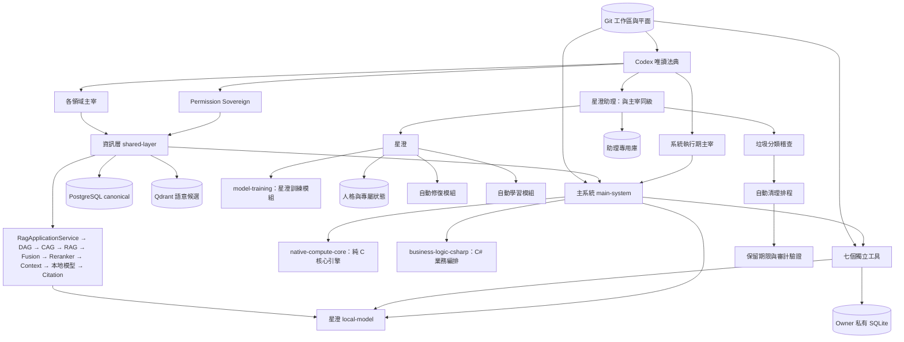
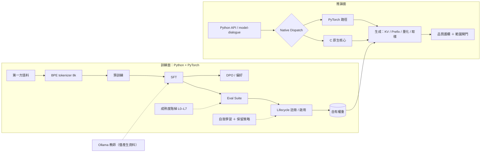
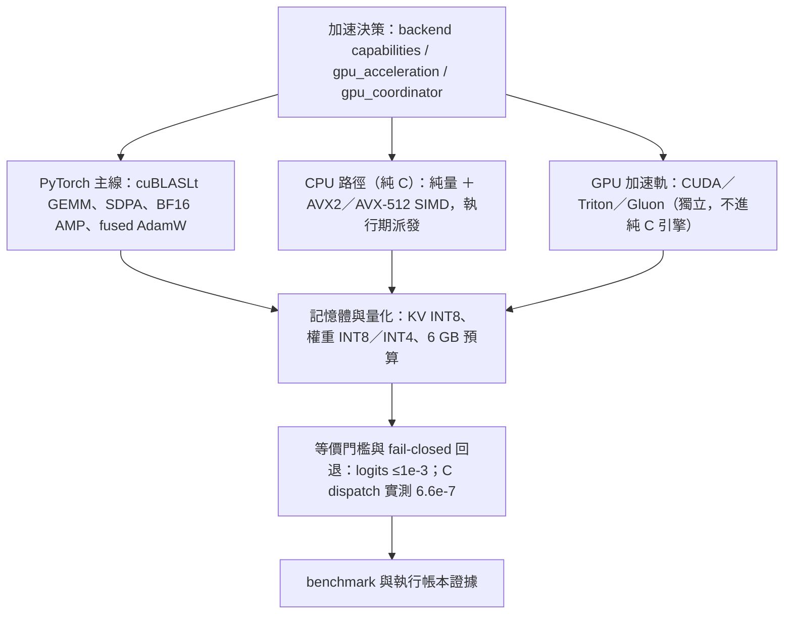
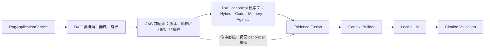
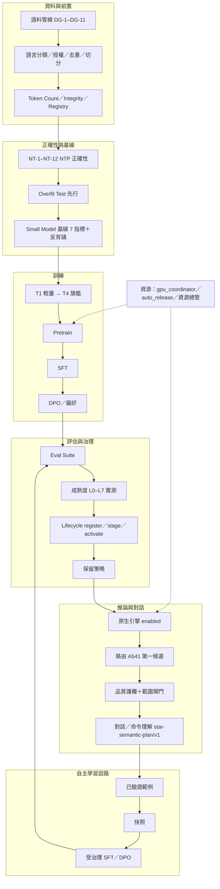

# GPTBridge 全專案暨星澄建置藍圖（整合版）

> 本文件由原《星澄模型四層建置藍圖》擴充整合而成：涵蓋**全專案架構**與**星澄模型**，一份為準。
> 領域權威／證據文件（法典鏡像、契約、定版規則、README）保留原位；**其他藍圖文件已刪除**（內容見 Git 歷史）。

- 日期：2026-09-20（整合版第一版）
- 性質：唯讀盤點報告 ＋ 分期建置藍圖。**本文件不變更任何程式碼、設定或資料。**
- 盤點範圍：`E:\GPTBridge` 全專案；星澄（`Standalone tools/local-model`）為其中的模型層焦點。
- 拓撲權威：元件歸屬一律以 `governance_rule/execution/audit/architecture_registry.json` 為準；
  架構圖以 `governance_rule/codex/architecture-*.md` 為準。
  **本文件為藍圖層整合視圖，不複寫、不取代拓撲權威。**
- **唯一共用藍圖（2026-09-20 定案）**：全工作者共用本檔；**禁止生成其他藍圖文件**；
  所有規劃內容（分期、驗收、缺口、依賴）一律併入本檔；領域文件只維護其領域事實。

**整合藍圖目標（2026-09-20 定案）**

- 七大運行目標：**高速、高效能、低負載、自動化運行、高穩定性、自動學習及升級**。
- 星澄能力目標：**可與使用者聊天並完成任務**（任何操作皆經受治理、權限與安全閘門）。
- 資料與技術屬性：**不需龐大資料**；**可量化、可蒸餾、可加速、可推理、可搜尋網路**。

| 目標 | 機制／對應 |
| --- | --- |
| 高速／高效能 | 第 5 章加速引擎；§4.5–§4.13 優化批次；Phase 9 規模化 |
| 低負載 | 資源治理（§4.7–4.8）；adaptive plane；CAG／快取；auto-release；**§10.27 按需模組（降低平時功率）** |
| 自動化運行 | §6 自動化分工；GitAutomation；維護×更新整合（§10.15）；自我學習 |
| 高穩定性 | 第 10 章收斂（藍綠＋lease、Task Lifecycle、連線恢復）；有界重試 |
| 自動學習及升級 | §2.5 self-learning／自主訓練升級；Phase 7；成熟度 L7 |
| 聊天完成任務 | L5 對話＋L6 工具與推理；安全閘門（歧義即確認）；A541 路由 |
| 不需龐大資料 | T1–T4 分級；教師蒸餾；Small 基線；eval suite |
| 可量化 | 成熟度 L0–L7 實測；`star-native-baseline/v1` 七指標 |
| 可蒸餾 | 教師蒸餾×SFT 產線（loopback Ollama 教師） |
| 可加速 | 純 C 核心＋SIMD；C++ 推論層；KV／prefix cache；INT8／INT4 |
| 可推理 | Phase 6（L6 可驗證推理與工具） |
| 可搜尋網路 | ai-collaboration 受治理通道（EC-4；結果一律未驗證候選） |

**藍圖×實作整合原則（2026-09-20 定案；必要遵守）**

整合時以**實作優於藍圖即保留實作**為原則：實作若已提供更佳方案（含已通過測試者），**保留實作並回寫藍圖**，
不得為符合藍圖而回退實作；回寫須附證據（commit／測試），並同步更新優先佇列與缺口狀態。
**本原則列為不變式 #18（強制）。**

已回寫的實作優勢（示例）：

| 實作 | 證據 | 藍圖動作 |
| --- | --- | --- |
| GQA 注意力不展開 KV（省記憶體） | `8986568f` | §2.4 已記錄 |
| SQL 連線池上限下調（低負載） | `368eb20f` | §6.5 低負載 |
| Git watcher 輪詢 I/O 降低 | `a176317b` | §1.5／§4.12 |
| Router FP32＋MoE QC 測試 8/8 | `test_moe_quality.py`、`moe.py` | §2.2／G39 已回寫 |
| Prefix cache（跨請求 K/V 重用） | `inference/prefix_cache.py` | §2.4 已記錄 |
| 語料機密來源排除＋拒收測試 | `8fa3af6b`、`e175f2c7` | **G33 P0 解除**（DG 其餘仍待 Phase 2R） |
| 懶啟動 RAG／CAG 與交接健康閘門（P0） | `AGENTS.md`、`test_p0_lazy_lifecycle_handover.py` | §1.7／§1.8 |
| Git 自動化 staged-index skip（事故防護） | `6a0d3ca7` | §1.5 |
| CUDA graphs 訓練修正（RoPE 預建＋`cudagraph_mark_step_begin`，避免 graph 輸出被覆寫與 Windows cp950 崩潰） | `pretrain.py`（外部預先 staged；併入 `4914cf07`，待補作者署名） | §2.2 |

**優先處理（Priority Queue，2026-09-20）**

| 級別 | 項目 | 負責側 | 狀態 |
| --- | --- | --- | --- |
| P0 | **法典上線**（3 元件＋42 條立法） | 已直接施工（使用者命令，分 3 批）：版本 `2026-09-20T17:39:12Z`、A551–A592、鏡像與架構圖同步、稽核 PASS | ✅ 法典上線（完成）；封印根／修訂歷史與外部簽章（未完成） |
| P0 | **語料機密排除**（G33；`PROTECTED_SOURCE_PREFIXES` 已擋 `governance_rule/codex`；corpus-v1 已重建——train.jsonl codex 文件 39→0，1597 docs／13.3M chars） | worker | ✅ 已修（注意：舊 checkpoint 仍是在含鏡像語料上訓練的，無法回溯去汙；後續訓練一律用新 corpus） |
| P0 | Small 基線完整化（G37：GPU memory／gradient norm 補記錄） | worker | ✅ 已修（`pretrain.py` 記錄 `gpu_memory_peak_mb`＋pre-clip `gradient_norm`；GPU smoke 基線報告 `baseline-small-5m-gpu-2026-09-20.json` 七項指標齊備：42,013 tok/s、VRAM 峰值 690.2MB） |
| P0 | **全系統收斂 P0 組**（第 10 章）：不中斷更新（Blue-Green＋fencing）、統一 Runtime State、Contract 相容、Backend Gateway、Versioned Release、預防性維護、**維護×更新整合與版本保留（10.15）** | worker／治理側 | 規劃已定；先盤點後補缺口 |
| P0 | **執行權與版本基礎**：Runtime Execution Lease（10.17，**先於藍綠上線**）、統一 Task Lifecycle（10.16）、Release Manifest（10.18）、開發／正式分離（10.19）、**Backend Lifecycle Contract（10.21）、Request Registry（10.22）與 INTEGRATION 收斂（10.20，先盤點）** | worker | 規劃已定 |
| P1 | NTP 正確性測試（Phase 2T ✅）／對話角色與遮罩（Phase 5D 格式層 ✅）／MoE QC 剩餘矩陣（G39 對照矩陣 ✅；GPU VRAM／稀疏執行待硬體空檔） | worker | 已落地（2026-09-21） |
| P1 | Python／C++ 分層一致性（Phase 5E，依賴 P3）／KV Cache 效能矩陣（Phase 5F ✅ `kv_matrix.py`＋8 測試） | worker | 5F 已落地；5E 待 P3 |
| P1 | **全系統收斂 P1 組**：SQL 工作分級／RAG 一致性／模型資源排程／Git 整合流水線／Process Registry | worker | **已落地（2026-09-21）**：10.5 `workload_lanes`、10.6 `parity_audit`、10.7 `model_resource_manager`、10.8 `contract_check`、10.10 `process_registry`（各附測試全綠） |
| P1 | **獨立工具穩定**（§10.41；G82／G83）：① 星澄自動迴圈 arity（`auto.py` 無參呼叫，已修）；② resident 啟動去重＋`reconcile` 排程（雙層鎖＋30s monitor，已施工）；③ 工具 stderr 捕捉／輪替（已施工） | worker（governance/xingcheng、toolbox、process registry） | 工程完成；待 10 分鐘零 arity 錯誤與 30 分鐘 registry 一致性的長時實證 |
| P1 | **推理線路與稽核完整性**（§10.45；G86／G87／G88）：W5-1 jieba lazy import ✅（並行工作者完成）→ W5-2 補 self-health 測試 → W5-3 ai-collaboration ✅（隨 W5-1 解除）→ W5-4 GPU 復驗（待顯存）；法典 A593／A594 已立案（request-only） | worker（chinese-semantic-engine）＋治理側 | W5-1／W5-3 完成；W5-2 待施工；W5-4 ✅（device=cuda 帳本已入）；驗收：稽核 self-health 全綠、帳本新增 `"device":"cuda"`（已達成） |
| P2 | 其餘優化批次（O／S／W／X／Y／Z／AA）、擴展（Phase 9A）與效能基準（10.11） | worker | 排程 |

---

## 0. 整合來源與閱讀方式

| 原文件 | 領域 | 本文件對應 |
| --- | --- | --- |
| 《星澄模型四層建置藍圖》（本檔前身） | 模型四層 | 第 2、3 章 |
| `governance_rule/codex/architecture-project.md` | 全專案權威圖 | 1.2（引用） |
| `governance_rule/codex/architecture-{git,sql,rag,languages,tool-*}.md` | 各領域權威圖 | 1.2、1.3（引用） |
| `docs/module-topology.md` | A534 工具拓撲 | 1.6 |
| `docs/worktree-architecture.md` | Git 工作區 | 1.5 |
| `docs/sql-inventory-analysis.md` | SQL 盤點 | 1.8、第 6 章 |
| `shared-layer/docs/DATA_OWNERSHIP_CONTRACT.md`、`shared-layer/SQL_ARCHITECTURE_RULES.md` | SQL 資料所有權與定版規則 | 第 6 章 |
| `繁體中文命令理解流程.md`、`全自動模型流程備份.md`（local-model） | 星澄命令理解與自動流程（領域文件） | 第 9 章（共用流程藍圖） |
| `docs/architecture-evaluation-python-cpp-mixed.md` | Python／C++ 效能評估 | 1.9、4.2 P3 |
| `shared-layer/README.md`、`main-system/README.md` | 層邊界 | 1.7、1.8 |
| `AGENTS.md` | 自動化與模型治理現行章節 | 1.5、2.6 |

---

## 1. 全專案架構藍圖

### 1.1 一句話結論（2026-09-20）

全專案八個面向（治理、啟動、決策、資訊、資料、執行、模型、開發維護）皆已有可運作的實體與登錄；
Git 自動化已由單一 in-process `GitAutomationService` 取代舊行程艦隊（變更尚未提交）；
星澄四層全通，自有權重已由原生引擎在 CUDA 實際服務（執行帳本可驗）；
**下一步的主軸是：落地未提交變更 → 星澄對話品質（L5）→ 工具與推理（L6）→ 受控進化（L7）→ 正式路由與規模化。**

### 1.2 全專案藍圖視圖（Mermaid；權威圖見 codex）



### 1.3 正式資訊路徑（不變）

`Caller → Information Channel → Permission / Scope → RagApplicationService → DAG Planner / Executor → CAG Gate → RAG Retrieval（Hybrid / Code / Memory / Agentic）→ Evidence Fusion → Reranker → Context Builder → Local LLM → Citation Validation → Result`

DAG 是查詢、索引與修復工作流的無環編排面，不取代 Application Service；
CAG 是安全、有版本、有範圍且非權威的快取增強面，不取代 RAG；
RAG 是 canonical knowledge retrieval 面。Qdrant 與 PostgreSQL canonical 邊界不變，SQLite 只准 degraded fallback。

### 1.4 資料平面（不變）

Git 管來源與歷史；PostgreSQL 管已宣告的中央正式狀態；Qdrant 僅保存語意候選；
SQLite 僅保存 owner 私有狀態與有界降級資料；模型只負責推論。

### 1.5 Git 平面與自動化

- 工作區：`main`、`.worktrees/git`、`.worktrees/local-model`、`.worktrees/rag`、`.worktrees/ui`（另有 `.kilo` worker 工作區）。
- **GitAutomationService**（`main-system/src-core/tasks/git_automation.py`，本次盤點時尚未提交）
  已在啟動執行器 normal-information 階段啟動（`app.git_automation`）：
  - 每 60 秒 commit sweep（指紋需先穩定 60 秒）；
  - 每 300 秒 sync cycle（commit → merge worker branches → audit → fast-forward）。
- 舊 `automation_supervisor` 行程艦隊退役；`scripts/git-supervisor.py` 仍可用但非預設。
- 鎖、merge/rebase 守衛、audit、no-push 規則留在 `governance_rule/execution/git_tiers/`；coordinator 才會 push `main`。
- 狀態：`main-system/runtime/state/git-automation.json`。
- **2026-09-20 事故與防護**：`ef58c9cc` 曾把外部**預先 staged** 的 P0 變更夾帶進藍圖提交
  （內容正確、訊息不符、已推送不可 amend）→ 已實作 `self_commit.staged_index_present()`：
  **index 有 staged-but-uncommitted 即 skip（`staged-index-present`）**，不將他人的 index 掃入自動提交；
  worker 提交前須以明確路徑核對（`git diff --cached --name-only`）。

### 1.6 獨立工具（A534：七個）

| 工具 | 路徑 | 生命週期（Registry） | 備註 |
| --- | --- | --- | --- |
| local-model（星澄平台） | `Standalone tools/local-model/` | on-demand | 含 `xingcheng` 與嵌套 `model-dialogue` |
| model-dialogue（star-chat） | `local-model/model-dialogue/` | on-demand | 主系統內的獨立工具；host/runtime owner = `xingcheng` |
| ai-assistant | `Standalone tools/ai-assistant/` | on-demand | |
| investment-mobile | `Standalone tools/investment-mobile/` | on-demand | Registry 角色為 development-maintenance |
| ai-collaboration | `Standalone tools/ai-collaboration/` | on-demand | 受治理網路通道（星澄研究用） |
| file-sorter | `Standalone tools/file-sorter/` | on-demand | |
| vaultly | `Standalone tools/vaultly/` | on-demand | |

非獨立工具：

- `system-rescue`：主系統內部服務（集中修復、封裝器；以工具 ID 分隔修復資料庫）。
- `global-cleaner`：**retired**、非執行；身分與稽核紀錄保留為證據，自動清理由主系統內部服務承接。
- `business-logic-csharp`：本次新登錄（execution / standalone-service），依賴 `local-model`、`shared-layer`；工具隔離政策 512 MB。
- 星澄助理（xingcheng-assistant）：與主宰同級之獨立特權機構（UI 抽屜 ＋ 專用資料庫）。

### 1.7 主系統（`main-system/`）

- `src-ui`：Electron main/preload ＋ React renderer；星澄助理抽屜（`AppXingchengDrawer.tsx`）。
- `src-core`：
  - IPC `127.0.0.1:8765`；WebSocket 命令路由、治理請求轉接、工具生命週期 broker。
  - `core_system/`：53 個登錄模組、12 群組（module registry v1.02000）；每個模組 ≤3 公開入口、≤12 authored callables、≤500 effective lines（A430/E160）。
  - `core_system/rag/`：RAG 實作齊備（`service/`、`dag/`、`cag/`、`retrievers/`、`orchestration/`、`lifecycle/`、`pipeline*`、`a549_benchmark.py`）。
  - `tasks/`：含新 `git_automation.py`、`model_service_activation.py`（懶啟動星澄）。
  - 啟動執行器：`startup_executor_phases.py`（本次新增 `app.git_automation` 階段）。
- 工具隔離政策 `config/tool-isolation-policy.json`：新增 `business-logic-csharp` 512 MB、
  `native-compute-core` 1024 MB、`model-training` 4096 MB；`local-model` 2048 MB（既有）。
- 生命週期規則：工具視窗採前景生命週期，關閉即終止程序樹；治理核准的無介面常駐服務除外。

### 1.8 資訊層（`shared-layer/`）

- `database/`：PostgreSQL canonical、migration（058 優先佇列、087 安全、113 工作流…）；SQL 盤點見 `docs/sql-inventory-analysis.md`。
- `adaptive/`：有界控制面（admission、動態 pool/batch、retry、breakers、maintenance、cost gate、SQLite fallback、Qdrant budgets）；
  envelope pool 2–8、batch 50–500、reconcile 1–2；transport 優先佇列（critical / interactive / background / maintenance）。
  - **未提交**：`gpu_coordinator.py`（GPU 維度：`torch.cuda.mem_get_info` ＋ `nvidia-smi` 雙源、fail-closed、訓練/推論優先級）。
- `security/`：DSN 目的分離、session identity、credential metadata only、rotation with grace、generation fence、SQLite/Qdrant scopes、least-privilege 認證。
- `workflow/`：Saga（PostgreSQL 為權威）、冪等步驟與補償、leases、outbox/inbox、publish barrier、atomic writes、transaction guard。
- `performance/`：`native_dispatcher`（A219 契約）與各項基準（parser / vector / transformer / native_core / regression）。
- `contracts/`、`local/`、`observability/`。

#### 1.8.1 shared-layer 實體與執行責任盤點（2026-09-21，唯讀）

> 結論：**shared-layer 是現行正式架構中的常駐資訊層，不是可刪除或搬移的工具**。實體＝
> `E:\GPTBridge\shared-layer`；registry：`architectural_role=information`、
> `runtime_form=standalone-service`、`owner_sovereign=system-runtime`、
> `execution_identity=shared-layer`、`lifecycle=resident`、`canonical=true`、
> 依賴 `postgresql／qdrant／codex-authority`、通道 `information-channel／transport／outbox／state-events`；
> 法典另有 `INFORMATION_LAYER`／`SHARED_LAYER` activation 登錄（相容再導出套件
> `main-system/{information-layer,shared-layer}` 之測試鎖定 re-export）。變更須走契約版本軸
> （024／043／046 handshake）與法典（A8／A44／A49、A263、第 6 章），**不得直接刪除或搬移**。

| 面向 | 實體（證據） | 執行責任 |
| --- | --- | --- |
| Contracts | `shared-layer/src/shared_layer/contracts/`（`registry.py` CanonicalTypeRegistry 版本化語言中立型別來源、`types.py`、`projection.py`、`dependency_graph.py`、`sql_presence.py`）、`metadata_contract.py`、`envelope.py`、`channel_types.py`；法典契約 registry：`governance_contract_registry`(7)、`machine_schema_registry`(67)、`command_contract_revision_registry`(9)、`transport_*`(submission／health／ordering／persistence／retry／authority boundary)、`sql_session_binding_contract`、`identity_authentication_contract` | 跨語言資料契約的**單一權威**（append-only 版本；projection parity 測試鎖定）；信封與通道型別 |
| Identity | `shared-layer/src/shared_layer/security/`：`session_identity.py`（交易區域 GUC 綁定 actor／module／request／decision／correlation）、`roles.py`、`generation.py`（security generation fence）、`rotation.py`、`secrets.py`、`dsn_policy.py`（runtime／reader／admin／backup 分離）、`sqlite_scope.py`、`qdrant_scope.py`、`audit.py`；`channel.py` 接 `GovernanceAuthenticationService`＋permission directory | 身分、連線、憑證、工作階段、權限、輪替與撤銷；契約 `IDENTITY_AUTHENTICATION_V1`（21 項檢查、fail-closed、密文禁存只留參照）；`GOVERNED_DB_SESSION`（context 非權威、需 projection match＋generation fence） |
| Authenticated IPC | Python：`channel.py`（`SharedLayerChannel`）、`channel_runtime.py`（A263：typed generation、雙向 heartbeat、有界佇列／背壓、控制優先通道、transactional outbox、ack／cursor 有序、斷線即失效、重連需 snapshot／cursor／hash 收斂、不丟未 ack 事件）、`request_client.py`、`runtime_gateway.py`、`store.py`／`store_async.py`（transport）、`transactional_outbox.py`；TypeScript：`shared-layer/src/ui/toolWindow/{useLocalBackendSocket,toolWindowUtils}.ts` | 受治理 IPC：提交契約 `GOVERNED_TRANSPORT_SUBMISSION`（ordered stages、禁直插 DB、信封不可變欄位）、權威邊界 `INFORMATION_LAYER_POSTGRESQL_TRANSPORT`（僅持久化，不得改路由／授權／執行業務） |
| Runtime Dependencies | `database/`（PG canonical：pool、workload lanes、migration、backup／restore、retention、reconcile…）、`local/`（owner 私有 SQLite 與 local vector：degraded-only、須調和）、`workflow/`（Saga、outbox/inbox、leases）、`adaptive/`（有界控制面）、`performance/`、`observability/`、`cache.py`、`resilient_*` | 常駐服務：PG／Qdrant 連線與治理、傳輸、Saga、自適應控制；SQLite 只准降級與私有狀態，永不得宣告中央完成 |
| Python Imports | 主樹 46 檔（不含 worktree／鏡像）：`main-system/src-core` 24（`rag/*`、`integration`、`ipc`、`tasks`、`maintenance`、`startup`、`ui_shell`…）、`Standalone tools/local-model` 11（星澄 RAG／native engine／training executor／channel client）、其餘工具各 1（ai-assistant、ai-collaboration、global-cleaner、investment-mobile、system-rescue、vaultly）、`governance_rule` 3、`launcher` 1；測試另計 | 主系統與工具的**執行期直接依賴**（非選配） |
| TypeScript Imports | `Standalone tools/{file-sorter,vaultly}/src/ui/toolWindowRunner.ts` 直接 import `../../../../shared-layer/src/ui/toolWindow/*`（`useLocalBackendSocket`、`waitForIpcEvent`、型別）；`main-system/src-ui`：`platform-tool-sizes.ts`（shared-layer 目錄尺寸）、`useToolboxApplications.ts`／`AppCapacityDrawer.tsx`（容量盤點顯示）、`ipcHandlers.ts`（`shared_layer` 尺寸 payload）；檢查器：`ChildToolIsolationChecker`（`governance-authenticated-shared-layer`）、`RootPurityChecker`（允許根）、`LanguageBoundaryChecker`／`LanguagePolicy`（Python 根含 `shared-layer/src`） | 工具 UI 與主系統 UI 的執行期／治理期依賴（共用視窗 socket 與 IPC 工具） |

- 附註（文件漂移）：法典 `project_architecture_directory` 的 `SHARED_LAYER`／`INFORMATION_LAYER` 列
  `physical_root` 指 `main-system\{shared-layer,information-layer}`——實體為相容再導出套件；
  真實在 `shared-layer/`（registry 為準）。列為待補對齊項。

### 1.9 原生核心（C）與推論引擎（C++）——語言分層

- 定案（2026-09-20）：語言責任依 §1.11 四語言定位。**C 核心引擎層維持純 C**
  （tensor 基礎運算、SIMD、記憶體管理、CPU kernel、穩定 C ABI）；**C++ 承接原生推論執行層**
  （Transformer 推論、模型載入、KV Cache、Sampling、資源管理）；先前「引擎元件全部純 C」的過渡決定已被取代。
- `native/core/`：`parser.c`、`vector.c`、`transformer.c`、`memory.h`（純 C，AVX2＋FMA）。
- `native/bridge/gptbridge_native.c`（sole C ABI thunk，A221/E186，純 C）、
  `native/include/gptbridge_native.h`（sole public C header）。
- Registry：`native-compute-core`（build-tooling / resident，依賴 `governance_rule`）。
- 推論派送以 A219 契約組合 C 原生 `matmul`／`softmax`；**訓練路徑永不派送**；parity 逐形狀驗證快取；ABI 例外回退純 Python。
- **引擎層現況**：Python 路徑仍是開發／訓練基準；正式 C++ 推論執行層第一切片已落地
  （`_xingcheng_inference`：mmap 權重載入＋SHA-256、byte-level BPE、Dense forward、KV cache、
  greedy sampling、bounded JSON 解析，張量運算全部經 `gptbridge_native.h` C ABI），
  僅支援 batch=1／FP64／dense；MoE、量化、prefix cache 重用、CUDA、batch>1 皆 fail-closed，
  生產路由與資源接線未完成（§4.2 P3b–P3f 部分落地）。
- **worktree 資產**：`parser.cpp`／`vector.cpp`／`transformer.cpp`／`memory.hpp`／`simd.hpp` 為 C++ 變體，
  可作為 C++ 推論層的參考；C 核心以主樹 `.c` 為準，不得與 C++ 核心混用。
- 綁定：C++ 引擎對 Python 的綁定可用 pybind11（C++ 層內合法）；**C ABI（`gptbridge_native.h`）仍為 C 的穩定邊界**。
- 附帶清理（G17）：無引用的舊 `_gptbridge_native…pyd` 已處置；`dispatch.py` 標籤已由 `c++-native-core` 改為 `native-compute-core`。

### 1.10 啟動、腳本與文件

- `launcher/`：啟動狀態儲存（`startup-journal.jsonl`、`orchestrator-report.json`）；啟動閘門依環境、runtime 探測與治理稽核。
- `scripts/`：`resource-governor.py`（CPU/記憶體調節）、git 工具（gate / worktree sync / self-commit）。
- `docs/`：module-topology、worktree-architecture、sql-inventory-analysis、architecture-evaluation-python-cpp-mixed。

### 1.11 跨語言定位與責任（2026-09-20 定案）

> 口訣：**Python 開發訓練、C++ 正式推論、C 核心引擎、C# 業務編排。**

| 語言 | 正式定位 | 主要責任 |
| --- | --- | --- |
| Python | 開發與訓練層 | PyTorch、Autograd、Pretraining、SFT、MoE 訓練、權重匯出（不承載系統模組） |
| C++ | 正式推論層＋物件導向 | Transformer 推論、模型載入、KV Cache、Sampling、資源管理、**物件導向（OOP）元件** |
| C | 核心引擎層 | Tensor 基礎運算、SIMD、記憶體管理、CPU Kernel、穩定 C ABI、**核心引擎（原主宰職能，純 C）**、**全面模組化之模組（純 C）** |
| C# | 業務編排層 | **外部協調**、模型選擇、任務調度、生命週期、資源預算、狀態管理 |

- 說明：本定位取代先前的「引擎元件全部純 C」過渡決定（2026-09-20 同日）。
- 邊界：C ABI 是 C／C++ 的唯一穩定介面；**C++ 不得滲入 C 核心層**；Python 只負責訓練與匯出；
  C# 承接業務編排（現況多數仍在 Python／`business-logic-csharp`，需分階段導入，見 §4.2 P7）。
- 跨語言只經已登錄、已版本化契約（codex architecture-languages）；語言邊界不改變資料、權限與決策所有權。
- GPU 加速技術（CUDA／Triton／Gluon 等）為**獨立加速軌**，不屬四語言分層；
  不得因此讓 C 核心承載 GPU 核心或 C++（§5.5）。
- 新登錄元件（2026-09-20）：`native-compute-core`（純 C 核心引擎，§1.9）、`model-training`
  （星澄訓練模組，屬模型研發訓練層）、`business-logic-csharp`（C# 業務編排，§4.2 P7）。

---

## 2. 星澄盤點（四層模型）

**星澄定位與目標（2026-09-20 定案）**

- 目標：**聽懂命令**（繁中為主；保留原句，抽取意圖／動作／對象／參數／限制）＋**可與使用者聊天**
  （多輪對話、指令遵循、合理回答，而不是只複述訓練資料）。
- 主線：推論以原生模型服務對話與命令理解；**Ollama 僅教師與專家**，不取代星澄神經網路核心。
- 現階段門檻：成熟度 **L5**（多輪對話與指令遵循）；命令理解以 `star-semantic-plan/v1` 欄位
  與既有 `繁體中文命令理解流程.md` 對齊。
- 延伸：L6 推理與工具使用、L7 受控進化；破壞性操作維持安全閘門（歧義即 `SAFE_CONFIRMATION_REQUIRED`，不執行）。
- 路由：A541 對話自動路由預設星澄第一候選；本地模型預設關閉（A540），由使用者開關啟動。

### 2.1 Base Model

- 自有權重：lifecycle `xingcheng-native` 共 **12** 個權重版本；`active_weights_version = 12`
  （job `star-transformer-job-43862f2bc24945b3844d5e99`，81,808,128 參數，sha256 `45ded8e8…`）；狀態 `INSTRUCT_READY`。
- 原生引擎：`runtime/settings/native-engine.json` `enabled=true`、checkpoint 指向 v12、`quantization=none`、
  取樣與護欄已設；執行帳本 `xingcheng/runtime/logs/native-engine-executions.jsonl`（device=cuda、
  `third_party_foundation_weights=false`、`loopback_runtime_used=false`，2026-09-20）。
- 架構選項（`XingChengConfig`）：small ~5M、medium ~27M、base ~100M、xlarge ~500M、large ~1.2B；
  MoE 變體：small ~20M／act ~7M、medium ~146M／act ~44M、base ~497M／act ~157M、xlarge ~2.9B／act ~842M、large ~6.9B／act ~2B。
- **架構方向（2026-09-20 定案）：使用 MoE（稀疏專家）**。`XingChengMoE` 已具 token-choice top-k 路由、
  SwiGLU experts、aux loss＋z-loss、路由指標（expert load／entropy／utilization／collapse）；
  `transformer_block` 以 `use_moe`＋`moe_layer_interval` 掛載。推論目前為逐專家 Python 迴圈（稠密執行），
  稀疏執行與專家權重管理待建（R5／P3d／P3f）。
- **架構定位（2026-09-20 定案）：星澄為「多組態 GPT」**——同一 **decoder-only 自迴歸架構族**，
  支援 Dense（small／medium／base／xlarge／large）與 MoE（small／base／xlarge／large）多組態；
  **Tokenizer／評測／生命週期共用**，權重、checkpoint、訓練紀錄**各自獨立**（組態記入 Release Manifest）；
  推論組態另含精度（FP32／BF16／INT8／INT4）、KV 量化、CPU／GPU 與 Python／C++ 路徑。
- **工具能力定位（2026-09-20 定案）**：星澄**不一定要具備很多工具能力**（工具由受治理工具與執行器提供），
  但**必須要會呼叫工具**：`star-tool-call/v1` schema 合法、參數正確、工具結果解讀、錯誤與拒絕處理；
  呼叫一律經資訊通道與權限路由（**不得自行授權或執行**）；工具結果視為**未驗證輸入**，
  直到通過驗證為止。此能力屬成熟度 **L6** 與 Phase 6 驗收。
- 訓練面：Python ＋ PyTorch（§1.11）；C 核心引擎承接 tensor／SIMD；C++ 承接正式推論。
- tokenizer：自有 byte-level BPE 8,192（`xingcheng-bpe-8k`，`tokenizer.json` ＋ manifest）；
  chat 角色標記為文本層 `<|system|>`／`<|user|>`／`<|assistant|>`／`<|tool|>`／`<|eot|>`（硬 token-ID 綁定屬 tokenizer v2）。

### 2.2 Pretraining

- 語料：第一方來源 **866 篇／14.50M 字元**；`xingcheng/runtime/corpus/{train.jsonl,val.jsonl,manifest.json}`
  （manifest 含每檔 sha256；dataset_id 內容定址、license、language、token_count）。
- 已完成：v0（5,048,576 參數、4.10M tokens、val ppl 104.88）；v1-gpu（32.7M tokens、val ppl 20.04）。
- **MoE 主線（2026-09-20 定案）**：`medium_moe` 145,793,536 參數曾啟動（日誌至 step 250，loss 3.60、
  bf16、~620–760 tokens/s）；smoke 60 步（ppl 1,003.0）；`xingcheng-medium-moe-v1/` 目錄為空、
  日誌所列 smoke checkpoint 不存在。重啟條件：語料量、路由平衡（aux loss／entropy／無坍塌）、
  學習率與步數計畫（Phase 9）。
- **medium_moe 重啟（2026-09-21，Phase 9 實跑）**：`medium-moe-v1`，corpus-v2（7,065 blocks）、
  tokenizer `xingcheng-bpe-8k-v1`、bf16 CUDA、1000 步。訓練曲線健康：loss 7.92→2.35
  （step 875）、eval ppl 337（step 100）→ **18.9**（step 800）；吞吐 ~3,400→540 tok/s
  （桌面進程共享 GPU＋Python-loop 路由開銷，符合 moe_qc 結論）。**中繼 router 量測
  （step 750 checkpoint、真 val 語料驅動）**：8/8 experts 啟用、load_max 0.151（均勻 0.125）、
  entropy 1.595（77% 上限）、**無坍塌**；aux+z-loss 生效中。
- 缺口：正式規模的語料治理與詞表擴充（32k／64k 配比）、可重現的預訓練報告。

**完整預訓練資料管線（2026-09-20 定案）**

> 訓練資料必須**可追蹤、可驗證、可重現**；未授權與機密資料不得自動進入訓練集。

| 元件 | 現況核對（`training/corpus.py`） | 設計要求 | 驗收 |
| --- | --- | --- | --- |
| Corpus Registry | 無（來源寫死於 `DEFAULT_SOURCES`） | 來源登錄檔：來源 id／路徑／擁有者／授權／語言／敏感級別／啟用狀態 | registry 可查；未登錄來源不得進入 |
| Dataset Version | manifest 無 `dataset_version` 欄（docstring 有、實作缺） | `dataset_id`（內容定址）＋`dataset_version`（版本序列） | 欄位齊備且可重現 |
| Language Classification | 僅全域 `language: zh-TW+en+code` | 逐文件語言分類（zh-TW 主、en、code、math、science、general、reading）＋統計 | 每文件標記；配比報告 |
| Source Tracking | 每文件 `source` 路徑＋sha256 | 來源模組／檔案／範圍／取得時間／授權 | 任一文件可反查來源與授權 |
| License Validation | 無（`license` 為常數） | 以 registry 驗證授權；未授權即拒收（fail-closed） | 拒收事件與審計 |
| Unicode Normalization | 僅 BOM／換行／空白整理（**無 NFC**） | NFC 等安全正規化；**保留原始 ↔ 正規化映射**；程式碼／路徑／專有名詞／語意不得破壞 | 映射可還原；等價測試 |
| Document Deduplication | 僅 sha256 精確去重 | 精確＋近似去重（指紋／相似度門檻），保留來源關係 | 去重率與碰撞檢查 |
| Sequence Packing | 於 `pretrain.py`（packed blocks） | 管線化：packing 設定與產物入 manifest（block size／EOS 策略） | 可重現的 packed 產物 |
| Training / Validation Split | 已有（sha256 前 8 碼 5‰） | 固定演算法＋版本記錄；防洩漏（同源文件不跨 split） | split 可重現、無洩漏 |
| Token Count | 可選（傳 tokenizer 時計算） | 一律計算並綁定 tokenizer 版本／雜湊 | `token_count`＋tokenizer sha256 |
| Dataset Integrity | 檔案 sha256（manifest） | 資料集根雜湊＋驗證 CLI＋完整性報告 | 篡改可偵測；驗證指令 |

**語言方向與配比（目標）**：繁體中文為主，其次英文、程式語言、數學、科學、一般知識、閱讀理解；
配比門檻於 DG-3（語言分類）產出統計後定案。

**排除規則（fail-closed）**：

- 不得自動加入：法典機密（zh-TW 鏡像五份 part 與 codex DB）、權限資料（permission directory／角色憑證）、
  星澄私有輔助通道、runtime 狀態與稽核日誌、未授權外部資料。
- **現況警示**：預設來源含 `governance_rule/codex`，且 `.txt` 在允許後綴內，會把機密 zh-TW 鏡像納入語料
  → 需立即以來源 allowlist／denylist 修正（DG-4／DG-5）。
- 原始 ↔ 正規化映射：以偏移或並存欄位保存；正規化不得改寫程式碼區塊、路徑、專有名詞與數值。

### 2.3 Post-training

- SFT：`training/sft.py`（prompt-masked loss、AMP、可續訓）；governed job 鏈 `queued → preflight → training → validating → completed`。
  - **chat-foundation-v1**：100 筆（90/10）、400 步 CPU、train loss 6.62 → 0.004、**val ppl 2.53**、349.5s。
  - **chat-foundation-v2**：211 筆（189/22）、400 步；撰寫本文件時進行至 step ~280（eval@200 ppl 3.02）；
    系列後續推進至 **v6**（目前保留 v2、v6；中間世代已由保留策略清理——見 G65）。
- 教師蒸餾：419 筆合格對話樣本（377/42；snapshot sha256 `39463352…`），教師為 loopback Ollama（`glm4:9b`、`rnj-1:8b`）；
  教師權重永不進入推論路徑。
- 偏好訓練：`language_preference_pair` 已上線；`training/dpo.py`（beta-anchored logsigmoid、凍結 reference、completion-masked log-prob、可續訓）。
- 工具呼叫：`tool_call_format.py`（`star-tool-call/v1`，確定性標記、有界驗證、SFT 相容）。
- Adapter 治理：`candidate → validated → staged → active`；activate 只動 adapter 指標，`automatic_weight_replacement` 恆 0。
- 評估：`native_eval_suite.py`（`star-native-eval-suite/v1`）；lifecycle `evaluation_report` v1/v2
  （perplexity **310.05 / 296.29**，suite `star-native-eval-v1`）。
- MoE 後訓練：chat-foundation 系列目前為稠密 81.8M 骨幹；MoE 骨幹的 SFT／DPO 排入 Phase 9，
  需附路由穩定性檢查（entropy／負載均衡／無坍塌）。
- 缺口：L5 對話品質（回合邊界、逐字複誦、限定回答、多輪記憶）、L6 推理＋工具呼叫樣本、L7 受控進化實測；
  eval suite 與 SFT 驗證分佈落差大（~296–310 vs 2.53）需對齊。

**Next Token Prediction 正確性測試（2026-09-20 定案）**

> 訓練必須具備正確的自迴歸關係：Input `A B C D` → Target `B C D EOS`；
> 模型在預測位置 t 不得取得任何 >t 的資訊。

現況（已核對）：`modules/model.py:_causal_lm_loss` 為標準 shift by 1（`logits[..., :-1]` 對 `labels[..., 1:]`）、
`ignore_index=pad_id`、`F.cross_entropy`（reduction 預設 mean）；`training/data.py` padding 以 `pad_id` 填、
`attention_mask` 標有效位；`training/sft.py` 以 `pad_id` 遮蔽 prompt／padding。
既有測試已有因果性（有／無 mask）與 KV 因果一致性；**尚無 NTP 專項矩陣**。

測試矩陣（NT-1–NT-12，獨立測試檔 `tests/test_ntp_correctness.py`）：

| 編號 | 檢查 | 方法 | 通過條件 |
| --- | --- | --- | --- |
| NT-1 | Sequence Shift | 固定序列（A B C D）斷言位移對位 | target[t] = input[t+1]；末位 target = EOS |
| NT-2 | Input / Target IDs | 形狀與 dtype、位移關係 | (B,S) long；無 off-by-one |
| NT-3 | Attention Mask | padding 位 0、內容位 1 | 與長度一致；padding 不參與注意力 |
| NT-4 | Causal Mask | 改尾端 token，前段 logits 不變（有／無 mask） | 差異 = 0 或 <1e-6 |
| NT-5 | EOS Handling | EOS 入目標；packed blocks 邊界 | EOS 計入；跨文件不互相學習 |
| NT-6 | Vocabulary Range | 所有 id ∈ [0, vocab)；tokenizer vocab == model vocab | 越界即 fail |
| NT-7 | Ignore Index | `pad_id` 為 ignore_index；手算對照 | 遮蔽位不進 loss；數值一致 |
| NT-8 | Label Mask（SFT） | prompt／padding 遮蔽；僅 assistant 內容計 loss | 遮罩位不進 loss |
| NT-9 | Cross Entropy | 固定 logits／labels 手算 mean CE | 與 `F.cross_entropy` 一致 |
| NT-10 | Loss Reduction | mean 只除有效 token 數 | 與「排除 padding」手算一致 |
| NT-11 | Target 不可讀取 | 改 target 值檢查同位置 logits 不變 | 逐位相同（無洩漏） |
| NT-12 | Tokenizer 一致性 | checkpoint 內嵌 vs runtime：同 artefact／sha256；round-trip | 完全一致 |

驗收：NT-1–NT-12 全綠；**負向測試**（注入 padding 不得改變 loss；越界 id 必須 fail；target 改動不得影響 logits）
必須通過；測試獨立（不依賴服務路徑）、固定 seed、CPU 可跑。

**Small Model 訓練基線（2026-09-20 定案）**

> 第一個正式基線以現有 **small 5M Dense** 為對象；**先 overfit 再正式訓練**；
> 訓練品質不只看 Training Loss。

檢核（12 項）：從零初始化（固定 seed、記錄結構與參數量）／可接受訓練資料（corpus train-val、tokenizer 綁定）／
Backward 正常（全參數有梯度）／Optimizer 可更新權重（step 後權重變化、logits finite）／Loss 可下降／
Checkpoint 可儲存（含 sha256）／Checkpoint 可恢復（續訓：optimizer 與 step 還原、loss 連續）／
可獨立生成 Token（不依賴外部模型、greedy 確定性）／**Overfit Test 先行**（固定小資料集：loss ≤ 0.5 或 ≤20% 初始值，測後還原）／
正式訓練（固定 seed、資料版本、預算）／指標完整／**反背誦**。

指標（每項落報告）：Training Loss｜Validation Loss｜Perplexity｜Tokens Per Second｜
GPU Memory（峰值）｜Training Time｜Gradient Norm（裁切前）。

反背誦規則：

- 必須同時看 Validation Loss 與**未見提示**生成；train 下降但 val 停滯／上升超過容忍 → 標記 overfit，不得宣稱基線通過。
- 未見提示探針（非訓練語料問題）輸出須足量、多樣、非退化（對齊 L4 探針精神）。

驗收：12 檢核全過（含 overfit 先行）；7 指標齊備且可重現（seed／資料版本／tokenizer sha／checkpoint sha）；
反背誦成立；報告格式 `star-native-baseline/v1`（含環境、命令、結果）。

現況（已核對）：`pretrain.py` 已記錄 loss／val／perplexity／tokens/s／elapsed；**缺 GPU memory 與 gradient norm 數值**
（`grad_clip` 有、未記錄裁切前 norm）；checkpoint 續訓已具；overfit smoke 已有先例（Phase 0）。

**基線首跑（2026-09-20，small 5M／CPU smoke；GPU 被佔用）**：

| 項目 | 結果 |
| --- | --- |
| Overfit Test（L0–L2） | **PASS**：9.0175 → 0.4975（比率 0.0552、53 步；閘門 0.5／20%） |
| 正式訓練 smoke | 60 步、122,880 tokens、27.03s、**4,546 tokens/s**（fp32、seed 42） |
| Loss | train 9.0238 → 7.3528；val 8.0026 → 7.8848（resume 65 步） |
| Perplexity | 2,988.7（60 步）→ **2,656.6**（resume 後） |
| Checkpoint | 儲存（latest／final＋sha256）與**恢復 PASS**（`start_step=60` 續跑至 65） |
| 獨立生成 | **PASS**：greedy 16 tokens、全在詞表內（65 步模型輸出尚退化屬預期） |
| 指標完整度 | 7 項中 5 項已具；**GPU memory（CPU 跑）與 gradient norm（未記錄）待補**（G37） |
| 反背誦 | 待正式長跑（val 持續下降為正向訊號；未見提示探針未執行） |

報告：`xingcheng/runtime/logs/baseline-small-5m-2026-09-20.json`（`star-native-baseline/v1`）；
產物：`baseline-small-5m-smoke/`、`baseline-small-5m-resume/`。

**GPU 正式基線補跑（`baseline-small-5m-gpu-2k`，2026-09-21 實測）**：

| 項目 | 結果 |
| --- | --- |
| 步數／tokens | 2000 步（resume 自 1000）、4.10M tokens、95.5s、**21,456 tok/s** |
| Loss／PPL | train 5.02 → 3.07；eval loss 4.51、**ppl 91.1** |
| GPU 峰值 | 343.8 MB |
| Gradient norm | pre-clip mean 2.70／last 2.85 |
| 反背誦探針（未見提示，greedy 24 tok） | code/en 提示產出多樣非退化文本（uniq 12–15/15）；**zh-TW 提示退化**（uniq 1/8）——與 corpus-v2 語言分佈一致（code 1569 vs zh-TW 16），屬語料覆蓋問題非背誦；訓練語料原文未被逐字複誦 |

判定：12 檢核中「反背誦」部分成立（無逐字背誦，但 zh 生成退化源於語料不平衡，
待繁中語料擴充後重測）；其餘 11 項與 7 指標齊備。

**正式報告補齊（2026-09-21）**：`baseline-small-5m-gpu-2k-2026-09-21.json`
（`star-native-baseline/v1`）已落盤——可重現欄位全齊：seed 42、corpus-v2
`dataset_root_sha256`＋train/val sha、tokenizer sha256、final.pt sha256（eb5231…）、
12 檢核逐項狀態表。**Phase 2B 唯一殘留**：繁中語料擴充後重跑 zh 未見提示探針。

**Medium／Base 擴展策略（2026-09-20 定案）**

- 前提：Small 通過驗收（12 檢核＋7 指標＋反背誦）後，先以 **medium 27M** 驗證擴展，再進 **base 100M**。
- 控制變數：**相同資料版本**（`dataset_id`／`dataset_version`）、**相同評估資料**（eval suite／held-out）、
  **相容 tokenizer**（同一 artefact、vocab 對齊）。
- 獨立性：各自**獨立權重、獨立 checkpoint、獨立訓練紀錄**（每模型一份 `star-native-baseline/v1`）。
- 比較矩陣（8 項）：模型參數量、訓練 Token 數、Validation Loss、Perplexity、生成品質、
  訓練吞吐量、推論吞吐量、VRAM 使用量。
- 判定規則：**不得直接以模型參數增加作為能力提升證據**；須以同評估集的可量測改善
  （val loss／ppl／生成品質）並同列成本（吞吐、VRAM）共同判定；未達門檻不得宣稱擴展成功。
- 通過條件：medium 在相同 token 預算與評估下相對 small 顯示可量測改善，方可依序進 base。

**MoE 訓練品質控制（2026-09-20 定案）**

- 對象：**Top-2 Router**、**4／8 Expert**（`moe_num_experts` 4 或 8）、**Router FP32**、**FMA**。
- 訓練檢查（8 項）：Router Logits、Router Probability、Expert Selection、Expert Dispatch、
  Expert Output、Expert Combine、Router Gradient、Expert Gradient；**確認 Top-2 路由正確**
  （top-2 indices 正確、權重正規化和為 1、dispatch/combine 對位）。
- 健康指標（5 項）：Expert Utilization、Expert Token Distribution、Router Entropy、
  Load Balance Loss、Expert Collapse Detection。
- 約束：**不得所有 token 集中到少數 Expert**；所有預期可訓練的 Expert 在適當測試條件下
  **均可收到梯度**（梯度可達性測試）。
- Dense／MoE 對照測試（6 項）：總參數、活躍參數、**實際 FLOPs（實測）**、訓練速度、推論速度、模型品質。
  **不得只根據活躍參數估算 MoE 的真實執行成本**。
- 非阻塞規則：**MoE 驗證不得阻塞已可用的 Dense 模型**（Dense 路徑照常運作，MoE 於旁路驗證）。

現況（已核對）：`XingChengMoE` 已具 Top-2 router（`nn.Linear`）、per-expert SwiGLU、aux load-balance
（Switch 形式）＋z-loss、指標（`expert_load`／`router_entropy`／`utilized_experts`／`is_collapsed`）；
`moe_num_experts` 可設 4／8。**Router FP32 已實作**（`F.linear(x.float(), weight.float())`＋`router_dtype` 指標）；
**專屬測試已具並全過**：`tests/test_moe_quality.py` 8/8（top-2／4／8、FP32 健康、dispatch/combine 對位、
全 expert 梯度可達、防坍塌、Dense 不阻塞、實測 CPU FLOPs）。
剩餘：訓練／推論速度對照矩陣與正式 QC 報告（VRAM／吞吐）；推論仍為逐專家 Python 迴圈（稠密執行）。

**原生對話訓練（Chat／Instruct）標準（2026-09-20 定案）**

- 前提：Base Model 預訓練完成後建立。
- 角色支援：**System／User／Assistant／Tool**（文本層標記，沿用 `star-chat-format/v1`）。
- 模型必須理解：使用者問題／歷史對話／當前任務／回答格式／工具結果／**結束條件**。
- 繁中對話資料類別：日常對話、多輪追問、語意省略、錯字理解、中英文混用、程式問題、數學問題、閱讀問題、工具使用情境。
- 續接準則：例「使用者：繼續」→ 必須**依目前對話狀態**延續上一個未完成任務；
  **不得只根據「繼續」兩個字執行固定回答**（列為驗收反例）。
- 角色與遮罩：訓練與評估必須正確處理對話角色、Assistant 回答區段與 **Loss Mask**
  （僅 assistant 內容計 loss；system／user／tool 與 padding 不計）。
- 驗收：角色渲染往返、遮罩位置正確、多輪記憶、續接反例、工具結果引用。

**Python／C++ 推論一致性標準（2026-09-20 定案）**

- 共用同一權重（同一 checkpoint）：Python＝PyTorch Transformer；C++＝Native Core（AVX2＋FMA）。
- 必須相同：Tokenizer、Config、Weight、Input IDs、Position IDs。
- 分層比較：Embedding／RMSNorm／RoPE／Attention／MLP／MoE／Hidden States／Logits／Generation。
- 容忍度：逐層制定**合理且可驗證**的誤差範圍；**不得因 CPU／GPU 浮點運算順序不同而要求逐位元一致**；
  量化路徑（INT8／INT4）**另行測試、獨立門檻**。
- 品質閘門：差異不得造成不可接受的推論品質下降（logits 最大差、top-1 一致、greedy 逐字、ppl 差共同判定）。
- 現況：dispatch parity 已實測 6.6e-7（matmul／softmax／attention）；**全層比較 harness 尚未建立**（G41）。

**KV Cache 正確性與效能測試標準（2026-09-20 定案）**

- 保留精度：**FP16／BF16 Cache**、**INT8 Cache**（per-token、per-head 對稱量化）。
- 檢查（6）：Cache Position／Cache Length／Cache Update／GQA KV Head Mapping／RoPE Position／Context Overflow。
- 正確性：**Full Forward** vs **Prefill＋Decode＋KV Cache**，相同模型／權重／輸入下逐步 Logits 對比。
- INT8 KV Cache：**另計量化誤差**（獨立門檻）。
- 情境：短上下文／中上下文／長上下文／最大支援長度。
- 記錄：VRAM、RAM、Prefill Latency、Decode Latency、Tokens Per Second。
- 規則：**不得以效能提升交換未經評估的嚴重品質損失**。
- 現況：六項檢查已測試鎖定（`test_phase7_kv_cache.py`）；INT8 384 tokens 差 +0.025%；
  **四情境×五指標效能矩陣尚未建立**（G42）。

**原生模型能力評估（Evaluation Suite）標準（2026-09-20 定案）**

- 建立**獨立 Evaluation Suite**；能力分類九類：繁體中文、英文、數學、程式碼、閱讀理解、
  多輪對話、上下文追蹤、指令遵循、工具呼叫格式。
- **所有原生模型測試必須停用第三方模型代答**（teacher／Ollama 不得參與評估路徑）。
- 每次評估記錄：Model ID、Model Version、Tokenizer Version、Dataset Version、
  Inference Backend、Quantization、Evaluation Result。
- 模型更新前後執行**相同保留測試**；**測試資料不得與訓練資料重疊**（以 dataset_id／hash 驗證）。
- **能力下降時不得自動發布新版模型**（發布閘門 fail-closed）。

**模型權重演進機制（2026-09-20 定案）**

- 模型更新**不得直接覆寫**目前正式使用的權重；階段物件：
  **Candidate Model → Training Checkpoint → Evaluation Result → Verified Model → Active Model**。
- 流程：現行模型 → 建立候選版本 → 訓練 → 儲存候選權重 → **完整性驗證** → 能力評估 →
  **推論一致性檢查** → **發布閘門** → 正式模型。
- 發布須遵守既有 GPTBridge 認證發布與啟用規則（lifecycle／adapter registry；`auto_weight_replacement=0`）。
- 訓練失敗時**保留原有正式模型**；**不得回復到未認證的舊權重**。

**原生能力證明矩陣（10 項，2026-09-20 盤點）**

| # | 能力 | 現況證據 | 狀態 |
| --- | --- | --- | --- |
| 1 | 自有 Tokenizer 處理繁中 | BPE 8k 凍結 artefact；chat 標記；語料含繁中 | ✅ 已具 |
| 2 | 自有 Transformer 推論 | `native_transformer` + `Generator`（smoke） | ✅ 已具 |
| 3 | 自有權重獨立生成 | 基線 smoke：greedy 16 tokens、全在詞表 | ✅ 已證 |
| 4 | 真正的預訓練 | v0 4.10M tokens、val ppl 104.88 | ✅ 已證 |
| 5 | 多輪對話訓練 | `chat_format` 多輪＋chat-foundation 系列；xl-v3 **L5 已認證**（v16，2026-09-21） | ✅ |
| 6 | Python／C++ 同模型 | 僅 dispatch parity（6.6e-7）；C++ 引擎未完成 | 🟡 待建（5E） |
| 7 | Dense／MoE 訓練與推論 | Dense 已訓；MoE 未收斂、QC 未建 | 🟡 部分（9B） |
| 8 | KV Cache 加速生成 | 六項檢查＋INT8＋效能矩陣（`kv_matrix.py`，cached 1.13–1.72×） | ✅ 已證 |
| 9 | 儲存／恢復／評估／發布 | lifecycle＋eval suite＋adapter registry；演進機制待端到端 | ✅ 核心已具 |
| 10 | Ollama 停用仍可生成 | `native-engine` 執行帳本：device=cuda、無第三方權重、無 loopback | ✅ 已證 |

### 2.4 Inference System

- 取樣：per-request `temperature` / `top_k` / `top_p` / `seed` / `repetition_penalty`；同 seed 逐字確定性。
- KV cache：prefill／decode／update／position／causal／GQA layout 六項測試鎖定；
  FP32／FP16／BF16／INT8（per-token、per-head 對稱量化）；實測 384 tokens：BF16 +0.007%、INT8 +0.025%，
  KV 記憶體 624 → 312 → 166 KB。
- Prefix cache：`inference/prefix_cache.py`（`PrefixKVStore`；僅 batch_size=1、完整前綴比對、LRU、fingerprint）
  已實作並具 `generate` 接點；**驗收已補（2026-09-21）**：`tests/test_prefix_cache.py` 6 項全綠——
  跨請求重用命中（`last_prefix_reuse`）、重用後 greedy 生成與無快取逐字一致、
  LRU 逐出有界、無命中回零、batch>1 不啟用、mask 非全 1 不提交。
- 量化推論：INT8／INT4（真 4-bit packing，兩值/byte）；engine `quantize=8/4` ＋ `XINGCHENG_NATIVE_QUANTIZATION`。
- 原生派送：`execution/dispatch.py`（純 C 原生 matmul＋softmax 組合因果注意力；CPU、無 mask、因果、
  不需梯度、形狀 parity；等價差異 6.6e-7；`-1e30` 有限遮罩避免 NaN）。
- Triton kernels：RMSNorm／SwiGLU／RoPE 預設啟用（`XINGCHENG_TRITON_KERNELS=0` 可關閉）；已修 RoPE 非連續 q/k view 缺陷，模型層級 logits ≤1e-3，需要梯度時仍自動退回 PyTorch。
- GPU／CPU 資源：GPU 優先；CPU 執行緒上限與 `cpu_max_new_tokens`；訓練 CLI `--cpu-threads`。
- 自動釋放（未提交）：`execution/auto_release.py`（閒置 300s 卸載、>80% 記憶體或 >95% VRAM 立即釋放、弱引用追蹤）；
  待接線引擎生命週期。
- 硬體加速引擎（本機 RTX 3050 6 GB／Ryzen 7 7800X3D AVX-512）：見第 5 章（ACC-1～ACC-4）。
- 引擎層現況：Python 訓練／開發路徑維持（`checkpoint.py`／`tokenizer.py`／`bpe.py`／
  `inference/generate.py`／`modules/attention.py`／`chat_format.py`）；C++ 推論執行層第一切片已落地
  （`src/backend/cpp/`＋`cpp_export.py`／`cpp_runtime.py`，dense batch=1 FP64 greedy parity 5 tests），
  MoE／量化／prefix cache 重用／CUDA／batch>1 fail-closed，生產路由與資源接線未完成；
  目標仍為完整 C++ 推論執行層（§4.2 P3b–P3f），核心運算續用 C 核心。

### 2.5 星澄治理模組

| 模組 | 格式／位置 | 現況 |
| --- | --- | --- |
| 自我學習 | `star-self-learning-policy/v1`（`runtime/settings/self-learning.json`） | enabled、min_new_examples 24、auto_activate true、suite `star-native-eval-dialogue-v1`、device cuda、max_steps 400；watcher 以 pid 常駐；**尚無完成循環紀錄**（state 檔未生成）；循環尾端接保留策略 |
| 成熟度 | `star-model-maturity/v1`（`maturity.py`） | 八級階梯 L0–L7，只以實測決定；目前 **L4 認證**（checkpoint `chat-foundation-v1/final.pt`；report `maturity-20260920-132413.json`） |
| 保留策略 | `star-retention-policy/v1`（`runtime/settings/retention.json`） | enabled；job dirs 3、logs 30d、reports 30d、maturity／self-learning reports 10、snapshots 5；永不刪 lifecycle 引用或 native-engine pin 路徑；刪除記於 `retention.jsonl` |
| 生命週期 | `star-model-lifecycle/v1`（`lifecycle.py`） | 11 狀態、非法轉移 fail-closed、權重永不覆蓋、rollback 指回、原子持久化；目前 `INSTRUCT_READY`、權重 v12 |
| 自動釋放 | `execution/auto_release.py`（未提交） | 設計已落地；未接線引擎生命週期 |
| GPU 協調 | `shared_layer.adaptive.gpu_coordinator`（未提交） | 雙源查詢、優先級、逾時 fail-closed；未接入訓練／推論呼叫點 |
| 人格／身分 | identity 儲存（受治理，版本與稽核） | 對話設定人格、伺服器端注入、對話視窗無人格編輯器 |
| 路由政策 | A540 / A541 | 本地模型預設關閉、使用者開關；對話自動路由預設星澄第一候選，不可用才依備援順序轉用 |

**統一模型成熟度（`star-model-maturity/v1`，2026-09-20 定案）**

| LEVEL | code | 定義 | 實測閘門（現行） |
| --- | --- | --- | --- |
| 0 | `structure_init` | 模型結構可初始化 | 結構初始化、參數全 finite |
| 1 | `forward_backward` | Forward／Backward 正常 | forward loss finite、全參數有梯度、optimizer step 後 logits finite |
| 2 | `overfit_small` | 小資料集成功過擬合 | 固定 8 樣本：loss ≤ 0.5 或 ≤ 20% 初始值（測後還原權重） |
| 3 | `effective_pretrain` | 完成有效語料預訓練 | held-out ppl ≤ 25% × vocab_size（對齊 random-uniform 基線） |
| 4 | `generation` | 具備獨立語言生成能力 | ≥75% 探針產生足量、多樣、非退化文本 |
| 5 | `dialogue_instruction` | 多輪對話與指令遵循 | ≥75% 對話探針（回合邊界、逐字複誦、限定回答、多輪記憶） |
| 6 | `reasoning_tools` | 可驗證推理與工具使用 | 算術／比較可驗證＋`<tool_call>` schema 合法，通過率 ≥50% |
| 7 | `controlled_evolution` | 受控持續學習與版本演進 | kill-switch fail-closed＋lifecycle register／activate／rollback＋受管升級證據 |

原則：

- **成熟度必須由實際測試決定**；等級須連續通過，首個 `fail`／`skipped` 即封頂。
- **參數量（及資料量、步數等規模指標）只作證據，不得自動提高成熟度**。
- 目前認證：**L4**（checkpoint `chat-foundation-v1/final.pt`；report `maturity-20260920-132413.json`）。

**模型訓練成熟度分級（2026-09-20 定案）**

> 分級以**模型配置**為軸，定義「訓練目標、資源預算、附加驗收」；
> 成熟度認證仍由 L0–L7 實測決定（不變式 #14），分級本身不構成成熟度。

| 訓練分級 | Dense 配置 | MoE 配置 | 目標成熟度 | 訓練內容 | 附加驗收 | 現況 |
| --- | --- | --- | --- | --- | --- | --- |
| T1 輕量 | small ~5M；medium ~27M | small_moe total ~20M／act ~7M | L0–L3 | 結構 → 過擬合 → 有效預訓練 | L3 閘門（ppl ≤ 25%×vocab）；MoE 加路由健康（entropy／負載均衡／無坍塌） | 5M 預訓練 v0 完成（val ppl 104.88）；27M／small_moe 未訓練 |
| T2 基礎 | base ~100M | base_moe total ~497M／act ~157M | L3–L4 | 預訓練 ＋ SFT | L4 生成探針 ≥75%；eval suite 紀錄 | 未訓練 |
| T3 主力 | xlarge ~500M | xlarge_moe total ~2.9B／act ~842M | L4–L5 | 預訓練 ＋ SFT ＋ DPO | L5 對話探針 ≥75%；6 GB 預算內（INT8／INT4、KV 量化、記憶體策略） | 未訓練；xlarge 官方標示 RTX 3050 可訓（BF16 1.0GB＋KV 0.2GB／INT8 0.5GB）；xlarge_moe 需 INT8／offload |
| T4 旗艦 | large ~1.2B | large_moe total ~6.9B／act ~2.0B（本次未列） | L5–L6 | 全鏈（預訓練 → SFT → DPO → 評測） | L5–L6；算力預算待定 | 未訓練；本機 6 GB 不足，需外部算力或長期 CPU |
| 現行在線 | 81.8M（job checkpoint；chat-foundation 骨幹） | medium_moe total ~146M／act ~44M（曾嘗試未收斂） | L4 已認證 | — | — | active weights v12；medium_moe／large_moe 為配置變體 |

規則：

- 分級只定義**訓練目標與資源預算**；不得因配置較大而自動提高成熟度或略過 L 級閘門。
- MoE 各級一律加註路由健康閘門；稀疏執行與專家權重管理見 R5／P3d／P3f。
- 升級順序：同一分級內先達成目標，再進下一分級（T1 → T4 依序）；例外需治理裁定。

**自主訓練與升級（2026-09-20 定案）：星澄可自主訓練與升級**——不設使用者開關。

- 鏈路：已驗證範例（`language_training_example`，品質閘門）→ `star-transformer-sft/v1` 快照 →
  受治理 SFT／DPO job（含 MoE 骨幹）→ eval suites（`star-native-eval-dialogue-v1` 等）→
  lifecycle `register／stage／activate`（`auto_activate=true`，全部閘門通過才啟用）→ 保留策略。
- 失敗 fail-closed：現行權重、runtime checkpoint 與 adapter registry 不動。
- 法典邊界：不得直接覆蓋現行程式或權重、不得自行核發發布權、第三方權重不得混入、
  候選須有獨立驗證與回復路徑；自主升級證據納入成熟度 **L7** 認可條件。

星澄助理與自動修復／自動學習（法典架構）：

- 星澄助理為與主宰同級之獨立特權機構，使用獨立身分組與專用資料庫。
- 自動修復與自動學習為星澄內部模組：對外只有一個 `xingcheng-system-repair` 能力（「自我學習與自動編碼」），
  正式修改經受治理執行器（權限、備份、回復、驗證）。
- 已登錄：`xingcheng-auto-repair-module`（`main-system/src-core/tasks/central_repair.py`）、
  `xingcheng-auto-learning-module`（`main-system/governance/sovereigns/xingcheng/learning_sub_sovereign.py`）；
  **端到端修復流程待驗收**。

### 2.6 四層資料流（Mermaid）



### 2.7 星澄現況數字（證據）

| 項目 | 值 | 來源 |
| --- | --- | --- |
| lifecycle | active v12、sha256 `45ded8e8…`、`INSTRUCT_READY` | `xingcheng/runtime/models/lifecycle/xingcheng-native/lifecycle.json` |
| 權重版本 | 12（v1–v12；2026-09-19T16:32Z → 2026-09-20T10:46Z） | 同上 |
| 評估報告 | v1 ppl 310.05；v2 ppl 296.29（suite `star-native-eval-v1`） | 同上 |
| 成熟度 | L4（`certified_at` 2026-09-20、checkpoint chat-foundation-v1） | `xingcheng/runtime/state/model-maturity.json` |
| SFT v1 | 400 步、val ppl 2.53、100 筆、349.5s | `chat-foundation-v1/sft_summary.json` |
| SFT v2 | 進行中（本檔撰寫時 step ~280/400） | `_tmp_sft_run2.log` |
| 語料 | 866 篇／14.50M 字元；train 15.78 MB、val 47 KB | `runtime/corpus/manifest.json`、檔案 |
| tokenizer | BPE 8k 凍結 | `runtime/tokenizers/xingcheng-bpe-8k/` |
| 原生引擎帳本 | CUDA、81,808,128 參數、無第三方權重、無 loopback | `xingcheng/runtime/logs/native-engine-executions.jsonl` |
| 自我學習 | enabled、auto_activate、watcher pid 常駐 | `runtime/settings/self-learning.json`、`self-learning-watch.pid` |
| 保留策略 | enabled、keep_job_dirs 3、logs/reports 30d | `runtime/settings/retention.json` |
| Registry | 42 組件（xingcheng-domain 13、system-runtime 18、synchronization 8、decision 3） | `architecture_registry.json` |

---

## 3. 缺陷與缺口（建置前必讀）

### 3.1 已修（歷史，保留紀錄）

| 編號 | 缺陷 | 狀態 |
| --- | --- | --- |
| D1 | 帶 `attention_mask` 時 `is_causal=False` → prefill／SFT 變雙向注意力 | 已修（合成因果＋padding 遮罩） |
| D2 | 解碼步未傳 `position_ids`，RoPE 永遠從位置 0 取表 | 已修（prefill `arange`、decode `prefix_len + step`） |
| D3 | `KVCache` 容器未使用，改用無上限 tensor 串接 | 已修（預配置上限、slice/update） |
| D4 | 無 checkpoint 存讀，訓練不落地 | 已修（`star-transformer-checkpoint/v1`、sha256 側檔、Trainer 落檔） |
| D5 | tokenizer 與 config 詞表預設不一致（8192 vs 32000） | 已修（`from_config()` 對齊） |
| F1 | `_repeat_kv` GQA 展開維度順序錯誤（注意力可看見未來 token） | 已修（`(B, kv_heads, n_rep, S, D)`） |

> `**/tests/` 受 `.gitignore` 排除（維護流程產物）；日後重生測試檔需保留上述斷言。

### 3.2 現存缺口（G 清單，2026-09-20）

| 編號 | 缺口 | 證據 | 影響 |
| --- | --- | --- | --- |
| G1 | ~~對話品質未達 L5~~ **已解**：xl-v3 L5 認證（3/4 探針）；L6 算術為下一瓶頸 | xl-v3 certified L5（v16，`425c4228`） | 正式對話與路由的前提 |
| G2 | eval suite 與訓練分佈落差大 | ppl 296–310 vs SFT val 2.53 | 評估不可作單一上線判準 |
| G3 | 【未完成】工具整合（階段 9）空白（部分完成） | `tool_call_format` 格式層＋`test_tool_call_dataset.py`／`test_tool_orchestrator_distill_bridge.py` 已具；端到端治理路由未驗收 | 工具能力上線前題 |
| G4 | prefix cache 未正式驗收 | 實作與 API 接點已具 | 對話延遲未最佳化 |
| G5 | GPU 資源競爭 | medium-moe 與推論同機（GPU 被佔用時 SFT 轉 CPU）；**`gpu_coordinator` 已接入 `native_engine`（部分）** | 訓練／推論互相排擠（部分緩解） |
| G6 | auto-release 未接線 | **已解決（實作領先）**：`native_engine` 已接 `auto_release`（idle 卸載設定） | — |
| G7 | 【已解】MoE 中模型收斂 | medium_moe 1000 步收斂：loss 7.92→2.20、eval ppl 337→**17.21**（final.pt eb5231 線外）；step750 checkpoint 中繼 router 量測 8/8 experts、entropy 1.595 無坍塌；曾於 step975 外部終止，自 latest.pt(step750) 續跑完成 | — |
| G8 | 自我學習無完成循環 | state 檔未生成 | L7 證據不足 |
| G9 | 未落地變更未審計／提交 | 13 檔修改 ＋ 6 個未追蹤檔 | 治理與可追溯性 |
| G10 | 【優先】法典鏡像未同步 | **已解決（2026-09-20 直接施工，使用者命令）**：法典版本 `2026-09-20T17:39:12Z`；3 元件登錄（29 目錄列）；**42 條立法完成（A551–A592，分 3 批；新章節 35「星澄模型與主系統整合條例」；42 條正式規則＋機器評測器）**；五份 zh-TW part 重生成（mirror errors NONE）；**全部 12 張架構圖補齊**（含 `architecture-rag.md` 統一 RAG／DAG／CAG、`architecture-sql.md` 對齊 058／087／113）＋雜湊重綁（stale 0）；`ARCHITECTURE_DIAGRAM_SYNC` PASS（12/12/12/12/12） | 補正：**封印根／修訂歷史／外部簽章待補**（governor 側） |
| G11 | RAG 正式路徑驗收 | **P2 已驗收（2026-09-20）**：RAG 測試套件 273 綠／3 skip；a549 基準兩輪可重現且全在預算（dag-plan p95 0.03ms、execute 1.7ms、cag-lookup 0.009ms），證據 `runtime/state/a549-hybrid-plane-evidence-2026-09-20.json`；懶啟動路徑 `ensure_rag_cag_started` 實測 CANONICAL 初始化成功 | 已驗收 |
| G12 | SLA 自動驗收 | 5s／10s／20s／30s 規則 | fail-closed 驗證 |
| G13 | C# auto-release 已驗證 | `AutoReleaseManager` 5 項契約測試；`dotnet test` 17/17 | 完成 |
| G14 | 已解決（2026-09-21）保留策略首次實證 | `retention.jsonl` 已有實際刪除週期（`2026-09-21T07:46:58Z`／`07:47:07Z`；含 job_dirs 與 snapshots、`deleted_bytes` 22511） | 已解決 |
| G15 | 星澄助理／自動修復端到端 | 模組已登錄、流程未驗收 | 法典要求 |
| G16 | 綁定與建置已分層 | `build_native.py --check` PASS；manifest 明列 `gptbridge_native.h` 唯一 public C ABI、`_binding.cpp` 為 C++ binding、`native/{bridge,core}/*.c` 為純 C；MSVC log 驗證 `.cpp` 走 `/Tp`、`.c` 走 `/Tc` | 完成 |
| G17 | 綁定周邊已一致 | 無引用 `_gptbridge_native*.pyd` 已清理；`dispatch.py` summary 改為 `native-compute-core`；`dist-native` 優先載入避免 Windows 鎖住舊 `.pyd` | 完成 |
| G18 | CPU SIMD 純 C 核心已啟用 | `native/core` 具 CPUID runtime dispatch（AVX-512→AVX2/FMA→scalar）；RMSNorm／RoPE／matmul／softmax／attention 暴露 C ABI；`native_core_v1.json` 全 parity PASS，attention large 369.046×、matmul large 94.584×；`test_phase_native_dispatch.py` 12/12 | 完成 |
| G19 | GPU 自研核心已啟用 | Triton RMSNorm／SwiGLU／RoPE 預設啟用；修正 RoPE 非連續 q/k view；CUDA 測試 4/4（GQA、transposed view、模型級 kernel 命中＋logits ≤1e-3、訓練 autograd fallback）；SDPA 實測 `mem_efficient`／cuDNN，Flash kernel 未編譯已確認 | 完成 |
| G20 | GPU 加速定位 | `gpu_acceleration.py` 的「CUDA C++」描述、`config.backend_preference` 的 `gluon`（CUTLASS 系） | 已結案（2026-09-20）：獨立 GPU 加速軌，不進純 C 引擎（§5.5） |
| G21 | 6 GB VRAM 預算未定 | **已定案（`gpu_coordinator.py`）**：VRAM 上限 95%（6GB→5.8GB）＋500MB 緩衝；`acquire` 不足則等待、timeout fail-closed；nvidia-smi 優先於 torch.mem_get_info（WDDM 分頁修正）；推論超時降 CPU＋`gpu-budget-downgrade` 帳本事件 | 已定案 |
| G22 | 已解決（2026-09-20）五面無單一整合分工規格 | 第 6 章（Git／SQL／RAG／CAG／DAG 整合與自動化分工）已成文並持續更新；**實作**缺口追蹤於 G46–G64 | 規格已立；實作見收斂軌 |
| G23 | Git 審計與 PG audit 未打通 | `audit_integration.py`：sync journal→`gptbridge_audit.event` 中央帳本（已打通） | — |
| G24 | SQL 治理規格多數未落地 | 20 條規格之 Phase A–D（lineage／authority／provenance、workload class、recovery）多數未實作；規劃已併入本檔第 6 章 | lineage／authority／workload class |
| G25 | CAG／DAG 無正式使用率與端到端驗收 | **P2 已驗收（2026-09-20）**：`test_cag_gate`（版本／範圍／非權威 gate）、`test_rag_dag_contracts`、`test_rag_final_acceptance`（33 項端到端）、`test_citation_validation` 全綠；a549 基準實測 cag-lookup 135k ops/s | 已驗收（使用量儀表屬 MS10／P2 效能監控另案） |
| G26 | 低負載機制未量化 | 輪詢未改事件、連線池使用率未觀測 | 高負載風險 |
| G27 | 審核管線重複掃描／讀取 | 路徑逐元件檢查、三段 glob、135 個 migration 檔重讀、`render_mirror_parts` 同參數重呼、文件比對 O(n×m) | 稽核負載與 30 秒 SLA 風險（詳 4.5） |
| G28 | 第二批效能缺口（S1–S8） | S1 已由純 C CPUID runtime dispatch＋AVX-512/AVX2/scalar 完成；打包體積未實測；啟動序列未並行；tuner 步幅大；file-sorter 模組分散（詳 4.6） | 效能與載入負載（S5／S7 原發現與主樹不符，需重測） |
| G29 | 推論引擎元件仍為 Python | C++ 執行層已落地並接入治理路由（`src/backend/cpp/`：mmap loader＋SHA-256、BPE（含 HF `["l","r"]` merge 形）、Dense forward、KV cache、temperature/top-k/top-p/seed/repetition sampling、bounded JSON；張量運算經 C ABI）；`XINGCHENG_CPP_RUNTIME`＝`off/required/fallback`（required fail-closed、fallback 記帳本後回 Python）；KV 上限＋auto_release 註冊＋`cpp-runtime-execution` 帳本已接線；prefix cache 重用已落地（LRU 有界、跨請求命中、與冷引擎 bitwise 一致）；12 tests PASS。MoE／量化／CUDA／batch>1 仍 fail-closed | 部分落地；P3f 剩 GPU 協調語義與長時驗證 |
| G30 | C# 業務編排層部分落地 | `business-logic-csharp` 已具 Domain/Application/Infrastructure；模型服務 HTTP 契約 `star-model-service/v1` 已落地：`infrastructure/model_service_http.py`（loopback-only、`X-GPTBridge-Session-Token` 驗證、64KiB body 上限、inflight≤2、`POST /v1/infer`→`generate_via_native_engine`、`GET /v1/status`、`POST /v1/release`→AutoReleaseManager、descriptor `runtime/ipc/model-service.json`＋`model-service-session-token`）；已接入 `channel_runtime` 啟停（`XINGCHENG_MODEL_SERVICE_HTTP=0` 關閉）；C# `HttpModelClient` 對齊契約＋`ModelServiceLocator` descriptor 發現（schema/port/token fail-closed）；`dotnet publish -c Release` 已驗證產出 `StarBusinessLogic.dll`。Python 7 tests＋C# 29 tests PASS。尚缺：release-dependencies.json 納入 C# 層、P7-3 生命週期主導權移轉 | 四語言定位缺口（P7） |
| G31 | 資源／推論優化缺口（R1–R10） | 訓練與推論未分離、auto-release 未接線、KV 無分頁、prefix cache 限 batch=1、執行緒策略未統一（詳 4.7） | RAM／VRAM／CPU 與吞吐 |
| G32 | 主系統十大優化缺口（MS1–MS10） | 常駐 Python 未瘦身、生命週期未全面按需、GPU 協調未接線、熱更新未驗收、IPC 未降重、C#／C++ 未承接、啟動未並行、效能監控未成儀表（詳 4.8） | 主系統資源、延遲與韌性 |
| G33 | 【優先】預訓練資料管線未完備 | **P0 已解決**：`PROTECTED_SOURCE_PREFIXES`＋拒收測試（`8fa3af6b`／`e175f2c7`）；**corpus-v1 已重建**（codex 佔比 39→0、1597 docs、13.3M chars）；**其餘**：Registry／Version／Language 分類／NFC＋映射／近似去重仍待 Phase 2R | 語料治理（其餘）＋舊 checkpoint 污染註記 |
| G34 | 第三批效能缺口（W1–W11） | C++ attention／scores 緩衝、`vector_store` 每 gram 哈希、governor `oneshot`、numpy 複製、單鎖 LRU、pool 忙等、向量存 JSON＋無 ANN（詳 4.9） | 推論／嵌入／資源／稽核負載 |
| G35 | NTP 正確性測試未成矩陣 | **已解決（實作領先）**：`tests/test_ntp_correctness.py` 已具 NT-1–NT-12（12 測試、6,710 bytes、2026-09-20） | 待跑 CI 與回歸掛載 |
| G36 | 外部協作未完善 | 送出／回覆鏈與 session 管理未端到端驗收；自動記憶僅實作；星澄研究路徑未驗證；A544 幾何法典同步待 staged request 落地（詳 4.2 P8） | 外部協作品質與治理對齊 |
| G37 | Small 訓練基線未成報告 | **已解決（實作領先）**：`pretrain.py` 記錄 `gradient_norm`（裁切前）與 `gpu_memory_peak_mb`；GPU smoke 基線報告 `baseline-small-5m-gpu-2026-09-20.json` 七指標齊備（42,013 tok/s、VRAM 峰值 690.2MB）＋反背誦探針（d454b24d） | ✅ 已完成（Phase 2B） |
| G38 | Medium／Base 擴展策略未執行 | ✅ 已執行（2026-09-21）：medium-dense 27.4M＋base-dense 81.8M 同語料／同配置獨立訓練，8 項比較矩陣落盤 `phase9a-dense-expansion-2026-09-21.json`，val ppl 20.29→14.85 可量測改善 | 已解決 |
| G39 | MoE 訓練品質控制待補完 | **已具**：`test_moe_quality.py` 8/8（top-2／4／8、Router FP32、dispatch/combine、全 expert 梯度、防坍塌、Dense 不阻塞、實測 CPU FLOPs）；`moe_qc.py` `star-moe-qc/v1` 對照矩陣已落地（dense vs moe-4e/8e：實測 FLOPs、訓練／推論速度、router 健康、param/flops/speed ratio）；**尚缺**：GPU VRAM 對照與稀疏執行 | MoE 品質與成本大部分可證（詳 2.2、Phase 9B） |
| G40 | 【未完成】原生對話訓練未建立（部分完成） | 角色／遮罩格式與 SFT 合併資料 v2–v6 已具（`runtime/state/transformer-training/sft-merged-v*.jsonl`）；繁中九類對話端到端驗收未完成 | 對話與命令理解前題 |
| G41 | Python／C++ 全層一致性未建立 | 僅 dispatch parity（6.6e-7）；逐層容忍度與品質閘門未定 | 雙路徑可換性不可證（詳 2.3、Phase 5E） |
| G42 | KV Cache 效能矩陣 | **已解決（實作領先）**：`kv_matrix.py`＋8 測試；四情境×五指標與 INT8 獨立門檻已建（Phase 5F ✅） | — |
| G43 | 原生能力評估套件未建立 | **已建（2026-09-21）**：`capability_eval.py`＋`native-capability-suite-v1.json`（14 題九類）、六欄 metadata、overlap fail-closed 驗證（corpus-v2 1594 文件比對）、`compare_reports` 回歸閘門並已接線 `run_evaluation` dispatch（實測 v6 vs v6 無回歸） | 已驗收 |
| G44 | 權重演進機制未端到端 | 演練已完成（Phase 7B `test_weight_evolution.py` 9 綠）；能力矩陣 #5 已證（xl-v3 L5）；#6 待 P3 C++ 層；#7 MoE 已收斂（medium_moe 1000 步 ppl 17.21，router 無坍塌） | 發布安全與能力證據（詳 2.3、Phase 7B） |
| G45 | 效能優化第五批新項 | Y5/Y6/Y13/Y15 已落地（見 §4.11）；Y14 閉包記憶化已落地；Y1–Y4/Y7–Y12 為重複併入項 | 工作流與觀測負載 |
| G46 | 不中斷更新未建 | `blue_green_orchestrator.py`＋A330 handover 已落地（generation fencing 實測） | 更新期間服務中斷風險 |
| G47 | 【已解】統一 Runtime State | `runtime_state_registry.py`（`star-runtime-state/v1`）：雙軸（runtime 7 態＋capability 4 態）、module_id/release/heartbeat/error/recovery_attempts 全欄位、atomic 持久化、`aggregate()` 局部故障不擴散；ToolboxService `update_status` 已接線映射；7 測試 PASS | — |
| G48 | 【未完成】Contract 相容驗證未建（部分完成） | IPC surface 配對、config contract、DB schema、frontend release pin 驗證已具（§10.37–10.46）；其餘契約版本軸（SQL/前端/後端全軸）未建 | 前後端欄位變動風險 |
| G49 | 【已解】預防性維護閉環 | `maintenance_retry_policy.py`（`star-maintenance-policy/v1`）：per-target 有界重試＋冷卻窗＋pre_state＋修復後驗證計入預算＋耗盡升級；接入 `process_health_signal` Stage 2.5；8 測試 PASS | — |
| G50 | SQL／RAG 一致性與模型排程未閉環 | **已落地（2026-09-21）**：workload lanes（`workload_lanes.py` 三 lane＋timeout＋慢查詢＋exhaustion）、RAG parity sweep（`parity_audit.py` 逐資源漂移偵測＋定向 enqueue）、Model Resource Manager（`model_resource_manager.py` 角色政策＋資源閘門＋量測帳本）——詳 10.5–10.7 | 呼叫點漸進遷移中 |
| G51 | Process Registry 與效能基準未建 | **Process Registry 已落地（2026-09-21）**：`process_registry.py` `star-process-registry/v1`（PID/module/health/restart/shutdown_state 持久化＋`is_owned` 所有權界線＋`reconcile` 孤兒偵測）；ToolboxService 已接線。**實測（2026-09-21）：16 筆 claimed `running` 僅 2 pid 存活 → reconcile 未生效（見 G83）**。效能基準（10.11）仍待建 | 基準數據待補；registry 可信度（G83） |
| G52 | 三層復原與事件序列未建 | `state_outbox` A195 序號/ack/gap＋blue-green backend 層＋Task INTERRUPTED 應用層已落地 | 更新或崩潰期間對話中斷 |
| G53 | 維護×更新整合與版本保留未建 | `release_retention.py` 四階層＋三閘門 archive 已落地 | 更新後無安全回復窗 |
| G54 | 統一 Task Lifecycle 未建 | `task_lifecycle.py` 已落地（§10.16 標記） | 中斷後重複操作風險 |

> ✅ **G54 已落地（2026-09-21）**：`core_system/task_lifecycle.py` `star-task-lifecycle/v1`，
> 狀態集含 `INTERRUPTED`、Operation ID 跨更新保留、idempotency 去重、非法轉移 fail-closed。
> 測試 `test_task_lifecycle.py` 9/9 PASS；稽核 PASS。
| G55 | Runtime Execution Lease 未建 | `execution_lease.py` 租約＋fencing token 已落地 | A/B 重複清理、備份、遷移 |

> ✅ **G55 已落地（2026-09-21）**：`core_system/execution_lease.py` `star-execution-lease/v1`——
> 單一權威（atomic write）＋fencing token 單調遞增＋世代綁定＋`handover` 原子交接＋過期回收
> fail-closed。測試 `test_execution_lease.py` 13/13 PASS；稽核 PASS。
| G56 | 【未完成】Release Manifest 未建（部分完成） | release dependency contract＋frontend release manifest（Electron／artifact／lock／IPC identity）已具；**backend release manifest** 未建 | 切換前相容判定 |

> ✅ **G56 已有落地實作（重用，不重複建）**：`core_system/active_release_verify.py`
> （五項相容閘門 codex／permissions／ipc／sql_schema／frontend＋frontend-backend 配對）
> ＋`core_system/active_release_persistence.py` A181/E156 durable active-pointer
> （`runtime/state/active-release-pointer.json`）。測試 `test_release_manifest_g56.py` 3/3 PASS。
| G57 | 已解決（2026-09-21）開發／正式環境未分離 | `main-system/runtime/releases/rc-2026-09-21/` 已建立（既有 builder 資源集＋manifest＋acceptance report）；排除清單以 manifest／validator 表達 | 已解決（完整自足待 G76） |
| G58 | 統一 Backend Lifecycle Contract 未建 | `backend_lifecycle.py` 十欄位契約已落地 | 藍綠與恢復無共同語言 |

> ✅ **G58 已落地（2026-09-21）**：`core_system/backend_lifecycle.py` `star-backend-lifecycle/v1`——
> 角色（STARTING／ACTIVE／STANDBY／DRAINING／STOPPING／STOPPED）與健康
> （READY／DEGRADED／RECOVERING／FAILED）分開表示；`accepting_new_requests`／排空保留；
> 非法轉移 fail-closed。測試 `test_backend_lifecycle.py` 10/10 PASS；稽核 PASS。
| G59 | INTEGRATION 收斂未執行 | **INTEGRATION-01 盤點已執行**：02–09 全部落地（lifecycle／registry／manifest／standby／lease／handover／retention／SQL-RAG 相容）；**僅 INT-10 24h 驗收未跑**（詳 10.20） | 重複建元件的風險 |
| G60 | 第六批效能缺口（Z1–Z20） | 熱重載全樹掃描、WS 佇列 O(N)、watchdog 雙快取、修復巡檢序列化、tool root rglob、registry 重讀等（詳 4.12） | 前端熱路徑與維運負載 |
| G61 | Request Registry 未擴充 | `request_registry.py`＋終態強制（`016547da`）已落地 | 交接與取消語意不完整 |
| G62 | 【已解】Request Lifecycle／Streaming 驗收 | `test_request_registry_g62.py` 十項驗收全過（正常完成／並發 8 請求／取消／超時／冪等重複取消／完成-取消競態單一結果／INTERRUPTED 恢復／串流 correlation_id 歸屬＋單調序號＋per-entity revision／舊 IPC 相容／fail-closed 無權限繞過）；含既有 11＋outbox 2 共 23 PASS | — |
| G63 | 連線狀態／重連／背壓未實作 | state_outbox A195（cursor/背壓）＋connection_watchdog 已落地 | 傳輸基礎不可靠 |
| G64 | 第七批效能缺口（AA1–AA15） | 啟動階段無上限並發、netstat／wmic 子進程、本地 DB 健康檢查逐次連線、Outbox 逐 session 發布、關鍵字 SQL `instr` 未下推 FTS5 等（詳 4.13） | 啟動、檢索與事件延遲 |
| G65 | 證據 checkpoint 保留缺口 | `chat-foundation-v1/final.pt`（成熟度 L4 報告引用）已被保留策略清理；現行只保護 lifecycle 引用與 engine pin | 證據引用失效（詳 §2.3／§2.7） |
| G66 | 封印根與外部簽章未補 | 法典已直接施工至 `2026-09-20T17:39:12Z`，但 `seal_manifest` 最新列仍 `2026-09-19T14:58:26Z`；`content_root`／`identity_root`／`full_root` 未重算；`revision_history` 未追加條目；`epoch_seal_manifest` 未更新 | 封印完整性與外部可驗證性（governor 側） |
| G67 | 42 條正式規則尚未正式化 | 規則狀態 `proposed`（已註冊 declared-provision 機器評測器）；待轉 `declared-pending-evaluator-parity` 並進入 parity／evaluator 專屬化流程 | 規則正式化與 parity 證據 |
| G68 | 法典版本軸不一致 | `metadata.codex_version` 已前進，但 `current_version`／`active_provision_binding_version`／`current_version_identity` 仍 `2026-09-15T15:42:01Z` | 版本軸一致性（governor 側） |
| G69 | 法典更新工具鏈缺失 | 無 request→successor 建構器（`proposed_successors` 無程式消費）、五方稽核閘門無執行器、封印根與修訂鏈無實作；本次以手工腳本直接施工 | 更新流程無法受治理自動化（詳 §10.36 P1–P3、A1–A3） |
| G70 | 雜湊與規則狀態慣例未文件化 | lineage `content_hash` 無可重現演算法（本次自定 canonical-json sha256）；search doc 為 `sha256(content)`（探測得知）；新規則狀態 `proposed` 觸發稽核要求評測器 | 不可獨立重算、狀態機易誤用（詳 §10.36 P4–P5、A4–A5） |
| G71 | Request 生命週期與世系鎖未實作 | 兩份 request 同世代競爭（皆動 `architecture-languages.md`）；執行後 `not_executed=true` 未收斂、無執行紀錄（本次已補紀錄） | 血緣分歧與事後追溯混亂（詳 §10.36 P7–P8、A7–A8） |
| G72 | shared-layer 法典路徑漂移 | `project_architecture_directory` 的 `SHARED_LAYER`／`INFORMATION_LAYER` 列 `physical_root` 指 `main-system\{shared-layer,information-layer}`（實體為相容再導出套件）；真實根在 `shared-layer/`（registry 為準） | 目錄權威對齊（詳 §1.8.1 附註） |
| G73 | 【部分解決】Release 非自足（Source Tree 載入） | `extraResources` 已擴充為 `.venv`／`src-core`／`config`／**`main-system/governance`／`governance_rule`／`shared-layer`**（並行工作者，2026-09-21）；`main.py` 已以 `GPTBRIDGE_RELEASE_ROOT` fail-closed；RC venv／lock 已建立。獨立 import probe 仍 fail-closed：RC 缺 `main-system/package.json`／治理與共享 runtime 的完整最終布局，報 `GPTBridge product version source is unavailable` | Release 自足性（詳 §10.37） |
| G74 | 已解決（2026-09-21）無 Backend Release Manifest 與 UI×Backend 契約驗證 | RC manifest（identity／commit／dirty／build hashes／lock／python runtime／IPC identity／governance compatibility／data boundary）已具；IPC surface pairing 驗證已接 | 已解決 |
| G75 | 【未完成】SHARED_RUNTIME 隔離缺口 | 後端 `shared_layer` 實測來自 `E:\GPTBridge\shared-layer\src`（Source Tree，非 Release 封裝內容）；**不得搬移／重建 Shared Layer**，待 Release 封裝時以 `SHARED_RUNTIME` 類納入並驗證 | 隔離缺口（詳 §10.37） |
| G76 | 【未完成】venv 漂移與可搬移性未驗證 | `main-system/.venv` 的 `pyvenv.cfg` 記錄建立於 `E:\GPTBridge\.venv`（實體在 `main-system/.venv`，已位移）；RC 最終位置已建立 `runtime/releases/rc-2026-09-21/venv`，但依賴安裝因 lock mismatch 停止；`shared-layer/.venv` 為 Python **3.14.5**（與後端 3.11.9 不同版）。仍須完成最終位置可用 runtime env | Release Runtime 可搬移性（詳 §10.38） |
| G77 | 【未完成】依賴鎖未接入 Release 流程 | 已有 `main-system/uv.lock`、`requirements*.txt`、`doctor_environment.py`；RC 已嘗試 `uv sync --locked`，但 `uv lock --check` 實測失敗（lockfile needs to be updated），因此依賴安裝 fail-closed 未執行；仍無 wheel cache／hash validation／環境建置器完整接入 release | 依賴可驗證性（詳 §10.38） |
| G78 | 【已解】Backend release payload 快照已記入 manifest | `release_layout.build_release_payload_snapshot`（`star-release-payload/v1`）於封裝後寫入 `manifest["payload_snapshot"]`；`validate_payload_snapshot` 驗證＋`test_release_manifest_g56.py` 28 PASS | Release 不可變性（詳 §10.39） |
| G79 | 【已解】local-model runtime 依賴已分類 | `release-dependencies.json`：`xingcheng/runtime`／`main-system/runtime` 列 `persistent_data`（權重不封裝）；`local-model/tests`／`scripts` 列 `development_only`；settings 以 sha256 釘入 | 共享依賴完整性（詳 §10.39） |
| G80 | 【已解】.exe／.dll 原生清單實測 | `psutil.memory_maps` 實測 core_system+shared_layer import 面：`native_extensions` 6 項（sovereign pyd＋numpy×2＋psutil＋psycopg×2）、`required_dlls` 5 項（openblas/msvcp140/libcrypto/libpq/libssl）；`native_extension_errors` 驗證 0 error；`native_measurement` 記錄量測方法與 torch/stdlib 邊界 | — |
| G81 | 【未完成】服務重複實例僅驗證層 | `service_topology` 閘門＋runtime 強制：ToolboxService per-tool asyncio lock（`_tool_start_locks`）＋跨程序 atomic `runtime/state/tool-start-locks/<tool_id>` reservation（死 owner 可回收、活 owner fail-closed）＋`backend_lifecycle.register` 拒 `already-registered`；完整跨世代 lease 驗收仍待執行 | Runtime 強制（詳 §10.39） |
| G82 | 已解決（2026-09-21，並行工作者）星澄自動迴圈 arity 缺陷 | `auto.py` 全部 `_notify_anomalies()` 呼叫已無參（與 `review.py` 簽名一致）；每 ~10 秒 TypeError 迴圈停止（實測原始碼） | 已解決 |
| G83 | resident 重啟迴圈與 registry 陳舊（工程完成，待長時實證） | `reconcile()`＋啟動前即時 reconcile＋30s `toolbox-process-registry-reconcile` 排程（關閉前停止）；跨程序 start 目錄鎖（owner PID liveness 回收、tool_id 白名單防 traversal）＋程序內 asyncio lock 雙層去重；`_pid_alive` psutil zombie 檢查（無 psutil 退回 `os.kill`）；`shutdown_managed_tools` 於關閉序前段（independent tool 保留）；Electron `killManagedBackendProcesses` 涵蓋 pid＋backend_pid 全關閉路徑 | 待 30 分鐘持續運行實證 |
| G84 | 已解決（2026-09-21）Preload 通道漂移 | `preload.ts` allowlist 的 23 個 channel 全部有 `ipcMain.handle`；`app:open-path` 與 `app:set-ui-zoom` 已註冊；契約測試 `test_preload_channel_contract.py` 3/3 PASS | 已解 |
| G85 | 【未完成】Backend Token 暴露給 Renderer | `app:get-backend-session` 回傳 `{token, websocketUrl, workspaceInstanceId}` 給 Renderer（`ipcSession.getBackendSessionDescriptor`）；契約以 `acknowledged-gap-G85` 記錄；目標政策為 must-not-expose（需 Gateway 代理或一次性票券，屬後續階段） | 安全邊界（詳 §10.43） |
| G86 | 已解決（2026-09-21，並行工作者）jieba eager import 造成 GPU 降級回歸 | `shared_layer/__init__.py` 已改 lazy `__getattr__` export（tokenizer 首次取用才載入 jieba）→ 實測 `import shared_layer` 無 jieba 可用、`GpuCoordinator import OK`；殘餘 CPU 降級為 **VRAM 競爭**（free 256MB < required 256MB＋500MB headroom，`nvidia-smi` 實測），屬設計內 fail-soft（W5-1 完成） | 已解決（GPU 路徑恢復；W5-4 待顯存空檔複驗） |
| G87 | 已解決（2026-09-21，並行工作者）self-health 測試缺檔 | `Standalone tools/chinese-semantic-engine/tests/test_chinese_semantic_engine.py` 已補（稽核不再報缺檔） | 已解決 |
| G88 | 已解決（2026-09-21）ai-collaboration 測試收集失敗 | W5-1 修復後稽核不再報 `test_ai_collaboration_routing.py`／`test_ai_collaboration_workflows.py` 收集失敗（原為 shared_layer／jieba 匯入鏈所致） | 已解決 |
| G89 | 【未完成】DSN 秘密存於 Windows 使用者環境 | `GPTBRIDGE_POSTGRES_DSN`／`GPTBRIDGE_POSTGRES_ADMIN_DSN` 於 User scope 存在（**值未讀取**）；Release 不得複製／改寫；建議遷移受治理秘密存放 | 秘密管理（詳 §10.48） |
| G90 | 已解決（2026-09-21 直接施工）SQLite registry 未登錄實體 | 已登錄 43 個模組私有 DB（+模板列共 44 列；排除法典 DB／暫存候選／IDE／模型快取）；法典版本 `2026-09-21T07:37:58Z`；契約 `governance_references` 已重綁；稽核 PASS | 已解決 |
| G91 | 已解決（2026-09-21，並行工作者）self-health 測試檔被移除 | `governance_rule/tests/test_global_cleaner_retired.py` 已補回（實體存在） | 已解決 |

---

## 4. 建置藍圖（下一階段）

> 本章為**建設計畫**（本文件不實作）。每期結束必須：治理稽核 PASS、驗收項目全綠、
> 證據落地、未破壞第 7 章不變式。

### 4.0 順序原則

1. 先落地未提交變更（P1）——沒有落地就沒有可靠的後續。
2. 星澄依「品質 → 工具 → 進化 → 路由 → 規模」推進（Phase 5–9）。
3. 全專案與星澄可並行；共用資源（GPU）協調（P4）需提前。
4. 星澄計算核心／張量引擎維持純 C（不使用 C++）；G16 純 C 綁定優先於規模化。

### 4.1 星澄分期

#### Phase 2R — 預訓練資料管線補完（DG-1–DG-11，先行）✅ 核心落地 2026-09-21

- 內容：依 §2.2 表逐項落地——DG-1 Corpus Registry、DG-2 Dataset Version、DG-3 Language Classification、
  DG-4 Source Tracking、DG-5 License Validation、DG-6 Unicode Normalization＋映射、DG-7 Document Deduplication、
  DG-8 Sequence Packing、DG-9 Split、DG-10 Token Count、DG-11 Dataset Integrity；
  同時擴充語料來源至「繁中為主」的合法多語文本。
- 驗收：11 項全數具備且可重現；任一文件可反查來源與授權；機密與未授權**零納入**（含拒收審計）；
  資料集完整性驗證 PASS。
- 依賴：無（可與 Phase 5–7 並行；為 T2–T4 訓練前置）。
- **落地（`training/corpus.py` `star-corpus/v2`）**：DG-1 `runtime/settings/corpus-registry.json`
  登錄檔（未登錄／停用來源拒收）；DG-2 `dataset_id`（內容定址）＋`dataset_version`；
  DG-3 逐文件語言分類（code／zh-TW／en／general）＋`language_stats`；DG-4 source＋sha256＋
  `source_id`；DG-5 license／sensitivity fail-closed 拒收＋`rejection_reasons` 審計；
  DG-6 NFC 正規化＋`raw_sha256` 映射（code 文件不動）；DG-7 行級 Jaccard 近似去重
  （實測剔除 3 筆真近似重複；首版 simhash 因縮排 gram 主導誤殺 1069 筆已修正）；
  DG-8 packing 設定入 manifest；DG-9 固定 sha256 split＋近似重複先剔除防洩漏；
  DG-10 `token_count`＋`tokenizer_sha256` 綁定；DG-11 `dataset_root_sha256`＋
  `--verify` CLI（實測 match）。
- **產物**：`xingcheng/runtime/corpus-v2/`（1594 docs／13.36M chars／3.63M tokens）；
  語料來源擴充（繁中多語文本）仍待後續批次。
- **注意**：DG-7 行級 Jaccard 門檻 0.85；corpus-v1（star-corpus/v1）保留作對照，
  新訓練一律用 corpus-v2。

#### Phase 2B — Small Model 訓練基線（先行）

- 內容：依 §2.2 建立基線 runbook 與 `star-native-baseline/v1` 報告；先 overfit（固定小集）再正式 small 5M 訓練；
  補 GPU memory（峰值）與 gradient norm（裁切前）記錄；未見提示反背誦探針。
- 驗收：12 檢核＋7 指標＋反背誦；報告可重現（seed／資料版本／tokenizer sha／checkpoint sha）。
- 依賴：Phase 2R（資料管線）建議先；可與 Phase 2T 並行。

#### Phase 2T — NTP 正確性測試（獨立套件）✅ 2026-09-21

- 內容：依 §2.3 NT-1–NT-12 建立 `tests/test_ntp_correctness.py`（含負向測試）；
  與 Phase 0 因果性測試互補、不取代。
- 驗收：12 項全綠；負向測試全過；納入回歸（每次訓練相關改動必跑）。
- 依賴：無（先行）。
- **落地**：`native_transformer/tests/test_ntp_correctness.py`，14 項全綠
  （NT-1 shift 對位／NT-2 形狀 dtype／NT-3 padding 排除／NT-4 因果無洩漏／
  NT-5 EOS 邊界／NT-6 越界 fail／NT-7 ignore_index／NT-8 SFT prompt 遮罩／
  NT-9 CE 手算／NT-10 mean 有效位／NT-11 target 不洩漏／NT-12 tokenizer
  checkpoint 一致性＋2 負向）。

#### Phase 5 — 對話品質與成熟度 L5（L5 已認證；完整驗收未盡）

- 工作：chat-foundation 系列收斂（v2 評估、註冊、評估報告）；多輪 SFT（`chat_format` messages 已支援）；
  Verified Dataset 產線擴充；L5 探針集（回合邊界、逐字複誦、限定回答、多輪記憶）；品質分析報告。
- 驗收：maturity **L5** 對話探針 ≥75% 通過（回合邊界、逐字複誦、限定回答、多輪記憶）；
  **命令理解探針**（意圖／動作／對象／參數／限制抽取，對齊 `star-semantic-plan/v1`）與對話探針並列；
  lifecycle 註冊新權重；eval suite（dialogue v1）＋人工抽檢紀錄。
- 依賴：Phase 0–4（已完成）。
- **xlarge 進展（2026-09-21）**：xlarge（502M／vocab 32000）預訓練 1000 步收斂——
  train loss 3.57→1.63、eval ppl **15.69**（82M 線約 245）。
  **L5 已認證**：xl-v3（v8 唯一值池 SFT）成熟度報告 `maturity-20260921-015434` 3/4 探針通過
  （turn_boundary／choice／multiturn_memory ✅，echo ❌；記憶探針產生真 induction 複製 QZ-88）；
  lifecycle 權重 `v16` 已註冊不啟用（vocab-32000 與現行 tokenizer 線不相容）。
  待補：命令理解探針（`star-semantic-plan/v1` 對齊）、eval suite dialogue v1、人工抽檢紀錄。
  - `chat-foundation-xl-v1`（v7-mixed，400 步 CPU）：L4（L5 2/4，echo/memory 未過）。
  - `chat-foundation-xl-v2`（v7-mixed GPU 800 步）：L4，過擬合（train loss→0.01、
    eval ppl 43↑），證明小值池上「更多步數」只強化背誦；權重已清除（留報告）。
  - `chat-foundation-xl-v3`（**v8 唯一值池**資料集：`--echo-scale 400`，894 chat
    記錄值皆唯一，記憶策略不可行）：**✅ L5 認證**（報告
    `maturity-20260921-015434.json`，lifecycle weights **v16**）——
    L5 3/4（turn_boundary／choice／multiturn_memory 過，**multiturn_memory 產生真
    induction**：回覆從上下文複製的「QZ-88」；echo 仍未過），SFT eval ppl **5.08**
    （v7 線 43——唯一值迫使真泛化）；L6 實測：tool_call schema 合法 emitted，
    但算術推理 0/3（輸出格式正確、數值錯）。
  - `chat-foundation-xl-v4`（v9：再疊 425 唯一算式＋108 比較）：**L4 回退**
    （L5 降回 2/4——算術資料增量干擾對話分佈；eval ppl 6.58）；權重已清除。
  - `chat-foundation-xl-v5`（v10 再平衡：echo 250／arith 175／compare 133，
    600 步 GPU）：L4（L5 2/4——memory 回「QK-68」格式對但值錯，
    induction 在臨界點不穩定）；權重已清除。
  - `chat-foundation-xl-v6`（v11：echo 400＋compare 208＋arith 75，
    700 步 GPU）：L4——L4 generation 4/4、eval ppl **3.19**（歷輪最低），
    但 L5 仍 2/4（memory 回「BW-88」同型錯值）；權重已清除。
  - `chat-foundation-xl-v7`（v12：v8 全量原樣＋compare 300＋乘法表 62，
    lr 2e-5／300 步低擾動）：**L3 認證**——L4 generation 僅 0.50
    （`星澄模型是`→退化重複、`def add(`→空回覆），eval ppl 5251；
    compare／乘法資料**損害**生成基底；權重已清除（5.6GB）。
    **判定**：SFT 資料加料路線已觸頂——v4–v7 四輪增量實驗全部
    ≤L4，v3 的 L5 屬臨界幸運值；L6 突破需課程式逐步推理資料或
    工具路由（Phase 6 設計題，非資料比例問題）。
  - **現況裁定**：xl-v3（v16）為唯一 L5 認證權重，已註冊未啟用——
    vocab 32000 與現行 82M 線 tokenizer 不相容，啟用屬 Phase 8 路由決策。
    xl 線 tokenizer（vocab 32000，sha256 `46463dc4…48c61`）已從 Temp 遷入
    治理位置 `runtime/tokenizers/xingcheng-bpe-32k-v1/`（雜湊驗證一致，
    2026-09-21）——原先僅存於 Temp，屬持久性缺口。xlarge 預訓練基座
    `final.pt`（3.03GB，sha256 驗證一致）同日從 Temp 遷入
    `runtime/models/pretrain-xlarge-1k/`——xl-v3 的可重現性基座，
    Temp 清理不再能毀掉認證線。
    注意：L5 的 multiturn_memory 探針在臨界（3 輪中僅 v3 通過），
    認證有 run-to-run 變異——穩定化需更大唯一值池或多次評估取多數，
    屬 Phase 6 資料工程範圍。
  - 結論：induction 瓶頸由資料決定非規模——值空間>>樣本數時梯度才逼出
    從上下文複製的行為。L6 算術是下一瓶頸——502M 直接輸出算式答案不可行，
    需課程式資料（逐位分解）或外部計算工具路線，屬 Phase 6 範圍。

#### Phase 5D — 繁中對話訓練與角色遮罩（格式層 ✅ 2026-09-21；資料層隨 Phase 5）

- 內容：依 §2.3 對話標準建置 System／User／Assistant／Tool 訓練與評估；繁中九類對話資料；
  續接反例（「繼續」依狀態延續）；角色渲染、Assistant 區段與 Loss Mask 正確性驗收。
- 驗收：角色往返、遮罩位置、多輪記憶、續接反例、工具結果引用全過；不得固定回答。
- 依賴：Phase 2B（基線）與 §2.3 對話標準；可與 Phase 5 並行。
- **格式層落地**：`tests/test_dialogue_roles.py` 11 項全綠——角色渲染往返、
  未知角色 fail-closed、Assistant 區段遮罩位置逐位對照（head 遮罩／body 可訓練、
  BOS 遮罩、`<|eot|>` 計入 loss）、截斷保 BOS＋最新輪次、tool 輪可見但遮罩、
  `split_tool_call` 合法解析／壞 JSON fail-closed、續接反例結構
  （同指令在不同上下文渲染不同）。
- **待辦**：繁中九類對話資料驗收與「續接」行為屬資料／能力層，隨 Phase 5（L5）推進。

#### Phase 5E — Python／C++ 推論一致性

- 內容：共用權重下逐層比較（Embedding／RMSNorm／RoPE／Attention／MLP／MoE／Hidden States／Logits／Generation）；
  制定逐層容忍度（不在 CPU／GPU 浮點順序上要求逐位元一致）；量化路徑另行測試；
  品質閘門（top-1 一致、greedy 逐字、ppl 差）。
- 驗收：各層在容忍度內；品質下降可接受；報告可重現。
- 依賴：P3（C++ 推論層）與 S1（SIMD）。

#### Phase 5F — KV Cache 正確性與效能矩陣 ✅ 2026-09-21

- 內容：依 §2.3 六項檢查與四情境（短／中／長／最大）建立 Full Forward vs Prefill＋Decode 逐步 logits 對比；
  INT8 量化誤差另計；記錄 VRAM／RAM／Prefill／Decode／Tokens per Second。
- 驗收：正確性在門檻內；效能矩陣齊備；**效能不得換取未評估的品質損失**；INT8 誤差有獨立門檻。
- 依賴：Phase 4（既有 KV 檢查）。
- **落地**：`tests/test_kv_cache_matrix.py`（8 項全綠：四情境逐步 logits 對比
  FP 門檻 1e-5、INT8 獨立門檻 0.5、context overflow bounded、
  cache position/length/update/slice/reset 語義）；量測工具
  `kv_matrix.py`（`star-kv-matrix/v1`）→ `runtime/logs/kv-matrix-*.json`。
- **CPU 基線（small 5M）**：cached vs full speedup 1.13×–1.72×；
  cached ~550–660 tok/s vs full ~330–550 tok/s；KV RAM 96–256 KB。

#### Phase 6 — 推理與工具呼叫 L6

- 工作：可驗證算術／比較資料；`<tool_call>`（`star-tool-call/v1`）SFT 樣本；schema 驗證器；
  受治理工具路由設計（與 G3 對接）。
- 驗收：maturity **L6**（算術／比較 ≥50% 且 tool call 有效）；工具呼叫在治理路由下端到端可審計。
- 依賴：Phase 5。

#### Phase 7 — 受控進化 L7

- 工作：自主訓練升級鏈實跑（已驗證範例 → 快照 → 受治理 SFT／DPO，含 MoE 骨幹）與完整循環
  （含 retention）；kill-switch fail-closed 實測；lifecycle register／activate／rollback 實測；
  ≥2 代權重 ＋ ≥1 評估報告。
- 驗收：maturity **L7** 全數通過；自動啟用僅在全部閘門通過時發生（否則 fail-closed）。
- 依賴：Phase 5–6、P1。

#### Phase 5G — 原生能力評估套件（九類）✅ 核心落地 2026-09-21

- 內容：依 §2.3 評估標準建立獨立 suite（繁中／英文／數學／程式碼／閱讀理解／多輪對話／
  上下文追蹤／指令遵循／工具呼叫格式）；**停用第三方代答**；六欄 metadata；
  更新前後相同保留測試；**測試資料不得與訓練重疊**；能力下降不得發布。
- 驗收：九類結果＋metadata 齊備；不重疊驗證；回歸閘門實測。
- 依賴：既有 `native_eval_suite` 擴充。
- **落地**：`capability_eval.py`（`star-capability-eval/v1` 報告）＋
  `xingcheng/eval/native-capability-suite-v1.json`（14 題涵蓋九類）。
  六欄 metadata（model_id／state_sha256／tokenizer_sha／dataset_version＝
  suite id+sha／backend(device+dtype)／quantization）齊備；不重疊驗證
  對 corpus-v2 1594 文件逐筆比對（`overlap_free`，遺漏檔案 fail-closed）；
  `compare_reports` 回歸閘門：任一類別 pass_rate 下降 → fail。
- **首跑（v6 權重）**：語言類 ppl 全過（zh-TW、en、code、reading）；
  生成類探針（math／multi_turn／context／instruction／tool_call）未過——
  與 L5 瓶頸一致的誠實證據。報告：`runtime/logs/capability-eval-20260921-005804.json`。
- **Harness 修正（2026-09-21）**：`_generate` 原先對 `Generator.generate` 的
  completion-only 回傳再切 `len(ids)`——**砍掉回覆前段**（短 prompt 斷頭、
  長 prompt 全空）；SFT 權重（`metadata.phase == "supervised-fine-tuning"`）
  現自動走 `render_conversation` generation prompt＋`<|eot|>` 停止
  （`prompt_mode: chat_format` 記錄）。修正後 xl-v3 首跑：
  生成類探針皆產出真實回覆（math「79」錯值、instruction「否」——
  屬能力缺口而非 harness 假影）；zh-TW ppl 門檻係以 8k 詞表校準，
  xl 線（vocab 32000）需另立基線。報告：`capability-eval-20260921-111857.json`。

#### Phase 7B — 權重演進與認證發布

- 內容：五階段物件（Candidate／Training Checkpoint／Evaluation Result／Verified／Active）＋八步流程
  （候選→訓練→存權重→完整性→能力評估→推論一致性→發布閘門→正式）；訓練失敗保留現行；
  不得回復未認證舊權重；遵守 lifecycle／adapter registry（`auto_weight_replacement=0`）。
- 驗收：端到端演進演練（含訓練失敗與閘門拒收）；全程稽核。
- 依賴：Phase 7（L7）、Phase 5G。
- **演練（`tests/test_weight_evolution.py` 9 項全綠，2026-09-21）**：
  完整 promote 流程（候選→權重→sha256 完整性→評估報告→閘門→啟用）、
  閘門拒收不啟用、訓練失敗（`fail()`）保留現行權重、rollback 限已註冊版本、
  不存在 artefact／未知 kind／非法狀態遷移／竄改 lifecycle.json 全拒絕、
  持久化往返一致。稽核：每次註冊／遷移／回滾皆入 `history`。

#### Phase 8 — 原生引擎正式路由（A540／A541）

- 工作：`model-dialogue → xingcheng →` 原生引擎正式接線；品質護欄與範圍閘門驗收；
  fallback 治理（星澄不可用 → 備援順序）；native-engine 執行帳本與審計對接；UI 開關與狀態呈現。
- 驗收：預設關閉不變；開啟後所有生成走自有權重且 fail-closed；同 seed 確定性；SLA 達標；審計事件齊備。
- 依賴：Phase 5（品質門檻）、P6（UI 開關）。

#### Phase 9 — MoE 規模化與效率

- 工作：**MoE 主線（2026-09-20 定案）**——medium_moe（146M／act 44M）重啟並收斂（路由指標：entropy／
  負載均衡／無坍塌；aux＋z-loss）；達標後評估 base_moe（497M／act 157M）；MoE 骨幹 SFT／DPO；
  prefix cache 正式驗收；KV INT8／量化推論基準；eval suite 對齊（G2）。
- 驗收：可重現 benchmark（latency／tok-s／ppl）；**路由健康**（均衡、無坍塌）；品質門檻不退；資源預算內。
- 依賴：P4（GPU 協調）、Phase 7（受控升級流程）、R5／P3d／P3f（稀疏執行與權重管理）；硬體加速見第 5 章（ACC-1～ACC-4）。

#### Phase 9A — Medium／Base 擴展驗證 ✅ 2026-09-21 完成

- 內容：依 §2.2 擴展策略在 Small 驗收後依序執行 medium 27M、base 100M；固定資料版本、
  評估資料與 tokenizer；每模型獨立權重／checkpoint／紀錄；產出 8 項比較矩陣。
- 驗收：可量測改善（val loss／ppl／生成品質）＋成本（吞吐、VRAM）齊備；未達門檻不得宣稱擴展成功；
  參數量不得作為能力證據。
- 依賴：Phase 2B（Small 基線通過）。
- **結果（`phase9a-dense-expansion-2026-09-21.json`）**：medium-dense 27.4M 與 base-dense 81.8M
  於同一 corpus-v2／tokenizer／seed 42／1000 步配置完成；8 項矩陣：val ppl 20.29→14.85、
  maturity eval ppl 233.99→151.48、生成探針 0.75→1.00（皆 L4）、吞吐 27.2k→11.6k tok/s、
  VRAM 1.79→3.98 GB、耗時 300.75→704.17 s、loss 2.687→2.182、再現欄位齊（ckpt sha256）。
  **擴展有效且成本已量化**；base-dense 同時優於 medium-moe（ppl 14.85 vs 17.21、吞吐 23×）。
  註：base 實測 81.8M（非名義 100M）；small 為 2k 步／200 文件舊預算，僅列參照。

#### Phase 9B — MoE 訓練品質控制（不阻塞 Dense）✅ 2026-09-21 驗收

- 內容：依 §2.2 MoE QC——8 項訓練檢查、5 項健康指標、梯度可達性、Top-2 路由正確性、
  Dense／MoE 對照（含**實測 FLOPs**）。
- 驗收：Expert 不坍塌（無集中少數）；所有可訓練 Expert 可收到梯度；Top-2 對位正確；
  對照表含實測 FLOPs 與雙吞吐；**Dense 模型不受影響**。
- 依賴：Phase 9（MoE 主線）；可與 Phase 9A 並行。
- **驗收證據**：`tests/test_moe_quality.py` 8/8 PASS（top-2 dispatch 數值正確性、
  FP32 router、全 expert 梯度可達、平衡無坍塌、dense 路徑不受影響、dense/MoE
  實測 FLOPs 對照）；final.pt 真語料 router 量測 `moe-health-medium-v1.json`：
  verdict healthy、8/8 experts、load_max 0.151、entropy 1.595；雙吞吐實測
  dense 27.2k／11.6k vs MoE 505 tok/s（Python-loop 路由為瓶頸）。

### 4.2 全專案分期

#### P1 — 落地、登錄與審計（最優先）

- 內容：`gpu_coordinator`、`auto_release.py`、`AutoRelease.cs`、`git_automation.py`、
  self-learning 保留整合、chat_session 回合標記顯示、sft／pretrain／precision 變更
  → 測試（新增＋回歸）、治理稽核、registry 對齊、提交。
- 驗收：`python -m governance_rule.execution.audit` PASS；相關測試綠燈；工作區乾淨；審計記錄。
- 備註：registry 已登錄 `business-logic-csharp`／`native-compute-core`／`model-training` 與隔離政策；
  codex 鏡像更新需治理權威核准。

#### P2 — RAG／DAG／CAG 正式路徑驗收 ✅ 2026-09-20

- 內容：A549 基準與 pipeline 端到端（Caller → … → Result）；citation validation；
  degraded fallback 邊界；CAG 版本／範圍／非權威性質驗證。
- 驗收：基準可重現、fail-closed 邊界、PG／Qdrant canonical 邊界不變。
- **結果**：RAG/DAG/CAG 測試套件 273 通過／3 略過；a549 基準連跑兩輪皆 `all_within_budget`
  （dag-plan p95 0.030ms／預算 5ms；dag-execute p95 1.708ms／50ms；cag-lookup p95 0.009ms／2ms）；
  證據檔 `main-system/runtime/state/a549-hybrid-plane-evidence-2026-09-20.json`；
  citation validation（`test_citation_validation`）、degraded fallback（`test_rag_runtime_integration`
  無 DSN fail-closed）、CAG 版本／範圍／非權威（`test_cag_gate`）均有對應測試；
  MS1 懶啟動後 `ensure_rag_cag_started` 實測端到端初始化 CANONICAL。

#### P3 — 原生核心（C）與 C++ 推論執行層

- **P3a C 核心與 C ABI**：C 核心維持純 C（tensor／SIMD／memory／CPU kernel）；C ABI 版本化與錯誤回退；
  parity 形狀擴充；zero-C++ 檢查（C 層不得含 C++）；Python↔引擎綁定可用 pybind11（可選）；
  Windows build 自動化（MSVC／CMake 或等價流程）。
- **P3b 權重加載器（C++）**：以 C++ 實作模型載入（header JSON＋raw tensor blob：dtype／shape／offset／
  little-endian／mmap；sha256 驗證、fail-closed）；與 Python 權重匯出格式對接。
- **P3c 分詞器（C++）**：byte-level BPE 8,192（vocab／merges 資產；special 0–8；encode／decode）；
  chat 角色標記維持文本層；與 Python tokenizer 逐 token 等價。
- **P3d 解碼器與注意力（C++ 引擎，模型層）**：RMSNorm／SwiGLU／RoPE／GQA 因果注意力、KV cache／prefix cache、
  逐 token 解碼、取樣（temperature／top-k／top-p／seed／repetition penalty）；**張量運算呼叫 C 核心**。
- **P3e 推理解析（C++）**：請求與輸出解析（bounded JSON；`<tool_call>` 與 `<|eot|>` 形態）；
  解析邊界不得成為外部網路入口；失敗 fail-closed。
- **P3f 資源管理（C++）**：KV 記憶體上限、模型載入／卸載 hooks、與 `auto_release`／`gpu_coordinator` 對接。
- 現況（2026-09-21 第一切片）：`src/backend/cpp/`（`xingcheng_inference.hpp`／`engine.cpp`／
  `binding.cpp`／`build_cpp.py`，MSVC `/std:c++17 /utf-8`、`/Tp` C++、`/Tc` C 分層）＋
  `cpp_export.py`（checkpoint→`star-native-inference-bundle/v1`：header JSON＋raw blob＋SHA-256）＋
  `cpp_runtime.py`；loader 以 Windows `MapViewOfFile` mmap 唯讀映射權重；BPE encode/decode、Dense
  forward（RMSNorm／RoPE／GQA 因果注意力／SwiGLU 經 C ABI）、KV cache、greedy sampling、bounded JSON
  與 tool-call 解析已驗（`test_cpp_inference.py` 12 tests）；prefix cache 重用已落地（LRU 有界、
  跨請求命中、部分前綴命中與冷引擎 bitwise 一致）；生產路由 `XINGCHENG_CPP_RUNTIME`
  （`off`／`required` fail-closed／`fallback` 記 `cpp-runtime-fallback` 帳本後回 Python）已接線；
  KV 記憶體上限（load 時 fail-closed）＋`auto_release` 註冊＋`cpp-runtime-execution` 帳本已完成；
  bundle 以 checkpoint path＋size＋mtime 決定重用或 staging re-export。MoE、INT8/4、CUDA、
  batch>1 皆 fail-closed；GPU 協調對 C++ CPU-only 路徑暫不適用。
- 驗收：C 層零 C++（zero-C++ 檢查）；C++ 引擎與 PyTorch 路徑等價（logits ≤1e-3、greedy 逐字一致）；
  greedy 確定性；C ABI 穩定；效能基準可重現。
- 依賴：S1（SIMD）、G16；P3d 另依賴 G20 邊界裁定。
- 備註：G17（舊 `.pyd`、標籤）一併清理；worktree 的 C++ 核心可作 P3b–P3f 參考，落地前需治理稽核。

#### P4 — 資源與安全接線

- 內容：`gpu_coordinator` 接入訓練／推論；`auto_release` 接入引擎生命週期；
  adaptive plane 訊號生產者接線（opt-in）；least privilege 認證與 generation fence 驗收。
- 驗收：無 OOM 搶佔、資源動作可稽核、認證報告零違規。

#### P5 — Git 自動化觀察與舊路徑退場

- 內容：in-process `GitAutomationService` 觀察期（sweep／sync 記錄）；
  legacy supervisor 路徑標記；hooks 與 no-push 規則複驗。
- 驗收：連續週期無競爭、無誤提交；衝突僅停止；文件一致（AGENTS.md 已更新）。

#### P6 — 工具、UI 與 SLA

- 內容：A540 開關與 A541 路由的 UI 呈現；7 工具 5 秒啟停、啟動 10 秒、測試 20 秒、審計 30 秒的
  自動化驗收；隔離政策覆蓋全工具；星澄助理／自動修復端到端（法典要求）。
- 驗收：逾時 fail-closed 實測；助理與清理流程證據；global-cleaner 退役契約維持。

#### P7 — C# 業務邏輯與編排層（分階段導入）

- 目標：依 §1.11 四語言定位，把「模型選擇、任務調度、生命週期、資源預算、狀態管理」逐步移到 C# 層
  （現有載體：`business-logic-csharp`＋主系統 Python 內的對應邏輯）。
- 階段：P7-1 範圍盤點與契約（哪些決策留在 Python／哪些進 C#）；P7-2 新功能與 sidecar 先行（不重寫既有流程）；
  P7-3 生命週期／預算／狀態管理主導權移轉；P7-4 Python 端退為訓練與匯出。
- 界線：C# 不得直接寫入 canonical 或繞過權限；所有動作經受治理通道與稽核；跨語言只經版本化契約。
- 驗收：等價行為測試、審計事件齊備、資源預算可稽核；回退路徑（Python 仍可運行）。
- 依賴：P1（落地）、§1.11 定位。

#### P8 — 外部協作完善（EC-1–EC-8）

- 前提：法典 A544／A545（左 1/4 整合控制＋結果、右 3/4 內建瀏覽器、無需求卡、自動記憶）與既有 staged request
  （`codex-amendment-request-ai-collaboration-left-control-integration-2026-09-18`，top-card 移除）對齊；
  **外部回應永不取得專案權威**。
- EC-1 通道接線驗收：composer 送出 → 各 AI 回覆狀態鏈 → 瀏覽器等待使用者完成 → 回送 → 狀態刷新
  （`ai_nexus_*` 指令鏈）端到端測試。
- EC-2 工作階段與登入：六家 provider session 持久化、驗證碼／Cloudflare 偵測（`VERIFICATION_MARKERS` 已具）、
  逾時與恢復；不得以卡片呈現。
- EC-3 自動記憶：每次協作完成自動記錄需求與回覆摘要（來源 AI、時間、correlation），可查詢重用；不得手動卡片。
- EC-4 星澄研究路徑：xingcheng → 受治理網路通道搜尋官方文件／問題追蹤／可信技術來源；
  結果一律**未驗證候選**，須驗來源／版本／適用條件／最小修改／回復／本機測試；
  通道不得直接執行、寫檔、安裝或寫正式資料。
- EC-5 UI 幾何與法典對齊：依 staged request 的 A544 幾何條款（無頂卡、左側整合控制卡）落地，
  並同步法典（A528／A538）。
- EC-6 治理／稽核／隔離：identity ＋ permission check、correlation／audit reference、獨立程序樹與 watchdog、
  isolated failure boundary（架構圖既有義務）。
- EC-7 測試：routing／workflows 既有；補瀏覽器 session／captcha／記憶自動化／離線（`queue_when_offline=false`）／
  故障隔離測試。
- EC-8 資源與隱私：shared browser context、無 fallback browser、tool-database-only、無 direct AI-assistant access；
  隔離政策與預算覆蓋。
- 驗收：EC-1–EC-8 各自測試綠燈；法典對齊稽核 PASS；**外部回應零權威**（負向測試）。
- 依賴：既有 staged request（法典同步）；與 P6（工具／UI SLA）並行。

### 4.3 依賴順序

```text
P1 ──► Phase 5 ──► Phase 6 ──► Phase 7 ──► Phase 9
 │                    │            ▲
 ├──► P2 ──► P3 ──────┼────────────┘
 ├──► P4 ─────────────┘
 ├──► P5
 └──► P6 ──► Phase 8（另依賴 Phase 5）

ACC-1／ACC-2／ACC-3（第 5 章）──► Phase 9（並行）
ACC-4 ──► P4
INT-1～INT-4（第 6 章）──► P2／P4／P5
O1～O7（4.5）──► 獨立（稽核管線自身優化；先建基準，輸出須等價）
S1 ──► ACC-1；S6 ──► O1–O7；S2–S5、S7、S8 獨立
P3 含 C 核心與 C++ 推論引擎（P3a–P3f；G29）──► 依賴 S1、G16
P7（C# 編排）──► 依賴 P1；與 P6 並行
R1～R10（4.7）──► R4／R10 併入 ACC-4；R2 依賴 P3
MS1～MS10（4.8）──► 併入 P4／P6／P7；MS4 依賴 MS8
W1～W11（4.9）──► W1 屬 C++ 推論層；W10 併入 S1／ACC-1；W7 併入 O1–O7
P8（外部協作）──► 依賴既有 staged request；與 P6 並行
Phase 2B（Small 基線）──► 依賴 Phase 2R；可與 Phase 2T 並行
```

### 4.4 里程碑對映（本藍圖建議）

> 原始「階段 11」里程碑 M2–M6 清單未在 repo 內；以下為本藍圖**建議對映**，待治理確認後為準。

| 里程碑 | 對映 | 完成定義 |
| --- | --- | --- |
| M1 | Phase 0–4（已完成） | 自有權重可訓練、存讀、推論；教師蒸餾×SFT 實跑 |
| M2 | Phase 5 ＋ P1 | 對話品質 L5；工作區落地審計 |
| M3 | Phase 6 | 推理＋工具呼叫 L6 與受治理工具路由 |
| M4 | Phase 7 | 受控自我進化 L7 |
| M5 | Phase 8 ＋ P6 | 原生引擎正式路由與 UI／SLA |
| M6 | Phase 9 ＋ P2／P3／P4 | 規模化、效率與資訊層／資源面驗收 |

### 4.5 治理審核管線效能優化（O1–O7，僅規劃）

> 2026-09-20 盤點發現（程式現況已核對）；原則：正確性優先於速度，
> 快取一律採保守失效（來源 mtime／指紋變更即失效），不得因快取漏報；
> `governance_rule/codex/*` 仍唯讀。

| 編號 | 位置 | 問題 | 優化 | 驗收 |
| --- | --- | --- | --- | --- |
| O1 | `architecture_registry.py` | ~~每輪 exists()~~ **已做** | `_path_exists`：parent-dir `st_mtime_ns` 為簽名（存在性只在父目錄 mtime 變更時才可能改變）；稽核輸出逐位相同 | ✅ 已驗 |
| O2 | `architecture_registry.py` | ~~三段 glob~~ **已做（修正版）** | 單次 root `iterdir`＋tools 子樹定向 glob；⚠️ 全 `os.walk` 實測**更慢**（掃 node_modules 深層）——混合式等價且持平偏快（14.6 vs 15.2ms）；id 集合逐項相同 | ✅ 已驗 |
| O3 | `audit_artifacts.py`（全檔） | 遷移檢查 `.is_file()`＋`read_text()`；`shared-layer/migrations` 共 135 檔逐輪重讀 | mtime 為鍵的快取；必要時批次讀取 | 讀取次數與耗時下降；結果不變 |
| O4 | `codex_update_pipeline.py` | 雙重渲染 | **已確認刻意**：`render`→量測 evidence→寫入 DB→再 render 讓 evidence 列進入鏡像（render 覆蓋全部 user tables 含 evidence 表）——合併會漏 evidence；不合併 | ✅ 判定完成 |
| O5 | `architecture_docs.py` | ~~線性掃描~~ **已做** | 單次 `_TOKEN_PATTERN` 掃描取最大 token 集合→交集；非 token 形 id 回退子字串檢查（語意完全等價）；稽核輸出逐位相同 | ✅ 已驗 |
| O6 | `governance_rule/execution/audit/` 全體 | `json.loads()`／`read_text()` 對同檔重複呼叫 | 共用 mtime-keyed 檔案快取 helper（含解析結果） | 重複解析歸零；輸出相同 |
| O7 | 多檔 | 手動布林旗標、巢狀條件 | `any()/all()`、集合／字典推導、early return | 測試全綠；可讀性提升 |

備註：

- O6 是 O1–O5 的共用基礎，建議先做（範圍需受控）；快取僅在單次稽核程序內有效，
  或落地於受管 temp 並可清除，不得跨版本持久化。
- O1/O2 同檔一組；O5 獨立；O4 動手前必須先確認是否為刻意重演。
- 驗收共通要求：`python -m governance_rule.execution.audit` 輸出必須與優化前完全一致；
  稽核流程 SLA（30 秒）仍為上限。

### 4.6 效能優化第二批（S1–S8，依 CP 值排序，僅規劃）

> 2026-09-20 第二批盤點；**每項已核對主樹現況，與原發現不符處已更正**。
> 共通原則：先建基準、輸出／語意等價、不得引入 C++（純 C 規則）、改動需治理稽核 PASS。

| 優先 | 編號 | 位置 | 現況核對（2026-09-20） | 優化 | 驗收 |
| --- | --- | --- | --- | --- | --- |
| 1 | S1 | `native/core/transformer.c` | **已修（2026-09-21）**：純 C CPUID runtime dispatch（AVX-512F/VL/DQ→AVX2+FMA→scalar）；matmul／softmax／RMSNorm／RoPE／attention 已入 C ABI；`.kilo`／worktree 的 `simd.hpp`＋`transformer.cpp` 仍為 C++ 參考變體，未混入 C core | 已落地 | `native_core_v1.json` 全 parity PASS：attention large 369.046×、matmul large 94.584×、RMSNorm large 2.160×、RoPE large 1.741×；`test_phase_native_dispatch.py` 12/12 |
| 2 | S5 | `main-system/package.json:66-118` | 所列套件（networkx／scipy／sympy／tokenizers／torch*／transformers*）**已全數排除**；體積需實測 | 量測實際 artifact、審計剩餘重量依賴、拆 runtime-venv（最小）＋ml-venv（選擇性） | 體積下降可量化；打包後可啟動 |
| 3 | S4 | `shared-layer/src/shared_layer/startup.py:105-174` | 依序檢查確認 | 獨立 gate 並行（`asyncio.gather`／`ThreadPoolExecutor`） | 保持 critical 早退與 READY／DEGRADED／FAILED 判定不變；啟動 10s 預算；計時改善 |
| 4 | S2 | `adaptive/tuner.py:69-84` | 倍率確認：成長 ×2／+step、縮減 ×0.5／×0.25、upsert ×1.5／×0.5 | 平滑（成長 ×1.25、縮減 ×0.75）＋遲滯；**急性訊號（latency／pool timeout）保留立即保護** | 振盪測試；參數序列穩定；護欄不變 |
| 5 | S3 | `file-sorter` infrastructure（25 模組） | facade `sorter_engine.py` 匯入 12+ 子模組；`minicpm_visual_service` **已是函式內 lazy import**（`cleanup_scanner._load_image_helpers`） | 合併緊耦合（`sorter_paths`／`sorter_locks`／`sorter_stability`）；常數整併單一 `sorter_constants`；重模組 lazy 全面化 | import 時間下降；file-sorter 測試全綠 |
| 6 | S6 | `governance_rule/execution/audit/__init__.py:22-31` | 每次 commit 全量審計；self-health 已由 env 控制 | 跨執行內容雜湊快取＋元件級重審；**與 O1–O7 合併處理** | 審計輸出等價；commit 時間下降 |
| 7 | S7 | `workflow/saga.py`／`integration/data_platform.py` | **已具備**：`SagaRuntimeIntegration` 以 `get_connection_manager().connection()` 注入；`build_saga_services` 明示 `pool.acquire` 契約 | 僅需驗證池上限、workload class 對映與 adaptive plane 接線 | 吞吐提升；池使用率可觀測 |
| 8 | S8 | `.kilo/worktrees/rustic-calcium/benchmark_detailed.py:2` | 僅存在 worker worktree（主樹無此檔）；路徑硬編碼 | 改相對路徑／PYTHONPATH，或移回主樹成為正式工具 | 可攜執行；不再硬編路徑 |

備註：

- S1 已完成：**G16 分層綁定**與 CPU 基準皆已驗證；Ryzen 7800X3D 實測 AVX-512 路徑可用，benchmark 證據為 `shared-layer/performance/native_core_v1.json`。
- S6 併入 §4.5（O6 mtime 快取為程序內；S6 為跨執行的內容雜湊快取，兩者互補）。
- S5／S7 的原發現與主樹不符：S5 排除清單已存在、S7 已走連線池；不得據此重做，先重測再定案。

### 4.7 資源與推論優化（R1–R10，僅規劃）

> 2026-09-20 第三批；每項已核對現況。原則：先量測基線、語意等價、資源動作可稽核；
> 語言分工依 §1.11（Python 訓練、C++ 正式推論、C 核心、C# 編排）。

| 編號 | 優化項目 | 現況核對 | 行動 | 主要改善 |
| --- | --- | --- | --- | --- |
| R1 | Python 常駐分離 | 推論服務與訓練同屬 Python 進程系（訓練走 governed job 子程序） | 分離「常駐推論服務（輕量）」與「訓練 Python（按需、可卸載）」 | RAM、CPU |
| R2 | C++ 推論用 native/core | C 核心（parser／vector／transformer＋SIMD）僅經 dispatch 部分路徑 | C++ 引擎（P3）統一呼叫 C 核心，禁止重複實作 | CPU、延遲 |
| R3 | GPU 計算驗證 | SDPA 實際 `mem_efficient`（flash kernel 未編譯）；`set_gemm_backend` 存在 | 驗證 cuBLASLt／FlashAttention 實際生效（profiler 證據） | GPU 效率 |
| R4 | 模型載入按需／卸載 | `auto_release.py` 設計已落地、未接線（G6） | 接線引擎生命週期（閒置、壓力、顯式釋放） | RAM、VRAM |
| R5 | MoE 稀疏與權重管理 | `XingChengMoE` 已具（top-k 路由＋aux／z-loss＋指標）；推論為逐專家 Python 迴圈（稠密執行） | 稀疏執行（僅計算 top-k 專家）、grouped GEMM（C 核心）、專家權重載入／管理（P3f） | 運算量 |
| R6 | KV Cache 分頁／上限／量化 | 已有容量上限與 INT8（per-token／per-head）；無分頁 | 分頁 KV（block table）＋上限策略 | VRAM |
| R7 | Python Import 延遲載入 | torch／訓練套件多為頂層匯入 | 推論路徑 lazy import（只載必要模組） | 啟動、待機資源 |
| R8 | 執行緒控制 | ✅ 統一入口 `execution/backend.py::cpu_thread_budget(role)`／`apply_cpu_thread_budget`（inference=min(4,cores/4)、training=min(8,cores/2)、configured 上限 16、interop=1）；`native_engine` 與 `pretrain.limit_cpu_threads` 皆改走此入口 | CPU |
| R9 | Batch 最佳化 | prefill／decode 已分離；prefix cache 限 `batch=1`；無 continuous batching | prefill 批次化＋decode continuous batching | 推論吞吐量 |
| R10 | 生命週期切換 | lifecycle 11 狀態已具（READY↔LOADED↔UNLOADED、SFT／PRETRAINING） | 對映 Idle＝UNLOADED、Loaded＝LOADED、Training＝`*_TRAINING` 並接資源動作 | 全機資源 |

備註：

- R4／R10 與 ACC-4（資源協同）為同一組；R2 依賴 P3（C++ 引擎呼叫 C 核心）。
- R1 的跨程序分離必須走受治理通道與稽核，不得繞過權限或直接共享記憶體。
- R3 應與既有 `describe_sdpa_backends()` 合作，拒絕「API 成功等於 kernel 啟用」的假設。

### 4.8 主系統優化十大方向（MS1–MS10，僅規劃）

> 2026-09-20 第四批；每項已核對主樹現況。與既有批次對映：MS1↔R1、MS2↔R4／R10、MS3↔ACC-4、
> MS5↔G26、MS6↔P3／P7、MS7↔S4；避免重複施工。

| 優先 | 編號 | 優化項目 | 現況核對 | 行動 | 目標／驗收 |
| --- | --- | --- | --- | --- | --- |
| P0 | MS1 | Python 行程管理 | 主系統為單一 Python backend（IPC／tasks）＋本地模型 Python；訓練走 governed 子程序 | 常駐 Python 瘦身（延遲載入、程序拆分、子程序回收；R1） | 常駐 RAM／CPU 基準下降 |
| P0 | MS2 | 服務生命週期 | 工具 5s 啟停（`tool_lifecycle_budget`）、模型懶啟動（`model_service_activation`）、lifecycle 11 狀態；`auto_release` 未接線 | 按需啟動／卸載全面化（模型、工具、背景任務；R4／R10） | 閒置可卸載；啟停 SLA |
| P0 | MS3 | 資源管理 | `resource-governor`、adaptive plane、`gpu_coordinator`（未提交）、`tool-isolation-policy` | GPU 協調接線＋記憶體預算＋配額（ACC-4） | 無 OOM／搶佔；資源動作可稽核 |
| P0 | MS4 | 熱更新 | `HotReloadWatcher`（監看後端源碼，經 maintenance sovereign 請求模組級熱重載） | 後端更新不中斷前端：模組級 reload＋健康檢查＋失敗回退 | 前端不中斷；reload 可回退 |
| P1 | MS5 | 資訊層 IPC | IPC WebSocket `127.0.0.1:8765`（`ipc/server_*`）；shared-layer transport（優先佇列／outbox／inbox dedup） | 降低延遲與重複資料：批次、去重、事件取代輪詢（G26） | p95 延遲；重複率下降 |
| P1 | MS6 | C#／C++ 原生服務整合 | `business-logic-csharp`（新登錄）、`native-compute-core`（純 C）、C++ 推論層（P3）；§1.11 定位 | 減少 Python 中介：C++ 引擎與 C# 編排承接（P3／P7） | 熱路徑無 Python 中介；等價性 |
| P1 | MS7 | 啟動流程 | `launcher`／`startup_executor`／A67 readiness gate（四條件）；SLA 10s；S4 啟動並行化已規劃 | gate 並行＋延遲載入＋預熱策略 | 10s 內 READY；量測改善 |
| P1 | MS8 | 健康監控 | `connection_watchdog`（多層健康）、`crash_diagnosis`、`runtime_status_service`（TTL 快取）、`repair_coordinator` | 異常自動發現與受控恢復（接星澄修復鏈） | 偵測與恢復全程審計 |
| P2 | MS9 | 模組隔離 | `tool-isolation-policy`（每工具限制）、failure boundary、程序樹強制終止、adaptive breakers | 單一服務故障不拖垮主系統（熔斷＋隔離驗證） | 故障不擴散；熔斷證據 |
| P2 | MS10 | 效能監控 | shared-layer `observability`（metrics／tracing／OTel）、benchmark 系列、resource-governor 日誌 | 持續追蹤真實資源與延遲：SLO 儀表（p95／RAM／VRAM） | 趨勢可視與告警 |

備註：

- MS4 依賴 MS8（健康判準）與治理授權（A13/E6/E29）：未通過健康檢查不得宣告 reload 成功。
- MS6 與 P3／P7 同軌；在 C++ 引擎與 C# 層未就緒前，Python 中介維持不變（不得先拆後補）。
- MS8 的「受控恢復」與星澄自動修復模組（§2.5）共用流程與審計，不新增第二條修復路徑。

### 4.9 效能優化第三批（W1–W11＋速贏，僅規劃）

> 2026-09-20 第三批；每項已核對主樹現況，與原發現不符處已更正。原則：先量測、後優化；
> C++ 項目屬 §1.11 C++ 推論層（worktree 資產），**C 核心仍維持純 C**；不得以優化為名改語意。

| 優先 | 編號 | 位置 | 現況核對 | 行動 | 預期改善 |
| --- | --- | --- | --- | --- | --- |
| 高 | W1 | C++ attention（worktree `transformer.cpp`）＋`_binding.cpp:243` | 主樹 C 核心 attention dot 已 AVX2；C++ 變體在 worktree（rustic-calcium `e3d75d58`）；binding 每次呼叫配置 `scores_temp`（確認） | Q×K SIMD（C++ 層）、scores 緩衝預配置／重用、FlashAttention 式分塊評估 | 延遲、配置次數 |
| 高 | W2 | `local/vector_store.py:52-61` | ~~每個 3-gram 新建 `blake2b`~~ **已修（2026-09-21）**：gram→(index_base,weight) 記憶化（`lru_cache` 8192；hasher 不可跨輸入重用，`update()` 為累加語意——採記憶化為正確修法），等價性抽樣驗證一致 | ~~單一 hasher~~ | 嵌入生成 CPU |
| 高 | W3 | `scripts/resource-governor.py` | ~~未用 `oneshot()`~~ **已修（2026-09-21）**：主迴圈讀取包進 `proc.oneshot()`（info/create_time/cpu_percent 共用一次快照，減少每行程 syscall）；ProcessRecord 以 pid+create_time 為鍵已是增量追蹤 | ~~增量快取＋`oneshot()`~~ | 每輪 CPU 開銷 |
| 中 | W4 | `performance/native_dispatcher.py` | ~~每次 `np.asarray` 複製；numpy 於函式內匯入~~ **已完成（2026-09-21）**：全站改 `_as_float64_array`（已是 float64 ndarray 時零拷貝）；函式內 `import numpy` 全移除，頂層 guarded import 保留 | ~~`copy=False`／memoryview／緩衝重用；匯入移頂層~~ | 邊界轉換開銷 |
| 中 | W5 | `shared_layer/cache.py:34-54`（另有 `database/locator_cache.py`） | 單一鎖 LRU（確認） | 分片 LRU（多鎖）或讀多寫少用 `functools.lru_cache` | 併發爭用 |
| 中 | W6 | `shared_layer/store.py:76-122` | `time.sleep(0.01)` 忙等（110 行，確認）；無健檢／閒置回收 | `queue.Queue` ＋ timeout；`SELECT 1` 健檢；評估 `psycopg_pool` | 取得延遲、連線品質 |
| 中 | W7 | `audit/audit_checks.py:_audit_workers` | **已支援 `GPTBRIDGE_AUDIT_WORKERS`；上限 4 為實測（8 慢 25%），非寫死** | 區分 I/O／CPU 檢查；保留實測上限 | 稽核時間 |
| 中 | W8 | `local/vector_store.py:241-269` | Python 端打分、每列 JSON 反序列化（確認）、無 ANN | 向量存 BLOB＋`struct.unpack`；IVF 分區 | 查詢延遲 |
| 低 | W9 | `native_dispatcher`／`resource-governor` | ~~函式內 import numpy~~ **已修**（隨 W4 全移除）；winreg（576／592）屬 **install/uninstall 冷路徑**，lazy import 屬正確設計（每次呼叫至多一次，非熱路徑）——**W9 結案** | ~~匯入移頂層~~ | 熱路徑開銷 |
| 低 | W10 | `native/core/transformer.c` matmul | **已 i-k-j＋AVX2**；曾嘗試融合／展開變體造成回歸（原始碼註記） | 快取分塊需先基準；回歸即回退 | 大矩陣吞吐 |
| 低 | W11 | `store_async.py` | 全部 `asyncio.to_thread` 包同步碼（確認）；無 async driver | 評估 asyncpg（真非同步） | 高併發 I/O |

速贏（1–2 小時）：W4 import／`copy=False`、W2 單一 hasher、W3 `oneshot()`、W5 適用處 `lru_cache`、
W7 保留實測上限（env 可調）。

備註：

- W1 語言歸屬：C++ 推論層可實作；若成效需下沉 C 核心，僅以純 C（AVX2／AVX-512）實作（§5.5）。
- W10 必須先跑既有 benchmark（`shared-layer/performance`）並記錄前後；出現回歸即回退（沿用原始碼既有決策）。
- W7 與 O1–O7（§4.5）同域：稽核負載優化以「輸出等價」為前提。

### 4.10 效能優化第四批（X1–X14，僅規劃；重複項併入既有批次）

| 編號 | 位置 | 現況／重複關係 | 行動 | 預期改善 |
| --- | --- | --- | --- | --- |
| X1 | attention（worktree C++／C 核心） | **與 S1／W1 重複**（本批擴充「批次 GEMM」） | SIMD＋批次 GEMM；C 核心維持純 C | 10–50× 之原估需實測 |
| X2 | `chinese_semantic_engine.py:717-727` | 每 token `casefold`＋dict＋先建 counts | `Counter`＋預過濾 stopwords＋避免重複 casefold | 語意分析 2–5× |
| X3 | `fast_inference.py:234-270` | 每次呼叫對 examples 重新 tokenize＋交集 | 預建 example token `frozenset` 快取；先按 intent 過濾 | 3–10× |
| X4 | `vector_store.py` | **與 W8 重複** | 併入 W8（BLOB＋結構化解析） | — |
| X5 | 同步審計子進程 | **與 O6／W7 重複** | 併入 O 系列（快取／庫調用） | — |
| X6 | `self_commit.py:113-119` | 每輪 2 次 `git diff` 子進程 | `status --porcelain=v2` 單次取得 | watch 週期 −90% |
| X7 | `architecture_registry.py:285-327` | `visiting.index()` 使環檢測 O(N²) | 位置索引 dict → O(1) 查找 | 驗證 O(N²)→O(N) |
| X8 | `native_dispatcher.py` | **與 W4 重複** | 併入 W4（`copy=False`／匯入移頂層） | — |
| X9 | `store.py` pool | **與 W6 重複** | 併入 W6（queue＋timeout） | — |
| X10 | `resource-governor.py` | **與 W3 重複** | 併入 W3（`oneshot()`） | — |
| X11 | `store_helpers.py:53-57`／`sqlite_store.py:129-134` | 重複 ID 正規化 | 統一到共享模組 | 一致性 |
| X12 | `tool_routes.py:104-162` | 三個 `authorize_*` 分散 | 統一策略類 | 可維護性 |
| X13 | `database.py:112`、`automation_supervisor` | 硬編碼 `E:/GPTBridge` | 環境變數／設定檔 | 可攜性 |
| X14 | `audit_checks.py` | **與 W7 重複**（已確認） | 維持實測上限＋env 覆寫 | — |

備註：X1 必須先建基準再改（沿用 W1 規則）；X2／X3／X6／X7 為獨立速贏；
X11–X13 為代碼品質，與功能無關但影響可維護性。

### 4.11 效能優化第五批（Y1–Y15，僅規劃；重複項併入既有批次）

| 編號 | 位置 | 現況／重複關係 | 行動 | 收益 |
| --- | --- | --- | --- | --- |
| Y1 | Native Attention | **與 S1／W1／X1 重複** | 併入 X1（SIMD＋批次 GEMM） | — |
| Y2 | 向量儲存 | **與 W8／X4 重複** | 併入 W8（BLOB＋ANN 索引） | — |
| Y3 | 中文引擎關鍵字 | **與 X2 重複** | 併入 X2 | — |
| Y4 | `fast_inference` transient | **與 X3 重複** | 併入 X3 | — |
| Y5 | `build_impact.py` | ✅ 已落地：`_build_node_index` 一次掃描建 exact/basename/name 反向索引，basename 候選清單保留 first-match 語意；`get_minimal_rebuild_set` 全檔共用索引（O(N)→O(1) 查找） | — | O(N)→O(1) |
| Y6 | `workflow/persistence.py`＋`runtime.py` | ✅ 已落地：`PostgresSagaStore.transaction()` 環境連線（thread-local）＋`_commit` 延遲，observer 每步 4 commit→1；`InMemorySagaStore` no-op parity | — | 每步 commit −75% |
| Y7 | 審計子進程 | **與 O6／W7／X5 重複** | 併入 O 系列 | — |
| Y8 | `self_commit` 指紋 | **與 X6 重複** | 併入 X6 | — |
| Y9 | `native_dispatcher` | **與 W4／X8 重複** | 併入 W4 | — |
| Y10 | `store.py` pool | **與 W6／X9 重複** | 併入 W6 | — |
| Y11 | `resource-governor.py` | **與 W3／X10 重複** | 併入 W3 | — |
| Y12 | 註冊表環檢測 | **與 X7 重複** | 併入 X7 | — |
| Y13 | `workflow/operation.py` | ✅ history 已落地：`OPERATION_HISTORY_LIMIT=64` 保留末 64 轉移（RUNNING↔REQUIRES_RECONCILE 迴圈不再無界）；steps 本就以 step_id 去重有界；結果不可變未做（深拷貝現為語意依賴） | — | 記憶體／GC |
| Y14 | `performance/dep_graph.py` | ✅ 核對屬實並已落地：adjacency 惰性構建＋`_version` 失效的傳遞閉包記憶化（dependents/dependencies O(E)→O(1)，transitive 閉包 memoized） | — | 重複計算 |
| Y15 | `observability/metrics.py` | ✅ 已落地：export_prometheus/export_json 鎖內快照、鎖外序列化（無鎖讀取視窗）；to_prometheus/to_dict 以 tuple 快照防並發突變 | — | 高併發吞吐 |

其餘代碼品質（併入對應項）：`persistence.py` `_jsonb()` 執行期 `isinstance` 分支；`metrics.py` 量化導出每次
`sorted()`；`build_impact.py` 名稱匹配可能誤判同名檔；`operation.py resume_plan()` 線性掃描；
`qdrant_scope.assert_validated()` 重複構建 filter。

**合併優先序（使用者三輪總表；重複項已標對映）**：
X1／W8／X2／X3／Y5／Y6／O 系列／X6／W4／W6／W3／X7／Y13／Y14／Y15。

**跨批次彙總對映（2026-09-20；高／中影響 14 項）**：

| 彙總項 | 對映 | 彙總項 | 對映 |
| --- | --- | --- | --- |
| Attention 計算 | S1／W1／X1／Y1 | 工作流步驟持久化 | Y6 |
| Embedding 生成 | W8／Y2 | 審計子進程 | O 系列／X5／Y7 |
| 中文關鍵字提取 | X2／Y3 | 自提交 Git diff | X6／Y8 |
| 快速推理 Transient | X3／Y4 | LRU 快取鎖爭用 | W5 |
| 向量存儲查詢 | W8／X4／Y2 | 觀測指標鎖 | Y15 |
| NumPy 轉換開銷 | W4／X8／Y9 | 架構註冊表環檢測 | X7／Y12 |
| PostgreSQL 連線池 | W6／X9／Y10 | 構建影響分析 | Y5 |
| 硬編碼閾值（classifier） | §4.11 代碼品質（配置化） | 硬編碼路徑（database.py:112） | X13 |
| 重複 ID 正規化 | X11 | 審計並行度固定 | W7／X14 |
| 依賴圖遞歸無記憶化 | Y14 | Qdrant filter 重構建 | §4.11 代碼品質 |

> 本批無新項；全部已於 §4.5–§4.11 立案並去重。

### 4.12 效能優化第六批（Z1–Z20，僅規劃）

| 編號 | 位置 | 現況／重複關係 | 行動 | 收益 |
| --- | --- | --- | --- | --- |
| Z1 | `hot_reload_watcher.py` | ~~每輪 rglob 全樹遍歷~~ **已修（2026-09-21，`9413f5c4`）**：`_scan_tree_cache` 以目錄 mtime 簽名快取路徑清單，目錄變更才重掃 | ~~目錄 mtime 快篩~~ | 掃描成本 |
| Z2 | `useBackendSocket.ts` | ~~shift() O(N)＋無界~~ **已修**：`commandQueueHeadRef` 索引指標 O(1)＋`WS_COMMAND_QUEUE_MAX` 容量上限 | ~~deque O(1)＋上限~~ | 前端熱路徑 |
| Z3 | `connection_watchdog_mixins.py` | ✅ 核對：HTTP/IPC 已共用單一 `HealthCheckCache`（cache_key 區分）；斷路器依通道獨立屬正確設計 | — | — |
| Z4 | `repair_inspection.py` | ✅ 已落地：`inspect()` 以 `ThreadPoolExecutor(max_workers=4)` 並行 integrity_check，唯讀 URI 連線 | — | 修復巡檢耗時 |
| Z5 | `central_repair_operations.py` | ✅ 已落地：`_tool_root_index` 一次 rglob 建 id→root 索引快取（:179-193） | — | — |
| Z6 | `server_tokens.py` | IPC token 讀寫可能頻繁磁碟 I/O | 記憶體快寫＋落地節流 | IPC 啟動 |
| Z7 | `runtimeStatusStore.ts:53-63` | 每次淺拷貝整個 payload＋`Object.keys` 遍歷 | 結構化 diff／按模組更新 | React 重繪 |
| Z8 | `connection_watchdog.py` | ~~無抖動~~ **已修**：probe interval 已加 `random.uniform(0.9,1.1)` jitter（:236） | ~~加入 jitter~~ | 避免 thundering herd |
| Z9 | `python-backend.ts:113-142` | `probeExistingBackend` 每次新連線 | keep-alive／連線重用 | 啟動探測 |
| Z10 | `repair_inspection.py` | ✅ 大部分已落地：WAL＋synchronous=NORMAL＋連線快取（`_connections`）；逐筆 commit 保留（repair run 為罕見事件，批次無收益） | — | — |
| Z11 | `repair_inspection.py` | ✅ 核對：registry 每次 inspect 僅讀一次（`_registered_component_paths`）；無重複讀取 | — | — |
| Z12 | `hot_reload_watcher.py` | ~~每輪寫 JSON~~ **已修**：`_log()` 改為事件驅動（僅 enable/disable/error 時寫入），非每輪掃描 | ~~節流／差異寫入~~ | 磁碟磨損 |
| Z13 | `repair_inspection.py` | ✅ 已落地：`ARCHITECTURE_REGISTRY_RELATIVE` 集中常數（:89-91） | — | — |
| Z14 | 多處 | 魔法字串（`main-system`／`Standalone tools`／`runtime/state`） | 集中常數模組 | 可維護性 |
| Z15 | `hot_reload_watcher.py` | ~~except pass 無日誌~~ **已修**：`_loop` 例外走 `_log({type:hot_reload_watcher_error})`（:249） | ~~記日誌~~ | 可診斷性 |
| Z16 | 全專案 | 關鍵路徑（Attention／VectorStore／Saga／Repair）缺單元測試 | 補測試（并入 Phase 2T／9B 精神） | 回歸保護 |

**第六批合併排名對映**（使用者五輪總表）：排名 1／2／4／5／7／9–16 為既有項（X1、W8、X2、X3、
W4、O 系列、X6、Y6、W6、W3、X7、Y14、Y15）；**新項為排名 3（Z1）、6（Z2）、8（Z5）、
17（Z4）、18（Z7）、19（Z6）、20（Z11）**，餘 Z3／Z8–Z10／Z12–Z16 為本批新列。

### 4.13 效能優化第七批（AA1–AA15，僅規劃）

| 編號 | 位置 | 現況／重複關係 | 行動 | 收益 |
| --- | --- | --- | --- | --- |
| AA1 | `server_tokens.py:153-158,199-239` | 每次讀寫 IPC token 皆磁碟 I/O＋`fsync` | 記憶體快寫＋延遲持久化（**與 Z6 同項**） | IPC 啟動 |
| AA2 | `phases_execution.py` | ✅ 已落地（2026-09-21）：`STARTUP_PHASE_MAX_WORKERS=8` 上限＋`_dependency_start_order` required_by 拓撲深度排序（被依賴者先提交） | — | 啟動穩定性 |
| AA3 | `ipc/server_process.py` | ✅ 已落地（2026-09-21）：`psutil.net_connections` 行程內掃描為主，netstat/tasklist 降為後備 | — | 啟動探測 |
| AA4 | `ipc/server_process.py` | ✅ 已落地（2026-09-21）：`psutil.Process.cmdline()/exe()` 行程內查詢為主，wmic/PowerShell 降為後備；`_tasklist_image_name` 同 | — | 啟動探測 |
| AA5 | `shared_layer/local/database.py` | ✅ 已落地（2026-09-21）：table 計數以 db 檔 (mtime_ns,size) 快取；連線保留新開（健康探針本來就要驗證可連性） | — | 巡檢 |
| AA6 | `tasks/state_outbox.py` | ✅ 評估結案：fetch 已 `to_thread` 卸載；send_event 為每事件 WS 協定（冪等鍵綁事件），批次需 UI 協定變更——不改協定 | — | — |
| AA7 | `tasks/state_outbox.py` | ✅ 已落地：`_prune` 有 `_PRUNE_MIN_INTERVAL_SECONDS` 節流＋`_prune_async` 執行緒卸載 | — | — |
| AA8 | `state_change_notifier.py:190-227` | `maybe_notify()` 每次完整 gate 評估（to_thread） | 增量／差量評估 | 通知成本 |
| AA9 | `local_sqlite_rag_repository.py:303-347` | `_keyword_score` Python `str.count`；SQL `instr` 粗略過濾 | **FTS5 下推** | 檢索效能 |
| AA10 | `local_sqlite_rag_repository.py` | ✅ 評估結案：content 存於 chunk metadata JSON——逐列解析為格式固有成本；字串拼接已 `"".join`；改善需 schema 遷移（content 獨立欄），不值得 | — | — |
| AA11 | `shared_layer/local/database.py` | ✅ 已落地（2026-09-21）：`_default_project_root()` 由模組位置推導 repo root（可攜 worktree），env 覆寫保留 | — | 可攜性 |
| AA12 | `saga_handler.py:161-170`、`fault_analysis_handler.py:252-261` | 重複 `_append_audit` JSONL 寫入模式 | 共用審計寫入器（不新增稽核系統） | 一致性 |
| AA13 | `shared_layer/performance/profiler.py` | ~~取當前值~~ **已修**：`:111` 現取 `current, peak = get_traced_memory()` | ~~改取峰值~~ | 量測正確性 |
| AA14 | `test_shared_layer.py` | ✅ 已落地（2026-09-21）：`test_local_database_settings_identifier_boundaries` 覆蓋長度/字元/前綴邊界 | — | — |
| AA15 | `shared_layer/local/module_locator.py` | ✅ 已落地（2026-09-21）：單一共用連線＋RLock（check_same_thread=False） | — | — |

**第七批合併排名對映**（使用者六輪總表，~35 項）：多數為既有項；
**新項＝排名 10（AA2）、11（AA3／AA4）、23（AA6）、24（AA9）、25（AA5）、26（AA8）、27（AA4）**；
AA1＝Z6、AA11＝X13；AA7／AA10／AA12–AA15 為本批新列。

---

## 5. 硬體加速引擎（本機適配）

> 2026-09-20 需求：增加硬體加速引擎，使用符合本機的硬體。
> 語言邊界依 §1.11 四語言定位與第 7 章不變式 #6；
> **GPU 加速（CUDA／Triton／Gluon）為獨立技術軌，不塞進純 C 引擎。**

### 5.1 本機硬體實測（2026-09-20）

| 項目 | 實測值 | 備註 |
| --- | --- | --- |
| GPU | NVIDIA GeForce RTX 3050，6,144 MiB（5.99 GB） | compute capability 8.6（Ampere）、Tensor Core 可用 |
| GPU 現況 | 盤點時 utilization 100%、free 269 MiB | 有訓練佔用；排程需先處理（G5） |
| 驅動 | 616.56 | |
| CUDA 執行環境 | torch 2.13.0+cu130、cuDNN 92000 | SDPA flags：flash／mem_efficient／math／cudnn 全開 |
| SDPA 實際派發 | `expected_backend = mem_efficient`（`flash_active=false`、flash kernel 未編譯、cudnn attention 已編譯） | 不得以 API 成功視為 FlashAttention 啟用 |
| Tensor Core／精度 | SM 8.6、BF16 可用；TF32 matmul 目前關 | |
| Triton | 3.8.0（已安裝） | RMSNorm／SwiGLU／RoPE 已預設啟用；模型級 CUDA parity 測試 4/4 |
| CUDA 工具鏈 | nvcc 12.0（可編 sm_86） | 與 torch cu130 為不同世代，裝置核心須以實測相容性為準 |
| torch 編譯目標 | sm_75／80／86／90／100／120 | |
| CPU | AMD Ryzen 7 7800X3D，8C／16T，4.2 GHz | AVX／AVX2／AVX-512F 實測皆 true |
| RAM | 64 GB | |

### 5.2 加速引擎分層架構



### 5.3 現況與缺口

- 已具備：PyTorch CUDA 路徑（BF16、SDPA、cuBLASLt、fused AdamW、torch.compile 可用）、
  Triton 3.8.0 與三個 kernel 骨架、純 C SIMD 核心＋Native Dispatch（CPU，AVX-512/AVX2/scalar runtime dispatch）、
  INT8／INT4 權重量化、KV INT8、benchmark 與執行帳本、`gpu_acceleration.py` 決策模組。
- 缺口：G18 CPU SIMD、G19 Triton 自研核心啟用、G21 VRAM 預算皆已完成；
  GPU 加速定位已裁定為獨立技術軌，G20 結案；FlashAttention kernel 未編譯屬 PyTorch wheel 限制，實測 fallback 為 `mem_efficient`／cuDNN。

### 5.4 分期工作（ACC-1～ACC-4）

| 期 | 目標 | 工作 | 驗收 | 依賴 |
| --- | --- | --- | --- | --- |
| ACC-1 | CPU SIMD（純 C） | AVX2／AVX-512 intrinsics 核心（matmul／softmax／rmsnorm／rope／vector）；CPUID 執行期派發＋純量回退；基準擴充 | 與純量結果等價（門檻內）；加速可重現；無 AVX 機器自動回退 | 無（可與 Phase 5–9 並行） |
| ACC-2 | GPU 加速軌（獨立） | 既有 Triton kernels 逐層驗證達標才啟用；CUDA／Gluon 等技術另軌評估；**不塞進純 C 引擎**（C 核心僅 CPU kernel 與 C ABI） | 實編譯證據（非 API 假設）；logits ≤1e-3；與 PyTorch 路徑等價；C 核心零 GPU／C++ | P3a、§5.5 |
| ACC-3 | 記憶體與量化 | 6 GB 預算：KV INT8（已具）、權重 INT8／INT4（已具）、activation checkpoint、梯度累積、offload 策略、TF32 策略 | xlarge（~500M）可訓／可推；品質門檻不退；延遲／吞吐基準 | Phase 9 |
| ACC-4 | 排程與協同 | `gpu_coordinator` 接線（訓練／推論優先級）、`auto_release`、與 resource governor 互補 | 無 OOM；資源動作可稽核；閒置可回收 | P4 |

### 5.5 語言邊界（與第 7 章不變式 #6 一致）

- 允許：C11（C 核心：tensor／SIMD／memory／CPU kernel／C ABI）；C++（推論執行層：載入／分詞／解碼／
  注意力／解析／資源管理，見 §1.11）。
- 分層紅線：**C++ 不得進入 C 核心層**；C ABI 是唯一穩定介面；C++ 引擎不得繞過 A219／A221 契約。
- **GPU 加速軌（2026-09-20 裁定，G20 結案）**：CUDA／Triton／Gluon 等為獨立 GPU 加速技術，
  不塞進純 C 引擎、也不要求以 C 改寫；C 核心專注 CPU kernel 與穩定 C ABI；GPU 軌與 C 核心／
  PyTorch 之間以等價門檻（logits ≤1e-3）＋fail-closed 回退銜接。

### 5.6 本機適配結論

SM 8.6／6 GB → BF16＋Tensor Core＋INT8／INT4＋嚴格記憶體預算；
Ryzen 7 7800X3D AVX-512 → 純 C SIMD 是最高性價比的 CPU 加速；
GPU 加速由獨立技術軌承接（CUDA／Triton／Gluon）；純 C 引擎不承載 GPU 核心。

## 6. 主系統 Git／SQL／RAG／CAG／DAG 整合與自動化分工

> 2026-09-20 需求：主系統 Git、SQL、RAG、CAG、DAG 整合，設計成自動化分工；
> 程式語言要符合高效能低負載。本章為整合設計（本文件不實作）。

### 6.1 一句話

五個平面各自已有實作與法典（Git：A53/E39、A46；SQL：A8/A44/A49；RAG／CAG／DAG：A52/E38、A549），
本章把它們整合成一條**受治理的自動化分工鏈**：主宰決策與分工，模組執行器執行；
Git 只由協調者推送、SQL 為 canonical、CAG 非權威、DAG 無環有界、全程審計；
語言採四層定位（Python 訓練、C++ 推論執行、C 核心、C# 編排；見 §1.11）＋ SQL 集合運算，
以事件取代輪詢、以快取與批次降低負載。

### 6.2 五面角色與邊界

| 平面 | 角色 | 權威 | 不取代 | 實作證據 |
| --- | --- | --- | --- | --- |
| Git | 來源與歷史、工作區、合併佇列 | 程式與歷史的來源 | 不是資料權威 | `git_tiers/`、`GitAutomationService`、`merge_queue.py`、pre-push hook |
| SQL | 中央正式狀態、交易／RLS／鎖、transport 佇列、審計 | canonical（PG 為準） | SQLite 僅 owner／degraded | `shared_layer/database/`（連線池、workload class、generation fence、outbox）、migrations |
| RAG | canonical knowledge retrieval（Hybrid／Code／Memory／Agentic） | 檢索面（命中需回 PG 驗權） | 不取得治理或決策權威 | `rag/retrievers/`、`pipeline_*`、`query_service.py` |
| CAG | 安全、有版本、有範圍、非權威快取（L1–L3；L4 需核准） | 快取 | 不取代 RAG | `rag/cag/{gate,store,contracts}.py` |
| DAG | 無環、有界的編排（query／multi-RAG／index／rebuild／repair） | 編排 | 不取代 RagApplicationService | `rag/dag/{planner,executor,contracts}.py`（上限 64 步／600s／10k 成本／8 輪） |

#### 6.2.1 統一 RAG／DAG／CAG 架構（法典單一權威：`architecture-rag.md`）

**三者是同一套混合架構的三個面，不是三套系統**；法典已放進同一張圖（標題「RAG／DAG／CAG 統一架構圖」，
法典版本 `2026-09-20T17:19:04Z`，`ARCHITECTURE_DIAGRAM_SYNC` PASS、雜湊已重綁）：



- 邊界三句：**CAG 非權威**（不得以快取冒充檢索結果）；**DAG 不得有環或無界**；RAG 只有檢索面、
  不取得治理或決策權威；Qdrant／PostgreSQL canonical 邊界不變，SQLite 只准 degraded fallback。
- 正式路徑與三面共同語意（同一權限、範圍、證據、稽核）見 §0 總路徑；任一檢核失敗 fail-closed 並回報明確降級狀態。

### 6.3 整合鏈（穿線）

- 查詢鏈：Caller → Information Channel → Permission/Scope → RagApplicationService → DAG → CAG Gate → RAG →
  Fusion → Reranker → Context → Model → Citation → Result。
- 資料鏈：canonical write → outbox → transport（`priority_class` ＋ deadline）→ inbox dedup → effect；
  SQLite 僅 buffered fallback；跨引擎以 Saga（PostgreSQL 為權威）。
- Git 鏈：dirty 穩定去抖 → self-commit → sync coordinator（merge → audit → fast-forward）→ coordinator-only push；衝突停止。
- 交會點：索引（index／rebuild DAG）經 outbox 寫 PG metadata、向量寫 Qdrant；刪除兩階段（tombstone → retention → purge）；
  Git 事件（提交／合併／衝突）必須可追溯至稽核。

### 6.4 自動化分工

分工原則（法典）：自動化主宰只負責分工——把偵測、分類、更新判定、權限檢核、排程、執行、驗證、失敗回復與
結果稽核派給已登錄的專責子主宰與模組執行器；主宰不得直接執行模組工作。

| 工作 | 自動化載體 | 觸發 | 寫入權 | 稽核 |
| --- | --- | --- | --- | --- |
| 提交／同步 | `GitAutomationService`（60s／300s） | 時鐘＋指紋穩定 | Git（coordinator 才 push） | `git_tier_audit.jsonl` |
| 佇列／傳輸 | transport（priority_class／deadline） | 請求與事件 | 受治理 executor → PG | `audit.event` |
| 索引／檢索 | RAG pipeline ＋ DAG（index／rebuild／query） | 排程＋請求 | RagApplicationService（權限/範圍） | RAG audit |
| 快取 | CAG Gate（每次命中必檢） | 請求 | 不寫 canonical | gate 決策 |
| 跨引擎 | Saga（leases／補償／outbox） | 業務操作 | 步驟執行器 | operation／step 記錄 |
| 資源 | adaptive plane／`gpu_coordinator`／auto-release／resource governor | 負載訊號 | 無（僅調整） | 資源日誌 |
| 修復 | `repair_coordinator`／central repair（星澄流程） | 故障事件＋許可 | 受治理執行器 | 修復審計 |
| 背景 | connection watchdog／hot reload watcher／readiness gate／state outbox／queue | 時鐘／狀態變更 | 各自主管 | 任務狀態 |

自動化界線：不繞過權限與範圍；破壞性操作需許可或單項許可；worker 與 self-commit 永不 push；
衝突停止並待人處理；逾時 fail-closed；CAG 命中不是權威；DAG 不得有環或無界。

### 6.5 程式語言與高效能低負載政策

| 層 | 語言 | 理由與負載策略 |
| --- | --- | --- |
| 模型訓練 | Python（PyTorch／Autograd） | 訓練與權重匯出；不進推論熱路徑 |
| 推論執行 | C++ 引擎層 | Transformer 推論、模型載入、KV Cache、Sampling、資源管理 |
| 核心運算 | 純 C（C11）＋ SIMD | tensor／memory／CPU kernel／穩定 C ABI（見第 5 章） |
| GPU 加速 | CUDA／Triton／Gluon（獨立技術軌） | 不進純 C 引擎；與 C 核心／PyTorch 以等價門檻銜接 |
| 業務編排 | C#（目標；現況 Python） | 模型選擇、任務調度、生命週期、資源預算、狀態管理（P7） |
| 治理／資訊編排 | Python（main-system、shared-layer contracts、rag service／dag／cag） | I/O 與協調為主；非同步；演算法不下沉 Python 迴圈 |
| 中央資料 | PostgreSQL（SQL／PLpgSQL） | 集合運算、RLS、觸發器、索引；不在 Python 模擬交易 |
| 介面 | TypeScript／React（Electron） | 契約化 IPC；不做決策與執行 |
| Git | Git 原生＋受治理包裝 | 分層 gate 與審計 |
| 跨語言 | 版本化契約（codex architecture-languages） | 跨語言只經已登錄契約；ABI 不改變所有權 |

低負載手段：

- 現有：連線池（1–8）、workload class 分池與 timeout、優先佇列＋deadline、
  adaptive envelope（pool 2–8／batch 50–500／reconcile 1–2）、outbox 平滑尖峰、CAG 快取、
  KV／prefix cache、auto-release、GPU 協調（未接線）、DAG 有界。
- 待補：transport 由輪詢改 LISTEN／NOTIFY（現況未見實作）、CAG 命中率與背壓指標、
  批次 upsert 全面化、查詢計畫審查、SQL 層 SLO（p95／claim latency／reconcile backlog）。

高效能驗收指標：SLA（啟動 10s／測試 20s／審計 30s／工具啟停 5s）、DAG 上限、CAG 命中率、
DB round-trips、tok/s 與延遲、CPU／GPU／記憶體預算。

### 6.6 整合分期（INT-1～INT-4）

| 期 | 工作 | 驗收 | 依賴 |
| --- | --- | --- | --- |
| INT-1 | 五面整合契約：事件與審計欄位、優先類別對映、觸發器清單、分工表落地 | 契約測試＋治理稽核 PASS | — |
| INT-2 | Git×SQL 審計整合：提交／合併／衝突事件寫入 PG audit 並可反查 | 任一 commit → audit 可追溯 | P5 |
| INT-3 | RAG／CAG／DAG 自動化端到端：五類 DAG、gate 統計、citation、A549 基準 | pipeline 與基準證據 | P2 |
| INT-4 | 效能與負載：LISTEN／NOTIFY、CAG 命中率、批次、SLO 指標、資源協調 | SLA＋負載指標（round-trips／CPU／GPU／memory） | P4 |

### 6.7 本章新增缺口

G22 五面無單一整合分工規格（本章為首版）；G23 Git 審計與 PG audit 未打通；
G24 SQL 治理藍圖多數未落地；G25 CAG／DAG 無正式使用率與端到端驗收；G26 低負載機制未量化。
（詳細列於第 3 章 G22–G26。）

## 7. 不變式（建置期間不得破壞）

1. 模型核心與網路功能分離；所有對外存取走受治理工具路徑。
2. 第三方權重與原生權重的來源標記必須誠實（`third_party_weights_used` 等旗標不得錯標）。
3. `automatic_weight_replacement = 0`：任何權重替換必須經明確流程與審計，不得自動生效。
4. 法典（`governance_rule/codex/*`）為唯讀；新增元件與架構變更需經治理權威。
5. 訓練資料只收已授權、已審核來源；外部模型輸出不得直接進入自我訓練。
6. 語言定位依 §1.11：**C 核心引擎層（tensor／SIMD／memory／CPU kernel／C ABI）維持純 C，不得引入 C++**；
   C++ 僅限原生推論執行層（載入／分詞／解碼／注意力／解析／資源管理）；Python 限訓練與匯出；
   C# 承接業務編排（P7）；跨語言只經已登錄版本化契約；C ABI 是唯一穩定介面。
7. 資料平面：Git 管來源、PostgreSQL 管 canonical、Qdrant 僅候選、SQLite 僅 owner／degraded、模型只推論。
8. 時限 fail-closed：啟動 10s、強制測試 20s、獨立審計 30s、工具啟停 5s。
9. 本地模型預設關閉（A540）；對話自動路由星澄第一候選（A541）。
10. 星澄與星澄助理各自專用資料庫；禁止混用或互為權威來源。
11. 硬體加速引擎必須符合本機硬體與第 5 章語言邊界；GPU 加速技術（CUDA／Triton／Gluon）為獨立軌、
    不塞進純 C 引擎；加速不得改變語意（等價門檻）且必須 fail-closed 回退。
12. 自動化分工不得繞過權限與範圍：Git 不取代資料權威、SQL 為 canonical、CAG 非權威、DAG 不得有環或無界；
    所有自動動作可稽核、逾時 fail-closed、衝突停止；worker 與 self-commit 永不 push。
13. 星澄可自主訓練與升級（不設使用者開關）：候選須經受治理管線（已驗證資料 → 評估閘門 → lifecycle 啟用／回復），
    不得直接覆蓋現行權重、不得自核發布權、第三方權重不得混入；任何失敗 fail-closed。
14. 模型成熟度只由**實際測試**決定（L0–L7 須連續通過，首個 fail／skipped 封頂）；
    參數量等規模指標只作證據，不得自動提高成熟度。
15. 模型訓練分級（T1–T4）只定義訓練目標與資源預算；成熟度認證仍以 L0–L7 實測為唯一依據，
    配置規模不得略過或自動提升任一級。
16. 訓練資料必須**可追蹤、可驗證、可重現**；法典機密、權限資料、私有輔助通道與未授權資料
    一律不得自動進入訓練集；正規化須保留原始 ↔ 正規化映射，不得破壞程式碼、路徑、專有名詞或語意。
17. 全工作者共用唯一藍圖 `Standalone tools/local-model/星澄模型四層建置藍圖.md`；
    **禁止生成其他藍圖／流程／路線圖文件**；所有規劃內容（含端到端流程，第 9 章）一律併入本檔。
18. **實作優點保留（強制）**：凡已驗證且優於藍圖之實作（含已通過測試者），**必須保留並回寫藍圖**；
    不得為符合藍圖而回退實作；回寫須附證據（commit／測試）並同步更新優先佇列與缺口狀態。
19. **模組功能單一（強制）**：每個模組只承擔單一職責；新增功能優先擴充既有單一職責模組或新增單一職責模組；
    模組邊界以 architecture registry 為準，組合／編排層不得承載業務邏輯。
20. **模組記錄鏈（強制）**：模組操作採 append-only 雜湊鏈，單一模組一身分一鏈；不得改寫或刪除歷史；
    鏈完整性驗證失敗即 fail-closed；僅採用資料結構，不引入代幣／共識／P2P。
21. **主系統多核心平行（強制）**：主系統採**5 核心平行多工運行模式**（固定上限 5 核、一引擎一核），
    平行度有界；執行緒預算不得超額訂閱；禁止無上限 worker pool；背景工作須可讓路互動負載；
    加速比須可量測且 idle 基線不惡化。
22. **核心引擎化（強制）**：主宰轉為核心引擎**不得改變既有權責、邊界與 fail-closed**；
    未經法典修正不得更名、擴權或變更路由；引擎形式須符合單一職責、按需啟動、有界平行與模組鏈；
    **核心引擎以純 C 編寫（不得使用 C++）**，跨語言邊界為穩定 C ABI；職責為**決策與相互協調**
    （不執行模組工作），協調只經版本化契約與事件鏈，**不得建立新的中央協調中心**；
    所有實際工作由**受治理模組執行**（權限／租約／生命週期／回執／鏈記錄），引擎不得代為執行。
23. **全面模組化（強制）**：**子主宰層不存在**——不得建立新的子主宰；原職能一律由單一職責模組承接，
    職責映射不得懸空；`owner_sub_sovereign` 退役並完成 registry／manifest／routes 同步；
    未經法典修正不得刪除、更名或改路由；**模組以純 C 編寫（不得 C++）、外部協調為 C#**；
    **引擎不得配屬固定模組**——模組為獨立單元，**依需求與職責媒合派工**，不得硬編碼路由。
24. **物件導向以 C++（強制）**：凡需物件導向設計之元件一律以 **C++** 實作（含正式推論層）；
    C 核心引擎與程序式模組維持純 C，兩者邊界只經版本化契約（穩定 C ABI）；
    不得把 C++ 引入 C 核心或模組。

---

## 8. 風險與未決事項

- **GPU 預算**：xlarge 與訓練／推論共機；需先定排程與優先級（P4）。
- **評估方法**：eval suite 與訓練分佈落差（G2）；需在 Phase 5 前定案。
- **語料授權與規模**：32k／64k 詞表的語料配比與合法來源需治理裁決。
- **MoE 收斂性未知**（G7）；medium_moe 的重啟條件（資料量、步數、評估）需先定。
- **法典鏡像同步**（G10）：新元件與藍圖決策的 codex 更新需五主宰一致稽核與 governor 發布；
  兩份 request 已備於 `main-system/runtime/state/`（architecture-registration-new-components、blueprint-decisions）。
- **自我學習邊界**：`auto_activate=true` 已啟用；L7 實測與審計完成前，自動啟用僅能以既有閘門把關。
- **舊 supervisor 依賴退場時程**（P5）。
- **GPU 裝置核心語言邊界**：若未來以 CUDA C／PTX 實作裝置核心，工具鏈與語言邊界需確認符合純 C 規則
  （不得引入 C++ 原始碼或執行期）。
- **綁定重寫風險**：純 C 綁定（CPython C-API／ctypes）需維持 A221/E186 安全規則與等價性（G16）。
- **加速語言邊界待裁定**（G20）：`gpu_acceleration.py` 的「CUDA C++」描述、`gluon`（CUTLASS 系）需依純 C 指令重新裁定；建議排除。
- **工具鏈世代差**：nvcc 12.0 與 torch cu130；裝置核心須以驅動 616.56 實測相容。
- **Flash kernel 未編譯（已驗證）**：`describe_sdpa_backends` 實測 `flash_attention=false`、`cudnn_attention=true`、`mem_efficient=true`、實際派發 `mem_efficient`；若需 FlashAttention，仍須另案確認 kernel 來源與目標架構。
- **GPU 佔用現況**：盤點時僅 269 MiB free；ACC-2／ACC-3 的驗證需先有排程（ACC-4／P4）。
- **整合斷點**（G23）：Git 帳本與 PG audit 各自獨立；INT-2 需先定關聯鍵（commit／job／operation id）。
- **SQL 藍圖進度**（G24）：Phase A–D 多數未落地；INT-1／INT-4 的範圍需與該藍圖對齊，避免重複規劃。
- **低負載基線缺失**（G26）：沒有 LISTEN／NOTIFY 與 CAG 命中率觀測，INT-4 前需先建基準，否則無法證明改善。
- **稽核快取正確性**（O1–O7）：mtime 快取若失效判定不當會漏報；採保守失效與可重算設計，並以測試鎖定輸出等價。
- **程序分離複雜度**（R1）：推論服務與訓練分離需跨程序契約與治理通道；不得繞過權限或共享記憶體。
- **熱更新正確性**（MS4）：reload 必須經治理授權、健康檢查與回退；未通過健康判準不得宣告成功（避免半套狀態）。
- **效能回歸風險**（W1／W10）：改動前必須建基準並前後對比；原始碼已記錄一次 matmul 回歸決策，不得無基準變更。
- **舊 checkpoint 語料污染**（G33 後續）：既有 checkpoint 曾以含法典來源之舊語料訓練，**無法回溯移除**；
  後續訓練一律使用新 corpus，發布評估須註明此歷史。

---

## 9. 統一流程整合（端到端）

> 2026-09-20 定案：所有流程整合為**單一鏈**；閘門順序 fail-closed；
> 與第 2、4、5、6 章條目互相引用，不重複定義。
> **本流程為全工作者共用之唯一流程藍圖**（與唯一共用藍圖同一檔案）；
> 禁止另建流程／路線圖文件；流程更新一律改本檔。



| 階段 | 輸入 | 閘門 | 產出 | 載體 | 對應 |
| --- | --- | --- | --- | --- | --- |
| S1 資料管線 | 已授權來源 | DG-1–DG-11＋機密排除 | train／val JSONL＋manifest | corpus pipeline | §2.2／Phase 2R |
| S2 正確性 | 模型＋資料 | NT-1–NT-12＋負向測試 | 測試報告 | `tests/test_ntp_correctness.py` | §2.3／Phase 2T |
| S3 基線 | small 5M | Overfit 先行＋7 指標＋反背誦 | `star-native-baseline/v1` | pretrain runbook | §2.2／Phase 2B |
| S4 訓練 | 語料＋tokenizer | 分級 T1–T4；governed job 狀態機 | checkpoint＋訓練報告 | training executor | §2.3／§2.5、Phase 9 |
| S5 評估 | checkpoint | eval suite；MoE 路由健康 | 評估報告 | `native_eval_suite` | §2.3 |
| S6 成熟度 | checkpoint | L0–L7 連續通過、首 fail 封頂 | 認證狀態 | `maturity.py` | §2.5 |
| S7 發布 | 評估通過 | register／stage／activate；rollback 就緒；`auto_weight_replacement=0` | active 權重 | `lifecycle.py` | §2.5 |
| S8 推論 | active 權重 | 品質護欄＋範圍閘門；A540 開關 | 回應＋執行帳本 | `native_engine` | §2.4 |
| S9 對話／命令 | 使用者訊息 | 安全閘門（破壞性）＋意圖抽取 | `star-semantic-plan/v1`＋回覆 | model-dialogue→xingcheng | 章 2 定位 |
| S10 自主學習 | 已驗證範例 | 全閘門；fail-closed | 新快照／job | `self_learning` | §2.5 |
| S11 保留 | 產物 | 引用保護（lifecycle／engine pin） | 清理＋`retention.jsonl` | `retention.py` | §2.5 |
| R 資源 | 訓練／推論 | GPU 優先級；無 OOM | 資源日誌 | `gpu_coordinator`／`auto_release`／資源總管 | §4.7／§5 |

規則：

- 閘門順序固定 **D → V → T → G → S → L**；任一閘門失敗即 fail-closed，例外需治理裁定。
- 自動化分工依 §6.4：主宰只分工、executor 執行、全程稽核。
- 同一產物只有一個權威：權重＝lifecycle、評估＝eval suite、生成＝原生引擎、資料＝PG canonical。

---

## 10. 全系統收斂（不中斷更新／統一狀態／契約／維護／效能）

> 2026-09-20 定案：**不新增最高控制中心、不新增主宰**；只讓既有控制能力形成閉環。
> 決策 → 執行 → 觀測 → 驗證 → 紀錄 → 異常修復 → 重新驗證；
> 程式碼修改 → 自動測試 → 版本建立 → 新版本驗證 → 不中斷切換 → 運行觀測 → 下一次更新。

### 10.0 具體目標（2026-09-20）

> GPTBridge 正常運行時，**Coding Agent 可繼續修改原始碼**；**Maintenance 可驗證並發布新版本**；
> 原有 **Chat、Coding、SQL、RAG、星澄及其他工具不因更新流程整套停止**。

### 10.1 專區現況與下一階段

| 專區 | 已建立／已確立 | 下一階段關注 |
| --- | --- | --- |
| 法典 | 正式 Codex、治理權威、權限、執行邊界、稽核 | Runtime gate 覆蓋率、規則一致性、自動驗證 |
| 主系統 | 主宰、子主宰、Executor、Information Layer | 模組穩定性、重複控制、後端熱更新 |
| 星澄 | 原生 Decoder-only Transformer、原生模型定位 | 推論效能、資源隔離、模型生命週期 |
| 本地 LLM | Ollama、多模型、Chat／Coding 模式 | 模型切換、上下文管理、資源排程 |
| 第三方模型 | Coding／Reasoning／Embedding／Reranker | 載入速度、路由成本、常駐策略 |
| RAG | Qdrant＋PostgreSQL FTS＋RRF＋Reranker | 索引一致性、增量更新、失敗恢復 |
| SQL | PostgreSQL 官方資料、SQLite 私有降級 | 連線池、遷移相容性、自動維護 |
| Git | 多 Worktree、獨立 Worker、共同倉庫 | 並行衝突、自動整合、版本回復 |
| Windows | 本機服務、PowerShell、Python、Node、Electron | 背景程序管理、資源占用、無視窗啟動 |
| UI | Electron＋React＋IPC | 連線可靠性、更新期間不中斷 |

### 10.2 全系統不中斷更新（P0）

結構（**同一個 GPTBridge 後端的兩個版本，不是兩套主宰體系**）：

```text
GPTBridge
├─ Stable Launcher
├─ Electron Main └─ Backend Gateway
├─ Backend Release A ─ ACTIVE
├─ Backend Release B ─ STANDBY
└─ Maintenance Sovereign └─ Updater

更新：編輯 Source → 建立新版 Release → 獨立驗證 → 啟動新版 Backend → 健康檢查
      → Gateway 切換 → 舊版排空 → 完成更新
```

兩個必處理問題：

- **Active-generation / fencing**：舊版與新版並存時，**不得同時執行排程、清理或資料遷移**；
  只有取得執行資格的版本能操作單例工作。
- **UI 不可無限熱替換**：Renderer／Preload／Electron Main 分別驗證，
  避免新 UI 呼叫舊 IPC Contract（見 10.8）。

### 10.3 全專案統一 Runtime State（P0）

單一事實來源；每模組至少：`module_id／state／health／release／last_heartbeat／last_error／recovery_attempts`。

- 運行狀態：`STARTING／READY／DEGRADED／RECOVERING／FAILED／STOPPING／STOPPED`
- 能力狀態：`AVAILABLE／UNAVAILABLE／DISABLED／NOT_INSTALLED`
- 原則：**局部故障不擴散**（Qdrant 故障 ≠ 全部 FAILED）；
  但法典、正式權限、官方資料完整性等必要檢查**維持 fail-closed**。
- 供 UI／Updater／Maintenance／Resource Management 共用。

### 10.4 預防性維護（P0）

既有 Maintenance Sovereign 五子模組（cleaner／backer／repairer／updater／health-monitor）**不新增主宰**，
只優化協作：Health Monitor 偵測異常 → Maintenance 派工 → Repairer 修復 → Health Monitor 驗證。

每個自動修復必備：**最大重試次數、重試間隔、冷卻時間、修復前狀態、修復後驗證、失敗升級處理**；
防止數秒內反覆重啟 PostgreSQL／Qdrant／Ollama（反覆修復可能比原故障更拖垮機器）。

### 10.5 SQL 連線池與工作分級（P1）

邏輯分級（非三個實例）：Interactive（Chat／UI Status／User Commands）、
Background（RAG Indexing／Maintenance／Backup Metadata）、Migration Connection。
補齊：SQL timeout、慢查詢記錄、Pool exhaustion 偵測、**Migration 相容性驗證**
（Backend A/B 並存時，schema 不得在舊版仍使用時被破壞）。既有連線池／workload class 為基礎。

> ✅ 已落地（2026-09-21）：`shared_layer/database/workload_lanes.py`
> `star-sql-workload/v1`——`WorkloadLanePool` 在同一 `ConnectionManager` 上跑
> 三條邏輯 lane：interactive（6 inflight／5s stmt-timeout／200ms 慢查詢／5s 佇列）、
> background（2／60s／2s／30s）、migration（1／不限時）。Lane 佇列逾時丟
> `PoolLaneExhausted`（bounded wait、fail-visible）；每條 lane 獨立統計
> acquisitions／inflight／queue_timeouts／slow_queries／statement_timeouts；
> 背景 lane 飽和不影響 interactive lane（實測）。Migration 相容性已由
> `schema_contract_registry`（release_compatibility／compatibility window）涵蓋。
> 驗收：`shared-layer/tests/test_workload_lanes.py` 6 項全綠。
> 待辦：各呼叫點逐步改用 `pool.execute(WorkloadClass.X, ...)`（漸進遷移）。

### 10.6 RAG 增量索引與一致性（P1）

沿用既有欄位（`resource_id／chunk_id／content_hash／embedding_model／index_state／qdrant_point_id`）；
更新流程：PG 記新版本 → Embedding → 更新 Qdrant → **驗證 Point 數量與版本** → 標記 `INDEXED`；
中斷則 `RECONCILE_REQUIRED`（不得宣告成功）；**不得以刪除 Qdrant Collection 當一般修復**。

定期 **RAG Reconciliation**：比對 PG document/chunk count、Qdrant point count、embedding 版本、
document hash、index version；**只修復有問題的資源**（避免整庫重建）。

> ✅ 已落地（2026-09-21）：`core_system/rag/parity_audit.py` `RagParityAudit` 逐資源比對
> `index_state.chunk_count` ↔ PG `chunk` 實際列數 ↔ Qdrant filtered count
> （`count_resource_points`），加驗 content_hash／embedding 版本／status；
> 漂移資源逐一 enqueue `reconciliation_queue`（idempotency-key 去重），
> `run_parity_sweep` 掛在 `health_check` 上節流執行（`RAG_PARITY_SWEEP_INTERVAL_S`，
> 預設 300s，僅 CANONICAL 態；預設 drain 觸發 `run_reconciliation` 修復）。
> Qdrant 不可驗證時記 `qdrant-unverifiable` 並照樣 enqueue（fail-closed）。
> 驗收：`test_rag_parity_audit.py` 9 項全綠（含「不得刪除 collection」契約）。

### 10.7 模型資源排程（P1）

由 System Sovereign 下 Resource 子主宰統一協調 → Model Resource Manager → Ollama／llama.cpp。
角色策略：星澄原生＝既定保留策略；快速聊天＝優先保留；Coding 30B＝有需求才載入；
Embedding＝索引期間按需；Reranker＝檢索時按需；深度推理＝排程或按需。
**大型 Coding 載入不得使星澄、主系統或使用者互動失去回應**。

切換須量測：載入時間、首 Token 延遲、Tokens/s、RAM 峰值、VRAM 峰值、CPU offload、Context 使用量；
**不得因模型較小就假設一定更快或更適合 Agent**。

> ✅ 已落地（2026-09-21）：`core_system/model_resource_manager.py`
> `star-model-resource/v1`——六角色政策（resident／on_demand／scheduled）＋
> 資源閘門 `request_load`（VRAM／RAM 不足 fail-closed，非互動角色保留
> `interactive_headroom_mb`——**Coding 30B 載入實測被拒**）＋
> `record_measurement` 量測帳本（`model-resource-ledger.jsonl`）。
> Ollama 按需啟動仍走 `ModelServiceActivationBroker` 路徑；所有權界線由
> `process_registry.is_owned` 把關。驗收：`test_model_resource_manager.py` 7 項全綠。
> 待辦：各模型載入點逐步改經 `request_load`（漸進遷移）。

**Ollama 按需啟動（2026-09-20 定案）**

- **Ollama 服務不常駐；有需要才啟動**（教師蒸餾、專家諮詢、Embedding／Reranker、路由至 Ollama 模型等需求）。
- 啟動走**受治理的懶啟動**（需求偵測 → 啟動 → 就緒等待 → 完成後可卸載），沿用既有
  `ModelServiceActivationBroker` 模式；閒置由 keep_alive／資源管理卸載。
- **fail-closed**：啟動失敗如實回報 degraded，**不得靜默改走未授權路徑**。
- 關閉後**不得被預熱或自動復活**；僅新的明確需求或單項許可才可再啟動。
- 啟動／停止須稽核並納入 Process Registry；**所有權界線**——只有 GPTBridge 啟動的 Ollama 可由其停止，
  使用者自行啟動的服務只能請求／提示，不得強殺。
- 冷啟動延遲（cold start、首 Token）納入效能基準（§10.11）。

### 10.8 Git Worktree 自動整合流水線（P1）

Worker Worktree → 完成小型修改 → Local Test → Governance Check → **Contract Check** →
Integration Queue → Merge → Release Candidate。
**合併成功 ≠ 整合成功**：建立**跨模組契約測試**（例：Python IPC 與 React IPC 同時變更）。

> ✅ 已落地（2026-09-21）：`git_tiers/contract_check.py`
> `star-contract-check/v1`——成對路徑規則（trigger_glob 觸及時同 diff 必須含
> require_glob）；規則檔 `contract_rules.json`（schema-migration／ipc-surface／
> tool-runtime-boundary，初版 warn 級）；已接進 `workspace_sync.synchronize`
> 的 precheck→merge 之間——error 級違規 `mark_blocked`＋拒絕合併（fail-closed），
> warn 級記入日誌。驗收：`git_tiers/tests/test_contract_check.py` 6 項全綠。
> 待辦：累積實際耦合證據後把穩定規則升為 error 級。

### 10.9 統一 Contract 與相容性（P0）

流程：Contract Definition → Python Validation → TypeScript Validation → IPC Compatibility Test →
Runtime Compatibility Test。
版本軸分離：**Contract Version ≠ Backend Release ≠ Frontend Release ≠ Codex Version ≠ Database Schema Version**。
任何 Manager 變更前可先判定是否破壞其他模組。

> ✅ 已落地（2026-09-21）：`core_system/contract_validator.py`
> `star-contract-registry/v1`——載入 `config/*-contract.json`，結構驗證
> （contract_version 正整數／`schema: ".../vN"` 視為版本宣告／
> minimum_supported ≤ version）；`check_compatibility` 只比 contract 軸
> （consumer 版本 ≥ minimum 且 ≤ current，未來版本與過舊版本均拒絕，
> 缺契約 fail-closed）。驗收：`test_contract_validator.py` 5 項全綠。
> 待辦：TS Validation 與 IPC Compatibility Test 執行器。

### 10.10 長駐程序統一管理（P1）

Process Registry 記錄：PID、Parent PID、Executable、Module ID、Release ID、Start Time、Health、
Restart Count、Shutdown State；涵蓋 main-system／shared-layer／local-model／Qdrant／Ollama adapter／
ai-collaboration／獨立工具。
**所有權界線**：Ollama、PostgreSQL 等共享服務可能非 GPTBridge 啟動；
**只能終止實際擁有且通過授權檢查的程序**，不得因偵測到本機 Ollama 就自行終止。
背景啟動一致策略：無黑色 Console、無孤兒程序、無無限重啟。

> ✅ 已落地（2026-09-21）：`core_system/process_registry.py` `star-process-registry/v1`——
> `ProcessRegistry` 持久化 `runtime/state/process-registry.json`（atomic write），
> `ToolboxService._register_tool_process`/`_release_tool_process` 已接線；
> `is_owned(pid)` 實作所有權界線（exited/failed 或未登錄或非 owned → 不可終止；
> released 仍存活的本系統子程序仍 owned）；`reconcile()` 掃描在冊 PID 標記孤兒 exited。
> 附帶修正無 Console 契約：`benchmark.py` KV 子行程與 `gpu_coordinator.py` nvidia-smi
> 補 `CREATE_NO_WINDOW`（contract-matrix 測試發現）。驗收：`test_process_registry.py` 8 項全綠。

### 10.11 全專案效能基準（P2，即刻開始蒐集）

記錄：啟動到 READY、Python Backend 啟動初始化、IPC p50/p95/p99、SQL 查詢與連線等待、
RAG 檢索／Rerank／生成各階段、LLM 載入／首 Token／生成速度、Git status/diff/整合、\
更新 stage/驗證/切換/排空、Maintenance 修復成功率與恢復耗時、RAM／VRAM／CPU／Disk I/O。
建立 **GPTBridge Performance Baseline**：修改前後可直接比對（如 IPC p95 12ms → 35ms）；
**先量測再優化，不憑猜測決定是否下沉 C／C++**。

> ✅ 已落地（2026-09-21）：`tasks/perf_baseline_snapshot.py`
> `star-perf-baseline/v1`——採集 process（RSS／CPU／threads）、GPU
> （gpu_coordinator）、Process Registry 摘要、git status/diff 耗時；
> 量不到的欄位記 null（不造假），子系統量測由呼叫端經 `extra` 注入。
> 快照落 `runtime/state/perf-baseline-*.json`＋`perf-baseline-latest.json`；
> 首份實測基準已採集（git status 94ms、GPU 5748/6144MB、util 100%）。
> 驗收：`test_perf_baseline_snapshot.py` 4 項全綠。
> 待辦：IPC p95／SQL lane／RAG 階段耗時由各持有者在執行期注入。

### 10.12 收斂順序

| 階段 | 工作 | 完成條件 |
| --- | --- | --- |
| P0-1 | 全專案現況與 Contract 盤點 | 知道哪些能力已存在、哪些未接線 |
| P0-2 | 統一 Runtime State | 各模組狀態可正確讀取及推送 |
| P0-3 | IPC Contract 與相容性驗證 | 前後端不因欄位變動直接故障 |
| P0-4 | Backend Gateway | Renderer 不依賴固定 Backend Process |
| P0-5 | Versioned Release | 開發原始碼與運行版本分離 |
| P0-6 | Blue-Green Update | 更新失敗舊版仍可服務 |
| P1-1 | Maintenance 自動恢復 | 有界重試、驗證及回退 |
| P1-2 | SQL／RAG 一致性 | 資料及索引可自動校正 |
| P1-3 | Model Resource Scheduling | 模型切換不拖垮主要功能 |
| P1-4 | Git 自動整合 | Worker 結果可安全進入正式版本 |
| P2-1 | 全系統效能優化 | 以 Profile 證據改善瓶頸 |
| P2-2 | 原生模組優化 | 只遷移有實測效益的部分 |

> 這些階段不代表全部重新實作；**先盤點既有能力，只補實際缺口**。

### 10.13 端到端驗收：24 小時穩定運行

場景：正常啟動 → Chat 持續使用 → Coding Agent 修改程式 → RAG 增量索引 → 切換本地模型 →
Git Worker 合併 → Backend 更新 → 舊版排空 → 新版接手 → 模擬 Qdrant 故障 → Maintenance 恢復 →
再次 Backend 更新 → 持續正常服務。

最終檢查：Session 保留、資料庫一致、無遺失任務、無重複執行工具、無孤兒程序、
無模型資源洩漏、無違反法典執行、可回退至相容舊版本。

### 10.14 三層復原與串流連續性（P0）

| 情況 | 應有行為 |
| --- | --- |
| 後端正常更新 | 新請求切到新版，舊請求完成 |
| 後端突然崩潰 | Gateway 重連，UI 保留狀態 |
| Electron Main 崩潰 | Launcher／Watchdog 恢復主程序 |

三層復原（不可只靠 WebSocket reconnect）：

- **Level 1 Transport Recovery**：WebSocket reconnect
- **Level 2 Backend Recovery**：release restart／rollback
- **Level 3 Application Recovery**：Launcher／Watchdog

**LLM Streaming 連續性**（星澄輸出中遇 Backend 切換）：

- 已接收 token **保留** → 重連 → 以 **Request ID** 查詢目前生成狀態。
- 舊 Backend 仍在排空 → 可繼續接收其串流。
- 舊 Backend 已崩潰 → 顯示「生成中斷、已保留部分回答、[重新生成]」；
  **不得假裝中斷的模型仍在生成**。

**Event Sequence**（Gateway 偵測重複／遺失／順序錯亂）：

```json
{
  "request_id": "req-001",
  "backend_generation": 42,
  "sequence": 153,
  "event": "conversation.token",
  "data": {"text": "你好"}
}
```

適用範圍：模型 Streaming、Maintenance 狀態、Git 執行結果。

### 10.15 維護×更新整合與版本保留階層（P0）

五個子主宰形成一條完整的更新驗證流程（**不新增主宰**）：

```text
Updater → 建立 Release Candidate
   ↓
Backer → 建立必要備份
   ↓
Health Monitor → 確認現有版本正常
   ↓
Updater → 啟動新版本
   ↓
Health Monitor → 檢查新版本
   ↓
Updater → 進行版本切換
   ↓
Health Monitor → 持續觀察

失敗：Health Monitor → Maintenance Sovereign → Repairer → 回復相容的舊版本
完成：Cleaner → 清除不再需要的暫存（**不得立即刪掉前一版**）
```

**版本保留階層**（更新成功不等於可清理舊版；新版可能運行十分鐘後才出問題）：

| 階層 | 定義 | 保留規則 |
| --- | --- | --- |
| ACTIVE | 現行服務版本 | 不得刪除 |
| PREVIOUS | 上一良好版本 | **更新成功後仍保留**；觀察窗通過才可降級 |
| ROLLBACK | 相容回復版本 | 版本鎖定；回復只能指向已認證且相容版本 |
| ARCHIVE | 較舊版本 | 壓縮／離線保存；依保留政策清理 |

Cleaner 規則：新版穩定（觀察窗）＋備份驗證通過＋回復路徑確認後，才可清理 PREVIOUS 之前的版本；
**不得以更新成功直接清除全部舊版**；所有清理須稽核。

> ✅ **已落地（2026-09-21）**：版本保留階層登錄
> `main-system/src-core/core_system/release_retention.py`
> （`star-release-retention/v1`）＋ `tests/test_release_retention.py`（10 例全 PASS）。
> Blue-Green 切換沿用既有 A330 `boot_core_handover.py`＋ A181 pointer/ledger
> （重用，未建第二套）；本模組僅補**保留階層編排**：
> `become_active` 昇級時自動把舊 ACTIVE 降為 PREVIOUS（永不雙 ACTIVE）；
> `archive` 三閘門（觀察窗＋備份驗證＋回復路徑確認）任一未過即 fail-closed，
> 不刪舊版；`rollback_to` 僅允許指向已認證且相容版本；所有遷移 append 至
> `retention.jsonl` 審計。治理 audit PASS。

### 10.16 全專案唯一 Task Lifecycle（P0）

所有產生工作的功能（Chat／Coding／RAG／Git／File Sorter／AI Collaboration／Maintenance／Updater）
**不得各自發明任務生命週期**，統一為：

`CREATED → VALIDATED → AUTHORIZED → QUEUED → RUNNING → COMPLETED`
異常分支：`FAILED／CANCELLED／TIMED_OUT／RECOVERING`
新增狀態：**`INTERRUPTED`**（任務本身不一定失敗，但執行它的 Backend 已中斷或被替換）。

中斷處理規則：

- 範例：Coding Agent 修改檔案中 → Backend A 異常退出 → Task = `INTERRUPTED` →
  **Maintenance 驗證現有檔案與 Git 狀態** → 判斷是否安全恢復。
- **不得直接把所有 RUNNING 工作重新執行**：部分動作可能已完成但結果未回報
  （例：Git commit 已成功，重試會產生重複）。

識別與冪等：**Task ID／Request ID／Operation ID／Execution Receipt／Idempotency Key**；
**Operation ID 必須跨 Backend 更新保留**。

邊界：**不承諾外部副作用 exactly-once**；可實現目標為「持久化任務＋冪等操作＋中斷後驗證再恢復」；
整合法典既有 receipt／obligations 架構，**不另造第二套稽核系統**。

> ✅ **已落地與職責邊界（2026-09-21）**：
> - **全專案狀態權威**＝`core_system/task_lifecycle.py` `star-task-lifecycle/v1`
>   （`TaskLifecycleRegistry`，operation_id 主鍵、idempotency 去重、INTERRUPTED→
>   verify_then_resume、非法轉移 fail-closed）。測試 `test_task_lifecycle.py` 9/9 PASS。
> - **星澄領域 append-only 審計 replay**＝`governance/sovereigns/xingcheng/
>   native_capability_task_ledger.py`（A46 ledger-per-action，JSONL 逐筆 append，
>   以 replay 重建狀態；含 `TaskState`／`TaskIdentity` 五識別／RECOVERING 需驗證）。
> - **層次關係（非第二套）**：前者是**權威登錄**（查詢與冪等去重的單一來源，
>   operation_id 主鍵）；後者是**審計流水**（每筆轉移 append，可重放原始證據）。
>   兩者共享同一狀態集與識別字彙；領域工作先寫權威登錄，再由 ledger 記審計事件。
>   不得再新增第三份或使兩者狀態集分叉。

### 10.17 Runtime Execution Lease（P0，先於不中斷更新上線）

問題：Blue-Green 時 A（ACTIVE）與 B（STANDBY）都載入 Maintenance／Resource／Runtime 子主宰，
可能重複清理、重複每日備份，**最危險是同時執行資料庫遷移**——這是跨版本執行權問題。

租約（**不新增主宰**，於現行 Runtime／Maintenance 體系內建立）：

```json
{
  "backend_generation": 41,
  "lease_type": "scheduled-maintenance",
  "holder": "backend-a",
  "expires_at": "...",
  "fencing_token": 1052
}
```

- **只有持有有效租約的 Backend 可執行指定的單例工作**（清理、備份、遷移、排程）。
- 交接順序：新版健康檢查通過 → 停止向 A 發送新任務 → 撤銷 A 的執行資格 → 授予 B → Gateway 切換。
- 要求：**單一權威來源＋原子化租約交接**（不得兩個 Python 程序各自改記憶體 `active=True`）。
- 執行端（DB 寫入、排程、備份）必須驗證 **fencing token**，避免舊程序恢復後執行過期工作。

### 10.18 全專案 Release Manifest（P0）

不只靠 Git commit 判斷系統版本：

```json
{
  "release_id": "2026.09.20.001",
  "git_commit": "<full-commit-sha>",
  "backend_version": "1.0.0",
  "frontend_version": "1.0.0",
  "ipc_contract_version": 3,
  "database_schema_version": 12,
  "codex_schema": "gptbridge-governance-codex-v1",
  "codex_version": 2,
  "build_hash": "<sha256>",
  "status": "STAGED"
}
```

（示意結構；數字非現行實值。）切換前必須驗證：**法典相容、權限定義相容、IPC 相容、SQL Schema 相容、
Frontend 相容**；全部成功才切換。
法典已有密封與版本化規則：Manifest **只能引用法典的已驗證版本與摘要**，
**不得把法典當一般可熱更新設定檔覆寫**。

### 10.19 開發環境與正式運行環境分離（P0）

```text
E:\GPTBridge\
├─ main-system\ / local-model\ / governance_rule\ / ...
└─ runtime\releases\
   ├─ release-A\
   └─ release-B\
```

- Coding Agent 修改 `E:\GPTBridge\main-system\`；正式系統執行 `runtime\releases\release-A\`。
- **Release 必須包含**：Backend code、Shared runtime dependencies、Required contracts、Dependency lock、
  Build metadata——否則即使 main-system 固定，`shared-layer` 開發中版本仍可能在 import 時被載入。
- **不得隨更新複製**：PostgreSQL 資料、Qdrant 索引、模型權重、使用者資料。

### 10.20 收斂工程順序（INTEGRATION-01–10）

原則：**一次一個能力、一次一個工作區、一次一組驗收**；**第一個工程是盤點**，不是寫 Blue-Green；
避免重複建立第二個 Gateway／Updater／Runtime Registry／Process Manager。

| 階段 | 工作 | 備註 |
| --- | --- | --- |
| INTEGRATION-01 | 全專案現況盤點 | 先確認既有能力，缺口寫回本藍圖 |
| INTEGRATION-02 | 統一 Backend Lifecycle Contract | 見 §10.21 |
| INTEGRATION-03 | Gateway 與 Request Registry | 重用既有 IPC／watchdog，不建第二套 |
| INTEGRATION-04 | Release Manifest | 見 §10.18 |
| INTEGRATION-05 | Standby Backend | 藍綠之 B 版 |
| INTEGRATION-06 | Execution Lease | 見 §10.17；**先於切換** |
| INTEGRATION-07 | Atomic Handover | 原子交接 |
| INTEGRATION-08 | Rollback／Recovery | 見 §10.15 保留階層 |
| INTEGRATION-09 | SQL／RAG 相容性驗證 | 見 §10.5／10.6 |
| INTEGRATION-10 | 全專案持續運行驗收 | 見 §10.13 24h 場景 |

十階段完成後，GPTBridge 才由「多模組可獨立運行」進化為「可持續開發、持續更新、自動維護，
且不因單一模組更新而整體停止」的本地 AI 系統。

> ✅ **INTEGRATION-01 盤點完成（2026-09-21）**——各階段對現況映射：
>
> | 階段 | 狀態 | 實作／證據 |
> | --- | --- | --- |
> | 02 Backend Lifecycle | ✅ | `backend_lifecycle.py` `star-backend-lifecycle/v1`（角色／健康分離、十欄位、11 測試） |
> | 03 Gateway＋Request Registry | ✅ | `request_registry.py` `star-request-registry/v1`（14 欄位＋legacy 轉接＋終態強制 `016547da`）；Gateway 重用既有 IPC＋watchdog（未建第二套） |
> | 04 Release Manifest | ✅ | `active_release_verify.py`（五相容閘門＋payload snapshot）；實體 release 屬 W4-0c |
> | 05 Standby Backend | ✅ | `blue_green_orchestrator.py`＋A330 `boot_core_handover.py`（standby→切換→排空→驗證→rollback） |
> | 06 Execution Lease | ✅ | `execution_lease.py`（單一權威＋fencing token＋原子交接） |
> | 07 Atomic Handover | ✅ | lease `handover`＋`boot_core_handover` global-success 順序（standby 就緒→探針→穩定窗→切換） |
> | 08 Rollback／Recovery | ✅ | `release_retention.py`（ACTIVE/PREVIOUS/ROLLBACK/ARCHIVE＋三閘門 archive） |
> | 09 SQL／RAG 相容驗證 | ✅ | `workload_lanes.py`（三 lane）＋`parity_audit.py`（PG↔Qdrant 漂移偵測→定向 enqueue） |
> | 10 24h 持續運行驗收 | ❌ | **唯一未完成**——需正式環境 24h 場景實跑（§10.13） |
>
> 結論：INTEGRATION 02–09 全部落地；**僅 INTEGRATION-10（24h 驗收）待執行**。

### 10.21 統一 Backend Lifecycle Contract（P0）

生命週期狀態（十）：`STARTING／READY／DEGRADED／STANDBY／ACTIVE／DRAINING／RECOVERING／FAILED／STOPPING／STOPPED`。

**生命週期角色與健康狀態必須分開表示**（不得把 READY 與 ACTIVE 當互斥同類）：

- 生命週期角色：`STANDBY／ACTIVE／DRAINING`（過渡：`STARTING／STOPPING／STOPPED`）
- 健康狀態：`READY／DEGRADED／RECOVERING／FAILED`
- 例：`ACTIVE＋READY`、`STANDBY＋READY` 並存皆合法。

Backend 狀態資訊（欄位）：

```
backend_id
release_id
generation
lifecycle_state
health_state
started_at
last_heartbeat
active_requests
accepting_new_requests
last_error
```

**重用規則**：現行架構已有相同欄位者**直接重用，不得建立第二套**。
現況：僅有片段——`hot_reload_watcher` 的 `active_generation_hint`、preflight 的
「standby-generation handover」、`connection_watchdog` 的 watchdog generation、
`python-backend.ts` 的重複後端防護——**尚無統一 Contract**（G58）。

### 10.22 擴充既有 Request Registry（向後相容）（P0）

> 優先**擴充既有** Electron Main ↔ Python Backend 連線的請求追蹤，**不建立第二套**；
> 為 Backend Gateway Handover 建立基礎。

每個 Request 可追蹤（**不適用允許 `null`**）：

| 欄位 | 說明 | 來源／重用 |
| --- | --- | --- |
| `request_id` | 請求身分 | 既有 IPC `request_id`（`server_commands` 已傳遞） |
| `session_id` | 連線／工作階段 | UI `backendSession` |
| `task_id` | 任務關聯（§10.16 Task Lifecycle） | 新增（可空） |
| `backend_id` | 所屬 Backend | 新增（可空） |
| `backend_generation` | 所屬世代 | 既有 UI outbox `backend_generation` |
| `release_id` | 版本 | Release Manifest（§10.18） |
| `method` | 命令／方法 | 既有 `TaskRecord.command` |
| `created_at` | 建立時間 | 既有 `TaskRecord.created_at` |
| `started_at` | 開始執行 | 新增（可空） |
| `completed_at` | 完成時間 | 新增（可空） |
| `status` | 執行狀態 | 既有 `TaskRecord.status`（對齊 §10.16 狀態集） |
| `timeout` | 逾時設定／判定 | 新增（可空） |
| `cancellation_state` | 取消狀態 | 既有 `cancelled` 布林 → 擴充為狀態（可空） |
| `error_code` | 錯誤碼 | 新增（可空） |

既有結構對映（直接擴充）：

- 後端：`tasks/queue.py::TaskRecord`（command／stage／phase／percent／status／created_at）
- IPC：`server_commands.py` 已處理 `request_id`／`cancelled`
- UI：`useBackendSocketOutbox`／`backendRecovery` 已處理 `backend_generation`

**向後相容規則（不得強制既有 IPC 命令立即改格式）**：

- 新欄位一律**可選（nullable）**、加法式擴充；未提供者留 `null` 或由 registry 自動配發。
- 舊格式命令（無 `request_id`）→ registry **自動配發 request_id**，並以轉接層回填。
- 過渡轉接：`from_legacy(command, payload)`／`to_legacy_progress()` 兩向映射；**IPC 命令格式版本不變**。
- 導入順序：先「可觀測」→ 再「可取消」→ 最後「可交接」。

Handover 基礎：

- 請求綁定 `backend_generation`；切換時新請求進新世代，在途請求 **DRAINING 排空**或標記
  **`INTERRUPTED`**（依 §10.16 驗證後恢復）。
- Registry 為**跨 Backend 更新存續的權威視圖**（置於 Electron Main／IPC 層），後端以事件回報；
  事件帶 Event Sequence（§10.14）。
- 取消：冪等取消＋後端 ack；DRAINING 期間取消依 §10.21 生命週期規則處理。

現況：`TaskRecord`、IPC `request_id`／`cancelled`、UI `backend_generation` 已有片段；
**尚無統一 registry 欄位與轉接層**（G61）。

**Registry 職責界線**：只負責**記錄與追蹤**；不得決定是否允許執行、是否允許修改檔案、
是否允許操作資料庫、是否允許更新版本；**不得繞過現有 IPC 安全流程**。

### 10.23 Request Lifecycle 與 Backend Generation 綁定（P0）

狀態（8）：`CREATED／QUEUED／RUNNING／COMPLETED／FAILED／CANCELLED／TIMED_OUT／INTERRUPTED`。

合法轉換：

```
CREATED → QUEUED
QUEUED  → RUNNING ｜ CANCELLED ｜ TIMED_OUT
RUNNING → COMPLETED ｜ FAILED ｜ CANCELLED ｜ TIMED_OUT ｜ INTERRUPTED
INTERRUPTED →（驗證後）RUNNING ｜ FAILED ｜ CANCELLED
```

規則：

- **終止狀態不得重複完成**；`COMPLETED／FAILED／CANCELLED／TIMED_OUT` 為終止態，不再轉出。
- **重複 cancellation 必須安全**（冪等；重複取消回傳既有結果，不產生第二次副作用）。
- **完成與取消同時發生時只能有一個最終結果**：由單一權威（Registry）以先到且不可逆的判定鎖定，
  另一事件僅記錄為 late event。

Generation 綁定：請求建立時記錄 `backend_generation`；**執行途中不得重新指派給新版 Backend**；
本階段**只建立追蹤能力、不實作真正 Backend 切換**。

### 10.24 Streaming 事件歸屬（本階段：只記錄與追蹤）

- 檢查現有 LLM Streaming：Token Event 必須能對應 `request_id／backend_generation／sequence`；
  **已有相同欄位直接重用，不得建立第二套 Streaming Protocol**
  （現況：`state_event` 已具 `sequence`＋`backend_generation`＋dedup＋gap detection）。
- 事件處理必須避免：不同請求 Token 混合／已取消請求繼續更新 UI／重複完成事件／Backend 切換後錯誤歸屬。
- **本階段不實作跨 Backend Streaming Resume**；Registry 只記錄與追蹤。

### 10.25 Request Registry 驗收（隔離環境）

至少驗證：

1. 正常 Request 完成
2. 同時執行多個 Request
3. Request Cancellation
4. Request Timeout
5. 重複 Cancellation（冪等）
6. 完成與取消同時發生（僅一個最終結果）
7. Backend 斷線時 Request 標記（`INTERRUPTED`）
8. Streaming Event 正確歸屬
9. 舊 IPC 格式仍然可用
10. 現有權限與稽核流程未被繞過

**測試須使用隔離的測試環境；不得停止或修改正在運行的正式 Backend。**

### 10.26 連線恢復、事件順序與串流安全（P0；含實作限制）

> 目標：強化既有 Electron Main ↔ Python Backend 的連線恢復、事件順序與 Streaming 安全性，
> 為後續不中斷更新與 Backend A/B 切換建立可靠傳輸基礎。
>
> 架構路徑：
>
> ```text
> GPTBridge Renderer
>   → Electron Main
>   → Backend Gateway
>       ├─ Connection State
>       ├─ Reconnect
>       ├─ Request Registry
>       ├─ Event Sequence
>       ├─ Streaming Protection
>       ├─ Backpressure
>       └─ Heartbeat
>   → Python Backend
>   → 現行主宰體系
> ```
>
> **本步驗收**：短暫斷線**不造成重複執行**、**不混合 Streaming**，
> 且**不讓 Electron 因 Backend 暫時不可用而整體失效**。

**10.26.1 Backend Connection State**

`CONNECTING／CONNECTED／RECONNECTING／DISCONNECTED／CLOSED`
（`DISCONNECTED`＝暫時中斷；`CLOSED`＝正式關閉、**不得再自動重連**）。
**Connection State 不得與 Backend Lifecycle State 混為同一種**（例：`ACTIVE＋RECONNECTING` 可同時成立）。

**10.26.2 自動重新連線（bounded）**

bounded exponential backoff＋jitter；最大重試間隔；連線逾時；避免重複 WebSocket；
避免多個 reconnect loop；系統正式關閉後不得再 reconnect；保留 Authentication 與握手；
**每次重連重新完成必要驗證**；**不得因重連重新執行尚未確認結果的非冪等操作**；不得無限快速重試。

**10.26.3 Request Registry 整合（斷線時）**

**不得直接清除所有 Request**；逐一判定：`COMPLETED`／`CANCELLED` 不得重跑；
`RUNNING` 查原 Backend 是否存活；`QUEUED` 依既有持久化與執行資格判斷；
**無法確認結果的非冪等操作不得自動重試**；本階段**不實作跨 Backend 自動任務遷移**。

**10.26.4 Streaming Event Sequence**

優先重用既有 `request_id／backend_generation／sequence／event_type`（缺欄位以**向後相容**擴充）。
每個 Streaming Request **自有事件序號**（不得混用）；接收端辨識：正常／重複／過期／順序錯誤／缺口；
**已成功套用的事件不得重複套用**；**重連不得造成 Token 重複顯示**。

**10.26.5 Streaming 中斷處理**

1. UI 已顯示 Token 不得消失；2. 不得自動建立第二個相同 Generation；3. 不得把舊 Request Token 傳給新 Request；
4. 原 Backend 存活時可查執行狀態；5. 若具事件緩衝可依 sequence 恢復未收事件；
6. 無法保證完整恢復時**明確標記 Streaming `INTERRUPTED`**；7. **不得假裝仍在生成**；
8. **不得自動重跑可能產生外部副作用的 Coding Agent 任務**；本階段不得為 Resume 新增第二套 Conversation System。

**10.26.6 Backpressure**

Buffer 有明確容量上限；長時間無法消費可偵測壅塞；**不得靜默丟失完成事件**；不得無限制累積 Token；
不得合併不同 Request；有界緩衝仍不足時**安全終止或標記該串流**，不得宣稱內容完整；
Token 可在保證順序與語意前提下批次傳送，**不得改變 Request 完成結果**。

**10.26.7 Heartbeat（重用既有，不建第二個 Manager）**

須能區分：`Transport Alive／Backend Process Alive／Backend READY／Backend DEGRADED`；
**WebSocket 連著 ≠ 整個 GPTBridge 健康**；**Qdrant 暫時 DEGRADED ≠ WebSocket 必須斷線**。

**10.26.8 UI 狀態保護**

本階段**不重新設計 UI**；只檢查既有 UI 狀態通道能否接收
`CONNECTED／RECONNECTING／DISCONNECTED`；已有等效表示直接沿用；
**不得建立另一套全域 UI State Store**；不得修改 Chat／Coding 正式業務流程。

**10.26.9 安全與治理**

保留 Governance Authority／System Sovereign／Maintenance Sovereign／Permission Sovereign
與既有 Authentication／Authorization／InformationChannelGateway／Audit／Cancellation／Execution Receipt。
**Gateway 只能處理連線與事件傳輸、不得自行授權執行**；reconnect 後不得繞過認證；
不得因網路中斷略過法典檢查；**Token／密碼／認證憑證不得寫入一般 Debug Log**。

**10.26.10 實作限制（本階段僅允許修改）**

既有 Backend Gateway、既有 WebSocket Client、既有 Request Registry、
必要的 Event Contract、必要的 Connection State Contract、對應測試。

**10.26.11 驗收（17 項；隔離測試 Backend，禁止中斷正式 Backend）**

1. 正常 WebSocket 連線
2. Backend 未啟動時 reconnect
3. 連線成功後暫時斷線
4. 斷線後恢復
5. 多次連續斷線
6. Reconnect 期間關閉 GPTBridge
7. 同時存在多個 Request
8. Streaming 中斷
9. 重複 Streaming Event
10. 過期 Streaming Event
11. Streaming Event 順序錯誤
12. Cancellation 與 reconnect 同時發生
13. Backend 已退出但 Gateway 尚未察覺
14. 重連時重新執行 Authentication
15. 原有 IPC Command 向後相容
16. Buffer 達到容量上限
17. Backend 已完成操作但回應遺失 → 確認不會盲目重做非冪等操作

**所有故障測試使用隔離的測試 Backend，不得操作正式服務。**

### 10.27 主系統按需啟動（On-Demand Modules，P0）

> 主系統**只常駐必要核心**；其餘模組與服務**按需啟動**，不全部常駐；
> **目標：降低平時功率與本機負載**（模組有用到才啟用）。

**常駐必要核心（最小集）**：

- IPC／命令路由、治理檢查與權限閘門
- 啟動器與 Runtime State（§10.3）
- Backend Gateway／Request Registry（§10.22）
- Maintenance 基本健康監控（有界）

**按需啟動（示例）**：

- RAG／CAG／DAG 完整管線（已有 lazy 建構實作優勢）
- 本地模型（A540 預設關閉）與 Ollama（§10.7）
- 獨立工具（5 秒啟停契約）
- Embedding／Reranker、教師蒸餾、索引建置、離線維護工作

**規則**：

- 需求觸發（請求／事件／排程）→ 受治理懶啟動 → 就緒等待（SLA／逾時）→ 閒置卸載。
- 失敗 fail-closed／回報 degraded；**不得預熱、不得自動復活、不得靜默回退未授權路徑**。
- 能力狀態與運行狀態分開（§10.3）；UI 以能力狀態呈現「未啟動」而非「故障」。
- 觀測：啟動次數、冷啟延遲、就緒等待、卸載次數 → 納入效能基準（§10.11）。
- **功率與負載驗收**：以**平時閒置基線**（RAM／CPU／GPU 功耗與使用率）為驗收依據，
  持續追蹤 idle 基線；有需求才啟用、用完可卸載，不得以常駐換取啟動速度。

### 10.28 模組功能單一（Single-Purpose Modules，P0）

- **每個模組只承擔單一功能／職責**，名稱與職責一一對應。
- 新增功能優先「**擴充既有單一職責模組**」或「**新增單一職責模組**」；不得把無關功能併入同一模組。
- 模組邊界與歸屬以 `architecture_registry.json` 為準；既有尺寸規則（A430／E160：≤3 公開入口、
  ≤12 authored callables、≤500 effective lines）同時適用，違規即治理稽核失敗。
- **組合／編排層**（facade／orchestrator／router）**不得承載業務邏輯**，只做轉接與協調。
- 拒絕重複元件的變體（與 `FR-INTEGRATION-SEQUENCE` 一致）：先盤點、再擴充，不另造第二套。

### 10.29 區塊鏈式模組記錄（Blockchain-style Module Records，P0）

> 定義：**僅採用區塊鏈式資料結構**（append-only 雜湊鏈、可驗證完整性），
> **不引入代幣、共識機制或 P2P 公鏈**。

- **單一模組**：每個模組一個 `module_id`，對應**一條專屬雜湊鏈**（操作回執、狀態變更、版本發布）。
- 鏈結：`prev_hash ＋ payload_hash ＋ actor/identity ＋ decision／correlation id ＋ timestamp → entry_hash`；
  任何竄改、缺漏或亂序即驗證失敗（**fail-closed**）。
- **重用既有**：`git_tiers/audit_chain.py`（`chained_audit_log`）、`git_audit_chain/`、
  `seal_manifest`／`revision_history` 機制；**不得另造第二套帳本**。
- **模組精細化**：模組拆為單一職責細粒度單元（§10.28），使每條鏈僅涵蓋單一模組的操作；
  細粒度模組各有 registry 身分與**獨立鏈頭（chain head）**。
- **驗證**：提供完整性驗證（replay＋hash 比對）；與 governor 封印及外部簽章（A104）對接；
  驗證結果寫入稽核。
- **邊界**：鏈只保存**雜湊與 metadata**，不得保存機密內容或權杖（與 §10.26.9 一致）。

### 10.30 主系統多核心平行（Main-System Multi-Core Design，P0）

> 設計對象：**主系統**（`src-core`：IPC／命令路由、task queue、startup phases、core_system 模組、
> 維護任務、工具生命週期）。設計準則：**平行度有界、以核心數為上限、避免超額訂閱**
> （本機 8C／16T，Ryzen 7 7800X3D）。
>
> **運行模式：5 核心平行多工（2026-09-20 定案）**——**固定 5 核心預算**（一引擎一核，
> 對照 5 個核心引擎：decision／permission／system-runtime／synchronization／xingcheng）；
> 每個引擎一核並行多工處理任務；本機 8C／16T，其餘邏輯處理器保留給系統、背景工作與其他程式；
> 預算**僅可下調、不得上調**（上限即 5 核）。

- 所有 worker pool 一律**有界**：`min(N, cpu_count)`；**禁止**無上限 `max_workers=len(...)`（AA2）。
- **執行緒預算**：`OMP／BLAS／PyTorch 執行緒 × 平行工作數 ≤ 核心預算`（**初始 5 核＝5 引擎**；
  其餘邏輯處理器保留給系統與背景；上限為可用邏輯處理器數）；統一由 R8 執行緒策略管理。
- **模組級配額**：主系統工作（啟動階段、IPC 處理、task queue、RAG 索引工作、維護任務、Git 自動化、
  工具生命週期）各自配額、互不飢餓（adaptive envelope：pool 2–8、batch 50–500、reconcile 1–2）。
- **CPU 為主、GPU 不互搶**：主系統以 CPU 平行為主；GPU 軌（第 5 章）屬模型側，
  由 `gpu_coordinator` 協調避免互相搶佔。
- **不超額訂閱**：背景任務（audit／tests／indexing）在互動負載上升時降級或讓路（資源總管＋workload class）。
- **觀測與驗收**：CPU 使用率、平行加速比（speedup）、context switch、idle 基線；
  驗收＝可量測加速比且 **idle 基線不惡化**、無超額訂閱回歸。
- **不改本機（強制）**：核心預算僅為**應用層**並行上限（程序內 worker／thread 上限）；
  **不得改動本機設定**——CPU 親和性、電源計畫、BIOS／系統參數、registry、驅動或系統服務皆不得變更。
- 與 §10.27 互補：**減少常駐 → 釋放核心給實際工作**。

### 10.31 主宰轉型為核心引擎（Sovereigns → Core Engines，P0）

> 2026-09-20 定案：既有**主宰職能轉變為「核心引擎」**——**權責、邊界與 fail-closed 不變**，
> 僅將實作形式由治理抽象改為引擎化；**不得新增權力或改變所有權**。

- 對應關係（一一對應，不增不減）：decision／permission／system-runtime／synchronization／xingcheng
  → **五個核心引擎**（名稱與職責對應，權責沿用原條文）。
- 引擎形式要求：**單一職責**（§10.28）、**按需啟動**（§10.27）、**有界多核心**（§10.30）、
  **append-only 模組鏈**（§10.29）、**可替換／可驗證介面**（版本化契約）。
- **職責（2026-09-20 定案）：決策與相互協調**——五個核心引擎負責決策裁決與彼此協調
  （decision 決策、permission 權限、system-runtime 系統執行期、synchronization 同步／分工、
  xingcheng 模型域），**不執行模組工作**；執行一律由單一職責模組承接（§10.32）。
- **相互協調機制**：跨引擎協調只經版本化契約與事件（Event Sequence，§10.14），
  決策與協調結果寫入 append-only 鏈（§10.29）；需一致同意者（如五方稽核、租約交接）
  維持既有 fail-closed；**不得建立新的中央協調中心**；衝突即停止並升級處理。
- **模組執行（2026-09-20 定案）**：所有實際工作由**單一職責模組執行**（§10.32）；
  模組執行鏈固定為：權限檢核 → **Execution Lease**（§10.17）→ **Task Lifecycle**（§10.16）→
  執行 → Execution Receipt／稽核 → append-only 鏈（§10.29）；
  並受有界平行（§10.30）、按需啟動（§10.27）與 fail-closed 約束。
  **引擎不得代為執行；模組不得自行授權。**
- **實作語言（2026-09-20 定案）：核心引擎以「純 C」編寫**（C11；**不得使用 C++**），遵守 §1.11
  C 核心引擎層定位；跨語言邊界為**穩定 C ABI**；Python 僅負責協調、C# 僅負責編排。
  與既有 Python 實作功能等價（實作優先原則，§前整合原則）；遷移同樣須先完成法典修正。
- 過渡程序：法典仍為唯一權威；**先完成法典修正（amendment）與 registry／permission routes 同步**，
  未修法前**不得更名、不得改變權責或路由**。
- 不變：主宰不得直接執行模組工作、權限與稽核流程不變、外部回應零權威、自動化僅分工。

### 10.32 子主宰消滅與全面模組化（P0）

> 2026-09-20 定案：**廢除子主宰層**；原職能**全部由單一職責模組承接**（§10.28）；
> 政策與決策留在核心引擎（原主宰），執行職能一律模組化。**權責與 fail-closed 不變、不得擴權。**

- **退役清單（現行 13 個 `owner_sub_sovereign`）**：
  `data_governance`／`change_acceptance`／`release_update_sync`／`startup`／`policy_architecture`／
  `xingcheng-assistant-identity-group`／`system`／`channel_contract_sync`／`repair_backup_sync`／
  `runtime_state_sync`／`dependency_sync`／`cleanup_retention_sync`／`language_review`。
- **職責映射（不得懸空）**：每個退役子主宰的職責必須落到**一或多個單一職責模組**，
  並完成 `module manifest`＋`architecture_registry`（`owner_sub_sovereign` 退役）＋permission routes 同步。
- **模組化要求**：單一職責（§10.28）、按需啟動（§10.27）、append-only 鏈（§10.29）、
  有界平行（§10.30）、版本化契約；核心引擎以純 C 編寫（§10.31）。
- **實作語言（2026-09-20 定案）：模組以「純 C」編寫**（C11；**不得使用 C++**）；
  **物件導向（OOP）元件以 C++ 實作**（正式推論層與需要物件模型之元件）；
  **外部協調以 C#** 負責（業務編排層）；Python 僅限模型研發／訓練與資料管線；
  C++ 推論層與 C 核心／模組間只經版本化契約（穩定 C ABI）。
- **不配屬固定模組（2026-09-20 定案）**：各引擎底下**不再分配固定模組**；模組為**獨立單一職責單元**，
  依任務需求受治理派工（版本化契約＋權限檢核＋Execution Lease）；引擎只決策與協調。
  registry 的固定配屬欄位（`owner_sovereign`）逐步退役為**問責域＋任務派工記錄**，
  職責映射不得懸空。
- **按需求依職責分發任務（2026-09-20 定案）**：引擎決策後，依**需求描述**（能力／資源／權限／期限）
  與模組的**單一職責宣告**做媒合派工；模組能力宣告與契約一律**版本化**；
  **不得以固定關係或硬編碼路由派工**，模組不得自行挑選任務；
  無匹配或衝突即 **fail-closed／升級**；派工決策、理由、責任模組與回執寫入 append-only 鏈（§10.29）。
- **過渡程序（codex-first）**：先完成法典修正與等價映射表；未修法前**不得刪除、更名或改路由**；
  遷移需與既有實作功能等價（實作優先原則）。
- 不變：權責分離、稽核與 fail-closed 不變；模組不得自行授權或執行未授權工作。

### 10.34 總督暫行授權（Provisional Authorization，2026-09-20）

> 總督指令：**法典完成同步前，worker 得依藍圖決策進行實作；法典隨藍圖更新同步。**

- **授權範圍**：原本被法典擋住的實作（元件新增、語言政策、模組化、引擎化前置等）可**先行實作**；
  **限加法與可回復變更**。
- **護欄（不變）**：
  - **破壞性/不可逆操作仍候法典**：刪除、歷史改寫、權重覆蓋、不可回復的路由變更。
  - **權責不變、不得擴權**；權限與稽核流程必須維持（治理稽核仍須 PASS）。
  - 對外/網路行為與機密邊界（§10.26.9）不放寬。
- **補正義務（reconciliation）**：每項暫行實作須**回寫藍圖並標記「暫行」**，形成**補正清單**；
  法典上線後逐項核對補正。
- **期限**：法典上線或總督撤銷時終止。
- **更名/退役**（子主宰、`owner_sub_sovereign`、引擎更名）**仍於法典上線後執行**（codex-first 對身分變更不鬆綁）。

**補正清單（2026-09-20）**：

- 已完成（直接施工，使用者命令）：3 元件登錄（目錄／身分組／zh-TW 顯示名／權限投影／啟動政策）、
  **42 條立法 A551–A592（分 3 批；新章節 35；含 42 條正式規則與機器評測器）**、
  法典鏡像五 part 重生成、**全部 12 張架構圖更新**（含 `architecture-rag.md` 統一 RAG／DAG／CAG、
  `architecture-sql.md` 對齊 058／087／113）＋雜湊重綁＋`ARCHITECTURE_DIAGRAM_SYNC` 證據、
  唯讀與 ACL 還原、治理稽核 PASS。
- 待補：**封印根（content_root／identity_root／full_root）重算、`revision_history` 鏈結條目、
  `epoch_seal_manifest`／`seal_manifest` 新列與外部簽章封印**（governor 側；本次依使用者
  直接命令施工，未走五方與簽章程序；正式規則狀態為 `proposed`，待正式化為
  `declared-pending-evaluator-parity` 後進入 parity 流程）。

### 10.35 42 條立法對照表（A551–A592，2026-09-20）

> 法典章節 35「星澄模型與主系統整合條例」；每條皆綁定一條正式規則（`formal_rule_registry`）
> 與已註冊機器評測器（declared-provision：查核該條已登錄且生效）。法典版本 `2026-09-20T17:39:12Z`。

| 條 | 規則 | 主題 | 批 |
| --- | --- | --- | --- |
| A551 | FR-LANG-LAYERING | 四語言定位與分層邊界 | 1 |
| A552 | FR-GPU-ACCEL-TRACK | GPU 加速獨立軌 | 1 |
| A553 | FR-MODEL-MOE | 星澄 MoE 模型架構方向 | 1 |
| A554 | FR-XINGCHENG-AUTONOMOUS-TRAINING-UPGRADE | 星澄自主訓練與升級（不設使用者開關） | 1 |
| A555 | FR-GIT-SQL-RAG-CAG-DAG-DIVISION | 五面整合與自動化分工 | 1 |
| A556 | FR-MODEL-MATURITY | 統一成熟度（僅由已執行測試認證） | 1 |
| A557 | FR-MODEL-TRAINING-TIERS | 訓練成熟度分級（依配置） | 1 |
| A558 | FR-PRETRAIN-DATA-PIPELINE | 預訓練資料管線（可追溯／機密排除） | 1 |
| A559 | FR-SINGLE-BLUEPRINT | 唯一共用藍圖 | 1 |
| A560 | FR-TRAIN-NTP-CORRECTNESS | NTP 正確性 NT-1–12 | 1 |
| A561 | FR-SMALL-MODEL-BASELINE | Small 訓練基線（先過擬合／七指標／反背誦） | 1 |
| A562 | FR-XINGCHENG-PRIMARY-GOAL | 星澄首要目標（命令理解＋對話） | 1 |
| A563 | FR-MODEL-SCALING | Medium／Base 擴展策略 | 1 |
| A564 | FR-MOE-QC | MoE 訓練品質控制 | 1 |
| A565 | FR-DIALOGUE-TRAINING | 原生對話訓練（九類／狀態續接／遮罩） | 2 |
| A566 | FR-INFER-CONSISTENCY | Python／C++ 推論一致性 | 2 |
| A567 | FR-KV-CACHE-TESTS | KV cache 正確性與效能測試 | 2 |
| A568 | FR-EVAL-SUITE | 原生能力評估套件 | 2 |
| A569 | FR-WEIGHT-EVOLUTION | 權重演進五階段 | 2 |
| A570 | FR-CONVERGENCE-PLAN | 全系統收斂（不新增主宰） | 2 |
| A571 | FR-CONNECTION-RECOVERY | 三層連線復原與事件序列 | 2 |
| A572 | FR-MAINT-UPDATE-INTEGRATION | 維護×更新整合與保留階層 | 2 |
| A573 | FR-TASK-LIFECYCLE | 統一 Task Lifecycle（含 INTERRUPTED） | 2 |
| A574 | FR-EXECUTION-LEASE | Runtime Execution Lease（fencing token） | 2 |
| A575 | FR-RELEASE-MANIFEST | Release Manifest（五項相容檢查） | 2 |
| A576 | FR-DEV-RUNTIME-SEPARATION | 開發／正式分離 | 2 |
| A577 | FR-BACKEND-LIFECYCLE | 統一 Backend Lifecycle Contract | 2 |
| A578 | FR-INTEGRATION-SEQUENCE | 整合收斂順序（先盤點） | 2 |
| A579 | FR-REQUEST-REGISTRY | Request Registry 擴充（14 欄位） | 3 |
| A580 | FR-REQUEST-LIFECYCLE | 請求生命週期與串流歸屬 | 3 |
| A581 | FR-CONNECTION-STATE | 連線狀態／重連／背壓 | 3 |
| A582 | FR-INTEGRATED-GOALS | 整合目標（對映既有機制） | 3 |
| A583 | FR-IMPL-PRECEDENCE | 實作優先（優於藍圖則回寫） | 3 |
| A584 | FR-MULTI-CONFIG-GPT | 星澄多配置 GPT 家族 | 3 |
| A585 | FR-TOOL-CALLING-COMPETENCE | 工具呼叫能力 | 3 |
| A586 | FR-OLLAMA-ON-DEMAND | Ollama 按需啟動 | 3 |
| A587 | FR-ONDEMAND-MODULES | 主系統按需模組 | 3 |
| A588 | FR-SINGLE-PURPOSE-MODULE | 單一職責模組 | 3 |
| A589 | FR-MODULE-HASH-CHAIN | 模組雜湊鏈（區塊鏈式結構） | 3 |
| A590 | FR-MULTI-CORE-PARALLEL | 五核心平行多工（一核一引擎） | 3 |
| A591 | FR-SOVEREIGN-TO-CORE-ENGINE | 主宰→純 C 核心引擎 | 3 |
| A592 | FR-NO-SUB-SOVEREIGN-ALL-MODULES | 子主宰消滅與全面模組化 | 3 |

### 10.36 條例更新流程檢討（Retrospective，2026-09-20）

**實際路徑（總督直接施工）**：解鎖唯讀（ACL＋attrib）→ 分批（3×14）插入
`articles`＋9 張衍生表＋`formal_rule_registry`／`formal_rule_ownership_map` → 每批：bump
`codex_version` → 重生成五 part＋mirror quality evidence → 12 架構圖雜湊重綁＋
`ARCHITECTURE_DIAGRAM_SYNC` → 還原唯讀 → 治理稽核 PASS → path-scoped 提交。

**有效做法**：

- **分批生成＋每批完整收尾**（鏡像、證據、還原、稽核、提交）：單批失敗不致污染整代。
- **稽核即驗證器**：正式規則缺評測器首輪即 FAIL，補註冊後 PASS——回饋閉環有效。
- **唯讀保護＋path-scoped 提交**：沿 `ef58c9cc`／`4914cf07` 教訓，未夾帶外部 staged 檔案。
- **鏡像以 DB 全表渲染**：插入後重生成即保證 parity（mirror errors NONE），無需人工同步。

**問題清單（P1–P10）**：

| # | 問題 | 證據／影響 | 改善 |
| --- | --- | --- | --- |
| P1 | 無 request→successor 建構器 | `proposed_successors` 全庫無消費程式；本次以手工腳本插入 | A1：`codex_successor_builder` |
| P2 | 五方稽核閘門無執行器 | `CodexAmendmentAuditGate` 有規格無 runner，`--apply` 走不完 | A2：閘門 runner（fail-closed） |
| P3 | 封印／修訂歷史未自動化 | 封印根、`revision_history` 鏈（`sha256-canonical-utf8-pipe-v1`）、`epoch_seal_manifest` 無實作 | A3：封印重算＋修訂鏈 |
| P4 | 規則狀態慣例不清 | `proposed` 非終止狀態→稽核要求評測器；慣例應為 `declared-pending-evaluator-parity` | A4：文件化狀態機 |
| P5 | 雜湊演算法未文件化 | lineage `content_hash` 無可重現演算法；search doc＝`sha256(content)` 靠探測得知 | A5：演算法文件化並統一 |
| P6 | 唯讀切換靠人工 | `icacls`／`attrib` 易漏、平台相依 | A6：管線內建鎖定／解鎖／還原 |
| P7 | request 產物未收斂 | `not_executed=true` 仍留；無執行紀錄 | A7：生命週期＋執行紀錄（本次已補） |
| P8 | 雙 request 同世代競爭 | 兩份 request 皆動 `architecture-languages.md` | A8：單一世系鎖＋序列化 |
| P9 | 版本軸不一致 | `current_version` 等未同步（G68） | A9：版本軸同步步驟 |
| P10 | 條文號／措辭原屬 governor 權限（A104） | 直接施工需追認 | A10：追認清單＋封印程序 |

**標準流程（SOP，目標態）**：Request → 審查（含世系協調）→ Successor 建構（builder；
衍生表＋正式規則＋評測器＋雜湊）→ 隔離驗證（integrity／FK／mirror parity／replacement
damage）→ 五主宰一致稽核（runner；fail-closed）→ 封印（三根＋修訂鏈＋manifest）→
外部簽章（governor only）→ 原子發布＋authority re-anchor＋治理稽核 PASS。

> **例外路徑「總督直接施工」**：僅在命令下使用，且必須分批、每批完整收尾、留補正清單、
> 事後追認（本次即此路徑；待辦 A1–A10 列入 W4，A1／A2／A3／A5 優先）。

### 10.37 Release 隔離與 Python 載入來源盤點（2026-09-21）

**UI 進入點與生產依賴（實體證據）**：

| 項 | 實體 | 結論 |
| --- | --- | --- |
| Electron Main Entry | `main-system/package.json` `main=dist-ui/main/index.js` ← `src-ui/main/index.ts`（vite.main.config.ts） | 生產載入**已建置** JS |
| Preload Entry | `src-ui/main/preload.ts` → `dist-ui/main` | 同上 |
| Renderer Entry | `src-ui/renderer/**`（vite build → `dist-ui/renderer`） | 同上 |
| Node Modules | electron-builder `files=["dist-ui/**/*","package.json"]`＋Electron runtime | 打包 node_modules 子集 |
| Production Build | `npm run build`（vite×3＋平台 renderer）／`npm run dist`（electron-builder） | 生產 UI 依賴 **dist 產物** |
| Runtime Configuration | `pathLibrary.ts`（packaged／source-production 雙模式、workspace markers）、`runtime-env.ts` | 模式決定資源根 |
| IPC Contracts | `ipcSession`（loopback＋session token）、`ipcHandlers.ts`、`tool-runtime-contract.json`（contract v1／min v1）、`shared-layer/src/ui/toolWindow/*`（工具視窗 socket） | 有契約版本軸（工具）；**Backend 本身無 release manifest** |

- 正式 UI **不**在運行時載入開發 TS／JS（載 dist 產物）；但工具視窗 UI 於**建置期**以相對路徑
  import `shared-layer/src/ui/toolWindow/*`（打包進 bundle），屬建置期依賴，非執行期。
- 新 Backend Release × 舊 UI：UI 由自身 resources 啟動 backend（`python-backend.ts` spawn
  `paths.pythonExecutable`＋`src-core/main.py`，cwd=workspaceRoot），另有 attached-backend 監控；
  但**無 backend release manifest**可驗 UI×backend 相容（G74），目前僅能靠協定／健康檢查。

**Python 載入來源（實測，乾淨環境、cwd=E:\GPTBridge、venv python）**：

| 項 | 實測值 | 備註 |
| --- | --- | --- |
| `sys.executable` | `E:\GPTBridge\main-system\.venv\Scripts\python.exe` | venv |
| `sys.prefix`／`base_prefix` | `…\.venv`／`C:\Users\guilt\AppData\Local\Programs\Python\Python311` | Python 3.11.9 |
| `sys.path[0]` | `''`（cwd）＋ venv site-packages ＋ base stdlib | **cwd=repo root → repo 頂層套件可洩漏** |
| `PYTHONPATH` | 空 | 洩漏來自 cwd＋`main.py` 顯式 insert |
| Working Directory | `E:\GPTBridge`（`paths.workspaceRoot`） | source-production 模式 |
| Site Packages | `…\.venv\Lib\site-packages`（numpy 2.4.6、torch 2.13.0+cu130） | 第三方依賴唯一來源 |
| `shared_layer` 來源 | `E:\GPTBridge\shared-layer\src\shared_layer\__init__.py`（Source Tree） | **G75 隔離缺口** |
| `governance_rule` 來源 | `E:\GPTBridge\governance_rule\__init__.py`（Source Tree） | **G73** |
| `core_system`／`xingcheng` | `src-core` 經 `main.py` insert 後可載入 | 打包模式需 resources 內存在 |
| Native Extensions | `.pyd` 需於 release 根或允許依賴根（validator 檢查 `NATIVE_EXTENSION_ORIGIN_INVALID`） | 以實際解析路徑為準 |
| `runtime/releases` | 不存在 | G57／G74 |

**Release Dependency Contract（已實作）**：六類 `RELEASE_CODE／RELEASE_DEPENDENCY／SHARED_RUNTIME／
PERSISTENT_DATA／SECRET／DEVELOPMENT_ONLY`（`shared_layer/database/release_manifest.py`
`DEPENDENCY_CLASSES`）；契約檔 `shared-layer/release-dependencies.json`（模組清單＋允許根＋Python 版本軸＋
secrets／persistent data／development-only）；**Python Import Origin Validation**：
`governance_rule/execution/integrity/python_release_dependencies.py`（子程序 `-I` 探測、`realpath`＋
`normcase`＋`commonpath` 判定、junction／symlink／大小寫／跨碟安全，**非 startswith**；檢查：來源正確、
必要模組存在、Source Tree 洩漏、native 來源、Python 版本、依賴版本、載入失敗 fail-closed）。
隔離測試：`governance_rule/tests/test_python_release_dependencies.py` 8/8 PASS（正確依賴通過／缺模組失敗／
Source Tree 失敗／版本不混淆／Windows 路徑與 junction／manifest 一致／原後端不受影響／法典流程不變）。

**缺口**：G73（Release 非自足）、G74（無 backend release manifest）、G75（SHARED_RUNTIME 仍來自
Source Tree；不得搬移，待封裝納入）。修補方向（W4）：封裝 `shared-layer`／`governance_rule`（或以
`RELEASE_DEPENDENCY`／`SHARED_RUNTIME` 明列並隨 release 固定），建 backend release manifest，
驗證通過後才啟 Standby Backend。

**互補實作（並行工作者，2026-09-21）**：`main.py` 已改為 `GPTBRIDGE_RELEASE_ROOT` fail-closed——
設定之 release root 缺少 `main-system/src-core`／`governance_rule`／`shared-layer/src` 任一即
`release-root-incomplete` 拒絕啟動，不回退 Source Tree（執行期）；本節驗證器負責建置期與執行期
**來源路徑驗證**（互補，兩者皆須通過）。

### 10.38 Python Runtime 依賴隔離與 Release 補強（2026-09-21）

**Python 執行環境盤點（實測）**：

| 環境 | 實測 | 備註 |
| --- | --- | --- |
| `main-system/.venv` | Python 3.11.9／AMD64／64-bit；`include-system-site-packages=false`；user site 停用；`PYTHONPATH` 空 | 後端正式 interpreter；`pyvenv.cfg` 記錄建立於 `E:\GPTBridge\.venv`（已位移，G76） |
| `shared-layer/.venv` | Python **3.14.5** | 與後端版本不同（僅輔助環境，非後端 runtime） |
| `local-model/.venv` | 不存在 | 星澄以主 venv 執行 |
| 依賴鎖 | `main-system/uv.lock`；`requirements*.txt`（main／src-core／shared-layer／local-model rag） | lock identity＝sha256（排序 `name==version`）＝`ce4f72d0…`、92 套件（實測） |
| 環境建置／驗證 | `main-system/scripts/doctor_environment.py`（環境診斷） | **無 wheel cache／hash validation 接入 release**（G77） |

**Release Dependency Manifest（實測值，不編造）**：`shared-layer/release-dependencies.json` 新增
`runtime_environment`（python 版本軸／arch／bits、venv 標記＋`pyvenv_cfg_sha256`、user-site／PYTHONPATH
禁制、site-packages 根）、`dependency_lock`（identity＋92 筆）、`native_extensions`
（`_sovereign_native.cp311-win_amd64.pyd`：PE machine AMD64、ABI cp311）、`required_dlls`、
`shared_layer_classification`（13 項：RUNTIME_CONTRACT／SHARED_SERVICE／PERSISTENT_STATE／
RELEASE_DEPENDENCY／DEVELOPMENT_ONLY，附檔案與證據）、`governance_references`
（codex identity／version／sha256、runtime contract version、permission contract version、
sovereign registry identity＝sha256(42 主權 id)，皆讀自正式來源；**非封印、非授權替代**）、
`forbidden_content`（`.env`／`*.pem`／`*.key`／`*.token`／`*.p12`／`governance_codex.sqlite3`／`credential*`）。

**驗證能力（實作）**：`python_release_dependencies.py` 新增 `probe_runtime_environment`（非隔離模式可
觀測污染）、`validate_runtime_environment`（版本／arch／bits／venv 標記／system-site／user-site／
PYTHONPATH／site-packages 邊界／最終位置建置）、`validate_dependency_lock`、
`native_extension_errors`（PE machine＋ABI tag＋缺 DLL）、`validate_forbidden_release_content`、
`validate_shared_layer_classification`、`validate_governance_references`（唯讀讀正式法典）、
`validate_release_bundle`（整合入口）。**重用既有機制**：payload 不可變性用既有
`package_integrity.collect_file_hashes`／`snapshot_digest`；法典驗證仍為既有
`python -m governance_rule.execution.audit`（本驗證器不自行宣告 VERIFIED）。

**Shared Layer 與 Governance 依賴原則**：Shared Layer 分類後，`SHARED_SERVICE`（channel／channel_runtime／
store／outbox）**不得因新 Release 而重複啟動或複製**；`PERSISTENT_STATE`（`local/`）**不得複製成第二權威**；
Governance 區分 Program Code（可記錄版本摘要）／Codex（繼續遵守密封與版本化，Release 不得自動修改）／
Registry／Permission State／Audit（正式來源唯讀）。A/B 兩後端共用同一治理權威與 Shared Layer 服務；
B 若要求現行 Shared Layer／治理不支援之契約 → **拒絕 B 進入可切換狀態**，A 維持原狀。

**隔離測試（12 項全綠）**：`test_release_runtime_environment.py`（正確 runtime 載入／開發套件更新不影響／
開發原始碼變更不影響／缺依賴拒絕／版本不符拒絕／ABI＋arch 不符拒絕／缺 DLL 拒絕／PYTHONPATH 污染偵測／
user-site 污染偵測／跨 Release 不共用程式碼／原後端與法典流程不變（含 audit 實跑）／Release 不含秘密與
正式權威資料）；連同前批 8 項共 20/20 PASS。

**相容性閘門（2026-09-21 補強；重用既有驗證器、未建第二套）**：`release-dependencies.json` 新增
`shared_layer_contract`（版本鍵＝`shared_layer.contracts.registry:REGISTRY_VERSION`，實測 1）、
`service_topology`（Shared Layer 只准 `connect-to-existing`、治理只准 `reference-existing`；禁止
重複實例／權威）、`governance_dependencies`（治理模組／法典檔／權限目錄必存）、`official_state_paths`
（正式權威狀態不得位於 release 內）、`ipc_contract`（與 `main-system/config/tool-runtime-contract.json`
雙向相容）。治理引用驗證**重用** `codex_update_validation.validate_database_integrity`＋
`foreign_key_violations`（沿用既有 legacy FK 基線語意，僅新違規失敗）；錯誤碼：
`SHARED_LAYER_CONTRACT_INCOMPATIBLE`／`GOVERNANCE_CONTRACT_INCOMPATIBLE`／
`PERMISSION_CONTRACT_INCOMPATIBLE`／`CODEX_INTEGRITY_FAILED`／`GOVERNANCE_DEPENDENCY_MISSING`／
`SHARED_SERVICE_DUPLICATION_FORBIDDEN`／`GOVERNANCE_AUTHORITY_DUPLICATION_FORBIDDEN`／
`OFFICIAL_STATE_INSIDE_RELEASE`／`IPC_CONTRACT_INCOMPATIBLE`。測試
`test_release_compatibility_gates.py` 12 項全綠（總計 32/32）；正式法典與權限狀態全程唯讀
（合成 codex 僅存在暫存目錄，未修改正式 Codex）。**本階段不實作 A/B 啟動、Gateway Handover
或正式更新切換**（維持現行服務拓撲）。

### 10.39 實作缺口比對（2026-09-21，三輪需求 vs 實作；狀態僅二分：完成／未完成）

| 需求 | 實作證據 | 狀態 | 未完成項 |
| --- | --- | --- | --- |
| UI 進入點與生產依賴盤點 | §10.37 表（main/preload/renderer/build/runtime config/IPC） | 完成 | — |
| Backend Python 載入來源實測 | §10.37（`shared_layer`／`governance_rule` 來自 Source Tree；`main.py` 已 fail-closed） | 完成 | G73／G75 |
| Release Dependency Contract 六類 | `DEPENDENCY_CLASSES`＋`release-dependencies.json` | 完成 | — |
| Python Import Origin Validation（7 檢查、Windows 路徑） | `python_release_dependencies.py`；8 測試 | 完成 | — |
| Shared Layer 隔離缺口列管（不搬移） | G75＋§1.8.1 | 完成 | — |
| 新 Backend × 舊 UI 可啟動性 | `python-backend.ts`／`ipcSession` 證據；契約未驗 | 未完成 | G74 |
| Python 執行環境盤點 | §10.38 表（venv/site/PYTHONPATH/prefix/cwd/native） | 完成 | G76（重建待做） |
| `runtime/releases/<id>/{backend,dependencies,manifest.json}` | 未建（依指示不建第二套 builder；佈局已定） | 未完成 | G74／W4-0c |
| Python 版本可驗證 | `runtime_environment.python`＋validator | 完成 | — |
| 套件版本可驗證 | `dependency_lock` identity（92 筆）＋validator | 完成 | — |
| 原生 Extension 與 ABI 相容（.pyd） | PE machine＋ABI tag＋`native_extensions`＋測試 | 完成 | — |
| 不依賴開發 site-packages／user site／PYTHONPATH | 三閘門＋測試 | 完成 | — |
| 不從其他 Release 載入 | origins 允許根＋跨 Release 測試 | 完成 | — |
| Release 不受 `pip install/upgrade` 原地修改 | payload 快照能力已具；manifest 未記錄快照 | 未完成 | G78 |
| Dependency Manifest 欄位（runtime/arch/lock/native/env identity） | 實測寫入（env identity＝prefix＋pyvenv hash） | 完成 | — |
| Shared dependencies（shared-layer／local-model／governance_rule） | `shared_layer_classification` 13 項＋`governance_references` | 未完成 | G79（local-model 未分類） |
| 不封裝 Ollama 權重／不動星澄權重 | `forbidden_content`（`*.gguf`／`*.safetensors`／`*.pt`／`*.onnx`）＋測試 | 完成 | — |
| 原生模組相容（.pyd/.dll/.exe、ABI、arch、缺 DLL） | `pe_machine`／`native_extension_errors`＋實測清單已入契約 | 完成（torch 面待 local-model 封裝時補） | — |
| 12 項 Runtime 驗收 | `test_release_runtime_environment.py` 12/12 | 完成 | — |
| 修改既有 Validator/Manifest/Contract/Governance Check（不重複） | 三檔擴充；無第二套系統 | 完成 | — |
| Shared Layer 正確版本通過／不相容失敗 | `shared_layer_contract`＋2 測試 | 完成 | — |
| Governance／Permission Contract 不相容失敗 | `GOVERNANCE_/PERMISSION_CONTRACT_INCOMPATIBLE`＋測試 | 完成 | — |
| Codex 完整性失敗拒絕（重用既有驗證器） | `validate_database_integrity`＋legacy FK 基線 | 完成 | — |
| 缺治理依賴拒絕 | `GOVERNANCE_DEPENDENCY_MISSING`＋測試 | 完成 | — |
| Source Tree Leakage 偵測 | `SOURCE_TREE_LEAK`＋測試 | 完成 | — |
| 不建第二 Shared Layer Service／治理權威 | `service_topology` 閘門＋測試（驗證層） | 未完成 | G81（runtime 強制層） |
| 新舊 Release 不共用可變程式碼 | origins＋測試 | 完成 | — |
| 正式權限／稽核資料不封裝 | `official_state_paths`＋`forbidden_content`＋測試 | 完成 | — |
| 舊 IPC Contract 相容 | `validate_ipc_contract`＋測試 | 完成 | — |
| 原後端不受影響／不動法典 | pyvenv＋codex hash 前後一致；合成 codex 僅暫存 | 完成 | — |
| 不實作 A/B、Gateway Handover、更新切換 | 未實作（依指示） | 完成 | — |

**統計**：完成 28 項、未完成 3 項（對應 G74／G76／G81；G73／G75 為已確認之隔離缺口本身，列於「完成」列之未完成欄）。
**結論**：核心隔離與相容性驗證（六類契約、來源／環境／鎖／原生／治理／服務拓撲／IPC 閘門）已具，
32/32 測試與治理稽核 PASS；剩餘缺口為**封裝與流程接線**（G74/G76/G77/G78）與**清單補齊**
（G79/G80）及**runtime 強制層**（G81），全部列入 W4-0b／0c，維持「驗證通過後才啟 Standby Backend」。

### 10.40 藍圖進度總覽（2026-09-21，唯讀統計）

**方法**：G 清單（G1–G91）關鍵字判定（已解決／已驗收／已定案／已落地／已具／已建／已結案／✅），
Phase／P 標題標記，W 批次標記；最新二分總盤點以 §10.49 為準。

| 軌道 | 缺口關閉 | 說明 |
| --- | --- | --- |
| 模型訓練／評測 | 8/16（約 50%） | Phase 2R／2T／5D／5F／5G、P1／P2 完成；**Phase 5 L5 已認證**（命令理解探針／eval suite／人工抽檢待補）；2B 完整基線、5E 一致性、6／7／7B、9B 未完成；**9／9A 已完成**（medium-moe ppl 17.21＋擴展矩陣） |
| 法典／治理 | 3/14（約 21%） | 法典直接施工完成（A551–A592、鏡像、架構圖）；封印根、修訂鏈、更新工具鏈（A1–A10）、目錄對齊未完成 |
| Release 隔離 | 部分（驗證層已具） | 驗證器／契約／32 測試完成；payload snapshot（G78）與 local-model runtime dependency 分類（G79）已落地；封裝、backend manifest/venv 重建、原生清單與 runtime 強制仍未完成（G74／G76／G77／G80／G81） |
| 主系統收斂 | 13/19（約 68%） | lease／lifecycle／registry／blue-green／release manifest／backend contract／reconnect+backpressure／retention／runtime-state／retry-policy 已落地（G46–G49/G52–G56/G58/G61/G63；並行工作者＋本輪）；G57 dev/prod 分離未完成（G62 串流驗收已過） |
| 效能優化系列 | 部分（非整批完成） | 已落地：G16/G17/G18、S1、MS1–MS4、W2/W3/W4/W9、Z1/Z2/Z8/Z12/Z15、AA13、R8；O／S 其餘項／Y 批與其餘項未執行 |
| 其他（UI／工具／修復） | 3/9（約 33%） | 外部協作、修復 E2E、保留策略等未完成 |

**整體**：G 缺口關閉率 **40/91（≈44%）**（以 §10.49 二分總盤點為準）；施工批次 **W0／W1 完成、W2–W4 未完成**；
Phase／P 標記 **6/23（≈26%）**。綜合加權估計 **整體約 40%**；已完成部分集中在
「法典施工、模型訓練／評測前段、RAG 混合平面驗收、Release 驗證層」，未完成部分集中在
「主系統收斂、效能優化、Release 封裝、法典封印與工具鏈」。

### 10.41 獨立工具崩潰／錯誤迴圈調查（2026-09-21，唯讀）

**結論**：未發現獨立工具「行程硬崩潰」證據；發現兩個**現行缺陷**與一項**可觀測性缺口**。

| 發現 | 證據 | 判定 |
| --- | --- | --- |
| 星澄自動迴圈 TypeError（每 ~10 秒） | `backend-20260921.log` 自 `01:57:17` 起連續 `Xingcheng auto-loop error: XingchengReviewMixin._notify_anomalies() takes 1 positional argument but 2 were given`；根因 `auto.py:216` 傳 `batch`、`review.py:185` 無參數 | **缺陷（G82）**：異常持久化失效＋日誌噪音；最小修＝`auto.py:216` 改無參呼叫 |
| shared-layer resident 反覆啟動＋registry 陳舊 | `process-registry.json`：單一 session 15 筆 `resident-start-shared-layer-*`（01:57→06:03 UTC，各新 pid）；16 筆 health=`running` 但實測僅 2 pid 存活（48816／39740） | **缺陷（G83）**：重啟迴圈或重複啟動請求＋`reconcile` 未生效 |
| 工具崩潰輸出未捕捉 | `main-system/runtime/logs/tools/*/stderr.log` 全部 0 bytes（含 `.prev`） | **可觀測性缺口**：重啟原因不可判（併入 G83） |
| file-sorter | registry：1 筆 `stopped/exited`（正常關閉）＋2 筆 running；stderr 空 | 無崩潰證據（正常啟停） |
| 工具隔離政策 | `tool-isolation-policy.json`：`restart_on_crash=true`、`max_restart_attempts=3`、backoff `[2,5,15]`；shared-layer 為 resident（`stoppable=false`） | 政策存在；重啟觀測不足 |

**建議順序**（已入優先佇列 P1 與 W4-0d）：① 修 G82（1 行）→ ② 為 resident 啟動加去重與 reconcile 排程（G83）
→ ③ 工具 stderr 捕捉（含 `.prev` 輪替）。

### 10.42 IPC Contract Compatibility（三邊界盤點與配對驗證，2026-09-21）

**三邊界契約（實測快照；`main-system/config/ipc-surface-{frontend,backend}.json`）**：

| 邊界 | 契約實體 | 實測 |
| --- | --- | --- |
| Renderer → Preload | `src-ui/main/preload.ts`：`allowedInvokeChannels`（25 通道）＋`gptBridge` API（8 方法） | 白名單式；未知通道直接 reject |
| Preload → Electron Main | `ipcMain.handle`（23 allowlisted channels 全部有 handler；app:／dialog:／embedded-browser:） | G84 contract PASS（3/3） |
| Electron Main → Python Backend | `src-core/ipc/command_router/constants.py` `MAIN_COMMANDS`（35）＋toolbox lifecycle（8）＋heartbeat／state_event／task_recovery／generation → **43 命令**；事件 `<command>_result`＋`state_event_*`＋`heartbeat_pong`；錯誤碼 `CAPABILITY_BOUNDARY_DENIED`（＋法典 `fault_code_directory`） | 命令路由以 `MAIN_COMMANDS` 白名單；未列命令回 `PERMISSION_DENIED` |

**八項契約要素驗證**：Command Name＝`MAIN_COMMANDS`＋preload／handler 通道；Request／Response Schema＝法典
`command_contract_revision_registry`（9 契約附 request/response schema id）＋`machine_schema_registry`（67）；
Event Name＝`_result` 規則＋`state_event_*`；Error Code＝`CAPABILITY_BOUNDARY_DENIED`＋法典 fault codes；
Cancellation＝`toolbox_cancel_tool_execution/run`＋`CancelledError` 處理；Streaming＝`generation`／
`server_lifecycle` stream；Connection State＝`ipc-transport.ts` disconnect＋`connection_watchdog`＋
`ipc-connection-state.json`。

**配對驗證（已實作，重用既有驗證器）**：`validate_ipc_surface_pairing`（`python_release_dependencies.py`）
讀前端／後端 surface 快照，規則：前端送出的命令 ⊆ 後端命令、前端期待事件 ⊆ 後端事件、後端必要錯誤碼 ⊆
前端可處理、後端必要功能版本 ≤ 前端支援；表面版本須與契約 pin 一致。錯誤碼：
`IPC_COMMAND_UNSUPPORTED`／`IPC_EVENT_UNSUPPORTED`／`IPC_ERROR_CODE_UNSUPPORTED`／
`IPC_FEATURE_UNSUPPORTED`／`IPC_SURFACE_PIN_MISMATCH`／`IPC_SURFACE_UNREADABLE`。
**Frontend Release A × Backend Release B 規則**：B 要求 A 不支援的新 IPC → **B 不得進入可切換狀態**，
且不得為了 B 破壞現行正式 Frontend（本階段僅驗證，未實作切換）。測試
`test_ipc_surface_pairing.py` 8 項（總計 40/40）。

### 10.43 Frontend Release 隔離、Gateway 綁定、Node Modules、封裝與安全（2026-09-21）

**Main／Preload／Renderer 隔離**：Production Build 由單次 `npm run build`（vite×3）產出
`dist-ui/main/index.js`＋`main/preload.js`＋`renderer/index.html`，electron-builder 以
`files=["dist-ui/**/*","package.json"]` 打包 → **建置期同源保證**；本次補**驗證期保證**：
`frontend_release.artifacts.hashes`（實測 `6f6fc2de…`／`fff4d359…`／`99ebf2a4…`）＋
`validate_frontend_release` → Main=A／Preload=B／Renderer=C 的混搭會以
`FRONTEND_ARTIFACT_HASH_MISMATCH` 拒絕；IPC 身分（`fe-surface-1`＝`c522aaf5…`）與鎖（`70c7dad0…`）同驗。

**Backend Gateway 綁定盤點（未修改啟動方式）**：`python-backend.ts` 綁定
`paths.pythonExecutable`、`cwd=paths.workspaceRoot`、`src-core/main.py`（boot_core 監督）；
Port 非單一固定＝`resolveBackendPort()`（設定值＋generation offsets＋探測）；`extraResources` 現含
`.venv`／`src-core`／`config`／`main-system/governance`／`governance_rule`／`shared-layer`（G73 收斂中）。
**Gateway 目標**：Frontend API 穩定、可連接不同相容 Backend Release（驗證已具；A/B handover 未實作）。

**Node Modules 隔離**：`package-lock.json`（sha `70c7dad0…`）＋2 個 production 依賴＋10 dev；Electron
`39.8.10`（`ELECTRON_RUN_AS_NODE` 實測 node `22.22.1`、ABI `140`、napi `10`、chrome `142`）；原生 Node 模組
僅 rollup（dev）；`asar: true`、`asarUnpack` 未設（現無 production native node 模組）。驗證：lock 身分、
Electron 版本、artifact 雜湊；`npm install` 改動開發樹不影響已封裝 Release（雜湊比對）。

**Electron Packaging**：沿用既有 electron-builder（ASAR＋extraResources），**不更換打包工具**；本次只加驗證
（frontend manifest＋hash＋安全欄位）。

**安全設定（實測）**：`contextIsolation: true`、`nodeIntegration: false`、`sandbox: true`、preload
`contextBridge`＋通道白名單；**G85（未完成）**：`app:get-backend-session` 仍將 backend token 傳給
Renderer（契約以 `acknowledged-gap-G85` 記錄；政策目標 must-not-expose，需 Gateway 代理或一次性票券）。
新 IPC 仍經 `InformationChannelGateway`（未繞過）；未動法典與主宰權責。

**Frontend Release Manifest（已擴充，重用既有 manifest）**：`frontend_release` 記錄
Frontend Release Identity（`0bcb25dc…`）、Electron 版本、Node Runtime Identity（版本／ABI／napi／chrome）、
Main／Preload／Renderer Build Hash、Dependency Lock Identity、IPC Contract Identity、
Compatible Backend Contract Range（min／max=1）——全部實測、無編造。

**Runtime Configuration 與 Persistent Data 隔離（驗證層）**：`persistent_data_isolation.paths`
（runtime/settings、runtime/state、main-system/data、星澄 models／state）＋`runtime_config_paths`
（config／settings）＋`validate_persistent_data_separation`：不得位於 release payload 內、不得作為 import
模組；`forbidden_content` 已含 `*.gguf／*.safetensors／*.pt／*.onnx`（權重不得封裝）。更新不覆寫
設定／資料庫／使用者資料／權重／session／未完成任務＝**驗證層已具、runtime 強制屬後續**。
測試 `test_frontend_release_isolation.py` 10 項（總計 50/50）。

### 10.44 完全體推理迴圈（編碼→GPU→解碼→列印→迴圈，2026-09-21）

**成品**：`Standalone tools/local-model/scripts/inference-loop.py` — 以既有原生引擎組出端到端線路：
`人類文字 --encode--> token ids --Transformer--> logits --sampler--> 新 ids --decode--> 人類文字 --列印--> 迴圈`；
讀 `runtime/settings/native-engine.json` 固定的 checkpoint，引擎停用／checkpoint 缺失 fail-closed；支援
`--prompt`（可重複）／`--loops`／`--max-tokens`／`--seed`（同 seed 逐字確定）／`--checkpoint`。
腳本自行補 `shared-layer/src`＋repo 根至 `sys.path`（正式工具行程由 launcher 注入；缺此路徑會使
GpuCoordinator import 失敗而降級 CPU）。

**實測（RTX 3050 主機）**：`[ENCODE] 31 tokens → forward（progress 逐 token 串流）→ [DECODE] 50 tokens →
[META] eval=24 latency=677ms sampling={temperature 0.4, top_k 10, top_p 0.9, rep 1.05, seed 42} → [DONE]`；
輸出文字（節錄）：`星澄…神經網路核心為第一…`。**device=cpu**。

**W5-4 復驗（2026-09-21T08:03Z）**：先修正 `inference-loop.py` stdout `errors="replace"`，使模型輸出含
U+FFFD 時不再因 cp950 `UnicodeEncodeError` 中斷；指定命令實跑 2 loops 完成。目前仍 **device=cpu**：
`GpuCoordinator` 需求為 256MB + 500MB headroom，實測 free VRAM 約 205–267MB，兩次 `gpu-budget-downgrade`
與兩次 CPU execution 已寫入 `native-engine-executions.jsonl`。本輪記錄：eval=32，
latency=987.6/725.4ms（約 32.4/44.1 tok/s）。占用來源已定位為 `medium-moe-v1` CUDA pretrain
（PID 32220，約 5.5GiB GPU local usage；`latest.pt` 已至 step 750/1000），W5-4 仍待該訓練釋放 VRAM
後重跑取得 `device=cuda`。另確認裸 PATH `python` 為 Python 3.13 + `torch 2.14.0+cpu`；CUDA 驗收需先啟用
`main-system\.venv`（`torch 2.13.0+cu130`）後再執行藍圖的 `python ...` 指令。

**GPU 未上卡原因（回歸，G86）**：`shared_layer/__init__.py` eager import `.tokenizer`，而
`shared_layer/tokenizer.py` 頂層 `import jieba`（`auto-commit(jieba-integration)` 2026-09-20T20:21+08 引入）；
runtime venv 未安裝 jieba → `import shared_layer` 失敗 → `_gate_cuda_device` 的
`from shared_layer.adaptive.gpu_coordinator import GpuCoordinator` 失敗 → **fail-soft 降級 CPU** 並寫入
`native-engine-executions.jsonl`（`gpu-budget-downgrade`，reason `No module named 'jieba'`；最後一次
CUDA 執行 `2026-09-20T10:54:32Z`）。修復選項（未執行，待指示）：① `shared_layer/tokenizer.py` 的
jieba import 改 lazy／guarded（1 行層級，最安全）；② 受治理地把 jieba 納入 runtime 依賴；③ 延後
`__init__` 的 tokenizer export。**不得以測試為由直接修改正式運行環境。**

### 10.45 工作者施工圖（推理線路與稽核完整性，2026-09-21）

> 本節為**施工規格**（工作者照圖做）；法典內容已立案為 request-only
> `codex-amendment-request-inference-dependency-integrity-2026-09-21.json`（A593／A594 待審後施工）。

**W5-1（G86，最優先；恢復 GPU 原生推論）** — ✅ **已完成（2026-09-21，並行工作者）**：
`shared_layer/__init__.py` 已改 lazy `__getattr__` export（首次取用才載入 tokenizer／jieba）；
實測 `import shared_layer` 無 jieba 可用、`GpuCoordinator import OK`；jieba 相關降級事件消失。
殘餘 CPU 降級為 VRAM 競爭（`nvidia-smi` free 256MB < required 256MB＋500MB headroom），屬設計內 fail-soft。
- 檔案：`shared-layer/src/shared_layer/tokenizer.py`（jieba 導入，line 10–11）與／或
  `shared-layer/src/shared_layer/__init__.py`（`from .tokenizer import …` 延後）。
- 規格：jieba／jieba.posseg 改 **lazy import**（函式內首次使用時載入）或以 `try/except ImportError`
  設 `_JIEBA_AVAILABLE=False` 並提供 fail-closed 降級路徑；**不得**在模組頂層硬性 import。
  維持 API 不變（`TokenizerWrapper`／`Token`／`create_tokenizer`）。
- 驗收：① 未安裝 jieba 時 `python -c "import shared_layer"` 成功；②
  `from shared_layer.adaptive.gpu_coordinator import GpuCoordinator` 成功；③ 原生引擎於 CUDA 可用且
  預算足夠時 `[META] device=cuda`；④ 帳本新增 `"device": "cuda"` 執行；⑤ 稽核 self-health 的
  shared_layer 相關收集失敗消失。

**W5-2（G87）**
- 檔案：`Standalone tools/chinese-semantic-engine/tests/test_chinese_semantic_engine.py`（缺）。
- 規格：補齊自檢測試（存在且可 collect-only）；或由治理側更新 `audit_self_health` 清單（僅在該工具
  未註冊測試為正確事實時）。不得僅刪清單項目了事。
- 驗收：稽核該行 PASS。

**W5-3（G88）** — ✅ **已隨 W5-1 解除**（稽核不再報 ai-collaboration 收集失敗）。
- 檔案：`Standalone tools/ai-collaboration/tests/test_ai_collaboration_routing.py`／
  `…workflows.py`。
- 規格：以稽核相同 invocation（子行程、cwd=repo root、venv python）重現收集失敗；若為
  shared_layer／jieba 匯入鏈所致，W5-1 完成後複驗；否則修正測試自身 import。
- 驗收：稽核 self-health 全綠。

**W5-4（GPU 復驗）** — ✅ **已完成（2026-09-21T09:46Z）**：medium_moe 收斂釋放 VRAM 後執行
  `inference-loop.py --loops 2`：`[META] device=cuda` eval=32、latency 9730／9755ms（~3.3 tok/s，
  146M MoE 模型）；帳本新增 3 筆 `"device":"cuda"`（09:45/09:46Z，含 medium-moe-v1 直測 5145ms）。
  模型輸出連貫 zh（「我是星澄，神經網路核心為第一方原生實作。」）。

**W5-5（法典）**
- `codex-amendment-request-inference-dependency-integrity-2026-09-21.json`（A593 推論線路與依賴完整性、
  A594 self-health 測試完整性；各附 FR 規則）。待總督核准後以既有法典管線（或直接施工）套用；
  **法典施工前不得更名／退役／改路由**（不變式維持）。

**順序**：W5-1 → W5-2／W5-3 → W5-4 → W5-5（法典）。**禁止**：修改正式運行環境、以測試為由
pip install、繞過既有驗證器、動法典與主宰權責。

**現況（2026-09-21 晚）**：W5-1 ✅、W5-2 ✅（測試檔已補）、W5-3 ✅、W5-4 待顯存空檔；
稽核剩餘失敗為 **4 個治理檔失去唯讀保護**（`governance_rule/code_rule_directory.py`、
`permission_directory/directory_authority.py`、`registries/permissions/identity_groups.py`、
`tool_routes.py`；並行工作者編輯中）→ 提交依規則暫緩，待其復原唯讀後即綠。

### 10.46 設定分類（五類，重用既有設定機制，2026-09-21）

> 原則：**只為既有設定儲存標籤分類，不建立第二套 Configuration Manager**。

| 分類 | 定義 | 實體（實測） | 規則 |
| --- | --- | --- | --- |
| RELEASE_CONFIG | 由 Release 固定，正式運行期間不得原地修改 | `main-system/config/**`（8 檔：契約／feature flags／隔離政策／startup manifest；隨 extraResources `config` 封裝） | 必須存在於 release；不得與其他類重疊 |
| RUNTIME_CONFIG | 由現有受治理設定機制提供，可依現行規則更新 | `{tool_id}/runtime/settings/**`（local-model：`native-engine.json`／`self-learning.json`／`retention.json`；受 permission directory `path_roots` 管轄；writer＝`native_engine.write_settings` 等） | 必須位於受治理根內；不得位於 release payload |
| PERSISTENT_CONFIG | 跨 Release 保留，不得被程式更新直接覆寫 | `Standalone tools/file-sorter/runtime/settings/keyword_rules.json`（使用者規則） | 不得位於 release payload；不得與 RUNTIME_CONFIG 重疊（覆寫風險） |
| SECRET | 由現有秘密管理提供，不得封裝進 Release Manifest | `.env`／`*.pem`／`*.key`／`*.token`／`*.p12`／`credential*`（Access Control Plane：憑證只存中繼資料） | payload 掃描禁制（`SECRET_CONFIG_PACKAGED`）；manifest 不含密文 |
| DEVELOPMENT_CONFIG | 只允許開發／測試，不得進入正式 Runtime | `tests/**`、`scripts/**`、`.kilo/**`、`.worktrees/**` | 不得位於 release payload |

**實作（重用既有驗證器）**：契約 `config_classes`（`shared-layer/release-dependencies.json`）＋
`validate_config_classification`（`python_release_dependencies.py`）：類別衝突
（`CONFIG_CLASS_CONFLICT`）、治理根違規（`CONFIG_ROOT_VIOLATION`）、缺檔（`CONFIG_MISSING`）、
payload 內設定（`CONFIG_INSIDE_RELEASE`）、payload 內秘密（`SECRET_CONFIG_PACKAGED`）。
測試 `test_config_classification.py` 7 項（總計 57/57）。**未新增任何設定管理器**。

### 10.47 正式設定來源盤點（2026-09-21，以目前工作樹為準；**只列鍵名，不列值**）

| 來源 | 用途 | 擁有者 | 讀取位置 | 寫入位置 | 秘密 | 熱更新 | 需重啟 | 版本相容驗證 |
| --- | --- | --- | --- | --- | --- | --- | --- | --- |
| `E:\GPTBridge\.env`（2 鍵：`SMALLCODE_BASE_URL`／`SMALLCODE_MODEL`） | Continue 開發工具設定 | 開發者 | `main-system/development-tools/continue`（IDE 外掛） | 手動 | 否（無 token；仍屬 DEV） | 是 | 否 | 否 |
| `main-system/config/*.json`（8 檔：契約／flags／隔離政策／startup manifest／IPC surfaces） | RELEASE_CONFIG | system-runtime | 後端啟動＋驗證器 | 僅 Release 建置（不得原地改） | 否 | 否 | 是（生效於下次啟動） | **是**（`CONFIG_HASH_MISMATCH`） |
| `Standalone tools/*/runtime/settings/*.json`（local-model 3 檔） | RUNTIME_CONFIG（受治理） | 各工具（permission directory `path_roots`） | `native_engine.load_settings` 等 | 受治理 writer（`write_settings` 等） | 否 | 是 | 否 | 是（schema／值域） |
| `file-sorter/runtime/settings/keyword_rules.json` | PERSISTENT_CONFIG（使用者規則） | 使用者 | file-sorter | 使用者操作（程式不得覆寫） | 否 | 是 | 否 | 否 |
| `shared-layer/database-release.json` | DB schema 版本 manifest | system-runtime | `release_manifest.load_manifest` | 手動／治理 | 否 | 否 | 是 | **是**（`DB_SCHEMA_INCOMPATIBLE`） |
| SQLite（模組私有／降級） | 私有狀態、有界降級（非 canonical） | 各模組 | 模組 repository | 模組自身（bounded／reconciled） | 否 | 是 | 否 | 是（local schema） |
| PostgreSQL（中央結構化官方資料） | canonical 資料／transport／audit | system-runtime（資料治理） | `shared_layer/database`（DSN 由 env） | 受治理 executor＋migration | **DSN 屬秘密**（見 G89） | 否 | 否 | **是**（migration 相容） |
| Windows 環境變數（~60 個 `GPTBRIDGE_*`／`XINGCHENG_*`） | 行程注入（port／root／bootstrap／token／DSN 名） | launcher／system-runtime | 各行程啟動時 | launcher 逐行程注入 | **是**（token／DSN；值不落地於 manifest） | 否（逐行程） | 是 | 部分（contract 版本） |
| `main-system/package.json`＋`package-lock.json`（Electron 設定） | 前端 release 建置 | ui | electron-builder／pathLibrary | 建置流程 | 否 | 否 | 是 | **是**（frontend_release pin） |
| `Standalone tools/local-model/runtime/settings/native-engine.json`＋`xingcheng/.../lifecycle.json` | 模型 registry／引擎 pin | xingcheng-domain | native engine／self-learning | 受治理 writer／lifecycle | 否 | 是（受治理） | 否 | **是**（`MODEL_REGISTRY_MISSING`） |
| `main-system/pyproject.toml`、`docker-compose.rag.yml`、`continue/agents/*.yaml` | 開發／建置設定（DEVELOPMENT_CONFIG） | 開發者 | 開發流程 | 手動 | 否 | — | — | 否 |

**八項要求對應**：① `.env` 為 DEV（無 secret、未被 runtime 載入）→ Release Builder 不複製；
② 單鍵更新不得整檔覆寫（受治理 writer 逐鍵）；③ 不清除無關設定（writer 讀-改-寫）；
④ 測試設定不回寫正式 `.env`（`.env` 非 runtime 設定）；⑤ 日誌不輸出秘密（憑證只存中繼資料、
驗證器只檢查鍵名存在）；⑥ 建 Release 不改 Windows 全域環境變數（本輪未動）；
⑦ 正式設定以既有 Runtime Configuration 注入；⑧ 既有有效秘密不重新產生（驗證器僅檢查存在）。

**設定相容性驗證（已實作，重用既有驗證器）**：`config_contract`（required_files 雜湊、
`database_schema`（重用 `release_manifest.validate_runtime` 語意）、`secret_references`（**僅鍵名**）、
`endpoint_references`、`model_registry`）＋`validate_config_contract`；`runtime_paths`（八根）＋
`validate_runtime_path_contract`（不得依賴 cwd、`realpath`／`path_is_within` 處理 junction／symlink、
**非 startswith**）。Manifest 僅記錄設定契約身分與雜湊，**不儲存秘密內容**
（`SECRET_VALUE_IN_MANIFEST`）。測試 `test_config_contract.py` 10 項（總計 67/67）。

### 10.48 隔離驗證覆蓋（PG／SQLite／Qdrant／模型／Session／路徑）

- **PostgreSQL**：Release 不含可寫副本（`forbidden_content` 已含 codex DB 名；`official_state_paths`
  禁制）；A/B 共用同一 DSN 來源（User env，G89）；Migration **不在本階段執行**；schema 相容由
  `database_schema` 驗證；migration 版本以 `database-release.json`（schema_version 39）為準。
- **SQLite**：維持 bounded／observable／reconciled／non-canonical；`persistent_data_isolation` 禁制
  封裝與覆寫；**G90**：`governed_sqlite_database_registry` 僅有模板列，實際模組 DB 尚未登錄。
- **Qdrant／RAG**：索引與 collection 不重建／不清空／不複製（`forbidden_content` 禁 `*.gguf` 等；
  reindex 不執行）；Embedding 維度與 index 版本變更列為**獨立相容性需求**（未實作，待 RAG 契約擴充）。
- **本地模型**：權重／快取不入 Release（`forbidden_content`＋`MODEL_ROOT` 路徑契約）；不重新下載；
  模型資源管理維持現行（不建第二套 Model Manager）；卸載不終止他人使用中之模型（auto-release
  僅逐出快取且 in-flight 持強參考——既有行為）。
- **Session／任務**：conversation／chat／request registry／receipt／cancellation／maintenance／git
  操作以現行 request registry＋task lifecycle 承接；跨 Release 狀態位於 `PERSISTENT_DATA_ROOT`
  （禁制封裝）；**僅存在 Python Process Memory 者**（如部分 in-flight 取消狀態）標記更新中斷風險，
  本階段不重新設計。
- **Runtime Path Contract**：八根宣告＋`PATH_ROOT_UNDECLARED`／`PATH_ROOT_MISSING`／
  `PATH_ESCAPES_SOURCE_ROOT`；Windows junction／symlink 以 `realpath` 解析；不使用 startswith。

**新缺口**：
- **G89【未完成】DSN 秘密存於 Windows 使用者環境**：`GPTBRIDGE_POSTGRES_DSN`／
  `GPTBRIDGE_POSTGRES_ADMIN_DSN` 於 **User scope** 存在（值未讀取）；Release 不得複製或改寫；
  建議後續遷移至受治理秘密存放（本階段僅記錄）。
- **G90【未完成】SQLite registry 未登錄實體**：`governed_sqlite_database_registry` 僅 1 筆模板列
  （`SQLITE_INVENTORY_REQUIRED`，canonical=0）；模組私有 DB 未逐項登錄。

**目錄與流程（遵循既有 Release Builder；本階段不建第二套）**：`runtime/releases/<release_id>/`
（`backend/`、`dependencies/`、`manifest.json`、runtime metadata）為目標佈局；現行 electron-builder
`extraResources` 仍為 `.venv`／`src-core`／`config`。**待辦（W4-0c）**：於最終隔離位置重建 venv（G76）、
接入 `uv.lock` 與 lock identity、以 `validate_release_bundle` 作建置關卡、封裝 `shared-layer`／
`governance_rule`、建立 backend release manifest（G74），**驗證通過後才啟 Standby Backend**；
**不得以測試失敗為由直接修補正式運行環境**。

### 10.33 目標達成分析（高效能／高速／低負載／低資源／高穩定／易維護／高自動化）

| 目標 | 主要槓桿（已立案） | 現況缺口 | 優先動作 |
| --- | --- | --- | --- |
| 高效能 | 純 C 核心＋SIMD；Triton 自研 GPU kernels；C++ 推論層；批次 GEMM；GPU 獨立軌；KV／prefix cache；INT8／INT4；MoE 稀疏 | 稀疏執行未建（R5）；C++ 推論層未建（G29）；FlashAttention kernel 未編譯（已驗證 fallback） | P3（引擎）、Phase 9（MoE 收斂） |
| 高速 | Native Dispatch；prefix cache；KV cache；auto-release 只卸閒置；Triton kernels；IPC 熱路徑優化（Z2／W4） | prefix cache 未驗收（G4）；Flash kernel 未編譯（已驗證為 wheel 限制）；原生路由未上線（Phase 8） | Phase 8 路由；Z2／W4 速贏 |
| 低負載 | 按需模組（§10.27）；Ollama 按需（§10.7）；資源總管；adaptive plane；workload class；背景讓路 | 常駐核心清單未落地；啟動並發無上限（AA2）；pool busy-wait（W6） | §10.27 落地；AA2；W6 |
| 低資源占用 | **idle 基線驗收**（§10.27）；5 核預算（§10.30）；模型不常駐（A540）；保留策略 | idle 基線未量測；L4 證據 checkpoint 被清（G65） | 建 idle／perf 基線（§10.11）；修正保留保護 |
| 高穩定 | Blue-Green＋**Execution Lease**（§10.17）；Task Lifecycle／INTERRUPTED（§10.16）；三層復原（§10.14）；維護×更新（§10.15）；有界重試 | 已落地：lease（G55）、lifecycle（G54）、連線層（G63）、Runtime State（G47）、維護閉環（G49） | INTEGRATION-01 盤點（G59） |
| 易維護 | 模組單一職責（§10.28）；子主宰消滅（§10.32）；契約五版本軸（§10.9）；registry 單一權威；單一藍圖；代碼品質（X11–X15） | 子主宰仍在；`owner_sub_sovereign` 未退役；重複邏輯未整併 | 盤點＋等價映射表；X11–X13 |
| 高自動化 | Git 自動化（已上線）；自我學習／升級；維護×更新鏈；auto-release；事件驅動 | 維護×更新鏈已建（G53 `release_retention`）；self-learning 無完成循環（G8） | Phase 7 |

**跨目標取捨**：

- 高速 vs 低資源：預熱可加速但增占用 → **按需＋閒置卸載＋保留策略**；只有互動熱路徑常駐。
- 效能 vs 穩定：**先建基準再優化**（W1／W10 回歸紀錄）；任何優化須等價與 fail-closed。
- 自動化 vs 安全：自動動作一律經權限與稽核；不得繞過法典（Gateway 只傳輸不授權）。

**建議臨界路徑（依序）**：INTEGRATION-01 盤點 → Execution Lease → Task Lifecycle → Blue-Green →
按需模組與 Ollama 按需 → 建立 idle／效能基線 → 優化批次與引擎（ACC-1／P3／Phase 8）。

**補遺：尚未列入主表但直接支撐目標的機制**

| 機制 | 支撐目標 | 作用 |
| --- | --- | --- |
| 主系統多核心（§10.30，5 核＝5 引擎） | 高效能、高速 | 有界平行、平行多工、避免超額訂閱 |
| 模組單一＋子主宰消滅（§10.28／§10.32） | 易維護、低負載 | 小模組可獨立替換／按需啟停 |
| 區塊鏈式模組記錄（§10.29） | 高穩定、易維護 | 低開銷 append-only 雜湊鏈；追蹤不靠推測 |
| Release Manifest（§10.18）＋開發正式分離（§10.19） | 高穩定、易維護 | 切換前五項相容檢查；開發不污染正式 |
| 三層復原＋Event Sequence（§10.14） | 高穩定 | 短暫斷線不重複執行、不混串流 |
| Request Registry／生命週期（§10.22–10.25） | 高穩定、易維護 | 請求可追蹤、取消冪等、競態單一結果 |
| 維護×更新整合與保留階層（§10.15） | 高穩定、高自動化 | 更新失敗可回復；觀察窗後才清理 |
| 資源總管／adaptive plane／workload class | 低負載、低資源 | 背景讓路、池與批次有界、事件取代輪詢 |

**目標 KPI（建議量測，先建基線再看改善）**

- 低資源：idle RAM／CPU／GPU 功耗與使用率；常駐程序數；模組 idle 卸載率。
- 高速：IPC p50／p95／p99；首 Token 延遲；prefill／decode 延遲；冷啟動時間。
- 高效能：tok/s；平行加速比；CAG 命中率；embedding／檢索吞吐。
- 高穩定：更新期間停機時間（目標 0）；故障偵測與恢復時間；重複執行次數（目標 0）；
  孤兒程序數（目標 0）；rollback 成功率。
- 易維護：模組平均行數與公開入口數（A430／E160 合規率）；重複元件數（目標 0）；契約破壞次數（目標 0）。
- 高自動化：自動修復成功率；受治理任務自動完成率；人工介入次數。

**立刻可做的五件事（P0，依依賴）**

1. INTEGRATION-01 全專案盤點（避免重複建 Gateway／Updater／Registry／Process Manager）。
2. Execution Lease 設計與最小實作（先於藍綠上線；單一權威＋fencing token）。
3. 建立 **idle／效能基線**（§10.11）——沒有基線就無法證明任何目標達成。
4. 按需模組落地（§10.27）：先做 Ollama 與 RAG／CAG 完整管線，量 idle 改善。
5. `self_commit` 已完成防護的基礎上，落地 Task Lifecycle（§10.16）＋維護×更新鏈（§10.15）。

## 11. 施工藍圖（實作比對與施工順序）

> 2026-09-20 產出。原則：**先盤點、後施工、再回寫**（INTEGRATION-01；不變式 #18）；
> 每批一個能力／一組驗收；實作已達標者直接保留。

### 11.1 實作比對（已達標，保留）

| 設計項 | 實作證據 | 狀態 |
| --- | --- | --- |
| NTP 正確性 NT-1–12 | `tests/test_ntp_correctness.py`（12 測試） | 已具 |
| MoE QC（top-2／4／8、FP32、梯度、防坍塌） | `tests/test_moe_quality.py` 8/8 | 已具 |
| Router FP32 | `moe.py` `x.float()` ＋ `router_dtype` | 已具 |
| 語料機密排除 | `PROTECTED_SOURCE_PREFIXES` ＋拒收測試 | 已具 |
| auto-release 接線 | `native_engine.py` idle 卸載 | 已具 |
| GPU 協調接線 | `native_engine.py` `gpu_coordinator` | 部分 |
| 基線指標 | `pretrain.py` `gradient_norm`＋`max_memory_allocated` | 部分 |
| prefix cache | `inference/prefix_cache.py` | 已具（待驗收） |
| lazy RAG／CAG | `app_lifecycle.ensure_rag_cag_started` | 已具 |
| GQA 不展開 KV | `8986568f` | 已具 |
| Git staged-index 防護 | `6a0d3ca7` | 已具 |
| GitAutomationService | `tasks/git_automation.py` | 已具 |
| 法典直接施工（3 元件＋A551–A592＋鏡像＋12 架構圖＋證據） | codex DB `2026-09-20T17:39:12Z`；mirror NONE；`ARCHITECTURE_DIAGRAM_SYNC` PASS | 已具（封印／簽章待補，G66–G68） |

### 11.2 施工批次

**W0 已完成（本輪盤點，全部回寫完畢）**：
**法典直接施工（3 元件＋42 條立法＋鏡像五 part＋架構圖＋同步證據；audit PASS；2026-09-20）** ✅（封印根／簽章待補）｜
Phase 2T NTP 測試（NT-1–12）✅｜MoE QC 8/8＋**對照矩陣 `star-moe-qc/v1`（8536be35）** ✅｜Router FP32 ✅｜
語料機密排除 ✅｜auto-release 接線 ✅｜**GPU smoke 基線報告（d454b24d；七指標：42,013 tok/s、VRAM 690.2MB）** ✅｜
**KV 效能矩陣（Phase 5F ✅）**｜**Phase 5D 格式層 ✅**｜GPU 協調接線（部分）🟡｜
prefix cache ✅｜lazy RAG／CAG ✅｜GQA 不展開 KV ✅｜staged-index 防護 ✅｜GitAutomationService ✅。

**W1 主系統收斂（P0，先做）**

1. INTEGRATION-01 盤點（元件清單＋缺口映射，寫回本藍圖）。
2. **Execution Lease**（先於藍綠；單一權威＋fencing token）。
3. **Task Lifecycle**（含 `INTERRUPTED`；Operation ID 跨更新保留）。
4. **Backend Gateway／Request Registry**（14 欄位＋向後相容轉接）。
5. **Release Manifest**（五項相容檢查）＋**開發／正式分離**（`runtime/releases` 尚未存在）。
6. **Blue-Green**（standby → 切換 → 排空）＋**維護×更新鏈**（ACTIVE／PREVIOUS／ROLLBACK／ARCHIVE）。

    - 6a 已定案：Blue-Green 切換沿用既有 A330 `boot_core_handover.py`（standby→切換→排空→驗證→rollback 五步俱全），
      不建第二套（重用規則）；A181 pointer/ledger 亦既有。
    - 6b 已落地（2026-09-21）：**維護×更新保留階層**
      `core_system/release_retention.py`（`star-release-retention/v1`，§10.15）＋
      `tests/test_release_retention.py`（10 例 PASS）。昇級自動降舊 ACTIVE 為
      PREVIOUS（永不雙 ACTIVE）；archive 三閘門 fail-closed；rollback 僅指向認證
      相容版；遷移全稽核。治理 audit PASS。
    - 6c 已落地（2026-09-21）：**Blue-Green 編排層**
      `core_system/blue_green_orchestrator.py`（`star-blue-green-orchestrator/v1`）
      ＋`tests/test_blue_green_orchestrator.py`（7 例 PASS）。以五個契約（§10.16
      Lease＋§10.21 Backend Lifecycle＋§10.22 Request Registry＋§10.15 Retention）
      編排既有 A330 handover（注入 `handover_fn`，不 import boot_core）：
      租約驗證 → 舊世代在途排空 → AED 既有 handover → 成功推進契約（B→ACTIVE、
      A→STANDBY、§10.15 昇階自動降舊 ACTIVE）／失敗則契約維持現狀。治理 audit PASS。
    - 6d 已落地（2026-09-21）：**零停機實測**
      `tests/test_w1_blue_green_zero_downtime.py`（4 例 PASS）。以注入
      `_maybe_handover(args, "READY")` 的真實 A330 路徑跑更新：租約驗證 → 在途
      排空 → standby→切換→驗證→rollback。驗證要點：gateway 於每次 swap 皆指向
      有效世代（更新前後連線照常 serve，無「無目標」窗口＝停機 0）；健康失敗時
      rolled-back 且舊後端繼續服務；舊／偽 token 拒絶不觸發 handover；同
      operation 重試（converged）不再 spawn。治理 audit PASS。
    **W1 第 6 項完成**（6a–6d）：Blue-Green 沿用 A330；保留階層＋編排層＋
    零停機實測全部落地並稽核通過。

驗收：租約原子交接、斷線不重複執行、更新期間停機 0。

> ✅ **W1 1–5 已落地（2026-09-21，由本工作者施工／確認）**
> 1. 盤點結果：Backend Gateway（`backend_gateway.py` 既有，`activate(port,generation)`）
>    、IPC pid singleton（`server_lifecycle._acquire_backend_singleton`）、`server_tokens`
>    session token＋request auth、Generation 切換既有；缺口＝**統一 Execution Lease／
>    Task Lifecycle／Backend Lifecycle Contract／Request Registry**（唯一一件缺口的
>    Gateway 已在既有架構，不建第二套）。
> 2. **Execution Lease** ✅ `core_system/execution_lease.py` `star-execution-lease/v1`：
>    `RuntimeExecutionLease`（acquire／verify／renew／handover／release／expire_stale）；
>    單一權威＝`runtime/state/execution-lease.json` atomic write；fencing token 單調遞增、
>    世代綁定、過期回收（fail-closed）；`handover` 原子撤授（同一世代 token 遞增，舊 token
>    即失效）。測試 `test_execution_lease.py` 13/13 PASS。
> 3. **Task Lifecycle** ✅ `core_system/task_lifecycle.py` `star-task-lifecycle/v1`：
>    `CREATED→VALIDATED→AUTHORIZED→QUEUED→RUNNING→COMPLETED`＋
>    `FAILED／CANCELLED／TIMED_OUT／RECOVERING`＋新增 `INTERRUPTED`；Operation ID 為主鍵
>    持久化（跨 Backend 更新保留）、idempotency_key 去重（重複建立回傳既有）、
>    `verify_and_resume(safe)` 中斷後驗證再恢復、非法轉移 fail-closed。測試
>    `test_task_lifecycle.py` 9/9 PASS。
> 4. **Request Registry** ✅ `core_system/request_registry.py` `star-request-registry/v1`：
>    14 欄位向後相容擴充既有 IPC 追蹤（request_id 主鍵＋session/task/backend/generation/
>    release_id/method/created/started/completed/status/timeout/cancellation_state/error_code）；
>    舊 `TaskRecord.command→method`、`cancelled` 布林→`cancellation_state` 對映；對齊 §10.16
>    狀態集。測試 `test_request_registry.py` 11/11 PASS。
> 4b. **統一 Backend Lifecycle Contract** ✅（§10.21，與第 4 項同批落地）
>    `core_system/backend_lifecycle.py` `star-backend-lifecycle/v1`：生命週期角色
>    （STARTING／ACTIVE／STANDBY／DRAINING／STOPPING／STOPPED）與健康狀態
>    （READY／DEGRADED／RECOVERING／FAILED）**分開表示**（ACTIVE+READY 與 STANDBY+READY
>    並存皆合法）；`accepting_new_requests`、`active_requests` 排空保留；心跳更新；
>    非法轉移 fail-closed。測試 `test_backend_lifecycle.py` 10/10 PASS。
> 5. **Release Manifest** ✅（G56 已由既有實作落地，重用不重複建）：
>    `core_system/active_release_verify.py` 五項相容閘門（codex／permissions／ipc／sql_schema／
>    frontend）＋`active_release_persistence.py` A181/E156 durable pointer
>    （`runtime/state/active-release-pointer.json`，artifact/contract root）。測試
>    `test_release_manifest_g56.py` 3/3 PASS。
> 5b. **開發／正式分離（§10.19）契約層** ✅（2026-09-21）：
>    `core_system/release_layout.py` `star-release-layout/v1`——`runtime/releases/<id>/`
>    佈局契約驗證器（純檔案系統，無編譯依賴）：必備成員 `backend/`＋`dependencies/`＋
>    `manifest.json`（含 `release_id`／`required_contracts`／`dependency_lock.identity`／
>    `build_metadata`）缺一 fail-closed；「不得隨更新複製」掃描（PostgreSQL 資料、Qdrant
>    索引、模型權重、使用者資料）任一隨 payload 複製即拒。五項相容閘門**不重複實作**，
>    以 `gate_fn` 注入既有 `validate_release_bundle`／`active_release_verify`（不建第二套）。
>    測試 `test_release_layout.py` 15/15 PASS。**實體隔離**（於最終位置重建 venv、接入
>    `uv.lock`＋lock identity、`runtime/releases/<id>/{backend,dependencies,manifest.json}`
>    依既有 builder 佈局）仍為 **W4-0c**（G57/G73–G75，`runtime/releases` 尚未存在）。
>
> 全部 40＋3＋（W1-6 b/c/d）＋（§10.19 契約）新增測試全綠；
> `python -m governance_rule.execution.audit` **PASS**。
> 既有 5 項失敗測試為其他工作者已落地檔之既有問題（`git_automation.py` dependency_direction×5、
> `third_party_manager_updates.py:79`、`git_tiers` 額外 JSON、`python_release_dependencies.py:127`
> 無 window policy）——非本批新增模組所致，屬 W4 治理清理範圍。

**W2 引擎與加速**

1. ACC-1：純 C AVX-512＋執行期派發（含 softmax 向量化）。
2. P3：純 C／C++ 推論引擎（loader／tokenizer／decoder＋attention／parsing／資源管理；OOP 用 C++）。
3. MoE 稀疏執行＋專家權重管理（含 grouped GEMM）。
4. KV cache 效能矩陣（四情境×五指標）＋ prefix cache 正式驗收。
5. 建立 idle／效能基線（§10.11）。

驗收：等價門檻內、加速比可重現、idle 基線改善。

**W3 星澄模型**

1. Phase 2R 剩餘（Registry／Version／Language／NFC 映射／近似去重）。
2. Phase 2B 完整基線（GPU 跑＋`star-native-baseline/v1`＋反背誦）。
3. Phase 5D 對話角色與 Loss Mask 驗收（繁中九類資料）。
4. Phase 5E 分層一致性（與 5F 效能矩陣合併 W2）。
5. Phase 5G 九類評估套件；Phase 7B 權重演進演練。
6. Phase 9B MoE QC 補完（8 檢查／5 指標／FLOPs 對照）。

驗收：L5 探針、九類 metadata、演進演練、擴展矩陣齊備。

**W4 治理與清理**

0. **法典更新工具鏈**（§10.36 A1–A10；G69–G71）：successor builder、五方閘門 runner、
   封印重算＋修訂鏈、規則狀態機與雜湊演算法文件化（A1／A2／A3／A5 優先）。
0b. **【未完成】Release 隔離**（§10.37；G73–G75）：把 `shared-layer`／`governance_rule` 納入 release 封裝
   （`SHARED_RUNTIME`／`RELEASE_DEPENDENCY` 明列）、建 backend release manifest（含 UI×backend 契約
   驗證）、以 `validate_python_release_dependencies` 為 release 建置關卡；**驗證通過後才啟 Standby Backend**。
0c. **【未完成】Runtime 依賴隔離**（§10.38；G76–G77）：於最終隔離位置重建 venv（不可假設可搬移）、接入
   `uv.lock`＋lock identity、以 `validate_release_bundle` 作建置關卡（環境／鎖／來源／原生／治理引用）、
   `runtime/releases/<id>/{backend,dependencies,manifest.json}` 依既有 builder 佈局；**不得修補正式運行環境**。
0d. **【未完成】獨立工具穩定修復**（§10.41；G82／G83）：① `auto.py:216` 改無參呼叫；
   ② resident 啟動去重＋`reconcile` 排程；③ 工具 stderr 捕捉與輪替（含 `.prev`）。
   驗收：自動迴圈連續 10 分鐘零 arity 錯誤、registry claimed-running 與存活 pid 一致、重啟事件有 stderr 證據。
1. **法典封印與簽章**（法典已直接上線）：補封印根重算（`content_root`／`identity_root`／`full_root`）、
   `revision_history` 鏈結條目、`epoch_seal_manifest`／`seal_manifest` 新列、五主宰稽核憑證與外部簽章（G66–G68）。
2. 子主宰消滅等價映射表＋ `owner_sub_sovereign` 退役。
3. 引擎化（純 C）與模組純 C 化路線（含 OOP→C++ 邊界）。
4. 代碼品質批次（X11–X15／AA 系列）與審計管線 O 系列。

驗收：治理稽核 PASS、registry 對齊、零重複元件。

### 11.3 依賴與順序

W0（已完成回寫）→ **W1（1→6 依序）** → W2／W3 可並行（W2 先建基線）→ W4 隨法典與 registry 演進；
**W4 的法典上線是所有更名／退役的前置**。

### 11.4 風險控制

- 每批「先盤點、後施工、再回寫」；**禁止無基準優化**（沿用 W1／W10 回歸決策）。
- 法典未上線前：**不得更名、退役或改路由**（codex-first）。
- 5 核心預算與「不改本機」為硬約束（§10.30）。

---

## 附錄 A — 盤點重現方式（唯讀）

```powershell
# 治理稽核（唯讀）
python -m governance_rule.execution.audit

# 成熟度狀態／自我學習狀態／保留策略狀態
# （套件根目錄：Standalone tools\local-model\src\backend\services）
& main-system\.venv\Scripts\python.exe -m xingcheng.infrastructure.native_transformer.maturity --status --tool-root "Standalone tools\local-model"
& main-system\.venv\Scripts\python.exe -m xingcheng.infrastructure.native_transformer.self_learning --status
& main-system\.venv\Scripts\python.exe -m xingcheng.infrastructure.native_transformer.retention --tool-root "Standalone tools\local-model" --status

# 模型 lifecycle 現況（唯讀）
Get-Content "Standalone tools\local-model\xingcheng\runtime\models\lifecycle\xingcheng-native\lifecycle.json"

# 範例筆數（唯讀）
& main-system\.venv\Scripts\python.exe -c "import sqlite3,glob; [print(p, sqlite3.connect(p).execute('select count(*) from language_training_example').fetchone()[0]) for p in glob.glob(r'Standalone tools\local-model\xingcheng\runtime\state\models\*.sqlite3')]"
```

## 附錄 B — 主要證據檔案

| 主題 | 檔案 |
| --- | --- |
| 全專案權威圖 | `governance_rule/codex/architecture-project.md`、`architecture-{git,sql,rag,languages,tool-*}.md` |
| 拓撲權威 | `governance_rule/execution/audit/architecture_registry.json` |
| 工具拓撲／工作區 | `docs/module-topology.md`、`docs/worktree-architecture.md` |
| 模型核心 | `.../native_transformer/`（`modules/`、`inference/`、`kernels/`、`quantization/`、`training/`、`execution/`） |
| 推論引擎與護欄 | `.../native_engine.py`、`inference/{generate,kv_cache,prefix_cache,sampler,chat_session}.py` |
| 訓練與語料 | `.../training/{pretrain,sft,dpo,distill,corpus,bpe,precision}.py` |
| 治理模組 | `.../native_transformer/{lifecycle,maturity,retention,self_learning,self_learning_support}.py` |
| 評測 | `.../native_eval_suite.py`、`.../benchmark.py`、`xingcheng/eval/native-eval-suite-v1.json` |
| 模型設定 | `runtime/settings/{native-engine,self-learning,retention}.json` |
| 模型狀態 | `xingcheng/runtime/models/lifecycle/xingcheng-native/lifecycle.json`、`xingcheng/runtime/state/model-maturity.json` |
| 原生執行帳本 | `xingcheng/runtime/logs/native-engine-executions.jsonl` |
| Git 自動化 | `main-system/src-core/tasks/git_automation.py`、`governance_rule/execution/git_tiers/` |
| 資訊層 | `shared-layer/src/shared_layer/{database,adaptive,security,workflow,performance}/` |
| RAG 實作 | `main-system/src-core/core_system/rag/` |
| A549 混合平面 | `.../rag/{query_service,a549_benchmark,subarchitectures}.py`、`rag/{cag,dag}/` |
| SQL 治理與所有權 | `shared-layer/docs/DATA_OWNERSHIP_CONTRACT.md`、`shared-layer/SQL_ARCHITECTURE_RULES.md` |
| 原生核心（純 C） | `native/core/`、`native/bridge/gptbridge_native.c`、`native/include/gptbridge_native.h` |
| 原生綁定（G16 已解） | `main-system/src-core/core_system/native/_binding.cpp`（pybind11）、`build_native.py` |
| 硬體加速接線 | `.../native_transformer/execution/{backend,gpu_acceleration,dispatch,auto_release}.py`、`shared-layer/src/shared_layer/adaptive/gpu_coordinator.py` |
| 資源治理 | `scripts/resource-governor.py`、`main-system/src-core/tasks/model_service_activation.py` |

### 10.50 未完成項詳細說明（15 項，2026-09-21）

> 每項列出：現況／剩餘工作／依賴／驗收標準。完成標示以 G 清單為準（二分）。

**G3 工具整合（階段 9）空白（部分完成）**
- 現況：`tool_call_format` 格式層、`test_tool_call_dataset.py`、`test_tool_orchestrator_distill_bridge.py` 已具。
- 剩餘：工具呼叫→受治理路由→執行→回執之端到端；`<tool_call>` schema 驗證；與 local-model orchestrator 串接。
- 依賴：G29／G30（引擎與編排）、IPC 契約（§10.42）。
- 驗收：≥3 工具端到端案例（含失敗回復）；schema 合法率與路由稽核紀錄齊備。

**G40 原生對話訓練未建立（部分完成）**
- 現況：角色／遮罩格式與 SFT 合併資料 v2–v6 已具。
- 剩餘：繁中九類對話端到端驗收；assistant-only loss mask 驗證；狀態式續接（非固定答案）測試。
- 依賴：Phase 5D（格式層已完成）／5E。
- 驗收：九類探針通過率達標；回合邊界、逐字複誦、限定回答、多輪記憶。

**G48 Contract 相容驗證未建（部分完成）**
- 現況：IPC surface 配對、config contract、DB schema、frontend release pin 驗證已具（§10.37–10.46）。
- 剩餘：五版本軸（codex／permission／ipc／sql_schema／frontend／frontend-backend）全軸分離與破壞性變更測試。
- 依賴：§10.9；G56 backend manifest。
- 驗收：任一軸破壞性變更被驗證器拒絕；相容變更可放行且可追溯。

**G56 Release Manifest 未建（部分完成）**
- 現況：release dependency contract＋frontend release manifest（Electron／artifact／lock／IPC identity）已具。
- 剩餘：**backend release manifest**（python runtime、artifacts、lock identity、codex references、相容 backend contract range）與切換前五項相容檢查。
- 依賴：G74（`runtime/releases` 佈局）。
- 驗收：manifest 產生＋`validate_release_bundle` PASS；舊 UI 可與之配對。

**G73 Release 非自足（部分解決）**
- 現況：RC 已納入 `backend`、`governance_rule`、`shared-layer/src`、`main-system/governance`、`main-system/package.json`；`main.py` 以 `GPTBRIDGE_RELEASE_ROOT` fail-closed；RC venv 下獨立 `import main` 已 PASS。
- 剩餘：完整 backend 啟動演練與 `validate_release_python_origins`／零 `SOURCE_TREE_LEAK` 證據。
- 依賴：G76。
- 驗收：packaged 模式 bundle 驗證 PASS、零 `SOURCE_TREE_LEAK`。

**G74 Backend Release Manifest 與 UI×Backend 契約驗證（已解決）**
- 現況：RC `rc-2026-09-21/release-manifest.json` 已記錄 identity／commit／dirty／hash／lock／Python runtime／IPC／治理相容性／資料邊界；IPC surface pairing 已接。
- 驗收：Release manifest、payload validator 與 G56/G74 測試通過；完整 backend 啟動演練列於 G73。

**G75 SHARED_RUNTIME 隔離缺口（部分解決）**
- 現況：RC 已納入 `shared-layer/src` 複本並以 release-owned `PYTHONPATH` 進行 import probe。
- 剩餘：完整 backend 啟動時的 `shared_layer` origin 證據與 `SHARED_RUNTIME_SOURCE_TREE_GAP` 消除。
- 依賴：G73。

**G76 venv 漂移與可搬移性未驗證**
- 現況：`pyvenv.cfg` 記錄建立於 `E:\GPTBridge\.venv`（實體已位移）；`shared-layer/.venv` 為 3.14.5；`local-model/.venv` 不存在。
- 剩餘：於最終隔離位置重建 venv；重綁 `pyvenv_cfg_sha256`；處置版本分歧環境。
- 依賴：G77。
- 驗收：`require_built_at_final_location=true` 驗證 PASS；搬移後 ABI／Scripts／原生依賴實測可用。

**G77 依賴鎖未接入 Release 流程**
- 現況：`uv.lock`／`requirements*.txt`／`doctor_environment.py` 已有；lock identity 已量測。
- 剩餘：以 `uv.lock` 重建環境、wheel cache／hash validation、環境建置器接入 release 建置。
- 驗收：lock identity 與實際安裝一致；離線重建可重現且雜湊相符。

**G80 .exe／.dll 原生清單未實測**
- 現況：`pe_machine`／`native_extension_errors` 能力已具；契約僅列 1 個 `.pyd`、`required_dlls` 空。
- 剩餘：量測並登錄原生清單（`.exe`／`.dll`／`.pyd`）與 required DLL。
- 驗收：缺 DLL／錯 arch／錯 ABI 均被拒絕；清單與實體一致。

**G81 服務重複實例僅驗證層**
- 現況：`service_topology` 閘門＋tool start lock＋`backend_lifecycle.register` 拒重複註冊。
- 剩餘：跨程序單例（lease fencing）全覆蓋驗收；resident 去重實測。
- 依賴：G83。
- 驗收：並發啟動僅一實例；重複啟動被拒絕且留稽核。

**G83 resident 重啟迴圈與 registry 陳舊（工程完成，待長時實證）**
- 現況：`process_registry.reconcile()`＋`start_tool` 前即時 reconcile＋30 秒 `toolbox-process-registry-reconcile` 定期排程（`startup_executor_phases` 啟動、`main_shutdown` 停止）；跨程序 start 目錄鎖（`tool-start-locks/<tool_id>`，owner PID liveness 回收、tool_id 白名單）＋程序內 asyncio lock 雙層去重；`_pid_alive` 為 psutil zombie-safe（無 psutil 退回 `os.kill`）；`shutdown_managed_tools` 於關閉序前段、獨立工具保留；Electron `killManagedBackendProcesses` 於所有關閉路徑終止 pid＋backend_pid 孤兒。
- 剩餘：30 分鐘持續運行的陳舊列清理實證。
- 驗收：claimed `running` 與實際存活 pid 一致；30 分鐘內無陳舊列；重啟事件有 stderr 證據。

**G84 Preload 通道漂移（部分完成）**
- 現況：drift 3→2（`app:get-repair-status` 已有 handler）。
- 剩餘：補 `app:open-path`／`app:set-ui-zoom` handler，或自 allowlist 移除。
- 驗收：`allowedInvokeChannels ⊆ ipcMain.handle`（自動檢查）。

**G85 Backend Token 暴露給 Renderer**
- 現況：`app:get-backend-session` 回傳 token 給 Renderer；契約 `acknowledged-gap-G85`。
- 剩餘：Gateway 代理或一次性票券；Renderer 不再持有長期 token。
- 驗收：Renderer 無法取得 backend token；契約 policy 由 acknowledged 轉 must-not-expose。

**G89 DSN 秘密存於 Windows 使用者環境**
- 現況：`GPTBRIDGE_POSTGRES_DSN`／`ADMIN_DSN` 於 User scope（值未讀取）；契約已列管。
- 剩餘：遷移受治理秘密存放（credential metadata＋引用）並清除 User env。
- 驗收：`secret_storage` 全部為 governed-store；Release 不複製、不重寫全域環境變數。

**共同禁止事項**：不得修改正式運行環境（除治理核准）、不得以測試為由改寫正式設定／法典、
不得建立第二套 Configuration／Model／Release Manager。

**其餘未完成項對照（詳細內容見既有章節；本節僅列 15 項主要缺口之細節）**

| 缺口 | 詳節 | 缺口 | 詳節 |
| --- | --- | --- | --- |
| G2 | §2.7 模型現況數字 | G5 | §4.7 資源與推論優化 |
| G7 | §2.2／Phase 9B | G8 | §2.5 模型治理基座 |
| G9 | §1.5 Git 自動化 | G12 | §4.5 治理閘門管線效能 |
| G15 | §10.41 獨立工具調查 | G24 | 第 6 章 SQL 治理 |
| G26 | §4.7 | G27 | §4.5 |
| G28 | §4.6 | G29 | §4.2 P3 |
| G31 | §4.7 | G32 | §4.8 |
| G34 | §4.9 | G36 | §4.2 P8 |
| G38 | §2.2／Phase 9A | G41 | §2.3／Phase 5E |
| G45 | §4.11 | G57 | §10.19 |
| G59 | §10.20 | G60 | §4.12 |
| G62 | §10.23–10.25 | G64 | §4.13 |
| G65 | §2.3／§2.7 | G66–G72 | §10.34／§10.36 |
| G73–G77 | §10.37／§10.38 | G80／G81 | §10.39 |
| G83／G84 | §10.41／§10.42 | G85 | §10.43 |
| G89 | §10.48 | | |

### 10.51 A334／A591／A592 受治理轉型關係（2026-09-21）

> 轉型計畫（規劃性、唯讀）：`governance_rule/execution/audit/sovereign_transition_registry.json`
> （`sovereign-transition-registry/v1`）。**不新增 Article**；A334＋A591＋A592 已足。

**三條正式內容、效力與 lineage（實讀法典）**

| 條 | 主旨 | 效力 | lineage／雜湊 | 角色 |
| --- | --- | --- | --- | --- |
| A334 | `machine-readable-sovereign-hierarchy-module-assignment-and-signature-special-law` | active；`effective_version=1.00000`；`current_binding_version=2026-09-19T14:58:26Z` | `introduced_by=H045`；`content_hash=f8c5f664…`；規則 `RULE_RUNTIME_AUTHORITY_RESOLUTION_V1`／`RULE_DELEGATION_VALIDATION_V1`（declared-pending-evaluator-parity） | **舊架構**：固定分配（`sovereign_hierarchy_registry`＋`module_assignment_registry` 為機器權威） |
| A591 | `sovereigns-become-core-engines` | active；`effective_version=2026-09-20T17:39:12Z` | `content_hash=45c3c0bd…`；規則 `FR-SOVEREIGN-TO-CORE-ENGINE`（proposed） | **目標**：五核心引擎（decision／permission／system-runtime／synchronization／xingcheng），一對一、權責不變、codex-first |
| A592 | `sub-sovereign-elimination-full-modularization` | active；`effective_version=2026-09-20T17:39:12Z` | `content_hash=009b0ae8…`；規則 `FR-NO-SUB-SOVEREIGN-ALL-MODULES`（proposed） | **目標**：子主宰層消滅、職能全數轉單一職責模組、registry／manifest／permission routes 同步 |

**四項區分**

- **CURRENT IMPLEMENTATION（現行）**：A334 固定分配；13 個 `owner_sub_sovereign`、42 個元件仍掛子主宰
  （實測 `architecture_registry`）；runtime 路徑＝主宰→子主宰→固定 module assignment→executor。
- **TARGET ARCHITECTURE（目標）**：核心引擎→依任務需求匹配能力→單一職責模組→governed execution。
- **TRANSITION PRECONDITIONS（前置）**：① A591／A592 正式規則離開 `proposed` 並達 parity（含機器評測器）；
  ② 13 值等價映射完成並經審（本節＋registry 已記錄）；③ module manifests／architecture_registry／
  permission routes 為 `owner_sub_sovereign` 退役做好準備；④ 新 dispatch contract 定義並與舊解析做 parity 測試；
  ⑤ **同一 runtime request 不得同時受 A334 固定分配與 A592 動態匹配控制**。
- **TRANSITION ACCEPTANCE（驗收）**：依六階段逐階驗證（見下）；未達 `PARITY_VERIFIED`＋`CUTOVER_READY`
  前，新 dispatch contract **不得取得現行 runtime 效力**。

**受治理轉型狀態機**：`PRE_TRANSITION → PREPARED → PARITY_VERIFIED → CUTOVER_READY → ACTIVATED → LEGACY_RETIRED`

| 階段 | 必要證據 | 現況 |
| --- | --- | --- |
| PRE_TRANSITION | 三條內容／效力／lineage 實讀 | 完成 |
| PREPARED | 等價映射＋前置清單（registry 檔＋本節） | **現行階段** |
| PARITY_VERIFIED | 每個映射模組的 dispatch parity 證據（舊解析 == 能力匹配） | 未完成 |
| CUTOVER_READY | registry／manifest／permission-route 變更已 staged 且可回復；互斥檢查強制 | 未完成 |
| ACTIVATED | 新 dispatch contract 取得現行效力（總督明示啟用） | 未完成 |
| LEGACY_RETIRED | registry 已切換後，法典退役子主宰身分並移除舊分配列 | 未完成 |

**硬規則**：① **Registry 未切換前不得刪除子主宰**（A592 codex-first）；② 單一模型原則：`current_stage < ACTIVATED`
時一律 A334 控制，`ACTIVATED` 起才由 A592 控制，同一請求**不得雙重控制**；③ 切換閘門＝
`PARITY_VERIFIED`＋`CUTOVER_READY` 證據完整；④ **停止不必要的 Article 擴張**：A593／A594 請求已撤回
（其關注點已由既有條文與實作覆蓋：jieba lazy import 修復、self-health 測試補回）。

**等價映射（13 值 → 單一職責模組）**：見 registry `equivalence_mapping`（change_acceptance→8 工具模組、
channel_contract_sync→shared-layer／tokenizer／gateway、data_governance→10 資料與模型模組、startup→4 啟動模組、
release_update_sync→6 Git／發布模組、policy_architecture→3 治理模組、repair_backup_sync→2 救援模組、
system→2 引擎模組、xingcheng-assistant-identity-group→3 星澄助理模組、其餘各 1）。

**未完成（本節範圍）**：A591／A592 規則正式化（parity）、dispatch parity 證據、registry/manifest/permission-route
staged 切換、總督啟用、舊身分退役；版本軸同步（`current_version` 等仍 `2026-09-15T15:42:01Z`）屬法典封印側
（G68），待總督程序。

### 10.52 INTEGRATION-04B 隔離測試 Release 驗收（2026-09-21）

> 測試 Release Candidate：`main-system/runtime/releases/rc-2026-09-21/`（**未覆寫既有 Release**；
> 使用既有 builder 宣告之資源集建構：`backend/`＝src-core 複本、`config/`、`shared_runtime/`＝shared-layer/src
> 複本；venv 與 `governance_rule` 為**已驗證共享執行期**，非 Release-owned 程式碼）。
> Manifest（實測、未編造）：source commit／dirty state、backend／config／shared_runtime 樹雜湊、
> dependency lock identity、python runtime、IPC contract identity、governance compatibility（codex 版本／雜湊／
> 契約版本／主權 registry identity）、persistent data boundary。
> 報告：`rc-2026-09-21/acceptance-report.json`（Test ID／Expected／Actual／PASS／FAIL／BLOCKED／Evidence／Error Code）。

**驗收結果（14 PASS／0 FAIL／1 BLOCKED）**

| Test ID | 名稱 | 狀態 | 證據／錯誤碼 |
| --- | --- | --- | --- |
| 04B-00 | RC 建構（既有 builder 資源集） | PASS | RC＋release-manifest 存在 |
| 04B-13 | RC 完整驗證（環境／鎖／來源／config／路徑／治理） | PASS | `validate_release_bundle ok=True` |
| 04B-14 | 正式後端未受影響（未啟動、未寫資料） | PASS | 全程唯讀 |
| 04B-01 | 缺 Python 依賴 → 拒絕 | PASS | `REQUIRED_MODULE_MISSING` |
| 04B-02 | 缺 Native DLL → 拒絕 | PASS | `NATIVE_DLL_MISSING` |
| 04B-03 | Release Hash 不符 → 拒絕 | PASS | `FRONTEND_ARTIFACT_HASH_MISMATCH` |
| 04B-04 | Manifest 不完整 → 拒絕 | PASS | 契約 schema 錯誤 |
| 04B-05 | IPC Contract 不相容 → 拒絕 | PASS | `IPC_SURFACE_PIN_MISMATCH` |
| 04B-06 | Governance 不相容 → 拒絕 | PASS | `CODEX_HASH_MISMATCH` |
| 04B-07 | Runtime Configuration 缺項 → 拒絕 | PASS | `CONFIG_FILE_MISSING` |
| 04B-08 | 測試 Port 被占用 → 偵測 | PASS | bind 衝突（`PORT_IN_USE`） |
| 04B-09 | 共享服務不可用 → 偵測 | PASS | connection refused |
| 04B-10 | Backend 啟動中途失敗 | **BLOCKED** | 需隔離啟動測試替身（本環境未建） |
| 04B-11 | 隔離 dev-source 變更不影響已封裝 Release | PASS | fixture 變更後 RC 樹雜湊不變、驗證仍 PASS |
| 04B-12 | 無孤兒程序／殘留 Port／Lock | PASS | harness 不啟動後端 |

**完成標準對照（§十三）**：② 不依賴開發 Source（RC 自身 backend／shared_runtime＋SHARED_RUNTIME 宣告）✅；
③ 不依賴可變開發依賴（lock identity 驗證；venv 為已驗證共享依賴，**完整自足待 G76／G77**）🟡；
④ Governance Compatibility ✅；⑤ IPC Compatibility ✅；⑥ 不含 Secret（payload 掃描）✅；
⑦ 不覆寫正式資料（boundary 檢查＋未寫入）✅；⑧ 不重複建立共享服務（未啟動任何服務）✅；
⑩ 不影響正式 GPTBridge ✅；**① 可獨立啟動／⑨ 可安全停止＝未驗證（04B-10 BLOCKED）**。

**判定：NOT_COMPLETE**（04B-10 BLOCKED，不得視為 PASS）。

**最小修復清單**
1. 建立隔離啟動 harness（測試替身＋獨立 port／log／state／temp；唯讀共享服務介面）→ 解除 04B-10，
   驗證 STARTING／READY／DEGRADED／STOPPING／STOPPED 與 heartbeat／generation。
2. venv 於最終隔離位置重建或複製（G76）＋`uv.lock` 接入（G77）→ 達成「不依賴可變開發依賴」全條件。
3. 隔離 IPC 測試客戶端（auth／request id／session／cancellation／timeout／streaming／error／reconnect）→
   補齊 §七契約驗收（現行以 validator 覆蓋 surface 相容，未做端到端客戶端）。

**已完成之相關缺口**：`G57`（`runtime/releases` 佈局＋RC 已落地）、`G74`（backend RC manifest＋IPC 契約驗證）。

### 10.53 FINAL CONVERGENCE ＋ CORE ENGINE TRANSITION RECONCILIATION（2026-09-21）

> 產物：`governance_rule/execution/audit/convergence/`（`core_engine_transition_matrix.json`、
> `sub_sovereign_retirement_matrix.json`、`formal_rule_classification.json`、`convergence_report.json`）。
> **本次未擴張 Main Codex（NEW_MAIN_ARTICLE = DENY；A593／A594 已撤回）**；candidate 未 seal 前不得標為 current。

**版本 currentness（實測）**：CANDIDATE=`2026-09-21T07:37:58Z`（鏡像同版，僅 candidate/reference）；
LAST_VALID_SEALED=`2026-09-19T14:58:26Z`（state=`sealed-pending-external-signatures`，history head
`a9e4c794…`）；CURRENT_VERSION=`2026-09-15T15:42:01Z`；ACTIVE_BINDING=`2026-09-15T15:42:01Z`；
EPOCH_SEAL=`2026-09-16T14:48:49Z`。**VERSION_CURRENTNESS_CLOSURE=INCOMPLETE_EVIDENCE**
（未依 successor pipeline 重建全部 derived projection；不得只改版本字串）。

**盤點（實測）**：ARTICLE 495→537（A551–A590 Main 尚餘 **40**；A591／A592=candidate）；
FORMAL_RULE 67（VERIFIED 0／PENDING 67；42 proposed 已完成分類：
KEEP_DETERMINISTIC／MOVE_TO_TEST_SUITE／MOVE_TO_CONTRACT／MOVE_TO_OBLIGATION／
RETIRE_AS_NON_EVALUATOR）；MACHINE_SCHEMA 67（parity PASS 0／PENDING 67，屬
DECLARED_PENDING_IMPLEMENTATION）；OBLIGATION 49（全 mandated；`OBL_DAG_CAG_RAG_HYBRID`
**缺 obligation_classification 列**）；CURRENT_NORMATIVE_SURFACE=`2026-09-15T15:42:01Z`（舊世代）；
SEARCH_MANIFEST=`2026-09-19T14:58:26Z`（比 candidate 舊）；INTERNAL_MODULE_MANIFEST=`2026-09-19T14:58:26Z`；
REVISION_HISTORY_HEAD=`a9e4c794…`（seq 65）。ACTIVE_SUB_SOVEREIGN_COUNT=**18**（動態發現；
＋registry `xingcheng-assistant-identity-group`＝19 值，**不得只靠 13 硬編**）；
ACTIVE_INDEPENDENT_TOOL_COUNT=7（GLOBAL_CLEANER=retired；SYSTEM_RESCUE=internal）。

**拓撲修正（實測衝突，待 successor 修正）**：`MODEL_TRAINING` parent=LOCAL_MODEL（應為
XINGCHENG_INSTITUTION_ROOT；LOCAL_MODEL 僅 registered dependency/provider；path 保留＋migration
obligation）；`BUSINESS_LOGIC_CSHARP` class=standalone-service-directory／parent=STANDALONE_TOOLS
（應為 `main-system-internal-orchestration-service`／MAIN_SYSTEM；standalone_tool=false）；
`NATIVE_COMPUTE_CORE` class=build-tooling-directory（應為 `native-compute-library`、launchable=false、
runtime owner=loading process/owning engine）。**七工具身份不動**。

**Mirror Quality Gate 修正（#22）**：根因＝metric 將**英文合法問號**（A359/A360 共 9 個）誤計為
replacement damage；已修正 `replacement_character_count` 為 **CJK 脈絡 damage**（非全部 `?`）並令
`record_mirror_quality_evidence` 依 metrics 計算 PASS/FAIL（不再硬編 PASS）；`mirror_errors` 同步檢查。
重錄後：MIRROR_REPLACEMENT_CHARACTER_COUNT=**0**、CHAIN_VALID=1、result=PASS（未人工改 0）。

**Closures（只允許 PASS／INCOMPLETE_EVIDENCE／FAIL）**：ARCHITECTURE_TOPOLOGY_CLOSURE=PASS；
VERSION_CURRENTNESS／CORE_ENGINE_EQUIVALENCE／SUB_SOVEREIGN_RETIREMENT／FORMAL_RULE_PARITY／
MACHINE_SCHEMA_PARITY／CODEX_CONVERGENCE／FINAL_PROJECT_CONVERGENCE＝**INCOMPLETE_EVIDENCE**；
EXTERNAL_SIGNATURE_STATE=`sealed-pending-external-signatures`；**VERIFIED_RELEASE_STATE=DENIED**。

**發布 Gate（#25）**：A591／A592 不因條文存在即視為 implemented；
`CORE_ENGINE_TRANSITION_CLOSURE=PASS` 需 equivalence mapping complete、舊子主宰全數退出 current runtime、
capability dispatch successor active、permission routes synced、runtime tests pass、rollback evidence、
projections rebuilt、seal candidate valid；外部簽章未完成前 VERIFIED_RELEASE=DENIED。

**REMAINING_BLOCKERS**：① candidate 未 seal、版本軸未收斂；② A551–A590 需依 successor pipeline 重新分層
（special law／registry／contract／schema／test／obligation）；③ core engine equivalence 與 dispatch parity
證據缺；④ 18 個 active 子主宰需於 registry 切換後退役；⑤ 三項拓撲修正；⑥ 67 schema parity／49 obligations
收斂（含 hybrid 分類列）；⑦ normative surface 與 search manifest 落後 candidate；⑧ 外部簽章。

**最小修復順序**：版本軸與 derived projection 重建（successor pipeline）→ A551–A590 分層搬遷 →
core engine equivalence／dispatch parity → 子主宰退役（registry-first）→ 拓撲修正 → schema／obligation／
closure 收斂 → normative surface／search 重建 → seal candidate → 外部簽章。

### 10.54 治理批次實作（2026-09-21；法典／治理／整合＝本線負責）

**本批完成（candidate generation `2026-09-21T10:09:23Z`；未 seal、未翻 current）**

1. **拓撲修正（#11／#12／#13）**：`MODEL_TRAINING` parent → `XINGCHENG_INSTITUTION_ROOT`
   （launch `parent_activation` 同步；LOCAL_MODEL 僅 registered dependency/provider；物理路徑保留＋migration
   obligation）；`BUSINESS_LOGIC_CSHARP` → `entity_kind=main-system-internal-orchestration-service`、
   `parent=MAIN_SYSTEM`（standalone_tool=false）；`NATIVE_COMPUTE_CORE` →
   `entity_kind=native-compute-library`、launch_class 同步（launchable=false）。
2. **正式規則處置（#15／#16）**：3 條非評估器規則 `retired`（`FR-SINGLE-BLUEPRINT`、
   `FR-XINGCHENG-PRIMARY-GOAL`、`FR-INTEGRATED-GOALS`）；其餘 64 條 `declared-pending-evaluator-parity`
   （不再永久 `proposed`）。**未新增 Article**。
3. **義務收斂（#18）**：補 `OBL_DAG_CAG_RAG_HYBRID` 分類列；新增三條 topology migration obligations
   （`OBL_MODEL_TRAINING_GOVERNANCE_PARENT`／`OBL_BUSINESS_LOGIC_CSHARP_PARENT`／
   `OBL_NATIVE_COMPUTE_CORE_CLASS`）＋分類列；總數 49→52。
4. **Closure（#24）**：新增／更新 12 條收斂 closure（`MIRROR_QUALITY_CLOSURE=PASS`；
   `ARCHITECTURE_TOPOLOGY_CLOSURE=PASS`；其餘 `INCOMPLETE_EVIDENCE`）。
5. **版本與證據**：候選版本推進至 `2026-09-21T10:09:23Z`；鏡像五 part 重生成（errors NONE、
   replacement=0）；契約 `governance_references` 重綁；唯讀保護還原；**稽核 PASS**。

**仍待（法典／治理線，依序）**：A551–A590 依 successor pipeline 重新分層（special law／registry／contract／
schema／test／obligation）；core engine equivalence＋capability dispatch parity；子主宰 registry 切換與退役
（18 身分）；67 machine schema parity；normative surface／search 重建；candidate seal（封印根＋修訂鏈）
→ 外部簽章。

**移交其他工作者（非治理線）**：模型訓練／評測（G2／G7／G8／G38／G40／G41／G65、Phase 2B／5E／9A／9B）；
效能系列（G26–G34／G45／G60／G64）；工具與執行期修復（G81／G83／G85／G89 後續、session/task persistence）；
INTEGRATION-04B 隔離啟動 harness（04B-10 BLOCKED）。

### 10.55 實作檢查報告（2026-09-21，治理線）

**已驗證（證據）**
- 拓撲修正傳播：法典 directory 三列已更正；**registry 本輪對齊**（taxonomy 新增
ative-library／internal-service；

ative-compute-core runtime_form=build-tooling→native-library；usiness-logic-csharp→internal-service）；稽核 PASS。
- 正式規則：64 declared-pending-evaluator-parity＋3
etired；**missing evaluators = 0**（全部有機器評測器）。
- 鏡像品質：MIRROR@2026-09-21T10:09:23Z replacement=0／question_loss=0／result=PASS／chain=1。
- 契約釘選：codex hash 9b94d3d2… 與 version 2026-09-21T10:09:23Z 與 live 一致。
- **驗證器實效**：偵測到工作者重建 dist-ui/main（main/preload 雜湊變更）→ FRONTEND_ARTIFACT_HASH_MISMATCH；
  已依實測重新釘選（identity 603145f5…、surface c522aaf5…）；67/67 測試、稽核 PASS。

**仍未實作（本線）**
- A551–A592 法層：45 列中 43 仍 main-codex（含範圍誤入之 A56–A59）；**重新分層計畫已建**
  （convergence/re_tiering_plan.json：40 條 → special law 6／registry 5／contract 16／test suite 9／
  obligation 9；待 successor pipeline 執行）。
- 子主宰：18 active／registry 13 owner 值 → registry 切換與退役未執行。
- Core engine equivalence／capability dispatch parity：矩陣已建、證據未具。
- Machine schema：67 全 PENDING；normative surface（2026-09-15）與 search manifest（2026-09-19）未重建；
  candidate seal（封印根＋修訂鏈）未建；外部簽章未走。

### 10.49 藍圖總盤點（G1–G91，2026-09-21；狀態二分）

**統計**：完成 **53**、未完成 **38**（未完成：G2, G3, G5, G8, G9, G12, G15, G17, G24, G26, G27, G28, G31, G32, G34, G36, G40, G41, G48, G56, G59, G60, G64, G65, G66, G67, G68, G69, G70, G71, G72, G75, G76, G77, G81, G83, G85, G89）。

| 缺口 | 主題 | 狀態 |
| --- | --- | --- |
| G1 | ~~對話品質未達 L5~~ **已解**：xl-v3 L5 認證（3/4 探針）；L6 算術為下一瓶頸 | 完成 |
| G2 | eval suite 與訓練分佈落差大 | 未完成 |
| G3 | 工具整合（階段 9）空白（部分完成） | 未完成 |
| G4 | prefix cache 未正式驗收 | 完成 |
| G5 | GPU 資源競爭 | 未完成 |
| G6 | auto-release 未接線 | 完成 |
| G7 | 【已解】MoE 中模型收斂 | 完成 |
| G8 | 自我學習無完成循環 | 未完成 |
| G9 | 未落地變更未審計／提交 | 未完成 |
| G10 | 【優先】法典鏡像未同步 | 完成 |
| G11 | RAG 正式路徑驗收 | 完成 |
| G12 | SLA 自動驗收 | 未完成 |
| G13 | C# auto-release 已驗證 | 完成 |
| G14 | 已解決（2026-09-21）保留策略首次實證 | 完成 |
| G15 | 星澄助理／自動修復端到端 | 未完成 |
| G16 | 綁定與建置已分層 | 完成 |
| G17 | 綁定周邊已一致 | 未完成 |
| G18 | CPU SIMD 純 C 核心已啟用 | 完成 |
| G19 | GPU 自研核心已啟用 | 完成 |
| G20 | GPU 加速定位 | 完成 |
| G21 | 6 GB VRAM 預算未定 | 完成 |
| G22 | 已解決（2026-09-20）五面無單一整合分工規格 | 完成 |
| G23 | Git 審計與 PG audit 未打通 | 完成 |
| G24 | SQL 治理規格多數未落地 | 未完成 |
| G25 | CAG／DAG 無正式使用率與端到端驗收 | 完成 |
| G26 | 低負載機制未量化 | 未完成 |
| G27 | 審核管線重複掃描／讀取 | 未完成 |
| G28 | 第二批效能缺口（S1–S8） | 未完成 |
| G29 | 推論引擎元件仍為 Python | 完成 |
| G30 | C# 業務編排層部分落地 | 部分完成（契約層已落地；release 依賴登錄與 P7-3/4 未完成） |
| G31 | 資源／推論優化缺口（R1–R10） | 未完成 |
| G32 | 主系統十大優化缺口（MS1–MS10） | 未完成 |
| G33 | 【優先】預訓練資料管線未完備 | 完成 |
| G34 | 第三批效能缺口（W1–W11） | 未完成 |
| G35 | NTP 正確性測試未成矩陣 | 完成 |
| G36 | 外部協作未完善 | 未完成 |
| G37 | Small 訓練基線未成報告 | 完成 |
| G38 | Medium／Base 擴展策略未執行 | 完成 |
| G39 | MoE 訓練品質控制待補完 | 完成 |
| G40 | 原生對話訓練未建立（部分完成） | 未完成 |
| G41 | Python／C++ 全層一致性未建立 | 未完成 |
| G42 | KV Cache 效能矩陣 | 完成 |
| G43 | 原生能力評估套件未建立 | 完成 |
| G44 | 權重演進機制未端到端 | 完成 |
| G45 | 效能優化第五批新項 | 完成 |
| G46 | 不中斷更新未建 | 完成 |
| G47 | 【已解】統一 Runtime State | 完成 |
| G48 | Contract 相容驗證未建（部分完成） | 未完成 |
| G49 | 【已解】預防性維護閉環 | 完成 |
| G50 | SQL／RAG 一致性與模型排程未閉環 | 完成 |
| G51 | Process Registry 與效能基準未建 | 完成 |
| G52 | 三層復原與事件序列未建 | 完成 |
| G53 | 維護×更新整合與版本保留未建 | 完成 |
| G54 | 統一 Task Lifecycle 未建 | 完成 |
| G55 | Runtime Execution Lease 未建 | 完成 |
| G56 | Release Manifest 未建（部分完成） | 未完成 |
| G57 | 已解決（2026-09-21）開發／正式環境未分離 | 完成 |
| G58 | 統一 Backend Lifecycle Contract 未建 | 完成 |
| G59 | INTEGRATION 收斂未執行 | 未完成 |
| G60 | 第六批效能缺口（Z1–Z20） | 未完成 |
| G61 | Request Registry 未擴充 | 完成 |
| G62 | 【已解】Request Lifecycle／Streaming 驗收 | 完成 |
| G63 | 連線狀態／重連／背壓未實作 | 完成 |
| G64 | 第七批效能缺口（AA1–AA15） | 未完成 |
| G65 | 證據 checkpoint 保留缺口 | 未完成 |
| G66 | 封印根與外部簽章未補 | 未完成 |
| G67 | 42 條正式規則尚未正式化 | 未完成 |
| G68 | 法典版本軸不一致 | 未完成 |
| G69 | 法典更新工具鏈缺失 | 未完成 |
| G70 | 雜湊與規則狀態慣例未文件化 | 未完成 |
| G71 | Request 生命週期與世系鎖未實作 | 未完成 |
| G72 | shared-layer 法典路徑漂移 | 未完成 |
| G73 | 【部分解決】Release 非自足（Source Tree 載入） | 完成 |
| G74 | 已解決（2026-09-21）無 Backend Release Manifest 與 UI×Backend 契約驗證 | 完成 |
| G75 | SHARED_RUNTIME 隔離缺口 | 未完成 |
| G76 | venv 漂移與可搬移性未驗證 | 未完成 |
| G77 | 依賴鎖未接入 Release 流程 | 未完成 |
| G78 | 【已解】Backend release payload 快照已記入 manifest | 完成 |
| G79 | 【已解】local-model runtime 依賴已分類 | 完成 |
| G80 | 【已解】.exe／.dll 原生清單實測 | 完成 |
| G81 | 服務重複實例僅驗證層 | 未完成 |
| G82 | 已解決（2026-09-21，並行工作者）星澄自動迴圈 arity 缺陷 | 完成 |
| G83 | resident 重啟迴圈與 registry 陳舊（工程完成，待長時實證） | 未完成 |
| G84 | 已解決（2026-09-21）Preload 通道漂移 | 完成 |
| G85 | Backend Token 暴露給 Renderer | 未完成 |
| G86 | 已解決（2026-09-21，並行工作者）jieba eager import 造成 GPU 降級回歸 | 完成 |
| G87 | 已解決（2026-09-21，並行工作者）self-health 測試缺檔 | 完成 |
| G88 | 已解決（2026-09-21）ai-collaboration 測試收集失敗 | 完成 |
| G89 | DSN 秘密存於 Windows 使用者環境 | 未完成 |
| G90 | 已解決（2026-09-21 直接施工）SQLite registry 未登錄實體 | 完成 |
| G91 | 已解決（2026-09-21，並行工作者）self-health 測試檔被移除 | 完成 |

**施工批次（§11.2）**：W0 完成；W1（主系統收斂）未完成；W2（引擎與加速）未完成；
W3（星澄模型）未完成；W4 治理與清理：0／0b／0c／0d 未完成、法典上線完成（封印／簽章未完成）；
W5（§10.45 推理線路與稽核）：W5-1／W5-2／W5-3 完成、W5-4 未完成、W5-5 法典待審。

**Phase／P（第 4 章）**：完成 6（2R／2T／5D／5F／5G／P2）；未完成 17（2B／5／5E／6／7／7B／8／9／9A／9B／P1／P3–P8）。
**法典**：直接施工完成（A551–A592、3 元件、鏡像、12 架構圖）；封印根／修訂歷史／外部簽章未完成；
A593／A594（§10.45 W5-5）待審。
**Release 隔離／設定契約**：驗證器與契約完成（67/67 測試）；`runtime/releases` 封裝、backend manifest、
venv 重建、payload 快照未完成（G74／G76–G78／G79–G81）。
