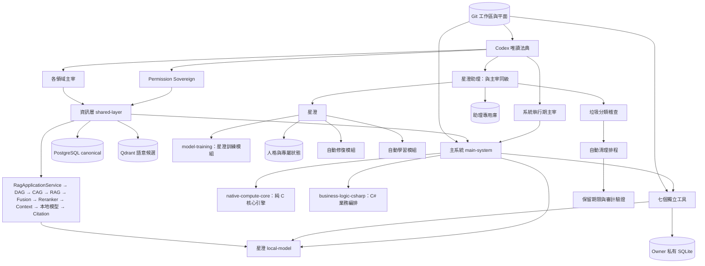
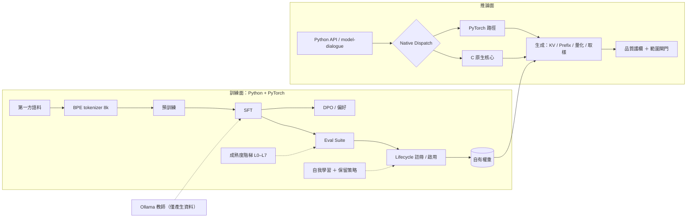
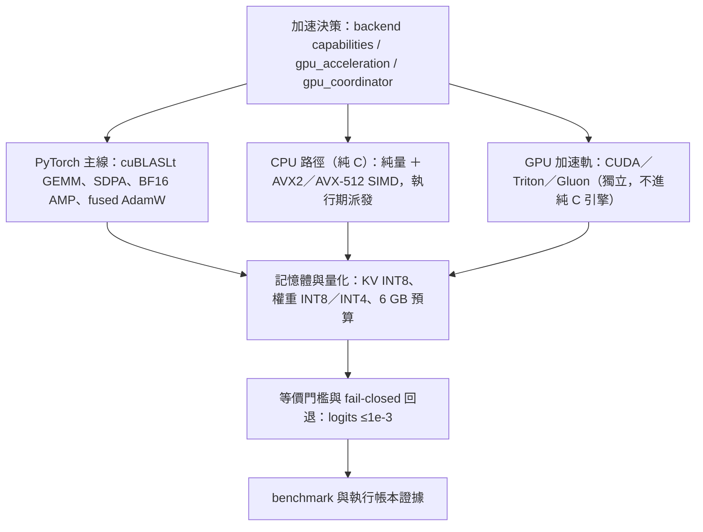
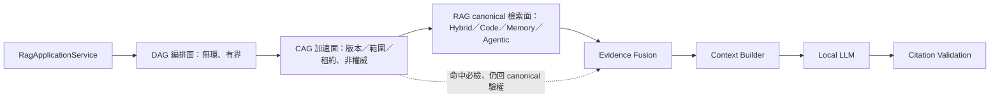
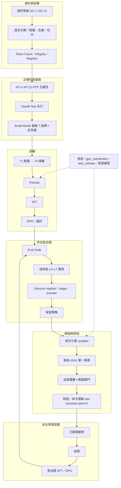

# GPTBridge 全專案暨星澄建置藍圖（整合版）

> 本文件為全專案（含星澄模型）**唯一共用藍圖**：只保留「**目標**」與「**未完成**」。
> **治理屬法典**（`governance_rule/codex/*` 為唯一權威）；本文件不負責治理，法典依據**只引用**（例：「法典 A534」），不複述法典條文內容。
> 已完成的施工紀錄、已解決缺口、歷史事件與完成證據不保留於本檔（內容見 Git 歷史）。
> 領域權威／證據文件（法典鏡像、契約、定版規則、README）保留原位。
> **禁止生成其他藍圖／流程／路線圖文件**；所有規劃內容一律併入本檔。
> **維護原則**：實作優於藍圖即保留實作並回寫藍圖，並附證據（commit／測試）；不得為符合藍圖而回退已驗證之實作（法典 A583）。
> 拓撲權威：元件歸屬一律以 `governance_rule/execution/audit/architecture_registry.json` 為準；
> 架構圖以 `governance_rule/codex/architecture-*.md` 為準。
> **本文件為藍圖層整合視圖，不複寫、不取代拓撲權威。**

- 日期：2026-09-21（改版：只保留目標與未完成）
- 性質：**待實作藍圖與未完成清單**。**本文件不變更任何程式碼、設定或資料。**
- 範圍：`E:\GPTBridge` 全專案；星澄（`Standalone tools/local-model`）為其中的模型層焦點。

---

## 0. 定位（藍圖＝待實作目標與未完成清單；治理歸法典）

- **藍圖只回答「要做什麼、還缺什麼」**：完成與否的治理判定屬法典，不在本文件。
- **法典引用**：本文件出現的法典字號（Axxx／Exxx）僅為引用；條文內容、效力、版本與封印一律以法典為準。
- **唯一共用藍圖（2026-09-20 定案）**：全工作者共用本檔；**禁止生成其他藍圖文件**；
  所有規劃內容（分期、驗收、缺口、依賴）一律併入本檔；領域文件只維護其領域事實。
- **維護原則（2026-09-20 定案；法典 A583）**：整合時以**實作優於藍圖即保留實作**為原則：
  實作若已提供更佳方案（含已通過測試者），**保留實作並回寫藍圖**；回寫須附證據（commit／測試），
  並同步更新優先佇列與缺口狀態。

**閱讀方式（原文件對應）**

| 原文件 | 領域 | 本文件對應 |
| --- | --- | --- |
| 《星澄模型四層建置藍圖》（本檔前身） | 模型四層 | 第 2 章 |
| `governance_rule/codex/architecture-project.md` | 全專案權威圖 | 1.2（引用） |
| `governance_rule/codex/architecture-{git,sql,rag,languages,tool-*}.md` | 各領域權威圖 | 1.2、1.3（引用） |
| `docs/module-topology.md` | A534 工具拓撲 | 1.6 |
| `docs/worktree-architecture.md` | Git 工作區 | 1.5 |
| `docs/sql-inventory-analysis.md` | SQL 盤點 | 1.8、第 6 章 |
| `shared-layer/docs/DATA_OWNERSHIP_CONTRACT.md`、`shared-layer/SQL_ARCHITECTURE_RULES.md` | SQL 資料所有權與定版規則 | 第 6 章 |
| `繁體中文命令理解流程.md`、`全自動模型流程備份.md`（local-model） | 星澄命令理解與自動流程（領域文件） | 第 9 章（共用流程藍圖） |
| `docs/architecture-evaluation-python-cpp-mixed.md` | Python／C++ 效能評估 | 1.9、4.2 P3 |
| `shared-layer/README.md`、`main-system/README.md` | 層邊界 | 1.7、1.8 |
| `AGENTS.md` | 自動化與模型治理現行章節 | 1.5、2.5 |

---

## 1. 目標

**整合目標（2026-09-20 定案）**

- 七大運行目標：**高速、高效能、低負載、自動化運行、高穩定性、自動學習及升級**。
- 星澄能力目標：**可與使用者聊天並完成任務**（任何操作皆經受治理、權限與安全閘門）。
- 資料與技術屬性：**不需龐大資料**；**可量化、可蒸餾、可加速、可推理、可搜尋網路**。

| 目標 | 機制／對應 |
| --- | --- |
| 高速／高效能 | 第 5 章加速引擎；§4.5 效能殘項；Phase 9 規模化 |
| 低負載 | 資源治理；adaptive plane；CAG／快取；auto-release；**§10.27 按需模組（降低平時功率）** |
| 低 Python 占用 | §10.63 主系統 Python 常駐資源縮減；§10.27 按需模組；§1.1 混合雙宿主 |
| 自動化運行 | §6 自動化分工；GitAutomation；維護×更新整合（§10.15）；自我學習 |
| 高穩定性 | 第 10 章收斂（藍綠＋lease、Task Lifecycle、連線恢復）；有界重試 |
| 自動學習及升級 | §2.5 self-learning／自主訓練升級；Phase 7；成熟度 L7 |
| 聊天完成任務 | L5 對話＋L6 工具與推理；安全閘門（歧義即確認）；A541 路由 |
| 不需龐大資料 | T1–T4 分級；教師蒸餾；Small 基線；eval suite |
| 可量化 | 成熟度 L0–L7 實測；`star-native-baseline/v1` 七指標 |
| 可蒸餾 | 教師蒸餾×SFT 產線（loopback Ollama 教師） |
| 可加速 | 純 C 核心＋SIMD；C++ 推論層；KV／prefix cache；INT8／INT4 |
| 可推理 | Phase 6（L6 可驗證推理與工具） |
| 可搜尋網路 | ai-collaboration 受治理通道（EC-4；結果一律未驗證候選） |

### 1.1 新增目標（2026-09-21 總督指令）

**目標主軸**：落地未提交變更 → 星澄對話品質（L5）→ 工具與推理（L6）→ 受控進化（L7）
→ 正式路由與規模化；全專案與星澄可並行。

**新增目標一：降低 Python 占用（footprint）**

- 目標：降低 Python 占用——**常駐 RSS／CPU／啟動時間／背景輪詢**。
- 量化目標與驗收（沿用 §10.63 之量化目標作為驗收形式）：

| 面向 | 目標 | 驗收 |
| --- | --- | --- |
| RAM | 後端常駐 RSS ≤ **220 MB**（−30%）；resident 服務 ≤ 64 MB／實例 | 連續 30 min 取樣 p95 |
| CPU | idle CPU ≤ **3%**（單核當量）；無 10 s 級空轉迴圈 | 30 min idle 取樣 |
| 啟動 | ready ≤ **3.0 s**；`phase-5` ≤ 600 ms | 啟動階段日誌 |
| 背景工作 | 事件驅動取代輪詢；固定週期工作 ≤ 6 個；每週期工作量有界 | 週期清單＋執行時長 |
| 重複資源 | resident 實例唯一；registry claimed == 實際存活；無孤兒行程 | G83 驗收 |

- 計畫、措施與批次見 §10.63；基線量測見 §10.11。

**新增目標二：主系統不再需要常駐 Python**

- 目標：**main-system 不得依賴常駐 Python 行程；Python 能力一律按需或改由非 Python 實作。**
- 相關：§10.27 按需啟動（常駐最小集）、§10.63 常駐資源縮減。
- 待規劃：本目標之實作範圍與 §1.8 資訊層（registry：information／standalone-service／**resident**／canonical；
  不得直接刪除或搬移）之關係、過渡順序與驗收方式。

**新增目標三：主宰核心混合雙宿主**

- 目標：**主宰核心為混合雙宿主——內部分為「治理主宰（Python）」與「高速執行核心（C 語言）」。**
- 相關：§10.31 主宰轉型為核心引擎、§10.32 子主宰消滅與全面模組化、§1.11 跨語言定位；
  轉型前置與權責不變（法典 A334／A591／A592）。
- **高速執行核心（C）原型範圍（2026-09-21 總督核定；全部可實作，純 C）**：
  | 能力 | 內容 |
  | --- | --- |
  | 主宰工作（Sovereign Work） | 純 C 原型：主宰核心工作的最小可執行單元 |
  | Event Loop | 可實作：單執行緒事件迴圈與喚醒機制 |
  | Task Queue | 可實作：有界佇列、優先序與背壓 |
  | Lifecycle State Machine | 可實作：狀態機（建立／就緒／執行／暫停／終止／失敗） |
  | Resource Monitoring | 可實作：CPU／記憶體／佇列深度取樣與回報 |
  | Deadline / Cancellation | 可實作：每任務截止時間與取消傳播（fail-closed） |
  | IPC 傳輸 | 可實作：受治理的本機傳輸（與 Python 治理主宰介接） |
- 落地位置：`native/core`（`native-compute-core` 元件內），與既有純 C 張量／SIMD／KV 池並存；
  驗收：原型可獨立建置、單元測試綠、與 Python 側介接不改變權責與法典效力。
- **邊界（2026-09-21 總督核定）**：**Fail-closed 政策仍以 Python（治理主宰）實作**；
  C 高速執行核心只提供事件迴圈／佇列／狀態機／資源監控／截止與取消／IPC 等執行能力，
  不承擔權限、稽核、fail-closed 判定與法典效力決策。
- **終態（2026-09-21 總督核定）**：**完整 C Sovereign ＋ 按需 Python Training**——
  主宰執行全數落在 C；Python 僅保留訓練能力且依任務按需啟用。
- **資源優化判定（整體淨占用，2026-09-21）**：不得以「Python 省 100 MB」換來
  「常駐 C#／C++／其他 worker 多 150 MB」；所有優化以系統整體淨占用為準（同時要求降低占用並提高穩定性）。
- **整體目標軸**：高效能、高速執行、低負載、低資源占用、降低 Python 依賴（依任務按需啟用）。
- **模型規模上限（2026-09-21 總督核定；以量化後版本為準）**：發行與常駐版本以**量化後（INT8／INT4）**計，
  參數量上限 **1B**（含 MoE 總參）；驗收以量化後權重檔大小與常駐記憶體量測（全精度參數量僅作證據記錄）。
  超過上限之規劃須 governor 核定，並重新評估 GPU／RSS／訓練成本預算；既有 Small／Base／Medium 路線須收斂在此上限內。
- **蒸餾（必要手段）**：上限內的能力保留以 **teacher→student 蒸餾＋量化**達成；
  蒸餾資料產線沿用既有 Ollama 教師政策（僅產生資料、結果為未驗證候選），蒸餾訓練屬按需 Python 訓練（§2.7）。
- **權重身分（2026-09-21 總督核定）**：星澄設計**不採版本號**；
  權重身分一律以 checkpoint sha＋lifecycle weights version 為唯一識別，報告與 pin 均引用該識別。
- **主宰職能邊界（2026-09-22 總督核定）**：主宰**只有裁決、審查、編排任務**；**執行單位為模組**。
  主宰不得直接執行領域工作；落地執行一律由模組承擔，主宰僅就領域裁決與審查（法典仍為唯一權威）。
- **模組語言政策（2026-09-22 總督核定）**：**執行模組一律以 C／C++／C# 編寫**；
  Python 僅保留治理主宰（fail-closed 政策）與按需訓練；過渡期遺留之 Python 執行模組依 §10.32 模組化逐一外移，
  完成後主系統不得依賴常駐 Python（§1.1 目標二）。
- **模組職責原則（2026-09-22 總督核定）**：每個模組**單一能力、單一職責**（one capability, one responsibility）；
  不得混責或同時承擔多能力，違者依 §10.28／§10.32 拆分；模組語言依上列政策（C／C++／C#）。
- **模組常駐政策（2026-09-22 總督核定）**：模組一律**按需使用、不常駐**——啟用即載入、完成即釋放
  （CPU／RAM／VRAM／GPU 依 §10.64 自動釋放）；常駐僅限法典要求之治理核心最小集（§10.27）。
- **工作期間資源約束（2026-09-21 總督核定）**：施工、測試與訓練期間**必須降低資源佔用**：
  ①測試以有界 worker（`pytest.ini`）與標的測試優先，禁止並行跑全量套件；
  ②施工與訓練不得同時搶 GPU／CPU 尖峰（依 GPU coordinator 與資源預算）；
  ③背景週期工作在施工／訓練窗口降頻或暫停（事件驅動）；
  ④改善宣稱須附前後量測（不建基線不得宣稱）；
  ⑤資源競用造成的失敗一律回退該競用行為。
- **自動資源釋放（CPU／RAM／VRAM／GPU；2026-09-21 總督核定）**：閒置、工作窗口結束或壓力超標時**自動釋放**並回基準：
  | 資源 | 現有機制 | 缺口（未完成） |
  | --- | --- | --- |
  | CPU | resource governor 降優先／回退；按需 worker 停止 | 按需 Python 行程退出、輪詢停用 |
  | RAM | EmptyWorkingSet 修剪、idle 卸載 | 模組快取卸載策略、常駐服務縮減 |
  | VRAM | 引擎 idle 300s auto-release、空快取 | 訓練↔推論 VRAM 歸還實測 |
  | GPU | GPU coordinator acquire／release | 釋放證據與長時驗證 |
  規則：僅在不影響 in-flight 工作時釋放（持強引用者完成後才釋放）；釋放動作留審計；fail-closed 判定仍在 Python。
  驗收：idle 後四項資源回基準並附前後量測；連續 30 min 無抖動重載。
- **CPU 上限 10%（2026-09-21 總督核定）**：施工、測試與背景工作期間，CPU 使用**上限 10%**（單核當量）；
  超過即降優先／限制 affinity／暫停，違者 fail-closed 降載；驗收以 idle 與工作窗口取樣（未達標不得宣稱完成）。
- **RAM 上限 30%（2026-09-21 總督核定）**：系統 RAM 使用**上限 30%**（施工、測試與背景工作期間）；
  超過即 WorkingSet 修剪／快取卸載／常駐縮減，違者 fail-closed 降載；驗收以 30 min 取樣 p95。
- **上限歸屬（2026-09-21 總督核定）**：上述 CPU 10%（單核當量）與 RAM 30% 為**工作者的總上限**——
  指**全部工作者（AI 代理及其行程）合計**，非單一行程上限；量測以工作者歸屬行程之總和為準。

### 1.2 全專案藍圖視圖（Mermaid；權威圖見 codex）



### 1.3 正式資訊路徑（目標；不變）

`Caller → Information Channel → Permission / Scope → RagApplicationService → DAG Planner / Executor → CAG Gate → RAG Retrieval（Hybrid / Code / Memory / Agentic）→ Evidence Fusion → Reranker → Context Builder → Local LLM → Citation Validation → Result`

DAG 是查詢、索引與修復工作流的無環編排面，不取代 Application Service；
CAG 是安全、有版本、有範圍且非權威的快取增強面，不取代 RAG；
RAG 是 canonical knowledge retrieval 面。Qdrant 與 PostgreSQL canonical 邊界不變，SQLite 只准 degraded fallback。

### 1.4 資料平面（目標；不變）

Git 管來源與歷史；PostgreSQL 管已宣告的中央正式狀態；Qdrant 僅保存語意候選；
SQLite 僅保存 owner 私有狀態與有界降級資料；模型只負責推論。

### 1.5 Git 平面與自動化（目標）

- 工作區：`main`、`.worktrees/git`、`.worktrees/local-model`、`.worktrees/rag`、`.worktrees/ui`（另有 `.kilo` worker 工作區）。
- 目標：**GitAutomationService**（`main-system/src-core/tasks/git_automation.py`）以 in-process 服務涵蓋同一 worktree 集合：
  - 每 60 秒 commit sweep（指紋需先穩定 60 秒）；
  - 每 300 秒 sync cycle（commit → merge worker branches → audit → fast-forward）。
- 鎖、merge/rebase 守衛、audit、no-push 規則留在 `governance_rule/execution/git_tiers/`；coordinator 才會 push `main`。
- 狀態：`main-system/runtime/state/git-automation.json`。
- 未完成：legacy `scripts/git-supervisor.py` 仍可用但非預設（退場未完成）。

### 1.6 獨立工具（A534：七個）

| 工具 | 路徑 | 生命週期（Registry） | 備註 |
| --- | --- | --- | --- |
| local-model（星澄平台） | `Standalone tools/local-model/` | on-demand | 含 `xingcheng` 與嵌套 `model-dialogue` |
| model-dialogue（star-chat） | `local-model/model-dialogue/` | on-demand | 主系統內的獨立工具；host/runtime owner = `xingcheng` |
| ai-assistant | `Standalone tools/ai-assistant/` | on-demand | |
| investment-mobile | `Standalone tools/investment-mobile/` | on-demand | Registry 角色為 development-maintenance |
| ai-collaboration | `Standalone tools/ai-collaboration/` | on-demand | 受治理網路通道（星澄研究用） |
| file-sorter | `Standalone tools/file-sorter/` | on-demand | |
| vaultly | `Standalone tools/vaultly/` | on-demand | |

非獨立工具：

- `system-rescue`：主系統內部服務（集中修復、封裝器；以工具 ID 分隔修復資料庫）。
- `global-cleaner`：**retired**、非執行；身分與稽核紀錄保留為證據，自動清理由主系統內部服務承接。
- `business-logic-csharp`：execution / standalone-service，依賴 `local-model`、`shared-layer`；工具隔離政策 512 MB。
- 星澄助理（xingcheng-assistant）：與主宰同級之獨立特權機構（UI 抽屜 ＋ 專用資料庫）。

### 1.7 主系統（`main-system/`）（目標）

- `src-ui`：Electron main/preload ＋ React renderer；星澄助理抽屜（`AppXingchengDrawer.tsx`）。
- `src-core`：
  - IPC `127.0.0.1:8765`；WebSocket 命令路由、治理請求轉接、工具生命週期 broker。
  - `core_system/`：登錄模組（module registry v1.02000）；每個模組 ≤3 公開入口、≤12 authored callables、≤500 effective lines（法典 A430／E160）。
  - `core_system/rag/`：RAG 實作（`service/`、`dag/`、`cag/`、`retrievers/`、`orchestration/`、`lifecycle/`、`pipeline*`、`a549_benchmark.py`）。
  - `tasks/`：`git_automation.py`、`model_service_activation.py`（懶啟動星澄）。
  - 啟動執行器：`startup_executor_phases.py`。
- **目標：只常駐必要核心；其餘模組與服務按需啟動（§10.27）；逐步達成「不再需要常駐 Python」（§1.1 新增目標二）。**
- 工具隔離政策 `config/tool-isolation-policy.json`：`business-logic-csharp` 512 MB、
  `native-compute-core` 1024 MB、`model-training` 4096 MB；`local-model` 2048 MB。
- 生命週期規則：工具視窗採前景生命週期，關閉即終止程序樹；治理核准的無介面常駐服務除外。

### 1.8 資訊層（`shared-layer/`）（目標）

- `database/`：PostgreSQL canonical、migration（058 優先佇列、087 安全、113 工作流…）；SQL 盤點見 `docs/sql-inventory-analysis.md`。
- `adaptive/`：有界控制面（admission、動態 pool/batch、retry、breakers、maintenance、cost gate、SQLite fallback、Qdrant budgets）；
  envelope pool 2–8、batch 50–500、reconcile 1–2；transport 優先佇列（critical / interactive / background / maintenance）。
  目標：`gpu_coordinator.py`（GPU 維度：`torch.cuda.mem_get_info` ＋ `nvidia-smi` 雙源、fail-closed、訓練/推論優先級）接入訓練／推論呼叫點。
- `security/`：DSN 目的分離、session identity、credential metadata only、rotation with grace、generation fence、SQLite/Qdrant scopes、least-privilege 認證。
- `workflow/`：Saga（PostgreSQL 為權威）、冪等步驟與補償、leases、outbox/inbox、publish barrier、atomic writes、transaction guard。
- `performance/`：`native_dispatcher`（A219 契約）與各項基準（parser / vector / transformer / native_core / regression）。
- `contracts/`、`local/`、`observability/`。
- 邊界：shared-layer 為 registry 登錄之**常駐資訊層**（`architectural_role=information`、`runtime_form=standalone-service`、
  `lifecycle=resident`、`canonical=true`）；**不得直接刪除或搬移**；變更須走契約版本軸與法典（A8／A44／A49、A263）。

### 1.9 原生核心（C）與推論引擎（C++）——語言分層（目標）

- 定案（2026-09-20）：語言責任依 §1.11 四語言定位。**C 核心引擎層維持純 C**
  （tensor 基礎運算、SIMD、記憶體管理、CPU kernel、穩定 C ABI）；**C++ 承接原生推論執行層**
  （Transformer 推論、模型載入、KV Cache、Sampling、資源管理）。
- `native/core/`：`parser.c`、`vector.c`、`transformer.c`、`kv_pool.c`、`memory.h`（純 C，AVX2＋FMA）。
- `native/bridge/gptbridge_native.c`（sole C ABI thunk，A221/E186，純 C）、
  `native/include/gptbridge_native.h`（sole public C header）；
  KV block pool ABI：`native/include/gptbridge_kv_pool.h`（C 持有 KV 記憶體配置，
  C++ 推論層經由此 ABI 存取，commit `83bd4f0a`）。
- Registry：`native-compute-core`（build-tooling / resident，依賴 `governance_rule`）。
- 推論派送以 A219 契約組合 C 原生 `matmul`／`softmax`；**訓練路徑永不派送**；parity 逐形狀驗證快取；ABI 例外回退純 Python。
- **未完成**：C++ 推論執行層僅支援 batch=1／FP64／dense；MoE、量化、prefix cache 重用、CUDA、batch>1 皆 fail-closed；
  生產路由與資源接線未完成（§4.2 P3b–P3f）。
- worktree 資產：`parser.cpp`／`vector.cpp`／`transformer.cpp`／`memory.hpp`／`simd.hpp` 為 C++ 變體，
  可作為 C++ 推論層的參考；C 核心以主樹 `.c` 為準，不得與 C++ 核心混用。
- 綁定：C++ 引擎對 Python 的綁定可用 pybind11（C++ 層內合法）；**C ABI（`gptbridge_native.h`）仍為 C 的穩定邊界**。

### 1.10 啟動、腳本與文件

- `launcher/`：啟動狀態儲存（`startup-journal.jsonl`、`orchestrator-report.json`）；啟動閘門依環境、runtime 探測與治理稽核。
- `scripts/`：`resource-governor.py`（CPU/記憶體調節）、git 工具（gate / worktree sync / self-commit）。
- `docs/`：module-topology、worktree-architecture、sql-inventory-analysis、architecture-evaluation-python-cpp-mixed。

### 1.11 跨語言定位與責任（2026-09-20 定案）

> 口訣：**Python 開發訓練、C++ 正式推論、C 核心引擎、C# 業務編排。**
> 混合雙宿主（2026-09-21 總督指令）：主宰核心內部分為**治理主宰（Python）**與**高速執行核心（C 語言）**；
> 兩者關係與轉型見 §10.31。

| 語言 | 正式定位 | 主要責任 |
| --- | --- | --- |
| Python | 開發與訓練層 | PyTorch、Autograd、Pretraining、SFT、MoE 訓練、權重匯出（不承載系統模組） |
| C++ | 正式推論層＋物件導向 | Transformer 推論、模型載入、KV Cache、Sampling、資源管理、**物件導向（OOP）元件** |
| C | 核心引擎層 | Tensor 基礎運算、SIMD、記憶體管理、CPU Kernel、穩定 C ABI、**核心引擎（原主宰職能，純 C）**、**全面模組化之模組（純 C）** |
| C# | 業務編排層 | **外部協調**、模型選擇、任務調度、生命週期、資源預算、狀態管理 |

- 邊界：C ABI 是 C／C++ 的唯一穩定介面；**C++ 不得滲入 C 核心層**；Python 只負責訓練與匯出；
  C# 承接業務編排（現況多數仍在 Python／`business-logic-csharp`，需分階段導入，見 §4.2 P7）。
- 跨語言只經已登錄、已版本化契約（codex architecture-languages）；語言邊界不改變資料、權限與決策所有權。
- GPU 加速技術（CUDA／Triton／Gluon 等）為**獨立加速軌**，不屬四語言分層；
  不得因此讓 C 核心承載 GPU 核心或 C++（§5.5）。
- 目標元件：`native-compute-core`（純 C 核心引擎，§1.9）、`model-training`
  （星澄訓練模組，屬模型研發訓練層）、`business-logic-csharp`（C# 業務編排，§4.2 P7）。

---

## 2. 星澄（四層模型）目標與設計

**星澄定位與目標（2026-09-20 定案）**

- 目標：**聽懂命令**（繁中為主；保留原句，抽取意圖／動作／對象／參數／限制）＋**可與使用者聊天**
  （多輪對話、指令遵循、合理回答，而不是只複述訓練資料）。
- 主線：推論以原生模型服務對話與命令理解；**Ollama 僅教師與專家**，不取代星澄神經網路核心。
- 現階段門檻：成熟度 **L5**（多輪對話與指令遵循）；命令理解以 `star-semantic-plan/v1` 欄位
  與既有 `繁體中文命令理解流程.md` 對齊。
- 延伸：L6 推理與工具使用、L7 受控進化；破壞性操作維持安全閘門（歧義即 `SAFE_CONFIRMATION_REQUIRED`，不執行）。
- 路由：A541 對話自動路由預設星澄第一候選；本地模型預設關閉（A540），由使用者開關啟動。

### 2.1 Base Model（目標架構）

- 架構選項（`XingChengConfig`）：small ~5M、medium ~27M、base ~100M、xlarge ~500M、large ~1.2B；
  MoE 變體：small ~20M／act ~7M、medium ~146M／act ~44M、base ~497M／act ~157M、xlarge ~2.9B／act ~842M、large ~6.9B／act ~2B。
- **架構方向（2026-09-20 定案）：使用 MoE（稀疏專家）**。`XingChengMoE` 具 token-choice top-k 路由、
  SwiGLU experts、aux loss＋z-loss、路由指標（expert load／entropy／utilization／collapse）；
  `transformer_block` 以 `use_moe`＋`moe_layer_interval` 掛載。推論目前為逐專家 Python 迴圈（稠密執行），
  **稀疏執行與專家權重管理待建（R5／P3d／P3f）**。
- **架構定位（2026-09-20 定案）：星澄為「多組態 GPT」**——同一 **decoder-only 自迴歸架構族**，
  支援 Dense（small／medium／base／xlarge／large）與 MoE（small／base／xlarge／large）多組態；
  **Tokenizer／評測／生命週期共用**，權重、checkpoint、訓練紀錄**各自獨立**（組態記入 Release Manifest）；
  推論組態另含精度（FP32／BF16／INT8／INT4）、KV 量化、CPU／GPU 與 Python／C++ 路徑。
- **工具能力定位（2026-09-20 定案）**：星澄**不一定要具備很多工具能力**（工具由受治理工具與執行器提供），
  但**必須要會呼叫工具**：`star-tool-call/v1` schema 合法、參數正確、工具結果解讀、錯誤與拒絕處理；
  呼叫一律經資訊通道與權限路由（**不得自行授權或執行**）；工具結果視為**未驗證輸入**，
  直到通過驗證為止。此能力屬成熟度 **L6** 與 Phase 6 驗收。
- 訓練面：Python ＋ PyTorch（§1.11）；C 核心引擎承接 tensor／SIMD；C++ 承接正式推論。
- tokenizer：自有 byte-level BPE 8,192（`xingcheng-bpe-8k`，`tokenizer.json` ＋ manifest）；
  chat 角色標記為文本層 `<|system|>`／`<|user|>`／`<|assistant|>`／`<|tool|>`／`<|eot|>`（硬 token-ID 綁定屬 tokenizer v2）。

### 2.2 Pretraining（目標與標準）

**完整預訓練資料管線（2026-09-20 定案）**

> 訓練資料必須**可追蹤、可驗證、可重現**；未授權與機密資料不得自動進入訓練集。

| 元件 | 設計要求 | 驗收 |
| --- | --- | --- |
| Corpus Registry | 來源登錄檔：來源 id／路徑／擁有者／授權／語言／敏感級別／啟用狀態 | registry 可查；未登錄來源不得進入 |
| Dataset Version | `dataset_id`（內容定址）＋`dataset_version`（版本序列） | 欄位齊備且可重現 |
| Language Classification | 逐文件語言分類（zh-TW 主、en、code、math、science、general、reading）＋統計 | 每文件標記；配比報告 |
| Source Tracking | 來源模組／檔案／範圍／取得時間／授權 | 任一文件可反查來源與授權 |
| License Validation | 以 registry 驗證授權；未授權即拒收（fail-closed） | 拒收事件與審計 |
| Unicode Normalization | NFC 等安全正規化；**保留原始 ↔ 正規化映射**；程式碼／路徑／專有名詞／語意不得破壞 | 映射可還原；等價測試 |
| Document Deduplication | 精確＋近似去重（指紋／相似度門檻），保留來源關係 | 去重率與碰撞檢查 |
| Sequence Packing | 管線化：packing 設定與產物入 manifest（block size／EOS 策略） | 可重現的 packed 產物 |
| Training / Validation Split | 固定演算法＋版本記錄；防洩漏（同源文件不跨 split） | split 可重現、無洩漏 |
| Token Count | 一律計算並綁定 tokenizer 版本／雜湊 | `token_count`＋tokenizer sha256 |
| Dataset Integrity | 資料集根雜湊＋驗證 CLI＋完整性報告 | 篡改可偵測；驗證指令 |

**語言方向與配比（目標）**：繁體中文為主，其次英文、程式語言、數學、科學、一般知識、閱讀理解；
配比門檻於 DG-3（語言分類）產出統計後定案。

**排除規則（fail-closed）**：

- 不得自動加入：法典機密（zh-TW 鏡像五份 part 與 codex DB）、權限資料（permission directory／角色憑證）、
  星澄私有輔助通道、runtime 狀態與稽核日誌、未授權外部資料。
- 原始 ↔ 正規化映射：以偏移或並存欄位保存；正規化不得改寫程式碼區塊、路徑、專有名詞與數值。

**未完成**：正式規模的語料治理與詞表擴充（32k／64k 配比）、可重現的預訓練報告；
語料來源擴充（繁中為主的多語文本）仍待後續批次。

### 2.3 Post-training（目標與標準）

- SFT：`training/sft.py`（prompt-masked loss、AMP、可續訓）；governed job 鏈 `queued → preflight → training → validating → completed`。
- 教師蒸餾：教師為 loopback Ollama；**教師權重永不進入推論路徑**。
- 偏好訓練：`language_preference_pair`；`training/dpo.py`（beta-anchored logsigmoid、凍結 reference、completion-masked log-prob、可續訓）。
- 工具呼叫：`tool_call_format.py`（`star-tool-call/v1`，確定性標記、有界驗證、SFT 相容）。
- Adapter 治理：`candidate → validated → staged → active`；activate 只動 adapter 指標，`automatic_weight_replacement` 恆 0。
- 評估：`native_eval_suite.py`（`star-native-eval-suite/v1`）；lifecycle `evaluation_report`。
- MoE 後訓練：MoE 骨幹的 SFT／DPO 排入 Phase 9，需附路由穩定性檢查（entropy／負載均衡／無坍塌）。
- **缺口（未完成）**：L5 對話品質（回合邊界、逐字複誦、限定回答、多輪記憶）、L6 推理＋工具呼叫樣本、L7 受控進化實測。

**Next Token Prediction 正確性測試（2026-09-20 定案）**

> 訓練必須具備正確的自迴歸關係：Input `A B C D` → Target `B C D EOS`；
> 模型在預測位置 t 不得取得任何 >t 的資訊。

測試矩陣（NT-1–NT-12，獨立測試檔 `tests/test_ntp_correctness.py`）：

| 編號 | 檢查 | 方法 | 通過條件 |
| --- | --- | --- | --- |
| NT-1 | Sequence Shift | 固定序列（A B C D）斷言位移對位 | target[t] = input[t+1]；末位 target = EOS |
| NT-2 | Input / Target IDs | 形狀與 dtype、位移關係 | (B,S) long；無 off-by-one |
| NT-3 | Attention Mask | padding 位 0、內容位 1 | 與長度一致；padding 不參與注意力 |
| NT-4 | Causal Mask | 改尾端 token，前段 logits 不變（有／無 mask） | 差異 = 0 或 <1e-6 |
| NT-5 | EOS Handling | EOS 入目標；packed blocks 邊界 | EOS 計入；跨文件不互相學習 |
| NT-6 | Vocabulary Range | 所有 id ∈ [0, vocab)；tokenizer vocab == model vocab | 越界即 fail |
| NT-7 | Ignore Index | `pad_id` 為 ignore_index；手算對照 | 遮蔽位不進 loss；數值一致 |
| NT-8 | Label Mask（SFT） | prompt／padding 遮蔽；僅 assistant 內容計 loss | 遮罩位不進 loss |
| NT-9 | Cross Entropy | 固定 logits／labels 手算 mean CE | 與 `F.cross_entropy` 一致 |
| NT-10 | Loss Reduction | mean 只除有效 token 數 | 與「排除 padding」手算一致 |
| NT-11 | Target 不可讀取 | 改 target 值檢查同位置 logits 不變 | 逐位相同（無洩漏） |
| NT-12 | Tokenizer 一致性 | checkpoint 內嵌 vs runtime：同 artefact／sha256；round-trip | 完全一致 |

驗收：NT-1–NT-12 全綠；**負向測試**（注入 padding 不得改變 loss；越界 id 必須 fail；target 改動不得影響 logits）
必須通過；測試獨立（不依賴服務路徑）、固定 seed、CPU 可跑。

**Small Model 訓練基線（2026-09-20 定案）**

> 第一個正式基線以 **small 5M Dense** 為對象；**先 overfit 再正式訓練**；
> 訓練品質不只看 Training Loss。

檢核（12 項）：從零初始化（固定 seed、記錄結構與參數量）／可接受訓練資料（corpus train-val、tokenizer 綁定）／
Backward 正常（全參數有梯度）／Optimizer 可更新權重（step 後權重變化、logits finite）／Loss 可下降／
Checkpoint 可儲存（含 sha256）／Checkpoint 可恢復（續訓：optimizer 與 step 還原、loss 連續）／
可獨立生成 Token（不依賴外部模型、greedy 確定性）／**Overfit Test 先行**（固定小資料集：loss ≤ 0.5 或 ≤20% 初始值，測後還原）／
正式訓練（固定 seed、資料版本、預算）／指標完整／**反背誦**。

指標（每項落報告）：Training Loss｜Validation Loss｜Perplexity｜Tokens Per Second｜
GPU Memory（峰值）｜Training Time｜Gradient Norm（裁切前）。

反背誦規則：

- 必須同時看 Validation Loss 與**未見提示**生成；train 下降但 val 停滯／上升超過容忍 → 標記 overfit，不得宣稱基線通過。
- 未見提示探針（非訓練語料問題）輸出須足量、多樣、非退化（對齊 L4 探針精神）。

驗收：12 檢核全過（含 overfit 先行）；7 指標齊備且可重現（seed／資料版本／tokenizer sha／checkpoint sha）；
反背誦成立；報告格式 `star-native-baseline/v1`（含環境、命令、結果）。

**未完成（Phase 2B 殘留）**：繁中語料擴充後重跑 zh 未見提示探針。

**Medium／Base 擴展策略（2026-09-20 定案）**

- 前提：Small 通過驗收（12 檢核＋7 指標＋反背誦）後，先以 **medium 27M** 驗證擴展，再進 **base 100M**。
- 控制變數：**相同資料版本**（`dataset_id`／`dataset_version`）、**相同評估資料**（eval suite／held-out）、
  **相容 tokenizer**（同一 artefact、vocab 對齊）。
- 獨立性：各自**獨立權重、獨立 checkpoint、獨立訓練紀錄**（每模型一份 `star-native-baseline/v1`）。
- 比較矩陣（8 項）：模型參數量、訓練 Token 數、Validation Loss、Perplexity、生成品質、
  訓練吞吐量、推論吞吐量、VRAM 使用量。
- 判定規則：**不得直接以模型參數增加作為能力提升證據**；須以同評估集的可量測改善
  （val loss／ppl／生成品質）並同列成本（吞吐、VRAM）共同判定；未達門檻不得宣稱擴展成功。
- 通過條件：medium 在相同 token 預算與評估下相對 small 顯示可量測改善，方可依序進 base。

**MoE 訓練品質控制（2026-09-20 定案）**

- 對象：**Top-2 Router**、**4／8 Expert**（`moe_num_experts` 4 或 8）、**Router FP32**、**FMA**。
- 訓練檢查（8 項）：Router Logits、Router Probability、Expert Selection、Expert Dispatch、
  Expert Output、Expert Combine、Router Gradient、Expert Gradient；**確認 Top-2 路由正確**
  （top-2 indices 正確、權重正規化和為 1、dispatch/combine 對位）。
- 健康指標（5 項）：Expert Utilization、Expert Token Distribution、Router Entropy、
  Load Balance Loss、Expert Collapse Detection。
- 約束：**不得所有 token 集中到少數 Expert**；所有預期可訓練的 Expert 在適當測試條件下
  **均可收到梯度**（梯度可達性測試）。
- Dense／MoE 對照測試（6 項）：總參數、活躍參數、**實際 FLOPs（實測）**、訓練速度、推論速度、模型品質。
  **不得只根據活躍參數估算 MoE 的真實執行成本**。
- 非阻塞規則：**MoE 驗證不得阻塞已可用的 Dense 模型**（Dense 路徑照常運作，MoE 於旁路驗證）。
- **未完成**：訓練／推論速度對照矩陣之 GPU VRAM 對照與稀疏執行；推論仍為逐專家 Python 迴圈（稠密執行）。

**原生對話訓練（Chat／Instruct）標準（2026-09-20 定案）**

- 前提：Base Model 預訓練完成後建立。
- 角色支援：**System／User／Assistant／Tool**（文本層標記，沿用 `star-chat-format/v1`）。
- 模型必須理解：使用者問題／歷史對話／當前任務／回答格式／工具結果／**結束條件**。
- 繁中對話資料類別：日常對話、多輪追問、語意省略、錯字理解、中英文混用、程式問題、數學問題、閱讀問題、工具使用情境。
- 續接準則：例「使用者：繼續」→ 必須**依目前對話狀態**延續上一個未完成任務；
  **不得只根據「繼續」兩個字執行固定回答**（列為驗收反例）。
- 角色與遮罩：訓練與評估必須正確處理對話角色、Assistant 回答區段與 **Loss Mask**
  （僅 assistant 內容計 loss；system／user／tool 與 padding 不計）。
- 驗收：角色渲染往返、遮罩位置正確、多輪記憶、續接反例、工具結果引用。

**Python／C++ 推論一致性標準（2026-09-20 定案）**

- 共用同一權重（同一 checkpoint）：Python＝PyTorch Transformer；C++＝Native Core（AVX2＋FMA）。
- 必須相同：Tokenizer、Config、Weight、Input IDs、Position IDs。
- 分層比較：Embedding／RMSNorm／RoPE／Attention／MLP／MoE／Hidden States／Logits／Generation。
- 容忍度：逐層制定**合理且可驗證**的誤差範圍；**不得因 CPU／GPU 浮點運算順序不同而要求逐位元一致**；
  量化路徑（INT8／INT4）**另行測試、獨立門檻**。
- 品質閘門：差異不得造成不可接受的推論品質下降（logits 最大差、top-1 一致、greedy 逐字、ppl 差共同判定）。
- **未完成**：MoE／量化路徑上線後需各補對應逐層探針（Phase 5E 依賴 P3）。

**KV Cache 正確性與效能測試標準（2026-09-20 定案）**

- 保留精度：**FP16／BF16 Cache**、**INT8 Cache**（per-token、per-head 對稱量化）。
- 檢查（6）：Cache Position／Cache Length／Cache Update／GQA KV Head Mapping／RoPE Position／Context Overflow。
- 正確性：**Full Forward** vs **Prefill＋Decode＋KV Cache**，相同模型／權重／輸入下逐步 Logits 對比。
- INT8 KV Cache：**另計量化誤差**（獨立門檻）。
- 情境：短上下文／中上下文／長上下文／最大支援長度。
- 記錄：VRAM、RAM、Prefill Latency、Decode Latency、Tokens Per Second。
- 規則：**不得以效能提升交換未經評估的嚴重品質損失**。

**原生模型能力評估（Evaluation Suite）標準（2026-09-20 定案）**

- 建立**獨立 Evaluation Suite**；能力分類九類：繁體中文、英文、數學、程式碼、閱讀理解、
  多輪對話、上下文追蹤、指令遵循、工具呼叫格式。
- **所有原生模型測試必須停用第三方模型代答**（teacher／Ollama 不得參與評估路徑）。
- 每次評估記錄：Model ID、Model Version、Tokenizer Version、Dataset Version、
  Inference Backend、Quantization、Evaluation Result。
- 模型更新前後執行**相同保留測試**；**測試資料不得與訓練資料重疊**（以 dataset_id／hash 驗證）。
- **能力下降時不得自動發布新版模型**（發布閘門 fail-closed）。

**模型權重演進機制（2026-09-20 定案）**

- 模型更新**不得直接覆寫**目前正式使用的權重；階段物件：
  **Candidate Model → Training Checkpoint → Evaluation Result → Verified Model → Active Model**。
- 流程：現行模型 → 建立候選版本 → 訓練 → 儲存候選權重 → **完整性驗證** → 能力評估 →
  **推論一致性檢查** → **發布閘門** → 正式模型。
- 發布須遵守既有 GPTBridge 認證發布與啟用規則（lifecycle／adapter registry；`auto_weight_replacement=0`）。
- 訓練失敗時**保留原有正式模型**；**不得回復到未認證的舊權重**。

**原生能力尚未證明項（矩陣殘項）**

| # | 能力 | 狀態 |
| --- | --- | --- |
| 6 | Python／C++ 同模型 | 待建（Phase 5E；依賴 P3） |
| 7 | Dense／MoE 訓練與推論 | 部分：MoE 稀疏執行與專家權重管理未建（P3d／P3f／R5） |

### 2.4 Inference System（目標）

- 取樣：per-request `temperature` / `top_k` / `top_p` / `seed` / `repetition_penalty`；同 seed 逐字確定性。
- KV cache：prefill／decode／update／position／causal／GQA layout 六項測試鎖定；
  FP32／FP16／BF16／INT8（per-token、per-head 對稱量化）。
- Prefix cache：`inference/prefix_cache.py`（`PrefixKVStore`；僅 batch_size=1、完整前綴比對、LRU、fingerprint）
  具 `generate` 接點；驗收：跨請求重用命中（`last_prefix_reuse`）、重用後 greedy 生成與無快取逐字一致、
  LRU 逐出有界、無命中回零、batch>1 不啟用、mask 非全 1 不提交。
- 量化推論：INT8／INT4（真 4-bit packing，兩值/byte）；engine `quantize=8/4` ＋ `XINGCHENG_NATIVE_QUANTIZATION`。
- 原生派送：`execution/dispatch.py`（純 C 原生 matmul＋softmax 組合因果注意力；CPU、無 mask、因果、
  不需梯度、形狀 parity；`-1e30` 有限遮罩避免 NaN）。
- Triton kernels：RMSNorm／SwiGLU／RoPE 預設啟用（`XINGCHENG_TRITON_KERNELS=0` 可關閉）；
  需要梯度時仍自動退回 PyTorch。
- GPU／CPU 資源：GPU 優先；CPU 執行緒上限與 `cpu_max_new_tokens`；訓練 CLI `--cpu-threads`。
- 自動釋放：`execution/auto_release.py`（閒置卸載、記憶體壓力立即釋放、弱引用追蹤）；接線引擎生命週期。
- 硬體加速引擎（本機 RTX 3050 6 GB／Ryzen 7 7800X3D AVX-512）：見第 5 章（ACC-1～ACC-4）。
- **引擎層目標**：Python 訓練／開發路徑維持（`checkpoint.py`／`tokenizer.py`／`bpe.py`／
  `inference/generate.py`／`modules/attention.py`／`chat_format.py`）；完整 C++ 推論執行層為目標（§4.2 P3b–P3f），
  核心運算續用 C 核心；**未完成**：MoE／量化／prefix cache 重用／CUDA／batch>1 生產路由與資源接線。

### 2.5 星澄治理模組（目標）

| 模組 | 格式／位置 | 目標 |
| --- | --- | --- |
| 自我學習 | `star-self-learning-policy/v1`（`runtime/settings/self-learning.json`） | enabled、min_new_examples 24、auto_activate true、suite `star-native-eval-dialogue-v1`、device cuda、max_steps 400；watcher 常駐；循環尾端接保留策略 |
| 成熟度 | `star-model-maturity/v1`（`maturity.py`） | 八級階梯 L0–L7，只以實測決定 |
| 保留策略 | `star-retention-policy/v1`（`runtime/settings/retention.json`） | enabled；job dirs 3、logs 30d、reports 30d、maturity／self-learning reports 10、snapshots 5；永不刪 lifecycle 引用或 native-engine pin 路徑；刪除記於 `retention.jsonl` |
| 生命週期 | `star-model-lifecycle/v1`（`lifecycle.py`） | 11 狀態、非法轉移 fail-closed、權重永不覆蓋、rollback 指回、原子持久化 |
| 自動釋放 | `execution/auto_release.py` | 閒置卸載、記憶體壓力釋放、弱引用追蹤 |
| GPU 協調 | `shared_layer.adaptive.gpu_coordinator` | 雙源查詢、優先級、逾時 fail-closed |
| 人格／身分 | identity 儲存（受治理，版本與稽核） | 對話設定人格、伺服器端注入、對話視窗無人格編輯器 |
| 路由政策 | A540 / A541 | 本地模型預設關閉、使用者開關；對話自動路由預設星澄第一候選，不可用才依備援順序轉用 |

**統一模型成熟度（`star-model-maturity/v1`，2026-09-20 定案）**

| LEVEL | code | 定義 | 實測閘門（現行） |
| --- | --- | --- | --- |
| 0 | `structure_init` | 模型結構可初始化 | 結構初始化、參數全 finite |
| 1 | `forward_backward` | Forward／Backward 正常 | forward loss finite、全參數有梯度、optimizer step 後 logits finite |
| 2 | `overfit_small` | 小資料集成功過擬合 | 固定 8 樣本：loss ≤ 0.5 或 ≤ 20% 初始值（測後還原權重） |
| 3 | `effective_pretrain` | 完成有效語料預訓練 | held-out ppl ≤ 25% × vocab_size（對齊 random-uniform 基線） |
| 4 | `generation` | 具備獨立語言生成能力 | ≥75% 探針產生足量、多樣、非退化文本 |
| 5 | `dialogue_instruction` | 多輪對話與指令遵循 | ≥75% 對話探針（回合邊界、逐字複誦、限定回答、多輪記憶） |
| 6 | `reasoning_tools` | 可驗證推理與工具使用 | 算術／比較可驗證＋`<tool_call>` schema 合法，通過率 ≥50% |
| 7 | `controlled_evolution` | 受控持續學習與版本演進 | kill-switch fail-closed＋lifecycle register／activate／rollback＋受管升級證據 |

原則：

- **成熟度必須由實際測試決定**；等級須連續通過，首個 `fail`／`skipped` 即封頂。
- **參數量（及資料量、步數等規模指標）只作證據，不得自動提高成熟度**。

**模型訓練成熟度分級（2026-09-20 定案）**

> 分級以**模型配置**為軸，定義「訓練目標、資源預算、附加驗收」；
> 成熟度認證仍由 L0–L7 實測決定，分級本身不構成成熟度。

| 訓練分級 | Dense 配置 | MoE 配置 | 目標成熟度 | 訓練內容 | 附加驗收 |
| --- | --- | --- | --- | --- | --- |
| T1 輕量 | small ~5M；medium ~27M | small_moe total ~20M／act ~7M | L0–L3 | 結構 → 過擬合 → 有效預訓練 | L3 閘門（ppl ≤ 25%×vocab）；MoE 加路由健康（entropy／負載均衡／無坍塌） |
| T2 基礎 | base ~100M | base_moe total ~497M／act ~157M | L3–L4 | 預訓練 ＋ SFT | L4 生成探針 ≥75%；eval suite 紀錄 |
| T3 主力 | xlarge ~500M | xlarge_moe total ~2.9B／act ~842M | L4–L5 | 預訓練 ＋ SFT ＋ DPO | L5 對話探針 ≥75%；6 GB 預算內（INT8／INT4、KV 量化、記憶體策略） |
| T4 旗艦 | large ~1.2B | large_moe total ~6.9B／act ~2.0B（未列） | L5–L6 | 全鏈（預訓練 → SFT → DPO → 評測） | L5–L6；算力預算待定 |

規則：

- 分級只定義**訓練目標與資源預算**；不得因配置較大而自動提高成熟度或略過 L 級閘門。
- MoE 各級一律加註路由健康閘門；稀疏執行與專家權重管理見 R5／P3d／P3f。
- 升級順序：同一分級內先達成目標，再進下一分級（T1 → T4 依序）；例外需治理裁定。

**自主訓練與升級（2026-09-20 定案）：星澄可自主訓練與升級**——不設使用者開關。

- 鏈路：已驗證範例（`language_training_example`，品質閘門）→ `star-transformer-sft/v1` 快照 →
  受治理 SFT／DPO job（含 MoE 骨幹）→ eval suites（`star-native-eval-dialogue-v1` 等）→
  lifecycle `register／stage／activate`（`auto_activate=true`，全部閘門通過才啟用）→ 保留策略。
- 失敗 fail-closed：現行權重、runtime checkpoint 與 adapter registry 不動。
- 法典邊界：不得直接覆蓋現行程式或權重、不得自行核發發布權、第三方權重不得混入、
  候選須有獨立驗證與回復路徑；自主升級證據納入成熟度 **L7** 認可條件。

星澄助理與自動修復／自動學習（目標）：

- 星澄助理為與主宰同級之獨立特權機構，使用獨立身分組與專用資料庫。
- 自動修復與自動學習為星澄內部模組：對外只有一個 `xingcheng-system-repair` 能力（「自我學習與自動編碼」），
  正式修改經受治理執行器（權限、備份、回復、驗證）。
- 模組位置：`xingcheng-auto-repair-module`（`main-system/src-core/tasks/central_repair.py`）、
  `xingcheng-auto-learning-module`（`main-system/governance/sovereigns/xingcheng/learning_sub_sovereign.py`）。

### 2.6 四層資料流（Mermaid）



### 2.7 星澄自主訓練設計（未完成；2026-09-21 總督指令）

> 目標：星澄能自主決定「何時訓練、訓練什麼、用多少資源、是否上線」，全程受治理、可回滾、可觀測；
> 訓練是 Python 按需能力（完成即釋放），**不常駐**（§1.1 目標一／二）。

**現有基礎（已落地，設計沿用）**：`star-self-learning/v1`（verified 範例收集 → 門檻 → SFT 快照 → governed job → eval → adapter staged／activate；kill switch；
報告 `self-learning-*.json`）、`TrainingJobExecutor` GPU 閘門、成熟度階梯 L0–L7、retention 保護引用。

**設計（缺口）**

1. **觸發政策（自主，但政策不可自改）**：資料量門檻、品質漂移、能力退化探針失敗、排程窗口；事件驅動＋最低間隔；
   政策檔屬受管設定，僅 governor／受權者可改；`enabled=false` kill switch 永久保留。
2. **資料就緒閘**：只收 `language_training_example`（active、品質達門檻）；去重與汙染排除（eval 探針值不得入訓；沿用 chat-foundation 政策）；
   合成／自我生成資料比例上限（防自我放大），來源審計。
3. **課程選擇（訓練什麼）**：依 maturity 未達項決定課程（SFT／DPO／蒸餾／續訓／專家模組）；每循環只推一個課程，失敗即停。
4. **資源與排程**：GPU 協調器（`gpu_required_mb`）＋閒置窗口；與推論互斥；每循環 GPU 時間與每日次數預算；超預算不啟動（fail-closed）。
5. **受管執行**：init＝生命週期 active 權重；週期 checkpoint；可 resume；任何失敗不變更 active 權重。
6. **評估閘（不可跳過）**：政策 suites＋baseline（現行 active）對照＋回歸（對話／推理／工具）；未全過 → `validated` 不 `activate`。
7. **上線與回滾**：`auto_activate` 才上線；登錄 lifecycle、pin `native-engine.json`；保留上一代；一鍵 rollback 實測。
8. **防爆走**：每循環步數／資料／GPU 上限；異常自動停（連續失敗、eval 退步、資源超支）；不得自我擴大權限或自改政策。
9. **觀測**：self-learning state／log；每循環後重測 maturity；資源帳（GPU／RSS）。
10. **驗收（自主訓練完成定義）**：連續 3 循環全自主（無人工介入）且①eval 不退步②GPU 預算內③kill switch 實測 fail-closed④rollback 實測成功；
    四者加上提交、推送、治理稽核與測試通過後，本項自藍圖刪除（§0）。

**法典側需求（待 amendment 確認）**：自主訓練權限邊界（星澄自有領域、不得自我擴大）、資源優先序、政策變更權屬。

---

## 3. 未完成（缺口、待批、未驗收）

### 3.1 優先佇列（僅未完成）

| 級別 | 項目 | 狀態 |
| --- | --- | --- |
| P0 | **法典上線殘項**：G66 封印根（content／identity／full root 重算）＋revision_history 追加＋epoch_seal_manifest 更新＋外部簽章（governor）；G67 →active 需 45 條 `formal_rule_mapping` VERIFIED 列之 semantic-hash canonical 規格 | 未完成（governor 側） |
| P0 | **主系統 Python 常駐外移**（§1.1 目標二） | 細項：①常駐職責清單化 — **已完成**（`main-system/config/resident-core.json`：11 常駐＋5 按需，模式/觸發/理由齊）②外移順序與替代宿主③過渡雙軌與回退④驗收 — **設計已定**（§10.65：E1 執行面→E2 傳輸面→E3 啟動面→E4 治理核心（受 C Sovereign 閘控）；shadow→primary→retire 雙軌；整體淨占用驗收）。殘項：依 E1 逐元件實作 |
| P0 | **資源自動管制殘項**（§10.64） | 細項：①30 min 總帳 p95 — **已驗證**（`convergence/10_64-evidence-20260922.json` p95 0.5/0.14 PASS）②引擎／GPU 釋放長時驗證 — **部分驗證**（`convergence/10_64-engine-release.json`：2 cycles idle 300s 驅逐成功＋in-flight generate 零失敗；cycle0 RSS 1645→96.7MB 完整回收，cycle1 釋放後 RSS 持 1290MB——allocator 持有、平坦不增長非洩漏；VRAM 全程 0MB 引擎走 CPU，GPU 路徑未實測）③法典明文 — **已發布**（A593 `resource-governance-throttle-protection`：保護治理不節流、行動序、自動釋放、全稽核、kill switch、A116 優先序；r2 五方稽核 5/5 → executed） |
| P0 | **法典收斂殘項**（§3.5 A／E）：內部去重（boilerplate／模板／跨層／Git 五重述）＋**業務規則下放主宰**（法典只留治理／權責／邊界）＋**法典×業務規則衝突檢查** | 未施工；細項見 §3.5 A／E |
| P0 | **按需啟動與休眠**（§10.66）：自動按需啟動模組＋熱／溫／冷休眠與喚醒 | 設計已定；未實作 |
| P0 | **全系統收斂殘項** | 細項：①INTEGRATION-10 24h 穩定驗收②G76／G77（venv／lock 收尾） |
| P1 | **C++ 推論執行層**（P3／G29／G31／G32／G34） | 細項：①MoE／量化／CUDA／batch>1 解除 fail-closed②W1（attention Q×K SIMD＋scores 緩衝）③R5（MoE 稀疏執行／grouped GEMM）④R9（batch>1／continuous batching）⑤P3f GPU 協調語義＋長時驗證 |
| P1 | **星澄對話與推理**（L5／L6／L7；G40） | 細項：①九類探針達標＋assistant-only loss mask＋狀態式續接— **部分進展**（v13 1691筆/200步 loss 1.61 但 0/4，見 `governance_rule/execution/audit/convergence/l5-sft-v13-200steps-20260922.json`）②命令理解探針（`star-semantic-plan/v1`）＋eval suite dialogue v1＋人工抽檢③xl-v3 啟用決策與 run-to-run 穩定化④L6 算術課程／工具路線⑤L7 自主升級閘門 |
| P1 | **星澄自主訓練**（§2.7） | 設計已定；未實作；細項依 §2.7 十項（觸發政策／資料閘／課程／資源預算／受管執行／評估／上線回滾／防爆走／觀測／驗收） |
| P1 | **外部協作 EC-1–EC-8**（G36） | 細項：①送出／回覆鏈②session 管理③自動記憶端到端④星澄研究路徑驗證⑤A544 幾何法典同步（staged request） |
| P1 | **執行模組語言外移**（§1.1 模組語言政策） | 未施工；細項：①Python 執行模組清單與外移順序②逐模組以 C／C++／C# 重寫並守契約③**每模組單一能力、單一職責**（混責先拆）④**按需使用不常駐**（載入／卸載＋資源釋放驗收）⑤治理稽核＋迴歸測試⑥codex `architecture-languages` 更新（amendment＋hash rebind） |
| P1 | **DSN 遷移收尾**（G89） | 細項：①User env `GPTBRIDGE_POSTGRES_*_DSN` 清除（操作者決策）②reader DSN 設立 |
| P2 | **依賴鎖與 Embedding 殘項** | 細項：①G77 wheel cache／離線重建接入 release pipeline②G50 漂移後新世代建置觸發（遷移工具） |
| P2 | **效能殘項** | 細項：MS6（C++／C# 承接）與 W1／R5／R9 收斂（相依 P1 C++ 推論層） |

### 3.2 現存缺口（G 清單；僅未完成／待續）

| 編號 | 缺口 | 剩餘工作 |
| --- | --- | --- |
| G29 | C++ 推論執行層 | MoE／量化／CUDA／batch>1 仍 fail-closed；P3f 剩 GPU 協調語義與長時驗證 |
| G30 | C# 業務編排層 | 尚缺 P7-3 正式生命週期主導權移轉演練 |
| G31 | 資源／推論優化殘項 | **未做**：R5（MoE 稀疏執行／grouped GEMM）、R9（batch>1／continuous batching） |
| G32 | 主系統十大優化殘項 | **MS6 仍開**：C++／C# 承接待 P3／P7 |
| G34 | 第三批效能殘項 | **W1 仍開**：C++ attention Q×K SIMD＋scores 緩衝屬 P3 C++ 推論層 |
| G36 | 外部協作未完善 | 送出／回覆鏈與 session 管理未端到端驗收；自動記憶僅實作；星澄研究路徑未驗證；A544 幾何法典同步待 staged request（詳 §4.2 P8） |
| G39 | MoE 訓練品質控制殘項 | 尚缺 GPU VRAM 對照與稀疏執行 |
| G40 | 原生對話訓練未建立（部分完成） | 訓練品質提升使九類探針通過率達標；assistant-only loss mask 驗證；狀態式續接（非固定答案）測試 |
| G41 | 逐層一致性殘項 | MoE／量化路徑上線後需各補對應探針 |
| G48 | Contract 相容驗證（部分） | 五版本軸（codex／permission／ipc／sql_schema／frontend／frontend-backend）全軸分離與破壞性變更測試 |
| G50 | SQL／RAG 一致性與模型排程殘項 | 呼叫點漸進遷移中（workload lanes／parity／model resource） |
| G59 | INTEGRATION 收斂未執行 | **僅 INT-10 24h 驗收未跑**；當前 session 自 2026-09-21T23:18Z 起累積（詳 §10.13／§10.20） |
| G66 | 封印根與外部簽章未補 | `content_root`／`identity_root`／`full_root` 未重算；`revision_history` 未追加條目；`epoch_seal_manifest` 未更新（governor 側） |
| G67 | 評估器 parity | 兩波 amendment 已發布（各 5/5 五方稽核）：**64/64 條 `evaluator-parity-verified`**、parity_evidence_id 全帶實跑證據（`fact_fixtures.py` 24 條逐操作 predicate 標準事實）；`→active` 阻塞於 45 條缺 `formal_rule_mapping` VERIFIED 列——四個 semantic hash 的 canonical 推導規格不在 repo（既有 19 列為 genesis 外部工具產出），屬 governor／規格依賴 |
| G77 | 依賴鎖（部分） | wheel cache **已接入 release pipeline**（`releases/wheel-cache/` 共享快取 52/52 dist 全覆蓋 sha256 manifest＋04B-16 驗收 PASS；離線重建 `pip install --no-index --find-links`）；殘項：uv.lock 與 manifest lock 的雙向一致性驗證 |
| G89 | DSN 秘密存於 Windows 使用者環境 | 已遷移 CredMan；User env `GPTBRIDGE_POSTGRES_*_DSN` 清除屬操作者決策（env 仍為 dev fallback 優先級高於 store）；reader DSN 未設 |

**無 G 編號之未完成項**（由後續章節收斂）：

- INTEGRATION-04B：**17/17 PASS**（rc-2026-09-22，§10.52；含 04B-15 payload 邊界＋04B-16 wheel cache 覆蓋）；殘項為 G76 venv 自足驗證與 G77 uv.lock 一致性。
- 原生測試套件 baseline／eval／dialogue 三套件 `BLOCKED_MODEL_RUNTIME`（§10.60）。
- A/B 切換已實作（A330 `boot_core_handover`＋`BlueGreenOrchestrator`：standby→健康閘→drain→原子切換→rollback，測試覆蓋 zero-downtime／rollback／stale-token／replay）；殘項為端到端實切演練（真更新觸發一次）。
- Embedding 維度／index 版本相容性：canonical 側已有 A486/A487 世代生命週期（`index_fingerprint` 含 embedding 維度／模型／index schema，漂移→新世代→驗證→原子 alias 切換，capacity-gated）；degraded 本地快取補齊寫入側維度守衛＋`reconcile_dimension` 明確重建（epoch／index_version 記帳）。**生產組裝點已接線**（2026-09-22）：`CanonicalRagPipeline.initialize()` 在 Qdrant＋PG 健康後建構 `GenerationManager`、綁定 ACTIVE 世代至 `_active_generation`（RAG-16 命中過濾生效）、指紋漂移→`_generation_rebuild_required`＋啟動閘門降 DEGRADED（測試 3 例，`ebec8e91`）。殘項：漂移後的新世代建置由遷移工具觸發（G50 其餘呼叫點遷移）。
- §1.1 新增目標二之範圍與過渡規劃（含與 §1.8 資訊層之關係）。

### 3.3 待實作與待驗收明細

#### 3.3.1 星澄模型線

- **G40 原生對話訓練**：角色／遮罩格式與 SFT 合併資料已具；九類端到端評估 harness 成立，
  缺口為模型對話品質（訓練資料／容量），非驗收鏈路。
  剩餘：訓練品質提升使九類探針通過率達標；assistant-only loss mask 驗證；狀態式續接（非固定答案）測試。
  依賴：Phase 5D（格式層）／5E。驗收：九類探針通過率達標；回合邊界、逐字複誦、限定回答、多輪記憶。
- **Phase 5 待補**：命令理解探針（`star-semantic-plan/v1` 對齊）、eval suite dialogue v1、人工抽檢紀錄。
- **xl-v3（v16）待決**：唯一 L5 認證權重，已註冊未啟用——vocab 32000 與現行 82M 線 tokenizer
  不相容，啟用屬 Phase 8 路由決策；L5 的 multiturn_memory 探針在臨界（3 輪中僅 v3 通過），
  認證有 run-to-run 變異——穩定化需更大唯一值池或多次評估取多數，屬 Phase 6 資料工程範圍。
- **L6 瓶頸**：算術為下一瓶頸——502M 直接輸出算式答案不可行，需課程式資料（逐位分解）
  或外部計算工具路線，屬 Phase 6 範圍。
- **Phase 2R 剩餘**：語料來源擴充（繁中為主的多語文本）仍待後續批次。
- **Phase 2B 殘留**：繁中語料擴充後重跑 zh 未見提示探針。
- **G39 殘項**：MoE 的 GPU VRAM 對照與稀疏執行。

#### 3.3.2 法典／治理線（未完成）

1. 版本軸與 derived projection 重建（successor pipeline）；candidate 未 seal。
2. A551–A590 依 successor pipeline 重新分層：14 契約＋4 registry 骨架仍為 `declared-pending-implementation`，需實作方能進 closure。
3. core engine equivalence＋capability dispatch parity（runtime 接線＋activation gate）。
4. 子主宰 registry 切換與退役（active 子主宰 18；`owner_sub_sovereign` 未退役）；A591／A592 規則正式化。
5. 67 machine schema parity／obligations／closures 收斂（含 hybrid 分類列）。
6. normative surface 與 search／module manifest 重建。
7. candidate seal（封印根＋修訂鏈）→ 外部簽章（governor only）。
8. 評估器 parity：64/64 條已 verified（實跑證據＋兩波 amendment 發布）；→active 待 mapping semantic-hash 規格（G67 殘項，governor 側）。

#### 3.3.3 Release／執行期（未完成）

- venv／lock 收尾（G76）與依賴鎖離線重建／wheel cache 接入 release pipeline（G77）→ 見 §10.52。
- 舊 UI × 新 Backend 啟動演練（G73 殘項）；A/B handover 端到端實切演練（真更新觸發一次，§10.20）。

### 3.4 端到端未驗收

- **INTEGRATION-10**：24 小時穩定運行驗收未執行（§10.13）。
- **A/B 切換**：端到端實切演練未做（真更新觸發一次；§10.20）。
- **原生測試套件**：baseline／eval／dialogue 三套件待原生模型 runtime＋checkpoint（§10.60）。
- **星澄自主升級**：L7 全數閘門與受管升級證據（Phase 7）。

### 3.5 法典收斂與權責對齊（未完成；依 2026-09-21 分析）

**A. 重複條文收斂候選（法典內部；需法典修訂；索引不改效力）**

- 完全相同的禁止清單（boilerplate）：A235–A247（13 條）、A503–A513（11 條）、A248–A251＋A536 → 候選「共同禁止條＋各條引用」。
- 模板群：A303–A310、A316/A317、A299/A300；A529/A530 已由 A532 取代（僅存歷史）。
- 跨層重述：E7~A28、E2~A5、E16~A29、E35~A49、E31~A45、E24~P19、E120~P85、P20~A45、E21~P16 → 改引用＋領域差異。
- Git 流程五重述：A163／A375／A245／E138／P86 → 以 A375 為單一控制條（A245 保留 scope）。
- 形式規則模板：42 條 `declared provision …`＋6 條相同 evidence predicate（A334 掛 8 條）→ 產生端去重。
- 法典 `codex_semantic_duplication_scan` 仍為佔位列（`DUPSCAN@2026-09-16`，UNKNOWN）→ 待以同一方法填充。

**B. 法典 vs 工程實作要求（收斂＝工程改引用，不重述）**
- 【P2 未完成】AGENTS.md（self-commit／lazy RAG/CAG／GPU 段）與 `architecture-*.md`、`architecture-tool-local-model.md` 逐字重複
  → 改引用條號＋單一登錄來源；細項：①列出重述段落清單②改寫為條號引用③實作數值集中單一登錄檔（避免雙來源）。

**C. 權責衝突（真衝突；待裁決或下次修正）**

- `automation-sovereign` vs `synchronization-sovereign`：**已裁定一次對齊批次；未施工**。細項：
  ①registry `active` 改 `automation`②8 個 component `owner_sovereign` 同步③compatibility shim 更正為
  `synchronization-sovereign`→`automation-sovereign`④`SOVEREIGN_ALIASES` 增單向舊名解析。
- A592 退役子主權 vs `module_assignment_registry` 12 列仍指派 retired 子主權：**併入同批次**。細項：
  ①12 列標 `legacy-active under A334` 或切 successor owner②同步 module manifest／permission routes③回歸測試（gate 四向一致）。
- `language-review`：法典已廢止（A336／A592），registry 仍 canonical／resident：**併入同批次**。細項：
  ①registry `lifecycle=retired`、`canonical=false`②manifest／convergence 證據同步（程式碼刪除依 A592 codex-first 另辦）。
- 修復能力雙登錄：**已裁定收斂至 `central-automatic-repair`**（system-rescue 為執行者）；未施工：
  ①改 `data-architecture-contract.json`（consolidated_capability）②改 `central_repair.py` capability_id 敘述
  ③架構文件敘述同步（法典側 rebind hash）。
- A548（星澄自主修復）vs A366/A380/A408（使用者開關＋一次性確認）字面牴觸：**已裁定全面責任檢討；未施工**。細項：
  ①界定「星澄自身內部故障」與「使用者面自動修復／更新」兩域②檢討三線（修復／更新／學習）權責邊界
  ③產出 clarification amendment（不改既有特別法效力）。
- `star-chat` 路由 actor 未登錄於 `identity_groups`；`system-health-check` owner 仍為 retired `global-cleaner`：**已裁定一起收斂；未施工**。細項：
  ①star-chat 註冊為 model-dialogue companion（或路由 actor 改回 model-dialogue）②`system-health-check` owner 改 active owner 或加註 retired
  ③AGENTS.md 重述收斂（見 B）。
- 審計章程 4/5 `owner_sub_sovereign` 已退役（A592）；`implementation_obligations` 2 筆實作／驗證同體（`xingcheng-domain-sovereign`）。
- ~~`XINGCHENG_INSTITUTION_ROOT` 缺 `architecture_activation_states` 列~~ → **已補**（r6 amendment executed：active/active、decision_owner permission-sovereign）。

**E. 法典收斂與業務規則下放（2026-09-22 總督核定；未完成）**

- **原則**：**法典保持唯一權威**；業務規則**不是權威**（下層規則，subordinate）——由對應主宰**就領域裁決／審查**、
  **執行由模組承擔**，**不得與法典牴觸、不得自稱權威、不得繞過治理閘門**；衝突時一律以法典為準並 fail-closed。
  新增業務規則一律下放至對應主宰領域（裁決／審查），**不再寫入法典**；法典對業務規則只保留引用（必要時）與權責歸屬。
- **獨立工具**（2026-09-22 總督核定）：其業務規則放在**各自獨立工具內**（tool-owned domain：各自 manifest／contract／settings），
  不集中、不入法典；主宰僅裁決／審查，執行由工具內模組承擔；法典仍為唯一權威。
- 細項：①以 runtime-rule-index 內容分類為底，產出「條文→治理／業務規則」對照清單
  ②標示各業務規則之 owning 主宰／模組（依 `module_assignment_registry` 與權責邊界）
  ③**同時檢查法典與業務規則是否衝突**：抽出業務規則來源（module manifests／domain contracts／settings／
  sovereign domain rules）與法典逐項比對 owner／禁止／時限／預算／路由；衝突分類為真衝突／重疊／命名，
  真衝突不得雙軌（以 amendment 或實作修正收斂；既有初判：修復能力雙登錄、A540 vs 隔離政策、
  啟動時限已對齊、GPU／記憶體預算未入法典）
  ④與 A（法典內部去重）同批 amendment：業務規則以 successor 明文下放（法典保留引用，不刪歷史、不變效力）
  ⑤mirror／registry／derived projection 重建⑥稽核 PASS＋標的測試⑦完成後本項自藍圖刪除。
- **邊界**：不得改變既有條文效力；下放需 successor 明文與 lineage；fail-closed 與治理條文不得下放。

---

## 4. 里程碑與驗收（尚未達成）

> 本章為**未完成計畫**（本文件不實作）。每期結束必須：治理稽核 PASS、驗收項目全綠、
> 證據落地、未破壞法典與既有不變式。

### 4.0 順序原則

1. 星澄依「品質 → 工具 → 進化 → 路由 → 規模」推進（Phase 5–9）。
2. 全專案與星澄可並行；共用資源（GPU）協調（P4）需提前。
3. 星澄計算核心／張量引擎維持純 C（不使用 C++）；C 核心與 C++ 邊界依 §1.11。
4. 先盤點、後施工、再回寫；**禁止無基準優化**。

### 4.1 星澄分期（未完成）

#### Phase 2R — 預訓練資料管線（剩餘）

- 剩餘：語料來源擴充至「繁中為主」的合法多語文本；其餘 DG 項目與可重現性驗收見 §2.2。

#### Phase 2B — Small Model 訓練基線（殘留）

- 剩餘：繁中語料擴充後重跑 zh 未見提示探針（其餘 12 檢核＋7 指標＋反背誦標準見 §2.3）。
- 驗收：12 檢核＋7 指標＋反背誦；報告可重現（seed／資料版本／tokenizer sha／checkpoint sha）。

#### Phase 5 — 對話品質與成熟度 L5（L5 已認證；完整驗收未盡）

- 工作：多輪 SFT（`chat_format` messages 已支援）；Verified Dataset 產線擴充；
  L5 探針集（回合邊界、逐字複誦、限定回答、多輪記憶）；品質分析報告。
- 驗收：maturity **L5** 對話探針 ≥75% 通過（回合邊界、逐字複誦、限定回答、多輪記憶）；
  **命令理解探針**（意圖／動作／對象／參數／限制抽取，對齊 `star-semantic-plan/v1`）與對話探針並列；
  lifecycle 註冊新權重；eval suite（dialogue v1）＋人工抽檢紀錄。
- 待補：命令理解探針、eval suite dialogue v1、人工抽檢紀錄；xl-v3 啟用決策；run-to-run 變異穩定化。
- 依賴：Phase 0–4。

#### Phase 5D — 繁中對話訓練與角色遮罩（資料層）

- 內容：依 §2.3 對話標準建置 System／User／Assistant／Tool 訓練與評估；繁中九類對話資料；
  續接反例（「繼續」依狀態延續）；角色渲染、Assistant 區段與 Loss Mask 正確性驗收。
- 驗收：角色往返、遮罩位置、多輪記憶、續接反例、工具結果引用全過；不得固定回答。
- 剩餘：繁中九類對話資料驗收與「續接」行為屬資料／能力層，隨 Phase 5 推進。
- 依賴：Phase 2B（基線）與 §2.3 對話標準；可與 Phase 5 並行。

#### Phase 5E — Python／C++ 推論一致性

- 內容：共用權重下逐層比較（Embedding／RMSNorm／RoPE／Attention／MLP／MoE／Hidden States／Logits／Generation）；
  制定逐層容忍度（不在 CPU／GPU 浮點順序上要求逐位元一致）；量化路徑另行測試；
  品質閘門（top-1 一致、greedy 逐字、ppl 差）。
- 驗收：各層在容忍度內；品質下降可接受；報告可重現。
- 依賴：P3（C++ 推論層）與 S1（SIMD）。

#### Phase 6 — 推理與工具呼叫 L6

- 工作：可驗證算術／比較資料；`<tool_call>`（`star-tool-call/v1`）SFT 樣本；schema 驗證器；
  受治理工具路由設計。
- 驗收：maturity **L6**（算術／比較 ≥50% 且 tool call 有效）；工具呼叫在治理路由下端到端可審計。
- 依賴：Phase 5。

#### Phase 7 — 受控進化 L7

- 工作：自主訓練升級鏈實跑（已驗證範例 → 快照 → 受治理 SFT／DPO，含 MoE 骨幹）與完整循環
  （含 retention）；kill-switch fail-closed 實測；lifecycle register／activate／rollback 實測；
  ≥2 代權重 ＋ ≥1 評估報告。
- 驗收：maturity **L7** 全數通過；自動啟用僅在全部閘門通過時發生（否則 fail-closed）。
- 依賴：Phase 5–6、P1（落地）。

#### Phase 8 — 原生引擎正式路由（A540／A541）

- 工作：`model-dialogue → xingcheng →` 原生引擎正式接線；品質護欄與範圍閘門驗收；
  fallback 治理（星澄不可用 → 備援順序）；native-engine 執行帳本與審計對接；UI 開關與狀態呈現。
- 驗收：預設關閉不變；開啟後所有生成走自有權重且 fail-closed；同 seed 確定性；SLA 達標；審計事件齊備。
- 依賴：Phase 5（品質門檻）、P6（UI 開關）。
- 備註：xl-v3（v16）之啟用決策屬本階段。

#### Phase 9 — MoE 規模化與效率

- 工作：**MoE 主線（2026-09-20 定案）**——達標後評估 base_moe（497M／act 157M）；MoE 骨幹 SFT／DPO；
  稀疏執行與專家權重管理（R5／P3d／P3f）；KV INT8／量化推論基準。
- 驗收：可重現 benchmark（latency／tok-s／ppl）；**路由健康**（均衡、無坍塌）；品質門檻不退；資源預算內。
- 依賴：P4（GPU 協調）、Phase 7（受控升級流程）、R5／P3d／P3f；硬體加速見第 5 章（ACC-1～ACC-4）。

### 4.2 全專案分期（未完成）

#### P3 — 原生核心（C）與 C++ 推論執行層

- **P3a C 核心與 C ABI**：C 核心維持純 C（tensor／SIMD／memory／CPU kernel）；C ABI 版本化與錯誤回退；
  parity 形狀擴充；zero-C++ 檢查（C 層不得含 C++）；Python↔引擎綁定可用 pybind11（可選）；
  Windows build 自動化（MSVC／CMake 或等價流程）。
- **P3b 權重加載器（C++）**：以 C++ 實作模型載入（header JSON＋raw tensor blob：dtype／shape／offset／
  little-endian／mmap；sha256 驗證、fail-closed）；與 Python 權重匯出格式對接。
- **P3c 分詞器（C++）**：byte-level BPE 8,192（vocab／merges 資產；special 0–8；encode／decode）；
  chat 角色標記維持文本層；與 Python tokenizer 逐 token 等價。
- **P3d 解碼器與注意力（C++ 引擎，模型層）**：RMSNorm／SwiGLU／RoPE／GQA 因果注意力、KV cache／prefix cache、
  逐 token 解碼、取樣（temperature／top-k／top-p／seed／repetition penalty）；**張量運算呼叫 C 核心**。
- **P3e 推理解析（C++）**：請求與輸出解析（bounded JSON；`<tool_call>` 與 `<|eot|>` 形態）；
  解析邊界不得成為外部網路入口；失敗 fail-closed。
- **P3f 資源管理（C++）**：KV 記憶體上限、模型載入／卸載 hooks、與 `auto_release`／`gpu_coordinator` 對接。
- **未完成（現況）**：`src/backend/cpp/`（`xingcheng_inference.hpp`／`engine.cpp`／
  `binding.cpp`／`build_cpp.py`，MSVC `/std:c++17 /utf-8`、`/Tp` C++、`/Tc` C 分層）＋
  `cpp_export.py`（checkpoint→`star-native-inference-bundle/v1`：header JSON＋raw blob＋SHA-256）＋
  `cpp_runtime.py` 為第一切片；loader 以 Windows `MapViewOfFile` mmap 唯讀映射權重；支援 BPE encode/decode、Dense
  forward（RMSNorm／RoPE／GQA 因果注意力／SwiGLU 經 C ABI）、KV cache、greedy sampling、bounded JSON
  與 tool-call 解析；prefix cache 重用；生產路由 `XINGCHENG_CPP_RUNTIME`
  （`off`／`required` fail-closed／`fallback` 記 `cpp-runtime-fallback` 帳本後回 Python）；
  KV 記憶體上限（load 時 fail-closed）、`auto_release` 註冊、`cpp-runtime-execution` 帳本；
  bundle 以 checkpoint path＋size＋mtime 決定重用或 staging re-export。
  **尚未支援：MoE、INT8/4、CUDA、batch>1（皆 fail-closed）；GPU 協調對 C++ CPU-only 路徑暫不適用。**
- 驗收：C 層零 C++（zero-C++ 檢查）；C++ 引擎與 PyTorch 路徑等價（logits ≤1e-3、greedy 逐字一致）；
  greedy 確定性；C ABI 穩定；效能基準可重現。
- 依賴：S1（SIMD）；P3d 另依賴 G20 邊界裁定。
- 備註：worktree 的 C++ 核心可作 P3b–P3f 參考，落地前需治理稽核。

#### P4 — 資源與安全接線

- 內容：`gpu_coordinator` 接入訓練／推論；`auto_release` 接入引擎生命週期；
  adaptive plane 訊號生產者接線（opt-in）；least privilege 認證與 generation fence 驗收。
- 驗收：無 OOM 搶佔、資源動作可稽核、認證報告零違規。

#### P6 — 工具、UI 與 SLA

- 內容：A540 開關與 A541 路由的 UI 呈現；7 工具 5 秒啟停、啟動 10 秒、測試 20 秒、審計 30 秒的
  自動化驗收；隔離政策覆蓋全工具；星澄助理／自動修復端到端。
- 驗收：逾時 fail-closed 實測；助理與清理流程證據；global-cleaner 退役契約維持。

#### P7 — C# 業務邏輯與編排層（分階段導入）

- 目標：依 §1.11 四語言定位，把「模型選擇、任務調度、生命週期、資源預算、狀態管理」逐步移到 C# 層
  （現有載體：`business-logic-csharp`＋主系統 Python 內的對應邏輯）。
- 階段：P7-1 範圍盤點與契約（哪些決策留在 Python／哪些進 C#）；P7-2 新功能與 sidecar 先行（不重寫既有流程）；
  P7-3 生命週期／預算／狀態管理主導權移轉；P7-4 Python 端退為訓練與匯出。
- 界線：C# 不得直接寫入 canonical 或繞過權限；所有動作經受治理通道與稽核；跨語言只經版本化契約。
- 驗收：等價行為測試、審計事件齊備、資源預算可稽核；回退路徑（Python 仍可運行）。
- 依賴：P1（落地）、§1.11 定位。

#### P8 — 外部協作完善（EC-1–EC-8）

- 前提：法典 A544／A545（左 1/4 整合控制＋結果、右 3/4 內建瀏覽器、無需求卡、自動記憶）與既有 staged request
  （`codex-amendment-request-ai-collaboration-left-control-integration-2026-09-18`，top-card 移除）對齊；
  **外部回應永不取得專案權威**。
- EC-1 通道接線驗收：composer 送出 → 各 AI 回覆狀態鏈 → 瀏覽器等待使用者完成 → 回送 → 狀態刷新
  （`ai_nexus_*` 指令鏈）端到端測試。
- EC-2 工作階段與登入：六家 provider session 持久化、驗證碼／Cloudflare 偵測（`VERIFICATION_MARKERS` 已具）、
  逾時與恢復；不得以卡片呈現。
- EC-3 自動記憶：每次協作完成自動記錄需求與回覆摘要（來源 AI、時間、correlation），可查詢重用；不得手動卡片。
- EC-4 星澄研究路徑：xingcheng → 受治理網路通道搜尋官方文件／問題追蹤／可信技術來源；
  結果一律**未驗證候選**，須驗來源／版本／適用條件／最小修改／回復／本機測試；
  通道不得直接執行、寫檔、安裝或寫正式資料。
- EC-5 UI 幾何與法典對齊：依 staged request 的 A544 幾何條款（無頂卡、左側整合控制卡）落地，
  並同步法典（A528／A538）。
- EC-6 治理／稽核／隔離：identity ＋ permission check、correlation／audit reference、獨立程序樹與 watchdog、
  isolated failure boundary（架構圖既有義務）。
- EC-7 測試：routing／workflows 既有；補瀏覽器 session／captcha／記憶自動化／離線（`queue_when_offline=false`）／
  故障隔離測試。
- EC-8 資源與隱私：shared browser context、無 fallback browser、tool-database-only、無 direct AI-assistant access；
  隔離政策與預算覆蓋。
- 驗收：EC-1–EC-8 各自測試綠燈；法典對齊稽核 PASS；**外部回應零權威**（負向測試）。
- 依賴：既有 staged request（法典同步）；與 P6（工具／UI SLA）並行。

### 4.3 依賴順序（未完成部分）

```text
Phase 2R 殘項 ──► T2–T4 訓練
Phase 2B 殘項 ──► Phase 5
Phase 5 ──► Phase 6 ──► Phase 7 ──► Phase 9
                  │                    ▲
P3 ───────────────┼────────────────────┘（含 5E、W1、R5、R9）
P4 ───────────────┘
P6 ──► Phase 8（另依賴 Phase 5）
ACC-1／ACC-3（第 5 章）──► P3／Phase 9
ACC-4 ──► P4
INT-4（第 6 章）──► P4
MS6（§4.5）──► P3／P7
P7（C# 編排）──► 依賴 P3 前置與§1.11；與 P6 並行
P8（外部協作）──► 依賴既有 staged request；與 P6 並行
```

### 4.4 里程碑對映（本藍圖建議）

> 原始「階段 11」里程碑 M2–M6 清單未在 repo 內；以下為本藍圖**建議對映**，待治理確認後為準。

| 里程碑 | 對映 | 完成定義 |
| --- | --- | --- |
| M2 | Phase 5 ＋ P1 | 對話品質 L5；工作區落地審計 |
| M3 | Phase 6 | 推理＋工具呼叫 L6 與受治理工具路由 |
| M4 | Phase 7 | 受控自我進化 L7 |
| M5 | Phase 8 ＋ P6 | 原生引擎正式路由與 UI／SLA |
| M6 | Phase 9 ＋ P2／P3／P4 | 規模化、效率與資訊層／資源面驗收 |

### 4.5 效能與資源優化殘項（未完成）

> 已完成批次（O1–O7、S1–S8、W2–W11、X、Y、Z、AA 系列）不再列出（內容見 Git 歷史）；
> 以下僅列仍開項。共通原則：先建基準、輸出／語意等價、不得引入 C++（純 C 規則）、改動需治理稽核 PASS。

| 編號 | 位置 | 行動 | 預期改善 |
| --- | --- | --- | --- |
| W1 | C++ attention（worktree `transformer.cpp`）＋`_binding.cpp:243` | Q×K SIMD（C++ 層）、scores 緩衝預配置／重用、FlashAttention 式分塊評估 | 延遲、配置次數 |
| R5 | MoE 稀疏與權重管理 | 稀疏執行（僅計算 top-k 專家）、grouped GEMM（C 核心）、專家權重載入／管理（P3f） | 運算量 |
| R9 | Batch 最佳化 | prefill 批次化＋decode continuous batching | 推論吞吐量 |
| MS6 | C#／C++ 原生服務整合 | 減少 Python 中介：C++ 引擎與 C# 編排承接（P3／P7） | 熱路徑無 Python 中介；等價性 |
| MS10 | 效能監控 | SLO 儀表（p95／RAM／VRAM）UI | 趨勢可視與告警 |

備註：

- W1 語言歸屬：C++ 推論層可實作；若成效需下沉 C 核心，僅以純 C（AVX2／AVX-512）實作（§5.5）。
- R5／R9 與 P3d／P3f 同軌；在 C++ 引擎與 C# 層未就緒前，Python 中介維持不變（不得先拆後補）。

---

## 5. 硬體加速引擎（目標；本機適配）

> 語言邊界依 §1.11 四語言定位；
> **GPU 加速（CUDA／Triton／Gluon）為獨立技術軌，不塞進純 C 引擎。**

### 5.1 本機硬體（實測；參考）

| 項目 | 實測值 | 備註 |
| --- | --- | --- |
| GPU | NVIDIA GeForce RTX 3050，6,144 MiB（5.99 GB） | compute capability 8.6（Ampere）、Tensor Core 可用 |
| 驅動 | 616.56 | |
| CUDA 執行環境 | torch 2.13.0+cu130、cuDNN 92000 | SDPA flags：flash／mem_efficient／math／cudnn 全開 |
| SDPA 實際派發 | `expected_backend = mem_efficient`（`flash_active=false`、flash kernel 未編譯、cudnn attention 已編譯） | 不得以 API 成功視為 FlashAttention 啟用 |
| Tensor Core／精度 | SM 8.6、BF16 可用；TF32 matmul 目前關 | |
| Triton | 3.8.0（已安裝） | RMSNorm／SwiGLU／RoPE 已預設啟用 |
| CUDA 工具鏈 | nvcc 12.0（可編 sm_86） | 與 torch cu130 為不同世代，裝置核心須以實測相容性為準 |
| torch 編譯目標 | sm_75／80／86／90／100／120 | |
| CPU | AMD Ryzen 7 7800X3D，8C／16T，4.2 GHz | AVX／AVX2／AVX-512F 實測皆 true |
| RAM | 64 GB | |

### 5.2 加速引擎分層架構（目標）



### 5.3 缺口（未完成）

- FlashAttention kernel 未編譯（PyTorch wheel 限制）；實測 fallback 為 `mem_efficient`／cuDNN。
  若需 FlashAttention，仍須另案確認 kernel 來源與目標架構。
- xlarge（~500M）於 6 GB 預算內可訓／可推之驗證（ACC-3）未完成（T3 未訓練）。
- CUDA／Gluon 等技術之另軌評估（ACC-2 殘項）。
- **GPU 裝置核心語言邊界**：若未來以 CUDA C／PTX 實作裝置核心，工具鏈與語言邊界需確認符合純 C 規則
  （不得引入 C++ 原始碼或執行期）。

### 5.4 分期工作（ACC-1～ACC-4）

| 期 | 目標 | 工作 | 驗收 | 依賴 |
| --- | --- | --- | --- | --- |
| ACC-1 | CPU SIMD（純 C） | AVX2／AVX-512 intrinsics 核心（matmul／softmax／rmsnorm／rope／vector）；CPUID 執行期派發＋純量回退；基準擴充 | 與純量結果等價（門檻內）；加速可重現；無 AVX 機器自動回退 | 無（可與 Phase 5–9 並行） |
| ACC-2 | GPU 加速軌（獨立） | 既有 Triton kernels 逐層驗證達標才啟用；CUDA／Gluon 等技術另軌評估；**不塞進純 C 引擎**（C 核心僅 CPU kernel 與 C ABI） | 實編譯證據（非 API 假設）；logits ≤1e-3；與 PyTorch 路徑等價；C 核心零 GPU／C++ | P3a、§5.5 |
| ACC-3 | 記憶體與量化 | 6 GB 預算：KV INT8、權重 INT8／INT4、activation checkpoint、梯度累積、offload 策略、TF32 策略 | xlarge（~500M）可訓／可推；品質門檻不退；延遲／吞吐基準 | Phase 9 |
| ACC-4 | 排程與協同 | `gpu_coordinator` 接線（訓練／推論優先級）、`auto_release`、與 resource governor 互補 | 無 OOM；資源動作可稽核；閒置可回收 | P4 |

### 5.5 語言邊界（與 §1.11 一致）

- 允許：C11（C 核心：tensor／SIMD／memory／CPU kernel／C ABI）；C++（推論執行層：載入／分詞／解碼／
  注意力／解析／資源管理，見 §1.11）。
- 分層紅線：**C++ 不得進入 C 核心層**；C ABI 是唯一穩定介面；C++ 引擎不得繞過 A219／A221 契約。
- **GPU 加速軌（2026-09-20 裁定）**：CUDA／Triton／Gluon 等為獨立 GPU 加速技術，
  不塞進純 C 引擎、也不要求以 C 改寫；C 核心專注 CPU kernel 與穩定 C ABI；GPU 軌與 C 核心／
  PyTorch 之間以等價門檻（logits ≤1e-3）＋fail-closed 回退銜接。

### 5.6 本機適配結論

SM 8.6／6 GB → BF16＋Tensor Core＋INT8／INT4＋嚴格記憶體預算；
Ryzen 7 7800X3D AVX-512 → 純 C SIMD 是最高性價比的 CPU 加速；
GPU 加速由獨立技術軌承接（CUDA／Triton／Gluon）；純 C 引擎不承載 GPU 核心。

---

## 6. 主系統 Git／SQL／RAG／CAG／DAG 整合與自動化分工（目標）

> 需求：主系統 Git、SQL、RAG、CAG、DAG 整合，設計成自動化分工；
> 程式語言要符合高效能低負載。本章為整合設計（本文件不實作）。

### 6.1 一句話

五個平面各自已有實作與法典依據（Git：A53/E39、A46；SQL：A8/A44/A49；RAG／CAG／DAG：A52/E38、A549），
本章把它們整合成一條**受治理的自動化分工鏈**：主宰決策與分工，模組執行器執行；
Git 只由協調者推送、SQL 為 canonical、CAG 非權威、DAG 無環有界、全程審計；
語言採四層定位（Python 訓練、C++ 推論執行、C 核心、C# 編排；見 §1.11）＋ SQL 集合運算，
以事件取代輪詢、以快取與批次降低負載。

### 6.2 五面角色與邊界

| 平面 | 角色 | 權威 | 不取代 | 實作載體 |
| --- | --- | --- | --- | --- |
| Git | 來源與歷史、工作區、合併佇列 | 程式與歷史的來源 | 不是資料權威 | `git_tiers/`、`GitAutomationService`、`merge_queue.py`、pre-push hook |
| SQL | 中央正式狀態、交易／RLS／鎖、transport 佇列、審計 | canonical（PG 為準） | SQLite 僅 owner／degraded | `shared_layer/database/`（連線池、workload class、generation fence、outbox）、migrations |
| RAG | canonical knowledge retrieval（Hybrid／Code／Memory／Agentic） | 檢索面（命中需回 PG 驗權） | 不取得治理或決策權威 | `rag/retrievers/`、`pipeline_*`、`query_service.py` |
| CAG | 安全、有版本、有範圍、非權威快取（L1–L3；L4 需核准） | 快取 | 不取代 RAG | `rag/cag/{gate,store,contracts}.py` |
| DAG | 無環、有界的編排（query／multi-RAG／index／rebuild／repair） | 編排 | 不取代 RagApplicationService | `rag/dag/{planner,executor,contracts}.py`（上限 64 步／600s／10k 成本／8 輪） |

#### 6.2.1 統一 RAG／DAG／CAG 架構（法典單一權威：`architecture-rag.md`）

**三者是同一套混合架構的三個面，不是三套系統**：



- 邊界三句：**CAG 非權威**（不得以快取冒充檢索結果）；**DAG 不得有環或無界**；RAG 只有檢索面、
  不取得治理或決策權威；Qdrant／PostgreSQL canonical 邊界不變，SQLite 只准 degraded fallback。
- 正式路徑與三面共同語意（同一權限、範圍、證據、稽核）見 §1.3；任一檢核失敗 fail-closed 並回報明確降級狀態。

### 6.3 整合鏈（穿線）

- 查詢鏈：Caller → Information Channel → Permission/Scope → RagApplicationService → DAG → CAG Gate → RAG →
  Fusion → Reranker → Context → Model → Citation → Result。
- 資料鏈：canonical write → outbox → transport（`priority_class` ＋ deadline）→ inbox dedup → effect；
  SQLite 僅 buffered fallback；跨引擎以 Saga（PostgreSQL 為權威）。
- Git 鏈：dirty 穩定去抖 → self-commit → sync coordinator（merge → audit → fast-forward）→ coordinator-only push；衝突停止。
- 交會點：索引（index／rebuild DAG）經 outbox 寫 PG metadata、向量寫 Qdrant；刪除兩階段（tombstone → retention → purge）；
  Git 事件（提交／合併／衝突）必須可追溯至稽核。

### 6.4 自動化分工

分工原則（法典）：自動化主宰只負責分工——把偵測、分類、更新判定、權限檢核、排程、執行、驗證、失敗回復與
結果稽核派給已登錄的專責子主宰與模組執行器；主宰不得直接執行模組工作。

| 工作 | 自動化載體 | 觸發 | 寫入權 | 稽核 |
| --- | --- | --- | --- | --- |
| 提交／同步 | `GitAutomationService`（60s／300s） | 時鐘＋指紋穩定 | Git（coordinator 才 push） | `git_tier_audit.jsonl` |
| 佇列／傳輸 | transport（priority_class／deadline） | 請求與事件 | 受治理 executor → PG | `audit.event` |
| 索引／檢索 | RAG pipeline ＋ DAG（index／rebuild／query） | 排程＋請求 | RagApplicationService（權限/範圍） | RAG audit |
| 快取 | CAG Gate（每次命中必檢） | 請求 | 不寫 canonical | gate 決策 |
| 跨引擎 | Saga（leases／補償／outbox） | 業務操作 | 步驟執行器 | operation／step 記錄 |
| 資源 | adaptive plane／`gpu_coordinator`／auto-release／resource governor | 負載訊號 | 無（僅調整） | 資源日誌 |
| 修復 | `repair_coordinator`／central repair（星澄流程） | 故障事件＋許可 | 受治理執行器 | 修復審計 |
| 背景 | connection watchdog／hot reload watcher／readiness gate／state outbox／queue | 時鐘／狀態變更 | 各自主管 | 任務狀態 |

自動化界線：不繞過權限與範圍；破壞性操作需許可或單項許可；worker 與 self-commit 永不 push；
衝突停止並待人處理；逾時 fail-closed；CAG 命中不是權威；DAG 不得有環或無界。

### 6.5 程式語言與高效能低負載政策

| 層 | 語言 | 理由與負載策略 |
| --- | --- | --- |
| 模型訓練 | Python（PyTorch／Autograd） | 訓練與權重匯出；不進推論熱路徑 |
| 推論執行 | C++ 引擎層 | Transformer 推論、模型載入、KV Cache、Sampling、資源管理 |
| 核心運算 | 純 C（C11）＋ SIMD | tensor／memory／CPU kernel／穩定 C ABI（見第 5 章） |
| GPU 加速 | CUDA／Triton／Gluon（獨立技術軌） | 不進純 C 引擎；與 C 核心／PyTorch 以等價門檻銜接 |
| 業務編排 | C#（目標；現況 Python） | 模型選擇、任務調度、生命週期、資源預算、狀態管理（P7） |
| 治理／資訊編排 | Python（main-system、shared-layer contracts、rag service／dag／cag） | I/O 與協調為主；非同步；演算法不下沉 Python 迴圈 |
| 中央資料 | PostgreSQL（SQL／PLpgSQL） | 集合運算、RLS、觸發器、索引；不在 Python 模擬交易 |
| 介面 | TypeScript／React（Electron） | 契約化 IPC；不做決策與執行 |
| Git | Git 原生＋受治理包裝 | 分層 gate 與審計 |
| 跨語言 | 版本化契約（codex architecture-languages） | 跨語言只經已登錄契約；ABI 不改變所有權 |

低負載手段（待補）：

- transport 由輪詢改 LISTEN／NOTIFY、CAG 命中率與背壓指標、
  批次 upsert 全面化、查詢計畫審查、SQL 層 SLO（p95／claim latency／reconcile backlog）。
- 已具基礎：連線池（1–8）、workload class 分池與 timeout、優先佇列＋deadline、
  adaptive envelope（pool 2–8／batch 50–500／reconcile 1–2）、outbox 平滑尖峰、CAG 快取、
  KV／prefix cache、auto-release、GPU 協調、DAG 有界。

高效能驗收指標：SLA（啟動 10s／測試 20s／審計 30s／工具啟停 5s）、DAG 上限、CAG 命中率、
DB round-trips、tok/s 與延遲、CPU／GPU／記憶體預算。

### 6.6 整合分期（INT-1～INT-4）

| 期 | 工作 | 驗收 | 依賴 |
| --- | --- | --- | --- |
| INT-1 | 五面整合契約：事件與審計欄位、優先類別對映、觸發器清單、分工表落地 | 契約測試＋治理稽核 PASS | — |
| INT-2 | Git×SQL 審計整合：提交／合併／衝突事件寫入 PG audit 並可反查 | 任一 commit → audit 可追溯 | Git 自動化 |
| INT-3 | RAG／CAG／DAG 自動化端到端：五類 DAG、gate 統計、citation、A549 基準 | pipeline 與基準證據 | P2 對應驗收 |
| INT-4 | 效能與負載：LISTEN／NOTIFY、CAG 命中率、批次、SLO 指標、資源協調 | SLA＋負載指標（round-trips／CPU／GPU／memory） | P4 |

---

## 7. 法典依據（僅引用）

> 本文件不複述法典條文；以下僅列引用出處，內容以法典為準。

- 模組尺寸與單一職責：A430／E160（§1.7、§10.28）
- 工具拓撲：A534（§1.6）
- 模型路由：A540／A541（§2 定位、§2.5）
- 語言分層：codex architecture-languages（§1.11）
- 資訊層：A8／A44／A49、A263（§1.8、第 6 章）
- Git：A53／E39、A46（§1.5、第 6 章）
- RAG／CAG／DAG：A52／E38、A549（第 6 章）
- 星澄模型與主系統整合：A551–A592（章節 35；§2、§10.27–10.32 等條目之依據）
- 主宰轉型與模組化：A334／A591／A592（§10.31、§10.32、§10.51）
- 契約與 MCP：A219／A221（§1.9、§5.5）
- 封印與外部簽章：A104（G66）
- 實作優先（優於藍圖則回寫）：A583（§0 維護原則）
- 自動化分工：A555（第 6 章）

---

## 8. 風險與未決事項（未解）

- **GPU 預算**：xlarge 與訓練／推論共機；需先定排程與優先級（P4）。
- **語料授權與規模**：32k／64k 詞表的語料配比與合法來源需治理裁決。
- **法典封印與簽章**（G66）：candidate 未 seal、版本軸未收斂；外部簽章未完成前 VERIFIED_RELEASE=DENIED。
- **評估器 parity**（G67）：規則 evaluator 實作與 parity 證據待施工。
- **自我學習邊界**：`auto_activate=true`；L7 實測與審計完成前，自動啟用僅能以既有閘門把關。
- **效能回歸風險**（W1）：改動前必須建基準並前後對比；原始碼已記錄一次 matmul 回歸決策，不得無基準變更。
- **舊 checkpoint 語料污染**：既有 checkpoint 曾以含法典來源之舊語料訓練，**無法回溯移除**；
  後續訓練一律使用新 corpus，發布評估須註明此歷史。
- **工具鏈世代差**：nvcc 12.0 與 torch cu130；裝置核心須以驅動 616.56 實測相容（§5.3）。
- **Flash kernel 未編譯**：`describe_sdpa_backends` 實測 `flash_attention=false`、`cudnn_attention=true`、
  `mem_efficient=true`、實際派發 `mem_efficient`；若需 FlashAttention，仍須另案確認 kernel 來源與目標架構。
- **主系統去常駐 Python 之範圍未定**（§1.1 新增目標二）：與 §1.8 資訊層常駐邊界之關係待規劃。
- **文檔漂移**：法典 `project_architecture_directory` 的 `SHARED_LAYER`／`INFORMATION_LAYER` 列
  `physical_root` 指 `main-system\{shared-layer,information-layer}`——實體為相容再導出套件；
  真實在 `shared-layer/`（registry 為準）。列為待補對齊項。
- **多核心預算**：5 核上限與「不改本機」為硬約束（§10.30）；超額訂閱視為回歸。

---

## 9. 統一流程整合（端到端；目標）

> 2026-09-20 定案：所有流程整合為**單一鏈**；閘門順序 fail-closed；
> 與第 2、4、5、6 章條目互相引用，不重複定義。
> **本流程為全工作者共用之唯一流程藍圖**（與唯一共用藍圖同一檔案）；
> 禁止另建流程／路線圖文件；流程更新一律改本檔。



| 階段 | 輸入 | 閘門 | 產出 | 載體 | 對應 |
| --- | --- | --- | --- | --- | --- |
| S1 資料管線 | 已授權來源 | DG-1–DG-11＋機密排除 | train／val JSONL＋manifest | corpus pipeline | §2.2／Phase 2R |
| S2 正確性 | 模型＋資料 | NT-1–NT-12＋負向測試 | 測試報告 | `tests/test_ntp_correctness.py` | §2.3／Phase 2T |
| S3 基線 | small 5M | Overfit 先行＋7 指標＋反背誦 | `star-native-baseline/v1` | pretrain runbook | §2.2／Phase 2B |
| S4 訓練 | 語料＋tokenizer | 分級 T1–T4；governed job 狀態機 | checkpoint＋訓練報告 | training executor | §2.3／§2.5、Phase 9 |
| S5 評估 | checkpoint | eval suite；MoE 路由健康 | 評估報告 | `native_eval_suite` | §2.3 |
| S6 成熟度 | checkpoint | L0–L7 連續通過、首 fail 封頂 | 認證狀態 | `maturity.py` | §2.5 |
| S7 發布 | 評估通過 | register／stage／activate；rollback 就緒；`auto_weight_replacement=0` | active 權重 | `lifecycle.py` | §2.5 |
| S8 推論 | active 權重 | 品質護欄＋範圍閘門；A540 開關 | 回應＋執行帳本 | `native_engine` | §2.4 |
| S9 對話／命令 | 使用者訊息 | 安全閘門（破壞性）＋意圖抽取 | `star-semantic-plan/v1`＋回覆 | model-dialogue→xingcheng | 章 2 定位 |
| S10 自主學習 | 已驗證範例 | 全閘門；fail-closed | 新快照／job | `self_learning` | §2.5 |
| S11 保留 | 產物 | 引用保護（lifecycle／engine pin） | 清理＋`retention.jsonl` | `retention.py` | §2.5 |
| R 資源 | 訓練／推論 | GPU 優先級；無 OOM | 資源日誌 | `gpu_coordinator`／`auto_release`／資源總管 | §4.5／§5 |

規則：

- 閘門順序固定 **D → V → T → G → S → L**；任一閘門失敗即 fail-closed，例外需治理裁定。
- 自動化分工依 §6.4：主宰只分工、executor 執行、全程稽核。
- 同一產物只有一個權威：權重＝lifecycle、評估＝eval suite、生成＝原生引擎、資料＝PG canonical。

---

## 10. 全系統收斂（目標；章節編號保留）

> 2026-09-20 定案：**不新增最高控制中心、不新增主宰**；只讓既有控制能力形成閉環。
> 決策 → 執行 → 觀測 → 驗證 → 紀錄 → 異常修復 → 重新驗證；
> 程式碼修改 → 自動測試 → 版本建立 → 新版本驗證 → 不中斷切換 → 運行觀測 → 下一次更新。
>
> 已完成之落地紀錄不列於本章（見 Git 歷史）；以下保留目標、設計與未完成項。

### 10.0 具體目標（2026-09-20）

> GPTBridge 正常運行時，**Coding Agent 可繼續修改原始碼**；**Maintenance 可驗證並發布新版本**；
> 原有 **Chat、Coding、SQL、RAG、星澄及其他工具不因更新流程整套停止**。

### 10.2 全系統不中斷更新

結構（**同一個 GPTBridge 後端的兩個版本，不是兩套主宰體系**）：

```text
GPTBridge
├─ Stable Launcher
├─ Electron Main └─ Backend Gateway
├─ Backend Release A ─ ACTIVE
├─ Backend Release B ─ STANDBY
└─ Maintenance Sovereign └─ Updater

更新：編輯 Source → 建立新版 Release → 獨立驗證 → 啟動新版 Backend → 健康檢查
      → Gateway 切換 → 舊版排空 → 完成更新
```

兩個必處理問題：

- **Active-generation / fencing**：舊版與新版並存時，**不得同時執行排程、清理或資料遷移**；
  只有取得執行資格的版本能操作單例工作。
- **UI 不可無限熱替換**：Renderer／Preload／Electron Main 分別驗證，
  避免新 UI 呼叫舊 IPC Contract（見 10.9）。

### 10.3 全專案統一 Runtime State

單一事實來源；每模組至少：`module_id／state／health／release／last_heartbeat／last_error／recovery_attempts`。

- 運行狀態：`STARTING／READY／DEGRADED／RECOVERING／FAILED／STOPPING／STOPPED`
- 能力狀態：`AVAILABLE／UNAVAILABLE／DISABLED／NOT_INSTALLED`
- 原則：**局部故障不擴散**（Qdrant 故障 ≠ 全部 FAILED）；
  但法典、正式權限、官方資料完整性等必要檢查**維持 fail-closed**。
- 供 UI／Updater／Maintenance／Resource Management 共用。

### 10.4 預防性維護

既有 Maintenance Sovereign 五子模組（cleaner／backer／repairer／updater／health-monitor）**不新增主宰**，
只優化協作：Health Monitor 偵測異常 → Maintenance 派工 → Repairer 修復 → Health Monitor 驗證。

每個自動修復必備：**最大重試次數、重試間隔、冷卻時間、修復前狀態、修復後驗證、失敗升級處理**；
防止數秒內反覆重啟 PostgreSQL／Qdrant／Ollama（反覆修復可能比原故障更拖垮機器）。

### 10.5 SQL 連線池與工作分級

邏輯分級（非三個實例）：Interactive（Chat／UI Status／User Commands）、
Background（RAG Indexing／Maintenance／Backup Metadata）、Migration Connection。
補齊：SQL timeout、慢查詢記錄、Pool exhaustion 偵測、**Migration 相容性驗證**
（Backend A/B 並存時，schema 不得在舊版仍使用時被破壞）。既有連線池／workload class 為基礎。

- 實作載體：`shared_layer/database/workload_lanes.py` `star-sql-workload/v1`——
  `WorkloadLanePool` 在同一 `ConnectionManager` 上跑三條邏輯 lane：
  interactive（6 inflight／5s stmt-timeout／200ms 慢查詢／5s 佇列）、
  background（2／60s／2s／30s）、migration（1／不限時）。Lane 佇列逾時丟
  `PoolLaneExhausted`（bounded wait、fail-visible）；每條 lane 獨立統計
  acquisitions／inflight／queue_timeouts／slow_queries／statement_timeouts；
  背景 lane 飽和不影響 interactive lane。Migration 相容性由
  `schema_contract_registry`（release_compatibility／compatibility window）涵蓋。
- **待辦**：各呼叫點逐步改用 `pool.execute(WorkloadClass.X, ...)`（漸進遷移）。

### 10.6 RAG 增量索引與一致性

沿用既有欄位（`resource_id／chunk_id／content_hash／embedding_model／index_state／qdrant_point_id`）；
更新流程：PG 記新版本 → Embedding → 更新 Qdrant → **驗證 Point 數量與版本** → 標記 `INDEXED`；
中斷則 `RECONCILE_REQUIRED`（不得宣告成功）；**不得以刪除 Qdrant Collection 當一般修復**。

定期 **RAG Reconciliation**：比對 PG document/chunk count、Qdrant point count、embedding 版本、
document hash、index version；**只修復有問題的資源**（避免整庫重建）。

- 實作載體：`core_system/rag/parity_audit.py` `RagParityAudit` 逐資源比對
  `index_state.chunk_count` ↔ PG `chunk` 實際列數 ↔ Qdrant filtered count
  （`count_resource_points`），加驗 `content_hash`／embedding 版本／status；
  漂移資源逐一 enqueue `reconciliation_queue`（idempotency-key 去重），
  `run_parity_sweep` 掛在 `health_check` 上節流執行（`RAG_PARITY_SWEEP_INTERVAL_S`，
  預設 300s，僅 CANONICAL 態；預設 drain 觸發 `run_reconciliation` 修復）。
  Qdrant 不可驗證時記 `qdrant-unverifiable` 並照樣 enqueue（fail-closed）。

### 10.7 模型資源排程

由 System Sovereign 下 Resource 子主宰統一協調 → Model Resource Manager → Ollama／llama.cpp。
角色策略：星澄原生＝既定保留策略；快速聊天＝優先保留；Coding 30B＝有需求才載入；
Embedding＝索引期間按需；Reranker＝檢索時按需；深度推理＝排程或按需。
**大型 Coding 載入不得使星澄、主系統或使用者互動失去回應**。

切換須量測：載入時間、首 Token 延遲、Tokens/s、RAM 峰值、VRAM 峰值、CPU offload、Context 使用量；
**不得因模型較小就假設一定更快或更適合 Agent**。

- 實作載體：`core_system/model_resource_manager.py` `star-model-resource/v1`——
  六角色政策（resident／on_demand／scheduled）＋資源閘門 `request_load`
  （VRAM／RAM 不足 fail-closed，非互動角色保留 `interactive_headroom_mb`）＋
  `record_measurement` 量測帳本（`model-resource-ledger.jsonl`）。
  Ollama 按需啟動走 `ModelServiceActivationBroker` 路徑；所有權界線由
  `process_registry.is_owned` 把關。
- **待辦**：各模型載入點逐步改經 `request_load`（漸進遷移）。

**Ollama 按需啟動（2026-09-20 定案）**

- **Ollama 服務不常駐；有需要才啟動**（教師蒸餾、專家諮詢、Embedding／Reranker、路由至 Ollama 模型等需求）。
- 啟動走**受治理的懶啟動**（需求偵測 → 啟動 → 就緒等待 → 完成後可卸載），沿用既有
  `ModelServiceActivationBroker` 模式；閒置由 keep_alive／資源管理卸載。
- **fail-closed**：啟動失敗如實回報 degraded，**不得靜默改走未授權路徑**。
- 關閉後**不得被預熱或自動復活**；僅新的明確需求或單項許可才可再啟動。
- 啟動／停止須稽核並納入 Process Registry；**所有權界線**——只有 GPTBridge 啟動的 Ollama 可由其停止，
  使用者自行啟動的服務只能請求／提示，不得強殺。
- 冷啟動延遲（cold start、首 Token）納入效能基準（§10.11）。

### 10.8 Git Worktree 自動整合流水線

Worker Worktree → 完成小型修改 → Local Test → Governance Check → **Contract Check** →
Integration Queue → Merge → Release Candidate。
**合併成功 ≠ 整合成功**：建立**跨模組契約測試**（例：Python IPC 與 React IPC 同時變更）。

- 實作載體：`git_tiers/contract_check.py` `star-contract-check/v1`——成對路徑規則
  （trigger_glob 觸及時同 diff 必須含 require_glob）；規則檔 `contract_rules.json`
  （schema-migration／ipc-surface／tool-runtime-boundary，初版 warn 級）；
  已接進 `workspace_sync.synchronize` 的 precheck→merge 之間——error 級違規
  `mark_blocked`＋拒絕合併（fail-closed），warn 級記入日誌。
- **待辦**：累積實際耦合證據後把穩定規則升為 error 級。

### 10.9 統一 Contract 與相容性

流程：Contract Definition → Python Validation → TypeScript Validation → IPC Compatibility Test →
Runtime Compatibility Test。
版本軸分離：**Contract Version ≠ Backend Release ≠ Frontend Release ≠ Codex Version ≠ Database Schema Version**。
任何 Manager 變更前可先判定是否破壞其他模組。

- 實作載體：`core_system/contract_validator.py` `star-contract-registry/v1`——載入 `config/*-contract.json`，
  結構驗證（contract_version 正整數／`schema: ".../vN"` 視為版本宣告／
  minimum_supported ≤ version）；`check_compatibility` 只比 contract 軸
  （consumer 版本 ≥ minimum 且 ≤ current，未來版本與過舊版本均拒絕，缺契約 fail-closed）。
- **待辦**：TS Validation 與 IPC Compatibility Test 執行器。

### 10.10 長駐程序統一管理

Process Registry 記錄：PID、Parent PID、Executable、Module ID、Release ID、Start Time、Health、
Restart Count、Shutdown State；涵蓋 main-system／shared-layer／local-model／Qdrant／Ollama adapter／
ai-collaboration／獨立工具。
**所有權界線**：Ollama、PostgreSQL 等共享服務可能非 GPTBridge 啟動；
**只能終止實際擁有且通過授權檢查的程序**，不得因偵測到本機 Ollama 就自行終止。
背景啟動一致策略：無黑色 Console、無孤兒程序、無無限重啟。

- 實作載體：`core_system/process_registry.py` `star-process-registry/v1`——
  `ProcessRegistry` 持久化 `runtime/state/process-registry.json`（atomic write），
  `ToolboxService._register_tool_process`／`_release_tool_process` 已接線；
  `is_owned(pid)` 實作所有權界線；`reconcile()` 掃描在冊 PID 標記孤兒 exited。
- 無 Console 契約：子行程以 `CREATE_NO_WINDOW` 啟動。

### 10.11 全專案效能基準（即刻開始蒐集）

記錄：啟動到 READY、Python Backend 啟動初始化、IPC p50/p95/p99、SQL 查詢與連線等待、
RAG 檢索／Rerank／生成各階段、LLM 載入／首 Token／生成速度、Git status/diff/整合、
更新 stage/驗證/切換/排空、Maintenance 修復成功率與恢復耗時、RAM／VRAM／CPU／Disk I/O。
建立 **GPTBridge Performance Baseline**：修改前後可直接比對（如 IPC p95 12ms → 35ms）；
**先量測再優化，不憑猜測決定是否下沉 C／C++**。

- 實作載體：`tasks/perf_baseline_snapshot.py` `star-perf-baseline/v1`——採集
  process（RSS／CPU／threads）、GPU（gpu_coordinator）、Process Registry 摘要、git status/diff 耗時；
  量不到的欄位記 null（不造假），子系統量測由呼叫端經 `extra` 注入。
  快照落 `runtime/state/perf-baseline-*.json`＋`perf-baseline-latest.json`。
- **待辦**：IPC p95／SQL lane／RAG 階段耗時由各持有者在執行期注入。

### 10.12 收斂順序

| 階段 | 工作 | 完成條件 |
| --- | --- | --- |
| P0-1 | 全專案現況與 Contract 盤點 | 知道哪些能力已存在、哪些未接線 |
| P0-2 | 統一 Runtime State | 各模組狀態可正確讀取及推送 |
| P0-3 | IPC Contract 與相容性驗證 | 前後端不因欄位變動直接故障 |
| P0-4 | Backend Gateway | Renderer 不依賴固定 Backend Process |
| P0-5 | Versioned Release | 開發原始碼與運行版本分離 |
| P0-6 | Blue-Green Update | 更新失敗舊版仍可服務 |
| P1-1 | Maintenance 自動恢復 | 有界重試、驗證及回退 |
| P1-2 | SQL／RAG 一致性 | 資料及索引可自動校正 |
| P1-3 | Model Resource Scheduling | 模型切換不拖垮主要功能 |
| P1-4 | Git 自動整合 | Worker 結果可安全進入正式版本 |
| P2-1 | 全系統效能優化 | 以 Profile 證據改善瓶頸 |
| P2-2 | 原生模組優化 | 只遷移有實測效益的部分 |

> 這些階段不代表全部重新實作；**先盤點既有能力，只補實際缺口**。

### 10.13 端到端驗收：24 小時穩定運行（未執行）

場景：正常啟動 → Chat 持續使用 → Coding Agent 修改程式 → RAG 增量索引 → 切換本地模型 →
Git Worker 合併 → Backend 更新 → 舊版排空 → 新版接手 → 模擬 Qdrant 故障 → Maintenance 恢復 →
再次 Backend 更新 → 持續正常服務。

最終檢查：Session 保留、資料庫一致、無遺失任務、無重複執行工具、無孤兒程序、
無模型資源洩漏、無違反法典執行、可回退至相容舊版本。

### 10.14 三層復原與串流連續性

| 情況 | 應有行為 |
| --- | --- |
| 後端正常更新 | 新請求切到新版，舊請求完成 |
| 後端突然崩潰 | Gateway 重連，UI 保留狀態 |
| Electron Main 崩潰 | Launcher／Watchdog 恢復主程序 |

三層復原（不可只靠 WebSocket reconnect）：

- **Level 1 Transport Recovery**：WebSocket reconnect
- **Level 2 Backend Recovery**：release restart／rollback
- **Level 3 Application Recovery**：Launcher／Watchdog

**LLM Streaming 連續性**（星澄輸出中遇 Backend 切換）：

- 已接收 token **保留** → 重連 → 以 **Request ID** 查詢目前生成狀態。
- 舊 Backend 仍在排空 → 可繼續接收其串流。
- 舊 Backend 已崩潰 → 顯示「生成中斷、已保留部分回答、[重新生成]」；
  **不得假裝中斷的模型仍在生成**。

**Event Sequence**（Gateway 偵測重複／遺失／順序錯亂）：

```json
{
  "request_id": "req-001",
  "backend_generation": 42,
  "sequence": 153,
  "event": "conversation.token",
  "data": {"text": "你好"}
}
```

適用範圍：模型 Streaming、Maintenance 狀態、Git 執行結果。

### 10.15 維護×更新整合與版本保留階層

五個子主宰形成一條完整的更新驗證流程（**不新增主宰**）：

```text
Updater → 建立 Release Candidate
   ↓
Backer → 建立必要備份
   ↓
Health Monitor → 確認現有版本正常
   ↓
Updater → 啟動新版本
   ↓
Health Monitor → 檢查新版本
   ↓
Updater → 進行版本切換
   ↓
Health Monitor → 持續觀察

失敗：Health Monitor → Maintenance Sovereign → Repairer → 回復相容的舊版本
完成：Cleaner → 清除不再需要的暫存（**不得立即刪掉前一版**）
```

**版本保留階層**（更新成功不等於可清理舊版；新版可能運行十分鐘後才出問題）：

| 階層 | 定義 | 保留規則 |
| --- | --- | --- |
| ACTIVE | 現行服務版本 | 不得刪除 |
| PREVIOUS | 上一良好版本 | **更新成功後仍保留**；觀察窗通過才可降級 |
| ROLLBACK | 相容回復版本 | 版本鎖定；回復只能指向已認證且相容版本 |
| ARCHIVE | 較舊版本 | 壓縮／離線保存；依保留政策清理 |

Cleaner 規則：新版穩定（觀察窗）＋備份驗證通過＋回復路徑確認後，才可清理 PREVIOUS 之前的版本；
**不得以更新成功直接清除全部舊版**；所有清理須稽核。

- 實作載體：`core_system/release_retention.py`（`star-release-retention/v1`）——
  `become_active` 昇級時自動把舊 ACTIVE 降為 PREVIOUS（永不雙 ACTIVE）；
  `archive` 三閘門（觀察窗＋備份驗證＋回復路徑確認）任一未過即 fail-closed，
  不刪舊版；`rollback_to` 僅允許指向已認證且相容版本；所有遷移 append 至
  `retention.jsonl` 審計。

### 10.16 全專案唯一 Task Lifecycle

所有產生工作的功能（Chat／Coding／RAG／Git／File Sorter／AI Collaboration／Maintenance／Updater）
**不得各自發明任務生命週期**，統一為：

`CREATED → VALIDATED → AUTHORIZED → QUEUED → RUNNING → COMPLETED`
異常分支：`FAILED／CANCELLED／TIMED_OUT／RECOVERING`
新增狀態：**`INTERRUPTED`**（任務本身不一定失敗，但執行它的 Backend 已中斷或被替換）。

中斷處理規則：

- 範例：Coding Agent 修改檔案中 → Backend A 異常退出 → Task = `INTERRUPTED` →
  **Maintenance 驗證現有檔案與 Git 狀態** → 判斷是否安全恢復。
- **不得直接把所有 RUNNING 工作重新執行**：部分動作可能已完成但結果未回報
  （例：Git commit 已成功，重試會產生重複）。

識別與冪等：**Task ID／Request ID／Operation ID／Execution Receipt／Idempotency Key**；
**Operation ID 必須跨 Backend 更新保留**。

邊界：**不承諾外部副作用 exactly-once**；可實現目標為「持久化任務＋冪等操作＋中斷後驗證再恢復」；
整合法典既有 receipt／obligations 架構，**不另造第二套稽核系統**。

- **全專案狀態權威**＝`core_system/task_lifecycle.py` `star-task-lifecycle/v1`
  （`TaskLifecycleRegistry`，operation_id 主鍵、idempotency 去重、INTERRUPTED→
  verify_then_resume、非法轉移 fail-closed）。
- **星澄領域 append-only 審計 replay**＝`governance/sovereigns/xingcheng/
  native_capability_task_ledger.py`（ledger-per-action，JSONL 逐筆 append，
  以 replay 重建狀態）。
- **層次關係（非第二套）**：前者是**權威登錄**（查詢與冪等去重的單一來源，
  operation_id 主鍵）；後者是**審計流水**（每筆轉移 append，可重放原始證據）。
  兩者共享同一狀態集與識別字彙；不得再新增第三份或使兩者狀態集分叉。

### 10.17 Runtime Execution Lease（先於不中斷更新上線）

問題：Blue-Green 時 A（ACTIVE）與 B（STANDBY）都載入 Maintenance／Resource／Runtime 子主宰，
可能重複清理、重複每日備份，**最危險是同時執行資料庫遷移**——這是跨版本執行權問題。

租約（**不新增主宰**，於現行 Runtime／Maintenance 體系內建立）：

```json
{
  "backend_generation": 41,
  "lease_type": "scheduled-maintenance",
  "holder": "backend-a",
  "expires_at": "...",
  "fencing_token": 1052
}
```

- **只有持有有效租約的 Backend 可執行指定的單例工作**（清理、備份、遷移、排程）。
- 交接順序：新版健康檢查通過 → 停止向 A 發送新任務 → 撤銷 A 的執行資格 → 授予 B → Gateway 切換。
- 要求：**單一權威來源＋原子化租約交接**（不得兩個 Python 程序各自改記憶體 `active=True`）。
- 執行端（DB 寫入、排程、備份）必須驗證 **fencing token**，避免舊程序恢復後執行過期工作。

### 10.18 全專案 Release Manifest

不只靠 Git commit 判斷系統版本：

```json
{
  "release_id": "2026.09.20.001",
  "git_commit": "<full-commit-sha>",
  "backend_version": "1.0.0",
  "frontend_version": "1.0.0",
  "ipc_contract_version": 3,
  "database_schema_version": 12,
  "codex_schema": "gptbridge-governance-codex-v1",
  "codex_version": 2,
  "build_hash": "<sha256>",
  "status": "STAGED"
}
```

（示意結構；數字非現行實值。）切換前必須驗證：**法典相容、權限定義相容、IPC 相容、SQL Schema 相容、
Frontend 相容**；全部成功才切換。
法典已有密封與版本化規則：Manifest **只能引用法典的已驗證版本與摘要**，
**不得把法典當一般可熱更新設定檔覆寫**。

### 10.19 開發環境與正式運行環境分離

```text
E:\GPTBridge\
├─ main-system\ / local-model\ / governance_rule\ / ...
└─ runtime\releases\
   ├─ release-A\
   └─ release-B\
```

- Coding Agent 修改 `E:\GPTBridge\main-system\`；正式系統執行 `runtime\releases\release-A\`。
- **Release 必須包含**：Backend code、Shared runtime dependencies、Required contracts、Dependency lock、
  Build metadata——否則即使 main-system 固定，`shared-layer` 開發中版本仍可能在 import 時被載入。
- **不得隨更新複製**：PostgreSQL 資料、Qdrant 索引、模型權重、使用者資料。

### 10.20 收斂工程順序（INTEGRATION-01–10）

原則：**一次一個能力、一次一個工作區、一次一組驗收**；**第一個工程是盤點**，不是寫 Blue-Green；
避免重複建立第二個 Gateway／Updater／Runtime Registry／Process Manager。

| 階段 | 工作 | 備註 |
| --- | --- | --- |
| INTEGRATION-01 | 全專案現況盤點 | 先確認既有能力，缺口寫回本藍圖 |
| INTEGRATION-02 | 統一 Backend Lifecycle Contract | 見 §10.21 |
| INTEGRATION-03 | Gateway 與 Request Registry | 重用既有 IPC／watchdog，不建第二套 |
| INTEGRATION-04 | Release Manifest | 見 §10.18 |
| INTEGRATION-05 | Standby Backend | 藍綠之 B 版 |
| INTEGRATION-06 | Execution Lease | 見 §10.17；**先於切換** |
| INTEGRATION-07 | Atomic Handover | 原子交接 |
| INTEGRATION-08 | Rollback／Recovery | 見 §10.15 保留階層 |
| INTEGRATION-09 | SQL／RAG 相容性驗證 | 見 §10.5／10.6 |
| INTEGRATION-10 | 全專案持續運行驗收 | 見 §10.13 24h 場景 |

- **未完成：INTEGRATION-10**（24h 場景實跑）；其餘階段已有實作（見 Git 歷史）。
- 十階段完成後，GPTBridge 才由「多模組可獨立運行」進化為「可持續開發、持續更新、自動維護，
  且不因單一模組更新而整體停止」的本地 AI 系統。

### 10.21 統一 Backend Lifecycle Contract

生命週期狀態（十）：`STARTING／READY／DEGRADED／STANDBY／ACTIVE／DRAINING／RECOVERING／FAILED／STOPPING／STOPPED`。

**生命週期角色與健康狀態必須分開表示**（不得把 READY 與 ACTIVE 當互斥同類）：

- 生命週期角色：`STANDBY／ACTIVE／DRAINING`（過渡：`STARTING／STOPPING／STOPPED`）
- 健康狀態：`READY／DEGRADED／RECOVERING／FAILED`
- 例：`ACTIVE＋READY`、`STANDBY＋READY` 並存皆合法。

Backend 狀態資訊（欄位）：

```
backend_id
release_id
generation
lifecycle_state
health_state
started_at
last_heartbeat
active_requests
accepting_new_requests
last_error
```

**重用規則**：現行架構已有相同欄位者**直接重用，不得建立第二套**。

### 10.22 擴充既有 Request Registry（向後相容）

> 優先**擴充既有** Electron Main ↔ Python Backend 連線的請求追蹤，**不建立第二套**；
> 為 Backend Gateway Handover 建立基礎。

每個 Request 可追蹤（**不適用允許 `null`**）：

| 欄位 | 說明 | 來源／重用 |
| --- | --- | --- |
| `request_id` | 請求身分 | 既有 IPC `request_id`（`server_commands` 已傳遞） |
| `session_id` | 連線／工作階段 | UI `backendSession` |
| `task_id` | 任務關聯（§10.16 Task Lifecycle） | 新增（可空） |
| `backend_id` | 所屬 Backend | 新增（可空） |
| `backend_generation` | 所屬世代 | 既有 UI outbox `backend_generation` |
| `release_id` | 版本 | Release Manifest（§10.18） |
| `method` | 命令／方法 | 既有 `TaskRecord.command` |
| `created_at` | 建立時間 | 既有 `TaskRecord.created_at` |
| `started_at` | 開始執行 | 新增（可空） |
| `completed_at` | 完成時間 | 新增（可空） |
| `status` | 執行狀態 | 既有 `TaskRecord.status`（對齊 §10.16 狀態集） |
| `timeout` | 逾時設定／判定 | 新增（可空） |
| `cancellation_state` | 取消狀態 | 既有 `cancelled` 布林 → 擴充為狀態（可空） |
| `error_code` | 錯誤碼 | 新增（可空） |

既有結構對映（直接擴充）：

- 後端：`tasks/queue.py::TaskRecord`（command／stage／phase／percent／status／created_at）
- IPC：`server_commands.py` 已處理 `request_id`／`cancelled`
- UI：`useBackendSocketOutbox`／`backendRecovery` 已處理 `backend_generation`

**向後相容規則（不得強制既有 IPC 命令立即改格式）**：

- 新欄位一律**可選（nullable）**、加法式擴充；未提供者留 `null` 或由 registry 自動配發。
- 舊格式命令（無 `request_id`）→ registry **自動配發 request_id**，並以轉接層回填。
- 過渡轉接：`from_legacy(command, payload)`／`to_legacy_progress()` 兩向映射；**IPC 命令格式版本不變**。
- 導入順序：先「可觀測」→ 再「可取消」→ 最後「可交接」。

Handover 基礎：

- 請求綁定 `backend_generation`；切換時新請求進新世代，在途請求 **DRAINING 排空**或標記
  **`INTERRUPTED`**（依 §10.16 驗證後恢復）。
- Registry 為**跨 Backend 更新存續的權威視圖**（置於 Electron Main／IPC 層），後端以事件回報；
  事件帶 Event Sequence（§10.14）。
- 取消：冪等取消＋後端 ack；DRAINING 期間取消依 §10.21 生命週期規則處理。

**Registry 職責界線**：只負責**記錄與追蹤**；不得決定是否允許執行、是否允許修改檔案、
是否允許操作資料庫、是否允許更新版本；**不得繞過現有 IPC 安全流程**。

### 10.23 Request Lifecycle 與 Backend Generation 綁定

狀態（8）：`CREATED／QUEUED／RUNNING／COMPLETED／FAILED／CANCELLED／TIMED_OUT／INTERRUPTED`。

合法轉換：

```
CREATED → QUEUED
QUEUED  → RUNNING ｜ CANCELLED ｜ TIMED_OUT
RUNNING → COMPLETED ｜ FAILED ｜ CANCELLED ｜ TIMED_OUT ｜ INTERRUPTED
INTERRUPTED →（驗證後）RUNNING ｜ FAILED ｜ CANCELLED
```

規則：

- **終止狀態不得重複完成**；`COMPLETED／FAILED／CANCELLED／TIMED_OUT` 為終止態，不再轉出。
- **重複 cancellation 必須安全**（冪等；重複取消回傳既有結果，不產生第二次副作用）。
- **完成與取消同時發生時只能有一個最終結果**：由單一權威（Registry）以先到且不可逆的判定鎖定，
  另一事件僅記錄為 late event。

Generation 綁定：請求建立時記錄 `backend_generation`；**執行途中不得重新指派給新版 Backend**；
本階段**只建立追蹤能力、不實作真正 Backend 切換**。

### 10.24 Streaming 事件歸屬（本階段：只記錄與追蹤）

- 檢查現有 LLM Streaming：Token Event 必須能對應 `request_id／backend_generation／sequence`；
  **已有相同欄位直接重用，不得建立第二套 Streaming Protocol**。
- 事件處理必須避免：不同請求 Token 混合／已取消請求繼續更新 UI／重複完成事件／Backend 切換後錯誤歸屬。
- **本階段不實作跨 Backend Streaming Resume**；Registry 只記錄與追蹤。

### 10.25 Request Registry 驗收（隔離環境）

至少驗證：

1. 正常 Request 完成
2. 同時執行多個 Request
3. Request Cancellation
4. Request Timeout
5. 重複 Cancellation（冪等）
6. 完成與取消同時發生（僅一個最終結果）
7. Backend 斷線時 Request 標記（`INTERRUPTED`）
8. Streaming Event 正確歸屬
9. 舊 IPC 格式仍然可用
10. 現有權限與稽核流程未被繞過

**測試須使用隔離的測試環境；不得停止或修改正在運行的正式 Backend。**

### 10.26 連線恢復、事件順序與串流安全

> 目標：強化既有 Electron Main ↔ Python Backend 的連線恢復、事件順序與 Streaming 安全性，
> 為後續不中斷更新與 Backend A/B 切換建立可靠傳輸基礎。
>
> 架構路徑：
>
> ```text
> GPTBridge Renderer
>   → Electron Main
>   → Backend Gateway
>       ├─ Connection State
>       ├─ Reconnect
>       ├─ Request Registry
>       ├─ Event Sequence
>       ├─ Streaming Protection
>       ├─ Backpressure
>       └─ Heartbeat
>   → Python Backend
>   → 現行主宰體系
> ```
>
> **本步驗收**：短暫斷線**不造成重複執行**、**不混合 Streaming**，
> 且**不讓 Electron 因 Backend 暫時不可用而整體失效**。

**10.26.1 Backend Connection State**

`CONNECTING／CONNECTED／RECONNECTING／DISCONNECTED／CLOSED`
（`DISCONNECTED`＝暫時中斷；`CLOSED`＝正式關閉、**不得再自動重連**）。
**Connection State 不得與 Backend Lifecycle State 混為同一種**（例：`ACTIVE＋RECONNECTING` 可同時成立）。

**10.26.2 自動重新連線（bounded）**

bounded exponential backoff＋jitter；最大重試間隔；連線逾時；避免重複 WebSocket；
避免多個 reconnect loop；系統正式關閉後不得再 reconnect；保留 Authentication 與握手；
**每次重連重新完成必要驗證**；**不得因重連重新執行尚未確認結果的非冪等操作**；不得無限快速重試。

**10.26.3 Request Registry 整合（斷線時）**

**不得直接清除所有 Request**；逐一判定：`COMPLETED`／`CANCELLED` 不得重跑；
`RUNNING` 查原 Backend 是否存活；`QUEUED` 依既有持久化與執行資格判斷；
**無法確認結果的非冪等操作不得自動重試**；本階段**不實作跨 Backend 自動任務遷移**。

**10.26.4 Streaming Event Sequence**

優先重用既有 `request_id／backend_generation／sequence／event_type`（缺欄位以**向後相容**擴充）。
每個 Streaming Request **自有事件序號**（不得混用）；接收端辨識：正常／重複／過期／順序錯誤／缺口；
**已成功套用的事件不得重複套用**；**重連不得造成 Token 重複顯示**。

**10.26.5 Streaming 中斷處理**

1. UI 已顯示 Token 不得消失；2. 不得自動建立第二個相同 Generation；3. 不得把舊 Request Token 傳給新 Request；
4. 原 Backend 存活時可查執行狀態；5. 若具事件緩衝可依 sequence 恢復未收事件；
6. 無法保證完整恢復時**明確標記 Streaming `INTERRUPTED`**；7. **不得假裝仍在生成**；
8. **不得自動重跑可能產生外部副作用的 Coding Agent 任務**；本階段不得為 Resume 新增第二套 Conversation System。

**10.26.6 Backpressure**

Buffer 有明確容量上限；長時間無法消費可偵測壅塞；**不得靜默丟失完成事件**；不得無限制累積 Token；
不得合併不同 Request；有界緩衝仍不足時**安全終止或標記該串流**，不得宣稱內容完整；
Token 可在保證順序與語意前提下批次傳送，**不得改變 Request 完成結果**。

**10.26.7 Heartbeat（重用既有，不建第二個 Manager）**

須能區分：`Transport Alive／Backend Process Alive／Backend READY／Backend DEGRADED`；
**WebSocket 連著 ≠ 整個 GPTBridge 健康**；**Qdrant 暫時 DEGRADED ≠ WebSocket 必須斷線**。

**10.26.8 UI 狀態保護**

本階段**不重新設計 UI**；只檢查既有 UI 狀態通道能否接收
`CONNECTED／RECONNECTING／DISCONNECTED`；已有等效表示直接沿用；
**不得建立另一套全域 UI State Store**；不得修改 Chat／Coding 正式業務流程。

**10.26.9 安全與治理**

保留 Governance Authority／System Sovereign／Maintenance Sovereign／Permission Sovereign
與既有 Authentication／Authorization／InformationChannelGateway／Audit／Cancellation／Execution Receipt。
**Gateway 只能處理連線與事件傳輸、不得自行授權執行**；reconnect 後不得繞過認證；
不得因網路中斷略過法典檢查；**Token／密碼／認證憑證不得寫入一般 Debug Log**。

**10.26.10 實作限制（本階段僅允許修改）**

既有 Backend Gateway、既有 WebSocket Client、既有 Request Registry、
必要的 Event Contract、必要的 Connection State Contract、對應測試。

**10.26.11 驗收（17 項；隔離測試 Backend，禁止中斷正式 Backend）**

1. 正常 WebSocket 連線
2. Backend 未啟動時 reconnect
3. 連線成功後暫時斷線
4. 斷線後恢復
5. 多次連續斷線
6. Reconnect 期間關閉 GPTBridge
7. 同時存在多個 Request
8. Streaming 中斷
9. 重複 Streaming Event
10. 過期 Streaming Event
11. Streaming Event 順序錯誤
12. Cancellation 與 reconnect 同時發生
13. Backend 已退出但 Gateway 尚未察覺
14. 重連時重新執行 Authentication
15. 原有 IPC Command 向後相容
16. Buffer 達到容量上限
17. Backend 已完成操作但回應遺失 → 確認不會盲目重做非冪等操作

**所有故障測試使用隔離的測試 Backend，不得操作正式服務。**

### 10.27 主系統按需啟動（On-Demand Modules）

> 主系統**只常駐必要核心**；其餘模組與服務**按需啟動**，不全部常駐；
> **目標：降低平時功率與本機負載**（模組有用到才啟用）。

**常駐必要核心（最小集）**：

- IPC／命令路由、治理檢查與權限閘門
- 啟動器與 Runtime State（§10.3）
- Backend Gateway／Request Registry（§10.22）
- Maintenance 基本健康監控（有界）

**按需啟動（示例）**：

- RAG／CAG／DAG 完整管線
- 本地模型（A540 預設關閉）與 Ollama（§10.7）
- 獨立工具（5 秒啟停契約）
- Embedding／Reranker、教師蒸餾、索引建置、離線維護工作

**規則**：

- 需求觸發（請求／事件／排程）→ 受治理懶啟動 → 就緒等待（SLA／逾時）→ 閒置卸載。
- 失敗 fail-closed／回報 degraded；**不得預熱、不得自動復活、不得靜默回退未授權路徑**。
- 能力狀態與運行狀態分開（§10.3）；UI 以能力狀態呈現「未啟動」而非「故障」。
- 觀測：啟動次數、冷啟延遲、就緒等待、卸載次數 → 納入效能基準（§10.11）。
- **功率與負載驗收**：以**平時閒置基線**（RAM／CPU／GPU 功耗與使用率）為驗收依據，
  持續追蹤 idle 基線；有需求才啟用、用完可卸載，不得以常駐換取啟動速度。
- **配合 §1.1 新增目標二（不再需要常駐 Python）**：常駐最小集與 Python 依賴逐步外移或按需化。

### 10.28 模組功能單一（Single-Purpose Modules）

- **每個模組只承擔單一功能／職責**，名稱與職責一一對應。
- 新增功能優先「**擴充既有單一職責模組**」或「**新增單一職責模組**」；不得把無關功能併入同一模組。
- 模組邊界與歸屬以 `architecture_registry.json` 為準；既有尺寸規則（A430／E160：≤3 公開入口、
  ≤12 authored callables、≤500 effective lines）同時適用，違規即治理稽核失敗。
- **組合／編排層**（facade／orchestrator／router）**不得承載業務邏輯**，只做轉接與協調。
- 拒絕重複元件的變體（與 `FR-INTEGRATION-SEQUENCE` 一致）：先盤點、再擴充，不另造第二套。

### 10.29 區塊鏈式模組記錄（Blockchain-style Module Records）

> 定義：**僅採用區塊鏈式資料結構**（append-only 雜湊鏈、可驗證完整性），
> **不引入代幣、共識機制或 P2P 公鏈**。

- **單一模組**：每個模組一個 `module_id`，對應**一條專屬雜湊鏈**（操作回執、狀態變更、版本發布）。
- 鏈結：`prev_hash ＋ payload_hash ＋ actor/identity ＋ decision／correlation id ＋ timestamp → entry_hash`；
  任何竄改、缺漏或亂序即驗證失敗（**fail-closed**）。
- **重用既有**：`git_tiers/audit_chain.py`（`chained_audit_log`）、`git_audit_chain/`、
  `seal_manifest`／`revision_history` 機制；**不得另造第二套帳本**。
- **模組精細化**：模組拆為單一職責細粒度單元（§10.28），使每條鏈僅涵蓋單一模組的操作；
  細粒度模組各有 registry 身分與**獨立鏈頭（chain head）**。
- **驗證**：提供完整性驗證（replay＋hash 比對）；與 governor 封印及外部簽章（A104）對接；
  驗證結果寫入稽核。
- **邊界**：鏈只保存**雜湊與 metadata**，不得保存機密內容或權杖（與 §10.26.9 一致）。

### 10.30 主系統多核心平行（Main-System Multi-Core Design）

> 設計對象：**主系統**（`src-core`：IPC／命令路由、task queue、startup phases、core_system 模組、
> 維護任務、工具生命週期）。設計準則：**平行度有界、以核心數為上限、避免超額訂閱**
> （本機 8C／16T，Ryzen 7 7800X3D）。
>
> **運行模式：5 核心平行多工（2026-09-20 定案）**——**固定 5 核心預算**（一引擎一核，
> 對照 5 個核心引擎：decision／permission／system-runtime／synchronization／xingcheng）；
> 每個引擎一核並行多工處理任務；本機 8C／16T，其餘邏輯處理器保留給系統、背景工作與其他程式；
> 預算**僅可下調、不得上調**（上限即 5 核）。

- 所有 worker pool 一律**有界**：`min(N, cpu_count)`；**禁止**無上限 `max_workers=len(...)`。
- **執行緒預算**：`OMP／BLAS／PyTorch 執行緒 × 平行工作數 ≤ 核心預算`（**初始 5 核＝5 引擎**；
  其餘邏輯處理器保留給系統與背景；上限為可用邏輯處理器數）；統一由執行緒策略入口管理。
- **模組級配額**：主系統工作（啟動階段、IPC 處理、task queue、RAG 索引工作、維護任務、Git 自動化、
  工具生命週期）各自配額、互不飢餓（adaptive envelope：pool 2–8、batch 50–500、reconcile 1–2）。
- **CPU 為主、GPU 不互搶**：主系統以 CPU 平行為主；GPU 軌（第 5 章）屬模型側，
  由 `gpu_coordinator` 協調避免互相搶佔。
- **不超額訂閱**：背景任務（audit／tests／indexing）在互動負載上升時降級或讓路（資源總管＋workload class）。
- **觀測與驗收**：CPU 使用率、平行加速比（speedup）、context switch、idle 基線；
  驗收＝可量測加速比且 **idle 基線不惡化**、無超額訂閱回歸。
- **不改本機（強制）**：核心預算僅為**應用層**並行上限（程序內 worker／thread 上限）；
  **不得改動本機設定**——CPU 親和性、電源計畫、BIOS／系統參數、registry、驅動或系統服務皆不得變更。
- 與 §10.27 互補：**減少常駐 → 釋放核心給實際工作**。

### 10.31 主宰轉型為核心引擎（Sovereigns → Core Engines）

> 2026-09-20 定案：既有**主宰職能轉變為「核心引擎」**——**權責、邊界與 fail-closed 不變**，
> 僅將實作形式由治理抽象改為引擎化；**不得新增權力或改變所有權**。

- 對應關係（一一對應，不增不減）：decision／permission／system-runtime／synchronization／xingcheng
  → **五個核心引擎**（名稱與職責對應，權責沿用原條文）。
- 引擎形式要求：**單一職責**（§10.28）、**按需啟動**（§10.27）、**有界多核心**（§10.30）、
  **append-only 模組鏈**（§10.29）、**可替換／可驗證介面**（版本化契約）。
- **職責（2026-09-20 定案）：決策與相互協調**——五個核心引擎負責決策裁決與彼此協調
  （decision 決策、permission 權限、system-runtime 系統執行期、synchronization 同步／分工、
  xingcheng 模型域），**不執行模組工作**；執行一律由單一職責模組承接（§10.32）。
- **相互協調機制**：跨引擎協調只經版本化契約與事件（Event Sequence，§10.14），
  決策與協調結果寫入 append-only 鏈（§10.29）；需一致同意者（如五方稽核、租約交接）
  維持既有 fail-closed；**不得建立新的中央協調中心**；衝突即停止並升級處理。
- **模組執行（2026-09-20 定案）**：所有實際工作由**單一職責模組執行**（§10.32）；
  模組執行鏈固定為：權限檢核 → **Execution Lease**（§10.17）→ **Task Lifecycle**（§10.16）→
  執行 → Execution Receipt／稽核 → append-only 鏈（§10.29）；
  並受有界平行（§10.30）、按需啟動（§10.27）與 fail-closed 約束。
  **引擎不得代為執行；模組不得自行授權。**
- **實作語言（2026-09-21 總督指令更新）：主宰核心為混合雙宿主——內部分為「治理主宰（Python）」
  與「高速執行核心（C 語言）」**；C 核心遵守 §1.11 C 核心引擎層定位（C11；**不得使用 C++**）；
  跨語言邊界為**穩定 C ABI**；C# 負責編排。與既有實作功能等價（實作優先原則）；
  遷移同樣須先完成法典修正。
- 過渡程序：法典仍為唯一權威；**先完成法典修正（amendment）與 registry／permission routes 同步**，
  未修法前**不得更名、不得改變權責或路由**。
- 不變：主宰不得直接執行模組工作、權限與稽核流程不變、外部回應零權威、自動化僅分工。

### 10.32 子主宰消滅與全面模組化

> 2026-09-20 定案：**廢除子主宰層**；原職能**全部由單一職責模組承接**（§10.28）；
> 政策與決策留在核心引擎（原主宰），執行職能一律模組化。**權責與 fail-closed 不變、不得擴權。**

- **退役清單（現行 13 個 `owner_sub_sovereign`）**：
  `data_governance`／`change_acceptance`／`release_update_sync`／`startup`／`policy_architecture`／
  `xingcheng-assistant-identity-group`／`system`／`channel_contract_sync`／`repair_backup_sync`／
  `runtime_state_sync`／`dependency_sync`／`cleanup_retention_sync`／`language_review`。
- **職責映射（不得懸空）**：每個退役子主宰的職責必須落到**一或多個單一職責模組**，
  並完成 `module manifest`＋`architecture_registry`（`owner_sub_sovereign` 退役）＋permission routes 同步。
- **模組化要求**：單一職責（§10.28）、按需啟動（§10.27）、append-only 鏈（§10.29）、
  有界平行（§10.30）、版本化契約；核心引擎依 §10.31 混合雙宿主。
- **實作語言（2026-09-20 定案）：模組以「純 C」編寫**（C11；**不得使用 C++**）；
  **物件導向（OOP）元件以 C++ 實作**（正式推論層與需要物件模型之元件）；
  **外部協調以 C#** 負責（業務編排層）；Python 承接治理主宰、模型研發／訓練與資料管線；
  C++ 推論層與 C 核心／模組間只經版本化契約（穩定 C ABI）。
- **不配屬固定模組（2026-09-20 定案）**：各引擎底下**不再分配固定模組**；模組為**獨立單一職責單元**，
  依任務需求受治理派工（版本化契約＋權限檢核＋Execution Lease）；引擎只決策與協調。
  registry 的固定配屬欄位（`owner_sovereign`）逐步退役為**問責域＋任務派工記錄**，
  職責映射不得懸空。
- **按需求依職責分發任務（2026-09-20 定案）**：引擎決策後，依**需求描述**（能力／資源／權限／期限）
  與模組的**單一職責宣告**做媒合派工；模組能力宣告與契約一律**版本化**；
  **不得以固定關係或硬編碼路由派工**，模組不得自行挑選任務；
  無匹配或衝突即 **fail-closed／升級**；派工決策、理由、責任模組與回執寫入 append-only 鏈（§10.29）。
- **過渡程序（codex-first）**：先完成法典修正與等價映射表；未修法前**不得刪除、更名或改路由**；
  遷移需與既有實作功能等價（實作優先原則）。
- 不變：權責分離、稽核與 fail-closed 不變；模組不得自行授權或執行未授權工作。

### 10.33 目標達成分析（高效能／高速／低負載／低資源／高穩定／易維護／高自動化）

| 目標 | 主要槓桿（已立案） | 未完成缺口 | 優先動作 |
| --- | --- | --- | --- |
| 高效能 | 純 C 核心＋SIMD；Triton 自研 GPU kernels；C++ 推論層；批次 GEMM；GPU 獨立軌；KV／prefix cache；INT8／INT4；MoE 稀疏 | 稀疏執行未建（R5）；C++ 推論層生產接線未完成（G29）；FlashAttention kernel 未編譯（已驗證 fallback） | P3（引擎）、Phase 9（MoE） |
| 高速 | Native Dispatch；prefix cache；KV cache；auto-release；Triton kernels；IPC 熱路徑優化 | 原生路由未上線（Phase 8） | Phase 8 路由 |
| 低負載 | 按需模組（§10.27）；Ollama 按需（§10.7）；資源總管；adaptive plane；workload class；背景讓路 | 常駐核心清單未落地；§10.63 縮減未施工 | §10.27 落地；§10.63 |
| 低資源占用 | **idle 基線驗收**（§10.27）；5 核預算（§10.30）；模型不常駐（A540）；保留策略 | idle 基線未量測；L4 證據 checkpoint 被清（G65） | 建 idle／perf 基線（§10.11）；修正保留保護 |
| 高穩定 | Blue-Green＋**Execution Lease**（§10.17）；Task Lifecycle／INTERRUPTED（§10.16）；三層復原（§10.14）；維護×更新（§10.15）；有界重試 | INTEGRATION-10 24h 驗收未跑（G59） | 24h 驗收（§10.13） |
| 易維護 | 模組單一職責（§10.28）；子主宰消滅（§10.32）；契約五版本軸（§10.9）；registry 單一權威；單一藍圖；代碼品質批次 | 子主宰仍在；`owner_sub_sovereign` 未退役；重複邏輯未整併 | 盤點＋等價映射表（§10.51） |
| 高自動化 | Git 自動化；自我學習／升級；維護×更新鏈；auto-release；事件驅動 | L7 受控進化實測未完成（Phase 7） | Phase 7 |

**跨目標取捨**：

- 高速 vs 低資源：預熱可加速但增占用 → **按需＋閒置卸載＋保留策略**；只有互動熱路徑常駐。
- 效能 vs 穩定：**先建基準再優化**；任何優化須等價與 fail-closed。
- 自動化 vs 安全：自動動作一律經權限與稽核；不得繞過法典（Gateway 只傳輸不授權）。

**建議臨界路徑（未完成部分，依序）**：按需模組與 Ollama 按需 → 建立 idle／效能基線 →
優化批次與引擎（P3／Phase 8）→ 主系統 Python 常駐縮減（§10.63）。

**補遺：尚未列入主表但直接支撐目標的機制**

| 機制 | 支撐目標 | 作用 |
| --- | --- | --- |
| 主系統多核心（§10.30，5 核＝5 引擎） | 高效能、高速 | 有界平行、平行多工、避免超額訂閱 |
| 模組單一＋子主宰消滅（§10.28／§10.32） | 易維護、低負載 | 小模組可獨立替換／按需啟停 |
| 區塊鏈式模組記錄（§10.29） | 高穩定、易維護 | 低開銷 append-only 雜湊鏈；追蹤不靠推測 |
| Release Manifest（§10.18）＋開發正式分離（§10.19） | 高穩定、易維護 | 切換前五項相容檢查；開發不污染正式 |
| 三層復原＋Event Sequence（§10.14） | 高穩定 | 短暫斷線不重複執行、不混串流 |
| Request Registry／生命週期（§10.22–10.25） | 高穩定、易維護 | 請求可追蹤、取消冪等、競態單一結果 |
| 維護×更新整合與保留階層（§10.15） | 高穩定、高自動化 | 更新失敗可回復；觀察窗後才清理 |
| 資源總管／adaptive plane／workload class | 低負載、低資源 | 背景讓路、池與批次有界、事件取代輪詢 |

**目標 KPI（建議量測，先建基線再看改善）**

- 低資源：idle RAM／CPU／GPU 功耗與使用率；常駐程序數；模組 idle 卸載率。
- 高速：IPC p50／p95／p99；首 Token 延遲；prefill／decode 延遲；冷啟動時間。
- 高效能：tok/s；平行加速比；CAG 命中率；embedding／檢索吞吐。
- 高穩定：更新期間停機時間（目標 0）；故障偵測與恢復時間；重複執行次數（目標 0）；
  孤兒程序數（目標 0）；rollback 成功率。
- 易維護：模組平均行數與公開入口數（A430／E160 合規率）；重複元件數（目標 0）；契約破壞次數（目標 0）。
- 高自動化：自動修復成功率；受治理任務自動完成率；人工介入次數。

**立刻可做（未完成，依賴）**

1. 建立 **idle／效能基線**（§10.11）——沒有基線就無法證明任何目標達成。
2. 按需模組落地（§10.27）：先做 Ollama 與 RAG／CAG 完整管線，量 idle 改善。
3. 主系統 Python 常駐資源縮減批次 R0–R5（§10.63）。

### 10.51 受治理轉型（A334／A591／A592）目標與狀態機

> 轉型計畫（規劃性、唯讀）：`governance_rule/execution/audit/sovereign_transition_registry.json`
> （`sovereign-transition-registry/v1`）。**不新增 Article**；A334＋A591＋A592 已足。

- **CURRENT IMPLEMENTATION（現行）**：A334 固定分配；13 個 `owner_sub_sovereign`、42 個元件仍掛子主宰
  （實測 `architecture_registry`）；runtime 路徑＝主宰→子主宰→固定 module assignment→executor。
- **TARGET ARCHITECTURE（目標）**：核心引擎→依任務需求匹配能力→單一職責模組→governed execution。
- **TRANSITION PRECONDITIONS（前置）**：① A591／A592 正式規則離開 `proposed` 並達 parity（含機器評測器）；
  ② 13 值等價映射完成並經審；③ module manifests／architecture_registry／
  permission routes 為 `owner_sub_sovereign` 退役做好準備；④ 新 dispatch contract 定義並與舊解析做 parity 測試；
  ⑤ **同一 runtime request 不得同時受 A334 固定分配與 A592 動態匹配控制**。
- **TRANSITION ACCEPTANCE（驗收）**：依六階段逐階驗證；未達 `PARITY_VERIFIED`＋`CUTOVER_READY`
  前，新 dispatch contract **不得取得現行 runtime 效力**。

**受治理轉型狀態機**：`PRE_TRANSITION → PREPARED → PARITY_VERIFIED → CUTOVER_READY → ACTIVATED → LEGACY_RETIRED`

| 階段 | 必要證據 | 現況 |
| --- | --- | --- |
| PRE_TRANSITION | 三條內容／效力／lineage 實讀 | 完成 |
| PREPARED | 等價映射＋前置清單（registry 檔＋本節） | 現行階段 |
| PARITY_VERIFIED | 每個映射模組的 dispatch parity 證據（舊解析 == 能力匹配） | 未完成 |
| CUTOVER_READY | registry／manifest／permission-route 變更已 staged 且可回復；互斥檢查強制 | 未完成 |
| ACTIVATED | 新 dispatch contract 取得現行效力（總督明示啟用） | 未完成 |
| LEGACY_RETIRED | registry 已切換後，法典退役子主宰身分並移除舊分配列 | 未完成 |

**硬規則**：① **Registry 未切換前不得刪除子主宰**（A592 codex-first）；② 單一模型原則：`current_stage < ACTIVATED`
時一律 A334 控制，`ACTIVATED` 起才由 A592 控制，同一請求**不得雙重控制**；③ 切換閘門＝
`PARITY_VERIFIED`＋`CUTOVER_READY` 證據完整；④ **停止不必要的 Article 擴張**。

**等價映射（13 值 → 單一職責模組）**：見 registry `equivalence_mapping`（change_acceptance→8 工具模組、
channel_contract_sync→shared-layer／tokenizer／gateway、data_governance→10 資料與模型模組、startup→4 啟動模組、
release_update_sync→6 Git／發布模組、policy_architecture→3 治理模組、repair_backup_sync→2 救援模組、
system→2 引擎模組、xingcheng-assistant-identity-group→3 星澄助理模組、其餘各 1）。

**未完成（本節範圍）**：A591／A592 規則正式化（parity）、dispatch parity 證據、registry/manifest/permission-route
staged 切換、總督啟用、舊身分退役。

### 10.52 INTEGRATION-04B 隔離測試 Release 驗收（未完成）

> 測試 Release Candidate：`main-system/runtime/releases/rc-2026-09-22/`（冪等重建；
> 使用既有 builder 宣告之資源集建構：`backend/`＝src-core 複本、`config/`、`shared_runtime/`＝shared-layer/src
> 複本；venv 與 `governance_rule` 為已驗證共享執行期，非 Release-owned 程式碼）。
> 報告：`rc-2026-09-22/acceptance-report.json`（Test ID／Expected／Actual／PASS／FAIL／BLOCKED／Evidence／Error Code）。

**判定：16/16 PASS**（rc-2026-09-22；新增 04B-15 payload 邊界檢查亦 PASS）。
重打包修正：governance_rule 以「僅程式碼」入包（審計 ledger／archive／runtime 排除）、
codex 改以 SQLite backup 原子快照入包且 manifest／validator 均以快照為準
（live codex 持續修訂不再造成 drift）、隔離執行的審計寫入經
`GPTBRIDGE_CODEX_AUDIT_PATH`／`GPTBRIDGE_AUDIT_CHAIN_DIR`／`GPTBRIDGE_CAPABILITY_LEDGER`
導向 sandbox（release payload 不可變，codex_entry_state 新增環境覆寫）、
隔離啟動零補償（flat-layout main.py 原生解析）。completion 仍
NOT_COMPLETE——殘項：04B-09 共享服務替身、venv 自足 G76/G77、IPC 契約客戶端。

**最小修復清單**

1. ~~建立隔離啟動 harness~~ → 已建 `scripts/integration-04b-isolated-start.py` 並接入驗收
   （`--with-isolated-start`）：RC backend 以 `GPTBRIDGE_RELEASE_ROOT` 唯讀載入、
   獨立 ephemeral port＋temp state root，lifecycle（STARTING→READY→STOPPED）與
   mid-start-kill 兩場景實測 PASS（零孤兒、port 釋放）。**發現的缺口**：
   ① rc `backend/main.py` 舊版缺 flat-layout 補丁——**已於 rc-2026-09-22 重打包解決**
   （main.py 原生 flat-layout 解析，04B-10 正式 PASS）；
   ② 治理 authority bound-root 硬編碼 `E:/GPTBridge`——隔離 project_root 下 runtime
   init fail-closed（`runtime_failed` 階段）但 IPC 仍服務，屬設計邊界而非缺陷。
2. venv 於最終隔離位置重建或複製（G76 殘項）＋`uv.lock` 接入（G77）→ 達成「不依賴可變開發依賴」全條件。
3. 隔離 IPC 測試客戶端（auth／request id／session／cancellation／timeout／streaming／error／reconnect）→
   補齊契約驗收（現行以 validator 覆蓋 surface 相容，未做端到端客戶端）。

**完成標準未滿足項**：① 可獨立啟動／⑨ 可安全停止＝harness 實測 PASS，待正式驗收重跑入帳；
③ 不依賴可變開發依賴（venv 為已驗證共享依賴，完整自足待 G76／G77）。

### 10.53 收斂未完成（法典／治理線）

> 產物：`governance_rule/execution/audit/convergence/`、`governance_rule/execution/convergence/`。
> **未擴張 Main Codex**；candidate 未 seal 前不得標為 current。
> 收斂閉環只允許 PASS／INCOMPLETE_EVIDENCE／FAIL。

**未完成（依最小修復順序）**

1. 版本軸與 derived projection 重建（successor pipeline）；candidate 未 seal。
2. A551–A590 依 successor pipeline 重新分層：14 契約＋4 registry 骨架仍為
   `declared-pending-implementation`，需實作方能進 contract／registry closure。
3. core engine equivalence＋capability dispatch parity（runtime 接線＋activation gate）。
4. 子主宰 registry 切換與退役（active 子主宰 18；`owner_sub_sovereign` 未退役）。
5. 67 machine schema parity／obligations／closures 收斂（含 hybrid 分類列）。
6. normative surface 與 search／module manifest 重建。
7. candidate seal（封印根＋修訂鏈）→ 外部簽章（governor only）。
8. 評估器 parity：各規則 evaluator 實作與 parity 證據（G67）。

**發布 Gate**：A591／A592 不因條文存在即視為 implemented；`CORE_ENGINE_TRANSITION_CLOSURE=PASS`
需 equivalence mapping complete、舊子主宰全數退出 current runtime、capability dispatch successor active、
permission routes synced、runtime tests pass、rollback evidence、projections rebuilt、seal candidate valid；
外部簽章未完成前 VERIFIED_RELEASE=DENIED。

### 10.60 原生測試套件（C／C++／C#；目標）

> 位置：`native/test_suites/`。8 個 successor test suite 以原生實作；Python 測試僅保留為歷史參考
> （`legacy_python_evidence`），**執行期零 Python**。語言依政策：C++ 實作與 OOP、C 核心介面
> （`extern "C"` parity）、C# 外部協調。

| 元件 | 實體 | 說明 |
| --- | --- | --- |
| Harness（C++17） | `harness.hpp` | 測試註冊、`NT_CHECK`／`NT_CHECK_NEAR`、逐案計時、PASS／FAIL／BLOCKED JSON 報告 |
| NTP／sampling | `suite_ntp_sampling.cpp` | softmax 數值穩定、temperature、greedy、top-k、top-p、退化輸入（6 案） |
| KV cache | `suite_kv_cache.cpp` | append／position、GQA head 映射、INT8 per-token 尺度往返容差、causal window（5 案） |
| MoE QC | `suite_moe_routing.cpp` | top-2 決定性、負載熵、首選坍塌偵測、FP32 router、FLOPs 公式（5 案） |
| C／C++ 一致性 | `suite_consistency.cpp` | `extern "C"` C kernel vs C++ kernel parity ≤1e-3、量化非 bit-exact 契約（4 案） |
| Maturity L0–L2 | `suite_maturity.cpp` | 參數公式、finite 初始化、forward 累積、梯度下降、8 樣本過擬合 ≤0.5（5 案） |
| Baseline／Eval／Dialogue | `suite_blocked.cpp` | `BLOCKED_MODEL_RUNTIME`（需原生 runtime＋checkpoint；**不得視為 PASS**） |
| C# Orchestrator | `csharp/TestSuiteOrchestrator` | 讀取原生報告、彙總 8 套件、輸出 `verdict`（PASS／INCOMPLETE_EVIDENCE／FAIL） |

- 建置：`build.ps1`（MSVC vcvars64＋`cl /O2`）→ 8 執行檔；`dotnet run`（.NET 10）彙總。
- 證據：`native/test_suites/bin/native-report.json`、`bin/native-orchestration-report.json`；
  successor artifacts 指向原生實作（`convergence/successor_artifacts.json`）。
- **未完成**：baseline／eval／dialogue 三套件待原生模型 runtime＋checkpoint（BLOCKED）；
  其餘可再擴充（INT8 KV 矩陣、GQA RoPE launch、專家權重管理等）。

### 10.63 主系統 Python 常駐資源縮減計畫（規劃）

> 本節**只改藍圖**（規劃與驗收），不實作。目標：降低主系統 Python 的**常駐 CPU、RAM、啟動時間、
> 背景工作與重複資源占用**。與 G26／G32（MS1–MS10）／G60（Z1–Z20）／G64（AA1–AA15）／G83 對接。
> 為 §1.1 新增目標一（降低 Python 占用）與新增目標二（不再需要常駐 Python）之主要載體。

**實測基線（2026-09-21）**

| 指標 | 現況 | 來源 |
| --- | --- | --- |
| 後端常駐 RSS | `pythonw` ≈ **318.6 MB**（主後端）＋ `pythonw` ≈ 80.9 MB（resident 服務）＋ 其餘 Python 行程 ~10–20 MB × N | `Get-Process` 實測 |
| **R0 基線（30 min 取樣）** | 後端 RSS p95 **316.5 MB**（目標 ≤220）；CPU mean **11.96%**／p95 27.5%（含啟動尖峰）；ready **3.84 s**；固定週期工作清單 **14 項**（目標 ≤6） | `perf-baseline-20260921T160515Z.json`（`scripts/perf-baseline-r0.py`，commit `84b98556`） |
| 啟動至 ready | **≈4.54 s**；最大單一階段 `phase-5-classify-dependency-dag` **1,922 ms** | `backend-20260921.log` |
| 背景週期 | Git sweep 60 s／sync 300 s；星澄 auto-loop ~10 s；resource governor 20 s；connection watchdog／hot reload watcher 各自週期 | 原始碼常數 |
| 重複／陳舊 | `resident-start-shared-layer-*` 單 session 15 筆（僅 1 存活）；process registry 16 筆 claimed running vs 2 pid 存活；file-sorter 曾雙實例 | G83（見 §3.2） |
| 常駐 vs 按需 | 本地模型不常駐（A540）＋ lazy RAG／CAG（import 2.43 s/1153 modules/176 MB → 0.66 s/670 modules/53 MB） | AGENTS.md／§1.7 |

**R1 啟動瘦身（2026-09-21，已量測達標）**：

- 依賴探測改有界並發（≤4，`startup_executor_phases.py`，commit `2127ce36`）。
- 分段計時歸因：`startup-generation.json` 真實逐階段計時顯示瓶頸為 **phase-4**（saga/workflow
  import 鏈 843 modules／1,657 ms），phase-5 實僅 ~30 ms——stdout `duration_since_last_ms`
  相位偏移曾誤導為 phase-5。
- 施工：boot 早期背景預熱 saga import 鏈（`main.py` `_prefetch_boot_modules`）＋
  **`core_system/integration/__init__.py` 改 PEP 562 lazy `__getattr__`**——`rag_platform`
  不再被 `data_platform` import 路徑連帶拉入，saga 鏈 843→**414 modules**，
  `qdrant_client` 真正離開非 RAG 啟動路徑（MS1/MS2 在 phase-4 亦成立——此前 lazy RAG
  在 phase-4 已被破壞，預熱將其暴露後修復）。
- 實測：ready **3.44→1.71 s**、phase-4 **1,578→0 ms**、phase-5 **6 ms**（目標 ≤3.0 s／≤600 ms 達標；
  30 min 正式基線 `perf-baseline-20260921T170959Z.json` 複測同值）。

**R3 週期工作整併（2026-09-21，已量測達標）**：

- 新增 `tasks/periodic_scheduler.py`——單一期限驅動迴圈，per-job 間隔／超時／錯誤隔離／
  狀態可查；coordinator（保留自適應 60–300 s 與熔斷）、idle-memory maintainer、
  daily cleaner、git sweep+sync 皆改為 scheduler job（各保留自身 due-gate）。
- hot-reload health-monitor 折入 watcher `_loop`（60 s due-gate）；state outbox 改
  事件＋重試期限驅動（無固定 0.5 s 輪詢）；2 s status push 無 UI shell 時降為 60 s；
  星澄 auto-loop 10 s → 事件喚醒＋60 s 下限（`request_auto_cycle`，管理／漂移檢查
  改牆鐘閘門保持原節奏）。
- 實測：**固定週期工作 14→6 項**（目標 ≤6 達標）；後端 RSS p95 **316.5→96.8 MB**
  （30 min 正式取樣 `perf-baseline-20260921T170959Z.json`，−69%，目標 ≤220 達標）；
  相關測試 62 項 PASS（新增 `tests/test_periodic_scheduler.py` 9 例，commit `661bc81f`）。

**R2 idle CPU 細分（2026-09-21/22，已量測達標）**：

- 歸因：`py-spy` 對活體後端取樣（100Hz×45s）——穩定 ~7% 地板主因為
  ① `capability_ledger.jsonl`（50MB／65k 行）在每次受管 git 指令下被
  `lookup/consumed/nonce_owner` 全量重解析（~0.5 s CPU×N）；
  ② maintenance controller 每 tick 對 `collect_pg_health` 等開 ~6 條
  新 psycopg admin 連線（`_get_system_state` 與 `_get_telemetry_signals` 各探一次）。
- 施工：`capability_ledger.py` 改**位元組偏移索引**（cap_id→[offsets]、nonce→cap_id，
  ~10 MB；以 st_ino+mtime+size 為鍵、append 增量延伸、partial tail 不入索引；
  lookup 只 seek 解析命中行並複核；commit `7c25fb5b`）——捨棄全量 dict 快取方案
  （曾使後端 RSS +168 MB、違反 ≤220 MB 目標）。`maintenance_controller_integration.py`
  以 20 s TTL 共用同一 tick 的 PG health 探測（失敗亦快取，fail-closed 不變）＋
  `_get_current_generation` 去重；controller 迴圈 bound 至 30 s tick。
- 實測（420s 取樣 `perf-baseline-20260921T181532Z.json`）：idle CPU mean
  **9.15/9.4%→2.97%**（目標 ≤3% 達標；p95 8.7%，尖峰為 30s 遙測 tick／60s git sweep
  之有界實功）；後端 RSS p95 **82.6 MB**；ready **1.72 s**；phase-5 **3 ms**；
  固定週期 **6 項**——§10.63 全部量化目標同時成立。
- 遺留：ledger 本身 50MB 持續增長，長期需 compaction/rotation（法典治理項，另案）。

**R4 auto-loop 條件化**：已於 R3 一併落地（星澄 auto-loop 10s → 事件喚醒＋60s 下限
`request_auto_cycle`；管理／漂移檢查改牆鐘閘門）。

**R5 常駐核心最小化（2026-09-22，清單落地＋首項按需化）**：

- 新增 `main-system/config/resident-core.json`（`star-resident-core/v1`）——
  §10.27 最小常駐集正式落地：IPC／治理閘門／runtime state／request registry／
  periodic scheduler／核心主宰／activation broker／maintenance／watchdog／outbox／
  authority reanchor 為 resident-core；hot_reload_watcher／RAG-CAG／local-model／
  ollama／standalone tools 為 on-demand。`startup_core/resident_core.py` 載入器
  fail-safe：清單缺失／未知元件一律預設 resident（不會靜默關閉受管元件）。
- hot_reload_watcher 改 on-demand：物件仍於啟動建構（`mark_available()` 開啟
  能力），`app:hot-reload-backend` 與受管更新路徑（update_manager／
  confirmation_service）直接呼叫 `_maybe_reload` 不受影響；檔案輪詢迴圈僅在
  `GPTBRIDGE_HOT_RELOAD_WATCH=1` 或清單改 resident 時啟動。實測：`watch_loop=false`、
  啟動階段 280→5ms。固定週期工作 **6→5 項**（commit `ea6372e6`，測試
  `test_resident_core.py` 6 例）。
- 剩餘常駐元件（IPC、治理、排程器、主宰、activation、maintenance、watchdog、
  outbox、reanchor）經清單逐項判定皆屬 §10.27 最小集；R5 後續空間在
  §1.1 目標二（Python 常駐外移）而非再砍項目。

**目標（建議值，需先建基線再調）**

| 面向 | 目標 | 驗收 |
| --- | --- | --- |
| RAM | 後端常駐 RSS ≤ **220 MB**（−30%）；resident 服務 ≤ 64 MB／實例 | 連續 30 min 取樣 p95 |
| CPU | idle CPU ≤ **3%**（單核當量）；無 10 s 級空轉迴圈 | 30 min idle 取樣 |
| 啟動 | ready ≤ **3.0 s**；`phase-5` ≤ 600 ms | 啟動階段日誌 |
| 背景工作 | 事件驅動取代輪詢；固定週期工作 ≤ 6 個；每週期工作量有界 | 週期清單＋執行時長 |
| 重複資源 | resident 實例唯一；registry claimed == 實際存活；無孤兒行程 | G83 驗收 |

**措施（依槓桿排序；每項標註現有機制與缺口）**

1. **常駐核心最小化（§10.27）**：明列 minimal resident core（IPC、權限閘門、runtime state、排程）；
   Ollama／RAG／CAG／模型、清理、修復、熱重載全部按需。缺口：常駐清單未落地（G32／MS1）。
2. **啟動序列瘦身與並行（MS7／AA1）**：`phase-5` 依賴 DAG 分類改為**快取＋增量**（現每次重掃）；
   可並行階段（資訊層連線、權限目錄、toolbox manifest）以有界並發（上限 4）並行；匯入路徑延後
   （重模組 lazy import）。驗收：ready ≤ 3.0 s、`phase-5` ≤ 600 ms。
3. **輪詢改事件（G26／W6／MS5）**：transport 改 `LISTEN／NOTIFY`；Git sweep 由「60 s 輪詢」改為
   fsnotify／index 變更事件＋去抖；hot reload watcher 由全樹掃描改為變更事件（Z1）；
   watchdog 探測由固定間隔改為退避＋事件觸發（Z3）。驗收：idle 週期工作 ≤ 6 個。
4. **重複實例根除（G81／G83）**：resident 啟動加去重鎖（已有 per-tool start lock）＋
   `process_registry.reconcile()` **定期排程**（30 s）＋啟動前 orphan 掃描；registry claimed 必須等於
   實際存活（驗收）。清理陳舊列（16 vs 2）。
5. **星澄 auto-loop 降頻與條件化（G8 相關）**：~10 s 空轉 → 事件驅動（新範例／新故障／排程到期才跑）＋
   最低間隔 60 s；arity 修復後確認零錯誤。驗收：idle 無 auto-loop CPU 尖峰。
6. **資源預算與卸載（§10.30／auto-release）**：維持 5 核預算；引擎 idle 300 s 卸載；RAG／CAG 閒置卸載；
   模型常駐政策不變（A540）。驗收：idle RSS 曲線下降且無抖動重載。
7. **匯入與模組重量（Z 系列）**：熱路徑延後匯入（`torch` 僅在推論路徑載入）；`ui_shell`／toolbox
   manifest 快取；避免重複 `render_mirror_parts` 同參數重呼（G27）。驗收：import 模組數 ≤ 700、
   RSS 匯入段 ≤ 60 MB（對齊 lazy RAG/CAG 基線）。
8. **共享資源去重（低負載）**：CAG／prefix cache 共用；SQLite fleet 連線節流；同一資料不重複快取；
   工具間共享已驗證依賴（release dependency cache）。驗收：重複快取項 0。
9. **可觀測性**：建立 idle／perf 基線（§10.11）＋週期工作清單＋RSS／CPU 取樣；所有縮減需有前後對照
   （不建基線不得宣稱改善）。

**批次建議**：R0 建基線（§10.11）→ R1 啟動瘦身（措施 2）→ R2 事件化（措施 3）→ R3 去重（措施 4／8）→
R4 auto-loop 條件化（措施 5）→ R5 常駐核心最小化（措施 1）。每批：治理稽核 PASS、SLA 不回退
（啟動 10 s／測試 20 s／審計 30 s／工具啟停 5 s）、fail-closed。

**禁止**：以「降低負載」為由停用權限、稽核、fail-closed 或健康檢查；不得移除法典要求的常駐治理元件；
不得以縮減為由改動服務拓撲。

### 10.64 資源自動管制與自動釋放設計（大部分實作；2026-09-21 總督核定）

> 目標：以**總帳預算**自動管制工作者資源佔用，並在閒置／窗口結束／壓力超標時自動釋放；
> fail-closed 判定仍在 Python；所有動作留審計，不得使 in-flight 工作失敗。

> 實作狀態（2026-09-22）：觀測歸屬、總帳、控制律 ①②③⑤⑥ 與 ④ 皆已接線
> （`resource-governor.py` 歸屬＋滯回＋hold＋管制中 worker-plane 聚合
> affinity 上限；`resource_governor_signal.py` 共用讀取；
> `PeriodicScheduler` `pausable` 實現 ④——idle-memory／daily-cleaner／
> git-automation 管制中延後；broker ⑥ 對自行啟動的 owner 在管制中且佇列
> 空時走 governed `stop_tool` 釋放；引擎／GPU 走既有 auto_release；
> `--log-samples` 逐週期落盤 worker_ledger 供 30 min p95 稽核）。
> 已驗證：30 min 總帳 p95（0.5%/0.14% PASS）；引擎 idle 300s 驅逐×2 cycles
> （cycle0 完整回收、cycle1 RSS 持 1290MB allocator 持有）；A593 法典明文已發布。
> 待辦：GPU 載入路徑的 VRAM 釋放實測（本次引擎走 CPU，VRAM 0MB）。

**預算（總帳）**：工作者（AI 代理及其行程）合計 CPU ≤ **10%**（單核當量）、RAM ≤ **30%**；
其餘資源留給治理／系統／使用者。量測＝工作者歸屬行程總和（`process_registry` 對帳）。

**執行窗口（2026-09-21 總督核定）**：管制器**在工作期間執行**——只要存在工作者活動
（施工／測試／背景／訓練），管制常時啟用；窗口內超標即依控制律降載，窗口結束立即執行自動釋放。
非工作期間僅維持 idle 釋放與治理保護。

**觀測與歸屬**

1. **取樣器**：既有 resource governor 週期取樣（CPU／WorkingSet／執行緒），擴充「工作者歸屬」標記
   （tool id／worker plane／generation），輸出至 `runtime/state/resource-governor.json` 與 `logs/resource-governor.jsonl`。
2. **總帳**：以 worker plane（`main-system/governance/...`、toolbox 工具、測試 worker、按需 Python）聚合；
   registry claimed 必須等於實際存活（G83 契約）。

**控制律（自動管制）**

1. **門檻與滯回**：連續 3 樣本超過預算 → 進入管制；連續 5 樣本低於 80% 預算 → 解除（避免抖動）。
2. **分級動作（依序）**：①降優先（BELOW_NORMAL）→ ②CPU affinity 上限（工作者合計）→ ③WorkSset 修剪／
   快取卸載 → ④暫停非必要週期工作 → ⑤拒絕新工作者工作（fail-closed 降載）。
3. **保護**：治理（法典／權限／稽核／健康檢查）與 in-flight 工作不受管制；不得為降載停用 fail-closed。
4. **VRAM／GPU**：超額或閒置時由 auto-release／GPU coordinator 釋放（引擎 idle 300s、訓練完成即釋放、與推論互斥）。

**自動釋放（CPU／RAM／VRAM／GPU）**

1. **觸發**：閒置逾時、工作窗口結束、記憶體壓力、預算超標、訓練／推論作業完成。
2. **動作**：停止按需 worker／輪詢；WorkingSet 修剪與模組快取卸載；引擎卸載與 CUDA 空快取；GPU 配額歸還。
3. **安全**：持有強引用者完成後才釋放；釋放全程審計；釋放後 30 min 內不得抖動重載。

**觀測與驗收**

- 指標：工作者總 CPU／RAM p95（30 min）、VRAM／GPU 佔用、釋放次數與回基準時間、違規與 fail-closed 次數。
- 驗收：①連續 30 min 總帳 ≤ 預算（p95）②idle 後四項資源回基準且有前後量測
  ③in-flight 零失敗 ④管制／釋放全數留審計 ⑤控制器可 kill switch 停用。

**法典側需求（已滿足）**：A593 `resource-governance-throttle-protection`（2026-09-22 發布）——
節流範圍限 worker/toolbox/repo-other、治理＋權限＋稽核＋fail-closed＋in-flight 永不被節流或拒入場、
行動序與 A116 優先序明文、每次管制動作留審計、kill switch 只停動作不停觀測。

### 10.65 主系統 Python 常駐外移設計（§1.1 目標二載體；規劃）

> 本節**只定義遷移設計與驗收**，不改實作。依據：§1.1 目標二／目標三（C 高速執行核心
> 原型範圍與「fail-closed 政策仍以 Python 治理主宰實作」邊界）、§10.27 最小常駐集、
> §10.32 模組化、模組語言政策（執行模組 C／C++／C#；Python 僅治理主宰＋按需訓練）、
> 模組常駐政策（一律按需）、整體淨占用原則（不得以 Python −100MB 換他處 +150MB）。
> 盤點：`main-system/config/resident-core.json`——11 resident-core＋5 on-demand。

**外移順序（依治理風險由低至高；每步獨立驗收）**

| 階段 | 元件 | 替代宿主 | 理由 |
| --- | --- | --- | --- |
| E1 執行面（無治理語意） | `connection_watchdog`、`periodic_scheduler`、`state_outbox`、`maintenance_controller` | C core（事件迴圈＋任務佇列＋資源監控，即 §1.1 目標三原型能力） | 純執行迴圈／期限驅動／outbox 刷盤，契約已明確（30s tick、due-gate、outbox 投遞），不承擔權限判定 |
| E2 傳輸／註冊面 | `ipc_server`、`backend_gateway_request_registry` | C core IPC 傳輸＋請求登錄 | 位元流路由與 registry CRUD 屬執行能力；治理閘門仍 Python（契約：每請求過閘，C 側不判定權限） |
| E3 啟動／啟用面 | `runtime_state`、`model_service_activation` | C# 主程序（launcher）或 C core | 行程啟停與 activation broker 為執行行為；broker 的 admission 判定維持回 Python 治理路徑 |
| E4 治理核心（最後，受目標三終態閘控） | `governance_gates`、`core_sovereigns`、`authority_reanchor` | 完整 C Sovereign | 權限／稽核／fail-closed 判定；**在 C Sovereign 成熟前 Python 治理主宰常駐屬核定邊界，不得提前外移** |

**過渡雙軌（每元件固定三幕）**

1. **shadow**：C 實作並行運行、輸出逐筆比對，Python 仍為權威路徑；差異即 fail-closed 回 Python。
2. **primary**：C 為主路徑，Python 路徑保留為回退（不刪）；觀察窗 ≥ 2 個 release 週期。
3. **retire**：Python 路徑移除；該元件的 codex `architecture_activation_states` 列同步更新
   （受管 amendment，不得直接改庫）。

**回退／前進修復**

- 每元件一個 runtime flag（settings 檔，同 `native-engine.json` 模式）；C 側健康檢查失敗 →
  fail-closed 回 Python 路徑並留審計；**禁止**以刪除 Python 路徑作為修復手段。
- primary 期間 C 側崩潰 → 自動回 Python＋`runtime-failed` 事件；連續 N 次回退 → 鎖定 Python 模式
  並產生治理事件（不自動重試）。

**驗收（每階段完成判定）**

- 契約對等：元件既有測試全綠＋雙宿主 contract parity 測試（同輸入同輸出／同狀態轉移）。
- 資源：整體淨占用下降（常駐 RSS 總和 p95 低於前一階段基線；後端 ready ≤ 現基線 1.72 s；
  idle CPU ≤ 3%）——單元件節省不得被新宿主超額吃掉。
- 零回歸：`main-system` 既有驗收（含 04B 全檢）綠；§10.27 清單同步更新。
- E4 附加：C Sovereign 通過主宰職能邊界驗收（裁決／審查／編排可驗證、執行仍在模組）
  且法典側有對應 amendment 生效。

**不變式**

- fail-closed 判定與法典效力決策在過渡期一律 Python 治理主宰；C 核心只提供執行能力。
- 任何階段的 Python 路徑刪除都走受管流程（flag → 觀察窗 → codex 列更新 → 移除）。
- §1.8 資訊層 registry 層級（information／standalone-service／resident／canonical）不得
  藉外移直接刪改；resident → on-demand 的層級變更需獨立驗收。

### 10.66 按需啟動與休眠設計（未完成；2026-09-22 總督核定）

> 目標：模組**自動化按需啟動**，閒置時**休眠**（熱／溫／冷），喚醒可回復；全程受治理、fail-closed、不留失工作。

**A. 自動化按需啟動**

1. **需求偵測**：任務／事件到達 → 依 capability→module 路由（`module_assignment_registry`＋權限邊界）決定目標模組；
   不得由模組自啟（啟動一律經受治理路徑）。
2. **啟動器**：`ToolboxService.start_tool`／按需啟動 broker（local-model 模式）；per-tool start lock 去重（單一實例）；
   節流＋backoff；啟動上限 5 s（A540），逾時 fail-closed。
3. **依賴解析**：只拉起被需要的依賴（PostgreSQL／Qdrant／Ollama 等）；optional-capability 不計入 ready。
4. **就緒閘**：啟動後通過 readiness 檢查才接受任務；失敗回報明確狀態並釋放（不留半啟動程序）。
5. **證據**：啟動審計、`process_registry` claimed == 實際存活（G83）。

**B. 休眠（熱／溫／冷）**

| 層級 | 狀態 | 觸發 | 回復 |
| --- | --- | --- | --- |
| 熱 | 行程在、權重／快取在 | idle 短窗（< 熱門檻） | 立即 |
| 溫 | 行程在、權重／快取卸載 | idle 逾時或記憶體壓力 | 重載權重（目標 ≤2 s） |
| 冷 | 行程結束 | idle 長窗、工作窗口結束 | 重新啟動＋檢查（目標 ≤5 s） |

- **判定**：無 in-flight、佇列空、無待處理請求、非治理核心；分級門檻可設定（受管政策）。
- **程序**：先 drain（拒新任務）→ checkpoint／state 保存 → 卸載權重／快取 → 釋放 CPU／RAM／VRAM／GPU（§10.64）
  → 進溫／冷；任何未完成工作不得丟失（drain＋checkpoint 後才可休眠）。
- **喚醒**：事件觸發 → 冷啟或重載 → readiness → 恢復；逾時 fail-closed；喚醒不得背景預熱（A540）。
- **安全**：休眠／喚醒全程審計；治理核心不得休眠；kill switch 可停用自動休眠。

**C. 驗收**

- ①閒置後自動進入休眠且資源回基準（附量測）②喚醒時間達標（溫 ≤2 s／冷 ≤5 s）③零工作丟失
  ④單一實例（無重複啟動）⑤30 min 無抖動重載⑥休眠／喚醒全數留審計。

**法典側需求（待確認／amendment）**：按需啟動與休眠之權限邊界（不得背景預熱、不得自啟）、
喚醒契約與資源優先序。

---

## 11. 施工藍圖（未完成批次）

> 原則：**先盤點、後施工、再回寫**；每批一個能力／一組驗收；實作已達標者直接保留（法典 A583）。
> 已完成批次（W0／W1）與已達標實作比對不再列出（見 Git 歷史）。

### 11.2 施工批次（未完成）

**W2 引擎與加速（未完成）**

1. P3：C／C++ 推論引擎（loader／tokenizer／decoder＋attention／parsing／資源管理；OOP 用 C++）。
2. MoE 稀疏執行＋專家權重管理（含 grouped GEMM）。
3. 建立 idle／效能基線（§10.11）。

驗收：等價門檻內、加速比可重現、idle 基線改善。

**W3 星澄模型（未完成）**

1. Phase 2R 殘項：語料來源擴充（繁中為主的多語文本）。
2. Phase 2B 殘留：繁中語料擴充後重跑 zh 未見提示探針。
3. Phase 5D 資料層：繁中九類對話資料驗收與「續接」行為。
4. Phase 5E 分層一致性（與 5F 效能矩陣合併 W2）。
5. Phase 6／7：L6 推理與工具、L7 受控進化。

驗收：L5 完整探針、L6 通過率、L7 全數閘門、擴展矩陣齊備。

**W4 治理與清理（未完成）**

0. **法典封印與簽章**：補封印根重算（`content_root`／`identity_root`／`full_root`）、
   `revision_history` 鏈結條目、`epoch_seal_manifest`／`seal_manifest` 新列、五主宰稽核憑證與外部簽章（G66）；
   評估器 parity（G67）。
1. 子主宰消滅等價映射表＋ `owner_sub_sovereign` 退役（法典修正為前置）。
2. 引擎化（混合雙宿主，§10.31）與模組化路線（含 OOP→C++ 邊界）。
3. 十四契約＋四 registry 骨架實作（§10.53）；拓撲與版本軸收斂。

驗收：治理稽核 PASS、registry 對齊、零重複元件。

### 11.3 依賴與順序

W2／W3 可並行（W2 先建基線）→ W4 隨法典與 registry 演進；
**W4 的法典修正（封印、規則 parity、身分退役）是所有更名／退役的前置**。

### 11.4 風險控制

- 每批「先盤點、後施工、再回寫」；**禁止無基準優化**。
- 法典修正為更名／退役之前置（codex-first）；未完成前：**不得更名、退役或改路由**。
- 5 核心預算與「不改本機」為硬約束（§10.30）。

---

## 附錄 A — 重現指令（唯讀）

```powershell
# 治理稽核（唯讀）
python -m governance_rule.execution.audit

# 成熟度狀態／自我學習狀態／保留策略狀態
# （套件根目錄：Standalone tools\local-model\src\backend\services）
& main-system\.venv\Scripts\python.exe -m xingcheng.infrastructure.native_transformer.maturity --status --tool-root "Standalone tools\local-model"
& main-system\.venv\Scripts\python.exe -m xingcheng.infrastructure.native_transformer.self_learning --status
& main-system\.venv\Scripts\python.exe -m xingcheng.infrastructure.native_transformer.retention --tool-root "Standalone tools\local-model" --status

# 模型 lifecycle 現況（唯讀）
Get-Content "Standalone tools\local-model\xingcheng\runtime\models\lifecycle\xingcheng-native\lifecycle.json"

# 範例筆數（唯讀）
& main-system\.venv\Scripts\python.exe -c "import sqlite3,glob; [print(p, sqlite3.connect(p).execute('select count(*) from language_training_example').fetchone()[0]) for p in glob.glob(r'Standalone tools\local-model\xingcheng\runtime\state\models\*.sqlite3')]"

# 原生測試套件（C／C++／C#）
native\test_suites\build.ps1
```

## 附錄 B — 主要參考檔案

| 主題 | 檔案 |
| --- | --- |
| 全專案權威圖 | `governance_rule/codex/architecture-project.md`、`architecture-{git,sql,rag,languages,tool-*}.md` |
| 拓撲權威 | `governance_rule/execution/audit/architecture_registry.json` |
| 工具拓撲／工作區 | `docs/module-topology.md`、`docs/worktree-architecture.md` |
| 模型核心 | `.../native_transformer/`（`modules/`、`inference/`、`kernels/`、`quantization/`、`training/`、`execution/`） |
| 推論引擎與護欄 | `.../native_engine.py`、`inference/{generate,kv_cache,prefix_cache,sampler,chat_session}.py` |
| 訓練與語料 | `.../training/{pretrain,sft,dpo,distill,corpus,bpe,precision}.py` |
| 治理模組 | `.../native_transformer/{lifecycle,maturity,retention,self_learning,self_learning_support}.py` |
| 評測 | `.../native_eval_suite.py`、`.../benchmark.py`、`xingcheng/eval/native-eval-suite-v1.json` |
| 模型設定 | `runtime/settings/{native-engine,self-learning,retention}.json` |
| 模型狀態 | `xingcheng/runtime/models/lifecycle/xingcheng-native/lifecycle.json`、`xingcheng/runtime/state/model-maturity.json` |
| 原生執行帳本 | `xingcheng/runtime/logs/native-engine-executions.jsonl` |
| Git 自動化 | `main-system/src-core/tasks/git_automation.py`、`governance_rule/execution/git_tiers/` |
| 資訊層 | `shared-layer/src/shared_layer/{database,adaptive,security,workflow,performance}/` |
| RAG 實作 | `main-system/src-core/core_system/rag/` |
| A549 混合平面 | `.../rag/{query_service,a549_benchmark,subarchitectures}.py`、`rag/{cag,dag}/` |
| SQL 治理與所有權 | `shared-layer/docs/DATA_OWNERSHIP_CONTRACT.md`、`shared-layer/SQL_ARCHITECTURE_RULES.md` |
| 原生核心（純 C） | `native/core/`、`native/bridge/gptbridge_native.c`、`native/include/gptbridge_native.h` |
| 原生綁定 | `main-system/src-core/core_system/native/_binding.cpp`（pybind11）、`build_native.py` |
| 硬體加速接線 | `.../native_transformer/execution/{backend,gpu_acceleration,dispatch,auto_release}.py`、`shared-layer/src/shared_layer/adaptive/gpu_coordinator.py` |
| 資源治理 | `scripts/resource-governor.py`、`main-system/src-core/tasks/model_service_activation.py` |
| Release 隔離 | `shared-layer/release-dependencies.json`、`governance_rule/execution/integrity/python_release_dependencies.py` |
| 原生測試套件 | `native/test_suites/`、`native/test_suites/bin/native-report.json` |
| 收斂框架與證據 | `governance_rule/execution/convergence/`、`governance_rule/execution/audit/convergence/` |
