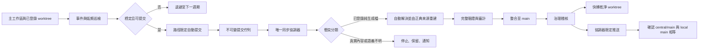

# GPTBridge Git 自動維護架構

本圖是 A375 的非權威投影。Git 自動維護只使用既有 `GitAutomationService`、`workspace_sync` 與 `GitRepository.run()`，禁止建立第二套 scheduler、merge coordinator 或 Git 執行入口。

- 事件來源：檔案變更、HEAD 變更、工作者 heartbeat、提交完成與佇列事件；低頻完整巡檢只作安全補償。
- 自動提交：必須通過 dirty stability、無既存 staged index、無寫入鎖、無建置或測試進行中、工作者 checkpoint ready；提交只涵蓋明確路徑。
- 整合：佇列綁定不可變 commit SHA、base main、工作者、任務、政策版本與審計身分；只有唯一協調器可合併及推送。
- 自動解衝突：僅限登錄為純生成、非權威且可由正典輸入完整重建的檔案。完成後必須重建、驗證內容及來源版本並留下審計；失敗立即停止並保留現況。
- 人工邊界：原始碼、法典、契約、設定、遷移、人工文件及任何語義不明衝突不得自動選邊。
- 維護：定期執行 worktree/branch/lock/queue 健康檢查、物件完整性、過期暫存清理、審計鏈輪替與 central/origin 差異檢查；不得刪除未整合提交。
- 安全：禁止 worker 直接推送、force-push、ref deletion、reset、移動分支合併、跨工作區掃入他人 staged 內容及未驗證推送。
