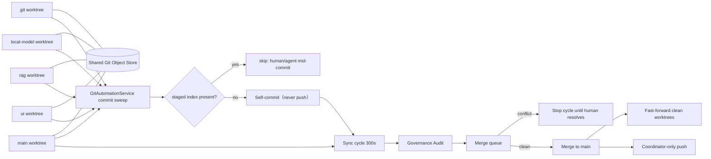

# GPTBridge Git 架構圖

提交與同步由單一行程內任務 `GitAutomationService` 承接（60 秒提交掃描＋60 秒穩定狀態去抖；300 秒同步循環），取代舊 supervisor 程序艦隊；工作區索引已有他人 staged 變更時整個 worktree 跳過（`staged-index-present`），人類或代理提交中絕不被掃入。自我提交永不推送，只有同步協調者可推 `main`（`workspace_sync` 預設 `push=False`）；自動提交在索引檢查通過後對整個工作區執行 `git add -A` 與全索引提交（非 path-scoped），人工與代理提交則依專案規則以明確路徑提交。衝突停止同步；禁止自動 force-push、刪除 ref 或替人決定衝突解法。

同步基線：A528、A537、A538、A53／E39、A46；啟動 10 秒、強制測試套件 20 秒、獨立審計流程 30 秒，逾時 fail-closed。
