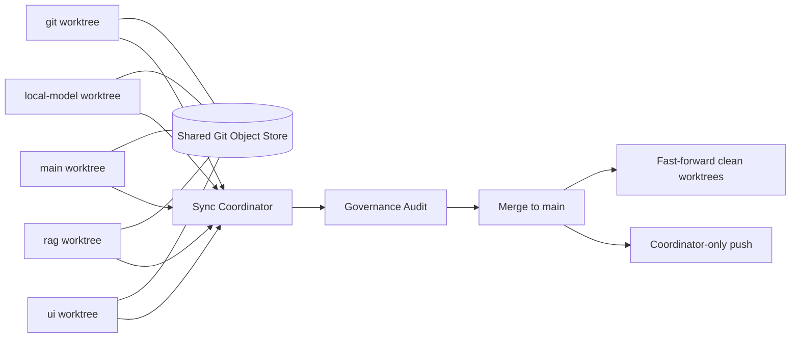

# GPTBridge Git 架構圖

```mermaid
flowchart LR
  O[(Shared Git Object Store)]
  MAIN[main worktree] --- O
  WG[git worktree] --- O
  WL[local-model worktree] --- O
  WR[rag worktree] --- O
  WU[ui worktree] --- O
  WG --> SYNC[Sync Coordinator]
  WL --> SYNC
  WR --> SYNC
  WU --> SYNC
  MAIN --> SYNC
  SYNC --> AUDIT[Governance Audit]
  AUDIT --> MERGE[Merge to main]
  MERGE --> FF[Fast-forward clean worktrees]
  MERGE --> PUSH[Coordinator-only push]
```

衝突停止同步；worker 不得直接推送；禁止自動 force-push、刪除 ref 或替人決定衝突解法。
