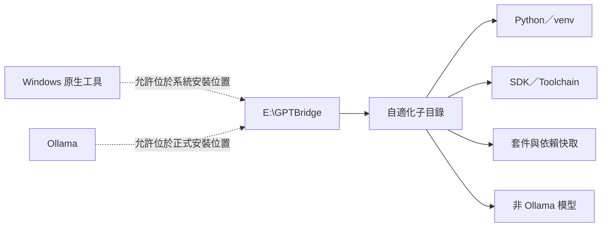

# GPTBridge 程式語言架構

本文件是正式法典的架構投影；權責以 PostgreSQL 法典 A35、A341、A343、A348、A604、A605 為準。C11 已升級至 C23，C++17 至 C++23，C#12 至 C#14(.NET 10)。

```mermaid
flowchart TB
  CONTRACT[法典與版本化契約]
  CONTRACT --> C[C23：決定性規則、權限熱路徑、常駐運行與原生測試 (C23 _BitInt/constexpr/typeof)]
  CONTRACT --> CPP[C++23：原生能力、推論、原生測試與審計熱路徑 (modules/constexpr/expected/mdspan)]
  CONTRACT --> CS[C#14/.NET 10：介面、型別轉接、授權流程與唯一測試編排 (.NET 10 GC DATAS/Span<T>)]
  CONTRACT --> FS[F#：資料分析、機器學習與高正確性複雜計算]
  CONTRACT --> GO[Go：有界並行服務、傳輸工作、網路轉接與可攜式操作程式]
  CONTRACT --> RS[Rust：記憶體安全系統能力、解析器與完整性／安全敏感元件]
  CONTRACT --> PY[Python：按需治理語意、模型研究訓練與必要邊界]
  CONTRACT --> TS[TypeScript：呈現層與建置期型別安全]
  CONTRACT --> SQL[SQL：資料操作與結構化權威持久化]
  TS --> IPC[型別化 IPC／API]
  IPC --> CS
  CS --> ABI[版本化 C ABI／服務契約]
  GO --> ABI
  RS --> ABI
  FS --> ABI
  PY --> ABI
  ABI --> C
  ABI --> CPP
```

- C23 執行已核准的決定性規則，不得自行修改治理規則；以 C23 新標準 (_BitInt/constexpr/typeof/auto) 與 arena 管理實現高效能高穩定低消耗。
- C++23 擁有原生能力、推論、原生測試及已核准審計熱路徑；以 modules/constexpr/std::expected/mdspan 與 RAII 實現高執行速度與確定性析構。
- C#14/.NET 10 負責介面及已授權流程編排，不得繞過裁決與權限；以 .NET 10 垃圾回收 (Generational GC 0/1/2 + DATAS 動態適應 + Span<T>/Memory<T> 池化) 實現自動記憶體管理與低 GC pause (<3ms)。
- F# 負責資料分析、機器學習及要求高度正確性的複雜計算。
- Go 負責有界並行服務、傳輸工作、網路轉接與可攜式操作程式。
- Rust 負責記憶體安全系統能力、解析器及完整性與安全敏感的原生元件。
- Python 僅保留按需治理語意、模型研究訓練及不可避免的語言邊界，預設不常駐執行機械性工作。
- TypeScript／TSX 僅負責呈現與建置期型別安全。
- SQL 負責資料操作與宣告範圍內的結構化權威持久化。

Go 與 Rust 只取得已登記能力的執行權，不取得治理、權限或業務裁決權。跨語言呼叫必須使用版本化契約；公開原生邊界仍以 C ABI 或正式型別服務契約為準。



除 Windows 原生工具與 Ollama 外，Python 執行環境、SDK、工具鏈、套件、依賴快取及非 Ollama 模型均須位於 `E:\GPTBridge` 下的自適化子目錄，不集中堆放於專案頂層。
