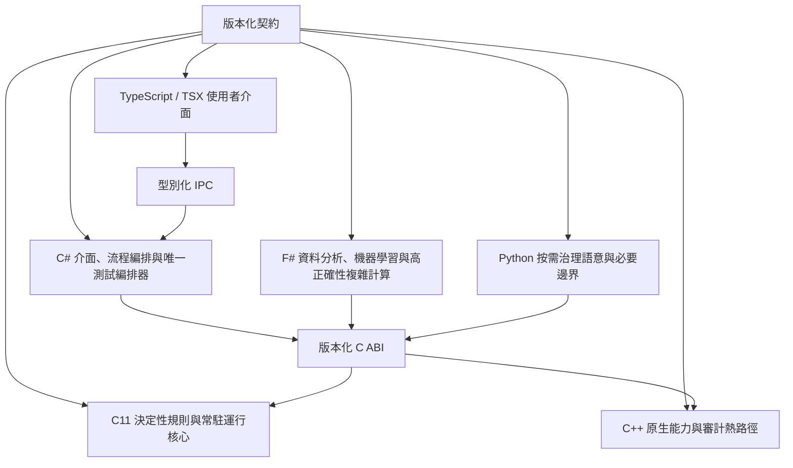

# GPTBridge 程式語言架構

本圖是法典的非權威架構投影。法典與版本化契約是唯一規範來源；各語言不得因實作位置取得治理、裁決或權限權威。

- C11：執行已核准的決定性規則、權限熱路徑、常駐運行核心及原生測試；不得自行修改治理規則。
- C++：承載物件導向原生能力、推論層、原生測試與已核准的審計套件熱路徑；不得接管治理政策或最終裁決。
- C#：承載使用者介面後端、已授權流程編排與唯一 `TestSuiteOrchestrator`；不得繞過裁決、權限或失敗關閉。
- F#：承載資料分析、機器學習及要求高度正確性的複雜計算，透過版本化契約交付結果。
- Python：只保留按需閘門裁決、必要治理語意、模型研究訓練及不可避免的語言邊界；預設不常駐，也不得持續執行大量機械性工作。
- TypeScript / TSX：只負責介面與型別化互動，不形成後端權威。

所有執行模組以 C／C++ 為優先；遷移必須維持契約、權限、審計與失敗關閉語意。`request_registry` 原生路徑目前仍為 `SHADOW`／`STAGED`，宿主未接入 `_native_primary` 前不得標示為 primary。啟動上限十秒、強制測試套件上限二十秒、各獨立審計流程上限三十秒，逾時依正式政策失敗關閉。
