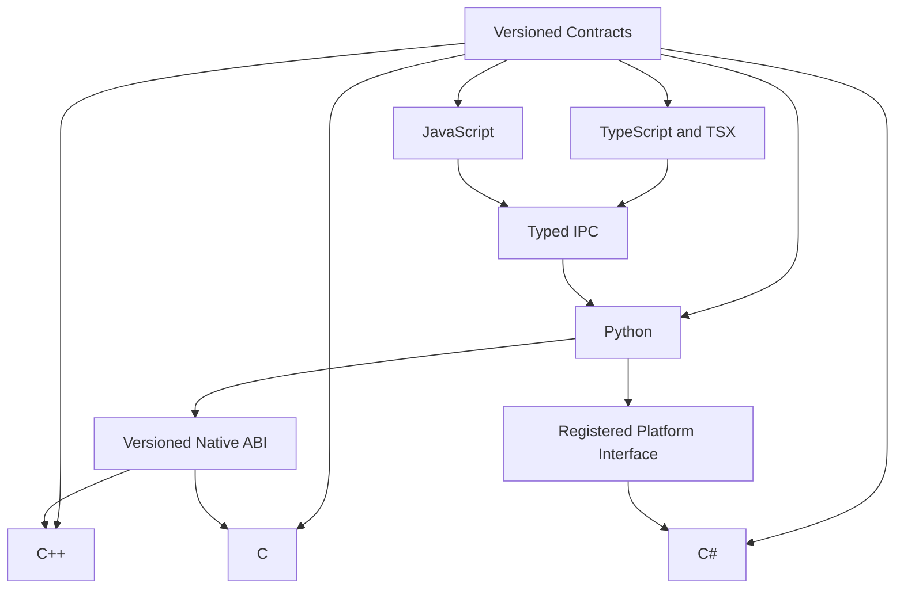

# GPTBridge 程式語言架構圖

```mermaid
flowchart TB
  CONTRACT[Versioned Contracts]
  CONTRACT --> PY[Python]
  CONTRACT --> TS[TypeScript and TSX]
  CONTRACT --> JS[JavaScript]
  CONTRACT --> CPP[C++]
  CONTRACT --> C[C]
  CONTRACT --> CS[C#]
  TS --> IPC[Typed IPC]
  JS --> IPC
  IPC --> PY
  PY --> ABI[Versioned Native ABI]
  ABI --> CPP
  ABI --> C
  PY --> PLATFORM[Registered Platform Interface]
  PLATFORM --> CS
```

跨語言只能經已登錄、已版本化且可驗證的契約；語言或 ABI 邊界不改變資料、權限與決策所有權。

同步基線：A528、A537、A538；啟動 10 秒、強制測試套件 20 秒、獨立審計流程 30 秒，逾時 fail-closed。
