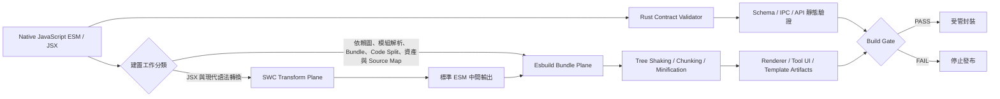
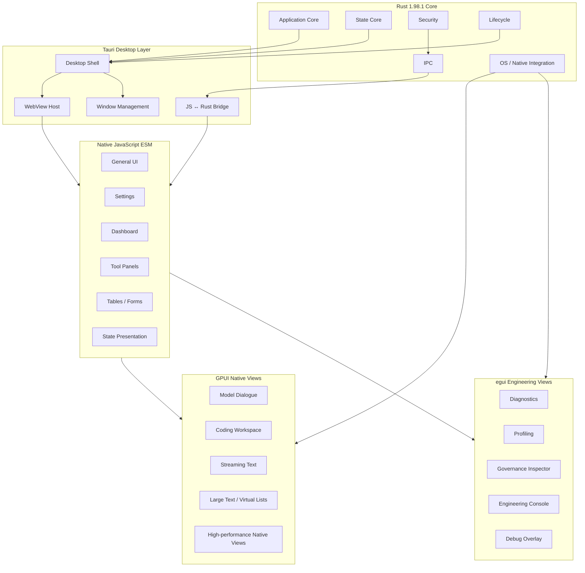
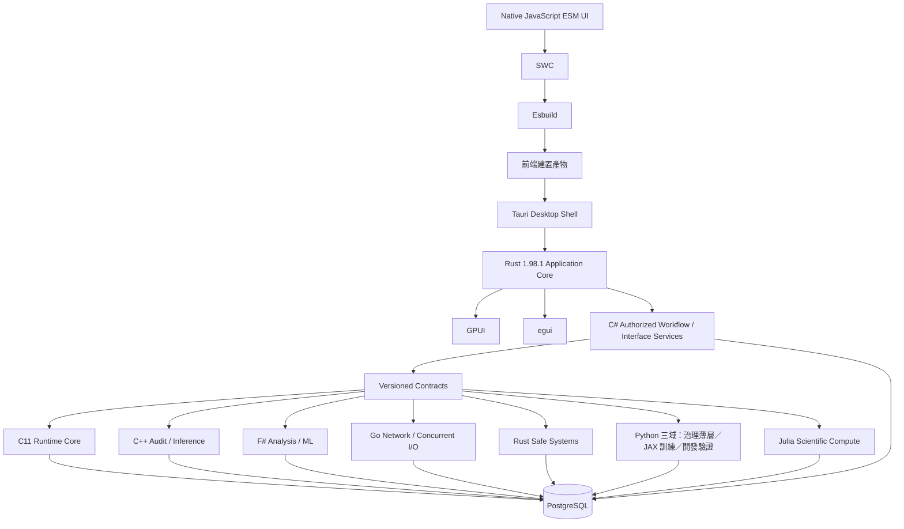
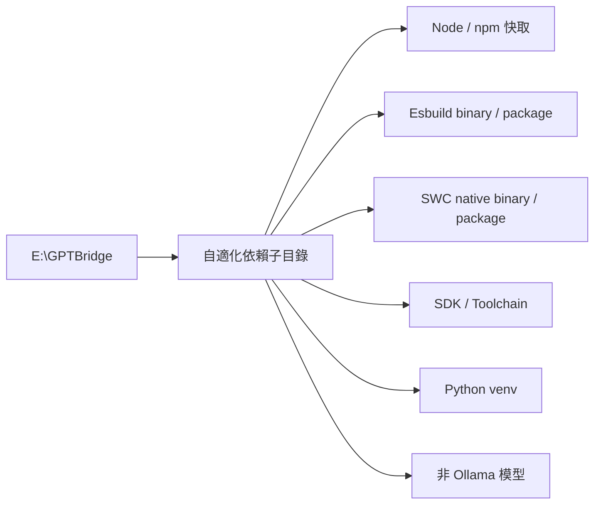

# GPTBridge 全專案程式語言架構圖

本圖是全專案語言、編譯與建置責任的中文投影；機器拓撲及正式權責仍以法典與 Architecture Registry 為準。

## 語言責任

| 語言／平台 | 正式責任 | 邊界 |
| --- | --- | --- |
| C | 決定性規則、權限熱路徑、C11 常駐運行核心、原生測試 | 不得修改治理規則或自行授權 |
| C++ | 原生審計、模型推論、KV／MoE／高效能元件 | 不得接管最終治理裁決 |
| C# / .NET | 桌面介面、Application、API、唯一流程與測試編排 | 不得繞過裁決核心及權限核心 |
| F# / .NET | 資料分析、機器學習、高正確性複雜計算 | 結果必須經版本化契約交付 |
| Go | 受限網路服務、高併發 I/O、批次工作 | 不得建立第二套治理或 IPC |
| Rust 1.98.1 | Application Core、State Core、Security、IPC、Lifecycle、原生整合及記憶體安全熱路徑 | 不得形成平行權限權威 |
| Python | 恰好三域（B4）：治理必要語意（主權語意＋治理規則＋治理薄封裝，必要部分常駐）、星澄訓練（JAX／jaxlib／NumPy 與必要訓練套件，僅訓練時啟動）、開發驗證（必要 pytest＋治理驗證＋推送閘，僅開發或驗證時啟動） | 其餘 Python 用途一律禁止；常駐機械性工作與 production 驗證層不得啟動 |
| Native JavaScript ESM | General UI、Settings、Dashboard、Tool Panels | 不承載治理與資料權威 |
| Julia | 科學運算與數值研究服務 | 只經版本化契約被呼叫 |
| PostgreSQL | 中央結構化資料、共享傳輸及中央審計 | 是資料平台，不是應用語言權威 |

### Python 工作責任移交（B4／B72 收斂對應）

現有 Python 常駐與執行工作移交正式 owner；Python 僅保留 B4 三域：

| 原 Python 工作域 | 正式移交對象 |
| --- | --- |
| Process / Lifecycle | C 運行核心＋指定 Rust 元件（runtime-core） |
| API / Application / Workflow | C#（唯一流程編排） |
| Business logic / validation | F# |
| RAG Retrieval | Rust |
| Vector Engine | Rust |
| File I/O / Batch / Network | Go |
| 正式模型推論 | C++ |
| 大量數值／統計 | Julia |
| UI | Rust＋Tauri＋JavaScript ESM＋GPUI＋egui |
| SQL orchestration | C#／Rust 經版本化契約交付 PostgreSQL（SQL 層為唯一 relational owner） |
| 模型訓練 | 保留 Python＋JAX，僅訓練時啟動 |
| Governance 必要語意 | 保留最薄 Python 層（主權語意／治理規則／治理薄封裝） |
| pytest／開發驗證 | 保留，僅開發或驗證時啟動，production 不啟動 |

移交一律經版本化契約或治理通道完成；接收方只取得執行權，不取得治理、權限或業務權威（B72／B166）。

### Python 最小化驗收線（B4 三域驗收判準）

Python Source 僅允許落在三個邏輯域，其餘正式 runtime Python 一律為 0：

| 允許域 | 實體位置 | 常駐性 |
| --- | --- | --- |
| `governance/` | `governance_rule/`、`main-system/governance/` | 必要最小值常駐（主權語意／治理規則／薄封裝） |
| `training/` | `Standalone tools/local-model`（星澄訓練管線） | on-demand：spawn → train → exit |
| `development-verification/` | `tests/`、`governance_rule/execution/` 驗證器 | development-only，production 永不啟動 |

Production runtime 常駐量驗收線——以下各項必須全部為 0：

| 項目 | Production 常駐 |
| --- | --- |
| Python 推論 | 0 |
| Python RAG | 0 |
| Python Vector | 0 |
| Python UI | 0 |
| Python Process Management | 0 |
| Python File I/O Worker | 0 |
| Python Network Worker | 0 |
| Python Business Logic | 0 |
| Python General Application | 0 |

原則：**Python installed ≠ Python resident**。套件面沿用現行受治理 dependency layout，概念上區分 governance／training／verification 三組；是否物理隔離以 import graph 盤點為準，不得為最小化而另造多套 venv。驗收機器欄位為 `architecture_registry.components[*].python_residency`：僅 `retain-governance`／`retain-bounded` 屬合法常駐，`migrate-*`／`retire`／未標記皆屬未完成缺口。

## Esbuild 與 SWC 混合建置鏈

```mermaid
flowchart LR
  SRC[Native JavaScript ESM / JSX]
  SRC --> CLASSIFY{建置工作分類}

  CLASSIFY -->|JSX 與現代語法轉換| SWC[SWC Transform Plane]
  CLASSIFY -->|依賴圖、模組解析、Bundle、Code Split、資產與 Source Map| ESB[Esbuild Bundle Plane]

  SWC --> IR[標準 ESM 中間輸出]
  IR --> ESB
  ESB --> OPT[Tree Shaking / Chunking / Minification]
  OPT --> OUT[Renderer / Tool UI / Template Artifacts]

  VALIDATE[Rust Contract Validator] --> TYPECHECK[Schema / IPC / API 靜態驗證]
  SRC --> VALIDATE
  TYPECHECK --> GATE{Build Gate}
  OUT --> GATE
  GATE -->|PASS| PACKAGE[受管封裝]
  GATE -->|FAIL| CLOSED[停止發布]
```

Esbuild 與 SWC 必須混用，但責任不可重疊失控：

- SWC 是主要語法轉換器，負責 JSX、現代 JavaScript 語法轉換及經核准的 compiler transform。
- Esbuild 是主要 bundle 執行器，負責依賴圖、模組解析、bundle、code splitting、資產載入、source map、tree shaking 與最終壓縮。
- Rust Contract Validator 保留 Schema、IPC 與 API 靜態驗證；不得因 SWC 快速轉換而取消契約閘。
- 標準順序是 `Native JavaScript ESM/JSX → SWC transform → ESM → Esbuild bundle → artifact`。
- 純 JavaScript、無需 SWC transform 的安全輸入，可直接進 Esbuild；此為同一建置鏈的快速分支，不是第二套建置系統。
- 同一輸出不得由 SWC 與 Esbuild 重複壓縮、重複降階或各自生成互相衝突的 source map。
- Vite 若作為入口，只能調用此混合鏈，不得另建第三套轉譯／bundle 權威。
- Esbuild／SWC 僅是編譯與建置工具，不具 runtime、治理、權限或資料權威。

## GPTBridge UI Stack

```mermaid
flowchart TB
  subgraph RUST[Rust 1.98.1 Core]
    APP[Application Core]
    STATE[State Core]
    SEC[Security]
    IPC[IPC]
    LIFE[Lifecycle]
    NATIVE[OS / Native Integration]
  end

  subgraph TAURI[Tauri Desktop Layer]
    SHELL[Desktop Shell]
    WEBVIEW[WebView Host]
    WINDOWS[Window Management]
    BRIDGE[JS ↔ Rust Bridge]
  end

  subgraph ESM[Native JavaScript ESM]
    GUI[General UI]
    SETTINGS[Settings]
    DASH[Dashboard]
    PANELS[Tool Panels]
    TABLES[Tables / Forms]
    STATUS[State Presentation]
  end

  subgraph GPUI[GPUI Native Views]
    DIALOGUE[Model Dialogue]
    CODING[Coding Workspace]
    STREAM[Streaming Text]
    TEXT[Large Text / Virtual Lists]
    FAST[High-performance Native Views]
  end

  subgraph EGUI[egui Engineering Views]
    DIAG[Diagnostics]
    PROFILE[Profiling]
    INSPECT[Governance Inspector]
    CONSOLE[Engineering Console]
    OVERLAY[Debug Overlay]
  end

  APP --> SHELL
  STATE --> SHELL
  SEC --> IPC
  IPC --> BRIDGE
  LIFE --> SHELL
  NATIVE --> GPUI
  NATIVE --> EGUI
  SHELL --> WEBVIEW
  SHELL --> WINDOWS
  WEBVIEW --> ESM
  BRIDGE --> ESM
  ESM --> GPUI
  ESM --> EGUI
```

- Rust 1.98.1 是 UI 核心、應用狀態、生命週期、IPC、安全與 OS 整合的正式 owner。
- Tauri 只負責 Desktop Shell、WebView、Window 管理及受管 JS↔Rust Bridge；不得複製 Application Core。
- Native JavaScript ESM 負責設定、工具面板、表格、表單與狀態呈現等一般 UI。
- GPUI 負責模型對話、Coding Workspace、大量文字、虛擬清單與高效能原生工作區。
- egui 負責系統診斷、效能監控、開發／治理工具及 Debug Overlay，不得混入一般使用者業務介面。
- WebView、GPUI 與 egui 共用 Rust State Core、Security、IPC 與 Lifecycle，不得各自建立狀態庫、權限模型或後端生命週期。

## 全語言交付關係

```mermaid
flowchart TB
  UI[Native JavaScript ESM UI]
  UI --> SWC[SWC]
  SWC --> ESB[Esbuild]
  ESB --> ART[前端建置產物]
  ART --> TAURI[Tauri Desktop Shell]
  TAURI --> RUST[Rust 1.98.1 Application Core]
  RUST --> GPUI[GPUI]
  RUST --> EGUI[egui]
  RUST --> CS[C# Authorized Workflow / Interface Services]

  CS --> CONTRACT[Versioned Contracts]
  CONTRACT --> C[C11 Runtime Core]
  CONTRACT --> CPP[C++ Audit / Inference]
  CONTRACT --> FS[F# Analysis / ML]
  CONTRACT --> GO[Go Network / Concurrent I/O]
  CONTRACT --> RS[Rust Safe Systems]
  CONTRACT --> PY[Python 三域：治理薄層／JAX 訓練／開發驗證]
  CONTRACT --> JL[Julia Scientific Compute]

  C --> PG[(PostgreSQL)]
  CPP --> PG
  CS --> PG
  FS --> PG
  GO --> PG
  RS --> PG
  PY --> PG
  JL --> PG
```

跨語言互動只允許經版本化 ABI、IPC、資料契約或 Information Channel。任何語言均不得直接複製治理規則、權限目錄或中央資料權威。

## 工具與依賴位置

```mermaid
flowchart LR
  ROOT[E:\GPTBridge]
  ROOT --> ADAPT[自適化依賴子目錄]
  ADAPT --> NPM[Node / npm 快取]
  ADAPT --> ESBUILD[Esbuild binary / package]
  ADAPT --> SWCBIN[SWC native binary / package]
  ADAPT --> SDK[SDK / Toolchain]
  ADAPT --> PYENV[Python venv]
  ADAPT --> MODELS[非 Ollama 模型]
```

除 Windows 原生工具與 Ollama 外，Esbuild、SWC、SDK、Toolchain、套件及依賴快取均須位於 `E:\GPTBridge` 下的適當子目錄，不得散落於專案頂層或使用未登記的全域版本。

法源：B4、B72、B74、D62、B162、B163、B166、C116。

## ABCD 責任分類

A 為治理與權威；B 為系統架構與執行；C 為資料、自動化與營運；D 為驗證、發布與保證。條文依各類責任連續編號，舊 A 編號僅能透過 `provision_renumbering_registry` 作歷史查詢。

## 執行路徑效能契約

全專案以高效能、高速執行、低資源消耗與有界平行多工為共同目標，不新增第二套框架、排程器或編排器。PERF-01 至 PERF-15 統一規範 Python 關鍵路徑、Rust CPU 工作、Go 高併發 I/O、所有併發上限、批次、大型資料參照或串流、模型常駐、RAG 平行檢索、端到端取消、有界版本快取、延遲初始化、非阻塞觀測、正式寫入與遙測分流，以及以 p50/p95/p99、CPU、RAM、VRAM、切換次數、佇列深度與資料庫往返實測決策。PostgreSQL＋pgvector 是唯一正式結構化與向量權威；Rust 原生向量引擎只承載可重建的語意檢索加速。

## 規則分層

法典只保留原則、條文、敕令、權責、權威邊界、禁止事項與跨層不變條件。業務規則、領域驗證、演算法、參數、內部流程、查詢、重試、批次、快取、轉換、介面行為、測試實作及其他實作規範，均由各自實作層以具版本的 owner-local contract 或 registry 管理，權威類別固定為 `implementation-derived-non-authoritative`。跨實作層行為只能透過單一語義擁有者的版本化契約；任何實作規則不得改寫法典、產生權限或進入 Runtime 法典規則索引。

## 程式碼與檔案格式效能邊界

所有實作層必須依代表性實測，將程式碼、契約、設定、資料、快取、索引、傳輸與產物格式收斂至高效能、高速、低延遲、低資源消耗。小型控制訊息可維持可讀的型別文字；高頻內部訊息優先採已註冊型別結構；大型資料優先傳遞身分參照並使用串流、映射或分塊存取。具體格式、配置、編碼、壓縮與分塊方式屬各實作層的非權威規範；法典只約束實測、版本、相容性、大小上限、驗證、權限、遷移、退役標籤、零消費者證明及最終清除。不得為格式替換新增未獲許可的框架或套件。

全專案允許自適化。各實作層可依延遲、吞吐量、CPU、RAM、VRAM、佇列深度、錯誤率、資料庫往返及儲存壓力，在已註冊上下限內調整工作者數、批次、佇列准入、快取、分塊、壓縮、編碼、I/O、模型常駐、查詢計畫與重試退避。調整必須具備遲滯、冷卻、有界步幅、期限、取消、回復、決策紀錄及世代隔離；不得改變法典、權威、權限、業務語意、正式資料身分、安全或契約版本。

## PostgreSQL pgvector＋Rust 原生向量架構

PostgreSQL＋pgvector 是唯一正式向量與結構化資料權威，保存 embedding、資源與 chunk 身分、revision、scope、lineage 與 tombstone。Rust 1.98.1 原生向量引擎負責高效能索引、搜尋、融合與記憶體內加速，但只屬可由 PostgreSQL 完整重建的非權威投影；所有 Rust 候選結果在建立 context 前都必須回 PostgreSQL 驗證目前身分、版本、權限與範圍。Rust 不可用時只降級為 PostgreSQL＋pgvector 路徑。舊向量服務禁止啟動、讀寫或作為 fallback，完成正式資料遷移、零消費者證明及回復期限後，刪除套件、設定、路由、執行狀態與殘留資料。

## 規則自動分類

新增或變更需求先自動分類。原則、條文、敕令、權責、權威、權限、安全、正式資料邊界、禁止事項、跨層不變條件及共享契約語義所有權進入法典；業務規則、領域驗證、演算法、參數、內部流程、查詢、重試、批次、快取、格式配置、介面行為、測試實作及營運調校下放至擁有者實作層。混合需求必須拆成最小法典邊界與非權威實作規則，透過 controlling provision 與版本化契約連結，不得重複存放同一語義。
