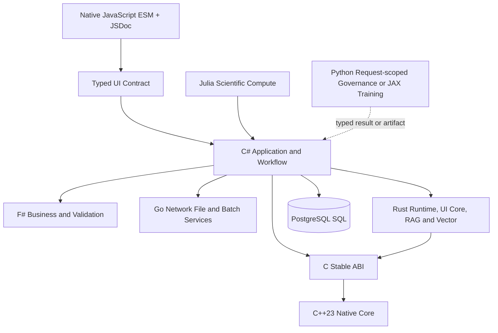
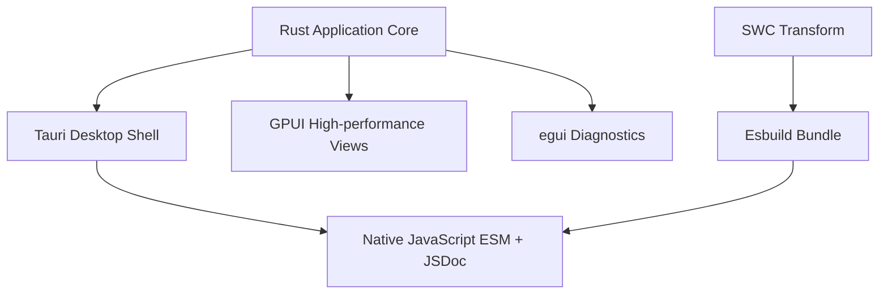
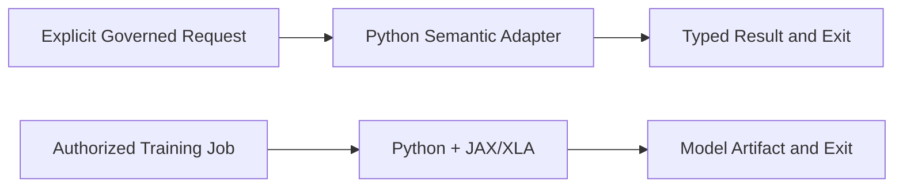
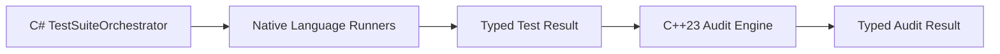
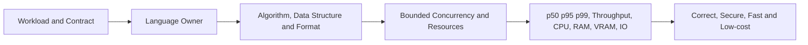

# GPTBridge 全專案程式語言架構圖

本文件是現行語言責任的非權威同步投影；正式責任以最新 PostgreSQL Codex 為準。

## 語言責任

| 技術 | 正式責任 | 禁止事項 |
| --- | --- | --- |
| C | 決定性 runtime、權限熱路徑、穩定 C ABI、原生測試 | UI、業務規則、資料權威 |
| C++23 | 模型推論、原生 runtime、測試執行、Audit Engine、Resource Governor | 公開應用 API、UI、工作流與資料權威 |
| Rust 1.98.1 | UI 核心、狀態、生命週期、IPC、安全、OS 整合、RAG／CAG／DAG、向量與 CPU 關鍵工作 | 治理或權限決策、業務判斷 |
| C# 14／.NET 10 | 應用、API、已授權工作流、Windows 整合、唯一測試編排 | F# 業務語義與前端 DOM |
| F# 10 | 業務規則、驗證、轉換、狀態轉移、資料分析、ML 與高正確性計算 | 治理、權限、UI、流程編排 |
| Go 1.27.1 | 高併發網路、搜尋、檔案與批次 I/O | 治理、權限及業務判斷 |
| Julia | 統計、數學模型、最佳化、模擬與科學計算 | 治理、權限及 UI |
| Native JavaScript ESM + JSDoc | 設定、工具面板、表格、表單與一般 UI | 直接資料庫、原生 ABI 或後端模組存取 |
| SQL／PostgreSQL 18.6 | 集合式資料操作、完整性、RLS 與正式 schema | 工作流、權限來源及業務決策 |
| Python | 單次治理語意轉接；已授權星澄 JAX／XLA 訓練 | 常駐、機械性工作、推論、RAG、UI、API、SQL 編排、測試與審計 |

## 執行拓撲

```mermaid
flowchart TB
  JS[Native JavaScript ESM + JSDoc] --> API[Typed UI Contract]
  API --> CS[C# Application and Workflow]
  CS --> FS[F# Business and Validation]
  CS --> GO[Go Network File and Batch Services]
  CS --> RUST[Rust Runtime, UI Core, RAG and Vector]
  CS --> CABI[C Stable ABI]
  RUST --> CABI
  CABI --> CPP[C++23 Native Core]
  CS --> SQL[(PostgreSQL SQL)]
  JULIA[Julia Scientific Compute] --> CS
  PY[Python Request-scoped Governance or JAX Training] -.typed result or artifact.-> CS
```

跨語言邊界只能使用具內部時間戳記世代、具 owner、具型別、具期限與取消語義的正式契約。契約名稱不攜帶版本號，條文不顯示機器識別。Adapter 只能轉換型別、錯誤、生命週期與傳輸，不能取得目標能力的語義或權威。

## UI Stack

```mermaid
flowchart TB
  RUST[Rust Application Core] --> TAURI[Tauri Desktop Shell]
  TAURI --> JS[Native JavaScript ESM + JSDoc]
  RUST --> GPUI[GPUI High-performance Views]
  RUST --> EGUI[egui Diagnostics]
  SWC[SWC Transform] --> ESBUILD[Esbuild Bundle]
  ESBUILD --> JS
```

Electron、TypeScript、Node.js、React 已排除。SWC 與 Esbuild 混用，但只負責編譯與打包，不取得 UI runtime 或應用權責。

## Python 最終界線

```mermaid
flowchart LR
  REQUEST[Explicit Governed Request] --> GOV[Python Semantic Adapter]
  GOV --> RESULT[Typed Result and Exit]
  JOB[Authorized Training Job] --> JAX[Python + JAX/XLA]
  JAX --> ARTIFACT[Model Artifact and Exit]
```

正常 production 的 Python 行程數固定為零。Python 不得作為正式測試、審計、發布、推送、推論、資料處理、排程、監控、網路、檔案或應用服務的回退路徑。

## 測試與審計

```mermaid
flowchart LR
  CS[C# TestSuiteOrchestrator] --> RUNNERS[Native Language Runners]
  RUNNERS --> TEST[Typed Test Result]
  TEST --> AUDIT[C++23 Audit Engine]
  AUDIT --> EVIDENCE[Typed Audit Result]
```

所有測試由被測能力所屬語言的原生 runner 執行；C# 只負責唯一編排。審計由 C++23 執行。不支援項目標記 `BLOCKED` 並拒絕發布，不得委派給 Python 或靜默通過。

## 效能與格式

```mermaid
flowchart LR
  INPUT[Workload and Contract] --> OWNER[Language Owner]
  OWNER --> DESIGN[Algorithm, Data Structure and Format]
  DESIGN --> BOUND[Bounded Concurrency and Resources]
  BOUND --> MEASURE[p50 p95 p99, Throughput, CPU, RAM, VRAM, IO]
  MEASURE --> ACCEPT[Correct, Secure, Fast and Low-cost]
```

所有程式碼與檔案格式須減少不必要的配置、複製、序列化、鎖競爭、程序／語言跳轉、系統呼叫及資料庫／IPC／網路往返。高頻資料採量測證明的具型別格式；大型資料避免整檔載入；所有 queue、thread、goroutine、task、process、cache 與 batch 必須有明確上限。
