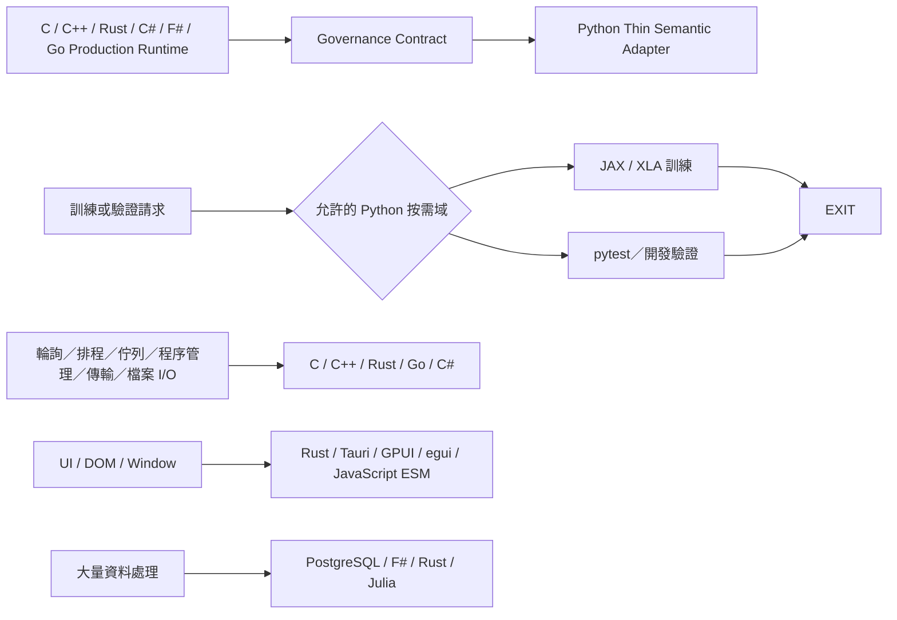
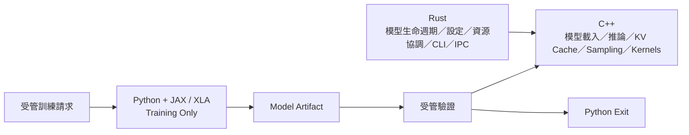
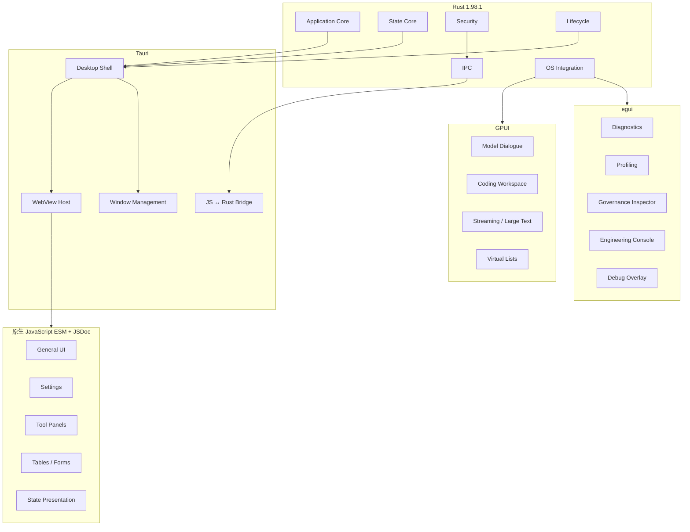
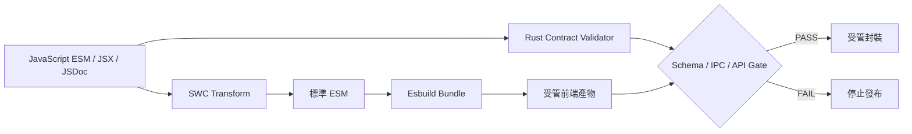
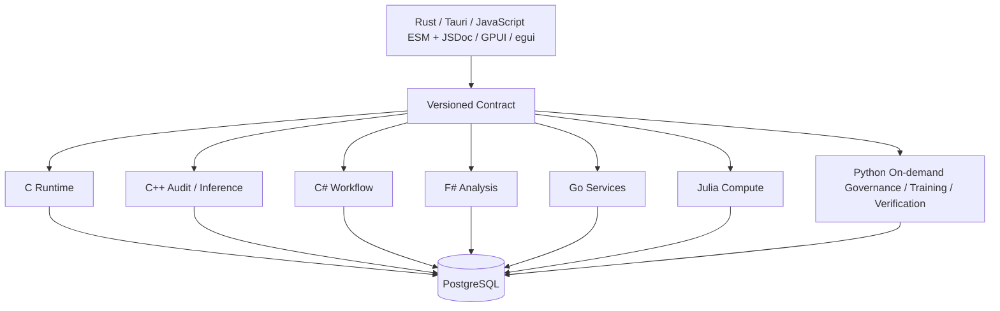

# GPTBridge 全專案程式語言架構圖

本圖是全專案語言、編譯與建置責任的中文投影；正式權責以法典與 Architecture Registry 為準。

## 語言責任

| 語言／平台 | 正式責任 | 執行模式 |
| --- | --- | --- |
| C | C11 常駐運行核心、決定性規則、權限熱路徑、原生測試 | 常駐主體 |
| C++ | 原生審計、模型推論、KV／MoE、高效能元件、唯一 C++23 資源管制器 | 常駐或按需 |
| Rust 1.98.1 | UI 核心、應用狀態、生命週期、IPC、安全、OS 整合 | UI 主體 |
| C# / .NET | 已授權流程、API、唯一測試編排 | 按需編排 |
| F# / .NET | 資料分析、機器學習、高正確性複雜計算 | 按需計算 |
| Go | 受限網路服務、高併發 I/O、批次工作 | 按需服務 |
| 原生 JavaScript ESM＋JSDoc | 設定、工具面板、表格、表單、狀態呈現 | WebView 呈現 |
| Julia | 科學運算、最佳化與模擬 | 按需計算 |
| Python | 必要治理語意最薄層、JAX 模型訓練、pytest／開發驗證 | 治理必要部分最小常駐；其餘按需 |
| SQL | PostgreSQL 集合式資料操作 | 資料庫內執行 |

任何語言都不得自行修改治理規則、創造權限或建立第二套資料權威。

資源管制器只有一個正式實作：`resource-governor`，實作語言固定 C++23，並使用受管的 `system-administrator` 系統管理員身分。該身分只准執行資源觀測、程序優先序、CPU affinity、working-set、資源准入與回收，不取得治理、權限、資料或業務裁決權。C、Rust、C#、Python 及其他語言可以提交資源訊號或受其管制，但不得保留、建立或啟動另一套資源管制器、watcher、sidecar 或 fallback。

## Python 最小化

```mermaid
flowchart LR
  RUNTIME[C / C++ / Rust / C# / F# / Go Production Runtime] --> CONTRACT[Governance Contract]
  CONTRACT --> GOV[Python Thin Semantic Adapter]
  REQUEST[訓練或驗證請求] --> DOMAIN{允許的 Python 按需域}
  DOMAIN --> TRAIN[JAX / XLA 訓練]
  DOMAIN --> VERIFY[pytest／開發驗證]
  TRAIN --> EXIT
  VERIFY --> EXIT

  MECH[輪詢／排程／佇列／程序管理／傳輸／檔案 I/O] --> NATIVE[C / C++ / Rust / Go / C#]
  UI[UI / DOM / Window] --> RUSTUI[Rust / Tauri / GPUI / egui / JavaScript ESM]
  DATA[大量資料處理] --> DATAOWNER[PostgreSQL / F# / Rust / Julia]
```

Python 只保留三域：

1. `governance/`：別的語言移走後會改變治理語意的最薄 Python semantic adapter；只有法典要求的必要部分可最小常駐。
2. `training/`：Python＋JAX／XLA 模型訓練，只在訓練工作存在時啟動，產出模型 artifact 後退出。
3. `development-verification/`：pytest 與開發／治理驗證，只在開發、測試或稽核要求時啟動，Production 永不啟動。

### 正式責任轉移

| 現有 Python 工作 | 正式 owner |
| --- | --- |
| Process／Lifecycle | Rust／C |
| API／Application／Workflow | C# |
| Business logic／validation | F# |
| RAG Retrieval | Rust |
| Vector Engine | Rust |
| File I/O／Batch／Network | Go |
| 正式模型推論 | C++ |
| 大量數值／統計 | Julia |
| UI | Rust＋Tauri＋原生 JavaScript ESM＋JSDoc＋GPUI＋egui |
| SQL orchestration | C#／Rust 經 PostgreSQL contract |
| 模型訓練 | Python＋JAX，按需啟動 |
| Governance 必要語意 | 最薄 Python layer |
| pytest／開發驗證 | Python 工具鏈，Production 不啟動 |

硬性限制：

- 除必要治理語意最薄層外，Production idle Python process count 必須為 0。
- 訓練與驗證 Python 執行必須有 request、purpose、deadline、resource budget 與完成後退出條件。
- 禁止 Python 常駐執行 timer、polling、scheduler、queue pumping、process supervision、Git automation、SQL orchestration、transport、檔案搬移、UI、RAG 機械檢索、向量索引及重複審計。
- 禁止以 Python fallback 複製已有的 C、C++、Rust、Go、C#、F#、Julia 或 SQL 正式能力。
- Python 環境可安裝但不得因安裝而自動啟動；`installed ≠ resident`。
- 訓練或驗證完成後必須釋放程序、記憶體、執行緒與模型資源。
- 正式 Runtime 的 Python 推論、RAG、Vector、UI、Process Management、File I/O Worker、Network Worker、Business Logic、General Application 必須全部為 0。

### 星澄正式推論目標

```mermaid
flowchart LR
  CONTROL[Rust<br/>模型生命週期／設定／資源協調／CLI／IPC] --> INFER[C++<br/>模型載入／推論／KV Cache／Sampling／Kernels]
  REQUEST[受管訓練請求] --> PYTRAIN[Python + JAX / XLA<br/>Training Only]
  PYTRAIN --> ARTIFACT[Model Artifact]
  ARTIFACT --> VALIDATE[受管驗證]
  VALIDATE --> EXIT[Python Exit]
  VALIDATE --> INFER
```

Python 不得控制正式 inference runtime；PyTorch reference／fallback 與 Triton→PyTorch fallback 不得成為 Production 推論路徑。Python CLI 只可服務訓練或開發驗證，不得成為正式模型生命週期入口。

全專案自適化由各能力的正式語言 owner 與 C++23 `resource-governor` 執行，並同時最佳化高效能、高速執行與低資源消耗；任何單項改善不得造成其他必要指標、正確性、安全或穩定性退化。Python 不得因自適化新增常駐 scheduler、watcher、controller、worker、RAG、SQL、I/O、程序管理或 fallback。治理最薄層只能判讀不可等價移出的治理語意，JAX 訓練按需啟動，pytest 僅開發驗證。

## GPTBridge UI Stack

```mermaid
flowchart TB
  subgraph RUST[Rust 1.98.1]
    APP[Application Core]
    STATE[State Core]
    SEC[Security]
    IPC[IPC]
    LIFE[Lifecycle]
    OS[OS Integration]
  end
  subgraph TAURI[Tauri]
    SHELL[Desktop Shell]
    WEBVIEW[WebView Host]
    WINDOWS[Window Management]
    BRIDGE[JS ↔ Rust Bridge]
  end
  subgraph ESM[原生 JavaScript ESM + JSDoc]
    GENERAL[General UI]
    SETTINGS[Settings]
    PANELS[Tool Panels]
    FORMS[Tables / Forms]
    STATUS[State Presentation]
  end
  subgraph GPUI[GPUI]
    DIALOGUE[Model Dialogue]
    CODING[Coding Workspace]
    TEXT[Streaming / Large Text]
    LISTS[Virtual Lists]
  end
  subgraph EGUI[egui]
    DIAG[Diagnostics]
    PROF[Profiling]
    GOV[Governance Inspector]
    CONSOLE[Engineering Console]
    OVERLAY[Debug Overlay]
  end
  APP --> SHELL
  STATE --> SHELL
  SEC --> IPC
  IPC --> BRIDGE
  LIFE --> SHELL
  OS --> GPUI
  OS --> EGUI
  SHELL --> WEBVIEW
  SHELL --> WINDOWS
  WEBVIEW --> ESM
```

Tauri、原生 JavaScript ESM＋JSDoc、GPUI 與 egui 共用 Rust 的狀態、安全、IPC 與生命週期，不得各自建立後端或權限模型。

## Esbuild／SWC 混合建置鏈

```mermaid
flowchart LR
  SRC[JavaScript ESM / JSX / JSDoc] --> SWC[SWC Transform]
  SWC --> ESM[標準 ESM]
  ESM --> ESBUILD[Esbuild Bundle]
  ESBUILD --> OUT[受管前端產物]
  SRC --> CONTRACT[Rust Contract Validator]
  CONTRACT --> GATE{Schema / IPC / API Gate}
  OUT --> GATE
  GATE -->|PASS| PACKAGE[受管封裝]
  GATE -->|FAIL| CLOSED[停止發布]
```

- SWC 負責 JSX 與現代 JavaScript 語法轉換。
- Esbuild 負責模組解析、bundle、code splitting、資產、source map、tree shaking 與壓縮。
- JSDoc 提供型別、參數、回傳值與契約提示，不創造另一種執行語言。
- Rust Contract Validator 驗證 Schema、IPC 與 API；建置工具不得取代契約驗證。
- Esbuild 與 SWC 使用專案內受管的 standalone binary，不引入已退役的 UI runtime 或套件執行環境。

## 跨語言交付

```mermaid
flowchart TB
  UI[Rust / Tauri / JavaScript ESM + JSDoc / GPUI / egui]
  UI --> CONTRACT[Versioned Contract]
  CONTRACT --> C[C Runtime]
  CONTRACT --> CPP[C++ Audit / Inference]
  CONTRACT --> CS[C# Workflow]
  CONTRACT --> FS[F# Analysis]
  CONTRACT --> GO[Go Services]
  CONTRACT --> JL[Julia Compute]
  CONTRACT --> PY[Python On-demand Governance / Training / Verification]
  C --> PG[(PostgreSQL)]
  CPP --> PG
  CS --> PG
  FS --> PG
  GO --> PG
  JL --> PG
  PY --> PG
```

跨語言互動只允許版本化 ABI、IPC、資料契約或 Information Channel。

## 工具與依賴位置

除 Windows 原生工具與 Ollama 外，Python venv、Esbuild、SWC、SDK、Toolchain、套件、依賴快取及非 Ollama 模型必須位於 `E:\GPTBridge` 下的適當子目錄，不得散落於專案頂層或使用未登記的全域版本。

法源：A35、A116、A198、A205、A208、A211、A215、A240、A264、A341、A343、A348、A604、A610、A613–A625。
