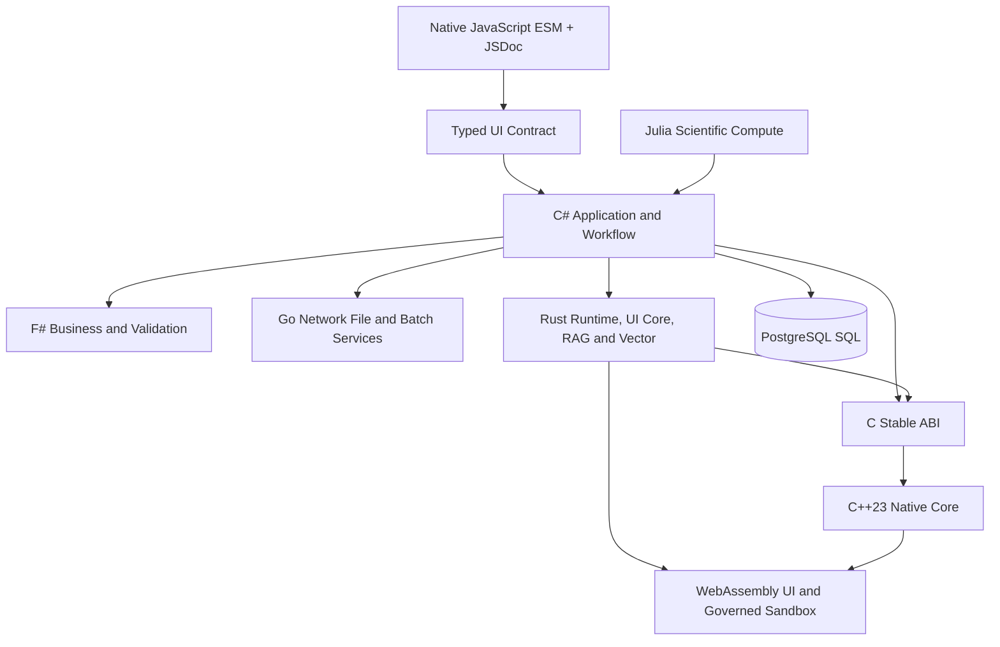
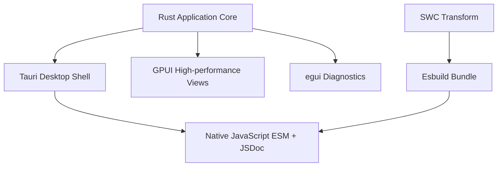
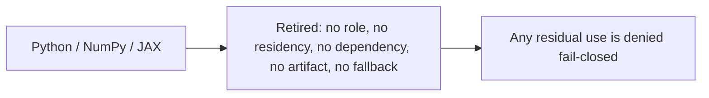
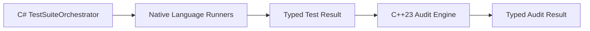
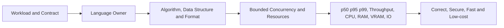

# GPTBridge 全專案程式語言架構圖

本架構圖僅為 PostgreSQL Codex 的同步投影，不是法典鏡像或權威。法典檔案只保留五份唯讀中文鏡像；其他 SQL、資料庫、JSON、快取、匯出或備份形式的 Codex 鏡像一律禁止。

正式語言池僅含 C、C++23、C#、Rust、Go、F#。文件中的語言分工是原則參考與初始偏好，不是不可變更的固定配置；每項能力可依正確性、安全、延遲、吞吐、CPU、RAM、產物大小、啟動時間及維護成本，自適化選定唯一現行主要擁有語言。任何變更只能在六種語言內進行，並維持既有契約、權限、資源上限、原子升級與回復能力；不得同時保留兩個主要實作、不得新增第七種語言、權威或繞過治理。Python 與直譯式執行維持全面禁止；正式 runtime 僅執行受管建置階段產生的預編譯原生產物。

本文件是現行語言責任的非權威同步投影；正式責任以最新 PostgreSQL Codex 為準。

## 語言責任

| 技術 | 正式責任 | 禁止事項 |
| --- | --- | --- |
| C | 決定性 runtime、權限熱路徑、穩定 C ABI、原生測試 | UI、業務規則、資料權威 |
| C++23 | 模型推論、原生 runtime、測試執行、Audit Engine、Resource Governor | 公開應用 API、UI、工作流與資料權威 |
| Rust 1.98.1 | UI 核心、狀態、生命週期、IPC、安全、OS 整合、RAG／CAG／DAG、向量與 CPU 關鍵工作 | 治理或權限決策、業務判斷 |
| C# 14／.NET 10 | 應用、API、已授權工作流、Windows 整合、唯一測試編排 | F# 業務語義與前端 DOM |
| F# 10 | 業務規則、驗證、轉換、狀態轉移、資料分析、ML 與高正確性計算 | 治理、權限、UI、流程編排 |
| Go 1.27.1 | 高併發網路、搜尋、檔案與批次 I/O | 治理、權限及業務判斷 |
| Julia | 統計、數學模型、最佳化、模擬與科學計算 | 治理、權限及 UI |
| Native JavaScript ESM + JSDoc | 設定、工具面板、表格、表單與一般 UI | 直接資料庫、原生 ABI 或後端模組存取 |
| SQL／PostgreSQL 18.6 | 集合式資料操作、完整性、RLS 與正式 schema | 工作流、權限來源及業務決策 |
| Python／NumPy／JAX | 已全面退役並立即生效：零角色、零常駐、零相依、零產物、零回退 | 任何殘留使用（fail-closed 拒絕） |

套件下載：套件管理的下載來源僅限 Visual Studio Installer 與 Winget 兩個通道。語言套件管理器（Cargo、Go modules、NuGet、npm、pip、Bun 等）不得連網下載（禁止透過 Bun 下載套件），只能使用受管相依根內已 vendored／已登錄的產物；兩通道皆無法提供者須先取得明確許可。Python 全面禁止且無執行例外：不得存在現行 Python 原始碼、直譯器、虛擬環境、套件管理器、套件、相依、建置、測試、審計、訓練、推論、腳本、工具、常駐程序或回退路徑；不得下載、安裝、重新安裝、修復、還原、重建或補裝 Python、pip、NumPy、JAX 及其他 Python 套件。歷史文字只能作不可執行的歷史紀錄，不得成為現行依據。

Python 原責任由既有原生擁有者接手：C 負責決定性規則與穩定 ABI；C++23 負責模型訓練、推論、原生測試與審計熱路徑；Rust 負責程序、生命週期、安全、RAG、向量與 UI 核心；C# 負責應用、API、工作流及唯一測試編排；F# 負責業務規則、驗證、訓練評估與高正確性分析；Go 負責檔案、網路及批次併發；Julia 負責科學與大量數值運算；PostgreSQL 負責集合式資料處理。移交不得保留 Python 代理、橋接、參考實作或回退。

正式程式碼只以 C、C++23、C#、Rust、Go、F# 撰寫。編譯器與連結器僅能存在於受管建置階段；正式執行環境不得啟動編譯器、直譯器、即時原始碼編譯器或腳本引擎，只能執行已驗證的預編譯原生產物。C# 與 F# 正式發布採 NativeAOT 或等價的預先編譯形式，不得依賴執行期動態編譯。

撰寫原則：所有新增或修改的程式碼一律以已登錄的原生擁有語言撰寫（C／C++23／Rust／Go／C#／F#／JavaScript-ESM／Julia／SQL），並以高效方式實作：編譯形式、批次、零複製、容量預留、單趟處理、受限並行與期限取消；大型結構以型別化指標、參照、借用視圖或句柄傳遞，禁止不必要的整體值複製。熱迴圈優先採編譯器最佳化；實測有益時才使用迴圈展開與安全遞減計數，且不得造成溢位、錯誤終止或程式膨脹。語言支援且可證明無別名時善用 `restrict` 或等價契約；經量測的小型熱函式可使用 `inline`，但不得強制膨脹程式或改變語意。建置須善用已登錄、可重現且經量測的編譯器最佳化參數、連結時最佳化與目標架構設定；禁止未經證明即啟用會放寬數值、安全或相容語意的旗標。效能敏感路徑須有量測（p50／p95／p99、CPU、RAM、VRAM、queue depth）證據；直譯／腳本與已退役 runtime 不得作為撰寫或回退目標。

WebAssembly：已登錄的執行格式（UI／WebView 與受治理沙箱；Tauri 桌面殼層保留）。僅限已登錄之原生擁有語言編譯產生（Rust／C++ 優先）；wasm 不是來源語言、不得手寫，也不得自網路取得未登錄的 wasm 產物；套件下載、撰寫與沙箱契約規則一體適用。

## 執行拓撲

```mermaid
flowchart TB
  JS[Native JavaScript ESM + JSDoc] --> API[Typed UI Contract]
  API --> CS[C# Application and Workflow]
  CS --> FS[F# Business and Validation]
  CS --> GO[Go Network File and Batch Services]
  CS --> RUST[Rust Runtime, UI Core, RAG and Vector]
  CS --> CABI[C Stable ABI]
  RUST --> CABI
  CABI --> CPP[C++23 Native Core]
  CS --> SQL[(PostgreSQL SQL)]
  JULIA[Julia Scientific Compute] --> CS
  RUST --> WASM[WebAssembly UI and Governed Sandbox]
  CPP --> WASM
```

跨語言邊界只能使用具內部時間戳記世代、具 owner、具型別、具期限與取消語義的正式契約。契約名稱不攜帶版本號，條文不顯示機器識別。Adapter 只能轉換型別、錯誤、生命週期與傳輸，不能取得目標能力的語義或權威。

## UI Stack

```mermaid
flowchart TB
  RUST[Rust Application Core] --> TAURI[Tauri Desktop Shell]
  TAURI --> JS[Native JavaScript ESM + JSDoc]
  RUST --> GPUI[GPUI High-performance Views]
  RUST --> EGUI[egui Diagnostics]
  SWC[SWC Transform] --> ESBUILD[Esbuild Bundle]
  ESBUILD --> JS
```

Electron、TypeScript、Node.js、React 已排除；TypeScript 與 Node 全面禁用。Python 則為零角色、零原始碼、零執行、零相依、零工具鏈、零回退的全面禁止狀態。SWC 與 Esbuild 混用，但只負責編譯與打包，不取得 UI runtime 或應用權責。JavaScript-ESM 少用：互動關鍵與高頻視圖以原生 GPUI／egui／Rust 為主，JS 僅保留不可化約的 WebView 呈現面。

## Python／NumPy／JAX 退役

```mermaid
flowchart LR
  RETIRED[Python / NumPy / JAX] --> REMOVED[Retired: no role, no residency, no dependency, no artifact, no fallback]
  REMOVED --> DENY[Any residual use is denied fail-closed]
```

Python、NumPy 與 JAX 已全面退役並立即生效。不得承擔任何角色、常駐程序、相依套件、模型產物或回退路徑；任何殘留引用一律 fail-closed 拒絕，替代能力須經另行登錄的修訂案。

模型訓練能力不隨退役技術消失：C++23 是星澄內部原生訓練與模型產物唯一執行擁有者，F# 是訓練評估與高正確性分析擁有者；原獨立 MODEL_TRAINING 模組維持退役。

## 測試與審計

```mermaid
flowchart LR
  CS[C# TestSuiteOrchestrator] --> RUNNERS[Native Language Runners]
  RUNNERS --> TEST[Typed Test Result]
  TEST --> AUDIT[C++23 Audit Engine]
  AUDIT --> EVIDENCE[Typed Audit Result]
```

所有測試由被測能力所屬語言的原生 runner 執行；C# 只負責唯一編排。審計由 C++23 執行。不支援項目標記 `BLOCKED` 並拒絕發布，不得委派給 Python 或靜默通過。

## 效能與格式

```mermaid
flowchart LR
  INPUT[Workload and Contract] --> OWNER[Language Owner]
  OWNER --> DESIGN[Algorithm, Data Structure and Format]
  DESIGN --> BOUND[Bounded Concurrency and Resources]
  BOUND --> MEASURE[p50 p95 p99, Throughput, CPU, RAM, VRAM, IO]
  MEASURE --> ACCEPT[Correct, Secure, Fast and Low-cost]
```

所有程式碼與檔案格式須減少不必要的配置、複製、序列化、鎖競爭、程序／語言跳轉、系統呼叫及資料庫／IPC／網路往返。高頻資料採量測證明的具型別格式；大型資料避免整檔載入；所有 queue、thread、goroutine、task、process、cache 與 batch 必須有明確上限。

## 各語言高效撰寫模式

- **C++（零成本抽象與記憶體控制）**：`std::move` 移轉所有權；唯讀參數用 `std::string_view`；容器先 `reserve()`。
- **C#（與 GC 共存）**：`ValueTask`／`async`／`await` 減少配置；`Span<T>`／`ReadOnlySpan<T>` 切片不新配置；小型資料用 `struct`。
- **F#（尾端遞迴與管線）**：尾端遞迴化為迴圈；大數據用 `seq` 惰性求值；小型 DU 加 `[<Struct>]`。
- **Go**：能用值不用指標；`make` 帶 capacity；大字串用 `strings.Builder`（迴圈禁 `+`）；高頻物件用 `sync.Pool`；不盲目開 Goroutine。
- **Rust**：多用 `&[T]`／`&str`，不亂 `clone()`；迭代器取代索引迴圈；集合 `with_capacity`。

編譯器優化：production 一律使用擁有語言的 release 優化組態——C／C++ 為 `/O2` 或 `-O3`（必要時 LTO）；Rust 為 `cargo build --release`（必要時 `lto=true`／`codegen-units=1`）；C#／F# 為 Release＋optimize（Tiered PGO 依量測）；Go 為最佳化 release 建置＋`-trimpath`；Julia 為 `-O3`。未優化或 Debug 組態不得進入 production，實際組態記入 B79 工具鏈／ABI 證據。
