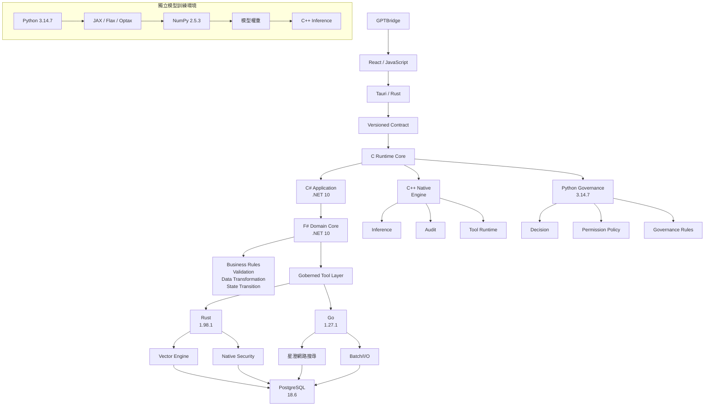
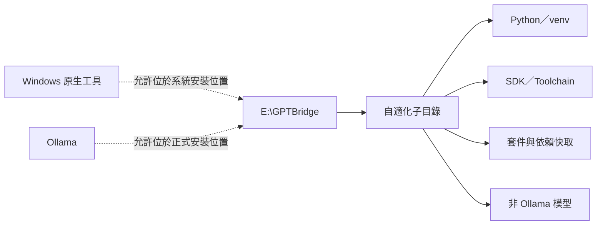

# GPTBridge 程式語言架構

本文件是正式法典的架構投影；權責以 PostgreSQL 法典 A35、A341、A343、A348、A604、A605、A610–A621 為準。

| 技術 | 目標版本 | 正式責任 |
| ---------- | -------------- | ------------------------------------- |
| C | C23 | 運行核心、權限熱路徑、決定性執行、純計算 |
| C++ | C++23 | 模型推論、Native Tool Runtime、Audit Engine |
| Rust | 1.98.1 | 本地向量引擎、記憶體安全元件、桌面原生整合 |
| Go | 1.27.1 | 星澄網路搜尋、批次處理、網路與檔案 I/O |
| C# | C# 14 | Application、API、Workflow、Windows 整合 |
| F# | F# 10.0 | 核心業務邏輯、資料轉換、驗證、業務狀態轉移 |
| .NET | .NET 10 | C#／F# 共用執行環境 |
| Python | 3.14.7 | 治理語意、必要薄封裝、模型研發與訓練 |
| JAX | 待相容性鎖定 | 星澄模型訓練、自動微分、加速數值計算 |
| NumPy | 2.5.3 | 資料前處理、統計、陣列計算 |
| JavaScript | ECMAScript／ESM | React UI、前端狀態、桌面互動 |
| React | 19.2.8 | UI 元件及畫面 |
| Julia | 待正式版本鎖定 | 統計、數學模型、最佳化、模擬、科學計算 |
| TypeScript | 已退役 | 由 JavaScript ESM 繼任；既有 .ts/.tsx/.d.ts 檔案保留至遷移完成（grandfathered-existing-only，A348） |
| PostgreSQL | 18.6 | 唯一正式結構化資料權威 |
| Git | 2.55.0 | 原始碼版本管理 |

```mermaid
flowchart TB
  GPTBridge --> ReactJS[React / JavaScript]
  ReactJS --> TauriRust[Tauri / Rust]
  TauriRust --> Contract[Versioned Contract]
  Contract --> CRuntime[C Runtime Core]
  CRuntime --> CSharpApp[C# Application<br>.NET 10]
  CRuntime --> CppNative[C++ Native<br>Engine]
  CRuntime --> PyGov[Python Governance<br>3.14.7]
  CSharpApp --> FSharpCore[F# Domain Core<br>.NET 10]
  FSharpCore --> BusinessRules[Business Rules<br>Validation<br>Data Transformation<br>State Transition]
  CppNative --> Inference[Inference]
  CppNative --> Audit[Audit]
  CppNative --> ToolRuntime[Tool Runtime]
  PyGov --> Decision[Decision]
  PyGov --> Permission[Permission Policy]
  PyGov --> GovRules[Governance Rules]
  FSharpCore --> GoRustLayer[Goberned Tool Layer]
  GoRustLayer --> Go[Go<br>1.27.1]
  GoRustLayer --> Rust[Rust<br>1.98.1]
  Go --> Search[星澄網路搜尋]
  Go --> Batch[Batch/I/O]
  Rust --> Vector[Vector Engine]
  Rust --> NativeSec[Native Security]
  Vector --> PG[PostgreSQL<br>18.6]
  NativeSec --> PG
  Search --> PG
  Batch --> PG

  subgraph Training[獨立模型訓練環境]
    PyTrain[Python 3.14.7] --> JAX[JAX / Flax / Optax]
    JAX --> Numpy[NumPy 2.5.3]
    Numpy --> Weights[模型權重]
    Weights --> CppInfer[C++ Inference]
  end
```

- C23 執行已核准的決定性規則，不得自行修改治理規則；以 C23 新標準與 arena 管理實現高效能高穩定低消耗。
- C++23 擁有原生能力、推論、原生測試及已核准審計熱路徑；以 modules/constexpr 與 RAII 實現高執行速度。
- Rust 1.98.1 負責本地向量引擎、記憶體安全元件、桌面原生整合。
- Go 1.27.1 負責星澄網路搜尋、批次處理、網路與檔案 I/O。
- C#14/.NET 10 負責 Application/API/Workflow/Windows 整合；以 .NET 10 GC 實現自動記憶體管理。
- F#10.0/.NET 10 負責核心業務邏輯、資料轉換、驗證、業務狀態轉移。
- Python 3.14.7 僅保留治理語意、必要薄封裝、模型研發與訓練，預設不常駐。
- JAX 待相容性鎖定，負責星澄模型訓練、自動微分、加速數值計算；以 XLA 實現高效能。
- NumPy 2.5.3 負責資料前處理、統計、陣列計算。
- JavaScript (ECMAScript/ESM) 與 React 19.2.8 負責 UI 元件、前端狀態及桌面互動。
- Julia 負責統計、數學模型、最佳化、模擬與科學計算，版本待正式鎖定。
- TypeScript 已退役並由 JavaScript ESM 繼任；既有檔案在遷移完成前保留為 grandfathered-existing-only（A348）。
- PostgreSQL 18.6 為唯一正式結構化資料權威；SQLite 已退休。
- Git 2.55.0 為原始碼版本管理。

Go 與 Rust 只取得已登記能力的執行權，不取得治理、權限或業務裁決權。跨語言呼叫必須使用版本化契約；公開原生邊界仍以 C ABI 或正式型別服務契約為準。

```mermaid
flowchart LR
  ROOT[E:\GPTBridge]
  ROOT --> ADAPT[自適化子目錄]
  ADAPT --> PYENV[Python／venv]
  ADAPT --> SDK[SDK／Toolchain]
  ADAPT --> DEP[套件與依賴快取]
  ADAPT --> MODEL[非 Ollama 模型]
  WIN[Windows 原生工具] -. 允許位於系統安裝位置 .-> ROOT
  OLLAMA[Ollama] -. 允許位於正式安裝位置 .-> ROOT
```

除 Windows 原生工具與 Ollama 外，Python 執行環境、SDK、工具鏈、套件、依賴快取及非 Ollama 模型均須位於 `E:\GPTBridge` 下的自適化子目錄，不集中堆放於專案頂層。
