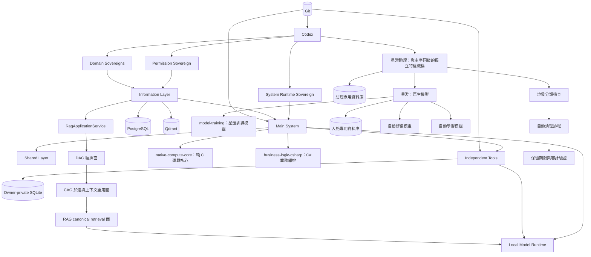

# GPTBridge 全專案架構圖

全專案統一採用 DAG、CAG、RAG 混合架構。DAG 是查詢、索引與修復工作流的無環編排面，不取代 Application Service；CAG 是安全、有版本、有範圍且非權威的快取增強面，不取代 RAG；RAG 是 canonical knowledge retrieval 面並保留 Hybrid、Code、Memory、Agentic 四子架構。正式路徑固定為 Caller → Information Channel → Permission / Scope → RagApplicationService → DAG Planner / Executor → CAG Gate → RAG Retrieval → Evidence Fusion → Reranker → Context Builder → Local LLM → Citation Validation → Result。Qdrant 與 PostgreSQL canonical 邊界不變，SQLite 只准 degraded fallback。

星澄與星澄助理均不屬於七個獨立工具。星澄助理是與裁決、權限、運行及自動化核心同級的獨立特權機構並使用獨立身分組；星澄是獨立的原生模型身分，星澄人格、自動修復模組與自動學習模組隸屬星澄，不隸屬星澄助理。兩者各用專用資料庫，禁止混用或互相作為權威來源。

新增登錄元件（2026-09-20）：`native-compute-core`（純 C 運算核心與穩定 C ABI）、`model-training`（星澄訓練模組）、`business-logic-csharp`（C# 業務編排／外部協調）。三者均為單一職責模組，不改變既有權責、資料邊界與 fail-closed。

星澄及其所屬內部模組不適用一般模組有效行數上限；不得僅因超過模組行數門檻要求拆分、阻擋合併或建立分解工作。此豁免只涵蓋模組行數，不解除函式、方法、類別、公開入口、可呼叫項目、權限、安全、測試、審計及可維護性要求。

自動修復與自動學習均為星澄內部模組，不具主宰、子主宰、獨立工具或獨立權限身分。自動修復的管理權屬於星澄；自動學習按需啟動、完成即釋放且不設使用者開關，但保留受治理的緊急停止機制。星澄具有編程能力，可從已驗證的故障、修復結果與回歸證據分析程式並產生最小修補及測試方案；正式修改仍由受治理執行器依權限、全域開關或單項許可、備份、回復與驗證程序套用。

對外只存在一個 `central-automatic-repair` 星澄能力，名稱與介紹固定為「自我學習與自動編程」；自動修復與自動學習模組只能作為該能力的內部實作，不得各自註冊公開能力、權限主體或控制面。

星澄除主動學習外，可經 `ai-collaboration` 的受治理網路通道搜尋官方文件、正式問題追蹤與可信技術來源以尋找修復方案。網路結果一律為未驗證候選，必須驗證來源、版本、適用條件、最小修改、回復方法與本機測試後才可交付修復流程；搜尋通道不得直接執行、寫檔、安裝套件或寫入正式資料。

星澄可運用編程、主動學習與網路研究能力，在自身擁有域內自行產生、分析、測試、驗證及處理自我升級更新；此流程由星澄內部生命週期完整承接，不經星澄助理、系統自動更新開關或獨立工具。自我升級不設使用者開關；候選只有在權限有效、獨立驗證通過、回復就緒且受治理發布完成後才能替換現行版本。禁止直接覆蓋現行程式、自行核發發布權或以網路內容直接更新。

故障手冊的學習攝取、更新建議與使用回饋由星澄的自動學習模組處理；故障手冊目錄、故障代碼目錄、故障身分與正式故障分類仍由權限核心持有。自動學習模組只能唯讀攝取正式故障資料並產生學習證據，不得改寫故障身分或自行取得修復執行權。

故障訊息經資訊層內部通道直接告知星澄，由星澄自主發起受治理維修，依序完成可修復性判定、權限檢核、稽核登錄、執行、獨立驗證及學習回饋。星澄助理仍接收並顯示故障與維修結果通知，但通知只具狀態告知效力，不是許可、決策或執行入口，也不得阻擋星澄自主維修。

星澄助理固定顯示兩個彼此獨立的全域開關：系統自動更新與系統自動修復，並同時提供逐項「單項許可／不許可」。全域開關控制相應自動流程；單項選擇只作用於指定項目且不得改變全域開關。自動學習與星澄自我升級不設開關。

系統自動修復的唯一職責擁有者為星澄。星澄助理負責獨立稽查、使用者控制與結果呈現，不得編程、產生修補或執行修復；星澄負責提出修復方案、適用條件、所需權限、前置要求、測試與回復方法。若證據不足或無法確定方案可安全修復，流程必須停止、保留現況並要求補充證據，不得硬性修復、直接覆蓋或以重置冒充修復。

每次修復必須走完整流程審計：星澄助理稽查發現 → 星澄診斷與提出方案／要求 → 適用性、風險、最小變更、備份及回復門檻 → 使用者單項許可或有效自動授權 → 專責模組執行器執行 → 針對性測試與回歸驗證 → 星澄助理獨立稽查結案。每階段須保存狀態、理由與證據；缺少任一門檻即維持 `awaiting-evidence`，不得宣告修復完成。

星澄必須在請求使用者許可之前完成唯讀修復計畫，至少呈現目標、方法、執行步驟、權限範圍、風險、驗證條件與回復方案。產生及展示計畫不構成修改授權；使用者能在看見完整計畫後選擇單項許可或不許可。

## 系統自動更新自動化流程條例

星澄助理提供系統自動更新總開關、候選項目、逐項選擇與結果。自動化核心只管理流程與排程；裁決核心裁決爭議，權限核心執行權限檢核與稽核，運行核心向已登錄的單一職責模組下發執行、驗證及失敗回復命令。任何核心均不得直接執行模組工作，退役子主宰不得再取得 current owner 或路由。全域開關關閉時仍可用當前單項許可執行指定項目；任何門檻失敗均 fail-closed 並保留最後已驗證版本。

## Runtime 規則索引

Runtime 規則索引是由正式法典生成的唯讀、可重建、非權威投影。查詢路徑固定為「法典有效條文與 successor 解析 → 規則正規化 → 緊湊 generation → 精確鍵／倒排集合／位元集合 → Runtime 查詢」，不得把索引內容反向寫回法典或藉索引推導新權限。

索引以 `RUNTIME_RULE_INDEX_V2` 為唯一機器契約，提供 provision、rule code、owner、capability、trigger、phase、severity、effect、deadline、resource、data class、dependency 與 successor 等查詢維度。精確鍵採直接定位，多條件查詢採最小集合優先交集；目前 generation 必須與現行法典版本、有效條文集合及 successor resolution 完全一致，否則整個索引拒絕啟用並回到正式法典查詢。generation 只能完整建置、驗證後原子切換，讀取端不得看見半成品。

模組相關的實作規則由 owning module 在自身邊界內管理，但其 authority class 固定為 `module-derived-non-authoritative`。每條模組規則必須連回 controlling provision、模組契約與版本，不能授權自身、改寫治理邊界或對其他模組產生效力；跨模組規則必須提升為正式共用契約。Runtime 規則索引只收錄正式法典規則，禁止收錄、複製或快取模組規則；模組執行時自行載入本模組規則，發生衝突時只採正式法典及其有效 successor。

模組規則另由權限核心建立唯一集中索引 `MODULE_RULE_INDEX_V1`。owning module 負責規則內容與版本，權限核心只負責登錄、身分解析、範圍檢核、衝突檢查、狀態管理與查詢服務，不得改寫模組規則或將索引升格為權威。模組執行時可向集中索引取得本模組規則，但必須驗證 module identity、controlling provision、契約版本及狀態；索引不可用時，不得改由 Runtime 規則索引代理模組規則。

星澄助理提供逐項「單項許可」與「不許可」按鈕，讓使用者分別決定每一個更新或修復是否執行。單項許可只綁定一個明確 action identity、現行證據摘要、期限與一次性執行權，不得移轉、重播或擴張到其他項目；執行完成、失敗、證據變更或逾期即失效。不許可只終止指定項目，不影響其他項目。自動化主宰仍只負責分工，實際工作仍由受治理模組執行器完成。

Git 管來源與歷史；PostgreSQL 管已宣告的中央正式狀態；Qdrant 僅保存語意候選；SQLite 僅保存 owner 私有狀態與有界降級資料；模型只負責推論。

退役模組必須標示為 `trash`，由星澄助理稽查分類，再交由自動清理排程處理。清理前必須驗證退役狀態、非權威性、保留期限、依賴關係與審計證據；禁止將活躍模組或尚有 current dependency 的資料當作垃圾。

從使用者啟動到主畫面完成就緒不得超過 10 秒；任一強制測試套件必須在 20 秒內完成並產生結果；各自獨立審計流程不得超過 30 秒。任一時限逾期均必須 fail-closed，不得視為通過。

本圖受 A528、A537 與 A538 約束。任何自動法典更新必須在同一受治理交易內同步五份中文法典、machine architecture registry 與全部架構圖；任一目標缺失、失敗或版本不同即回復全部變更並拒絕發布。

七個獨立工具的單次啟動與單次關閉各自不得超過 5 秒；逾時必須終止當次操作、回報明確失敗並保留可驗證狀態，不得宣告成功。同步基線：A540。

本地模型不納入預設啟動。主畫面必須提供本地模型的獨立啟動與關閉開關，只有使用者明確啟動或有效單項許可才可啟動；關閉後不得被預熱、自動復原或其他啟動流程暗中重啟。

模型對話的自動路由預設以星澄為第一候選。僅當星澄未啟動、不可用、能力不符或治理邊界拒絕時，才可依已登錄備援順序轉用其他模型；不得為了啟用優先路由而繞過 A540 的本地模型預設關閉規則。同步基線：A541。
