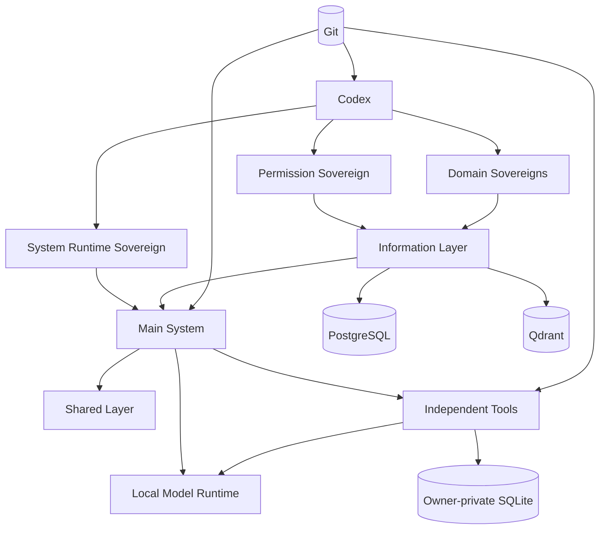

# GPTBridge 全專案架構圖

```mermaid
flowchart TB
  C[Codex] --> P[Permission Sovereign]
  C --> D[Domain Sovereigns]
  C --> R[System Runtime Sovereign]
  P --> I[Information Layer]
  D --> I
  R --> M[Main System]
  I --> M
  M --> S[Shared Layer]
  M --> T[Independent Tools]
  I --> PG[(PostgreSQL)]
  I --> Q[(Qdrant)]
  T --> SQ[(Owner-private SQLite)]
  G[(Git)] --> C
  G --> M
  G --> T
  M --> L[Local Model Runtime]
  T --> L
```

Git 管來源與歷史；PostgreSQL 管已宣告的中央正式狀態；Qdrant 僅保存語意候選；SQLite 僅保存 owner 私有狀態與有界降級資料；模型只負責推論。
