# GPTBridge 全專案完整架構圖

本圖是全專案架構的中文投影。機器拓撲仍以 `governance_rule/execution/audit/architecture_registry.json` 為唯一來源；本圖不得建立第二套權威。

## 一、治理、五核心與執行邊界

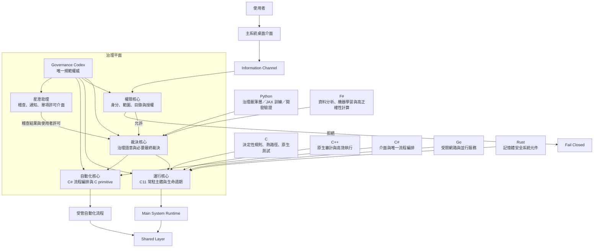
```mermaid
flowchart TB
  U[使用者] --> UI[主系統桌面介面]
  UI --> IC[Information Channel]

  subgraph GOV[治理平面]
    CX[Governance Codex<br/>唯一規範權威]
    DC[裁決核心<br/>治理語意與必要最終裁決]
    PC[權限核心<br/>身分、範圍、目錄與授權]
    RC[運行核心<br/>C11 常駐主體與生命週期]
    AC[自動化核心<br/>C# 流程編排與 C primitive]
    XA[星澄助理<br/>稽查、通知、單項許可介面]
    CX --> DC
    CX --> PC
    CX --> RC
    CX --> AC
    CX --> XA
  end

  IC --> PC
  PC -->|允許| DC
  PC -->|拒絕| DENY[Fail Closed]
  DC --> RC
  DC --> AC
  XA -->|稽查結果與使用者許可| DC

  RC --> MS[Main System Runtime]
  AC --> FLOW[受管自動化流程]
  MS --> SL[Shared Layer]
  FLOW --> SL

  C[C<br/>決定性規則、熱路徑、原生測試] --> RC
  CPP[C++<br/>原生審計與高效執行] --> RC
  CS[C#<br/>介面與唯一流程編排] --> AC
  PY[Python<br/>治理最薄層／JAX 訓練／開發驗證] --> DC
  FS[F#<br/>資料分析、機器學習與高正確性計算] --> DC
  GO[Go<br/>受限網路與並行服務] --> RC
  RS[Rust<br/>記憶體安全系統元件] --> RC
```

核心約束：C、C++、C#、F#、Go、Rust 只能執行其已授權責任；不得自行修改治理規則、建立權限或繞過裁決。Python 僅保留治理必要語意最薄層、按需 Python＋JAX 訓練、development-only pytest／驗證三域；除治理必要部分外，Production idle Python process count 必須為 0，Python 不得控制正式推論 Runtime。

## 二、啟動、運行與關閉

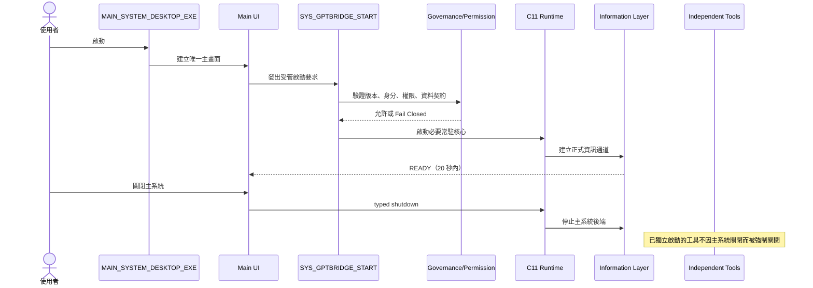
```mermaid
sequenceDiagram
  actor User as 使用者
  participant EXE as MAIN_SYSTEM_DESKTOP_EXE
  participant UI as Main UI
  participant Start as SYS_GPTBRIDGE_START
  participant Gov as Governance/Permission
  participant Run as C11 Runtime
  participant Info as Information Layer
  participant Tools as Independent Tools

  User->>EXE: 啟動
  EXE->>UI: 建立唯一主畫面
  UI->>Start: 發出受管啟動要求
  Start->>Gov: 驗證版本、身分、權限、資料契約
  Gov-->>Start: 允許或 Fail Closed
  Start->>Run: 啟動必要常駐核心
  Run->>Info: 建立正式資訊通道
  Info-->>UI: READY（20 秒內）
  User->>UI: 關閉主系統
  UI->>Run: typed shutdown
  Run->>Info: 停止主系統後端
  Note over Tools: 已獨立啟動的工具不因主系統關閉而被強制關閉
```

- 主系統完整啟動上限：20 秒。
- 獨立工具啟動與關閉上限：各 5 秒。
- 強制測試套件上限：20 秒；各自審計流程上限：30 秒。
- 主系統視窗關閉必須停止其 matching backend；獨立工具依自身生命週期關閉。

## 三、GPTBridge UI Stack

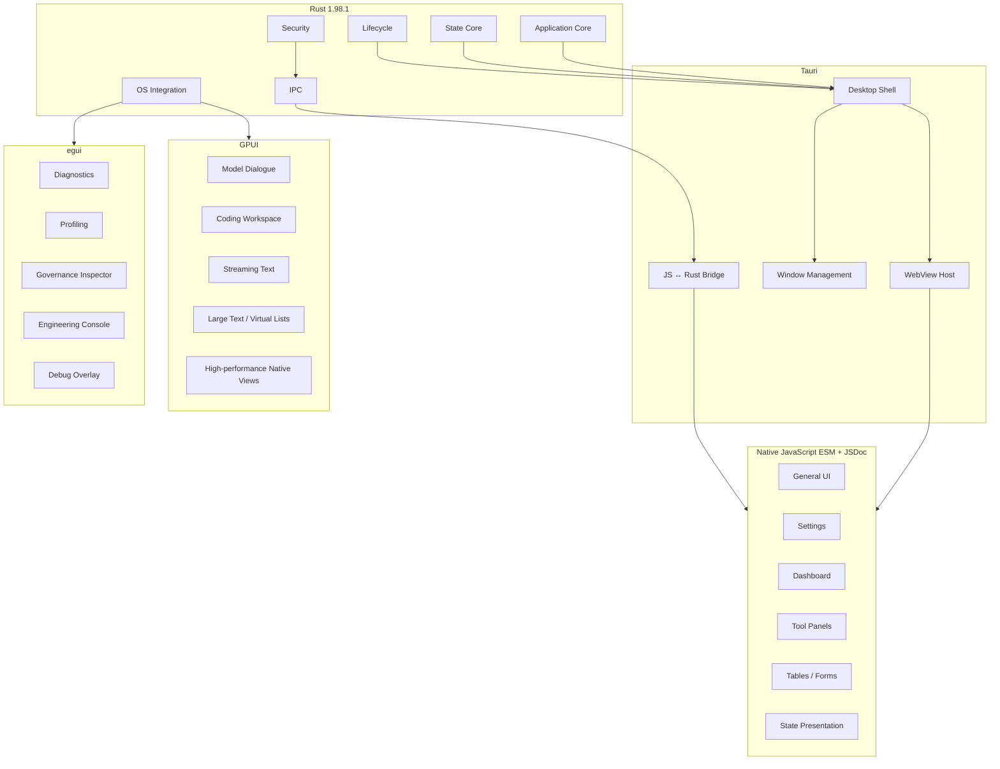
```mermaid
flowchart TB
  subgraph CORE[Rust 1.98.1]
    APP[Application Core]
    STATE[State Core]
    SECURITY[Security]
    IPC[IPC]
    LIFE[Lifecycle]
    NATIVE[OS Integration]
  end
  subgraph TAURI[Tauri]
    SHELL[Desktop Shell]
    WEBVIEW[WebView Host]
    WINDOWS[Window Management]
    JSB[JS ↔ Rust Bridge]
  end
  subgraph ESM[Native JavaScript ESM + JSDoc]
    GENERAL[General UI]
    SETTINGS[Settings]
    DASHBOARD[Dashboard]
    PANELS[Tool Panels]
    TABLES[Tables / Forms]
    STATUS[State Presentation]
  end
  subgraph GPUI[GPUI]
    MODEL[Model Dialogue]
    CODE[Coding Workspace]
    STREAM[Streaming Text]
    TEXT[Large Text / Virtual Lists]
    PERF[High-performance Native Views]
  end
  subgraph EGUI[egui]
    DIAG[Diagnostics]
    PROF[Profiling]
    GOV[Governance Inspector]
    ENG[Engineering Console]
    OVERLAY[Debug Overlay]
  end
  APP --> SHELL
  STATE --> SHELL
  SECURITY --> IPC
  IPC --> JSB
  LIFE --> SHELL
  NATIVE --> GPUI
  NATIVE --> EGUI
  SHELL --> WEBVIEW
  SHELL --> WINDOWS
  WEBVIEW --> ESM
  JSB --> ESM
```

UI 的唯一共用核心是 Rust 1.98.1，負責 UI 核心、應用狀態、生命週期、IPC、安全與 OS 整合。Tauri 負責 Desktop Shell、WebView、Window 管理及 JS↔Rust Bridge；原生 JavaScript ESM 搭配 JSDoc，負責設定、工具面板、表格、表單與狀態呈現；GPUI 負責模型對話、Coding Workspace、大量文字及虛擬清單；egui 負責系統診斷、效能監控、開發／治理工具及 Debug Overlay。各層不得自行建立權限、狀態或生命週期權威。前端 JavaScript 經 Esbuild／SWC 混合鏈產生；GPUI 與 egui 維持 Rust 原生路徑。

## 四、七個獨立工具

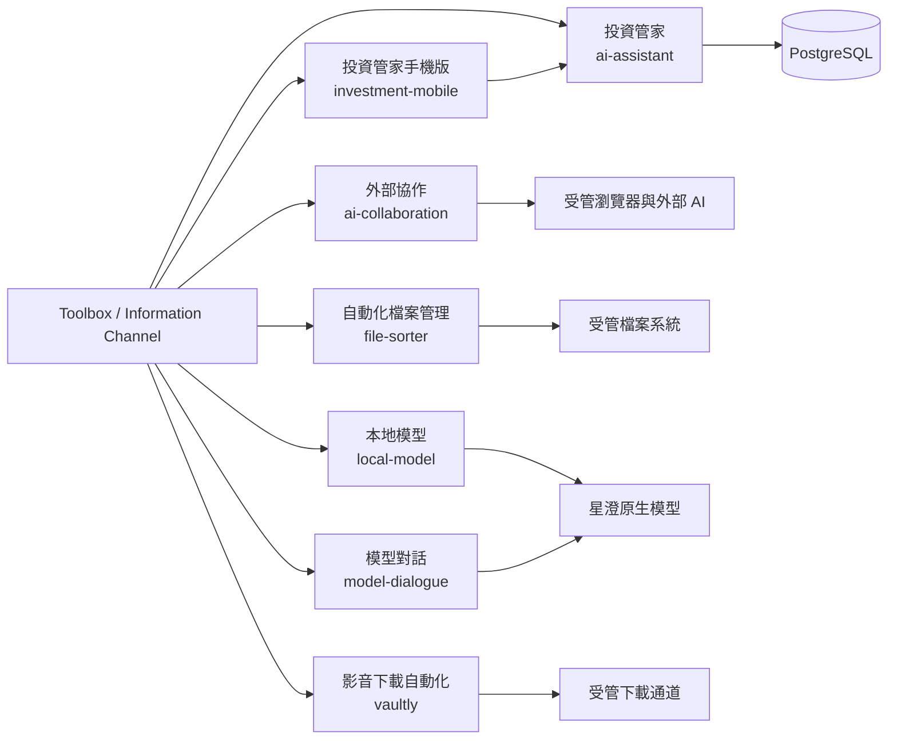
```mermaid
flowchart LR
  TB[Toolbox / Information Channel]
  TB --> T1[投資管家<br/>ai-assistant]
  TB --> T2[外部協作<br/>ai-collaboration]
  TB --> T3[自動化檔案管理<br/>file-sorter]
  TB --> T4[投資管家手機版<br/>investment-mobile]
  TB --> T5[本地模型<br/>local-model]
  TB --> T6[影音下載自動化<br/>vaultly]
  TB --> T7[模型對話<br/>model-dialogue]

  T1 --> PG[(PostgreSQL)]
  T2 --> WEB[受管瀏覽器與外部 AI]
  T3 --> FSYS[受管檔案系統]
  T4 --> T1
  T5 --> XC[星澄原生模型]
  T6 --> NET[受管下載通道]
  T7 --> XC
```

只有上述七項具有獨立工具身分。星澄、星澄助理、搜尋服務、程序量測、業務邏輯服務、科學運算服務、原生運算核心與內部維護能力均不是獨立工具。

## 五、星澄與星澄助理

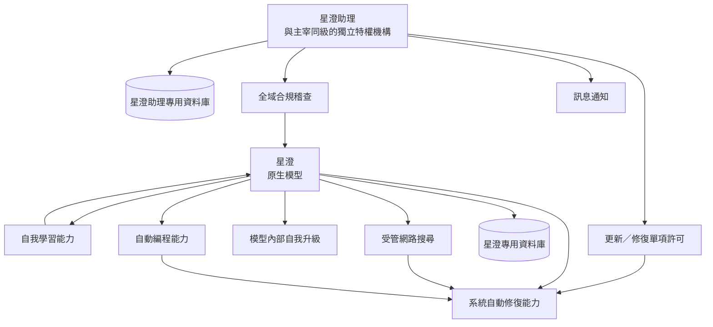
```mermaid
flowchart TB
  XA[星澄助理<br/>與主宰同級的獨立特權機構]
  XC[星澄<br/>原生模型]
  LEARN[自我學習能力]
  CODE[自動編程能力]
  REPAIR[系統自動修復能力]
  UPGRADE[模型內部自我升級]
  WEB[受管網路搜尋]
  XADB[(星澄助理專用資料庫)]
  XCDB[(星澄專用資料庫)]

  XA --> AUDIT[全域合規稽查]
  XA --> NOTICE[訊息通知]
  XA --> PERMIT[更新／修復單項許可]
  XA --> XADB

  AUDIT --> XC
  PERMIT --> REPAIR
  XC --> LEARN
  XC --> CODE
  XC --> REPAIR
  XC --> UPGRADE
  XC --> WEB
  XC --> XCDB
  LEARN --> XC
  WEB --> REPAIR
  CODE --> REPAIR
```

星澄提出修復方案並執行已授權修復；無法確認安全修復時必須停止，不得硬修復、直接覆蓋或重置。修復全程受決策、權限、執行與審計約束。星澄與星澄助理使用不同身分組及不同資料庫，禁止混用。

## 六、DAG、CAG、RAG 與模型推論

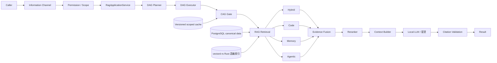
```mermaid
flowchart LR
  CALLER[Caller] --> CH[Information Channel]
  CH --> SCOPE[Permission / Scope]
  SCOPE --> APP[RagApplicationService]
  APP --> PLAN[DAG Planner]
  PLAN --> EXEC[DAG Executor]
  EXEC --> CACHE[CAG Gate]
  CACHE --> RET[RAG Retrieval]
  RET --> HYB[Hybrid]
  RET --> CODE[Code]
  RET --> MEM[Memory]
  RET --> AG[Agentic]
  HYB --> FUSE[Evidence Fusion]
  CODE --> FUSE
  MEM --> FUSE
  AG --> FUSE
  FUSE --> RERANK[Reranker]
  RERANK --> CTX[Context Builder]
  CTX --> LLM[Local LLM / 星澄]
  LLM --> CITE[Citation Validation]
  CITE --> RESULT[Result]

  PG[(PostgreSQL canonical data)] --> RET
  VD[(vectord-rs Rust 語義索引)] --> RET
  CSTORE[(Versioned scoped cache)] --> CACHE
```

- DAG 是工作流編排平面，不取代 Application Service。
- CAG 是安全、版本化、有範圍的加速與上下文重用平面，不取代 RAG。
- RAG 是 canonical knowledge retrieval 平面，保留 Hybrid、Code、Memory、Agentic 四個子架構。
- PostgreSQL 與 vectord-rs 的 canonical 邊界不變；Qdrant 與 SQLite 均依 A621 退役且必須維持零 active consumer。

## 七、Git 架構

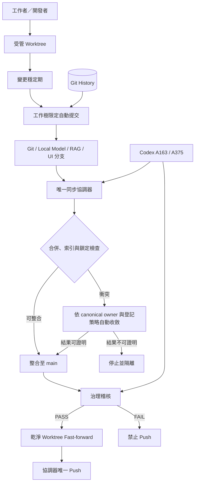
```mermaid
flowchart TB
  DEV[工作者／開發者] --> WT[受管 Worktree]
  WT --> STABLE[變更穩定期]
  STABLE --> COMMIT[工作樹限定自動提交]
  COMMIT --> BRANCH[Git / Local Model / RAG / UI 分支]
  BRANCH --> COORD[唯一同步協調器]
  COORD --> GUARD{合併、索引與鎖定檢查}
  GUARD -->|衝突| RESOLVE[依 canonical owner 與登記策略自動收斂]
  GUARD -->|可整合| MERGE[整合至 main]
  RESOLVE -->|結果可證明| MERGE
  RESOLVE -->|結果不可證明| QUARANTINE[停止並隔離]
  MERGE --> AUDIT[治理稽核]
  AUDIT -->|PASS| FF[乾淨 Worktree Fast-forward]
  FF --> PUSH[協調器唯一 Push]
  AUDIT -->|FAIL| CLOSED[禁止 Push]

  HIST[(Git History)] --> COMMIT
  POLICY[Codex A163 / A375] --> COORD
  POLICY --> AUDIT
```

- 每個工作樹只提交自身變更；已有外部 staged 內容時禁止自動納入。
- 禁止 force-push、刪除 ref、破壞性 reset 與未授權 non-fast-forward。
- 自動提交只負責 commit；只有同步協調器能在整合與稽核成功後推送 `main`。
- Git 保存程式碼、遷移與歷史，不承載中央即時資料或權限事實。
- 生成檔依登記的重建策略處理；真正內容衝突必須依權威來源自動裁定，無可靠裁定時隔離。
- Git 追蹤採明確 allowlist：正式來源、法典與契約、SQL migration、必要設定、不可重建的測試／審計證據及人工文件。Runtime state、logs、cache、temp、build/dist、套件、模型、資料庫實例、coverage、重建索引與其他可再生產物一律不追蹤。
- 全流程由既有 `GitAutomationService` 與唯一同步協調器事件驅動完成：穩定偵測、路徑限定 staging、commit、整合、衝突分類、稽核、fast-forward 與 push；不得建立第二套 watcher、scheduler 或 coordinator。

## 八、SQL 架構

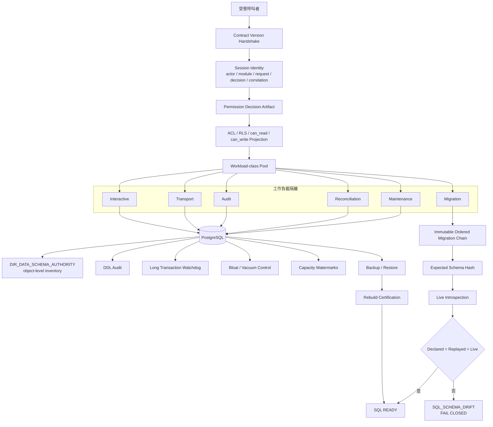
```mermaid
flowchart TB
  CALL[受管呼叫者] --> HELLO[Contract Version Handshake]
  HELLO --> SESSION[Session Identity<br/>actor / module / request / decision / correlation]
  SESSION --> AUTH[Permission Decision Artifact]
  AUTH --> RLS[ACL / RLS / can_read / can_write Projection]
  RLS --> POOL[Workload-class Pool]

  subgraph CLASSES[工作負載隔離]
    INT[Interactive]
    TRANS[Transport]
    AUD[Audit]
    REC[Reconciliation]
    MAINT[Maintenance]
    MIGR[Migration]
  end
  POOL --> INT
  POOL --> TRANS
  POOL --> AUD
  POOL --> REC
  POOL --> MAINT
  POOL --> MIGR

  INT --> PG[(PostgreSQL)]
  TRANS --> PG
  AUD --> PG
  REC --> PG
  MAINT --> PG
  MIGR --> CHAIN[Immutable Ordered Migration Chain]
  CHAIN --> EXPECT[Expected Schema Hash]
  EXPECT --> LIVE[Live Introspection]
  LIVE --> GATE{Declared = Replayed = Live}
  GATE -->|是| READY[SQL READY]
  GATE -->|否| DRIFT[SQL_SCHEMA_DRIFT<br/>FAIL CLOSED]

  PG --> DIR[DIR_DATA_SCHEMA_AUTHORITY<br/>object-level inventory]
  PG --> DDL[DDL Audit]
  PG --> TX[Long Transaction Watchdog]
  PG --> VAC[Bloat / Vacuum Control]
  PG --> CAP[Capacity Watermarks]
  PG --> BACKUP[Backup / Restore]
  BACKUP --> CERT[Rebuild Certification]
  CERT --> READY

```

SQL 核心不變式：

- PostgreSQL 是中央結構化正式資料、共享傳輸與中央審計的唯一 SQL 權威。
- `permission decision → authorization artifact → PostgreSQL projection → enforcement`，資料庫列本身不得創造權限。
- 每個 schema、table、view、function、trigger、index、RLS policy 與 role 必須有唯一物件身分、owner、資料類別、建立 migration、定義雜湊與生命週期。
- Migration 必須有序、不可變、連續且可重播；禁止 runtime role 執行 CREATE、ALTER、DROP。
- Restore、migration 或 role rotation 後提高 connection generation；舊連線不得再寫入。
- PostgreSQL 故障依 capability matrix 分別關閉或切換唯讀；不得轉移至已退役 SQL 引擎或建立替代權威。

## 九、資料、權限與追溯鏈

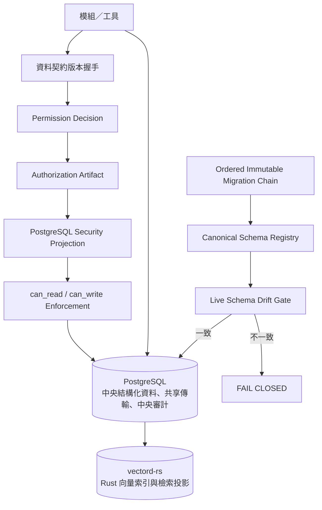
```mermaid
flowchart TB
  MOD[模組／工具] --> CONTRACT[資料契約版本握手]
  CONTRACT --> AUTHZ[Permission Decision]
  AUTHZ --> ART[Authorization Artifact]
  ART --> PROJ[PostgreSQL Security Projection]
  PROJ --> RW[can_read / can_write Enforcement]

  RW --> PG[(PostgreSQL<br/>中央結構化資料、共享傳輸、中央審計)]
  PG --> VD[(vectord-rs<br/>Rust 向量索引與檢索投影)]
  MOD --> PG

  MIG[Ordered Immutable Migration Chain] --> SCHEMA[Canonical Schema Registry]
  SCHEMA --> DRIFT[Live Schema Drift Gate]
  DRIFT -->|一致| PG
  DRIFT -->|不一致| CLOSED[FAIL CLOSED]
```

| 資料層 | 正式角色 | 禁止事項 |
| --- | --- | --- |
| PostgreSQL | 中央 structured official data、shared transport、central audit | 不得以 live schema 反向創造法典事實 |
| vectord-rs（Rust） | 受範圍約束的向量索引與檢索投影 | 不得成為結構化資料或權限權威 |
| Git | 程式碼、遷移與不可變歷史 | 不得代替即時資料權威 |

所有重要寫入必須攜帶 actor、executor、decision、correlation 與 source revision，並保存當下權限決策摘要。DDL 只能由 migration executor 執行；schema drift、權威衝突或完整性異常時，受影響資料域切換為唯讀或 Fail Closed。

權限核發、啟用、續期、限制、暫停、撤銷及終止採事件驅動全自動化：受管請求、身分／角色／範圍／風險／期限／世代變化觸發權限核心依唯一目錄作成決定，DirectoryAuthority 只執行確定性交易並回傳 receipt。期限到期、身分撤銷、範圍失效、世代提高或安全事件會自動停止權限；缺資料、衝突或無法證明最小權限時一律拒絕。資料庫 ACL／RLS 仍只是 enforcement projection，不得自行核發權限。

## 十、自動維護與故障處理

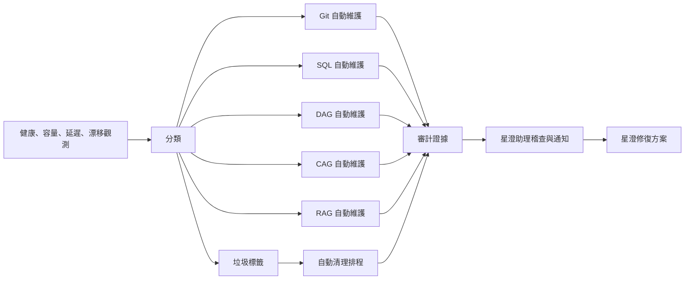
```mermaid
flowchart LR
  OBS[健康、容量、延遲、漂移觀測] --> CLASS[分類]
  CLASS --> GIT[Git 自動維護]
  CLASS --> SQL[SQL 自動維護]
  CLASS --> DAG[DAG 自動維護]
  CLASS --> CAG[CAG 自動維護]
  CLASS --> RAG[RAG 自動維護]
  CLASS --> TRASH[垃圾標籤]
  TRASH --> CLEAN[自動清理排程]

  GIT --> AUDIT[審計證據]
  SQL --> AUDIT
  DAG --> AUDIT
  CAG --> AUDIT
  RAG --> AUDIT
  CLEAN --> AUDIT
  AUDIT --> XA[星澄助理稽查與通知]
  XA --> XC[星澄修復方案]
```

RAG、CAG、DAG 與 SQL 維護採全自動事件驅動：來源、權限、契約、schema、migration、索引、快取、模型或刪除狀態改變時，自動判定受影響範圍並執行增量重建、失效、調和、漂移檢查、回收與證據發布；低頻完整掃描只作安全補償。`GAG` 不建立新平面，統一解析為既有 `DAG` 編排平面。

自動維護只能使用現有單一編排器、排程器、權限目錄與資訊通道。安全且可逆的生成性結果依 canonical inputs 自動重建；SQL DDL 只經 ordered migration executor；未知影響、無法驗證的 destructive change 或權威衝突必須 Fail Closed 並隔離，不得以人工確認作為正常維護路徑，也不得建立第二套 scheduler、planner、executor、cache authority、retrieval authority 或 SQL authority。

測試套件採事件驅動全自動化：正式來源、契約、ABI／IPC、migration、schema、設定、依賴、工具鏈或法典變更後，由唯一 C# `TestSuiteOrchestrator` 依影響圖選取必要套件並以有界並行執行。測試由被測能力的正式語言 owner 執行；Python pytest 只服務治理、JAX 訓練與開發邊界驗證，Production 不常駐。每個強制套件必須在 20 秒內產生版本、來源與 artifact 綁定的 typed evidence；FAIL、BLOCKED、timeout、缺證據或程序異常均不得視為 PASS。

審計套件同樣事件驅動全自動化：Canonical Audit Manifest 是唯一檢查清單；C++ Audit Engine 自動執行所有已核准且原生支援的 check，只有 manifest 明確標示 unsupported／delegated 的治理語意檢查才可按需交給 Python Thin Semantic Adapter。每個獨立審計流程必須在 30 秒內完成 finding、severity、evidence、failure classification、technical status 與 certification status；unsupported、timeout、損毀或缺證據不得 silent-pass。Python 不得成為常駐審計迴圈或第二套 Audit Engine。

## 十一、來源、部署與資源邊界

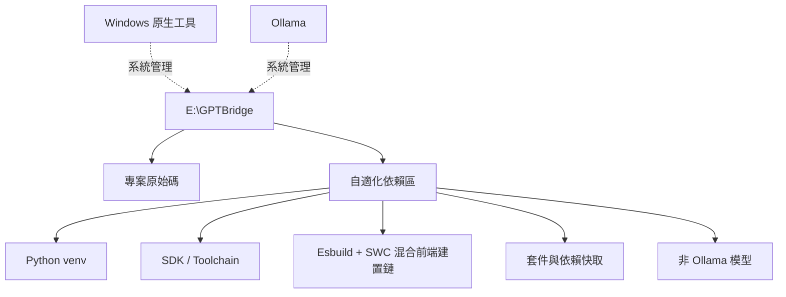
```mermaid
flowchart TB
  ROOT[E:\GPTBridge]
  ROOT --> SRC[專案原始碼]
  ROOT --> ADAPT[自適化依賴區]
  ADAPT --> VENV[Python venv]
  ADAPT --> SDK[SDK / Toolchain]
  ADAPT --> WEBBUILD[Esbuild + SWC 混合前端建置鏈]
  ADAPT --> CACHE[套件與依賴快取]
  ADAPT --> MODELS[非 Ollama 模型]
  WIN[Windows 原生工具] -.系統管理.-> ROOT
  OLLAMA[Ollama] -.系統管理.-> ROOT
```

除 Windows 原生工具與 Ollama 外，Python 執行環境、SDK、Toolchain、套件、依賴快取與模型必須位於 `E:\GPTBridge` 底下的適當子目錄，不得散落於頂層。完整程序樹受五核心資源預算、啟動期限、工作負載分類及自動回收機制約束。

全專案唯一資源管制器為 `native/resource_governor` 的 C++23 `resource-governor`，其受管身分為 `system-administrator`。系統管理員權限嚴格限於資源觀測與管制，不得修改法典、產生權限、讀取未授權資料或作成業務決策。其他語言與模組只能透過版本化契約提供量測訊號、接收限制結果或執行已核准動作，不得保留平行管制器、監看程序、sidecar 或 fallback。

前端建置統一使用 Esbuild／SWC 混合鏈：SWC 負責 JSX 與現代 JavaScript 語法轉換；Esbuild 負責依賴圖、bundle、code splitting、資產、source map、tree shaking 與最終壓縮；Rust Contract Validator 負責 Schema、IPC 與 API 靜態驗證。兩者不得重複轉換或建立平行建置權威。

法源：A8、A30、A35、A77、A82、A116、A163、A193、A201、A232、A245、A281、A341、A343、A375、A448、A452、A477、A487–A498、A500、A528、A534–A538、A544–A557、A586–A609。
