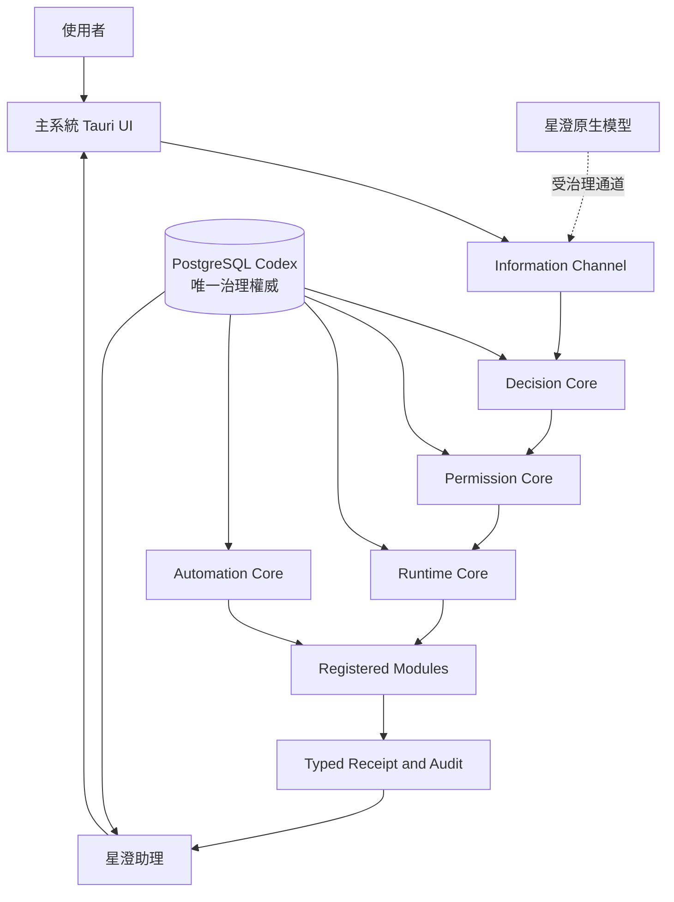
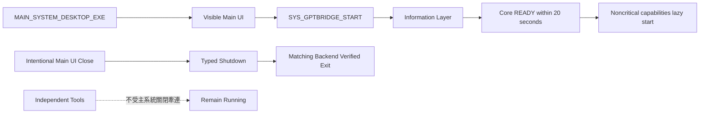
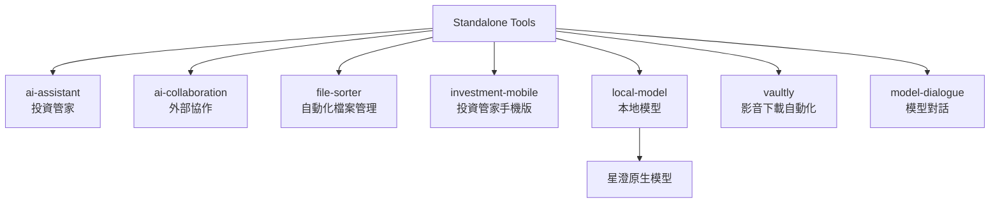
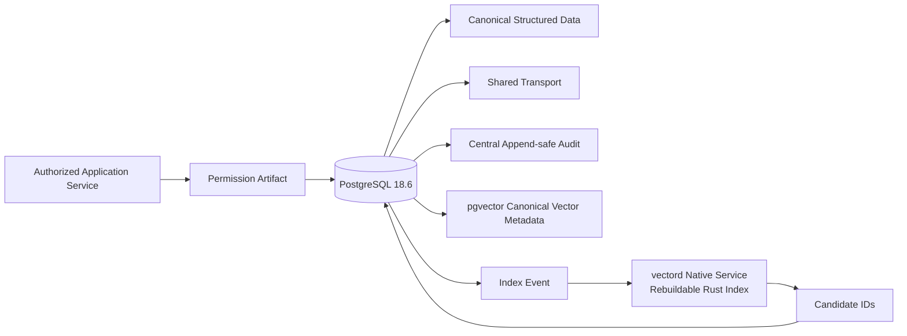
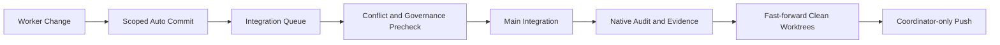
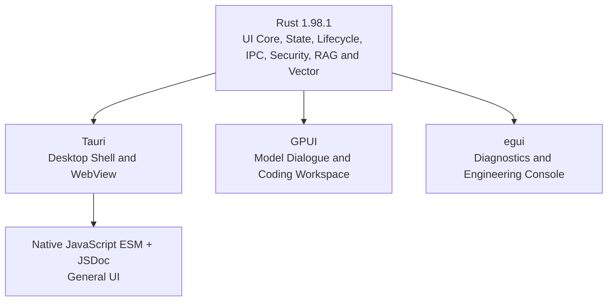
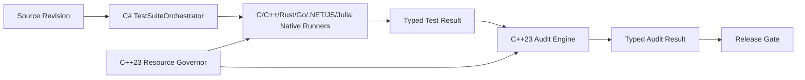
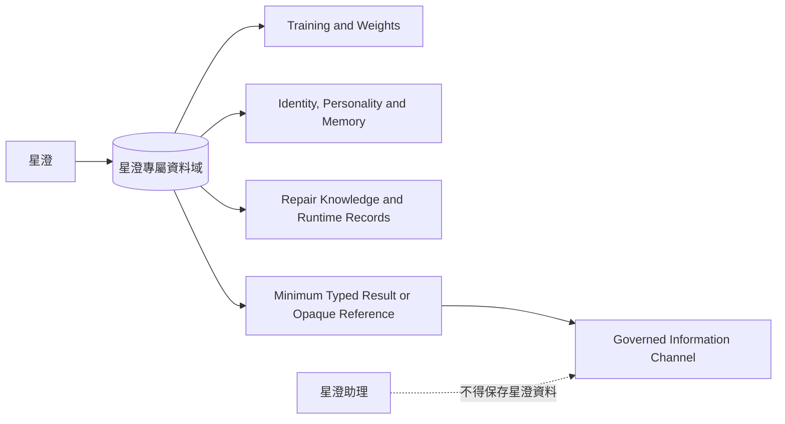

# GPTBridge 全專案完整架構圖

本文件是現行 PostgreSQL Codex 與架構登記的非權威同步投影。衝突時以最新已發布 Codex 為準；業務規則與實作細節由各 owner-local contract 管理。

## 一、權威與五核心

```mermaid
flowchart TB
  USER[使用者] --> UI[主系統 Tauri UI]
  UI --> INFO[Information Channel]
  CODEX[(PostgreSQL Codex<br/>唯一治理權威)] --> DEC[Decision Core]
  CODEX --> PERM[Permission Core]
  CODEX --> RUN[Runtime Core]
  CODEX --> AUTO[Automation Core]
  CODEX --> XA[星澄助理]
  INFO --> DEC
  DEC --> PERM
  PERM --> RUN
  RUN --> EXEC[Registered Modules]
  AUTO --> EXEC
  EXEC --> RECEIPT[Typed Receipt and Audit]
  RECEIPT --> XA
  XA --> UI
  XC[星澄原生模型] -.受治理通道.-> INFO
```

| 核心／機構 | 唯一責任 | 明確禁止 |
| --- | --- | --- |
| Decision Core | 政策、優先順序、變更與結果接受 | 直接執行模組工作 |
| Permission Core | 身分、範圍、權限、目錄與安全執法 | 產生領域事實或代替決策 |
| Runtime Core | 啟動、程序生命週期與受治理執行 | 自行授權或修改政策 |
| Automation Core | 已授權工作流排程、同步、更新與維護 | 自行產生權限或接受結果 |
| 星澄助理 | 全域稽查、通知及使用者單項許可介面 | 代替使用者選擇或保存星澄資料 |
| 星澄 | 原生模型、自我學習、自動編程與修復能力 | 成為獨立工具、法典或權限權威 |

次主權層不存在。模組只有單一 owner、單一主要責任及以內部時間戳記管理世代的契約，不具獨立權威。契約名稱不含版本號，架構文件不顯示機器識別。

## 二、啟動與生命週期

```mermaid
flowchart LR
  EXE[MAIN_SYSTEM_DESKTOP_EXE] --> UI[Visible Main UI]
  UI --> START[SYS_GPTBRIDGE_START]
  START --> INFO[Information Layer]
  INFO --> READY[Core READY within 20 seconds]
  READY --> LAZY[Noncritical capabilities lazy start]
  CLOSE[Intentional Main UI Close] --> STOP[Typed Shutdown]
  STOP --> VERIFY[Matching Backend Verified Exit]
  TOOLS[Independent Tools] -.不受主系統關閉牽連.-> RUNNING[Remain Running]
```

主系統啟動必須在 20 秒內完成。七個獨立工具各自啟動與關閉須在 5 秒內完成；工具視窗關閉只停止該工具自身完整程序樹。主系統關閉不得關閉獨立工具。

## 三、七個獨立工具

```mermaid
flowchart TB
  ROOT[Standalone Tools]
  ROOT --> T1[ai-assistant<br/>投資管家]
  ROOT --> T2[ai-collaboration<br/>外部協作]
  ROOT --> T3[file-sorter<br/>自動化檔案管理]
  ROOT --> T4[investment-mobile<br/>投資管家手機版]
  ROOT --> T5[local-model<br/>本地模型]
  ROOT --> T6[vaultly<br/>影音下載自動化]
  ROOT --> T7[model-dialogue<br/>模型對話]
  T5 --> XC[星澄原生模型]
```

只有上述七項是獨立工具。星澄、星澄助理、搜尋服務、資源管制器、資料服務及修復／學習能力均不是獨立工具；已退役工具不得重新進入現行拓撲。

## 四、資料與 SQL

```mermaid
flowchart LR
  APP[Authorized Application Service] --> SEC[Permission Artifact]
  SEC --> PG[(PostgreSQL 18.6)]
  PG --> OFFICIAL[Canonical Structured Data]
  PG --> TRANSPORT[Shared Transport]
  PG --> AUDIT[Central Append-safe Audit]
  PG --> VECTOR[pgvector Canonical Vector Metadata]
  PG --> EVENT[Index Event]
  EVENT --> VD[vectord Native Service<br/>Rebuildable Rust Index]
  VD --> IDS[Candidate IDs]
  IDS --> PG
```

PostgreSQL 是唯一正式結構化資料、共享傳輸、中央審計、權限投影及向量中繼資料權威。SQLite 與 Qdrant 沒有現行消費者、回退或權威角色。vectord 原生服務只保存可重建的衍生語意索引，不得保存唯一業務真相。

每個 PostgreSQL schema、table、view、function、trigger、index、sequence、type、policy、role、grant、extension 與 publication 都必須具有 canonical identity、owner、authority class、migration provenance、定義雜湊與生命週期。正式 schema 只能由不可變、排序、連續且可重播的 migration chain 建立；宣告、重播與 live introspection 不一致即 `SQL_SCHEMA_DRIFT` 並 fail-closed。

## 五、DAG／CAG／RAG

```mermaid
flowchart LR
  CALLER[Caller] --> INFO[Information Channel]
  INFO --> SCOPE[Permission and Scope]
  SCOPE --> APP[RagApplicationService]
  APP --> DAG[DAG Planner and Executor]
  DAG --> CAG[CAG Gate]
  CAG --> RAG[RAG Retrieval]
  RAG --> FUSE[Evidence Fusion]
  FUSE --> RERANK[Reranker]
  RERANK --> CONTEXT[Context Builder]
  CONTEXT --> LLM[Local LLM / 星澄]
  LLM --> CITE[Citation Validation]
  CITE --> RESULT[Result]
```

- DAG 是有向無環的工作流編排平面，不取代 Application Service。
- CAG 是有界、由內部時間戳記區分世代、範圍化且非權威的快取增強平面，不取代 RAG。
- RAG 是 canonical retrieval 平面，保留 Hybrid、Code、Memory、Agentic 四種子架構。
- PostgreSQL 保留來源、範圍、內部時間戳記世代、權限與發布狀態；vectord 原生服務只提供候選索引。

## 六、Git 全自動維護

```mermaid
flowchart LR
  WORK[Worker Change] --> COMMIT[Scoped Auto Commit]
  COMMIT --> QUEUE[Integration Queue]
  QUEUE --> PRE[Conflict and Governance Precheck]
  PRE --> MERGE[Main Integration]
  MERGE --> AUDIT[Native Audit and Evidence]
  AUDIT --> FF[Fast-forward Clean Worktrees]
  FF --> PUSH[Coordinator-only Push]
```

Git 只管理原始碼版本與開發歷史。每次提交限定明確路徑，禁止掃入其他工作者已暫存內容。只有同步協調器可推送；禁止 force-push、刪除 ref、無證據衝突覆寫與第二套 Git 編排器。可確定的生成檔衝突按已登錄策略重建；真實語義衝突 fail-closed。

## 七、程式語言與 UI

```mermaid
flowchart TB
  RUST[Rust 1.98.1<br/>UI Core, State, Lifecycle, IPC, Security, RAG and Vector]
  TAURI[Tauri<br/>Desktop Shell and WebView]
  JS[Native JavaScript ESM + JSDoc<br/>General UI]
  GPUI[GPUI<br/>Model Dialogue and Coding Workspace]
  EGUI[egui<br/>Diagnostics and Engineering Console]
  RUST --> TAURI --> JS
  RUST --> GPUI
  RUST --> EGUI
```

Electron、TypeScript、Node.js、React 不屬現行 UI 架構。C／C++／Rust 承載高頻原生工作，C# 承載應用與工作流，F# 承載業務規則與高正確性分析，Go 承載高併發網路／檔案／批次，Julia 承載科學計算。Python 只有單次治理語意轉接與已授權星澄 JAX／XLA 訓練兩項按需責任；正常 production 常駐為零。

## 八、測試、審計與資源

```mermaid
flowchart LR
  SRC[Source Revision] --> CSHARP[C# TestSuiteOrchestrator]
  CSHARP --> NATIVE[C/C++/Rust/Go/.NET/JS/Julia Native Runners]
  NATIVE --> TEST[Typed Test Result]
  TEST --> CPP[C++23 Audit Engine]
  CPP --> AUDIT[Typed Audit Result]
  AUDIT --> GATE[Release Gate]
  GOV[C++23 Resource Governor] --> NATIVE
  GOV --> CPP
```

C# 是唯一測試編排器；C++23 Audit Engine 是正式審計引擎；Python 與 pytest 不承擔正式測試、審計、驗證、發布或推送責任。必要測試套件須在 20 秒內完成，各獨立審計流程不得超過 30 秒。C++23 Resource Governor 是唯一全專案資源管制器，具限於資源管制的系統管理員身分。

## 九、星澄資料邊界

```mermaid
flowchart LR
  XC[星澄] --> XDATA[(星澄專屬資料域)]
  XDATA --> TRAIN[Training and Weights]
  XDATA --> MEMORY[Identity, Personality and Memory]
  XDATA --> REPAIR[Repair Knowledge and Runtime Records]
  XDATA --> OUT[Minimum Typed Result or Opaque Reference]
  OUT --> INFO[Governed Information Channel]
  XA[星澄助理] -.不得保存星澄資料.-> INFO
```

星澄擁有或為星澄產生的資料只能保存在星澄專屬領域。其他核心、工具與星澄助理只能取得完成工作所需的最小型別化結果或不透明參照，不得保存、複製、快取、建立索引、拿來訓練或取得資料權威。

## 十、程式碼與格式

所有新增或修改的程式碼與檔案格式必須同時追求高效能、高速、低延遲與低資源消耗，且不得犧牲正確性、安全、權威邊界、可攜性、可審查性或可維護性。並行必須有界並具背壓、期限、取消與清理；大量操作優先批次，大型資料優先參照、串流、分塊、映射或合適的零複製路徑。格式必須明定 owner、內部時間戳記世代、編碼、大小上限、未知欄位及相容政策。

## 十一、架構不變條件

1. 最新 PostgreSQL Codex 是唯一治理權威；中文法典與本文件均為同步投影。
2. 權限資料庫投影只執行 Permission Core 的決定，不自行創造權限。
3. 每個能力、資料與契約只有一個 canonical owner。
4. 快取、索引、遙測、備份與模型輸出永不因存在而取得權威。
5. 未登錄通道、無界資源、靜默降級、第二套編排器與第二套資料權威一律禁止。
6. 任何完整性、schema、權限、authority 或時間戳記世代衝突均 fail-closed。
