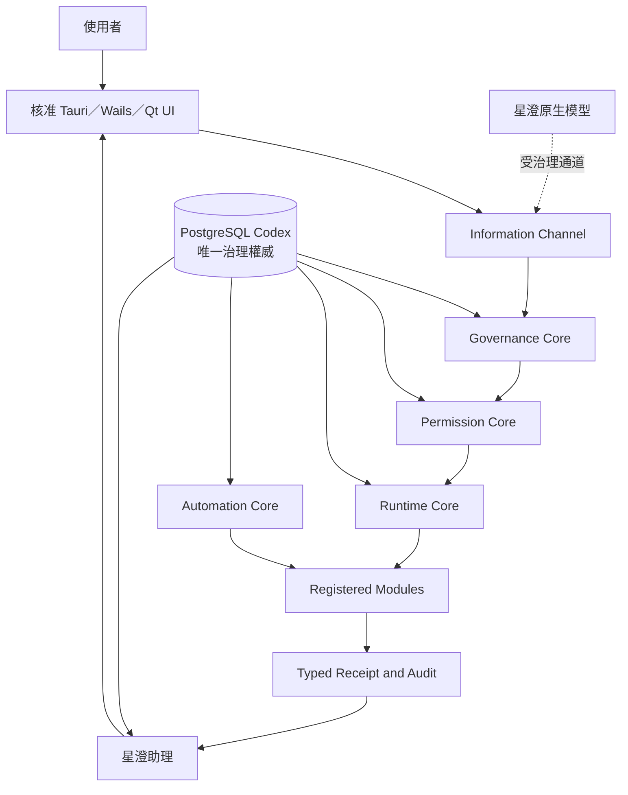
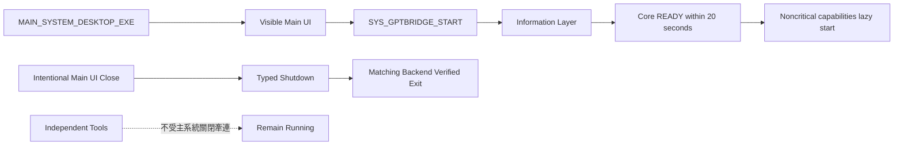
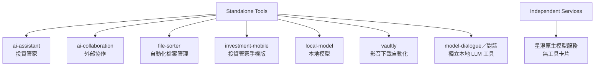
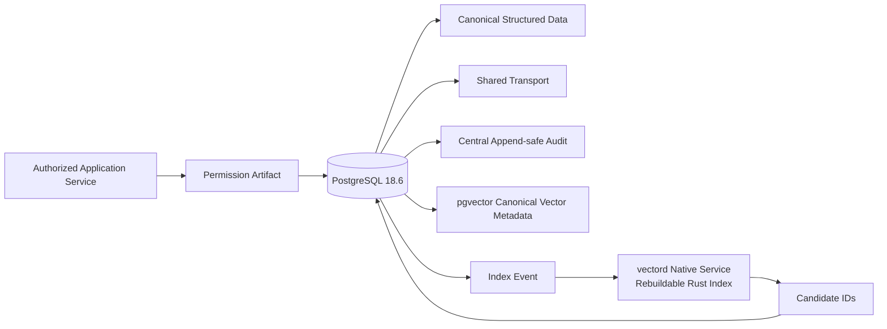
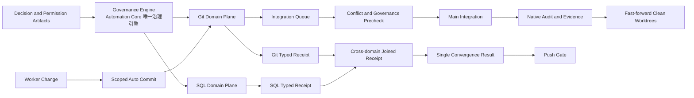
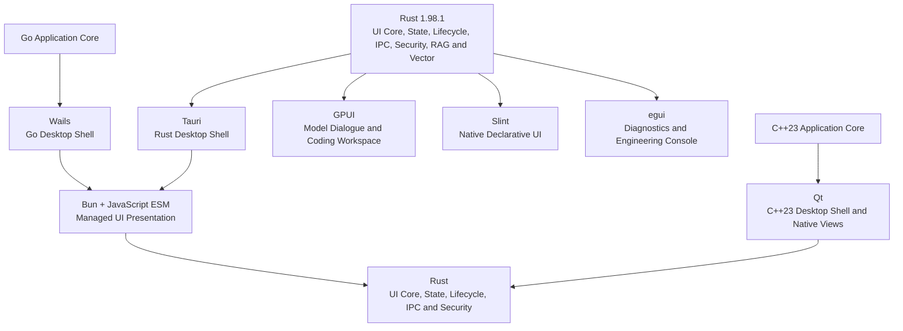
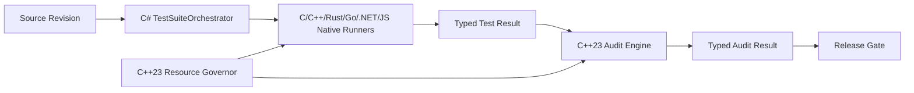
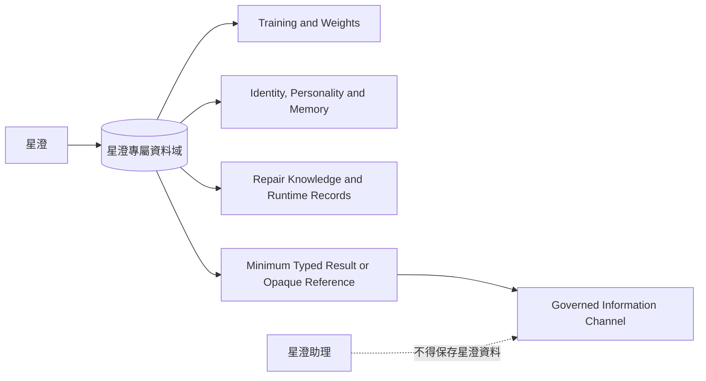

# GPTBridge 全專案完整架構圖

PostgreSQL `gptbridge_codex` 是唯一法典權威。不得保留 SQL dump、資料庫檔、JSON、快取、備份或其他 machine Codex 鏡像；唯一例外是五份唯讀中文法典鏡像，其不具裁決、執行、匯入、寫入或回退權。架構圖只是同步投影，不是法典鏡像或權威。

程式語言分工由 C、C++23、C#、Rust、Go、F# 核心語言池在既有責任與契約內自適化配置，Tauri、Wails 或 Qt UI 另可使用受管 Bun 執行 JavaScript ESM。每項能力同時只能有一個主要語言擁有者，並以正確性、安全、效能、資源與維護證據決定；不得改變權威、權限、業務語意或建立重複執行路徑。Python 全面禁止。

本文件是現行 PostgreSQL Codex 與架構登記的非權威同步投影。衝突時以最新已發布 Codex 為準；業務規則與實作細節由各 owner-local contract 管理。

## 一、權威與五核心

```mermaid
flowchart TB
  USER[使用者] --> UI[核准 Tauri／Wails／Qt UI]
  UI --> INFO[Information Channel]
  CODEX[(PostgreSQL Codex<br/>唯一治理權威)] --> DEC[Governance Core]
  CODEX --> PERM[Permission Core]
  CODEX --> RUN[Runtime Core]
  CODEX --> AUTO[Automation Core]
  CODEX --> XA[星澄助理]
  INFO --> DEC
  DEC --> PERM
  PERM --> RUN
  RUN --> EXEC[Registered Modules]
  AUTO --> EXEC
  EXEC --> RECEIPT[Typed Receipt and Audit]
  RECEIPT --> XA
  XA --> UI
  XC[星澄原生模型] -.受治理通道.-> INFO
```

| 核心／機構 | 唯一責任 | 明確禁止 |
| --- | --- | --- |
| Governance Core | 政策、優先順序、變更與結果接受 | 直接執行模組工作 |
| Permission Core | 身分、範圍、權限、目錄與安全執法 | 產生領域事實或代替決策 |
| Runtime Core | 啟動、程序生命週期與受治理執行 | 自行授權或修改政策 |
| Automation Core | 已授權工作流排程、同步、更新與維護 | 自行產生權限或接受結果 |
| 星澄助理 | 全域稽查、通知及使用者單項許可介面 | 代替使用者選擇或保存星澄資料 |
| 星澄 | 原生模型、自我學習、自動編程與修復能力 | 成為獨立工具、法典或權限權威 |

次主權層不存在。模組只有單一 owner、單一主要責任及以內部時間戳記管理世代的契約，不具獨立權威。契約名稱不含版本號，架構文件不顯示機器識別。

## 二、啟動與生命週期

```mermaid
flowchart LR
  EXE[MAIN_SYSTEM_DESKTOP_EXE] --> UI[Visible Main UI]
  UI --> START[SYS_GPTBRIDGE_START]
  START --> INFO[Information Layer]
  INFO --> READY[Core READY within 20 seconds]
  READY --> LAZY[Noncritical capabilities lazy start]
  CLOSE[Intentional Main UI Close] --> STOP[Typed Shutdown]
  STOP --> VERIFY[Matching Backend Verified Exit]
  TOOLS[Independent Tools] -.不受主系統關閉牽連.-> RUNNING[Remain Running]
```

主系統啟動必須在 20 秒內完成。七個獨立工具各自啟動與關閉須在 5 秒內完成；工具視窗關閉只停止該工具自身完整程序樹。主系統關閉不得關閉獨立工具。

## 三、七個獨立工具

```mermaid
flowchart TB
  ROOT[Standalone Tools]
  ROOT --> T1[ai-assistant<br/>投資管家]
  ROOT --> T2[ai-collaboration<br/>外部協作]
  ROOT --> T3[file-sorter<br/>自動化檔案管理]
  ROOT --> T4[investment-mobile<br/>投資管家手機版]
  ROOT --> T5[local-model<br/>本地模型]
  ROOT --> T6[vaultly<br/>影音下載自動化]
  ROOT --> T7[model-dialogue／對話<br/>獨立本地 LLM 工具]
  SERVICES[Independent Services] --> XC[星澄原生模型服務<br/>無工具卡片]
```

只有上述七項是獨立工具。星澄已從 `local-model` 分離為具獨立程序、生命週期、服務身分、擁有根與 PostgreSQL 資料範圍的本地原生模型服務，但不建立獨立工具卡片，也不計入七工具名單。星澄助理、搜尋服務、資源管制器、資料服務及修復／學習能力均不是獨立工具；已退役工具不得重新進入現行拓撲。

### 獨立工具清單（autogen）

<!-- autogen:project-tools -->
*autogen-scanner/v1 · 2340 files · main+devin+git+local-model+rag+ui*
| 工具 | manifest version | runtime | native entry | 樹 |
|---|---|---|---|---|
| `ai-assistant` | 1.0 | retired-python | `dist/GPTBridge.ToolHost.App.exe` | devin+git+local-model+main+rag+ui |
| `ai-collaboration` | 1.0 | go | `dist/ai-collab-host.exe` | devin+git+local-model+main+rag+ui |
| `file-sorter` | 1.0 | retired-python | `dist/GPTBridge.ToolHost.App.exe` | devin+git+local-model+main+rag+ui |
| `investment-mobile` | 1.0 | native | `dist/InvestmentMobile.ToolHost.exe` | devin+git+local-model+main+rag+ui |
| `local-model` | 1.0 | csharp | `dist/GPTBridge.ToolHost.App.exe` | devin+git+local-model+main+rag+ui |
| `model-dialogue` | 1.0 | csharp | `dist/GPTBridge.ToolHost.App.exe` | devin+git+local-model+main+rag+ui |
| `vaultly` | 1.0 | retired-python | `dist/GPTBridge.ToolHost.App.exe` | devin+git+local-model+main+rag+ui |

（count=7）
<!-- /autogen:project-tools -->

## 四、資料與 SQL

```mermaid
flowchart LR
  APP[Authorized Application Service] --> SEC[Permission Artifact]
  SEC --> PG[(PostgreSQL 18.6)]
  PG --> OFFICIAL[Canonical Structured Data]
  PG --> TRANSPORT[Shared Transport]
  PG --> AUDIT[Central Append-safe Audit]
  PG --> VECTOR[pgvector Canonical Vector Metadata]
  PG --> EVENT[Index Event]
  EVENT --> VD[vectord Native Service<br/>Rebuildable Rust Index]
  VD --> IDS[Candidate IDs]
  IDS --> PG
```

SQL 治理是 Automation Core 唯一治理引擎（C50，見第六節）的 SQL domain plane，不是獨立排程器、協調器或治理權威。PostgreSQL 的 migration、資料變更與驗證由已登錄 SQL 模組執行並回傳型別化收據，與 Git plane 收據合併為跨 domain joined receipt；兩側不得互為權威，世代不一致即未收斂並 fail-closed。

PostgreSQL 是唯一正式結構化資料、共享傳輸、中央審計、權限投影及向量中繼資料權威。已刪除的嵌入式資料庫與 Qdrant 沒有現行消費者、回退或權威角色。vectord 原生服務只保存可重建的衍生語意索引，不得保存唯一業務真相。

法典只固定原則、權威、權責、禁止事項、安全邊界、契約與資源上限。各擁有層可在這些原則內依即時量測自動調整演算法、資料結構、批次、併行、快取、查詢計畫、模型駐留與維護節奏；不得藉自適化改寫法典、擴張權限、改變業務語意或建立第二權威。

每個 PostgreSQL schema、table、view、function、trigger、index、sequence、type、policy、role、grant、extension 與 publication 都必須具有 canonical identity、owner、authority class、migration provenance、定義雜湊與生命週期。正式 schema 只能由不可變、排序、連續且可重播的 migration chain 建立；宣告、重播與 live introspection 不一致即 `SQL_SCHEMA_DRIFT` 並 fail-closed。

## 五、DAG／CAG／RAG

```mermaid
flowchart LR
  CALLER[Caller] --> INFO[Information Channel]
  INFO --> SCOPE[Permission and Scope]
  SCOPE --> APP[RagApplicationService]
  APP --> DAG[DAG Planner and Executor]
  DAG --> CAG[CAG Gate]
  CAG --> RAG[RAG Retrieval]
  RAG --> FUSE[Evidence Fusion]
  FUSE --> RERANK[Reranker]
  RERANK --> CONTEXT[Context Builder]
  CONTEXT --> LLM[Local LLM / 星澄]
  LLM --> CITE[Citation Validation]
  CITE --> RESULT[Result]
```

- DAG 是有向無環的工作流編排平面，不取代 Application Service。
- CAG 是有界、由內部時間戳記區分世代、範圍化且非權威的快取增強平面，不取代 RAG。
- RAG 是 canonical retrieval 平面，保留 Hybrid、Code、Memory、Agentic 四種子架構。
- PostgreSQL 保留來源、範圍、內部時間戳記世代、權限與發布狀態；vectord 原生服務只提供候選索引。

## 六、Git 全自動維護

```mermaid
flowchart LR
  DEC[Decision and Permission Artifacts] --> GE[Governance Engine<br/>Automation Core 唯一治理引擎]
  GE --> GP[Git Domain Plane]
  GE --> SP[SQL Domain Plane]
  WORK[Worker Change] --> COMMIT[Scoped Auto Commit]
  COMMIT --> GP
  GP --> QUEUE[Integration Queue]
  QUEUE --> PRE[Conflict and Governance Precheck]
  PRE --> MERGE[Main Integration]
  MERGE --> AUDIT[Native Audit and Evidence]
  AUDIT --> FF[Fast-forward Clean Worktrees]
  GP --> GR[Git Typed Receipt]
  SP --> SR[SQL Typed Receipt]
  GR --> JOIN[Cross-domain Joined Receipt]
  SR --> JOIN
  JOIN --> CONV[Single Convergence Result]
  CONV --> PUSH[Push Gate]
```

Git 只管理原始碼版本與開發歷史。每次提交限定明確路徑，禁止掃入其他工作者已暫存內容。禁止 force-push、刪除 ref、無證據衝突覆寫與第二套 Git 編排器。可確定的生成檔衝突按已登錄策略重建；真實語義衝突 fail-closed。

治理引擎（C50）：Automation Core 擁有唯一一個已登錄治理引擎，是授權治理工作流的全系統唯一編排邊界。Git 與 SQL 是該引擎的兩個 domain plane，不是獨立排程器、協調器或治理權威；原「同步協調器」與 integration queue 僅是 Git plane 內的執行階段，推送只在 Push Gate（聯合收據收斂後）由引擎授權，不另設平行協調器。

- 引擎接收現行決策與權限工件，排序相依、套用世代柵欄、協調有界 domain executor、合併收據、隔離衝突並發布單一收斂結果。
- 權威分離：Git 僅為原始碼與不可變倉庫歷史的權威；PostgreSQL 僅為正式可變結構化資料與 Codex 狀態的權威；引擎不擁有任何 domain 真相，一側可用不得轉化為對另一側的權威。
- 跨 domain 變更宣告單一 correlation identity、單一目標世代與有序交易計畫；Git 提交發布、SQL migration／資料變更、驗證與啟用要不收斂到同一已接受世代，要不該變更保持未完成並 fail-closed；不得假裝分散式交易，不得靜默部分成功。
- 已登錄 Git 與 SQL 模組以有界 owner-language 工作回傳型別化收據；Runtime Core 擁有執行機制。
- 失敗隔離：單一 plane 失敗只阻擋相依收斂路徑，保留最後已接受狀態與證據，不得破壞或晉升另一 plane。
- 成功條件：Git、SQL、Codex、權限、runtime 與審計的身分、版本、雜湊與收據一致，且獨立驗證通過；收斂前不得回報成功。

## 七、程式語言與 UI

```mermaid
flowchart TB
  RUST[Rust 1.98.1<br/>UI Core, State, Lifecycle, IPC, Security, RAG and Vector]
  TAURI[Tauri<br/>Rust Desktop Shell]
  WAILS[Wails<br/>Go Desktop Shell]
  QT[Qt<br/>C++23 Desktop Shell and Native Views]
  BUN[Bun + JavaScript ESM<br/>Managed UI Presentation]
  RUSTUI[Rust<br/>UI Core, State, Lifecycle, IPC and Security]
  GPUI[GPUI<br/>Model Dialogue and Coding Workspace]
  SLINT[Slint<br/>Native Declarative UI]
  EGUI[egui<br/>Diagnostics and Engineering Console]
  RUST --> TAURI --> BUN --> RUSTUI
  GO[Go Application Core] --> WAILS --> BUN
  CPP[C++23 Application Core] --> QT --> RUSTUI
  RUST --> GPUI
  RUST --> SLINT
  RUST --> EGUI
```

Tauri、Wails 與 Qt 是核准桌面 UI 殼層；每個應用只能依 Rust、Go 或 C++23 擁有邊界選用其中一個，不得多重宿主。Bun 是 Tauri／Wails 內唯一核准的 UI script-engine 例外，只能執行已登錄且完整性驗證通過的 JavaScript ESM，禁止動態下載、`eval`、未登錄動態載入、套件安裝、程序派生與後端工作；Qt、GPUI、Slint 及 egui 維持原生執行。Electron、TypeScript、Node.js、React 與 Python 禁用；語言選擇不得新增權威、繞過權限或形成重複實作。

Python 原責任依既有所有權直接收斂：C＝決定性規則與 ABI；C++23＝模型訓練、推論、原生測試及審計熱路徑；Rust＝程序、生命週期、安全、RAG、向量與 UI 核心；C#＝應用、API、工作流與唯一測試編排；F#＝業務規則、驗證、訓練評估、科學與高正確性分析；Go＝檔案、網路及批次併發；PostgreSQL＝集合式資料處理。禁止以 Python 橋接、代理、參考實作或回退保留舊責任。

正式程式碼語言限定為 C、C++23、C#、Rust、Go、F#。編譯器與連結器只屬受管建置工具；正式 runtime 不得啟動編譯器、直譯器、即時原始碼編譯器或腳本引擎，只執行已驗證的預編譯原生產物；唯一例外為前述 Tauri／Wails UI 邊界內受管 Bun 執行已登錄且完整性驗證通過的 JavaScript ESM。C# 與 F# 發布使用 NativeAOT 或等價預先編譯形式，禁止依賴執行期動態編譯。

## 八、測試、審計與資源

```mermaid
flowchart LR
  SRC[Source Revision] --> CSHARP[C# TestSuiteOrchestrator]
  CSHARP --> NATIVE[C/C++/Rust/Go/.NET/JS Native Runners]
  NATIVE --> TEST[Typed Test Result]
  TEST --> CPP[C++23 Audit Engine]
  CPP --> AUDIT[Typed Audit Result]
  AUDIT --> GATE[Release Gate]
  GOV[C++23 Resource Governor] --> NATIVE
  GOV --> CPP
```

C# 是唯一測試編排器；C++23 Audit Engine 是正式審計引擎；Python 與 pytest 不承擔正式測試、審計、驗證、發布或推送責任。必要測試套件須在 30 秒內完成，各獨立審計流程不得超過 60 秒。C++23 Resource Governor 是唯一全專案資源管制器，具限於資源管制的系統管理員身分。

## 九、星澄資料邊界

```mermaid
flowchart LR
  XC[星澄] --> XDATA[(星澄專屬資料域)]
  XDATA --> TRAIN[Training and Weights]
  XDATA --> MEMORY[Identity, Personality and Memory]
  XDATA --> REPAIR[Repair Knowledge and Runtime Records]
  XDATA --> OUT[Minimum Typed Result or Opaque Reference]
  OUT --> INFO[Governed Information Channel]
  XA[星澄助理] -.不得保存星澄資料.-> INFO
```

星澄擁有或為星澄產生的資料只能保存在星澄專屬領域。其他核心、工具與星澄助理只能取得完成工作所需的最小型別化結果或不透明參照，不得保存、複製、快取、建立索引、拿來訓練或取得資料權威。

星澄本體為純原生服務，只准使用 C、C++23、C#、F#、Rust；不得使用 Go、JavaScript／Bun、Python、其他語言、外部模型、雲端服務、外部執行引擎或第三方推論／訓練框架。與專案其他元件的互動只能經受治理型別通道，且不得把外部能力併入星澄本體。

星澄具受治理網際網路存取能力，由自身 Rust／C# 原生網路路徑執行搜尋與公開資料擷取。所有外部內容均視為不受信任、非權威輸入；網路存取不得轉化為外部模型、雲端推論、遠端程式執行或第三方框架依賴。

## 十、程式碼與格式

所有新增或修改的程式碼與檔案格式必須同時追求高效能、高速、低延遲與低資源消耗，且不得犧牲正確性、安全、權威邊界、可攜性、可審查性或可維護性。並行必須有界並具背壓、期限、取消與清理；大量操作優先批次；大型結構以型別化指標、參照、借用視圖或句柄傳遞，不得整體按值複製；大型資料優先參照、串流、分塊、映射或合適的零複製路徑。熱迴圈先由編譯器最佳化；只有代表性量測證明改善時，才採迴圈展開與不會溢位或破壞終止條件的遞減計數。語言支援且無別名關係可證明時採 `restrict` 或等價契約；小型熱函式可依量測採 `inline`，不得造成程式膨脹或語意改變。建置使用已登錄、可重現且經量測的編譯器最佳化參數、連結時最佳化與目標架構設定；任何會放寬數值、安全或相容語意的旗標必須先證明不改變正式契約。格式必須明定 owner、內部時間戳記世代、編碼、大小上限、未知欄位及相容政策。

## 十一、架構不變條件

1. 最新 PostgreSQL Codex 是唯一治理權威；中文法典與本文件均為同步投影。
2. 權限資料庫投影只執行 Permission Core 的決定，不自行創造權限。
3. 每個能力、資料與契約只有一個 canonical owner。
4. 快取、索引、遙測、備份與模型輸出永不因存在而取得權威。
5. 未登錄通道、無界資源、靜默降級、第二套編排器與第二套資料權威一律禁止。
6. 任何完整性、schema、權限、authority 或時間戳記世代衝突均 fail-closed。
7. 全系統只有一個治理引擎；Git 與 SQL 是其 domain plane，跨 domain 變更以 joined receipt 收斂到同一已接受世代，否則視為未完成。
