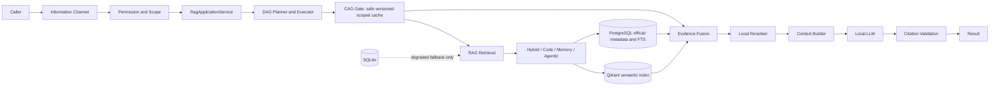

# GPTBridge RAG 架構圖

全專案採用 DAG、CAG、RAG 混合架構：DAG 是查詢、索引、修復工作流的編排面，不取代 Application Service；CAG 是安全、有版本、有範圍且非權威的加速與上下文重用面，不取代 RAG；RAG 是 canonical knowledge retrieval 面，保留 Hybrid、Code、Memory、Agentic 四子架構。Qdrant 與 PostgreSQL canonical 邊界不變，SQLite 只准 degraded fallback。同步基線：A528、A537、A538。
