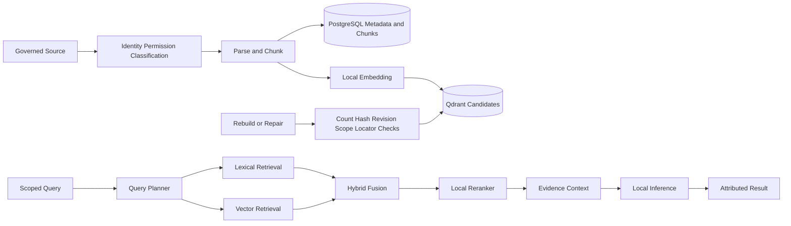

# GPTBridge RAG 架構圖

```mermaid
flowchart LR
  SRC[Governed Source] --> AUTH[Identity Permission Classification]
  AUTH --> CHUNK[Parse and Chunk]
  CHUNK --> PG[(PostgreSQL Metadata and Chunks)]
  CHUNK --> EMBED[Local Embedding]
  EMBED --> QD[(Qdrant Candidates)]
  QUERY[Scoped Query] --> PLAN[Query Planner]
  PLAN --> LEX[Lexical Retrieval]
  PLAN --> VEC[Vector Retrieval]
  LEX --> FUSE[Hybrid Fusion]
  VEC --> FUSE
  FUSE --> RERANK[Local Reranker]
  RERANK --> EVIDENCE[Evidence Context]
  EVIDENCE --> MODEL[Local Inference]
  MODEL --> RESULT[Attributed Result]
  REBUILD[Rebuild or Repair] --> CERT[Count Hash Revision Scope Locator Checks]
  CERT --> QD
```

同步基線：A528、A537、A538；啟動 10 秒、強制測試套件 20 秒、獨立審計流程 30 秒，逾時 fail-closed。
