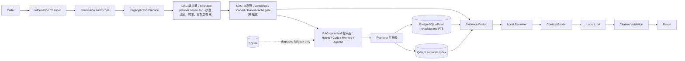

# GPTBridge RAG／DAG／CAG 統一架構圖

RAG、DAG、CAG 是同一套混合架構的三個面，不是三套系統：DAG 是查詢、索引、修復工作流的編排面（有界計畫與執行：節點數、深度、時限、重試上限皆有界），不取代 Application Service；CAG 是安全、有版本、有範圍且非權威的加速與上下文重用面（L1–L3 自動，L4 需核准；寫入前通過版本、範圍、租約與證據檢核），不取代 RAG；RAG 是 canonical knowledge retrieval 面，保留 Hybrid、Code、Memory、Agentic 四子架構。三者共用同一權限、範圍、證據與稽核語意，正式路徑固定為 Caller → Information Channel → Permission / Scope → RagApplicationService → DAG Planner / Executor → CAG Gate → RAG Retrieval → Evidence Fusion → Reranker → Context Builder → Local LLM → Citation Validation → Result；任一檢核失敗即 fail-closed 且回報明確降級狀態，不得以快取冒充檢索結果。Qdrant 與 PostgreSQL canonical 邊界不變，SQLite 只准 degraded fallback。同步基線：A549、A528、A537、A538。
