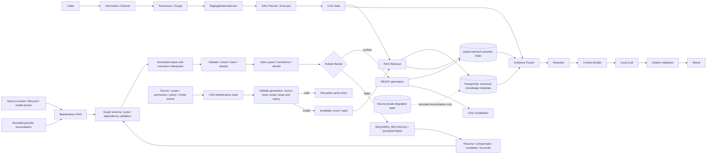

# GPTBridge DAG／CAG／RAG 自動維護架構

本圖是 A52、A549、A597 的非權威投影。DAG 是編排面、CAG 是加速與上下文重用面、RAG 是正式檢索面；三者不得互相取代，且 DAG 不取代 `RagApplicationService`。

- 單一控制面：既有 `RagDagPlanner`／`RagDagExecutor` 是查詢、索引、重建、修復與驗證的唯一 DAG 編排器；禁止第二套 RAG scheduler 或索引協調器。
- DAG 維護：圖定義採不可變世代；發布前驗證節點型別、邊、無環、輸入輸出契約、依賴、權限、deadline、取消、資源與補償策略，全部通過才原子切換 current generation。
- DAG 恢復：執行以 lease、idempotency identity 與 checkpoint 保護；程序中止或 lease 到期後只能從已驗證 checkpoint 恢復，未知結果必須查詢與驗證後再決定重試、補償、失效或 reconcile。
- DAG 清理：完成、取消、失敗與過期 execution 的 lease、暫存與 checkpoint 依保留政策清理；仍被引用、處於 in-flight 或無法判定的資料不得刪除。
- 事件優先：來源 revision、生命週期、權限、契約、embedding、reranker、chunking、collection 或刪除事件觸發增量維護；低頻全量掃描只作對帳補償。
- 權威邊界：PostgreSQL 保存正式結構化知識、來源 revision、locator、權限與發布狀態；Qdrant 只保存範圍化衍生向量索引；CAG 只保存有版本、有範圍、有期限的衍生快取；SQLite 只准私有有界降級。
- 自動維護：執行來源驗證、分塊、內容雜湊、增量索引、tombstone、孤兒掃描、PostgreSQL／Qdrant 對帳、CAG 失效、collection 最佳化、快照驗證與必要重建。
- CAG 維護：每次命中前驗證 caller scope、permission generation、source revision roots、contract、模型與策略版本、lease、TTL 及內容摘要；任何不一致立即視為 miss、失效並回到正式 RAG 檢索。
- CAG 容量：依 scope 與 workload 設定 entry／bytes／age 硬上限，只能淘汰衍生快取；採按需填充，禁止未經需求預熱、無期限保存或以命中率凌駕正確性。
- CAG 撤銷：來源變更、權限撤銷、身分世代提升、模型／prompt／chunk／reranker／citation policy 變更及資料刪除必須傳播失效；失效事件與清除結果均須可追蹤。
- 原子發布：新世代依序通過 `PREPARING → INDEXING → VERIFYING → READY`；只有 `READY` 可供正式檢索，失敗世代隔離且保留上一個已驗證世代。
- 刪除：來源刪除依 tombstone、保留期、引用檢查、PostgreSQL 狀態更新、Qdrant point 清除與 CAG 失效順序執行；未知引用不得清除。
- 資源：互動查詢優先於背景索引；每個 DAG 宣告 deadline、並行度、CPU／記憶體／GPU／批次上限、取消與重試界線，禁止無界 agentic loop。
- 安全：每個節點繼承 caller、module、scope、permission、source revision 與 correlation identity；禁止 raw SQL、raw Qdrant、shell、動態匯入或跨範圍快取。
- 證據：每次維護保存來源集合、世代、內容與索引根、count parity、孤兒數、失效數、延遲、資源、錯誤分類與發布結果。
