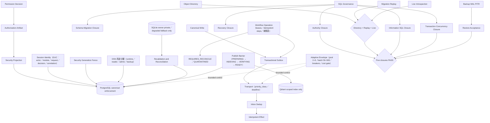

# GPTBridge SQL 架構圖

PostgreSQL 是唯一 canonical 中央正式狀態；Qdrant 僅存語意候選（`require_scope`，module_id 必填）。治理法典亦先建立完整 PostgreSQL schema、搬移資料並完成 schema／row／content／lineage／permission parity，原子切換 `governance-codex://official` 後，才刪除法典 SQLite 及其副本。跨引擎工作以 Saga 執行（PostgreSQL 為操作權威，migration `113_workflow_operation.sql`）：步驟冪等、可續跑、租約心跳；逾時以 lookup＋verify 判定，耗盡或未知即 `REQUIRES_RECONCILE`／`QUARANTINED`；發布屏障只有 `READY` 可讀，跨引擎結論退化為 `DEGRADED`／`CONFLICT`，不得假裝成功。身分、連線、憑證、工作階段、權限、輪替與撤銷由 Access Control Plane 承接（migration `087_security_identity_control.sql`）：工作階段識別以交易區域 GUC 綁定，憑證只存驗證摘要，敏感寫入遇過期 `gptbridge.security_generation` 一律 fail-closed。Transport 依 `priority_class`（critical／interactive／background／maintenance）與 FIFO 取用並跳過逾 `deadline_at` 請求（migration `058_transport_priority_queue.sql`）。Adaptive SQL Layer 只在 `AdaptiveEnvelope` 內調整（pool 2–8、batch 50–500、reconcile 1–2），無訊號時一律 ALLOW。業務規則由 owning module 以版本化契約自行管理，不進入治理法典，也不得成為平行規範權威。
