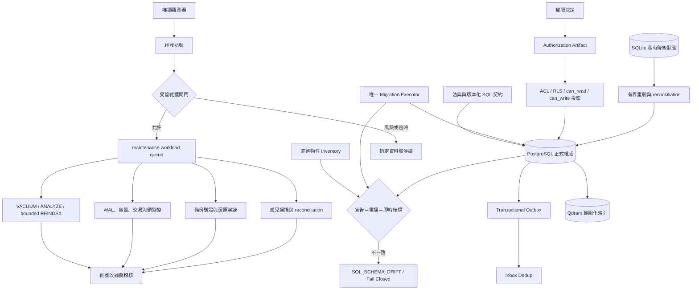

# GPTBridge SQL 自動維護架構

本圖是 A499、A501、A519、A520 的非權威投影。PostgreSQL 維持中央結構化資料、共享傳輸持久層與中央稽核的唯一 SQL 權威；SQLite 不得升格。

- 單一控制面：SQL 自動維護由既有自動化核心排程、既有資料庫維護執行器執行；禁止新增第二套 scheduler、migration executor 或權限來源。
- 先觀測後執行：持續收集交易年齡、idle-in-transaction、鎖等待、dead tuple、vacuum lag、table/index bloat、WAL、磁碟、連線池、transport backlog、備份與 reconciliation 狀態。
- 有界動作：只允許登錄過、可重入、有 deadline、資源上限、工作負載類別及 rollback/停止語意的維護動作；互動流量優先，維護工作可暫停或延後。
- 自動維護：依門檻執行 `VACUUM`、`ANALYZE`、有界 `REINDEX`、分區與保留維護、連線回收、長交易處置、孤兒掃描、reconciliation、備份驗證及還原演練。
- 結構邊界：自動維護不得產生或執行未登錄 DDL，不得自動套用 migration，也不得把即時資料庫漂移寫回法典或 migration chain。
- 刪除邊界：清除必須走 tombstone、保留期、引用檢查、purge 與跨儲存同步；未解析引用或權威衝突一律保留。
- 安全邊界：資料庫安全投影只能執行權限決定；維護程序不得擴權、停用 RLS、繞過 generation fence 或修改 append-only 稽核。
- 故障處理：逾時、證據缺失、漂移、鎖風險或無法判定時停止該動作，必要時將受影響資料域切為唯讀；不得全域偷偷切換 SQLite。
- 證據：每次動作保存原因、門檻、執行者、物件、前後狀態、耗時、資源、結果及 correlation identity。
