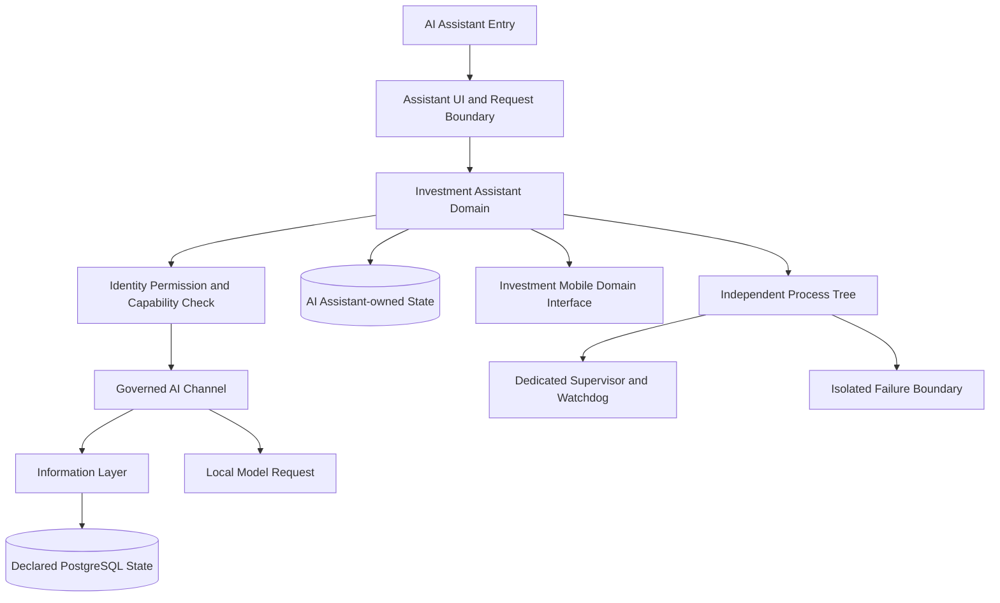

# AI Assistant 完整架構圖

```mermaid
flowchart TB
  ENTRY[AI Assistant Entry] --> UI[Assistant UI and Request Boundary]
  UI --> APP[Investment Assistant Domain]
  APP --> AUTH[Identity Permission and Capability Check]
  AUTH --> CHANNEL[Governed AI Channel]
  CHANNEL --> INFO[Information Layer]
  APP --> STATE[(AI Assistant-owned State)]
  APP --> MOBILE[Investment Mobile Domain Interface]
  CHANNEL --> LOCAL[Local Model Request]
  INFO --> PG[(Declared PostgreSQL State)]
  PROC[Independent Process Tree] --> SUP[Dedicated Supervisor and Watchdog]
  APP --> PROC
  PROC --> FAULT[Isolated Failure Boundary]
```

AI Assistant 擁有投資助理領域狀態；行動端、模型與資料庫均不得取代其領域決策權。
