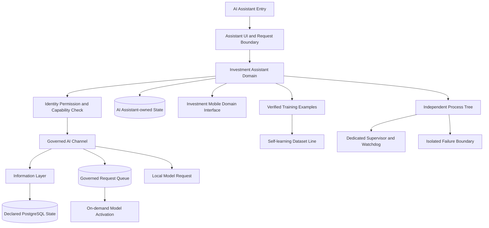

# AI Assistant 完整架構圖

AI Assistant 擁有投資助理領域狀態；行動端、模型與資料庫均不得取代其領域決策權。

同步基線：A528、A537、A538、A540；獨立工具啟動與關閉各自上限 5 秒，逾時 fail-closed。

所有 AI 請求一律經受治理 AI 通道（佇列、權限、範圍、稽核）；模型未啟動時由啟動代理依受治理路徑背景啟用，逾時或拒絕一律 fail-closed 並回報明確狀態，不得繞道或私自開程序。經使用者驗證的對話與答案可作為 `language_training_example`（active 且品質合格）進入自我學習資料產線；AI 輸出本身不具權威，未經驗證不得成為正式資料或決策依據。

本工具規範只存於本工具邊界；中央僅保存定位與權限索引，不複製規範內容。
