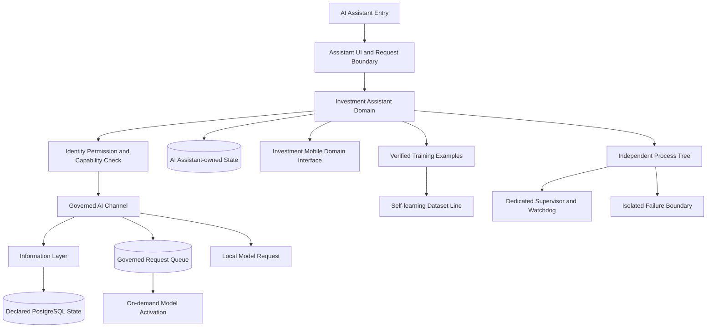

# AI Assistant 完整架構圖

```mermaid
flowchart TB
  ENTRY[AI Assistant Entry] --> UI[Assistant UI and Request Boundary]
  UI --> APP[Investment Assistant Domain]
  APP --> AUTH[Identity Permission and Capability Check]
  AUTH --> CHANNEL[Governed AI Channel]
  CHANNEL --> INFO[Information Layer]
  CHANNEL --> QUEUE[(Governed Request Queue)]
  QUEUE --> ACTIVATE[On-demand Model Activation]
  APP --> STATE[(AI Assistant-owned State)]
  APP --> MOBILE[Investment Mobile Domain Interface]
  CHANNEL --> LOCAL[Local Model Request]
  INFO --> PG[(Declared PostgreSQL State)]
  APP --> EXAMPLES[Verified Training Examples]
  EXAMPLES --> SELFTRAIN[Self-learning Dataset Line]
  PROC[Independent Process Tree] --> SUP[Dedicated Supervisor and Watchdog]
  APP --> PROC
  PROC --> FAULT[Isolated Failure Boundary]
```

AI Assistant 擁有投資助理領域狀態；行動端、模型與資料庫均不得取代其領域決策權。

同步基線：B118、B124、C102、B125；獨立工具啟動與關閉各自上限 5 秒，逾時 fail-closed。

所有 AI 請求一律經受治理 AI 通道（佇列、權限、範圍、稽核）；模型未啟動時由啟動代理依受治理路徑背景啟用，逾時或拒絕一律 fail-closed 並回報明確狀態，不得繞道或私自開程序。經使用者驗證的對話與答案可作為 `language_training_example`（active 且品質合格）進入自我學習資料產線；AI 輸出本身不具權威，未經驗證不得成為正式資料或決策依據。

本工具規範只存於本工具邊界；中央僅保存定位與權限索引，不複製規範內容。

## 法典檔案保護

檔案唯讀只作為最小必要的完整性保護，不代表權威。保留目前五份機器產生的中文法典鏡像、已註冊治理套件入口及已註冊共享層執法來源為唯讀；架構圖及其他非鏡像工作區檔案均採受管可寫，由 PostgreSQL 權限、交易、版本、current binding、同步證據與稽核維持完整性。發布程序可暫時解除鏡像唯讀，但完成驗證後必須恢復。
