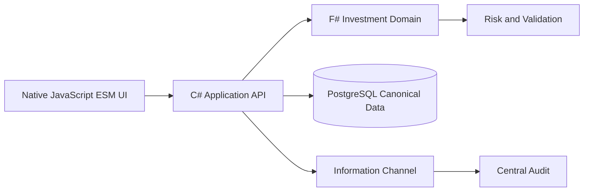

# AI Assistant／投資管家完整架構圖

```mermaid
flowchart LR
  UI[Native JavaScript ESM UI] --> API[C# Application API]
  API --> DOMAIN[F# Investment Domain]
  DOMAIN --> RISK[Risk and Validation]
  API --> PG[(PostgreSQL Canonical Data)]
  API --> INFO[Information Channel]
  INFO --> AUDIT[Central Audit]
```

`ai-assistant` 是獨立工具，擁有自己的 UI、程序樹、身分與失敗邊界。C# 負責應用與工作流，F# 負責投資業務規則、資料驗證及狀態轉移，PostgreSQL 是唯一正式資料儲存。模型輸出只能作為分析候選，不能直接成為交易或權限決定。視窗關閉須在 5 秒內停止自身後端，不影響其他工具。

禁止：直接存取其他工具資料、建立平行 SQL 儲存、模型直接下單、繞過 Information Channel、無界背景工作及隱藏常駐 Python。
