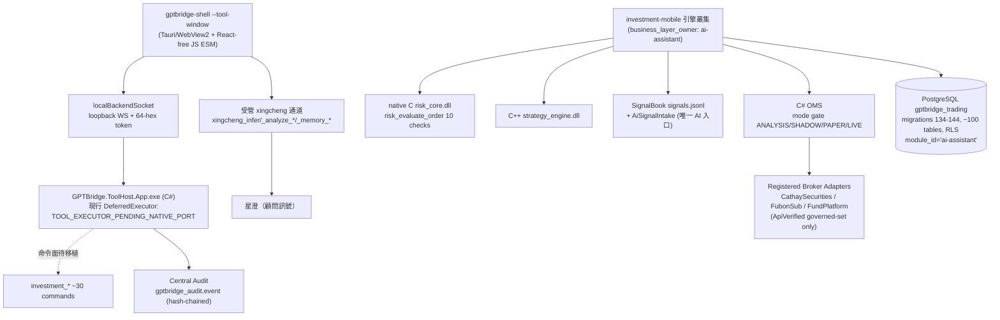

# AI Assistant／投資管家完整架構圖

```mermaid
flowchart TB
  UI["gptbridge-shell --tool-window<br/>(Tauri/WebView2 + React-free JS ESM)"] --> SOCK["localBackendSocket<br/>loopback WS + 64-hex token"]
  SOCK --> HOST["GPTBridge.ToolHost.App.exe (C#)<br/>現行 DeferredExecutor:<br/>TOOL_EXECUTOR_PENDING_NATIVE_PORT"]
  HOST -.命令面待移植.-> INVCMD["investment_* ~30 commands"]

  CLUSTER["investment-mobile 引擎叢集<br/>(business_layer_owner: ai-assistant)"] --> OMS["C# OMS<br/>mode gate ANALYSIS/SHADOW/PAPER/LIVE"]
  CLUSTER --> RISK["native C risk_core.dll<br/>risk_evaluate_order 10 checks"]
  CLUSTER --> STRAT["C++ strategy_engine.dll"]
  CLUSTER --> SIG["SignalBook signals.jsonl<br/>+ AiSignalIntake (唯一 AI 入口)"]

  XCHAN["受管 xingcheng 通道<br/>xingcheng_infer/_analyze_*/_memory_*"] --> XC[星澄（顧問訊號）]
  UI --> XCHAN

  OMS --> BROKER["Registered Broker Adapters<br/>CathaySecurities / FubonSub / FundPlatform<br/>(ApiVerified governed-set only)"]
  CLUSTER --> PG[("PostgreSQL gptbridge_trading<br/>migrations 134-144, ~100 tables, RLS<br/>module_id='ai-assistant'")]
  HOST --> AUDIT["Central Audit<br/>gptbridge_audit.event (hash-chained)"]
```

`ai-assistant` 是獨立工具（投資管家），擁有自己的 UI、程序樹與失敗邊界。**現況**：商務 executor 待原生移植 — `runtime.native_entry` 指向通用 `GPTBridge.ToolHost.App.exe`，executor 選擇表中無 `ai-assistant`，落入 `DeferredExecutor`；tool root 內只有 manifest + React-free ESM renderer（`src/ui/workspace/*`，14 個 lazy pages），UI manifest 的 `react+shell.jsx` 欄位為過時描述。引擎叢集已移植在 `investment-mobile`（C# 服務層 + C `risk_core` + C++ `strategy_engine`），該工具宣告 `business_layer_owner: ai-assistant` 與 relay 鏈 `investment-mobile → xingcheng → ai-assistant`。

模型輸出只作分析候選與顧問訊號：`AiSignalIntake` 是唯一 AI 入口，提案必經同一套風控+模式閘門；`AutoTradingEngine` 在 LIVE 下 `LIVE_PHASE_LOCKED`，halt 恢復僅 `governance/main-system`；broker adapter 無 governed `ApiVerified` → `BROKER_API_UNVERIFIED` fail-closed。星澄通道為密封路由（`tool_routes.json` AI_ROUTE_COMMANDS），外部 AI 只能經 `ai-collaboration` 通道，不回寫投資 DB。

PostgreSQL `gptbridge_trading` 是唯一正式資料權威（migrations 134–144、約百表、全表 ENABLE+FORCE RLS、`audit_event` append-only）；已移植的原生引擎目前仍以 `runtime/state/*.jsonl` 日誌為執行期鏡像，正式寫入走受管 outbox（寫入端移植進行中）。資訊通道為 governed shared-layer（`ChannelHost`/`A263Channel`/transport proxy）。

禁止：直接存取其他工具資料、建立平行 SQL 權威、模型直接下單、繞過 Information Channel、無界背景工作、Python。視窗關閉須在 5 秒內停止自身後端（B125；stop 路徑為 `/shutdown` + 3s drain + kill）。
