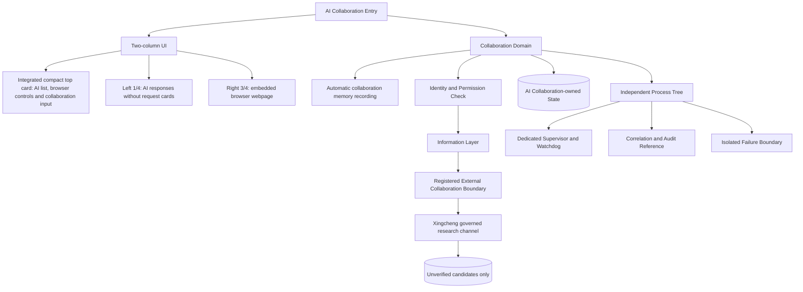

# AI Collaboration 完整架構圖

所有外部協作必須經已登錄通道；外部回應不會自動取得專案權威。

同步基線：A528、A537、A538、A540、A544、A545；最上方單一整合卡片承載網址工具列、內建 AI 名單與協作輸入，AI 操作直接控制右側內建瀏覽器。左側 1/4 只顯示各 AI 回覆且不建立任何需求卡片，右側 3/4 為瀏覽器網頁區。獨立 AI 名單、共享記憶與診斷狀態卡全部取消；協作內容與回覆由工具自動記錄。

星澄可經此受治理網路通道搜尋官方文件、正式問題追蹤與可信技術來源以尋找修復方案；網路結果一律為未驗證候選，必須先驗證來源、版本、適用條件、最小修改、回復方法與本機測試後才可交付修復流程。搜尋通道不得直接執行、寫檔、安裝套件或寫入正式資料；通道拒絕或逾時一律 fail-closed。
