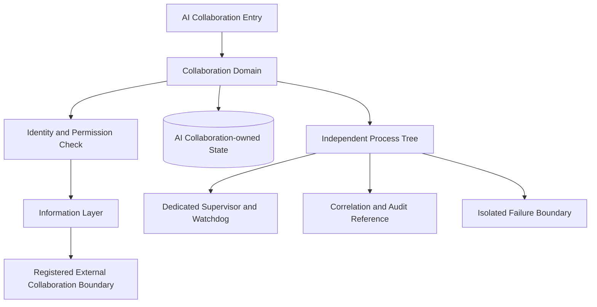

# AI Collaboration 完整架構圖

```mermaid
flowchart TB
  ENTRY[AI Collaboration Entry] --> APP[Collaboration Domain]
  APP --> AUTH[Identity and Permission Check]
  AUTH --> INFO[Information Layer]
  INFO --> EXT[Registered External Collaboration Boundary]
  APP --> STATE[(AI Collaboration-owned State)]
  APP --> PROC[Independent Process Tree]
  PROC --> SUP[Dedicated Supervisor and Watchdog]
  PROC --> AUDIT[Correlation and Audit Reference]
  PROC --> FAULT[Isolated Failure Boundary]
```

所有外部協作必須經已登錄通道；外部回應不會自動取得專案權威。
