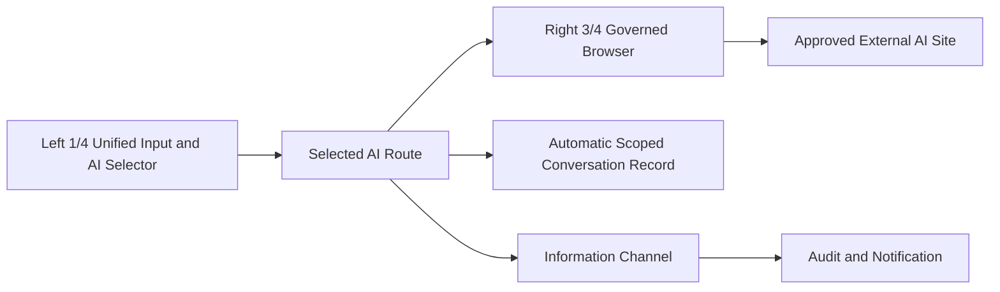

# AI Collaboration／外部協作完整架構圖

```mermaid
flowchart LR
  UI[Left 1/4 Unified Input and AI Selector] --> ROUTE[Selected AI Route]
  ROUTE --> BROWSER[Right 3/4 Governed Browser]
  BROWSER --> WEB[Approved External AI Site]
  ROUTE --> MEMORY[Automatic Scoped Conversation Record]
  ROUTE --> INFO[Information Channel]
  INFO --> AUDIT[Audit and Notification]
```

`ai-collaboration` 是獨立工具。左側整合輸入與 AI 選擇，右側為受治理瀏覽器；AI 清單直接控制內建瀏覽器路由。需求卡片、共享記憶卡片、整體狀態卡片與重複瀏覽器狀態提示不得存在。對話以 scope、correlation、source 與 revision 自動記錄。

外部網路只能經已登錄瀏覽器與目的地政策。搜尋或外部回答都是未驗證候選，不得直接寫入正式資料、執行程式、安裝套件或取得權威。視窗關閉須在 5 秒內停止自身後端。
