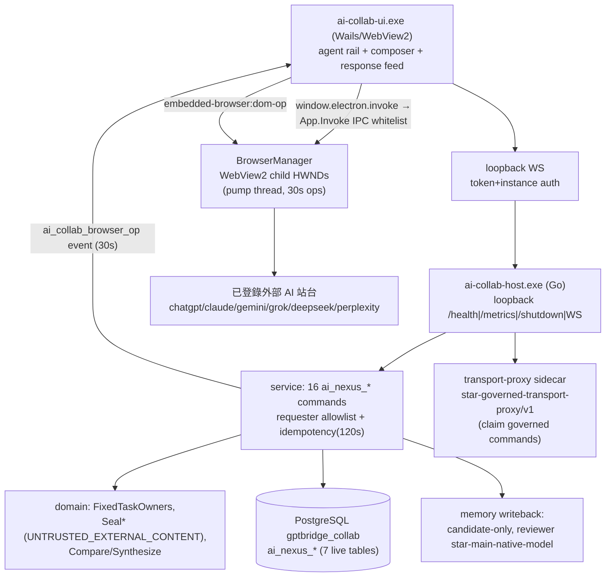

# AI Collaboration／外部協作完整架構圖

```mermaid
flowchart TB
  UI["ai-collab-ui.exe (Wails/WebView2)<br/>agent rail + composer + response feed"] -->|"window.electron.invoke →<br/>App.Invoke IPC whitelist"| WMGR["BrowserManager<br/>WebView2 child HWNDs<br/>(pump thread, 30s ops)"]
  SOCK["loopback WS<br/>token+instance auth"] --> HOST["ai-collab-host.exe (Go)<br/>loopback /health|/metrics|/shutdown|WS"]
  UI --> SOCK
  HOST --> SVC["service: 16 ai_nexus_* commands<br/>requester allowlist + idempotency(120s)"]
  SVC -->|"ai_collab_browser_op event (30s)"| UI
  UI -->|"embedded-browser:dom-op"| WMGR
  SVC --> DOM["domain: FixedTaskOwners,<br/>Seal* (UNTRUSTED_EXTERNAL_CONTENT),<br/>Compare/Synthesize"]
  SVC --> REPO[("PostgreSQL gptbridge_collab<br/>ai_nexus_* (7 live tables)")]
  HOST --> PROXY["transport-proxy sidecar<br/>star-governed-transport-proxy/v1<br/>(claim governed commands)"]
  SVC --> MEM["memory writeback:<br/>candidate-only, reviewer star-main-native-model"]
  WMGR --> WEB["已登錄外部 AI 站台<br/>chatgpt/claude/gemini/grok/deepseek/perplexity"]
```

`ai-collaboration` 是獨立工具（外部協作）。後端 `ai-collab-host.exe` 為 Go（受管 env 契約、64-hex session token + 24-hex instance 的 loopback WS）；視窗 `ai-collab-ui.exe` 為 Wails + WebView2，renderer 為 React-free native ESM。版面：上方橫向 agent 選擇 rail，下方約 42/58 的 composer+feed／瀏覽器區（非佔位圖的 1/4-3/4）。

**瀏覽器自動化**：外部 AI 一律走 WebView2 會話（user-data 於 `toolRoot/runtime/webview2/providers`）；後端不自發外部 HTTP，而是把 `ai_collab_browser_op` 事件經 UI socket 轉給 `BrowserManager.DOMOp`（30 秒綁定、`EMBEDDED_BROWSER_BRIDGE_*` fail-closed）。`browserPrimaryProviders` 六家白名單可自動化；自訂 agent URL 只收 https、拒絕憑證/內網/localhost；自由網址列可導覽任意 https（手動瀏覽不受 AI 清單限制）。

**命令面**：16 個 `ai_nexus_*`（agents get_state/open/authorize/add、send_message、collab_start/cancel/manual_result/resume、add_memory、create_task、export_report、diagnostics 等）。requester 閘門：`xingcheng` 專用 fixed-owner 管線（`FixedTaskOwners`，ChatGPT 最終協調），`ai-assistant` 一律拒絕；manual_result 閘門拒絕 xingcheng。collab 模式 `single|compare|sequential_review`；並行 AI ≤6、回應等待 ≤120s、browser-wait 3×20s、內容封裝 64000 字元。

**資料面**：schema `gptbridge_collab`（pgx，≤4 連線）——`ai_nexus_agents/group_messages/agent_responses/tasks/memory_items/collab_tasks/collab_results` 七個使用中表；結果列以 `UNIQUE(task_id,provider_id,attempt_id)` 封裝、`content_class=UNTRUSTED_EXTERNAL_CONTENT`、`suggested_actions` 僅為偵測標記不執行。記憶回寫採 `star-mediated-candidate-writeback`（candidate 狀態、reviewer=`star-main-native-model`、外部不得直寫正式資料）。匯出診斷落 `runtime/exports/`。

**邊界**：外部 AI 為證據候選——不得直寫正式資料、執行程式、安裝套件或取得權威；`queue_when_offline:false`；隔離政策 loopback-only/512MB/40%CPU；fail-closed 啟動（env/DSN 失敗 exit 13）。視窗關閉須在 5 秒內停止自身後端（B125；`OnShutdown`→全部瀏覽器會話關閉 + `/shutdown`）。
