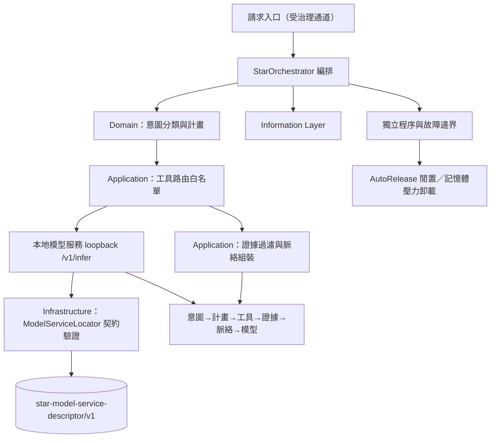

# 業務邏輯編排（C#）完整架構圖

`business-logic-csharp` 是 main-system 內部編排服務（`internal-service`；A534 的七個獨立工具集合不變，本元件不是第八個獨立工具）：以 C# 承接意圖→計畫→工具→證據→脈絡→模型的編排。Domain 層固定 16 種 `StarIntent` 與有界意圖快取（128 筆／5 分鐘）；工具路由白名單固定為 `rag_query`／`web_search`／`market_data`／`calculation`／`coding_expert`／`reasoning`／`context_builder`，單工具逾時 5 秒且失敗隔離；Grounding 以 SHA-256 過濾證據並限制最多 6 筆。

模型推論只經 loopback 的 `star-model-service-descriptor/v1` 契約（`xingcheng/runtime/ipc/model-service.json`）：`lifecycle_owner` 必須為 `local-model/channel_runtime.py`、`consumer_policy` 必須為 `csharp-orchestrator-client-only`；端點為 `POST /v1/infer`、`GET /v1/status`、`POST /v1/release`，標頭 `X-GPTBridge-Session-Token`，逾時預設 15 秒，非 loopback 端點一律 fail-closed（`MODEL_ENDPOINT_MUST_BE_LOOPBACK`）。隔離預算 512 MB、loopback-only、tool-scoped、重啟上限 3 次；`AutoRelease` 閒置 5 分鐘、每分鐘檢查、記憶體壓力 >80% 時釋放。

同步基線：A528、A537、A538；逾時與未知指令一律 fail-closed。
