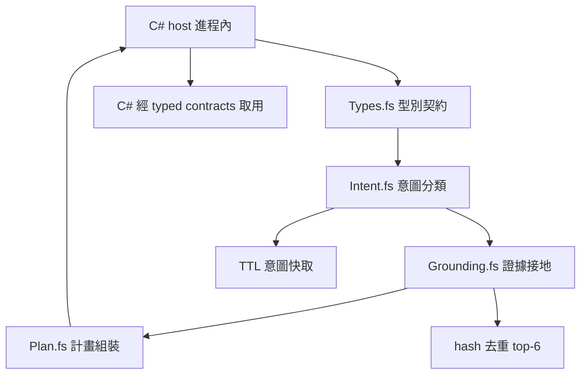

# 業務領域邏輯（F#）完整架構圖

`business-logic-fsharp` 是內部服務（`internal-service`）：`StarDomain` 單一用途 F# 函式庫，承載 star／星澄業務面的領域決策（法典 A211／A264：F# 擁有核心業務邏輯＋資料驗證＋轉換＋業務狀態轉移）。`Types.fs` 定義 `StarIntent`、`IntentResult`／`Evidence`／`GroundingResult`／`ExecutionPlan` 與分類／計畫／接地契約；`Intent.fs` 為純規則表分類（含 TTL 快取包裝）；`Grounding.fs` 做過濾→穩定相關排序→hash 去重→top-6→脈絡合併；`Plan.fs` 做意圖→工具映射與生成提示組裝。

C#（`business-logic-csharp`）只經型別化契約取用（FSHARP-FLOW：typed analysis contracts only；A264／A341）；所有規則皆為純函數，空／非法輸入 fail-closed，永不拋錯。測試編排唯一由 C# 側 `StarBusinessLogic.Tests` 持有（A615）。隔離註冊為 `network_policy=offline`、`filesystem_policy=none`：純領域函式庫，無網路與檔案存取。

同步基線：A537、A538。
