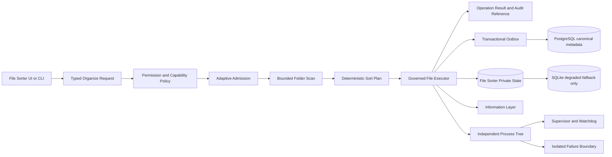

# File Sorter 完整架構圖

掃描、規劃與寫入必須分離；未經核准的能力不得執行檔案變更。

同步基線：A528、A537、A538、A540；獨立工具啟動與關閉各自上限 5 秒，逾時 fail-closed。

File Sorter 為單一職責模組（§10.31）：排序與檔案搬移以外的工作不得內建。索引與中繼資料一律經交易 outbox 寫入 PostgreSQL canonical；SQLite 僅存 owner 私有狀態與有界降級資料，永遠不得宣告中央完成。Transport 提交聲明 `priority_class` 與截止時間，逾時或被拒一律 fail-closed 並回報明確失敗與可驗證狀態，不得部分成功冒充完成。
