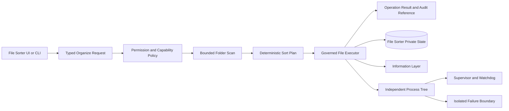

# File Sorter 完整架構圖

```mermaid
flowchart LR
  ENTRY[File Sorter UI or CLI] --> REQUEST[Typed Organize Request]
  REQUEST --> AUTH[Permission and Capability Policy]
  AUTH --> SCAN[Bounded Folder Scan]
  SCAN --> PLAN[Deterministic Sort Plan]
  PLAN --> EXEC[Governed File Executor]
  EXEC --> RECEIPT[Operation Result and Audit Reference]
  EXEC --> STATE[(File Sorter Private State)]
  EXEC --> INFO[Information Layer]
  PROC[Independent Process Tree] --> SUP[Supervisor and Watchdog]
  EXEC --> PROC
  PROC --> FAULT[Isolated Failure Boundary]
```

掃描、規劃與寫入必須分離；未經核准的能力不得執行檔案變更。

同步基線：A528、A537、A538、A540；獨立工具啟動與關閉各自上限 5 秒，逾時 fail-closed。
