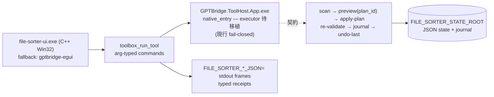

# File Sorter／自動化檔案管理完整架構圖

```mermaid
flowchart LR
  UI["file-sorter-ui.exe (C++ Win32)<br/>fallback: gptbridge-egui"] --> REQ["toolbox_run_tool<br/>arg-typed commands"]
  REQ --> HOST["GPTBridge.ToolHost.App.exe<br/>native_entry — executor 待移植<br/>(現行 fail-closed)"]
  HOST -.契約.-> PIPE["scan → preview(plan_id) → apply-plan<br/>re-validate → journal → undo-last"]
  PIPE --> STATE[("FILE_SORTER_STATE_ROOT<br/>JSON state + journal")]
  REQ --> RECEIPT["FILE_SORTER_*_JSON= stdout frames<br/>typed receipts"]
```

`file-sorter` 是獨立工具，負責檔案分類、歸檔與受治理搬移。**現況**：Python 實作已退役（B167/B38 forbidden-source），native executor 待移植 — 受管啟動目前 fail-closed。存活實作：C++ Win32 UI（`native/file_sorter_ui/`）+ Rust egui fallback；後端僅有命令契約與行為規範（README V2 contract）。

命令面（arg 型別）：`--select-scan-target`、`--profiles-json`、`--list-folders`、`--preview-json`（產 `plan_id`）、`--apply-plan <id>`（重驗證：預覽後來源變更→拒絕）、`--history-json`、`--undo-last`（回復最後完成交易，路徑被佔/檔案變更即停）、`--set-profile-enabled`、`--set-duplicate-trash-enabled`、keyword CRUD、`--cleanup-scan --json`（image/video/similar 分析旗標）。

行為契約：一層子資料夾名即關鍵字；規則為 target-scoped（無絕對/多層路徑）；手動整理一律預覽先行；自動排序預設關閉且需檔案跨兩次觀察穩定；journal + no-overwrite publish + SHA-256 驗證 + 可續傳；不可分類檔案留置原地；命名衝突加序號；目的資料夾須預先存在。

正式結構化資料權威僅為 PostgreSQL。**`%LOCALAPPDATA%\GPTBridge\file-sorter`**（`FILE_SORTER_STATE_ROOT` 可覆寫）的 JSON + journal（`FILE_SORTER_JOURNAL_RETENTION_DAYS`）只屬 bounded owner-private noncanonical operational state：限本工具執行進度、回復與診斷，非共享或正式業務真相、不得成為 PostgreSQL 的替代權威或回退。本工具尚無 PostgreSQL schema，不得宣稱正式資料面已完成；治理紀錄仍在中央稽核。隔離：256MB/30%CPU/offline/tool-scoped；破壞性操作一律需明確目標、計畫與回復證據。視窗關閉須在 5 秒內停止自身後端。
