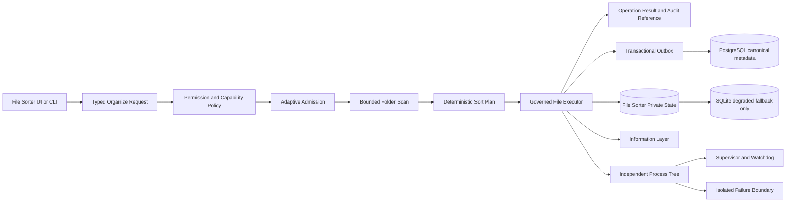

# File Sorter 完整架構圖

```mermaid
flowchart LR
  ENTRY[File Sorter UI or CLI] --> REQUEST[Typed Organize Request]
  REQUEST --> AUTH[Permission and Capability Policy]
  AUTH --> ADMIT[Adaptive Admission]
  ADMIT --> SCAN[Bounded Folder Scan]
  SCAN --> PLAN[Deterministic Sort Plan]
  PLAN --> EXEC[Governed File Executor]
  EXEC --> RECEIPT[Operation Result and Audit Reference]
  EXEC --> OUTBOX[Transactional Outbox]
  OUTBOX --> PG[(PostgreSQL canonical metadata)]
  EXEC --> STATE[(File Sorter Private State)]
  STATE --> SQLITE[(SQLite degraded fallback only)]
  EXEC --> INFO[Information Layer]
  PROC[Independent Process Tree] --> SUP[Supervisor and Watchdog]
  EXEC --> PROC
  PROC --> FAULT[Isolated Failure Boundary]
```

掃描、規劃與寫入必須分離；未經核准的能力不得執行檔案變更。

同步基線：B118、B124、C102、B125；獨立工具啟動與關閉各自上限 5 秒，逾時 fail-closed。

File Sorter 為單一職責模組（§10.28）：排序與檔案搬移以外的工作不得內建。索引與中繼資料一律經交易 outbox 寫入 PostgreSQL canonical；SQLite 僅存 owner 私有狀態與有界降級資料，永遠不得宣告中央完成。Transport 提交聲明 `priority_class` 與截止時間，逾時或被拒一律 fail-closed 並回報明確失敗與可驗證狀態，不得部分成功冒充完成。

本工具規範只存於本工具邊界；中央僅保存定位與權限索引，不複製規範內容。

## 法典檔案保護

檔案唯讀只作為最小必要的完整性保護，不代表權威。保留目前五份機器產生的中文法典鏡像、已註冊治理套件入口及已註冊共享層執法來源為唯讀；架構圖及其他非鏡像工作區檔案均採受管可寫，由 PostgreSQL 權限、交易、版本、current binding、同步證據與稽核維持完整性。發布程序可暫時解除鏡像唯讀，但完成驗證後必須恢復。
