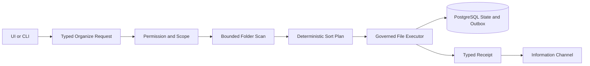

# File Sorter／自動化檔案管理完整架構圖

```mermaid
flowchart LR
  UI[UI or CLI] --> REQUEST[Typed Organize Request]
  REQUEST --> AUTH[Permission and Scope]
  AUTH --> SCAN[Bounded Folder Scan]
  SCAN --> PLAN[Deterministic Sort Plan]
  PLAN --> EXEC[Governed File Executor]
  EXEC --> PG[(PostgreSQL State and Outbox)]
  EXEC --> RECEIPT[Typed Receipt]
  RECEIPT --> INFO[Information Channel]
```

`file-sorter` 是獨立工具，只負責檔案掃描、分類計畫與受治理搬移。掃描、佇列、批次、重試、程序及記憶體均須有界；每個破壞性動作必須具有明確目標、權限、回復策略與收據。PostgreSQL 是唯一正式狀態與 outbox 儲存，不得建立第二套 SQL 儲存。逾時、部分完成或未知結果不得宣告成功。視窗關閉須在 5 秒內停止自身後端。
