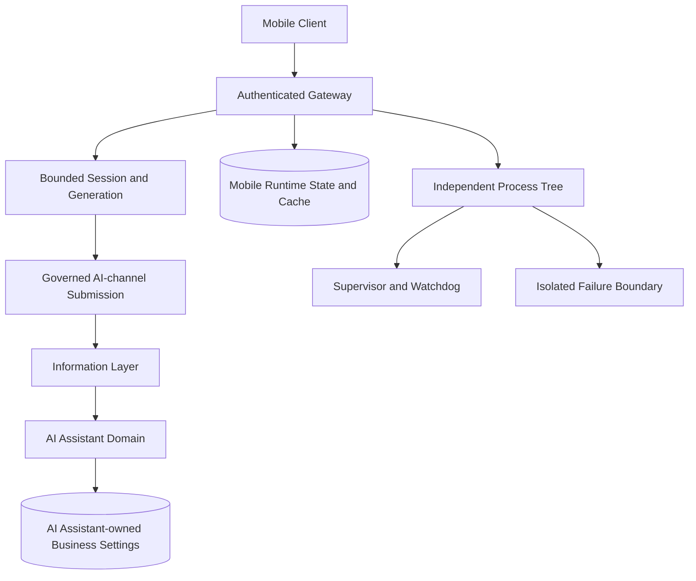

# Investment Mobile 完整架構圖

```mermaid
flowchart TB
  CLIENT[Mobile Client] --> GATE[Authenticated Gateway]
  GATE --> SESSION[Bounded Session and Generation]
  SESSION --> CHANNEL[Governed AI-channel Submission]
  CHANNEL --> INFO[Information Layer]
  INFO --> AI[AI Assistant Domain]
  GATE --> STATE[(Mobile Runtime State and Cache)]
  AI --> SETTINGS[(AI Assistant-owned Business Settings)]
  GATE --> PROC[Independent Process Tree]
  PROC --> SUP[Supervisor and Watchdog]
  PROC --> FAULT[Isolated Failure Boundary]
```

Investment Mobile 是獨立 runtime；其 cache 與連線狀態不得升格為 AI Assistant 的正式業務資料。
