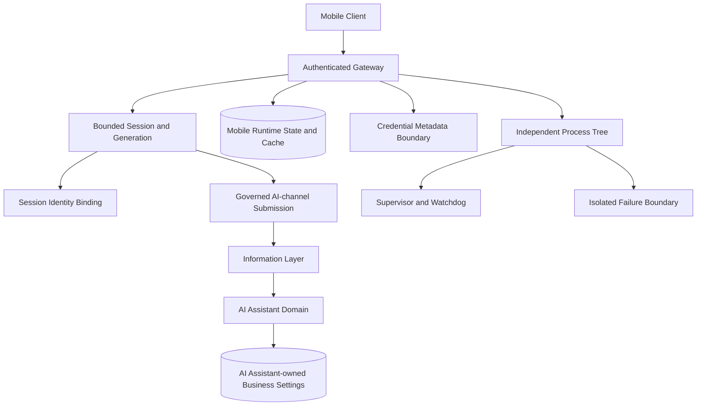

# Investment Mobile 完整架構圖

Investment Mobile 是獨立 runtime；其 cache 與連線狀態不得升格為 AI Assistant 的正式業務資料。

同步基線：A528、A537、A538、A540；獨立工具啟動與關閉各自上限 5 秒，逾時 fail-closed。

連線一律經 DSN 用途分離與工作階段識別綁定（交易區域 GUC：actor／module／request／decision／correlation）；備份或管理用途 DSN 在 runtime context 中不可用。憑證只允許中繼資料（HMAC-SHA256 指紋），不得存放或傳輸明文；敏感寫入遇過期 `gptbridge.security_generation` 一律 fail-closed。行動端輸出與快取不具權威，正式業務資料以 AI Assistant 領域狀態與 PostgreSQL canonical 為準。
