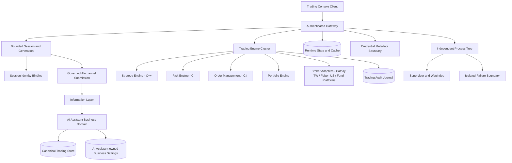

# Investment Mobile 完整架構圖（星澄 AI 投資管理與自動操盤系統）

Investment Mobile 是獨立 runtime，承載交易引擎群；其 cache、runtime journal 與連線狀態不得升格為 AI Assistant 的正式業務資料。星澄只產生分析與候選交易訊號；正式交易決策由獨立策略引擎與風控引擎處理。

工具內邏輯領域（`trading/domains.py` 唯一宣告）：market-data、instrument、portfolio、strategy、risk、trading、broker、mutual-fund、ai-analysis、backtest、audit。固定管線：MarketData → Strategy → TradingSignal → TradeProposal → RiskEngine → OrderRequest → OrderReceipt → BrokerAdapter → Execution → Portfolio。AI 僅能經 ai-analysis 邊界提出 TradeProposal；不得修改風控條件、不得直接呼叫 BrokerAdapter。

券商模型：CATHAY_SECURITIES（台股）、FUBON_SUBBROKERAGE（美股複委託）、MUTUAL_FUND_PROVIDER（泛型、未指定平台；驗證前僅人工匯入）。帳戶、資金、持倉、委託、成交、費用、權限逐券商隔離；PAPER 一律使用獨立模擬帳戶（paper-*），模擬結果標記 simulated，不得冒充真實交易。

交易模式：ANALYSIS（預設）→ SHADOW → PAPER → LIVE。LIVE 必須具備明確人工授權紀錄且目標券商 Adapter 的官方 API 已驗證，否則一律 fail-closed；券商 API 未驗證前僅允許分析、建議與模擬交易。

同步基線：A528、A537、A538、A540；獨立工具啟動與關閉各自上限 5 秒，逾時 fail-closed。

連線一律經 DSN 用途分離與工作階段識別綁定（交易區域 GUC：actor／module／request／decision／correlation）；備份或管理用途 DSN 在 runtime context 中不可用。憑證只允許中繼資料（HMAC-SHA256 驗證摘要），不得存放或傳輸明文；敏感寫入遇過期 `gptbridge.security_generation` 一律 fail-closed。行動端輸出與快取不具權威，正式業務資料以 AI Assistant 領域狀態與 PostgreSQL canonical 為準。

本工具規範只存於本工具邊界；中央僅保存定位與權限索引，不複製規範內容。
