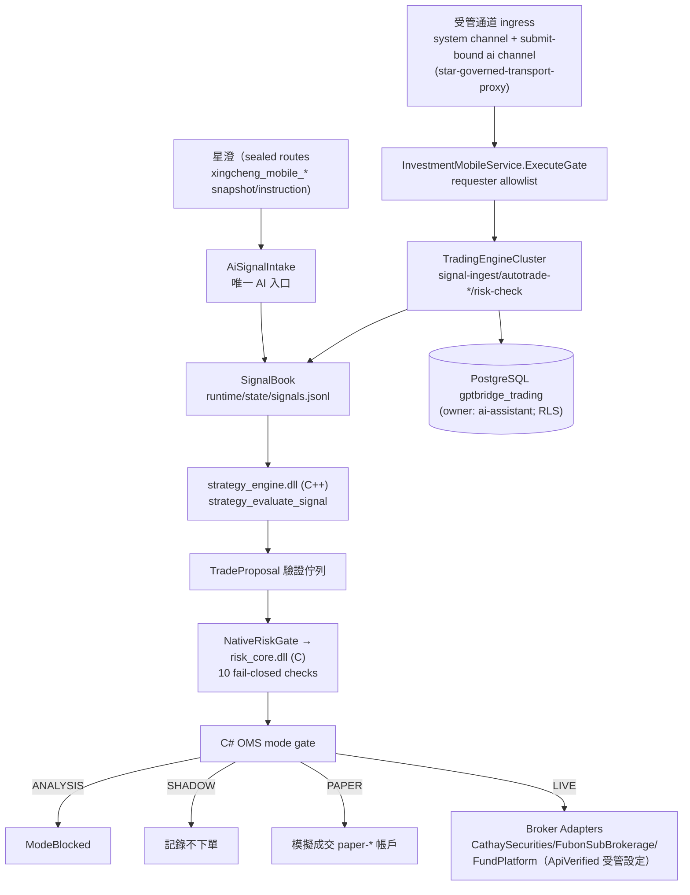

# Investment Mobile／投資管家手機版完整架構圖

```mermaid
flowchart TB
  CHAN["受管通道 ingress<br/>system channel + submit-bound ai channel<br/>(star-governed-transport-proxy)"] --> GATE["InvestmentMobileService.ExecuteGate<br/>requester allowlist"]
  GATE --> CLUSTER["TradingEngineCluster<br/>signal-ingest/autotrade-*/risk-check"]
  XC["星澄（sealed routes<br/>xingcheng_mobile_* snapshot/instruction)"] --> INTAKE["AiSignalIntake<br/>唯一 AI 入口"]
  INTAKE --> SIG["SignalBook<br/>runtime/state/signals.jsonl"]
  CLUSTER --> SIG
  SIG --> STRAT["strategy_engine.dll (C++)<br/>strategy_evaluate_signal"]
  STRAT --> PROPOSAL["TradeProposal 驗證佇列"]
  PROPOSAL --> RISKG["NativeRiskGate →<br/>risk_core.dll (C)<br/>10 fail-closed checks"]
  RISKG --> OMS["C# OMS mode gate"]
  OMS -->|ANALYSIS| BLOCKED["ModeBlocked"]
  OMS -->|SHADOW| RECORD["記錄不下單"]
  OMS -->|PAPER| SIM["模擬成交 paper-* 帳戶"]
  OMS -->|LIVE| ADAPT["Broker Adapters<br/>CathaySecurities/FubonSubBrokerage/<br/>FundPlatform（ApiVerified 受管設定）"]
  CLUSTER --> PG[("PostgreSQL gptbridge_trading<br/>(owner: ai-assistant; RLS)")]
```

`investment-mobile` 是獨立工具（`shared_permission_owner`/`business_layer_owner: ai-assistant`）。**現況修正佔位圖**：本工具**無 Mobile UI、無 socket gateway**（`has_custom_ui:false`；`ALLOW_LAN/PORT` env 已宣告未被消費）——ingress 全走受管共享通道；領域層是 **C#（OMS/Service）+ C（risk_core）+ C++（strategy_engine）**，不是 F#。`native_entry: dist/InvestmentMobile.ToolHost.exe` 未建置，受管啟動目前 fail-closed。

管線：AI/外部訊號僅能經 `AiSignalIntake` 進入 append-only `SignalBook`（`signals.jsonl`）；`strategy_evaluate_signal`（C++，無市場/網路/持久化決策權）產 `TradeProposal`；每筆過 `risk_evaluate_order`（C，10 項連續 fail-closed 檢查：市場白名單/量/價/名目/日單數/日虧損/持倉權重/未平倉/現金緩衝；DLL 缺席→`RISK_ENGINE_UNAVAILABLE`）；OMS 模式閘門：ANALYSIS→ModeBlocked、SHADOW→只記錄、PAPER→模擬成交、LIVE→僅經 `ApiVerified` adapter；`AutoTradingEngine` 於 Live 啟動即 `LIVE_PHASE_LOCKED`，RiskHalt 恢復僅 `governance/main-system`，AI_ASSISTED 顧問證據 `ok:false` → `MODEL_BLOCKED`。

資料權威：PostgreSQL `gptbridge_trading`（migrations 134–144、RLS、`audit_event` append-only）由 `ai-assistant` 擁有；本工具不得直寫（`deny: direct-database-write`），正式寫入經受管 outbox ops，`signals.jsonl` 為執行期鏡像。星澄只提供顧問分析訊號（`signal_owner: xingcheng-analysis-only`），正式交易由策略與風控引擎決定；`trading_system` 的 20 域/9 引擎為契約規格，其市場資料引擎等元件原生移植進行中。
