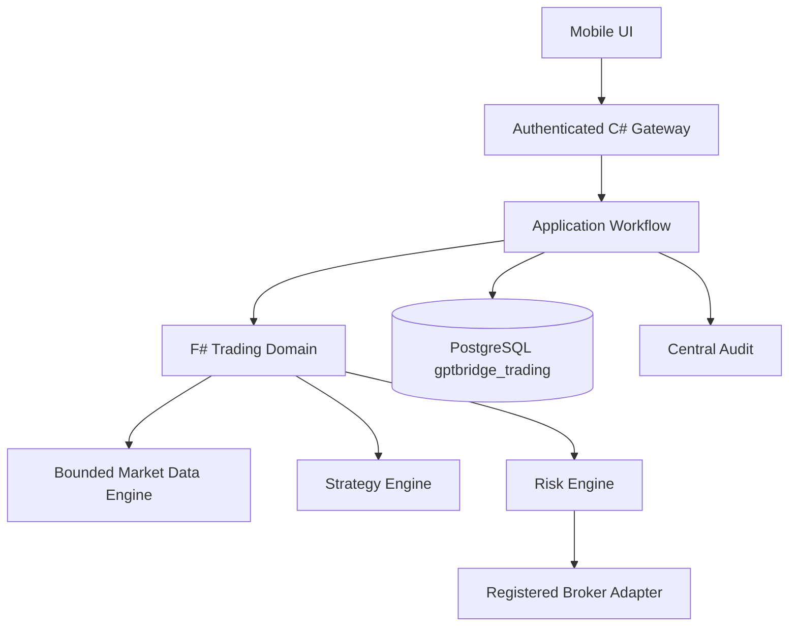

# Investment Mobile／投資管家手機版完整架構圖

```mermaid
flowchart TB
  MOBILE[Mobile UI] --> GATEWAY[Authenticated C# Gateway]
  GATEWAY --> APP[Application Workflow]
  APP --> DOMAIN[F# Trading Domain]
  DOMAIN --> MARKET[Bounded Market Data Engine]
  DOMAIN --> STRATEGY[Strategy Engine]
  DOMAIN --> RISK[Risk Engine]
  RISK --> BROKER[Registered Broker Adapter]
  APP --> PG[(PostgreSQL gptbridge_trading)]
  APP --> AUDIT[Central Audit]
```

`investment-mobile` 是獨立工具，擁有四層邊界：Mobile UI、Authenticated Gateway、Application／Domain、Broker Adapter。行情來源必須標記 realtime、delayed 或 verified；未驗證及過期行情不得用於實盤決策。星澄只能提供分析與候選訊號，正式交易由策略與風控引擎決定。PostgreSQL `gptbridge_trading` 是唯一正式資料儲存，不得建立 SQLite、JSONL 或其他平行鏡像。

Gateway 預設只接受 loopback；LAN 必須使用安全傳輸、配對、短期 session、速率限制與可撤銷憑證。視窗關閉須在 5 秒內停止自身後端。
