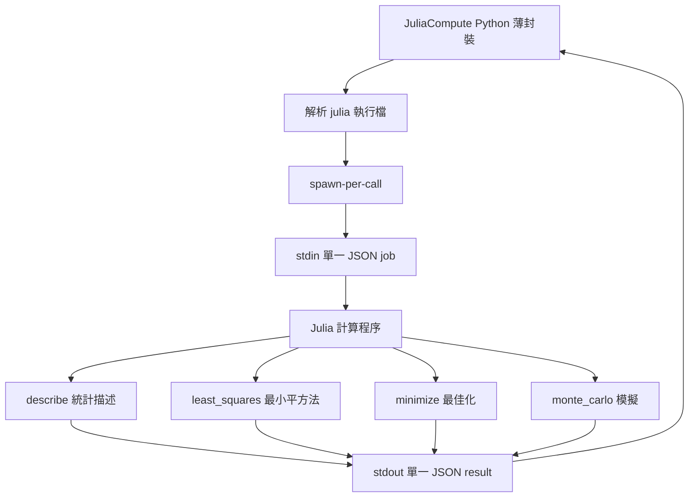

# Julia 計算完整架構圖

`julia-compute` 是獨立服務（`standalone-service`，按需啟動），法典 A610 指定的統計／科學計算與最佳化／模擬正式執行 owner。唯一受管入口是 Python 薄封裝（`main-system/src-core/core_system/julia_compute.py` → `JuliaCompute`）；Julia 執行檔解析順序為 `JULIA_EXE` 環境變數 → PATH → `%LOCALAPPDATA%\Programs\Julia-*` → `Program Files\Julia-*`（取最高版本），找不到即 fail-closed。

契約為 `julia-compute/v1`（`Standalone tools/julia-compute/CONTRACT.md`）：spawn-per-call，stdin 單一 JSON job → stdout 單一 JSON result；唯一外部依賴為 `JSON.jl`（其餘 Statistics／LinearAlgebra／Random 皆為 Julia stdlib，無網路需求），`Manifest.toml` 與 `.julia/` 為 gitignore 產物。所有失敗 fail-closed。

同步基線：A537、A538。
