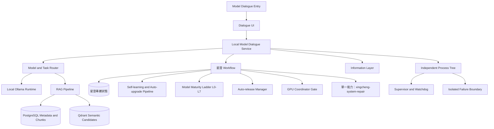

# Local Model／星澄完整架構圖

模型核心與網路功能保持分離；RAG、模型輸出及候選資料均不得自行取得治理權威。

同步基線：A528、A537、A538、A540；獨立工具啟動與關閉各自上限 5 秒，逾時 fail-closed。

本地模型預設為關閉，不參與系統預設啟動。前端提供獨立啟動／關閉開關；啟動必須由使用者明確觸發或有效單項許可，關閉後禁止自動重啟。對話送出而模型未啟動時，`ModelServiceActivationBroker` 依受治理 `ToolboxService.start_tool` 路徑背景啟用（稽核、節流、過期請求忽略），對話端顯示啟動進度。

星澄的神經網路核心為第一方原生實作：自有 tokenizer、自有 Transformer 權重、自有訓練引擎（語料、預訓練、監督微調、偏好訓練、checkpoint）與原生推論引擎（context、KV cache、sampling、量化）。原生模型必須能在不依賴外部模型產生答案的前提下獨立完成基本語言模型推理。

Ollama 僅為本地專家與教師模型，用以產生受治理的訓練資料與專家諮詢，不得取代星澄本身的神經網路核心。權重替換一律經明確流程與審計，不得自動生效。

原生推論引擎的正式啟用開關為工具自有設定 runtime/settings/native-engine.json（工具行程環境受 allowlist 限制，不倚賴環境變數）。啟用後所有生成改走自有權重並 fail-closed，不靜默回退第三方模型；每次原生推論寫入可驗證執行帳本，內含 checkpoint 雜湊、prompt 與輸出雜湊及時間戳，供事後稽核。

原生引擎具備受控面：可啟用／停用（enable/disable）、可指定 checkpoint、可設定生成預設（temperature、top_k、top_p、repetition_penalty、max_new_tokens、seed），並有兩道輸出護欄——品質護欄（過短、亂碼、高度重複時改回受控訊息）與範圍閘門（未命中允許主題清單時直接回覆受控訊息，不進行生成）。控制指令：`python -m xingcheng.infrastructure.native_engine --status|--enable|--disable|--set-checkpoint <path>`。

資源負擔受控：GPU 可用時一律使用 GPU 推論；CPU 路徑以 cpu_threads 限制 torch 執行緒（預設核心數 1/4、上限 4）並以 cpu_max_new_tokens 限制單次生成（預設 64），訓練 CLI 於 CPU 訓練時同樣限制執行緒（--cpu-threads，預設核心數一半、上限 8），避免與主系統爭用全部核心。GPU 訓練與引擎載入一律先經 `gpu_coordinator` 閘門：訓練等待 `gpu_required_mb`（預設 2500）可用顯存、逾時 fail-closed（`EXECUTOR_GPU_BUSY`）；引擎載入逾時降級 CPU（`gpu_budget_downgraded`）並寫入執行帳本，不與其他任務爭搶顯存。閒置逾時（預設 300 秒）或記憶體壓力時，`AutoReleaseManager` 會逐出快取引擎；進行中的生成持有自身強參考並正常完成。

KV Cache 已完備：prefill、decode、cache update、position tracking、causal consistency、GQA KV layout 六項皆有測試鎖定；儲存精度支援 FP32／FP16／BF16 與 INT8（INT8 採 per-token、per-head 對稱量化，尺度逐 token 保存，絕不以單一尺度覆蓋序列）。量化僅降低記憶體，不得犧牲生成品質：greedy 生成必須與 FP 完全一致，長上下文困惑度差異需在容忍度內（實測 384 tokens：BF16 +0.007%、INT8 +0.025%，KV 記憶體 624KB→312KB→166KB）。

Triton 自研 kernel（RMSNorm／SwiGLU／RoPE）預設關閉（品質優先）：這些 kernel 不帶 autograd，需要梯度時一律退回 PyTorch 實作，否則訓練梯度會在正規化／激活／位置編碼處斷裂而不收斂；且目前即使在推論下，模型層級困惑度與延遲仍不及 PyTorch 參考實作，必須以 set_triton_kernels(True) 顯式開啟並完成逐層驗證後才可用於正式推論。GQA 下 RoPE kernel 的 launch 參數必須逐張量計算（k 的 head 數少於 q）。

人格以對話為唯一使用者入口：對話中輸入「設定人格：…」「把人格設為：…」即寫入受治理的 identity 儲存（版本歷程與稽核），「你的人格是什麼？」顯示現值，「清除人格」重設；人格由伺服器端於每次推論前以「星澄人格設定：／使用者最新訊息：」標記套用，用戶端不保存、不傳送人格，範圍閘門僅判定標記後的使用者訊息。對話視窗不提供人格編輯器。

自我學習與自動升級：從各角色資料庫收集已驗證且品質合格的訓練範例，累積達門檻即匯出 `star-transformer-sft/v1` 快照、註冊資料集、排入受治理 SFT 工作，並以現行權重為基線跑評估套件；全數通過才註冊、`stage` 並（在 `auto_activate` 時）`activate`，同時更新生命週期與原生引擎指向並修剪前一代。任一失敗一律 fail-closed：現行權重、執行期 checkpoint 與 adapter registry 不被觸碰。政策：`runtime/settings/self-learning.json`（`enabled=false` 為 kill switch）。成熟度階梯 `star-model-maturity/v1` 僅由已執行測試認證（L0 structure／L1 forward-backward／L2 overfit／L3 effective pretrain／L4 generation／L5 dialogue／L6 reasoning-tools／L7 controlled evolution），參數量只列證據、不得作為判準；首個 fail／skipped 即封頂。資料保留政策 `star-retention-policy/v1` 依數量與年齡修剪舊工作目錄、日誌與報告，任何被 `lifecycle.json` 或 `native-engine.json` 指涉的路徑永不刪除（無法解析者 fail-closed 保留）。對外只存在一個 `xingcheng-system-repair` 能力，名稱固定「自我學習與自動編程」；自動修復與自動學習僅為其內部實作。
