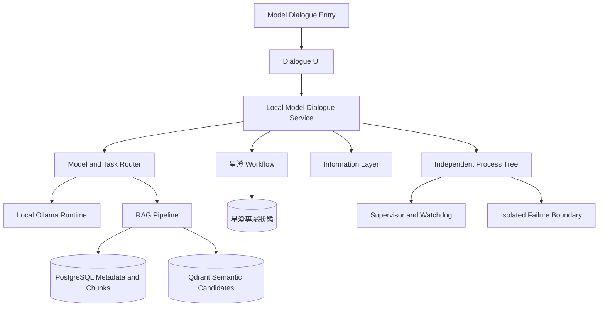

# Local Model／星澄完整架構圖

```mermaid
flowchart TB
  ENTRY[Model Dialogue Entry] --> UI[Dialogue UI]
  UI --> SERVICE[Local Model Dialogue Service]
  SERVICE --> ROUTER[Model and Task Router]
  ROUTER --> OLLAMA[Local Ollama Runtime]
  ROUTER --> RAG[RAG Pipeline]
  RAG --> PG[(PostgreSQL Metadata and Chunks)]
  RAG --> QD[(Qdrant Semantic Candidates)]
  SERVICE --> XC[星澄 Workflow]
  XC --> PRIVATE[(星澄專屬狀態)]
  SERVICE --> INFO[Information Layer]
  SERVICE --> PROC[Independent Process Tree]
  PROC --> SUP[Supervisor and Watchdog]
  PROC --> FAULT[Isolated Failure Boundary]
```

模型核心與網路功能保持分離；RAG、模型輸出及候選資料均不得自行取得治理權威。
